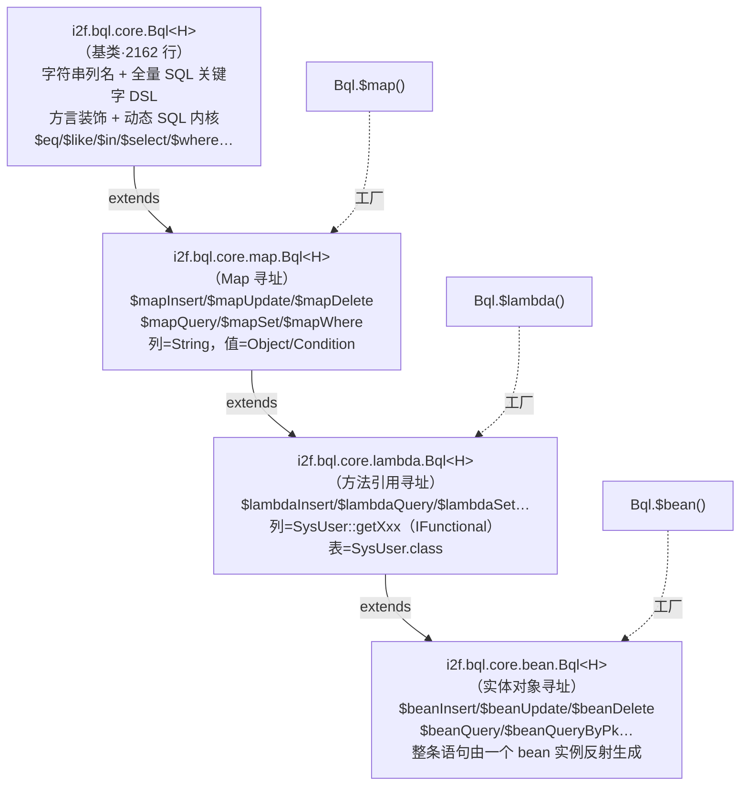
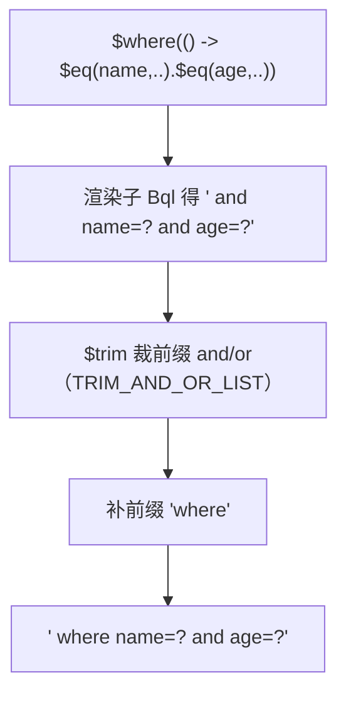
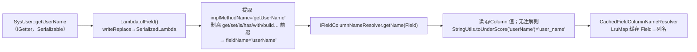

# i2f-bql

> 类型安全的**绑定查询语言（BQL, Bind Query Language）**流式构建器。它构建在 `i2f-bindsql` 的 `BindSql`（SQL 文本 + 绑定参数）之上，把「裸字符串拼 SQL」提升为一套完整的 **SQL DSL**：内建 DML/DDL/存储过程/游标关键字、方言自适应的标识符装饰（MySQL 反引号 / Oracle 双引号 / 关键字大小写）、以及「值为空即自动跳过、悬挂连接词自动裁剪」的动态 SQL 语义。核心亮点是**四级递进的列/表寻址方式**——从字符串列名，到 `Map`，到**方法引用**（`SysUser::getUserName` 经 Lambda 序列化解析为字段列名），再到**实体 Bean**（反射读取字段值成 CRUD），让不同场景选用不同的类型安全强度；最终以一个 `BindSql` 收尾，交给分页、文本化、JDBC 执行等下游消费。

## 模块路径

- `i2f-jdk/i2f-bql`

## 模块依赖

| GroupId | ArtifactId | Scope | Optional | 说明 |
|---------|-----------|-------|----------|------|
| i2f.turbo | i2f-bindsql | compile | false | 输出物 `BindSql`（`getSql()`/`getArgs()`/`new BindSql(sql, args)`），BQL 的最终产物 |
| i2f.turbo | i2f-annotations-core | compile | false | 注解核心语义库（`@Comment` 等自描述元注解） |
| i2f.turbo | i2f-annotations-db | compile | false | Bean↔表映射注解：`@Table`/`@Column`/`@Primary`/`@DbIgnore`，被 lambda/bean 寻址与实体 CRUD 反射读取 |
| i2f.turbo | i2f-lambda-core | compile | false | `Lambda.ofField(...)`：把可序列化方法引用（`SerializedLambda`）还原成 `Field`，是 lambda 列寻址的地基 |
| i2f.turbo | i2f-functional | compile | false | `IFunctional`/`IGetter`/`ISetter`/`IBuilder`/`IExecute` 五类**可序列化**函数式接口，方法引用列的载体 |
| i2f.turbo | i2f-lru-map | compile | false | `LruMap`：列名/表名解析结果缓存（`Cached*Resolver`） |
| i2f.turbo | i2f-container-builder | compile | false | `Builders.newMap/newList`（`MapBuilder`/`ListBuilder`），`$colMap`/`$valueMap` 等集合工厂 |
| i2f.turbo | i2f-reflect | compile | false | `ReflectResolver`：读注解、反射取字段值（bean CRUD 用） |
| i2f.turbo | i2f-text | compile | false | `StringUtils.toUnderScore`：驼峰字段名 → 下划线列名 |
| i2f.turbo | i2f-database-metadata-bean | compile | false | `BeanDatabaseMetadataResolver.getTableColumns/getTablePrimary`：实体类 → 表列/主键元数据 |
| org.projectlombok | lombok | provided | true | 编译期注解（`@Data`/`@NoArgsConstructor` 用于 `ConditionItem` 等），版本由父 POM 托管 |

> 本模块**无任何第三方运行期依赖**：`pom.xml` 声明的全部依赖都是 i2f 兄弟模块（`i2f-bindsql` 等），唯一的三方 `lombok` 被父 POM 统一托管为 `provided` + `optional`，不进入运行期类路径。核心能力构建于 JDK 的 `java.lang.reflect.Array`、`java.util`、`java.util.function` 与 Lambda 序列化之上。

## 模块设计

### 1. 四级递进的类继承链（列/表寻址能力逐层增强）

`i2f-bql` 的入口不是单个类，而是**一条按「类型安全强度」分层的继承链**——每一层只增加一种"用什么来表示列/表"的能力，越往下越类型安全、越依赖元数据：



- **`core.Bql`**：一切的地基。列名、表名都是 `String`，提供全量关键字方法（`select()`/`from()`/`where()`/`insert()`/`create()`/`varchar(int)`…）、条件方法（`$eq`/`$like`/`$in`/`$between`/`$exists`…）、以及动态 SQL 内核（`$if`/`$trim`/`$for`）。
- **`map.Bql`**：把「一组列/值」表达成 `Map<String,Object>` 或 `Collection<String>`，一次性生成 insert/update/delete/query；`where` 的 value 若为 `Collection`/数组自动转 `$in`、为 `Condition` 则委托其 `apply`。
- **`lambda.Bql`**：列用**方法引用**表达（`SysUser::getUserName`），表用 `Class<?>` 表达，编译期即可校验字段存在，运行期再解析成真实列名/表名。
- **`bean.Bql`**：直接吃一个**实体对象实例**，反射读取其字段（受 `@Table`/`@Column`/`@Primary`/`@DbIgnore` 约束）生成整条 CRUD。

### 2. 自引用泛型 `H extends Bql<H>`（CRTP）保持链式协变返回

每个方法都 `return (H) this;`，`H` 是「当前具体子类型」。这样在 `lambda.Bql` 上调用继承自 `core.Bql` 的 `$eq(...)` 后，返回值仍是 `lambda.Bql`，可以继续 `.col(SysUser::getX)`——避免了链式跨层「掉回基类、丢失子类型方法」。三个静态工厂 `$map()/$lambda()/$bean()` 分别把 `H` 具化到对应子类。

### 3. 方言与命名的三级配置（global → ThreadLocal → 实例）

列名/表名装饰器、关键字大小写、分隔符、别名、占位符等"环境性"配置，按三级优先级在 `refresh()`（构造时与方言切换时调用）中解析：

```mermaid
flowchart LR
    G["静态全局字段<br/>GLOBAL_UPPER_KEYWORDS<br/>GLOBAL_COLUMN_NAME_DECORATOR…<br/>（进程级默认）"]
    T["ThreadLocal 持有<br/>UPPER_KEYWORDS_HOLDER<br/>COLUMN_NAME_DECORATOR_HOLDER…<br/>（线程级覆盖）"]
    I["实例字段<br/>upperKeywords / columnNameDecorator<br/>link / separator / alias / placeholder<br/>（本次构建最终生效）"]
    G -->|global() 先取| I
    T -->|global() 后覆盖| I
    IT["InheritableThreadLocal local*<br/>store()/inherit()/unset()<br/>父构建器 → 子构建器 传递"] -.inherit().-> I
```

- `globalMysqlMode()`/`globalOracleMode()` 及其 `threadXxx()`/`dialectXxx()` 实例变体，一键切换装饰器（MySQL 反引号、Oracle 双引号、关键字大写）与 `columnAs` 引号策略。
- 装饰器**幂等**（`MYSQL_COLUMN_NAME_DECORATOR` 先判 `v.startsWith("`")`），故 `$col` 路径上「列名被装饰两次」也安全，不会被套成双重引号。
- `InheritableThreadLocal` 的 `local*` 配合 `store()/inherit()`：子查询构建器（如 `$where(() -> Bql.$_()...)`）会自动继承父构建器的 link/separator/装饰器/解析器等上下文。

### 4. 累积式 `LinkedList<BindSql>` + `$$()` 物化

`core.Bql` 内部维护 `LinkedList<BindSql> builder`，每次 `$(...)` 追加一个片段（片段自身即带 `?` 与 `args`）。`$$()` 把所有片段按序拼接成**一个** `BindSql`：

```java
public BindSql $$() {
    if (builder.size() == 1) return builder.get(0);
    StringBuilder sql = new StringBuilder();
    List<Object> args = new ArrayList<>();
    for (BindSql bql : builder) {
        sql.append(bql.getSql());   // 文本按序拼接
        args.addAll(bql.getArgs());  // 参数保持同序
    }
    return new BindSql(sql.toString(), args);
}
```

`addSeparator()` 在追加片段间插入分隔符（默认 `" "`），并智能跳过「上一片段已以分隔符结尾」的情况，避免多余空格。这就是 SQL 文本与绑定参数**始终同序流动**的保证，直接对接 `PreparedStatement`。

### 5. 动态 SQL 内核：`$if` / `$trim` / `$for`

三个原语支撑全部「条件拼接 + 连接词裁剪」语义（与 `i2f-bindsql` 的 `when/trim` 思路一致，但在 BQL 里以片段组合实现）：

- **`$if(val, filter, caller)`**：`filter.test(val)` 为假则整段跳过（默认谓词 `DEFAULT_FILTER` 判 null/空串/空集合/空数组）。
- **`$trim(val, filter, trimPrefixes, trimSuffixes, appendPrefix, appendSuffix, caller)`**：渲染子构建器后，裁掉首/尾指定 token，再按需加前后缀。`$where` 借此裁掉开头多余的 `and`/`or` 并补 `where` 前缀；`$in` 借 `... in (` / `)` 包裹；`$set` 裁剪逗号。
- **`$for(collection, separator, itemFilter, itemCaller)`**：遍历集合并用分隔符连接（`$forUnion`/`$forUnionAll` 以 `union`/`union all` 连接并裁剪）。



### 6. lambda 列寻址：方法引用 → 列名

`lambda.Bql` 是类型安全的核心。机制链路：



- 表名同理：`SysUser.class` → `IClassTableNameResolver` → 读 `@Table` 值，否则类名转下划线。
- 解析器有 **DEFAULT / ANNOTATION / UNDERSCORE** 三种策略常量，可经 `GLOBAL_*_RESOLVER` 或 `ThreadLocal` 或实例字段替换。
- 支持 `get/set/is/has/enable/with/build` 七种前缀的剥离，因此 getter、setter（`SysUser::setAge`）、builder 式方法引用都能还原到同一字段。

### 7. `Condition` 抽象与 Wrapper 声明式族（延迟渲染）

除链式即时构建外，模块另提供两套「**先记录、后渲染**」的声明式 API：

- **`Condition`**（`@FunctionalInterface`，`void apply(Bql<?>, String col)`）：把「某列上的一个谓词」封装成可存储对象。静态工厂 `$eq/$ne/$neq/$like/$isNull/$isNotNull/$lt/$lte/$gt/$gte/$instr/$in/$notIn/$exists/$notExists/$and/$or`，以及 `def(value)`——按值类型推断（null→`isNull`、集合/数组/Iterable→`in`、其它→`eq`）。`$mapWhere` 的多态 value 分派正依赖它。
- **`wrapper` 包**：`BqlWrapper extends Supplier<Bql<?>>`（附 `bindSql()`）。`ConditionWrapper` 收集 `List<ConditionItem>`（`and` 标志 + alias + 列 + `Condition`），`get()` 时惰性渲染成一个 `lambda.Bql`。其子类 `QueryWrapper`（`col/groupBy/orderBy`）、`UpdateWrapper`（`set/setNull` + 条件）、`DeleteWrapper`（条件）、`InsertWrapper`（`set`）构成 MyBatis-Plus `QueryWrapper` 风格的业务层友好 API；入口 `Bql.$queryWrapper()/$insertWrapper()/$updateWrapper()/$deleteWrapper()`。

### 包结构

```
i2f.bql.core
├── Bql                 基类：字符串列名 + 全量 DSL + 方言装饰 + 动态 SQL 内核
├── map.Bql             Map 寻址 CRUD
├── lambda.Bql          方法引用寻址 CRUD
├── bean.Bql            实体对象寻址 CRUD
├── condition
│   ├── Condition       单列谓词抽象（@FunctionalInterface）+ 工厂 + def 推断
│   └── ConditionItem   and/alias/column/Condition 的值对象（@Data）
├── lambda
│   ├── lambda          IFieldColumnNameResolver / IClassTableNameResolver
│   │   └── impl        Cached*(LruMap 缓存) + Default*(读 @Column/@Table / 下划线)
│   └── builder         ValueMapBuilder/ValueListBuilder/AliasMapBuilder（可放方法引用键）
└── wrapper             BqlWrapper + ConditionWrapper + Query/Insert/Update/DeleteWrapper
i2f.bql.test            SysUser/SysRole/SysDict + TestLambda（位于 main，跑 main() 演示）
```

## 模块目的

- **降低 SQL 构建的心智负担**：在 `BindSql`（纯文本 + 参数）之上提供贴近 SQL 语法的关键字 DSL 与条件 DSL，链式即得合法语句。
- **类型安全**：方法引用与实体 Bean 两级寻址把「列名拼写错误」从运行期提前到编译期，并让 Java 重命名重构能同步传导到查询代码。
- **方言可移植**：装饰器/关键字大小写/占位符集中配置，一套构建逻辑产出 MySQL、Oracle 等不同风格的标识符。
- **动态 SQL 一等公民**：值为空自动跳过、连接词自动裁剪，天然适配「按非空条件拼 where/set」的业务查询，无需手写 `1=1`。
- **两种风格并存**：即时链式（`$where(...)`）与声明式记录（Wrapper/Condition）覆盖不同使用偏好。
- **无缝衔接持久化族**：产物是标准 `BindSql`，直接被分页、文本化、JDBC 执行消费。

## 模块功能

| 能力域 | 代表方法 | 说明 |
|--------|----------|------|
| 入口工厂 | `Bql.$map()/$lambda()/$bean()`、`$queryWrapper()/$insertWrapper()/$updateWrapper()/$deleteWrapper()` | 选择寻址层级或声明式 Wrapper |
| 条件构建 | `$eq/$ne/$neq/$like/$isNull/$isNotNull/$lt/$lte/$gt/$gte/$instr/$in/$notIn/$between/$exists/$notExists` | 空值自动跳过；`$in` 支持集合/数组，`$instr` 生成 `instr(col,?)>0` |
| 语句结构 | `$select/$from/$join/$on/$where/$set/$groupBy/$orderBy/$and/$or/$bracket/$into/$values` | 各结构均走 `$trim`，自动裁剪悬挂 `and/or`、逗号并补关键字 |
| 关键字 DSL | `select()/from()/insert()/update()/delete()/create()/drop()/alter()/truncate()/primary()/key()/unique()/index()/foreignKeyReferences()/varchar(int)/datetime()/limit()/union()/case()/when()/begin()/loop()/cursor()/fetch()…` | 覆盖 DML/DDL/存储过程/游标/控制流/列类型，可按 `upperKeywords` 大写 |
| 动态 SQL | `$if/$trim/$for/$forUnion/$forUnionAll/$each/$concat/$format` | 集合展开、条件拼接、union 归并、逐条拼接 |
| 方言配置 | `globalMysqlMode()/globalOracleMode()/threadXxx()/dialectXxx()`、`columnNameDecorator()/tableNameDecorator()/upperKeywords()` | 三级配置，InheritableThreadLocal 向子构建器传播 |
| Map CRUD | `$mapInsert/$mapInsertBatchValues/$mapInsertBatchUnionAll/$mapUpdate/$mapDelete/$mapQuery/$mapSet/$mapWhere` | 以 `Map<String,Object>`/`Collection<String>` 表达列与值 |
| Lambda CRUD | `$lambdaInsert/$lambdaUpdate/$lambdaDelete/$lambdaQuery/$lambdaSet/$lambdaSelect(Ex)` | 列用方法引用、表用 `Class<?>`；`$lm(...)` 桥接方法引用为键 |
| Bean CRUD | `$beanInsert/$beanInsertBatchValues/$beanUpdate/$beanDelete/$beanQuery/$beanQueryByPk/$beanDeleteByPk` | 反射读实体字段值，`@DbIgnore` 排除、`@Primary` 定位主键 |
| 列渲染 | `$col/$colAs/$colMap/$valueMap/$colList`、`decorateColumnName()` | 生成 `alias.column as "as"` 并应用装饰器 |
| 声明式 Wrapper | `QueryWrapper.col()/groupBy()/orderBy()`、`UpdateWrapper.set()/setNull()`、`Condition` 工厂 | 记录 `ConditionItem` 后 `get()`/`bindSql()` 渲染 |
| 产物 | `$$()` → `BindSql` | 交下游分页/文本化/JDBC |

## 模块主要使用方法

### 字符串 DSL（`core.Bql`）

```java
// 带条件的查询：值为 null 的条件自动跳过，悬挂 and 自动裁剪
BindSql sql = Bql.$_()
        .select().$col("*")
        .$from("sys_user")
        .$where(() -> Bql.$_()
                .$eq("status", 1)
                .$like("username", "zhang")   // username like ?
                .$eq("del_flag", null))        // null → 整段跳过
        .$$();
// -> select * from sys_user  where status = ? and username like ?
```

### 方法引用（`lambda.Bql`）——类型安全

```java
// 用 SysUser::getXxx 方法引用代表列，SysUser.class 代表表
BindSql sql = Bql.$lambda()
        .$select(() -> Bql.$lambda().$sepComma()
                .$col(SysUser::getUserName)   // -> username（@Column("username")）
                .$col(SysUser::getAge))
        .$from(SysUser.class)                  // -> sys_user（@Table("sys_user")）
        .$where(() -> Bql.$lambda()
                .$eq(SysUser::getUserName, "admin")
                .$gte(SysUser::getAge, 18))
        .$$();
```

### 声明式 Wrapper

```java
BindSql sql = Bql.$queryWrapper()
        .from(SysUser.class).alias("a")
        .col(SysUser::getId)
        .col(SysUser::getUserName, "userName")     // 列 as 别名
        .cond(SysUser::getId, 1)
        .or()
        .cond(SysUser::getUserName, Condition.$like("zhang"))
        .get().$$();
```

### 实体 Bean CRUD

```java
SysUser user = new SysUser();
user.setStatus(1);
user.setDelFlag(0);
// 反射读取非忽略字段作为 where，@DbIgnore 字段（statusDesc/roleName…）被排除
BindSql sql = Bql.$bean().$beanQuery(user).$$();
```

### 方言切换

```java
Bql.globalMysqlMode();   // 之后所有构建：列/表加反引号、关键字小写
Bql.globalOracleMode();  // 双引号 + 关键字大写
// 或仅当前构建器：Bql.$lambda().dialectThreadMysql()....
```

### 注意事项

- **入口层级要匹配需求**：需要方法引用/实体请从 `$lambda()`/`$bean()` 起步，`$_()`（基类）只接受字符串列名。
- **`$col` 路径列名会被装饰两次**：因装饰器以 `startsWith` 保证幂等，结果正确；但若自定义装饰器不幂等则需留意。
- **Bean/Lambda CRUD 依赖 `@Table`/`@Column` 元数据**：无注解时按「驼峰→下划线」推断列名/表名；`$beanXxxByPk` 要求 `@Primary`，缺失抛 `IllegalArgumentException`。
- **动态跳过依赖默认过滤器**：`$eq(col, null)`、`$like(col, "")` 等不会生成条件——若确需 `= null` 请用 `$eqNull(col)` / `$isNull(col)`。
- **参数化优先**：条件值一律走 `?` + `args`，不要手工字符串拼接字面量。

## 模块特性总结

- **分层类型安全**：字符串 → Map → 方法引用 → 实体 Bean 四级继承链，按需选择编译期校验强度。
- **CRTP 自引用泛型**：`H extends Bql<H>` 让跨层链式保持具体子类型，不丢方法。
- **方言自适应**：三级（全局/线程/实例）+ `InheritableThreadLocal` 传播的标识符装饰与关键字大小写。
- **动态 SQL 一等公民**：`$if`/`$trim`/`$for` 内核，值空即跳过、悬挂连接词/逗号自动裁剪。
- **参数化到底**：`LinkedList<BindSql>` 累积、`$$()` 按序物化，文本与参数同序流动。
- **两种风格并存**：即时链式 + `Condition`/`Wrapper` 声明式延迟渲染。
- **方法引用解析健壮**：支持 getter/setter/builder 等 7 种前缀剥离，`SerializedLambda` + LRU 缓存。
- **零三方运行期依赖**，与 `i2f-bindsql`/`-page`/`-stringify`/`i2f-jdbc-bql` 无缝衔接。

## 已知实现瑕疵（源码核实）

> 与 `i2f-bindsql` 的 `set()/or()` 缺陷同源，本模块亦有两处疑似复制粘贴/笔误，使用前应规避：

1. **`ConditionWrapper.exists(ISetter, Supplier)` 用错条件**：getter 版正确委托 `Condition.$exists(caller)`，但 setter 版却写成 `cond(setter, Condition.$ne(caller))`（应为 `$exists`）——以 setter 方法引用构造 `exists` 子查询时语义错误。规避：`exists` 子查询统一用 `IGetter` 版或直接用 `Condition.$exists(...)`。
2. **`$trim` 的"后缀裁剪"实际按前缀判断**：`trimSuffixes` 循环体用 `sql.startsWith(item)` 判断后再 `substring(0, len-item.length())`，逻辑与"裁尾"不符（应为 `endsWith`）。影响所有依赖尾裁剪的场景（如结尾多余 `and/or`、逗号）。多数内建用法因数据形态未暴露，但自定义尾裁剪 token 时需警惕。

（附带：`$between` 仅在单边满足时降级为 `$gte`/`$lt`；`TestLambda` 位于 `src/main` 而非 `src/test`，`i2f-database-metadata-bean` 等因此是 compile 依赖。）

## 下游消费（grep 核实）

- `i2f-jdbc-bql` 的 `BqlTemplate extends JdbcTemplate`：以 `Bql.$bean()` 生成 CRUD 的 `BindSql` 并直接执行 `insert/update/find/list/page`——BQL 的运行期落地入口。
- `i2f-jdbc-proxy`（`BaseMapperSqlProvider`）、`i2f-translate-en2zh`、`i2f-translate-zh2pinyin` 使用 `bean.Bql` 生成查询。
- `i2f-jdk-all` 聚合本模块。
