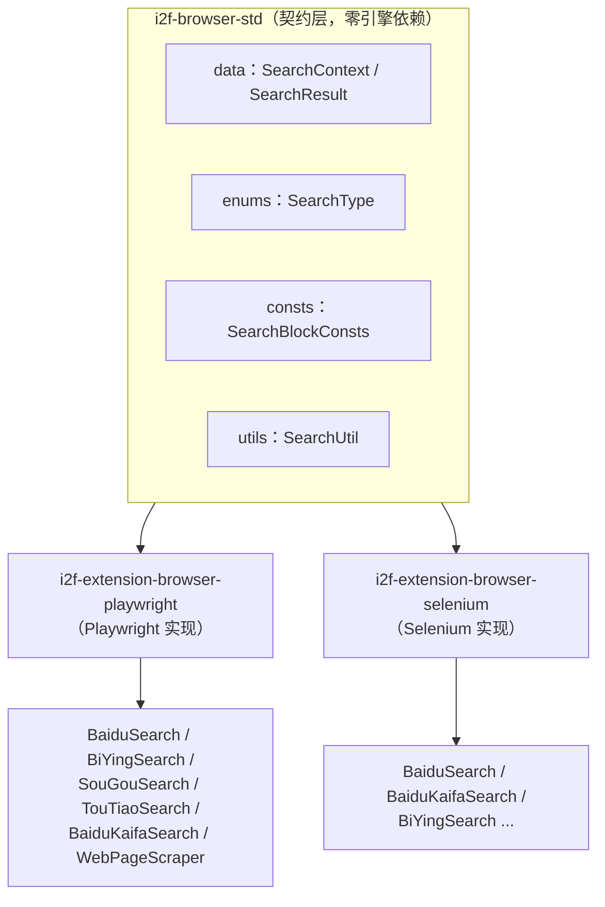
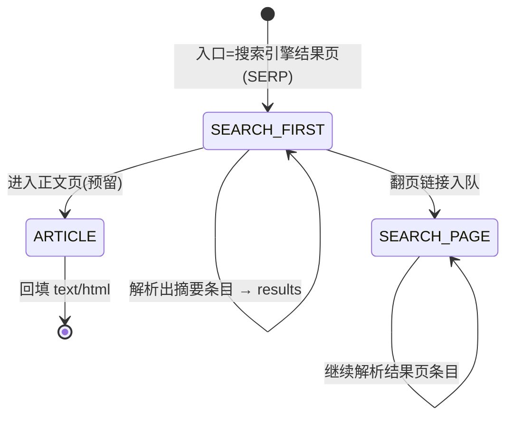
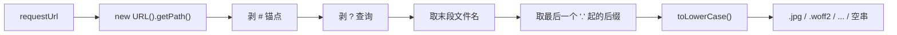

# i2f-browser-std

> 浏览器**搜索引擎抓取标准契约层**（browser-std）。以 `std`（standard）命名延续 `i2f-ai-std`/`i2f-clock-std` 的「契约与实现分离」范式——本模块**不含任何浏览器引擎代码**，只沉淀搜索引擎抓取场景里「各实现共用」的四类底座：统一出参模型 `SearchContext`/`SearchResult`、驱动队列爬行的 `SearchType` 阶段枚举、无头抓取时「屏蔽图片/音视频/字体」的共享策略常量 `SearchBlockConsts`、以及从 URL 解析文件后缀的 `SearchUtil.resolveUrlSuffix`。它是 `i2f-extension-browser-playwright`（微软 Playwright）与 `i2f-extension-browser-selenium`（Selenium）两套真实抓取实现的**共同上游契约**，让「百度/必应/搜狗/头条/开发者搜索」等不同引擎、不同驱动产出的结果结构一致、网络拦截策略一致。自身仅依赖 lombok（provided/optional），零 i2f 内部依赖、零三方运行期依赖。

## 模块路径

- `i2f-jdk/i2f-browser-std`

## 模块依赖

| GroupId | ArtifactId | Scope | Optional | 来源 | 用途 |
| --- | --- | --- | --- | --- | --- |
| org.projectlombok | lombok | provided | 是 | 三方（根 POM `dependencyManagement` 托管） | `SearchContext`/`SearchResult` 上的 `@Data`/`@NoArgsConstructor`，编译期生成 getter/setter/构造器，运行期不需要 |

- **内部依赖**：无（本模块是全仓库最底层的浏览器抓取契约，不引任何 i2f 兄弟模块）。
- **三方运行期依赖**：无。`SearchBlockConsts`/`SearchUtil` 仅用 JDK（`java.util.concurrent.CopyOnWriteArraySet`、`java.net.URL`）。
- 构建仅配 `maven-assembly-plugin`，与其它 `i2f-jdk` 模块一致。

## 模块设计

`std` 后缀是本仓库「标准/契约模块」的固定约定：先定义与引擎无关的数据与语义，再由 `-impl`/`extension` 模块各自落地。本模块按 `data` / `enums` / `consts` / `utils` 四个子包切分职责。



### 统一出参模型（data）

- `SearchResult`：单条结果，5 个 `String` 字段——`url` / `title` / `description` / `text` / `html`。前三个是「搜索引擎列表页摘要」，`text`（正文纯文本 `body.innerText`）与 `html`（清洗后整页源码）用于把**文章详情页**也带回。
- `SearchContext`：一次搜索的总上下文——`question`（原始提问）+ `List<SearchResult> results`（攒齐的结果）。搜索方法统一以 `SearchContext` 为返回类型。
- 两者都是 `@Data @NoArgsConstructor` 纯 POJO，`protected` 字段留待子类/序列化，由 Playwright 与 Selenium 两套实现**共同 new、共同填充**。

### 爬行阶段语义（enums.SearchType）

抓取被建模为「一条待办队列 + 按阶段分派」，`SearchType` 就是队列元素上标注的阶段标签：



- `SEARCH_FIRST`：搜索引擎**第一结果页**，既能抽条目、又能发现翻页链接、还可能带 AI 摘要；导航超时放宽到 60s。
- `SEARCH_PAGE`：由翻页链接得到的**后续结果页**，只抽条目。
- `ARTICLE`：**正文/详情页**阶段（契约保留值），用于把 `text`/`html` 抓回的语义标注；当前两套扩展以 `WebPageScraper` 独立承载正文抓取，队列里主要用到 `SEARCH_FIRST`/`SEARCH_PAGE`。

消费方把 `Map.Entry<SearchResult, SearchType>` 放入 `LinkedBlockingDeque`，出队时 `switch(entry.getValue())` 决定「按结果页解析并再入队」还是「按正文页回填」。

### 共享拦截策略（consts.SearchBlockConsts）

无头抓取为了**省带宽、提速、避反爬**，会在网络层直接掐掉非文本资源。策略以 `interface` 常量持有者形式集中定义：

- `BLOCK_RESOURCE_TYPE`：按 MIME 资源类型屏蔽——`image` / `media` / `font`。
- `BLOCK_URL_SUFFIX`：按 URL 文件后缀兜底屏蔽——图片（jpg/png/gif/jpeg/svg/webp/bmp）、音视频（mp3/ogg/avi/wav/mp4/mkv/rmvb/flv/m3u8/ts/hls）、字体（ttf/woff/woff2）。
- 二者都是 `CopyOnWriteArraySet`：**全局共享且运行期可变**——使用方可在启动后 `add(...)` 追加新的屏蔽类型/后缀，无需改代码重启；读多写极少场景下遍历无锁、无 `ConcurrentModificationException`。

### URL 后缀解析（utils.SearchUtil）

`resolveUrlSuffix(requestUrl)` 与 `BLOCK_URL_SUFFIX` 配套，把「带查询串/锚点/目录路径」的 URL 归一化为**小写、含前导点**的文件后缀（无后缀或解析失败返回 `""`）：



### 依赖关系

- 被 `i2f-extension-browser-playwright`、`i2f-extension-browser-selenium` 直接依赖（引擎实现的契约上游）。
- 被聚合门面 `i2f-jdk-all` 汇总引入。
- 自身不依赖任何 i2f 兄弟模块，处于浏览器族的**最底层**。

## 模块目的

- **契约与实现分离**：把「抓取产出什么结构、分几个阶段、屏蔽哪些资源」从具体驱动中抽离，Playwright/Selenium 二选一甚至并存时，上层拿到的都是同一套 `SearchContext`。
- **策略集中且可调**：`SearchBlockConsts` 用运行期可变的并发 Set 收敛拦截名单，避免各引擎实现各写一份、各自漂移。
- **零依赖下沉**：作为纯 JDK + lombok 的叶子契约，任何浏览器扩展都能安全依赖，不引入传递性重量依赖。

## 模块功能

| 能力 | 载体 | 说明 |
| --- | --- | --- |
| 单条结果模型 | `SearchResult` | url/title/description/text/html，兼容「列表摘要」与「正文页」两种产出 |
| 搜索上下文模型 | `SearchContext` | question + results 列表，搜索方法统一返回类型 |
| 爬行阶段标注 | `SearchType` | SEARCH_FIRST / SEARCH_PAGE / ARTICLE 驱动队列分派 |
| 资源屏蔽名单 | `SearchBlockConsts` | 按 MIME 类型 + 按 URL 后缀双层，`CopyOnWriteArraySet` 运行期可变 |
| URL 后缀归一 | `SearchUtil.resolveUrlSuffix` | 剥锚点/查询、取末段、取小写含点后缀，供后缀黑名单命中 |

## 模块主要使用方法

本模块是契约层，通常由浏览器扩展实现方（Playwright/Selenium）import 使用，业务侧直接消费其产出模型。

### 1）作为搜索实现的出参契约

```java
// 引擎实现内部：攒结果到 SearchContext
SearchContext context = new SearchContext();
context.setQuestion(question);
context.setResults(new ArrayList<>());

SearchResult result = new SearchResult();
result.setUrl(href);
result.setTitle(itemArr[0]);
result.setDescription(itemArr[1]);
context.getResults().add(result);
// 正文页再补：result.setText(body.innerText()); result.setHtml(page.content());
return context;
```

### 2）按 SearchType 驱动队列爬行

```java
LinkedBlockingDeque<Map.Entry<SearchResult, SearchType>> urlQueue = new LinkedBlockingDeque<>();
// 入口：搜索结果第一页
urlQueue.addLast(new AbstractMap.SimpleEntry<>(first, SearchType.SEARCH_FIRST));

Map.Entry<SearchResult, SearchType> entry = urlQueue.pollFirst();
if (entry.getValue() == SearchType.SEARCH_FIRST || entry.getValue() == SearchType.SEARCH_PAGE) {
    // 解析结果页条目 → 抽到的翻页链接以 SEARCH_PAGE 再入队
    urlQueue.addLast(new AbstractMap.SimpleEntry<>(nextPage, SearchType.SEARCH_PAGE));
}
```

### 3）配合常量做网络资源拦截

```java
page.route("**/*", route -> {
    String resourceType = route.request().resourceType();
    boolean block = SearchBlockConsts.BLOCK_RESOURCE_TYPE.contains(lower(resourceType));
    if (!block) {
        String suffix = SearchUtil.resolveUrlSuffix(route.request().url());
        block = SearchBlockConsts.BLOCK_URL_SUFFIX.contains(suffix);
    }
    if (block) route.abort();   // 图片/音视频/字体直接掐掉
    else route.resume();
});

// 运行期追加屏蔽项（全局生效）
SearchBlockConsts.BLOCK_URL_SUFFIX.add(".ico");
```

### 4）resolveUrlSuffix 归一效果

| 输入 URL | 返回后缀 |
| --- | --- |
| `https://cdn.x.com/a/b/logo.PNG` | `.png` |
| `https://x.com/font.woff2?v=3` | `.woff2` |
| `https://x.com/p/123#frag` | `""`（文件名无扩展点） |
| `https://x.com/site` | `""` |
| `not a url` | `""`（解析异常被吞） |

### 注意事项

- `resolveUrlSuffix` 对**任意异常静默返回空串**（内部 `catch(Exception){ // ignore }`），调用方拿到 `""` 既可能是「真无后缀」也可能是「URL 非法」，不可据此判定 URL 有效性。
- 后缀**含前导点且已小写**（如 `.jpg`），与 `BLOCK_URL_SUFFIX` 中带点的项天然对齐；比较无需再处理大小写。
- `SearchBlockConsts` 是 `interface` 常量持有者：其可变 `CopyOnWriteArraySet` 为**进程级全局单例**，一处 `add/remove` 影响所有使用方；若需按任务隔离名单，应另建副本而非直接改全局。
- `ARTICLE` 目前作为契约保留阶段存在，正文抓取在扩展侧主要由独立的 `WebPageScraper` 承担，接入自定义实现时可按需启用该标注。

## 模块特性总结

- **契约/实现分离**：`std` 定义模型与策略，Playwright/Selenium 各自落地，产出结构统一。
- **四子包极简**：`data`（出参）/`enums`（阶段）/`consts`（拦截名单）/`utils`（后缀解析），职责单一。
- **运行期可变的并发常量**：`CopyOnWriteArraySet` 兼顾全局共享、读无锁与动态追加。
- **双层资源屏蔽策略**：MIME 资源类型 + URL 后缀兜底，配合 `resolveUrlSuffix` 归一命中。
- **队列爬行语义**：`SearchType` 把「结果页→翻页→正文页」建模为带阶段标签的待办队列。
- **零依赖下沉**：纯 JDK + lombok（provided/optional），不引任何 i2f 模块，可被任意扩展安全依赖。

## 已知实现瑕疵与边界

- **`resolveUrlSuffix` 的 `#`/`?` 剥离对合法 URL 冗余**：先 `new URL(...).getPath()` 已排除查询串与锚点，随后对 path 再 `lastIndexOf("#")`/`("?")` 的裁剪只对「把整串当 path」的非规范输入才可能生效；对正常输入是无害的防御性冗余。
- **`SearchBlockConsts` 可变全局态**：`interface` 暴露的 `CopyOnWriteArraySet` 可被任意使用方增删，缺乏封装边界，跨模块共享时存在「谁改了名单」的隐式耦合。
- **`SearchType.ARTICLE` 当前未被两套扩展主流程使用**：属预留契约值，文档据实标注，不代表已实现的分支。
