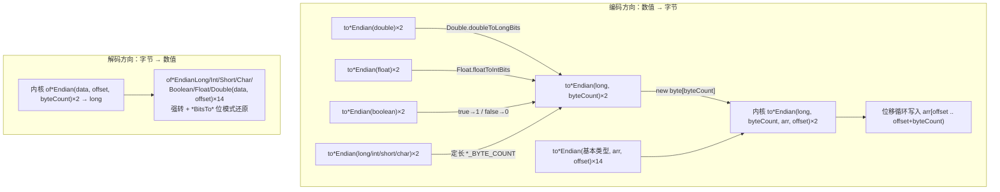

# i2f-bytes

> 字节序编解码工具模块：单一静态门面 `ByteUtil`（243 行、48 个 `public static` 方法、7 个字节宽度常量），提供 7 种 Java 基本类型（`long/int/short/char/boolean/float/double`）与 `byte[]` 的 **Big-Endian / Little-Endian 双向互转**，支持「新建数组返回」与「写入已有数组指定偏移」两种形态、1–8 字节任意宽度定长编码；float/double 经 IEEE-754 位模式、boolean 经 0/1 归一后统一收敛到 `long` 位移内核，零 Maven 依赖、纯 JDK。

## 模块路径

- `i2f-jdk/i2f-bytes`

## 模块依赖

| GroupId | ArtifactId | Scope | Optional | 说明 |
|---------|-----------|-------|----------|------|
| — | — | — | — | 无 Maven 依赖（`pom.xml` 无 `<dependencies>` 块，仅继承父 `i2f-jdk`） |

> `ByteUtil` 连一条 `import` 语句都没有，全部由 `java.lang` 的算术、位移与强转完成，是仓库中依赖最少的模块之一，可被任意模块安全依赖。

## 模块设计

### 单一静态门面（Static Facade）

整个模块只有一个类 `i2f.bytes.ByteUtil`：无实例状态、无字段、全 `public static`，外加 7 个类型字节宽度常量（`LONG_BYTE_COUNT=8`、`INT_BYTE_COUNT=4`、`SHORT_BYTE_COUNT=2`、`CHAR_BYTE_COUNT=2`、`BOOLEAN_BYTE_COUNT=1`、`FLOAT_BYTE_COUNT=4`、`DOUBLE_BYTE_COUNT=8`）。

### 方法矩阵：7 类型 × 2 端序 × 编解码 × 两种写入形态

| 形态 | 签名族 | 返回 | 数量 |
|------|--------|------|------|
| 便捷编码 | `toBigEndian(value)` / `toLittleEndian(value)` | `byte[]` | 7 类型 × 2 端序 = 14，按类型定长新建数组 |
| 定长编码 | `toBigEndian(long, byteCount)` / `toLittleEndian(long, byteCount)` | `byte[]` | 2，任意 1–8 字节宽度（可变长整数）新建数组 |
| 就地编码 | `toBigEndian(value, arr, offset)` / `toLittleEndian(value, arr, offset)` | `void` | 7 类型 × 2 端序 = 14，写入已有数组指定偏移 |
| 就地编码内核 | `toBigEndian(long, byteCount, arr, offset)` / `toLittleEndian(...)` | `void` | 2，**位移循环内核**，上述 30 个编码方法全部委托于此 |
| 解码内核 | `ofBigEndian(data, offset, byteCount)` / `ofLittleEndian(...)` | `long` | 2，任意宽度字节序列 → 无符号位模式 |
| 便捷解码 | `ofBigEndianInt(data, offset)`、`ofLittleEndianDouble(data, offset)` 等 | 对应类型 | 7 类型 × 2 端序 = 14，内核结果强转 / 位模式还原 |

### long 统一域与位模式归一

所有类型先归一到 `long` 位模式，再共享同一套位移内核：

- **整数族**（`long`/`int`/`short`/`char`）：直接以 `long` 承载，宽度取自常量表；
- **浮点族**：`float` → `Float.floatToIntBits`（4 字节）、`double` → `Double.doubleToLongBits`（8 字节），按 IEEE-754 位模式往返；
- **boolean**：编码 `true→1 / false→0`，解码「非 0 即 true」；
- **端序语义**：
  - 大端：`arr[offset+i] = (byte)(value >>> 8*(byteCount-1-i) & 0xff)` —— 高字节在低地址；
  - 小端：`arr[offset+i] = (byte)(value >>> 8*i & 0xff)` —— 低字节在低地址；
  - 解码按无符号位模式左移累积（`ret = (ret<<8) | byte&0xff`），再强转回目标类型——补码位模式不变，有符号数值还原正确。



### 包结构

```
i2f-bytes
└── src/main/java/i2f/bytes/
    └── ByteUtil.java   # 唯一类：7 个宽度常量 + 48 个 public static 方法
```

## 模块目的

- **补齐 JDK 缺口**：JDK 无公开的「基本类型 ↔ 字节序列」通用端序编解码 API（`ByteBuffer` 较重且绑定缓冲区、`DataOutputStream` 固定大端、`Integer.reverseBytes` 仅单类型单宽度），本模块以统一门面集中提供。
- **协议编解码地基**：文件格式、网络协议、密码学原语（OTP 计数器、SM3 消息分组、checksum 序列化）普遍要求显式端序控制，为 i2f 加密 / OTP 族提供可复用的字节装配层。
- **零依赖可移植**：纯算术位移实现，可下沉到任何模块（含加密、注解等最底层组件）而不引入传递依赖。

## 模块功能

| 功能 | 入口示例 |
|------|----------|
| 基本类型 → 定长字节数组 | `toBigEndian(0x12345678)`、`toLittleEndian(3.14d)` |
| 任意宽度（1–8 字节）编码 | `toBigEndian(counter, 8)`（如 HOTP 8 字节计数器） |
| 写入已有缓冲区指定偏移 | `toBigEndian(value, buf, 12)`、`toLittleEndian(f, buf, 0)` |
| 字节序列 → 基本类型 | `ofBigEndianInt(data, 0)`、`ofLittleEndianShort(data, 0)` |
| 任意宽度无符号解析 | `ofBigEndian(bytes, 0, 3)` 读取 24 位整数 |

## 模块主要使用方法

**1）定长编码 / 解码（最常用）：**

```java
byte[] be = ByteUtil.toBigEndian(0x12345678);       // {0x12,0x34,0x56,0x78}
byte[] le = ByteUtil.toLittleEndian(0x12345678);    // {0x78,0x56,0x34,0x12}

int v1 = ByteUtil.ofBigEndianInt(be, 0);            // 0x12345678
short v2 = ByteUtil.ofLittleEndianShort(le, 0);     // 0x5678
```

**2）浮点 / 布尔 / 字符（位模式往返）：**

```java
byte[] d = ByteUtil.toBigEndian(3.14);              // IEEE-754 位模式 8 字节
double back = ByteUtil.ofBigEndianDouble(d, 0);     // 3.14

byte[] flag = ByteUtil.toBigEndian(true);           // {0x01}
boolean t = ByteUtil.ofLittleEndianBoolean(flag, 0);// true（非 0 即真）
```

**3）任意宽度定长编码（协议场景）：**

```java
// RFC 4226 HOTP：8 字节大端计数器
byte[] counter = ByteUtil.toBigEndian(window, 8);
// 读取 24 位无符号整数
int v24 = (int) ByteUtil.ofBigEndian(bytes, 0, 3);
```

**4）写入已有缓冲区（多次拼装一个包）：**

```java
byte[] packet = new byte[12];
ByteUtil.toBigEndian(msgType, packet, 0);           // int @0
ByteUtil.toBigEndian(seq, packet, 4);               // int @4
ByteUtil.toLittleEndian(crc, packet, 8);            // int @8
```

**注意事项：**

- **已知瑕疵：`ofLittleEndianDouble` 结果错误**：源码误用 `BOOLEAN_BYTE_COUNT`（1 字节）当作 double 宽度（[ByteUtil.java#L240](../../../i2f-jdk/i2f-bytes/src/main/java/i2f/bytes/ByteUtil.java)），只会读 1 个字节再做 `Double.longBitsToDouble`，与 `toLittleEndian(double)`（正确写 8 字节）不对称。规避：改用 `ofBigEndianDouble`，或写 `Double.longBitsToDouble(ByteUtil.ofLittleEndian(data, offset, 8))`。
- **无任何参数校验**：`offset` / `byteCount` 越界由 JVM 抛 `ArrayIndexOutOfBoundsException`；`byteCount > 8` 无意义（`long` 仅 64 位），编码端移位距离按 64 取模会产生重复字节、解码端高位丢失。
- **NaN 规范化**：float/double 使用 `*ToIntBits` / `*ToLongBits`（而非 `*RawBits`），所有 NaN 经编解码后归一为标准 NaN 位模式，不保留 NaN 载荷（payload）。
- **解码强转语义**：解码内核返回无符号 long 位模式，`ofXxxInt` / `ofXxxShort` 经强转保留补码位模式（有符号数值还原正确）；`char` 直接 `(char)` 截取；`boolean` 非 0 即真。
- **线程安全**：全静态无状态方法，除返回数组外无对象分配，可任意并发调用。

## 模块特性总结

- **48 方法一矩阵**：7 类型 × 2 端序 × 编解码 ×「新建数组 / 就地写入」全覆盖，外加 1–8 字节任意宽度定长编解码。
- **四内核收敛**：全部逻辑沉淀在 `to*Endian(long, byteCount, arr, offset)` 与 `of*Endian(data, offset, byteCount)` 共 4 个方法中，其余重载均是一行委托。
- **long 统一域**：浮点走 IEEE-754 位模式、boolean 走 0/1，全部类型共享同一位移内核。
- **零依赖、无状态、线程安全**：无 import、无查表、无 `ByteBuffer`/`Unsafe`，字节序语义一目了然。

## 相关模块

- **消费方**：`i2f-otpauth`（HOTP/TOTP 8 字节大端计数器）、`i2f-sm-crypto`（SM3 消息分组按 4 字节大端读取 `W[]`、checksum 序列化）、`i2f-crypto-impl`（`ChecksumMessageDigester` 将 long 摘要值转 8 字节大端）、`i2f-jdk-all`（聚合引入）。
- 字节 ↔ 字符串编解码见 `i2f-codec-impl`（hex/base64 等 `IStringByteCodec` 家族），与本模块「数值 ↔ 字节」互补。
