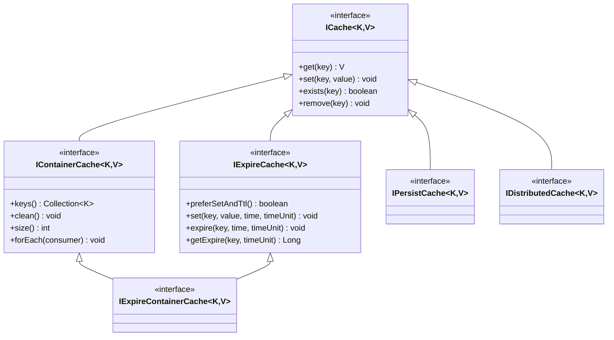
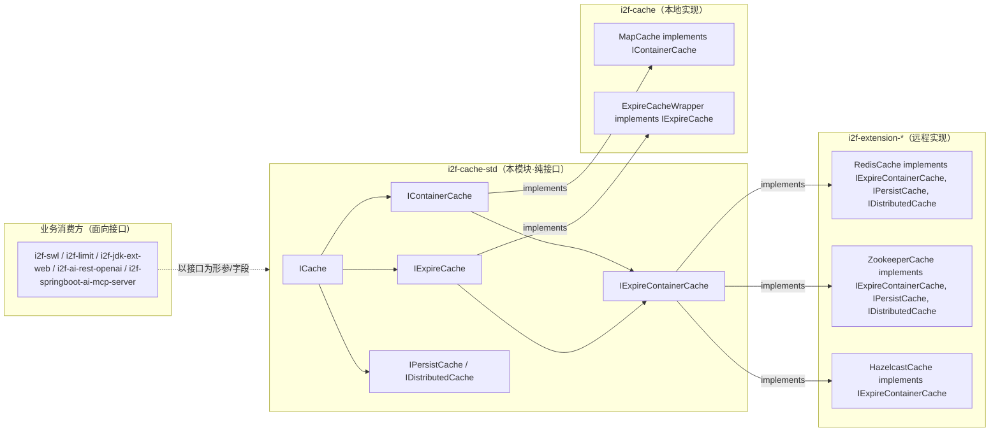

# i2f-cache-std

> 缓存**标准契约层**（`std` 契约与实现分离）。延续 `i2f-ai-std`/`i2f-clock-std`/`i2f-tuple-std` 的「契约稳定、实现可换」范式，本模块**只有 6 个纯接口**，零实现、零逻辑：以根接口 `i2f.cache.std.base.ICache<K,V>` 用 `get/set/exists/remove` 四个动词刻画「键值缓存」的最小本质，再沿「**容量容器**」`IContainerCache`（`keys/clean/size/forEach`）、「**过期**」`IExpireCache`（带 TTL 的 `set` + `expire/getExpire` + `preferSetAndTtl`）、「**持久/分布式**」`IPersistCache`/`IDistributedCache`（两个纯标记接口）三条正交能力轴继承扩展，并以 `IExpireContainerCache`（`IContainerCache ∩ IExpireCache`）汇聚「可枚举 + 可过期」的组合契约。真正的 `MapCache`、`ExpireCacheWrapper` 下沉到 `i2f-cache`，`RedisCache`/`ZookeeperCache`/`HazelcastCache` 等远程实现落在各 `i2f-extension-*`，本模块作为它们的共同上游类型锚点。自身零 i2f 内部依赖（pom 声明的 lombok 实际未用）。

## 模块路径

- `i2f-jdk/i2f-cache-std`

## 模块依赖

| GroupId | ArtifactId | Scope | Optional | 来源 | 用途 |
| --- | --- | --- | --- | --- | --- |
| （无） | | | | | 无任何 i2f 内部依赖 |
| org.projectlombok | lombok | provided | true | 三方（版本由父 POM 托管） | **声明但实际未使用**——6 个类型全是纯接口，未用任何 Lombok 注解（见「已知实现瑕疵」） |

- 父 POM：`i2f.turbo:i2f-jdk:1.0-jdk8`；`groupId` 沿用 `i2f.turbo`，`artifactId` 为 `i2f-cache-std`，`version` 由父托管。
- `build` 段仅声明 `maven-assembly-plugin`（与全仓库模块一致的打包约定）。
- 运行期仅用到 JDK 的 `java.util.Collection`、`java.util.function.Consumer`、`java.util.concurrent.TimeUnit`——**零三方运行期依赖**。

## 模块设计

### 1. 单根接口 + 三条正交能力轴

`ICache<K,V>` 是所有缓存的**唯一根类型**，只保留「对单个 key 的读、写、判在、删」四个最不可省的动词，泛型 `K`/`V` 让键值类型由实现自定（本地对象、序列化字节、Redis key…皆可）。其余接口一律从它 `extends` 派生，各自补一条**互不重叠**的能力，从而任何实现都能按需组合：

| 接口 | 包 | 直接父 | 新增抽象/默认成员 | 刻画的能力 |
| --- | --- | --- | --- | --- |
| `ICache<K,V>` | `base` | — | `get(K)` / `set(K,V)` / `exists(K)` / `remove(K)`（4 抽象） | 键值缓存的最小本质 |
| `IContainerCache<K,V>` | `container` | `ICache` | `keys()` / `clean()`（抽象）；`size()` / `forEach(Consumer)`（默认，基于 `keys()`） | 可枚举全量 key 的「容器型」缓存 |
| `IExpireCache<K,V>` | `expire` | `ICache` | `set(K,V,long,TimeUnit)` / `expire(K,long,TimeUnit)` / `getExpire(K,TimeUnit)`（抽象）；`preferSetAndTtl()`（默认 `true`） | 带过期时间（TTL）的缓存 |
| `IExpireContainerCache<K,V>` | `ext` | `IContainerCache` + `IExpireCache` | （无新增） | 「可枚举 ∩ 可过期」的交集标记 |
| `IPersistCache<K,V>` | `persist` | `ICache` | （无新增） | 落盘/可持久化缓存的语义标记 |
| `IDistributedCache<K,V>` | `persist` | `ICache` | （无新增） | 跨节点分布式缓存的语义标记 |



### 2. 契约 / 实现分层（std ↔ 多实现家族）



- **std 侧**：只有 6 个接口，是「以类型而非实现来接收缓存」的抽象锚点。消费方（如 `i2f-swl` 的 `SwlTransfer`、`i2f-jdk-ext-web` 的 `LoginGuarder`）字段/形参声明为 `IExpireCache` 或 `ICache`，运行期可注入本地 `MapCache`、过期包装 `ExpireCacheWrapper`、或远程 `RedisCache` 而无需改代码。
- **本地实现侧**（`i2f-cache`）：`MapCache` 用 `ConcurrentHashMap` 落地 `IContainerCache`；`ExpireCacheWrapper` 以装饰器包住任意 `ICache`、把值编码为「数据 + 过期时间戳」实现 `IExpireCache`。
- **远程实现侧**（各 `i2f-extension-*`）：`RedisCache`/`ZookeeperCache` 同时 `implements IExpireContainerCache, IPersistCache, IDistributedCache`，`HazelcastCache` `implements IExpireContainerCache`——同一契约族在本地/分布式两端可互换。

### 3. 两个偏「实现提示 / 派生默认」的设计点

- **`IExpireCache.preferSetAndTtl()`（默认 `true`）**：一个能力探测开关，向调用方声明「本缓存更倾向于用 `set(key,value,time,unit)` 一次性写入 + TTL，而非先 `set` 再 `expire` 两步」。像 Redis 天然支持 `SETEX` 的返回 `true`；若某底层存储只支持「先存后置过期」的独立命令，实现可覆写返回 `false`，让调用方据此选择写入路径。默认 `true` 是面向现代 KV 存储的乐观假设。
- **`IContainerCache` 的 `size()`/`forEach()` 默认实现**：二者都基于唯一抽象 `keys()` 派生（`size()=keys().size()`、`forEach(c)=keys().forEach(c)`），把「枚举 key」定为最小抽象，实现方最少只需实现 `keys()`/`clean()`；`MapCache` 出于性能（直接 `map.size()`/`map.forEach`）对二者做了覆写，正是「默认可用、按需覆盖」的典型。

## 模块目的

- 用**一组接口**为「缓存」这一横切关注点提供统一抽象，使本地内存缓存、过期包装缓存、Redis/Zookeeper/Hazelcast 等远程缓存可被同一段业务代码以 `get/set/exists/remove`（及按需的 TTL、枚举、持久化语义）一致对待。
- 以 `std`/实现分包延续仓库既定的「契约稳定、实现可换」分层：业务方与 `i2f-cache`/`i2f-extension-*` 之间仅通过本模块的接口耦合，换存储介质不动上层。
- 用 `IPersistCache`/`IDistributedCache` 两个标记接口，把「是否可持久化」「是否分布式」这类**运行期无法从方法签名看出的语义属性**编码进类型，供 `instanceof` 判定与选择性装配（如 `RedisCache`/`ZookeeperCache` 同时具备）。

## 模块功能

| 能力 | 由何提供 | 说明 |
| --- | --- | --- |
| 单键读/写/判在/删 | `ICache`（本模块） | 一切缓存的根契约 |
| 全量 key 枚举 / 清空 / 计数 / 遍历 | `IContainerCache`（本模块） | 适合「可遍历整个缓存」的实现；`size`/`forEach` 默认基于 `keys()` |
| 带 TTL 写入 / 独立设过期 / 查剩余 | `IExpireCache`（本模块） | 过期语义；`getExpire` 由实现返回剩余时间或约定值 |
| 写入方式偏好提示 | `IExpireCache.preferSetAndTtl()`（默认 `true`） | 提示调用方「一次性 setex 式写入」还是「先 set 后 expire」 |
| 可枚举 + 可过期 组合 | `IExpireContainerCache`（本模块） | 交集接口，本地过期缓存/远程缓存常一并实现 |
| 持久化 / 分布式 语义标记 | `IPersistCache` / `IDistributedCache`（本模块） | 空标记，供类型判定与装配 |
| 本地内存/过期实现 | `i2f-cache`（下游） | `MapCache`、`ExpireCacheWrapper` |
| Redis/Zookeeper/Hazelcast 实现 | `i2f-extension-*`（下游） | 远程缓存落地 |

## 模块主要使用方法

对**实现方**，按所需能力选一条最小接口实现，其余动词落到本地存储/远程客户端上：

```java
// 本地容器型缓存：以 ConcurrentHashMap 落地 IContainerCache
public class MapCache<K, V> implements IContainerCache<K, V> {
    protected volatile Map<K, V> map = new ConcurrentHashMap<>();
    @Override public Collection<K> keys() { return map.keySet(); }
    @Override public void clean() { map.clear(); }
    @Override public V get(K key) { return map.get(key); }
    @Override public void set(K key, V value) { map.put(key, value); }
    @Override public boolean exists(K key) { return map.containsKey(key); }
    @Override public void remove(K key) { map.remove(key); }
    // size()/forEach() 可覆写以走 map 原生路径，避免 keys() 拷贝
}
```

对**消费方**，一律面向接口编程，运行期注入具体实现，实现「换存储不改上层」：

```java
// 以 IExpireCache 为字段/形参：可注入 ExpireCacheWrapper（本地过期）或 RedisCache（远程）
private final IExpireCache<String, Session> sessionCache;

void save(String token, Session s) {
    // 依 preferSetAndTtl 选择一次性 TTL 写入或两步写入
    if (sessionCache.preferSetAndTtl()) {
        sessionCache.set(token, s, 30, TimeUnit.MINUTES);
    } else {
        sessionCache.set(token, s);
        sessionCache.expire(token, 30, TimeUnit.MINUTES);
    }
}

// 用标记接口做选择性装配：仅当缓存是分布式时才走跨节点失效
void evictAcrossNodes(String key) {
    if (sessionCache instanceof IDistributedCache) {
        ((ICache) sessionCache).remove(key); // 远程实现内部已广播失效
    }
}
```

### 注意事项

- **接口不约束并发与序列化**：`ICache` 只定义动词，线程安全、键值是否需要序列化/编解码全由实现决定（`MapCache` 靠 `ConcurrentHashMap`，`ExpireCacheWrapper` 额外用 `ReentrantLock` 保证「读-判过期-删」原子）。
- **`getExpire` 的返回值语义由实现约定**：`IExpireCache.getExpire(K, TimeUnit)` 返回 `Long`，本地 `ExpireCacheWrapper` 对「不存在」返回 `null`、「永不过期（expireTs<0）」返回 `-1L`、否则返回剩余毫秒；远程实现（如 Redis）应遵循同一约定或在文档另行声明，调用方判 `null`/负值前须了解目标实现约定。
- **`preferSetAndTtl()` 是提示非强制**：返回 `false` 不代表 TTL 写入不可用，只表示「建议两步」；两步路径（`set` 后再 `expire`）在某些存储上非原子，存在「已写入但设过期前崩溃导致永不过期」的窗口，需实现或调用方自行兜底。
- **标记接口无方法**：`IPersistCache`/`IDistributedCache` 仅供 `instanceof` 与类型装配，编译器不会强制任何行为；把它们当作「能力标签」而非「可调用契约」。
- **`IContainerCache.size()` 默认实现的隐性成本**：未覆写时 `size()=keys().size()` 会触发一次全量 key 枚举，对大缓存或远程存储（需 SCAN 全库）代价高昂，实现应优先覆写。

## 模块特性总结

- **极简根契约**：`ICache` 仅 4 动词，只刻画「键值缓存」的最小本质，可被任意介质实现。
- **正交能力轴**：容器（枚举）、过期（TTL）、持久/分布式（标记）三条继承轴互不重叠，按需组合。
- **交集聚合**：`IExpireContainerCache = IContainerCache ∩ IExpireCache`，一个接口即拿到「可枚举 + 可过期」。
- **默认方法降负担**：`IContainerCache.size/forEach` 基于 `keys()`、`IExpireCache.preferSetAndTtl` 提供乐观默认，实现方最少只写核心抽象。
- **标记接口编码语义**：`IPersistCache`/`IDistributedCache` 把「持久化/分布式」这类方法签名表达不了的属性提升为类型，支持 `instanceof` 装配。
- **契约/实现分离**：`std` 稳定抽象 + `i2f-cache`（本地）与 `i2f-extension-*`（远程）多实现家族，与全仓 `*-std` 家族一脉相承。
- **零内部依赖**：不引任何 i2f 兄弟模块，可被任意层安全依赖（含 `i2f-jdk` 内部与 `i2f-extension-*`、`i2f-springboot`）。

## 已知实现瑕疵

1. **`pom.xml` 声明 `lombok` 却完全未用**：6 个类型全是纯接口，无任何 `@Data/@Getter` 等注解，lombok 属冗余依赖（`@Data` 实际用在下游 `i2f-cache` 的 `ExpireData` 上，std 模块本身不需要）。移除可让本模块成为真正零依赖。
2. **`IExpireCache.getExpire` 返回约定未固化在契约**：`null`（不存在）/ `-1`（永不过期）/ 正数（剩余）三态是 `ExpireCacheWrapper` 的实现约定，接口层未以任何形式（Javadoc/常量/包装类型）声明，跨实现存在语义漂移风险。
3. **`IContainerCache.size()`/`forEach()` 默认基于 `keys()` 全量枚举**：对远程/大缓存实现是 O(N) 甚至需全库扫描，契约未提示「大缓存应覆写」，易被实现方忽略而留下性能陷阱。
4. **`preferSetAndTtl` 的两步降级路径非原子**：接口鼓励按提示切换写入方式，但「set 后 expire」两步在崩溃窗口下可能残留永不过期条目，兜底责任未在契约层交代。

## 下游与关联

- **本地实现**：`i2f-cache`（`MapCache` 实现 `IContainerCache`；`ExpireCacheWrapper`/`ObjectExpireCacheWrapper` 实现 `IExpireCache`）——poms 直接依赖本模块。
- **远程实现**：`i2f-extension-redis-cache`（`RedisCache`）、`i2f-extension-zookeeper`（`ZookeeperCache`）实现 `IExpireContainerCache + IPersistCache + IDistributedCache`；`i2f-extension-hazelcast`（`HazelcastCache`）实现 `IExpireContainerCache`。
- **业务侧接口消费**：`i2f-swl`（`SwlTransfer`、`SwlExpireCacheNonceManager`、`SwlCacheCertManager`）、`i2f-limit`（`MaxCountWaitTimeExpireKeyedLimiter`）、`i2f-jdk-ext-web`（`LoginGuarder`、`ResourcesFailureGuarder`）、`i2f-ai-rest-openai`（`HttpSimpleMcpServerImpl`）、`i2f-springboot-ai-mcp-server`（MCP 会话过期缓存）均以 `ICache`/`IExpireCache` 为形参或字段依赖本契约。
- **依赖登记**：`i2f-lru-map` pom 声明了 `i2f-cache-std` 但当前 `i2f.lru` 包源码未 import 任何 `i2f.cache.std.*`（冗余声明）；`i2f-jdk` 模块列表与根 POM `dependencyManagement` 登记本模块，`i2f-jdk-all` 聚合 POM 收录本模块。
