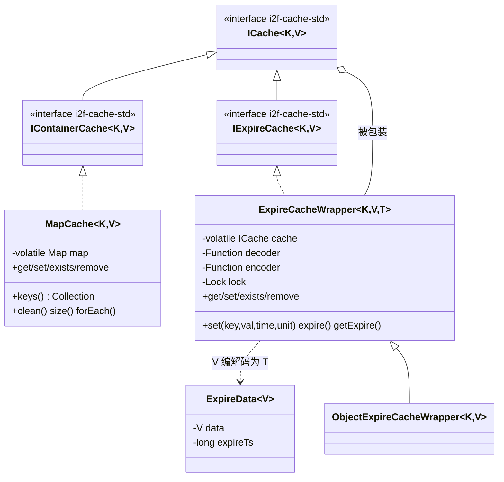
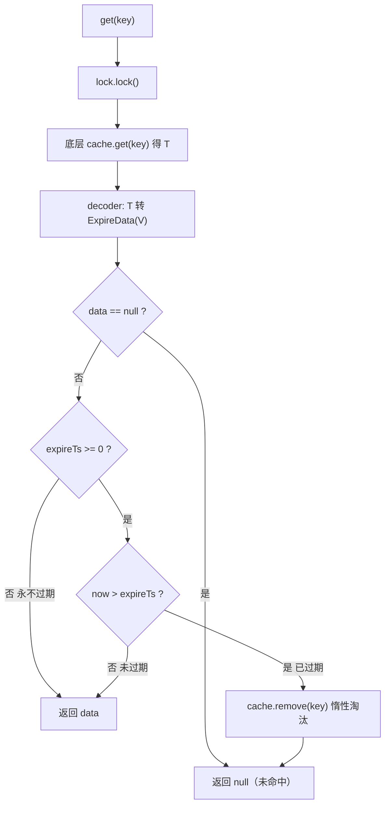

# i2f-cache

> 缓存**本地实现层**——落地 `i2f-cache-std` 契约，用 4 个类提供两套可组合的进程内缓存能力：`MapCache<K,V>`（`implements IContainerCache`）把一个可注入的 `Map`（默认 `ConcurrentHashMap`）适配成「可枚举容器型缓存」；`ExpireCacheWrapper<K,V,T>`（`implements IExpireCache`）以**装饰器 + 编解码**把任意 `ICache<K,T>` 升级为「带 TTL 的过期缓存」，做法是把业务值 `V` 包成 `ExpireData<V>`（数据 + 绝对过期时间戳）再经 `encoder/decoder` 序列化成底层存储值 `T`；`ObjectExpireCacheWrapper<K,V>` 是其 `T=Object` 的常用具化（直接把 `ExpireData` 存进 `Map<K,Object>`）。二者**正交组合**（过期包装套容器缓存）即可零三方地得到「本地 + 可枚举 + 可过期」缓存，是全仓（`i2f-swl`/`i2f-limit`/各 `*-starter`）默认本地缓存的实现底座。运行期仅 `i2f-cache-std` + `lombok` 两个依赖、零第三方。

## 模块路径

- `i2f-jdk/i2f-cache`

## 模块依赖

| GroupId | ArtifactId | Scope | Optional | 来源 | 用途 |
| --- | --- | --- | --- | --- | --- |
| i2f.turbo | i2f-cache-std | compile | 否 | 项目内部 | 实现其 6 契约：`MapCache` 实现 `IContainerCache`、`ExpireCacheWrapper` 实现 `IExpireCache` 且包装 `ICache` |
| org.projectlombok | lombok | provided | true | 三方（版本由父 POM 托管） | `ExpireData` 的 `@Data` 生成 `getData/setData/getExpireTs/setExpireTs`——**真实使用** |

- 父 POM：`i2f.turbo:i2f-jdk:1.0-jdk8`；`groupId` 沿用 `i2f.turbo`，`artifactId` 为 `i2f-cache`，`version` 由父托管。
- `build` 段仅声明 `maven-assembly-plugin`（与全仓库模块一致的打包约定）。
- 运行期除 `i2f-cache-std` 外仅用到 JDK 的 `java.util.Map`/`ConcurrentHashMap`/`Collection`、`java.util.concurrent.TimeUnit`/`locks.ReentrantLock`、`java.util.function.{Function,Consumer}`——**零第三方依赖**。

## 模块设计

### 1. 两支正交能力：容器存储 + 过期装饰

本模块刻意不做「一个大而全的过期 LRU 缓存类」，而是拆成两条**互不耦合、可自由组合**的支路，分别实现 `i2f-cache-std` 的两条能力轴：

| 类 | 实现/继承 | 职责 | 关键设计 |
| --- | --- | --- | --- |
| `MapCache<K,V>` | `implements IContainerCache<K,V>` | 把 `Map` 适配为可枚举缓存 | 持有 `volatile Map<K,V> map`，默认 `ConcurrentHashMap`，**可注入任意 `Map`**（如 `LruMap`）；覆写 `size()`/`forEach()` 走 `map` 原生路径而非默认 `keys()` 拷贝 |
| `ExpireData<V>` | `@Data` POJO | 过期存储信封 | 两字段：`V data`（业务值）+ `long expireTs`（**绝对到期毫秒时间戳**，`-1` 表示永不过期） |
| `ExpireCacheWrapper<K,V,T>` | `implements IExpireCache<K,V>`，包装 `ICache<K,T>` | 给任意底层缓存加 TTL | **装饰器 + 编解码**：值 `V` ↔ `ExpireData<V>` ↔ 存储值 `T` 由两 `Function` 转换；单把 `ReentrantLock` 串行化全部操作；**惰性过期**（读取时判到期即删） |
| `ObjectExpireCacheWrapper<K,V>` | `extends ExpireCacheWrapper<K,V,Object>` | `T=Object` 的常用具化 | 编解码即「`Object` 强转 `ExpireData<V>` / `ExpireData` 当 `Object` 存」，适配把值直接放 `Map<K,Object>` 的场景 |



### 2. 过期装饰器的工作原理（编码 / 惰性淘汰）

`ExpireCacheWrapper` 不自己存数据，而是委托一个 `ICache<K,T>`，只在值前后加一层「`ExpireData` 信封」来承载到期时间：

- **写入** `set(key,value,time,unit)`：算 `expireTs = unit.toMillis(time) + now`，`new ExpireData<>(value, expireTs)` 经 `encoder` 转成 `T` 存入底层；无 TTL 的 `set(key,value)` 则存 `expireTs=-1`（永不过期）。
- **读取** `get(key)`（及内部 `getData`）：底层 `get` 出 `T` → `decoder` 还原 `ExpireData<V>` → 若 `expireTs>=0` 且 `now>expireTs` 则**就地 `remove` 并返回 null**（惰性淘汰），否则返回其 `data`。
- **改期** `expire(key,time,unit)`：读现有 `ExpireData`，仅刷新 `expireTs` 再回写。



- **`ObjectExpireCacheWrapper` 的编解码**：`decoder = obj -> (ExpireData<V>) obj`（非受检强转）、`encoder = data -> data`（`ExpireData` 本身就是 `Object` 直接存）。因此它要求底层 `ICache<K,Object>` 的槽位存的正是 `ExpireData` 对象——本地内存场景无需真正序列化。

### 3. 与 `i2f-cache-std` 的契约落位，及典型组合装配

本模块只实现 std 的 `IContainerCache` 与 `IExpireCache` 两轴；`IExpireContainerCache`（交集）、`IPersistCache`/`IDistributedCache`（标记）留给「本地过期可枚举」或远程实现去 `implements`。全仓最常见的用法是**运行时手工组合**两轴：

```java
// 典型装配：容器缓存(MapCache) 作存储 + 过期装饰器(ObjectExpireCacheWrapper) 加 TTL，
// 对外只暴露 std 的 IExpireCache 接口 —— 摘自 i2f-swl 的 SwlExpireCacheNonceManager
private IExpireCache<String, String> cache =
        new ObjectExpireCacheWrapper<>(new MapCache<>(new ConcurrentHashMap<>()));

cache.set(nonceKey, nonce, timeoutSeconds, TimeUnit.SECONDS); // 写入即带 TTL
boolean seen = cache.exists(nonceKey);                         // 判在（注意：见瑕疵2，不校验过期）
```

```java
// 复用 MapCache 的「Map 可注入」：换底层为 LruMap 即得容量淘汰缓存 —— 摘自 i2f-lru-cache
public class LruMapCache<K, V> extends MapCache<K, V> {
    public LruMapCache(int maxSize) { super(new LruMap<>(maxSize)); }
}
```

## 模块目的

- 以**最小组合件**落地 `i2f-cache-std`：一个「Map→容器缓存」适配器 + 一个「过期装饰器」，即可覆盖「本地内存缓存 / 带 TTL 缓存 / 二者叠加」的绝大多数进程内场景，无需引入 Caffeine/Guava 等三方。
- 用**装饰器 + 编解码**把「过期」做成与「存储介质」正交的一层：同一 `ExpireCacheWrapper` 可套本地 `MapCache`，理论上也可套远程 `ICache`，TTL 逻辑集中一处、不重复。
- 通过 `MapCache` 的 `Map` 可注入与 `LruMapCache` 的继承示例，示范「换底层数据结构即换缓存策略（并发/容量淘汰）」的开闭式扩展。

## 模块功能

| 能力 | 由何提供 | 说明 |
| --- | --- | --- |
| 键值读/写/判在/删 | `MapCache`、`ExpireCacheWrapper` | 均实现 std `ICache` 四动词 |
| 全量 key 枚举 / 清空 / 计数 / 遍历 | `MapCache`（`IContainerCache`） | `keys()` 返回 `map.keySet()` 视图；`size/forEach` 走原生 `Map` |
| 带 TTL 写入 / 独立改期 / 查剩余 | `ExpireCacheWrapper`（`IExpireCache`） | 到期时间存进 `ExpireData.expireTs` |
| 惰性过期淘汰 | `ExpireCacheWrapper.getData` | 读取命中且过期即 `remove`，无后台清扫线程 |
| 本地可过期 + 可枚举 组合 | `ObjectExpireCacheWrapper` 套 `MapCache` | 运行期手工组合两轴（见「使用方法」） |
| 容量淘汰缓存 | 下游 `LruMapCache extends MapCache` | 注入 `LruMap` 复用 `MapCache` 实现 |

## 模块主要使用方法

**① 纯本地容器缓存**（不需要过期时）：

```java
IContainerCache<String, User> users = new MapCache<>(); // 默认 ConcurrentHashMap
users.set("u1", u);
User u = users.get("u1");
users.forEach(k -> System.out.println(k)); // 覆写过，走 map.forEach
```

**② 带 TTL 的过期缓存**（最常见）：以 `ObjectExpireCacheWrapper` 包一个 `MapCache`，对外按 `IExpireCache` 使用：

```java
IExpireCache<String, String> cache =
        new ObjectExpireCacheWrapper<>(new MapCache<>());
cache.set(k, v, 30, TimeUnit.SECONDS);   // 写入 + TTL
cache.expire(k, 60, TimeUnit.SECONDS);   // 单独改期
Long remain = cache.getExpire(k, TimeUnit.SECONDS); // 见瑕疵1：返回值实为「毫秒」，timeUnit 被忽略
```

**③ 自定义存储值类型**（底层存序列化字节等）：用通用 `ExpireCacheWrapper<K,V,T>` 传入真正的编解码函数：

```java
// 底层 ICACHE<K, byte[]> 存序列化字节；这里给出 V<->ExpireData<V><->byte[] 的编解码
ICache<String, byte[]> raw = ...;
IExpireCache<String, Session> sessions = new ExpireCacheWrapper<>(
        raw, Serialize::deserialize, Serialize::toBytes);
```

### 注意事项

- **线程安全粒度**：`MapCache` 的并发度取决于注入的 `Map`（默认 `ConcurrentHashMap` 细粒度）；而 `ExpireCacheWrapper` 对**所有**操作持单把可重用 `ReentrantLock`，读写全部串行——热路径下它才是瓶颈，勿把高并发读压在其上。
- **惰性过期，无清扫**：过期只在 `get`/`getData` 触达时才 `remove`；从未再被读取的过期条目会**一直占内存**（直到命中读取或底层 `Map` 自身淘汰）。对写多读少 / 键基数大的场景需外接清扫或换 `i2f-lru-map` 的 `ExpireConcurrentMap`。
- **`ExpireData.expireTs` 语义**：`-1`＝永不过期（读取时 `expireTs>=0` 才判期）；`0` 或负数以外的绝对毫秒戳。`set(key,value)`（无 TTL）即写入 `-1`。
- **`ObjectExpireCacheWrapper` 强转契约**：其 `decoder` 对底层值做 `(ExpireData<V>) obj` 非受检强转，要求该 `ICache<K,Object>` 槽位**必须**只由本包装器写入（存的是 `ExpireData`）；混用同一底层存普通对象会在读取处抛 `ClassCastException`。

## 模块特性总结

- **组合优于继承**：容器（`MapCache`）与过期（`ExpireCacheWrapper`）两正交件运行期自由拼装，覆盖多种本地缓存形态。
- **装饰器 + 编解码**：过期层与存储层解耦，TTL 逻辑用 `ExpireData` 信封 + `Function` 编解码承载，可套任意 `ICache`。
- **存储可插拔**：`MapCache` 的 `Map`、`ExpireCacheWrapper` 的底层 `ICache` 与编解码器、锁均可注入替换。
- **零三方**：仅 `i2f-cache-std` + `lombok`（且 lombok 真用于 `ExpireData`），契合 `i2f-jdk` 「仅依赖 JDK」定位。
- **契约严格落位**：类只 `implements` std 对应能力轴（`IContainerCache`/`IExpireCache`），交集与持久/分布式标记留给上层。
- **惰性过期**：无定时线程、无额外数据结构，实现极简，代价是过期条目回收被动。

## 已知实现瑕疵

1. **`ExpireCacheWrapper.getExpire` 忽略入参 `TimeUnit`**：实现直接 `return expireTs - System.currentTimeMillis()`，返回的是**原始毫秒差**却未 `timeUnit.convert(...)`；`timeUnit` 形参完全未用，调用方按秒/分解读会得到错误量级（`-1L`＝永不过期、`null`＝不存在两种约定则正常）。
2. **`exists(key)` 不校验过期**：`ExpireCacheWrapper.exists` 直接委托 `cache.exists(key)`，绕过 `getData` 的到期判定；故一个逻辑上已过期、但尚未被 `get` 触发惰性淘汰的 key，`exists` 仍返回 `true`——与 `get` 返回 `null` 自相矛盾（防重放 nonce 等场景若用 `exists` 判存在会误判）。
3. **粗粒度单锁串行化全部读写**：`ExpireCacheWrapper` 用一把 `ReentrantLock` 锁住 `get/set/expire/exists/remove` 所有操作，即使底层 `MapCache` 是 `ConcurrentHashMap`，经包装后并发读也被串行化，吞吐受限。
4. **`getData` 的嵌套加锁**：`get`/`expire`/`getExpire` 先 `lock`，内部又调 `getData` 再次 `lock`；`ReentrantLock` 可重入故不死锁，但属冗余加锁，且 `getData` 作为受锁保护的非公开方法未标注「调用方须持锁」契约。
5. **过期条目被动回收、无容量上限**：本模块自身不含 TTL 后台清扫，`MapCache` 默认也无淘汰；「内存只增不减直到命中读取」需依赖上层（如 `LruMapCache` 注入 `LruMap` 才有容量兜底）。

## 下游与关联

- **契约上游**：`i2f-cache-std`（本模块实现其 `IContainerCache`、`IExpireCache`，并包装 `ICache`）。
- **实现类真实消费方**（`import i2f.cache.impl.*`）：`i2f-swl`（`SwlTransfer`、`SwlExpireCacheNonceManager`、`SwlCacheCertManager`）、`i2f-limit`（`MaxCountWaitTimeExpireKeyedLimiter`）、`i2f-lru-cache`（`LruMapCache extends MapCache`）、`i2f-springboot-security-starter`（`DefaultTokenHolder`）、`i2f-springboot-shiro-starter`（`DefaultShiroTokenHolder`）、`i2f-springboot-swl-starter` 与 `i2f-springcloud-gateway-swl-starter`（`SwlMissingBeanConfiguration`）——普遍采用「`ObjectExpireCacheWrapper` 套 `MapCache`」的默认本地缓存装配。
- **仅 POM 声明 `i2f-cache` 但未 import 实现类**：`i2f-extension-jedis`、`i2f-extension-redis-cache`、`i2f-extension-zookeeper`、`i2f-spring-redis`、`test-secure`（其远程缓存实现直接面向 `i2f-cache-std` 契约，本模块依赖多为传递/约定引入）。
- **聚合引入**：`i2f-jdk` 模块列表与根 POM `dependencyManagement`（`${i2f.version}`＝`1.0-jdk8`）登记本模块；`i2f-jdk-all` 聚合 POM 收录本模块。
