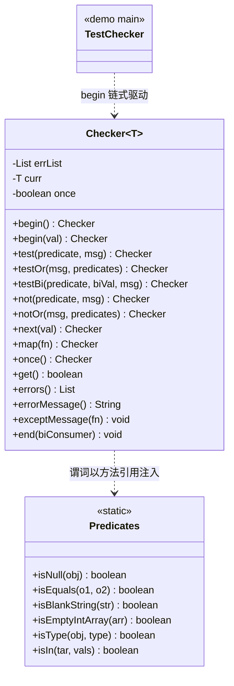

# i2f-check

> **校验/断言工具箱**（`i2f-jdk` 下零依赖模块，全模块仅 3 个类）：核心 `Checker<T>` 是一条**可累积、可换值、可快速失败**的流式校验链——用 `begin(val)` 起链，经 `test`/`testOr`/`testBi`（断言为真）与 `not`/`notOr`/`notBi`（断言为假）把每个不满足的断言以「错误消息」累积进内部 `List<String> errList`，经 `next`/`map` 沿链切换当前值（切换时把已累积错误**拷贝前滚**到新实例，形成持久式链），终态再用 `get`/`errors`/`errorMessage`/`error`/`except`/`exceptMessage`/`end` 一次性消费（判过、取错、拼接、抛异常或回调）；`Predicates` 是一组**为方法引用而生**的静态布尔谓词（`Predicates::isNull`、`Predicates::isBlankString`、`Predicates::isIn` 等，覆盖判空/相等/字符串/集合/数组/类型/字符/成员判定），恰好匹配 `Checker` 的 `Predicate`/`BiPredicate` 槽位。全模块 **`pom.xml` 无任何 `<dependencies>`**，只用到 `java.util` 与 `java.util.function`，是校验断言的地基；生产侧仅 `Predicates` 被 `i2f-serialize-impl`、`i2f-extension-xproc4j` 消费，`Checker` 目前只在自测 demo 中使用。

## 模块路径

- `i2f-jdk/i2f-check`

## 模块依赖

| GroupId | ArtifactId | Scope | Optional | 来源 | 用途 |
| --- | --- | --- | --- | --- | --- |
| ——（无） | —— | —— | —— | —— | `pom.xml` 未声明任何 `<dependencies>`，本模块**零 Maven 依赖** |

- 父 POM：`i2f.turbo:i2f-jdk:1.0-jdk8`；`groupId` 沿用 `i2f.turbo`，`artifactId` 为 `i2f-check`，`version` 由父托管。
- `build` 段仅声明 `maven-assembly-plugin`（与全仓模块一致的打包约定）。
- 父 `i2f-jdk` 是 `packaging=pom` 的**纯聚合 POM**（无 `<dependencies>` 块），根 POM 只在 `dependencyManagement` 里托管版本、**不注入任何全局依赖**——故 `i2f-check` 连兄弟 `std` 模块常见的那条「声明但不用」的 lombok 都没有，是真正的**零依赖**。
- 编译期仅使用 JDK：`java.util.{List,ArrayList,Collection,Map}` 与 `java.util.function.{Predicate,BiPredicate,Function,BiFunction,Consumer,BiConsumer}`。

## 模块设计

### 1. 一个泛型流式校验器 `Checker<T>`

`Checker<T>` 用三枚字段承载整条链的状态：

| 字段 | 类型 | 职责 |
| --- | --- | --- |
| `curr` | `T` | **当前被校验的值**（链式推进时可被替换） |
| `errList` | `List<String>`（普通 `ArrayList`） | **累积的错误消息**；`errList.isEmpty()` 即「全部通过」 |
| `once` | `boolean` | **快速失败开关**：置真且已有错误时，后续判定短路 |

构造器私有 `Checker(T val, Checker<?> checker)`：设 `curr=val`；若传入上游 `checker` 非空，则**复制其 `once` 标志并把其 `errList` 全部 `addAll` 进来**（拷贝前滚，非共享引用）。入口靠静态工厂：

- `begin()` → `Checker<Object>`（`curr=null`，全新错误表）；
- `begin(E val)` → `Checker<E>`；
- `begin(E val, Predicate<E>, Function<E,String>)` / `begin(E val, Predicate<E>, String)` → 起链即判一次。



### 2. 两类方法：原地判定 vs 换值前滚

`Checker` 的方法按「**是否切换当前值**」清晰分成两类，这是理解其链式语义的关键：

| 方法 | 切换 `curr` | 返回 | 记错条件 | 说明 |
| --- | --- | --- | --- | --- |
| `test(Predicate,msg)` / `test(Predicate,Function)` | 否（原地） | `this` | `predicate.test(curr)==false` | 断言为真 |
| `testOr(msg, predicates...)` | 否 | `this` | **全部** predicate 为 false | 任一满足即通过 |
| `testBi(BiPredicate,biVal,msg)` | 否 | `this` | `predicate.test(curr,biVal)==false` | 二元断言 |
| `not(Predicate,msg)` | 否 | `this` | `predicate.test(curr)==true` | 断言为假（`test` 取反） |
| `notOr(msg, predicates...)` | 否 | `this` | **任一** predicate 为 true | `testOr` 取反 |
| `notBi(BiPredicate,biVal,msg)` | 否 | `this` | `predicate.test(curr,biVal)==true` | 二元取反 |
| `test(E val, Predicate, ...)` / `not(E val, ...)` | **是**（`next(val)`） | 新 `Checker<E>` | 同上 | 表面像判定，实则换当前值并前滚错误 |
| `next(E val)` | **是** | 新 `Checker<E>` | — | 仅换值前滚 |
| `map(Function)` / `mapBi(BiFunction,biVal)` | **是**（值经映射） | 新 `Checker<R>` | — | `next(mapper.apply(curr))` |

**错误前滚**：任何「换值」方法经 `new Checker<>(val, this)` 把已有 `errList` 复制进新实例，因此「对 `a` 的判错」在换到 `b` 后仍可被终态一并读出——一条链可跨多个值累积错误。原地判定方法则直接 `errList.add(...)` 并 `return this`。

### 3. `once()` 快速失败的边界

所有**判定**方法开头统一有 `if (once && !this.errList.isEmpty()) return this;` 短路。含义是：开启 `once()` 后，**一旦出现第一个错误，后续判定不再执行**（`test`/`not` 等直接返回），从而只保留首条错误。注意它**只短路判定、不短路换值**——`next`/`map` 仍会执行并前滚那份非空 `errList`，使链能安全走完到终态。

### 4. 终态消费

| 方法 | 行为 |
| --- | --- |
| `get()` | `errList.isEmpty()`，即「是否全部通过」 |
| `value()` | 返回当前值 `curr` |
| `errors()` / `firstError()` | 错误列表 / 首条错误（无错时 `firstError()` 返回 `null`） |
| `errorMessage([sep[,prefix[,suffix]]])` | 以 `separator`（默认 `\n`）拼接全部错误；**无错返回 `null`** |
| `error(Consumer<List>)` | **仅有错误时**回调，交错误列表 |
| `end(BiConsumer<List,T>)` | **总是**回调，交错误列表 + 当前值 |
| `except(Function<List,ex>)` | 有错则以错误列表为参构造并抛出异常 |
| `exceptMessage(Function<String,ex>[,sep[,pre[,suf]]])` | 有错则先 `errorMessage(...)` 拼接，再以字符串构造并抛出异常 |

`except`/`exceptMessage` 把「收集」与「抛出」解耦：先无副作用地累积，最后由调用方决定抛什么异常类型（`Function` 决定），契合各框架自定义 `ValidationException` 的诉求。

### 5. `Predicates`：为方法引用而生的静态谓词库

`Predicates` 全为 `public static boolean`，可 `Predicates::xxx` 直接喂给 `Checker` 的 `Predicate`/`BiPredicate` 槽位，也可独立当断言用。按类别：

| 类别 | 方法 |
| --- | --- |
| 判空 | `isNull` / `nonNull` |
| 相等 | `isEquals`（null 安全）/ `nonEquals` |
| 字符串空/白 | `isEmptyString` / `nonEmptyString` / `isBlankString` / `nonBlankString` |
| 集合/映射 | `isEmptyCollection` / `nonEmptyCollection` / `isEmptyMap` / `nonEmptyMap` |
| 数组 | `isArrayType` / `nonArrayType`；`isEmptyArray`/`nonEmptyArray`（`T[]`）；8 种基本类型数组判空 `isEmpty{boolean,byte,char,double,float,int,long,short}Array` 及 `non...` |
| 类型判定 | `isType(obj, class)`；`is{String,Number,Boolean,Byte,Char,Double,Float,Integer,Long,Short}Type` 及 `non...` |
| 字符串数值/正则 | `isIntegerString` / `nonIntegerString`；`isDoubleString` / `nonDoubleString`；`isMatchString(str,patten)` / `nonMatchString` |
| 字符分类 | `isChLower` / `isChUpper` / `isCh` / `isChNum` / `isChNum(ch, base)` |
| 成员判定 | `isIn(tar, vals...)`（null 安全）/ `notIn` |

`isIn` 与 `isChNum(ch,base)`、各 `isEmpty*Array` 是少数双参/多参签名，可作为 `BiPredicate` 引用使用。

## 模块目的

- 用**一个类**把「多条件校验 → 收集全部（或首个）错误 → 统一消费/抛异常」的样板流程收敛为一条**可读的流式链**，替代散落的 `if (...) throw ...`。
- 以**错误累积 + 终态消费解耦**（`get`/`errorMessage`/`exceptMessage`/`end`）同时满足「表单一次性回显全部错误」与「入参校验快速抛出自定义异常」两类诉求。
- 把谓词库 `Predicates` 与校验器 `Checker` **分而治之**：`Predicates` 是无状态、可独立复用的判定原子（生产侧大量单独调用），`Checker` 只是编排它们的流式外壳——两者耦合仅通过 JDK 标准 `Predicate`/`BiPredicate` 函数式接口。
- 保持**零依赖**：作为校验地基可被任意上层（序列化、动态脚本、Web 表单等）无负担引入。

## 模块功能

| 能力 | 由何提供 | 说明 |
| --- | --- | --- |
| 流式多条件校验 | `Checker.test/testOr/testBi` 与 `not/notOr/notBi` | 断言真 / 断言假 × 单元 / 或运算 / 二元 |
| 错误累积 | `errList` | 一条链跨多值累积多条错误消息 |
| 跨值链式 | `next` / `map` / `mapBi` / 3 参 `test`·`not` | 切换/映射当前值并前滚错误 |
| 快速失败 | `once()` | 记首个错误后短路后续判定 |
| 结果消费 | `get` / `errors` / `firstError` / `errorMessage` / `error` / `end` | 判过、取错、拼接、回调 |
| 异常化 | `except` / `exceptMessage` | 有错时以自定义 `Function` 构造并抛异常 |
| 通用布尔谓词 | `Predicates`（约 90 个静态方法） | 判空/相等/字符串/集合/数组/类型/字符/成员 |

## 模块主要使用方法

**① 单值多断言，失败抛异常**（对应 `TestChecker` 前两例）：

```java
// 断言「非 null」，否则以 IllegalArgumentException 抛出错误消息
Checker.begin(user)
        .not(Predicates::isNull, v -> "用户不能为null")
        .test(Predicates::nonBlankString, u -> u.getName(), name -> "用户名不能为空白")
        .exceptMessage(msg -> new IllegalArgumentException(msg));
```

**② 一次性回显全部错误**（表单校验，`errorMessage` 拼接）：

```java
Checker<String> c = Checker.begin(form.getName())
        .test(Predicates::nonBlankString, "名称不能为空")
        .test(s -> s.length() <= 32, "名称长度不能超过32");
if (!c.get()) {
    response.write(c.errorMessage("<br>")); // 无错时返回 null，此处必非空
}
```

**③ 跨值链式 + 映射**（对应 `TestChecker` 第三例：数组→List→String→数值→String 逐级校验）：

```java
Checker.begin(new int[]{1, 2, 3})
        .not(Predicates::isNull, v -> "数组不能为null")
        .not(Predicates::isEmptyIntArray, v -> "数组长度不能为0")
        .map(arr -> toList(arr))                 // 换值：int[] -> List<Integer>
        .test(list -> list.contains(2), "列表应该包含2")
        .map(list -> join(list))                 // 换值：List -> String
        .next("123456789")                        // 换值：任意新值
        .not(Predicates::isBlankString, "不能为空字符串")
        .exceptMessage(IllegalArgumentException::new);
```

**④ 快速失败（只留首个错误）**：

```java
Checker.begin(val).once()
        .test(p1, "错误1")
        .test(p2, "错误2"); // 若错误1已命中，此处判定被短路，errList 仍只含"错误1"
```

### 注意事项

- **仅用 `Predicates`**：`Predicates` 无状态、线程安全，可脱离 `Checker` 独立用于任意 `if`/`filter`/方法引用场景（生产侧正是如此）。
- **`Checker` 非线程安全**：内部 `errList` 为普通 `ArrayList`，一条链应在单线程内构造并消费完毕，勿跨线程共享同一实例。
- **3 参 `test(val, ...)`/`not(val, ...)` 会换值**：它们内部 `new Checker<>(val,this)`，**当前值即被切到 `val`**，别当成「原地判一次不动值」——若只想原地判，用 2 参 `test(Predicate,msg)`/`not(Predicate,msg)`。
- **无错时 `errorMessage()`/`firstError()` 返回 `null`**（非空串），终态消费需判 `null` 或先 `get()` 再取。

## 模块特性总结

- **零 Maven 依赖**：`pom.xml` 无任何 `<dependencies>`，纯 `java.util` + `java.util.function`，可无负担引入。
- **流式 + 累积**：把「多断言 → 收集错误 → 统一处理」收敛为一条链，错误可跨值前滚累积。
- **判定/换值双模**：原地判定（`test`/`not` 系）与换值前滚（`next`/`map`/3 参重载）分野清晰，支撑逐级映射校验。
- **收集与抛出解耦**：`except`/`exceptMessage` 用 `Function` 决定异常类型，兼容各框架自定义校验异常。
- **快速失败可控**：`once()` 一键切换「记全部错误」与「只记首个错误」。
- **谓词库与校验器分离**：`Predicates` 是约 90 个可独立复用的无状态布尔原子，经标准函数式接口与 `Checker` 松耦合。

## 已知实现瑕疵

1. **`isIntegerString`/`isDoubleString` 的符号字符类含字面量 `|`**：正则写作 `[+|-]?\d+`，`[+|-]` 是「`+`、`-`、`|`」三字符集合（并非「加或减」的意图 `[+-]`），故 `"|123"` 会被判为合法整数字符串。
2. **`isDoubleString` 要求必带小数位**：正则 `[+|-]?\d+(\.\d+)` 的 `(\.\d+)` 不可选，`"12"`（无小数点）返回 `false`；同时不支持 `.5`/`5.`/指数/前后空白形态——它判的是「必含小数部分的十进制串」，而非宽义「数值串」。
3. **换值方法的错误列表是拷贝而非共享**：`new Checker<>(val, this)` 用 `errList.addAll(...)` 前滚，此后新实例对 `errList` 的增删**不回写**旧实例；若误以为「拿到 `next()` 返回值前的旧 `Checker` 也能看到新错误」会得出相反结论。
4. **`once()` 只短路判定、不短路换值**：开启后 `next`/`map` 仍执行（并带着非空 `errList`），仅 `test`/`not` 类判定被跳过——是「停止追加错误」，不是「停止链式遍历」。
5. **`isType` 判定冗余**：`clazz.equals(type) || type.isAssignableFrom(clazz)` 中前半 `equals` 被后半 `isAssignableFrom` 完全覆盖，无功能影响但属多余判断。
6. **`Checker` 尚无生产消费方**：全仓 `import i2f.check.Checker` 仅出现在自测类 `test/TestChecker`；`Checker` 的链式 API 属「可用但未落地」状态（`Predicates` 则被广泛单独使用）。

## 下游与关联

- **`Predicates` 真实消费方**（`import i2f.check.Predicates`）：
  - `i2f-serialize-impl` 的 `JsonGenerator`：用 `isNull`/`nonNull`/`isCh`/`isArrayType` 做 JSON 序列化的类型分发与字符判定。
  - `i2f-extension-xproc4j` 的 `LangEvalJavaNode`：把 `import ...Predicates;` 注入动态生成的 Java 求值源码，使 JDBC 存储过程脚本可直接静态调用这些谓词。
- **`Checker` 消费方**：仅同模块 `i2f.check.test.TestChecker`（`main` 演示三种链式用法）。
- **与 `i2f-check-filter` 无直接代码关系**：后者是布隆/哈希去重「过滤器」族（包名同为 `i2f.check.filter` 但属另一模块，不 import 本模块）。
- **聚合与登记**：`i2f-jdk` 模块列表（第 38 行 `<module>i2f-check</module>`）、根 POM `dependencyManagement`（`${i2f.version}`＝`1.0-jdk8`）、`i2f-jdk-all` 聚合 POM（第 97 行）均登记本模块；`i2f-serialize-impl` 的 POM 显式 `<dependency>` 引入本模块。
