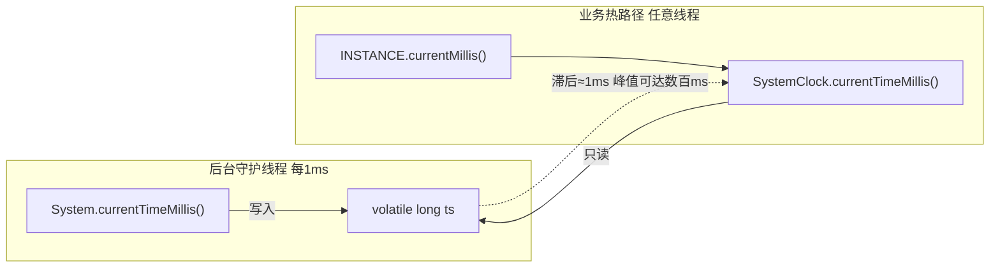

# i2f-clock-impl

> 时钟源标准契约的**默认实现层**（`i2f-jdk` 组，实现 `i2f-clock-std.IClock`）：以 `SystemClock` 提供一个「定时缓存代理」式的高频取时实现——用一个守护 `ScheduledThreadPoolExecutor` 每 1ms 刷新一个 `volatile long ts`，把 `System.currentTimeMillis()` 的 native/内核态系统调用从业务热路径移到后台单线程，热路径只读一个 `volatile` 字段，专为分布式 ID（雪花 ID 等）与高频时间戳场景加速；同时附带一个独立的分段计时器 `TimeCounter`（ stopwatch，带 `main` 基准测试）。是 `i2f-jdk` 时间体系里 `i2f-clock-std` 契约的落地实现件。

## 模块路径

- `i2f-jdk/i2f-clock-impl`

## 模块依赖

| 依赖 | Maven 坐标 | scope | optional | 说明 |
| --- | --- | --- | --- | --- |
| i2f-clock-std | `i2f.turbo:i2f-clock-std` | compile | 否 | 本模块实现的契约接口 `IClock`（`currentMillis()`/派生 `currentSeconds()`/`currentMinutes()`）所在模块 |
| lombok | `org.projectlombok:lombok` | provided | 是（父 DM 治理） | `TimeCounter.SegmentRecord` 实际使用 `@Data`/`@NoArgsConstructor`，为本模块真实用到的编译期注解 |

> 内部依赖仅 `i2f-clock-std` 一个，无三方运行期依赖。构建继承父 pom，仅额外挂 `maven-assembly-plugin`。

## 模块设计

模块位于包 `i2f.clock`（注意与契约包 `i2f.clock.std` 不同层次），含三个类：

- `SystemClock implements IClock`：核心缓存代理。
  - `static volatile long ts`：缓存的时间戳，由后台线程周期刷新。
  - `static {}` 初始化块：建单线程 `ScheduledThreadPoolExecutor`（`setDaemon(true)`、线程组 `system`、线程名 `system.clock`），`scheduleAtFixedRate(()->ts=System.currentTimeMillis(), 0, 1, MILLISECONDS)` 每 1ms 刷新一次。
  - 三种取时入口：静态 `currentTimeMillis()`（读 `ts`）、静态 `currentTimeSeconds()`（`ts/1000`）、实例 `currentMillis()`（`@Override`，转调静态方法）；实例 `INSTANCE` 供面向 `IClock` 注入使用。
- `TimeCounter`：与 `IClock` **无实现关系**的独立分段计时器（stopwatch）。
  - 以 `ReentrantReadWriteLock` 保护一个 `LinkedList<SegmentRecord>`，`begin()/reset()/end(desc)/last()/sum()/records()` 记录多段耗时；内嵌 `@Data` 的 `SegmentRecord`（beginTs/endTs/description + `duration()`）。
  - `formatAbsoluteTime`/`formatDuration` 静态格式化，带 `main()` 演示。
- `i2f.clock.test.TestClock`：`SystemClock` vs `System.currentTimeMillis()` 的循环基准对比 `main` 程序。



## 模块目的

- 用「缓存代理 + 后台刷新」把高频取时从 native 系统调用降为一次 `volatile` 读，规避高并发下上下文切换开销（类注释给出 17x~149x 加速比基准）。
- 通过实现 `i2f-clock-std.IClock`，让上层（雪花 ID、事件调度、JDBC 过程计时等）面向契约注入可替换时钟，与「时间怎么取」解耦。
- 附带 `TimeCounter` 提供多分段耗时统计能力。

## 模块功能

- `SystemClock`：单例 `INSTANCE` + 静态 `currentTimeMillis()`/`currentTimeSeconds()` + 实例 `currentMillis()`，返回缓存毫秒。
- `TimeCounter`：`begin()`、`reset()`、`end()`/`end(desc)`、`last()`、`sum()`、`records()` 分段计时，及绝对时间/时长格式化。
- 消费方：`i2f-uid-impl`（雪花 ID 默认时钟）、`i2f-event.EventDispatcher`（事件时间戳与过期丢弃）、`i2f-jdbc-procedure`（过程执行计时）、`i2f-extension-agent-javassist.AgentContextHolder`（traceId 生成）、`i2f-extension-xproc4j`（生成 Java 源码模板 import `SystemClock`）；`i2f-limit`/`i2f-log-std`/`i2f-lru-map`/`i2f-swl`/`i2f-jdk-all` 亦声明依赖本模块。

## 模块主要使用方法

```java
// 面向契约注入（推荐）：默认取缓存代理单例
IClock clock = SystemClock.INSTANCE;
long ms = clock.currentMillis();
long sec = clock.currentSeconds();   // 由 default 方法整除派生

// 或直接静态调用（多数消费方实际用法）
long ts = SystemClock.currentTimeMillis();
```

注意事项：
- **返回的是缓存值，非实时值**：默认落后真实时间约 1ms（类注释实测平均 +3ms、峰值可达数百 ms）。需要严格实时或单调不回拨语义的场景应直接改用 `System.currentTimeMillis()`。
- 该类只保证毫秒级缓存刷新，无 `nanoTime`、无时区/历法语义。

## 模块特性总结

- 单例 + 全静态双入口：既能 `SystemClock.INSTANCE` 面向 `IClock` 注入，也能 `SystemClock.currentTimeMillis()` 直接静态调用。
- 守护线程 + `volatile` 缓存：`setDaemon(true)` 不阻塞 JVM 退出；`volatile` 保证跨线程可见性。
- 与 `i2f-clock-std` 构成 std/impl 分层：契约不含策略，实现可替换。
- 自带基准测试与分段计时器，便于性能验证。

## 模块瑕疵或错误

> 以下为静态识别的问题/潜在问题，未做运行实证。

- 【**周期任务无异常防护，存在「时间冻结」隐患**】`scheduleAtFixedRate` 的任务一旦抛出未捕获异常，`ScheduledThreadPoolExecutor` 会**静默取消后续所有执行**，此后 `ts` 永久停在最后一次刷新的值且无任何告警。虽然 `System.currentTimeMillis()` 实务上几乎不抛，但缺乏 `try/catch` 是脆弱的契约。
- 【**测试/演示代码混入 `src/main`**】`i2f.clock.test.TestClock`（含 `main`）、`SystemClock` 类注释内的大段基准输出、`TimeCounter.main()` 均随主源集发布进生产 jar；`TestClock` 处于 `main` 却命名为 `test` 包。
- 【**`TestClock` 计时逻辑错误**】`tcs.begin()`/`tcc.begin()` 调用的是**静态** `TimeCounter.begin()`（`return new TimeCounter()`，返回值被丢弃），并非重置 `tcs`/`tcc` 实例状态；基准循环里两个 counter 从不 `reset()`，输出的分段计时不可信。应改为实例方法 `reset()`。
- 【**`TimeCounter.sum()` 未加读锁**】其余 `last()/records()/end()` 都持 `ReentrantReadWriteLock`，唯独 `sum()`（读 `initTs`/`currTs`）裸读，字段虽 `volatile` 但三者非原子快照，风格不一致且可能读到撕裂值。
- 【**命名与职责误导**】`TimeCounter` 实为分段秒表/stopwatch，却与「时钟」概念混放同包；且它直接使用 `System.currentTimeMillis()` 而非本模块主打的 `SystemClock`，与模块加速主张自相矛盾，计时对 NTP 校时跳变敏感。
- 【**`ts` 重复初始化**】字段声明处 `= System.currentTimeMillis()` 与 `static{}` 内再次 `ts = System.currentTimeMillis()` 各赋值一次，冗余（功能无害）。
- 【**秒/分/毫秒双实现易漂移**】静态 `currentTimeSeconds()`（`ts/1000`）与 `IClock` 默认 `currentSeconds()`（由 `currentMillis()` 派生）是两套并行逻辑，一处改动另一处不跟则行为不一致；`SystemClock` 无静态 `currentTimeMinutes()`，分钟只能经 `INSTANCE` 取。
- 【**包名与契约不对称**】实现在 `i2f.clock`，契约在 `i2f.clock.std`（实现侧缺 `.impl`/`.std` 对应段），与 std/impl 分层的其它模块风格不统一。
- 【**assembly 对纯实现 jar 意义有限**】继承 `maven-assembly-plugin` 但本模块无 `Main-Class`、运行期仅依赖 `i2f-clock-std`+provided lombok，产出的 `jar-with-dependencies` 无实际消费价值。
