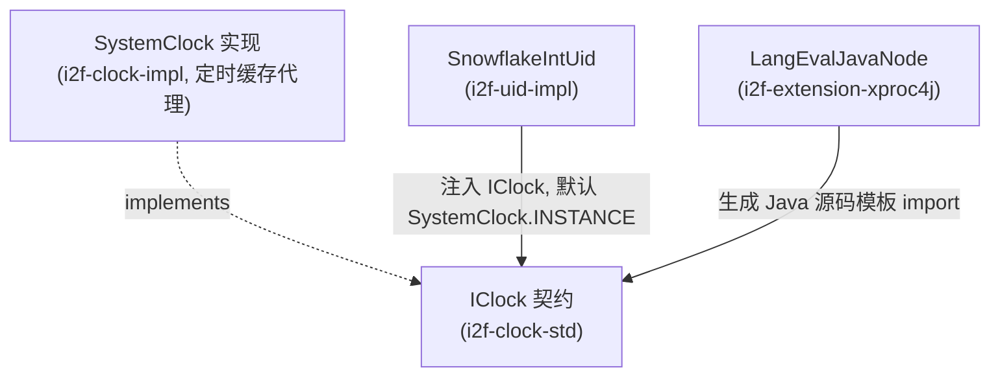

# i2f-clock-std

> 时钟源标准契约层（`i2f-jdk` 组，**纯接口、零实现、零内部依赖**）：以单一接口 `IClock` 约定「当前毫秒」这一唯一必需能力，`currentSeconds()`/`currentMinutes()` 作为 `default` 方法由毫秒派生，把「时间读取」从具体获取策略（原生 `System.currentTimeMillis()` 的 native 调用 vs 定时缓存代理）中解耦出来，供上层（雪花 ID、存储过程表达式引擎等）面向契约注入可替换时钟，是整个 i2f 时间体系（配套实现 `i2f-clock-impl`）的抽象根。

## 模块路径

- `i2f-jdk/i2f-clock-std`

## 模块依赖

| 依赖 | Maven 坐标 | scope | optional | 说明 |
| --- | --- | --- | --- | --- |
| lombok | `org.projectlombok:lombok` | provided | 是（父 DM 治理） | 编译期注解；本模块唯一源文件 `IClock.java` 是一个纯接口，**未使用任何 lombok 注解**，属冗余声明 |

> 本模块无任何 `i2f` 内部模块依赖，是一个自底向上的契约（std）件；其反向被 `i2f-clock-impl` 依赖并实现。

## 模块设计

模块只有一个源文件、一个接口，设计极度收敛：

- 包 `i2f.clock.std`：
  - `IClock`：时间源契约。
    - `long currentMillis()`：**唯一抽象方法**，实现类必须提供的「当前epoch毫秒」原语。
    - `default long currentSeconds()`：`currentMillis() / 1000`，由毫秒派生的秒。
    - `default long currentMinutes()`：`currentMillis() / 1000 / 60`，由毫秒派生的分钟。

设计要点：

1. **「一个原语 + 派生量」最小契约**：只强制实现 `currentMillis()`，秒/分钟以 `default` 方法收敛在接口内，避免每个实现重复样板，也保证派生口径统一。
2. **面向契约而非实现**：接口不规定时间如何取得——可以是直连 native 的 `System.currentTimeMillis()`，也可以是 `i2f-clock-impl.SystemClock` 那种「守护线程每 1ms 刷新一个 `volatile` 缓存」的高性能代理，消费方仅依赖 `IClock` 即可自由替换。
3. **可注入 / 可测试**：因为读时能力被抽象成接口，消费方（如 `SnowflakeIntUid`）可通过构造器注入任意 `IClock`（含假时钟），便于单测与替换。

## 模块目的

- 为「获取当前时间」提供一层可替换、可注入的抽象，屏蔽不同时间获取策略的性能/实现差异。
- 让上层模块（尤其依赖毫秒时间戳的分布式 ID 生成）与具体的 `SystemClock` 实现之间只通过契约耦合，实现 std/impl 分层解耦。
- 统一秒、分钟等派生时间量的换算口径，避免散落在各处的 `/1000`、`/1000/60` 硬编码。

## 模块功能

- 定义时钟源契约 `IClock`，提供 `currentMillis()` 抽象方法与 `currentSeconds()`/`currentMinutes()` 两个派生 `default` 方法。
- 作为 `i2f-clock-impl`（`SystemClock` 高性能缓存时钟实现）的实现目标，以及被 `i2f-uid-impl`、`i2f-extension-xproc4j` 等消费的抽象根。

## 模块主要使用方法

- **实现**：`class MyClock implements IClock { public long currentMillis(){ ... } }`，仅需实现毫秒原语。
- **消费**：面向 `IClock` 编程，例如 `i2f-uid-impl` 的 `SnowflakeIntUid` 持有 `private IClock clock = SystemClock.INSTANCE;` 并提供 `SnowflakeIntUid(IClock clock)` 构造器注入替换。
- **注意**：秒/分钟是 `long` 整型除法，向零截断（丢失不足 1 秒/1 分的余数）；契约无纳秒级 `nanoTime` 能力。

## 模块特性总结

- 纯接口契约件，`i2f-jdk` 组内最薄的 std 模块之一（单文件、三方法）。
- 「一个抽象方法 + 两个 default 派生」的最小面积设计，实现方零样板。
- 与 `i2f-clock-impl` 构成 std/impl 分层：本模块定义「读时间」，实现模块决定「怎么读得快」。
- 可注入、可替换、可测试，是分布式 ID 等时间敏感组件的抽象依赖根。
- 零内部依赖、零三方运行期依赖。

## 模块瑕疵或错误

> 以下为静态识别的潜在问题，未做运行实证。

- **lombok 冗余依赖**：pom 声明了 `org.projectlombok:lombok`，但唯一源文件是纯接口，无任何 lombok 注解使用，属可移除的冗余依赖。
- **命名/包结构不对称**：契约包为 `i2f.clock.std`，而实现 `SystemClock` 位于 `i2f.clock`（无 `.impl` 后缀包），std/impl 的包命名约定不一致，跨模块定位时易困惑。
- **派生量精度受限于毫秒原语**：`currentSeconds()`/`currentMinutes()` 直接由 `currentMillis()` 整除得到，无法表达亚秒/亚分精度，也未提供 `nanoTime` 类能力；对高精度计时场景契约覆盖不足。
- **无时间语义约束**：契约未声明「单调不回拨」「时区」「epoch 基准」等语义，实现方（尤其缓存代理型 `SystemClock` 存在毫秒级滞后）与原生 `System.currentTimeMillis()` 在返回值上并不严格等价，替换实现时消费方需自行知晓误差窗口。
- **`maven-assembly-plugin` 对纯契约件意义有限**：本模块继承父 pom 的 assembly 插件配置，但作为被依赖的轻量接口 jar，通常无需自包含打包（无 `Main-Class`、无 fat jar 需求），属继承来的冗余构建配置。
