# i2f-codec-impl

> 编解码**实现层**——落地 `i2f-codec-std` 全部 5 组接口，以 **36 个源文件、12 子包**覆盖 5 大编解码领域（Base 系列 / 原始进制 / 字符集 / 字符串转义 / 压缩流），额外提供 `CodecUtil` 静态门面（25+ 便捷方法）、`DataProtocolUtil`（data: URI 协议）、`Base64Obfuscator`（Base64 混淆）与 `HtmlStringStringCodec`（CER + NCR 双模式 HTML 转义）。核心设计为「算法引擎（`Base16`/`Base32`/`Base64`） + 契约适配器（各 `*Codec` 实现类）」分离，引擎层无 i2f 依赖、可独立复用。依赖 `i2f-codec-std`（契约）+ `i2f-io-stream`（流拷贝）+ `i2f-match`（正则匹配）；lombok 真实使用于 `DataProtocolMeta`。`i2f-extension-swl`/`i2f-extension-jce-bc`/`i2f-extension-jce-sm-antherd`/`i2f-extension-verifycode` 为外部典型消费方。

## 模块路径

- `i2f-jdk/i2f-codec-impl`

## 模块依赖

| 坐标 | scope | optional | 说明 |
|------|-------|----------|------|
| `i2f.turbo:i2f-codec-std` | compile | - | 编解码 std 接口契约 |
| `i2f.turbo:i2f-io-stream` | compile | - | `StreamUtil` 流拷贝，用于压缩流编解码 |
| `i2f.turbo:i2f-match` | compile | - | `RegexUtil` 正则匹配，用于 URL 解码的分段解析 |
| `org.projectlombok:lombok` | provided | - | **真实使用**（`DataProtocolMeta` 的 `@Data` 注解），区别于 std 的冗余声明 |

## 模块设计

### 包结构

```
i2f.codec
├── CodecUtil.java                    # 静态门面（25+ 便捷方法）
├── bytes/
│   ├── base64/
│   │   ├── Base64StringByteCodec.java      # 标准 Base64 (IStringByteCodec)
│   │   ├── Base64UrlStringByteCodec.java   # URL 安全 Base64
│   │   └── Base64MimeStringByteCodec.java  # MIME 格式 Base64
│   ├── basex/
│   │   ├── BaseX.java                      # Base 编解码通用工具
│   │   ├── Base16.java                     # Base16 算法引擎
│   │   ├── Base16StringByteCodec.java      # Base16 适配器
│   │   ├── Base32.java                     # Base32 算法引擎
│   │   ├── Base32StringByteCodec.java      # Base32 适配器
│   │   ├── Base64.java                     # Base64 算法引擎（自定义实现）
│   │   ├── Base64StringByteCodec.java      # Base64 适配器
│   │   └── Base64UrlStringByteCodec.java   # Base64 URL 安全适配器
│   ├── charset/
│   │   └── CharsetStringByteCodec.java     # 字符集转换 (UTF-8/GBK/ISO-8859-1)
│   └── raw/
│       ├── HexStringByteCodec.java         # 十六进制 (IStringByteCodec)
│       ├── DecStringByteCodec.java         # 十进制
│       ├── BinStringByteCodec.java         # 二进制
│       └── OtcStringByteCodec.java         # 八进制
├── str/
│   ├── code/
│   │   ├── UCodeStringCodec.java           # Unicode 转义 \uXXXX (IStringStringCodec)
│   │   ├── XCodeStringCodec.java           # XML/Java 转义 \xXX
│   │   └── UrlCodeStringCodec.java         # %XX URL 编码
│   ├── html/
│   │   ├── HtmlStringStringCodec.java      # HTML 编码组合门面
│   │   ├── cer/
│   │   │   ├── HtmlCerCodec.java           # HTML 字符实体引用编解码
│   │   │   └── HtmlCerTableHolder.java     # CER 对照表（1704 行）
│   │   └── ncr/
│   │       └── HtmlNcrCodec.java           # HTML 数值字符引用编解码
│   ├── obfuscate/
│   │   ├── Base64Obfuscator.java           # Base64 混淆器算法
│   │   └── Base64ObfuscatorCodec.java      # 混淆器 IStringStringCodec 适配器
│   └── url/
│       └── UrlStringStringCodec.java       # URL 标准编码 (java.net.URLEncoder)
├── collection/
│   └── id/
│       └── IdPackCodec.java                # ID 集合打包/解包 (IStringCollectionCodec)
├── compress/
│   ├── deflate/
│   │   └── DeflateByteByteCodec.java       # Deflate 压缩 (IByteByteCodec)
│   ├── gzip/
│   │   └── GzipByteByteCodec.java          # Gzip 压缩 (IByteByteCodec)
│   └── zip/
│       └── ZipByteByteCodec.java           # Zip 压缩 (IByteByteCodec)
├── stream/
│   └── compress/
│       ├── deflate/
│       │   └── DeflateStreamCodecEx.java   # Deflate 流 (IStreamCodecEx)
│       ├── gzip/
│       │   └── GzipStreamCodecEx.java      # Gzip 流 (IStreamCodecEx)
│       └── zip/
│           └── ZipStreamCodecEx.java       # Zip 流 (IStreamCodecEx)
└── data/
    ├── DataProtocolUtil.java               # data: URI 协议编解码
    └── DataProtocolMeta.java               # data: URI 元数据模型 (@Data)
```

### 架构分层

```mermaid
flowchart TD
    subgraph Std["i2f-codec-std (契约)"]
        ISBC["IStringByteCodec<br/>String↔byte[]"]
        ISSC["IStringStringCodec<br/>String↔String"]
        ISCC["IStringCollectionCodec<br/>String↔Collection"]
        IBBC["IByteByteCodec<br/>byte[]↔byte[]"]
        ISCE["IStreamCodecEx<br/>OutputStream↔InputStream"]
    end

    subgraph Impl["i2f-codec-impl (实现)"]
        CU["CodecUtil<br/>静态门面"]
        
        subgraph Byte["字节编解码"]
            B64["Base64StringByteCodec"]
            B64U["Base64UrlStringByteCodec"]
            B64M["Base64MimeStringByteCodec"]
            B16["Base16StringByteCodec"]
            B32["Base32StringByteCodec"]
            HEX["HexStringByteCodec"]
            BIN["BinStringByteCodec"]
            DEC["DecStringByteCodec"]
            OTC["OtcStringByteCodec"]
            CHR["CharsetStringByteCodec"]
        end

        subgraph Str["字符串编解码"]
            URL["UrlCodeStringByteCodec"]
            URL2["UrlStringStringCodec"]
            HTML["HtmlStringStringCodec"]
            UCD["UCodeStringCodec"]
            XCD["XCodeStringCodec"]
            OBF["Base64ObfuscatorCodec"]
        end

        subgraph Col["集合编解码"]
            IDP["IdPackCodec"]
        end

        subgraph Cmp["压缩编解码"]
            GZ["GzipByteByteCodec"]
            DF["DeflateByteByteCodec"]
            ZP["ZipByteByteCodec"]
        end

        subgraph StrCmp["流式压缩"]
            SGZ["GzipStreamCodecEx"]
            SDF["DeflateStreamCodecEx"]
            SZP["ZipStreamCodecEx"]
        end

        subgraph Misc["其他"]
            DP["DataProtocolUtil"]
        end
    end

    ISBC --> B64 & B64U & B64M & B16 & B32 & HEX & BIN & DEC & OTC & CHR
    ISSC --> URL & URL2 & HTML & UCD & XCD & OBF
    ISCC --> IDP
    IBBC --> GZ & DF & ZP
    ISCE --> SGZ & SDF & SZP
    
    CU -. "委托" .-> Byte & Str & Col & Cmp & StrCmp
```



### 设计模式

1. **策略 + 适配器**：`Base16`/`Base32`/`Base64` 是独立于 i2f 框架的纯算法引擎，`*StringByteCodec` 是将其适配到 `IStringByteCodec` 契约的薄包装层。
2. **门面模式**：`CodecUtil` 为 25+ 种编解码操作提供单一静态入口，所有方法直接委托单例 `INSTANCE`。
3. **装饰器组合**：`HtmlStringStringCodec` 内部组合 `HtmlCerCodec`（字符实体）与 `HtmlNcrCodec`（数值引用），支持 CER-only、CER+NCR 双模式。
4. **单例模式**：几乎所有 `*Codec` 实现类持有 `public static final INSTANCE` 单例。

## 模块目的

- 为 `i2f-codec-std` 的全部 5 组接口提供完整的本地实现，确保全仓编解码能力开箱即用。
- 以 `CodecUtil` 静态门面消除使用者的构造/选择成本，实现一行代码完成常见编解码（如 `CodecUtil.toHexString(data)`）。
- 提供超出 std 契约但实用的扩展能力：data: URI 协议、Base64 混淆、HTML 双模式转义、流式压缩。
- 算法引擎与 i2f 框架解耦，使 `Base16`/`Base32`/`Base64` 等核心算法可被独立复用。

## 模块功能

### 字节编解码（IStringByteCodec 实现）

| 类 | 编码 | 解码 | 说明 |
|------|------|------|------|
| `Base64StringByteCodec` | `byte[] → String` | `String → byte[]` | 标准 Base64（`java.util.Base64`） |
| `Base64UrlStringByteCodec` | 同上 | 同上 | URL 安全 Base64（`-`/`_` 替代 `+`/`/`） |
| `Base64MimeStringByteCodec` | 同上 | 同上 | MIME 格式（每 76 行换行） |
| `HexStringByteCodec` | 同上 | 同上 | 十六进制，支持分隔符 |
| `BinStringByteCodec` | 同上 | 同上 | 二进制 `0101`，支持分隔符 |
| `DecStringByteCodec` | 同上 | 同上 | 十进制，支持分隔符 |
| `OtcStringByteCodec` | 同上 | 同上 | 八进制，支持分隔符 |
| `Base16StringByteCodec` | 同上 | 同上 | Base16 编码（自定义算法引擎） |
| `Base32StringByteCodec` | 同上 | 同上 | Base32 编码（自定义算法引擎） |
| `CharsetStringByteCodec` | 同上 | 同上 | 字符集转换（UTF-8/GBK/ISO-8859-1 预置常量） |

### 字符串编解码（IStringStringCodec 实现）

| 类 | 说明 |
|------|------|
| `UrlCodeStringCodec` | `%XX` 格式 URL 编码（UTF-8，支持字母跳过和排除字符） |
| `UrlStringStringCodec` | 标准 `java.net.URLEncoder/URLDecoder` 封装 |
| `HtmlStringStringCodec` | HTML 转义门面，组合 `HtmlCerCodec` + `HtmlNcrCodec` |
| `UCodeStringCodec` | Unicode 转义（`\uXXXX`） |
| `XCodeStringCodec` | XML/Java 转义（`\xXX`） |
| `Base64ObfuscatorCodec` | Base64 混淆器（每 2 位随机插入 hex 字符） |

### 集合与压缩

| 类 | 接口 | 说明 |
|------|------|------|
| `IdPackCodec<T,C>` | `IStringCollectionCodec` | 集合 ID 打包（`1,2,3`↔`Set`），支持 `Object`/`Long`/`Integer`/`String` 预置实例 |
| `GzipByteByteCodec` | `IByteByteCodec` | Gzip 字节压缩/解压 |
| `DeflateByteByteCodec` | `IByteByteCodec` | Deflate 字节压缩/解压 |
| `ZipByteByteCodec` | `IByteByteCodec` | Zip 字节压缩/解压 |
| `GzipStreamCodecEx` | `IStreamCodecEx` | Gzip 流式压缩/解压 |
| `DeflateStreamCodecEx` | `IStreamCodecEx` | Deflate 流式压缩/解压 |
| `ZipStreamCodecEx` | `IStreamCodecEx` | Zip 流式压缩/解压 |

### 扩展功能

| 类 | 说明 |
|------|------|
| `DataProtocolUtil` | data: URI 协议解析与构建（`data:[mime][;codec],body`） |
| `Base64Obfuscator` | Base64 混淆算法（可逆，增加暴力破解难度） |
| `HtmlCerTableHolder` | HTML 字符实体引用对照表（1704 行，涵盖几乎所有命名实体） |

## 模块主要使用方法

### 1. CodecUtil 静态门面（推荐方式）

```java
// 字节编解码
String hex = CodecUtil.toHexString(new byte[]{0x48, 0x65}); // "4865"
byte[] data = CodecUtil.ofHexString("4865");

String b64 = CodecUtil.toBase64("Hello".getBytes());
byte[] raw = CodecUtil.ofBase64(b64);

// 字符串编解码
String urlEnc = CodecUtil.toUrl("a b"); // "a+b"
String urlDec = CodecUtil.ofUrl("a+b");

String html = CodecUtil.toHtml("<script>"); // "&lt;script&gt;"

// 压缩
byte[] gzipped = CodecUtil.toGzip(data);
byte[] ungzipped = CodecUtil.ofGzip(gzipped);

// 流式压缩
CodecUtil.toGzip(inputStream, outputStream);
CodecUtil.ofGzip(inputStream, outputStream);

// ID 打包
String ids = CodecUtil.packIds(1L, 2L, 3L); // "1,2,3"
Set<Long> parsed = CodecUtil.unpackIdsAsLong("1,2,3");
```

### 2. 直接使用实现类

```java
// 使用单例
String hex = HexStringByteCodec.INSTANCE.encode(data);

// 自定义分隔符
String hexSep = new HexStringByteCodec(" ").encode(data); // "48 65"

// 流式压缩
GzipStreamCodecEx.INSTANCE.encode(inputStream, outputStream);
```

### 3. 面向接口编程

```java
// 注入 std 接口，实现可替换
IStringByteCodec codec = new Base64UrlStringByteCodec();
String encoded = codec.encode(data); // URL 安全的 Base64
```

### 4. data: URI 协议

```java
// 图片转 data URI
String uri = DataProtocolUtil.imageFileToUri(new File("photo.png"));
// data:image/png;base64,iVBORw0KGgo...

// 解析 data URI
DataProtocolMeta meta = DataProtocolUtil.ofUri(uri);
String mimeType = meta.getMimeType(); // "image/png"
String body = meta.getDataBody();     // base64 数据体
```

## 模块特性总结

- **全接口覆盖**：落地 `i2f-codec-std` 全部 5 组接口（`IStringByteCodec` 10 个 + `IStringStringCodec` 6 个 + `IStringCollectionCodec` 1 个 + `IByteByteCodec` 3 个 + `IStreamCodecEx` 3 个 = 23 个实现类）。
- **引擎与适配器分离**：`Base16`/`Base32`/`Base64` 为纯算法引擎，零 i2f 依赖可独立复用；`*StringByteCodec` 为薄适配层。
- **统一静态门面**：`CodecUtil` 提供 25+ 个 `to*`/`of*` 方法，一行完成常见编解码。
- **实用扩展**：data: URI 协议（前端图片嵌入）、Base64 混淆（防止明文识别）、HTML 双模式转义（CER + NCR）。
- **流式 + 字节双模式压缩**：Gzip/Deflate/Zip 同时提供 `IByteByteCodec`（内存）和 `IStreamCodecEx`（流式）两种接口适配。
- **单例通用**：所有实现类暴露 `INSTANCE` 静态常量，支持无状态复用。

## 下游与关联

### 直接下游

| 模块 | 关系 | 说明 |
|------|------|------|
| `i2f-codec-std` | 父契约 | 本模块实现的接口定义 |
| `i2f-extension-swl` | 消费者 | 使用 `HexStringByteCodec`/`Base64StringByteCodec`/`CharsetStringByteCodec` 进行密钥/消息编解码 |
| `i2f-extension-jce-bc` | 消费者 | 使用 `HexStringByteCodec` 进行 SM2 编解码 |
| `i2f-extension-jce-sm-antherd` | 消费者 | 使用 `HexStringByteCodec` 进行 SM2/SM4/SM2 签名编解码 |
| `i2f-extension-verifycode` | 消费者 | 使用 `Base64UrlStringByteCodec` 编解码验证码图片 |
| `i2f-jdk-all` | 聚合 | 聚合包纳入 |

### 与 std 的关系

作为 `std` 架构的经典实现层，本模块遵循「实现类命名即契约」约定：`Base64StringByteCodec` 对应 `IStringByteCodec`，`GzipByteByteCodec` 对应 `IByteByteCodec`，`GzipStreamCodecEx` 对应 `IStreamCodecEx`，命名即文档。

## 已知实现瑕疵

- **HtmlCerTableHolder 体积庞大**：1704 行的 CER 对照表可抽为资源文件而非内联代码。
- **Base64Obfuscator 固定算法**：混淆算法硬编码（每 2 位插入 1 位 hex），无可配置混淆强度。
- **UrlCodeStringCodec 解码正则开销**：`%XX` 解码使用 `RegexUtil.regexFindParts` 逐段解析，对长 URL 性能可观。
- **部分实现类无单例**：如 `HexStringByteCodec(separator)` 有状态（分隔符），使用者需自行管理实例复用。