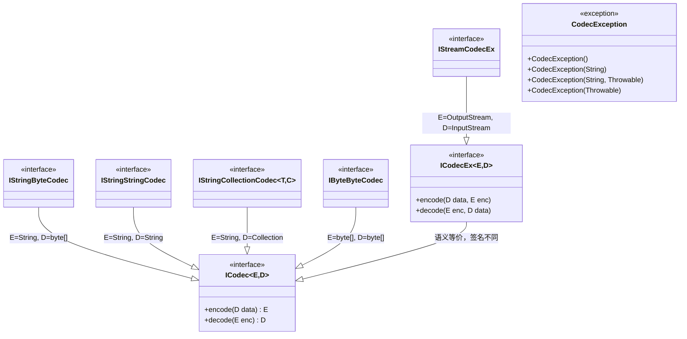

# i2f-codec-std

> 编解码**标准契约层**（`std` 契约与实现分离），延续 `i2f-cache-std`/`i2f-clock-std`/`i2f-ai-std` 的「接口稳定、实现可换」范式。全模块仅 **8 个类型**（7 接口 + 1 异常），零 i2f 内部依赖、零三方运行期依赖，以根接口 `ICodec<E,D>` 用 `encode/decode` 双动词抽象「类型 E 与类型 D 之间的双向转换」，再沿**数据形态**（`String↔byte[]` / `String↔String` / `String↔Collection` / `byte[]↔byte[]` / `OutputStream↔InputStream`）正交泛化出 5 个专职子接口，再以 `ICodecEx<E,D>`（目标作为入参而非返回值）补充流式场景；`CodecException` 提供标准异常机制。`i2f-codec-impl`（~25 个实现类：Base64/Hex/Charset/UrlCode/Html/UCode/XCode/Deflate/Gzip/Zip/IdPack 等）与 `i2f-serialize-std`/`i2f-crypto-std` 均为其下游实现 / 消费者。

## 模块路径

- `i2f-jdk/i2f-codec-std`

## 模块依赖

| 坐标 | scope | optional | 说明 |
|------|-------|----------|------|
| `org.projectlombok:lombok` | provided | - | **声明未用**，8 个源文件均无 lombok 注解，属冗余声明 |

**内部依赖**：无（零 i2f 内部依赖，纯独立契约包）。

## 模块设计

### 包结构

```
i2f.codec.std
├── ICodec.java              # 根接口：encode(D)→E, decode(E)→D
├── ICodecEx.java            # 流式变体：encode(D,E), decode(E,D)
├── exception/
│   └── CodecException.java  # 编解码运行期异常
├── bytes/
│   └── IStringByteCodec.java    # String ↔ byte[]
├── str/
│   └── IStringStringCodec.java  # String ↔ String
├── collection/
│   └── IStringCollectionCodec.java  # String ↔ Collection<T>
├── compress/
│   └── IByteByteCodec.java    # byte[] ↔ byte[]
└── stream/
    └── IStreamCodecEx.java    # OutputStream ↔ InputStream (ICodecEx 变体)
```

### 继承架构



### 设计原则

1. **单向数据流向**：`encode(D→E)` 正向编码/压缩/序列化，`decode(E→D)` 反向解码/解压/反序列化。
2. **正交泛化**：根接口用两个泛型参数覆盖所有编解码场景，子接口通过**固定泛型实参**表达具体数据形态。
3. **契约与实现分离**：本模块仅定义接口契约，零实现逻辑；`i2f-codec-impl` 提供约 25 个实现类，`i2f-serialize-std`/`i2f-crypto-std` 等通过接口组合复用。
4. **双接口变体**：`ICodec`（返回值风格）与 `ICodecEx`（目标入参风格）分别适配「值转换」与「流处理」两种场景。

## 模块目的

- 为 i2f-turbo 全仓的编解码、序列化、压缩、加密等能力提供**统一的接口契约**，确保所有实现类可互换、可组合。
- 以最小接口粒度（双泛型根接口 + 固定泛型子接口）覆盖 **5 种常见数据形态转换**，避免接口膨胀。
- 通过 `ICodecEx` 流式变体支持大数据的零拷贝处理（OutputStream/InputStream 直接对接）。

## 模块功能

| 接口 | 数据形态 | 典型应用场景 |
|------|---------|-------------|
| `IStringByteCodec` | `String ↔ byte[]` | Base64/Hex/Charset 编解码 |
| `IStringStringCodec` | `String ↔ String` | URL 编码、HTML 实体转义、Unicode 转义 |
| `IStringCollectionCodec<T,C>` | `String ↔ Collection<T>` | ID 打包/解包（`1,2,3` ↔ `List<Integer>`） |
| `IByteByteCodec` | `byte[] ↔ byte[]` | Deflate/Gzip/Zip 压缩解压、对称加密 |
| `IStreamCodecEx` | `OutputStream ↔ InputStream` | 流式编解码（以 OutputStream 为输出目标） |
| `ICodecException` | - | 统一的编解码异常类型 |

## 模块主要使用方法

### 1. 根接口 ICodec

```java
// 直接面向接口编程，实现由 i2f-codec-impl 提供
ICodec<String, byte[]> codec = new Base64StringByteCodec();

String encoded = codec.encode("Hello".getBytes());
byte[] decoded = codec.decode(encoded);
```

### 2. 流式变体 ICodecEx

```java
// 目标作为入参，适合「写入到已有 OutputStream」
IStreamCodecEx codec = new GzipByteByteCodec();
codec.encode(inputStream, outputStream); // 压缩到 outputStream
codec.decode(outputStream, inputStream); // 解压到 outputStream
```

### 3. 子接口形态固化

各子接口仅固化泛型参数，无新增方法，所有子接口实例均可赋值给父接口：

```java
IStringStringCodec urlCodec = new UrlCodeStringCodec();

ICodec<String, String> parent = urlCodec; // 向上转型
String encoded = urlCodec.encode("a b");  // "a+b"
String decoded = urlCodec.decode("a+b");  // "a b"
```

## 模块特性总结

- **纯接口契约**：全模块仅 7 接口 + 1 异常，零实现、零逻辑、零运行期 i2f 内部依赖。
- **泛型正交设计**：根接口 `ICodec<E,D>` 双泛型覆盖全部编解码场景，5 个子接口通过固化泛型参数表达具体数据形态。
- **返回值与流式双变体**：`ICodec`（返回值风格） + `ICodecEx`（目标入参风格）分别适配值转换与流处理。
- **统一异常体系**：`CodecException extends RuntimeException` 为全仓编解码提供一致的异常基类。
- **无冗余运行期依赖**：pom 中 lombok 声明未用，运行期零三方依赖。

## 下游与关联

### 直接下游

| 模块 | 关系 | 说明 |
|------|------|------|
| `i2f-codec-impl` | **实现层** | ~25 个实现类（Base64/Hex/Charset/UrlCode/Html/UCode/XCode/Deflate/Gzip/Zip/IdPack 等） |
| `i2f-serialize-std` | 依赖 | 序列化标准层依赖 `i2f-codec-std` 的字节转换能力 |
| `i2f-crypto-std` | 依赖 | 加密标准层依赖编解码契约 |
| `i2f-jdk-all` | 聚合 | 聚合包纳入 |

### 兄弟 std 模块

与 `i2f-cache-std`/`i2f-clock-std`/`i2f-ai-std` 共享「纯接口契约层」架构范式：根接口（双泛型 `ICodec<E,D>`） → 子接口（固化泛型 `IStringByteCodec` 等） → 实现模块（`i2f-codec-impl`） → 上层模块面向接口消费。

## 已知实现瑕疵

- **lombok 冗余声明**：pom 声明 `lombok` provided，但 8 个源文件均无注解，可安全移除。
- **泛型子接口无约束**：`IStringCollectionCodec<T, C extends Collection<T>>` 虽然声明了上限，但 `ICodec<String, C>` 父接口在运行时无法约束 `T` 与集合元素类型的一致性，需使用者自行保证。