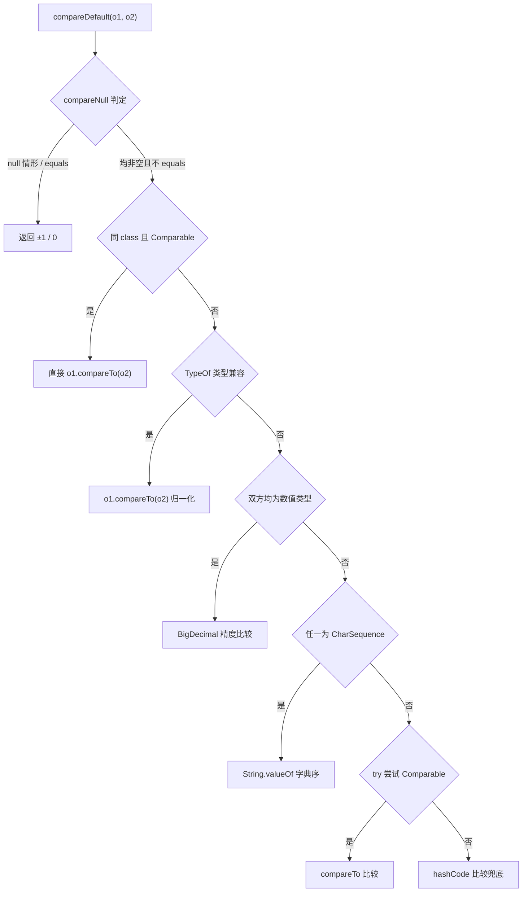
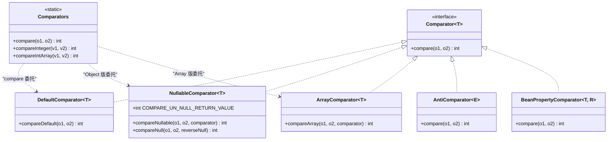

# i2f-comparator

> **通用比较器工具箱**（6 类、约 760 行源码、零三方依赖）——为 `Comparator` 场景补齐 JDK 缺失的「null 安全 / 跨类型 / 按属性 / 按数组 / 反序」五种能力。核心是 `NullableComparator` 提出的 **null 哨兵协议**：静态 `compareNull()` 先行判定 null 与 `equals` 情形，双方均非空时返回哨兵值 `COMPARE_UN_NULL_RETURN_VALUE=9` 交由调用方继续比较，`reverseNull`/`reverseResult` 两个布尔开关贯穿全模块（null 排前还是排后、结果是否取反）；`DefaultComparator.compareDefault()` 在此之上实现**万能兜底比较级联**——同类 `Comparable` → `TypeOf` 类型兼容（父子类/基本类型包装）→ 双方数值（`BigDecimal` 精度比较）→ 任一 `CharSequence`（`String.valueOf` 字典序）→ try 尝试 `Comparable` → `hashCode` 兜底，是「两个任意对象」可比的最小公约实现；`ArrayComparator` 对 `T[]` 与 8 种基本类型数组提供字典序逐元素比较（4 重载链）；`AntiComparator`/`BeanPropertyComparator` 以装饰器形态提供反序与「按方法引用提取属性比较」；`Comparators` 是**为方法引用而生**的静态门面（约 28 个方法，`Comparators::compareInteger` 可直接充当 `Comparator<Integer>`）。真实消费方为 `i2f-proxy-handlers` 的 `ValidateProxyHandler`（用 `compareDefault` 做 `@Validate` 值相等与 min/max 范围判定）。

## 模块路径

- `i2f-jdk/i2f-comparator`

## 模块依赖

| 坐标 | scope | optional | 说明 |
|---|---|---|---|
| `i2f.turbo:i2f-typeof` | compile | false | `DefaultComparator` 用 `TypeOf.typeOf()` 判定父子类/包装基本类型兼容后走 `compareTo` 分支 |
| `i2f.turbo:i2f-convert` | compile | false | `DefaultComparator` 用 `ObjectConvertor.isNumericType()` 识别数值类型后走 `BigDecimal` 精度比较分支 |

> 零三方依赖（无 lombok 声明）：全部类为纯 JDK 实现。

## 模块设计

### 1. null 哨兵协议（贯穿全模块的基石）

`NullableComparator.compareNull(o1, o2, reverseNull)` 是全模块的最底层原语，返回三态：

- `0`：`o1 == o2`（引用相同）或 `o1.equals(o2)`
- `±1`：恰有一方为 null（`reverseNull=false` 时 null 排前，`true` 时 null 排后）
- **哨兵值 `9`**（`COMPARE_UN_NULL_RETURN_VALUE`）：双方均非空且不 equals，调用方应继续执行真正的比较逻辑

上层所有比较入口（`compareNullable`/`compareArray`/`compareDefault`）都先调用 `compareNull`，若返回哨兵值才继续，从而把 null 处理逻辑收敛到单点。

### 2. 双开关设计（reverseNull / reverseResult）

- `reverseNull`：控制 null 的排序位置（仅影响 null 参与的比较）
- `reverseResult`：控制最终结果是否取反（`ret = reverseResult ? -ret : ret`），用于实现降序

`NullableComparator` 与 `ArrayComparator` 均提供「无参 / 单开关 / 双开关」三级构造器；`DefaultComparator` 与 `Comparators` 的静态方法内置 `false/false` 默认。

### 3. DefaultComparator 兜底级联（万能比较）

`compareDefault(o1, o2)` 按优先级逐级降级，直到命中可比较路径：



### 4. 装饰器族

- `AntiComparator<E>`：结果取反实现反序（`0 - val`）
- `NullableComparator<T>`：给任意比较器套上 null 安全与双开关
- `ArrayComparator<T>`：`T[]` 字典序比较（逐元素借助 `NullableComparator.compareNullable`，先短后长）
- `BeanPropertyComparator<T,R>`：按 `Function<T,R>` getter 提取属性后比较，内嵌两个 `protected` 比较器字段（`embedComparator` 属性值比较、`innerComparator` 取值+委托比较）供子类扩展

### 5. 方法引用门面

`Comparators` 的全部静态方法签名（`(v1, v2) -> int`）天然适配 `Comparator<T>` 函数式接口，注释明示用法 `Comparators::compareInteger`；另提供 `of(Comparator<T>)` 恒等转换做类型锚点。

## 模块目的

- 补齐 JDK `Comparator` 生态缺失的五块拼图：null 安全包装、任意对象万能比较、数组字典序比较、反序装饰、按属性（方法引用）比较。
- 为「值相等判定 / 数值范围校验 / 排序」等场景提供跨类型统一的比较入口（如 `String` 与 `Integer` 混比、父子类混比、数值跨包装类型精比）。
- 以方法引用友好的静态门面降低 lambda 样板代码。

## 模块功能

| 功能 | 类 | 方法入口 | 说明 |
|---|---|---|---|
| null 安全包装 | `NullableComparator` | `compareNullable(o1, o2, cmp[, reverseNull[, reverseResult]])` | 先判 null 再委托内部比较器 |
| null/equals 判定原语 | `NullableComparator` | `compareNull(o1, o2, reverseNull)` | 三态返回，哨兵值 `9` 表示需继续 |
| 万能默认比较 | `DefaultComparator` | `compareDefault(o1, o2[, reverseNull[, reverseResult]])` | 六级兜底级联 |
| 数组字典序比较 | `ArrayComparator` | `compareArray(T[], T[], cmp[, ...])` | 对象数组 + 泛型比较器 |
| 基本类型数组比较 | `ArrayComparator` | `compareBooleanArray`/`compareByteArray`/`compareCharArray`/`compareDoubleArray`/`compareFloatArray`/`compareIntArray`/`compareLongArray`/`compareShortArray(short[]...)` | 8 种原始类型 × 4 重载链 |
| 反序装饰 | `AntiComparator` | `new AntiComparator<>(cmp)` | 结果取反 |
| 按属性比较 | `BeanPropertyComparator` | `new BeanPropertyComparator<>(getter)` | 方法引用提取属性后比较 |
| 基本类型比较门面 | `Comparators` | `compareBoolean/Byte/Char/Double/Float/Integer/Long/Short`（原始值）+ `xxxObject`（包装值） | 共 16 个方法，适配方法引用 |
| 数组比较门面 | `Comparators` | `compareArray(T[], T[])` + 8 个基本类型数组方法 | 委托 `ArrayComparator` |
| 泛型入口 | `Comparators` | `compare(T o1, T o2)` / `compare(v1, v2, cmp)` | 前者委托 `DefaultComparator`，后者 null 前置（null 恒排前） |

## 模块主要使用方法

```java
// 1. 方法引用式比较（Comparators 门面的设计初衷）
List<Integer> list = Arrays.asList(3, 1, 2);
list.sort(Comparators::compareInteger);
list.sort(Comparators::compareIntegerObject);

// 2. 任意对象万能比较（六级兜底）
Comparators.compare("a", 1);            // CharSequence 分支 → String.valueOf 字典序
Comparators.compare(1, 2L);             // 数值分支 → BigDecimal 精度比较
DefaultComparator.compareDefault(a, b); // 直接调用

// 3. null 安全包装（null 排前/排后 + 结果取反）
Comparator<String> nullFirst = new NullableComparator<>(String::compareTo);
Comparator<String> nullLastDesc = new NullableComparator<>(String::compareTo, true, true);

// 4. 数组比较
ArrayComparator.compareIntArray(new int[]{1, 2}, new int[]{1, 3});       // 逐元素字典序
ArrayComparator.compareArray(new String[]{"a"}, new String[]{"a", "b"}); // 短者在前

// 5. 按属性比较（方法引用提取）
users.sort(new BeanPropertyComparator<>(User::getAge));
users.sort(new AntiComparator<>(new BeanPropertyComparator<>(User::getAge))); // 年龄降序

// 6. 数值范围校验场景（下游 ValidateProxyHandler 的用法）
if (DefaultComparator.compareDefault(value, min) < 0) { /* 小于下限 */ }
if (DefaultComparator.compareDefault(value, max) > 0) { /* 大于上限 */ }
```

## 模块特性总结

- **null 哨兵协议**：`compareNull` 三态返回（`0`/`±1`/哨兵 `9`），null 处理单点收敛，全模块复用
- **双开关贯穿**：`reverseNull`（null 位置）+ `reverseResult`（结果取反），装饰器提供三级构造器
- **六级兜底级联**：同类 → 类型兼容 → 数值（`BigDecimal`）→ `CharSequence` → `Comparable` 尝试 → `hashCode` 兜底，任意对象可比
- **跨类型智能识别**：依赖 `i2f-typeof`（父子类/包装基本类型）与 `i2f-convert`（数值类型）判定，`Integer` 与 `Long`、`int` 与 `Integer` 等跨包装数值可精比
- **全类型数组覆盖**：`T[]` + 8 种基本类型数组 × 4 重载链 = 37 个比较入口
- **方法引用友好**：`Comparators` 约 28 个静态方法，`Comparators::compareInteger` 即得 `Comparator<Integer>`
- **零三方依赖**：仅依赖 `i2f-typeof`/`i2f-convert` 两个内部模块



## 已知实现瑕疵

| 瑕疵 | 位置 | 现象 | 影响 |
|---|---|---|---|
| **方法名复制粘贴笔误** | `Comparators` L135 | `compareBooleanArray(short[] v1, short[] v2)` 入参是 `short[]` 却命名为 `BooleanArray`（应为 `compareShortArray`） | 通过 `Comparators::compareBooleanArray` 方法引用时名字与实际语义不符，破坏 8 基本类型命名规律（其余 7 个均 `compareXxxArray`），易误用 |
| **归一化死代码 + 符号丢失** | `DefaultComparator` L56–63、L86–93 | `if (ret > 0) { ret = -1; }` 后紧跟无条件 `ret = 1;`，前一行成为死代码；且无论方向非零结果一律返回 `1` | 父子类混合比较时丢失比较方向，违反 `Comparator` 反对称契约（`compare(a,b)` 与 `compare(b,a)` 可能同时为正），参与 `TimSort` 排序时可能结果错乱甚至抛 "Comparison method violates its general contract" |
| **实例开关不可配置** | `DefaultComparator` | `reverseNull`/`reverseResult` 为私有字段，无 setter、无带参构造，实例模式永远 `false/false` | 与 `NullableComparator`/`ArrayComparator` 的三级构造器不一致，实例路径的开关形同虚设 |
| **原始类型数组装箱开销** | `ArrayComparator` 8 个原始类型数组方法 | 每个元素经 `NullableComparator.compareNullable` 比较（自动装箱为包装类型 + 冗余 null 判定——原始类型元素永不为 null） | 大数组排序时产生每元素装箱与额外判空开销 |
| **hashCode 兜底语义模糊** | `DefaultComparator` L98 | 兜底以 `Integer.compare(o1.hashCode(), o2.hashCode())` 收尾 | 未重写 `hashCode` 的对象使用 identity hash，跨运行不确定；hashCode 相等即返回 `0`（被下游当作「相等」），存在理论误判 |
| **`AntiComparator` 无 null 策略** | `AntiComparator` | 直接 `0 - comparator.compare(o1, o2)` 委托 | null 安全性完全取决于被包装比较器（如直接包装 `String::compareTo` 遇 null 仍 NPE） |

## 下游与关联

| 方向 | 模块 | 用途 |
|---|---|---|
| **消费方** | `i2f-proxy-handlers` (`ValidateProxyHandler`) | 用 `DefaultComparator.compareDefault()` 实现 `@Validate` 注解的值相等判定（`== 0`）与数值范围校验（`< min` / `> max`） |
| **聚合** | `i2f-jdk-all` | 打包纳入聚合坐标 |
| **依赖** | `i2f-typeof` | `TypeOf.typeOf()` 类型兼容判定（父子类 + 包装基本类型双向兼容） |
| | `i2f-convert` | `ObjectConvertor.isNumericType()` 数值类型识别 |
| **无消费方记录** | `AntiComparator` / `BeanPropertyComparator` / `ArrayComparator` / `Comparators` | 全仓 grep 无外部 import（仅模块内部互相引用与 `Comparators` 注释示例），属备用能力 |