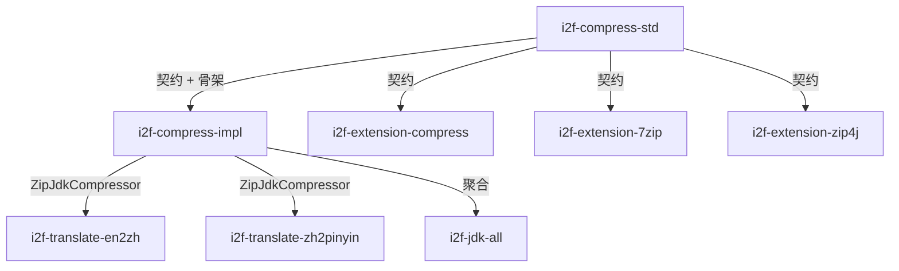

# i2f-compress-impl

> 压缩**JDK 内置实现层**——落地 `i2f-compress-std` 全部契约（`ICompressor` + `ISingleCompressor`），以 **5 个实现类 + 1 个 Test demo** 覆盖 JDK 标准库自带的 5 种压缩格式：归档级 `ZipJdkCompressor` / `JarJdkCompressor`（`extends AbsCompressor`，基于 `java.util.zip.{Zip,Jar}{Output,Input}Stream` 做多文件打包与解包，`ZipEntry`/`JarEntry` 条目遍历，目录项跳过、路径前缀 `"/"` 裁剪）；单流级 `GzipSingleCompressor` / `DeflaterSingleCompressor` / `ZipSingleCompressor`（`implements ISingleCompressor`，各自包装 `GZIP`/`Deflater`/`Zip` JDK 流实现流式压缩与解压，`ZipSingleCompressor` 以固定 `"data"` 条目名模拟单流 Zip、`BlackHoleOutputStream` 吞掉非 `"data"` 条目）。全模块零三方运行期依赖，仅靠 JDK 内置压缩 API + `i2f-io-stream.StreamUtil.streamCopy`（流拷贝）+ `i2f-io-stream.impl.BlackHoleOutputStream`（黑洞流），是 `i2f-extension-7zip`/`i2f-extension-compress`/`i2f-extension-zip4j` 之外最轻量的「开箱即用」压缩方案。`i2f-translate-en2zh`/`i2f-translate-zh2pinyin` 经 `ZipJdkCompressor` 解压内置词典 zip。

## 模块路径

- `i2f-jdk/i2f-compress-impl`

## 模块依赖

| 坐标 | scope | optional | 说明 |
|---|---|---|---|
| `i2f.turbo:i2f-compress-std` | compile | false | 压缩标准契约（`ICompressor`/`ISingleCompressor`/`AbsCompressor`/`CompressBindData`） |
| `i2f.turbo:i2f-io-stream` | compile（传递） | false | `StreamUtil.streamCopy` 流拷贝 + `BlackHoleOutputStream` 黑洞流（经 std 传递） |
| `i2f.turbo:i2f-io-file` | compile | false | 文件工具（pom 显式声明，impl 源文件未直接 import，由继承 `AbsCompressor` 间接使用） |
| `org.projectlombok:lombok` | provided | false | **声明未用**——6 个源文件均无 lombok 注解 |

## 模块设计

### 双轴正交契约 + JDK 实现

延续 `i2f-compress-std` 的「归档级 `ICompressor` / 单流级 `ISingleCompressor`」正交双轴设计：

- **归档级**：`ZipJdkCompressor` / `JarJdkCompressor` `extends AbsCompressor`，复用模板方法 `compressFile`（文件递归遍历→`CompressBindFile`→`CompressBindData`）与默认 `release`（解压到磁盘目录），只需各自实现 `compressBindData`（打包）与可选重写 `release`（解包）。
- **单流级**：`GzipSingleCompressor` / `DeflaterSingleCompressor` / `ZipSingleCompressor` `implements ISingleCompressor`，各自包装 JDK `{GZIP,Deflater,Zip}{Input,Output}Stream`，经 `StreamUtil.streamCopy` 完成流拷贝。

### 打包/解包统一模式

归档压缩模式：`new 流(FileOutput/InputStream)` → `for(CompressBindData)` / `while(Entry)` → `{putNextEntry,streamCopy,closeEntry}` / `{getNextEntry,consumer,closeEntry}` → `close`。

单流压缩模式：`new 流(Output/InputStream)` → `StreamUtil.streamCopy(is, gos/ois)` → `close`。

### ZipSingleCompressor 的单流模拟

以固定条目名 `"data"` 把任意单流包装为 Zip 条目的压缩/解压，解压时遍历所有条目，非 `"data"` 条目经 `BlackHoleOutputStream` 吞噬丢弃，保证主数据流正确提取。

## 模块目的

- 以 **零三方依赖** 提供 JDK 标准库自带的 5 种压缩格式的即用实现
- 作为 `i2f-compress-std` 的默认（最低公共分母）实现层，让基础消费者无需引入任何扩展 jar 即可获得压缩能力
- 与 `i2f-extension-7zip`（SevenZ）、`i2f-extension-compress`（Apache Commons Compress 五格式）、`i2f-extension-zip4j`（Zip4j）形成「JDK 内置 → Apache 补充 → 专用库」三层实现梯度

## 模块功能

| 功能 | 类 | 实现契约 |
|---|---|---|
| Zip 多文件归档压缩/解压 | `ZipJdkCompressor` | `ICompressor`（`extends AbsCompressor`） |
| Jar 多文件归档压缩/解压 | `JarJdkCompressor` | `ICompressor`（`extends AbsCompressor`） |
| Gzip 单流压缩/解压 | `GzipSingleCompressor` | `ISingleCompressor` |
| Deflate 单流压缩/解压 | `DeflaterSingleCompressor` | `ISingleCompressor` |
| Zip 单流压缩/解压（"data" 条目模拟） | `ZipSingleCompressor` | `ISingleCompressor` |

## 模块主要使用方法

### 归档级压缩与解压

```java
// 压缩目录到 zip
ICompressor compressor = new ZipJdkCompressor();
compressor.compress(new File("./output/src.zip"), new File("./target-dir"));

// 解压到目录
compressor.release(new File("./output/src.zip"), new File("./output/release"));
```

### 单流级压缩与解压

```java
ISingleCompressor compressor = new GzipSingleCompressor();

// 压缩：文件输入流 → gzip 文件输出流
try (InputStream is = new FileInputStream("input.txt");
     OutputStream os = new FileOutputStream("input.txt.gz")) {
    compressor.compress(is, os);
}

// 解压：gzip 输入流 → 文件输出流
try (InputStream is = new FileInputStream("input.txt.gz");
     OutputStream os = new FileOutputStream("output.txt")) {
    compressor.release(is, os);
}
```

### 注意事项

- 归档级实现依赖 `File` 作为输入/输出，不支持纯流式归档（应用层传 `File` 再打开流）
- `ZipSingleCompressor` 的 `release` 会遍历所有 Zip 条目并吞掉非 `"data"` 条目，对包含多个条目的 Zip 文件推荐改归档级
- 所有实现**非线程安全**（JDK 压缩流自身非线程安全）

## 模块特性总结

- **零三方运行期依赖**：仅 JDK 内置 `java.util.zip` 包 + `i2f-io-stream.StreamUtil`
- **双轴契约全覆盖**：归档级（`ICompressor`）× 2 实现 + 单流级（`ISingleCompressor`）× 3 实现
- **继承骨架复用**：归档级复写 `AbsCompressor.compressBindData` 即可，`compressFile` 递归遍历与默认 `release` 解压来自骨架
- **流式编排透明**：`StreamUtil.streamCopy` 统一负责流关闭语义（`closeInput`/`closeOutput` 参数），各实现类专注 JDK 流包装
- **Zip 单流模拟**：`ZipSingleCompressor` 以固定 `"data"` 条目名把 Zip 用作单流压缩

## 已知实现瑕疵

1. **release 方法流关闭不一致**：`ZipJdkCompressor.release` 关闭 `zis` 但不关闭 `fis`（`zis.close()` 内部会代理关闭 `fis`，但语义不直观）；`ZipSingleCompressor.release` 显式关闭 `is.close()` 和 `os.close()`，与其他单流实现（委托 `StreamUtil.streamCopy` 参数控制）风格不统一。
2. **`ZipSingleCompressor.release` 的双 close 冗余**：行末 `is.close()` / `os.close()` 独立于 `streamCopy` 的参数控制，若 `streamCopy` 已关闭流则二次 close 抛出 `IOException`（实际 `close()` 通常幂等，但违反防御式编码原则）。
3. **`i2f-io-file` 冗余声明**：pom 声明的 `i2f-io-file` 依赖在 impl 源文件中未直接 import，由 `AbsCompressor`（std 侧）透过 `i2f-io-file` 间接使用，声明在此处仅为保证传递依赖显式化。
4. **`lombok` 未使用**：6 个源文件均无 lombok 注解，属于 pom 冗余声明。
5. **条目大小设置未生效**：`ZipJdkCompressor.compressBindData` 的 `if (input.getSize() >= 0)` 设置 `ZipEntry.setSize`，但 `CompressBindData` 的 `size` 字段默认 `-1`（来自 std 侧），若不主动设置则恒为 `-1` 跳过 setter，语义正确但调用方不易察觉。

## 下游与关联

### 直接消费者（经 `import` grep 确认）

| 模块 | 使用类 | 用途 |
|---|---|---|
| `i2f-translate-en2zh` | `ZipJdkCompressor` | 解压内置英文→中文词典 zip 资源 |
| `i2f-translate-zh2pinyin` | `ZipJdkCompressor` | 解压内置中文→拼音词典 zip 资源 |

### 兄弟扩展层

| 模块 | 格式覆盖 | 底层库 |
|---|---|---|
| `i2f-compress-impl`（本模块） | Zip / Jar / Gzip / Deflate | JDK 内置 |
| `i2f-extension-compress` | Zip / Tar / Jar / Cpio / SevenZ | Apache Commons Compress |
| `i2f-extension-7zip` | SevenZ | 7-Zip-JBinding |
| `i2f-extension-zip4j` | Zip | Zip4j |

### 依赖关系图

