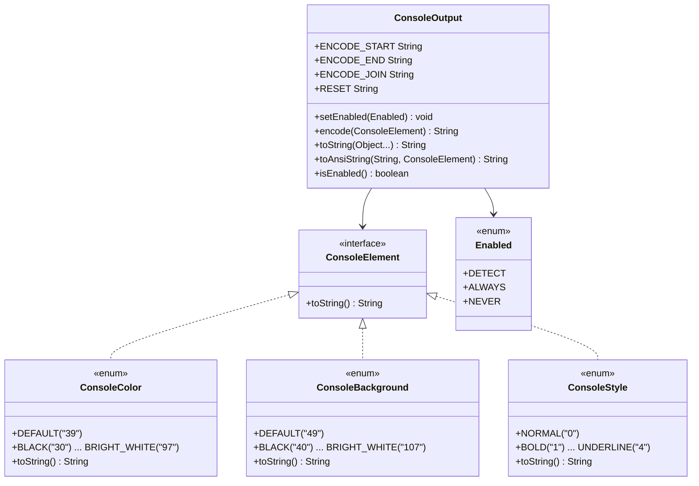

# i2f-console-color

> **ANSI 控制台彩色输出工具**（全模块 6 个源文件、约 330 行源码、**pom 零依赖**）：以 `ConsoleElement` 标记接口为锚，用 3 个枚举（`ConsoleColor` 18 色前景 / `ConsoleBackground` 18 色背景 / `ConsoleStyle` 5 种样式）覆盖标准 ANSI SGR 参数，`ConsoleOutput` 静态门面以 `encode`/`toString`/`toAnsiString` 三组方法自动编排 `\u001b[{code}m` 转义序列（连续元素用 `;` 合并、文本+元素交替紧凑拼装、末尾自动追加 `RESET`），支持 `DETECT`/`ALWAYS`/`NEVER` 三态开关与基于 IDEA agent 检测 + `System.console()` + Windows 判定 的自动化检测。禁用模式下自动过滤 ConsoleElement，仅输出纯文本，方便日志文件等非终端场景复用。`i2f-log-std.StdioLogger` / `i2f-log.DefaultLogDataFormatter` 为其真实消费方（彩色日志行格式化）。

## 模块路径

- `i2f-jdk/i2f-console-color`

## 模块依赖

| 坐标 | scope | optional | 说明 |
|------|-------|----------|------|
| （无） | — | — | pom.xml 的 `<dependencies>` 为空，**运行期零依赖** |

## 模块设计

### 类图



### ANSI 转义序列编排

`ConsoleOutput` 将变长参数 `Object... elements` 中的 `ConsoleElement`（样式/颜色/背景）与普通文本交错排列，规则如下：

1. **连续 `ConsoleElement`**：用 `;` 合并为一条转义序列 `\u001b[{c1};{c2}...m`
2. **`ConsoleElement` 后跟文本**：先关转义 `m`，再输出文本
3. **文本后跟 `ConsoleElement`**：开新转义 `\u001b[`
4. **末尾自动复位**：在所有元素结束后追加 `\u001b[0;39m`（NORMAL + DEFAULT 前景色）
5. **禁用模式**：跳过所有 `ConsoleElement` 实例，仅拼接普通文本（`null` 也跳过）

### 自动检测逻辑

```
isEnabled()
  ├─ enabled==ALWAYS → true
  ├─ enabled==NEVER  → false
  └─ enabled==DETECT
       ├─ 已缓存 ansiCapable → 直接返回
       └─ detectIfAnsiCapable()
            ├─ consoleAvailable==false → false
            ├─ consoleAvailable==null && System.console()==null → false
            └─ 非 Windows 系统 → true
                Windows 系统 → false
```

另在 `static` 初始化块中通过 `ManagementFactory.getRuntimeMXBean().getInputArguments()` 检测 `idea_rt.jar` / `JetBrains debugger-agent.jar`，命中时强制设为 `ALWAYS`（IDEA 内嵌终端支持 ANSI）。

## 模块目的

为 `i2f-turbo-java` 全仓提供纯 JDK 的、零三方依赖的 ANSI 控制台彩色输出能力，供日志格式化（`i2f-log-std` / `i2f-log`）等模块产出彩色终端行，无需引入 JAnsi / Fusesource 等第三方库。禁用模式下自动降级为纯文本，保障日志文件等场景的输出纯净。

## 模块功能

| 功能点 | 入口 | 说明 |
|--------|------|------|
| 前景色 | `ConsoleColor` 枚举 | 18 色（DEFAULT + 8 标准 + 8 亮色），输出 ANSI 30–37 / 90–97 |
| 背景色 | `ConsoleBackground` 枚举 | 18 色（DEFAULT + 8 标准 + 8 亮色），输出 ANSI 40–47 / 100–107 |
| 样式 | `ConsoleStyle` 枚举 | 5 种：NORMAL/BOLD/FAINT/ITALIC/UNDERLINE，输出 ANSI 0–4 |
| 单元素编码 | `ConsoleOutput.encode(element)` | 返回单个 ANSI 转义字符串 |
| 多元素编排 | `ConsoleOutput.toString(elements...)` | 自动拼接多元素 + 普通文本，末尾复位 |
| 文本便捷包装 | `ConsoleOutput.toAnsiString(text, element)` | 一句为文本套上颜色/样式 |
| 启用控制 | `ConsoleOutput.setEnabled(DETECT/ALWAYS/NEVER)` | 三态切换，全局开关 |
| 自动检测 | 初始化 + `detectIfAnsiCapable()` | IDEA 终端自动 ALWAYS、非 Windows 系统检测 |
| 禁用过滤 | `buildDisabled()` | 仅输出非 ConsoleElement 的文本，适合重定向/aop 日志 |

## 模块主要使用方法

### 彩色输出日志前缀

```java
String str = ConsoleOutput.toAnsiString("01-01 12:13:14.123", ConsoleColor.BRIGHT_WHITE)
        + " " + ConsoleOutput.toAnsiString("[INFO ]", ConsoleColor.BRIGHT_BLACK)
        + " " + ConsoleOutput.toAnsiString("[System.out.println]", ConsoleColor.CYAN)
        + " " + ConsoleOutput.toAnsiString("[main-1    ]", ConsoleColor.MAGENTA)
        + " - " + "msg";
System.out.println(str);
```

### 多元素合编

```java
// 输出红色粗体文本后复位
String colored = ConsoleOutput.toString(
    ConsoleColor.RED,
    ConsoleStyle.BOLD,
    "错误信息"
);
// 禁用模式下输出："错误信息"
```

### 强制启用/禁用

```java
// 强制启用（无视终端检测）
ConsoleOutput.setEnabled(ConsoleOutput.Enabled.ALWAYS);

// 强制禁用（纯文本模式，无 ANSI 转义）
ConsoleOutput.setEnabled(ConsoleOutput.Enabled.NEVER);

// 恢复自动检测
ConsoleOutput.setEnabled(ConsoleOutput.Enabled.DETECT);
```

## 模块特性总结

- **零依赖**：pom.xml `<dependencies>` 为空，纯 JDK 实现
- **极简设计**：6 文件 330 行，1 接口 + 3 枚举 + 1 门面 + 1 demo
- **全面 ANSI SGR 覆盖**：前景 18 色 + 背景 18 色 + 5 样式
- **智能编排**：连续元素 `;` 合并、自动 RESET 复位、尾端未闭合补 ENCODE_END
- **三态开关**：ALWAYS / NEVER / DETECT（自动检测）
- **IDEA 检测**：`-javaagent:idea_rt.jar` / `JetBrains debugger-agent.jar` 自动启用
- **禁用洁净化**：过滤 ConsoleElement，仅输出纯文本
- **真实消费**：`i2f-log-std.StdioLogger`（彩色兜底 Logger）与 `i2f-log.DefaultLogDataFormatter`（ANSI 彩色日志行格式化）

## 已知实现瑕疵

1. **Windows 原生终端不兼容**：`detectIfAnsiCapable()` 对 Windows 返回 `false`（`!name.contains("win")`），CMD/PowerShell 原生不解析 ANSI — 但 Windows 10+ 已支持，用户可通过 `setEnabled(ALWAYS)` 手动覆盖
2. **`System.console()` 误判**：`System.console()` 在非交互终端（如 IDE 运行、管道重定向、Maven 构建）返回 `null`，导致自动检测在一部分非 Windows 场景也不启用 — 尽管已对 IDEA agent 做了白名单例外
3. **静态状态不可变**：`enabled`/`consoleAvailable`/`ansiCapable` 为 `static` 可变字段，多线程并发 `setEnabled` 与 `isEnabled` 存在可见性竞态（无 `volatile`/锁）
4. **RESET 码不完整**：`RESET = "0" + ENCODE_JOIN + ConsoleColor.DEFAULT` 仅复位 NORMAL + DEFAULT 前景，未包含 DEFAULT 背景（`49`）与 NORMAL 样式（`0` 已覆盖样式），但 `ConsoleBackground.DEFAULT` 与 `ConsoleStyle.NORMAL` 不在复位中
5. **无 256 色 / TrueColor 支持**：仅标准 ANSI 8+8 色，未扩展 256 色（`38;5;n`/`48;5;n`）或 TrueColor（`38;2;r;g;b`/`48;2;r;g;b`）
6. **连续 RESET 冗余**：`buildEnabled` 末尾在已有 `writingAnsi=true` 时先 `ENCODE_JOIN` 再 `RESET`，而非直接 `RESET`，多输出一个 `;` 前缀

## 下游与关联

| 下游模块 | 使用方式 | 说明 |
|----------|----------|------|
| `i2f-log-std.StdioLogger` | `ConsoleElement`/`ConsoleOutput`/`ConsoleColor` | 兜底 Logger 的彩色 STDIO 输出 |
| `i2f-log.DefaultLogDataFormatter` | `ConsoleElement`/`ConsoleOutput`/`ConsoleColor` | ANSI 彩色日志行格式化 |
| `i2f-extension-slf4j-log` | pom 依赖 | 经 `i2f-log-std` 传递 |
| `i2f-jdk-all` | pom 聚合 | 全量聚合纳入 |