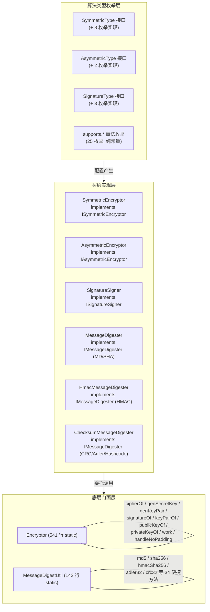
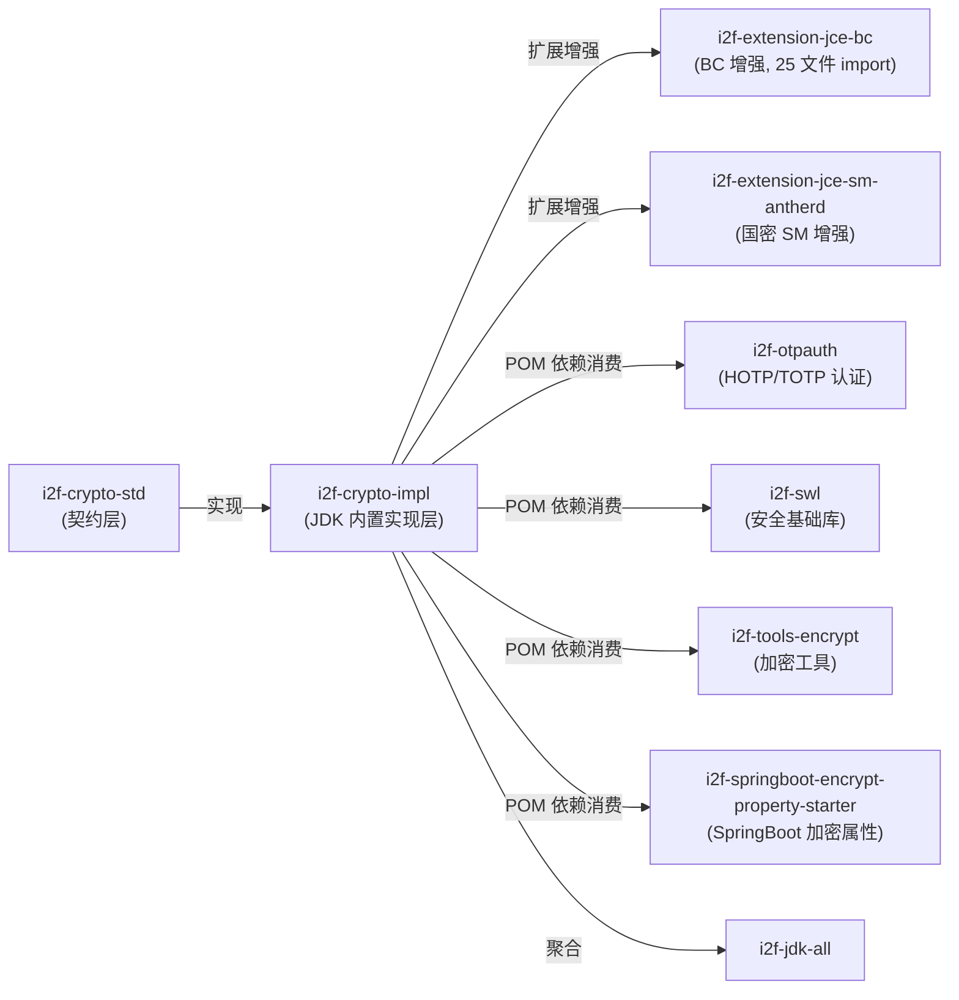

# i2f-crypto-impl

> 加密/解密/摘要/签名**JDK 内置实现层**——落地 `i2f-crypto-std` 全部契约（`ISymmetricEncryptor` / `IAsymmetricEncryptor` / `ISignatureSigner` / `IMessageDigester`），以 **51 个源文件**、3 大核心实现 + 1 个静态门面 + 4 组类型枚举 + 25 个 `supports.*` 算法枚举覆盖 JDK 标准库内置的全部对称/非对称加解密、消息摘要（MD/SHA/HMAC/Checksum）、数字签名算法。核心结构为「算法类型枚举（`SymmetricType`/`AsymmetricType`/`SignatureType` 接口 + 具体枚举常量如 `AesType.CBC_PKCS5Padding` / `RsaType.ECB_PKCS1PADDING`）→ `SymmetricEncryptor`/`AsymmetricEncryptor`/`SignatureSigner`/各 `MessageDigester` 实现 → `Encryptor`/`MessageDigestUtil` 静态门面」三层递进：最底层 `Encryptor`（541 行纯 static 方法）封装 Cipher/KeyGenerator/KeyPairGenerator/Signature/SecureRandom/KeyFactory 全部 JDK 安全 API 的实例化与编排；中间层 `SymmetricEncryptor`/`AsymmetricEncryptor`/`SignatureSigner` 实现 std 契约的同时委托 `Encryptor` 完成实际密码学原语调用；最上层 `MessageDigestUtil` 以一行式方法引用风格直接产出 Hex 字符串摘要。依赖 `i2f-crypto-std`（契约）+ `i2f-array`（`ArrayUtil.equal`）+ `i2f-bytes`（`ByteUtil.toBigEndian`）+ `i2f-codec-impl`（`HexStringByteCodec`），均真实使用；`lombok` 声明未用。`i2f-extension-jce-bc`（BC 增强扩展，25 文件 import 消费）为本模块最大下游，`i2f-otpauth`/`i2f-swl`/`i2f-tools-encrypt` 等 POM 依赖经本模块使用 JDK 内置加密能力。

## 模块路径

- `i2f-jdk/i2f-crypto-impl`

## 模块依赖

| 坐标 | scope | optional | 说明 |
|---|---|---|---|
| `i2f.turbo:i2f-crypto-std` | compile | false | std 契约接口（ISymmetricEncryptor/IAsymmetricEncryptor/ISignatureSigner/IMessageDigester） |
| `i2f.turbo:i2f-array` | compile | false | `ArrayUtil.equal` — AsymmetricEncryptor.verify 数组比较 |
| `i2f.turbo:i2f-bytes` | compile | false | `ByteUtil.toBigEndian` — ChecksumMessageDigester 大端字节序列化 |
| `i2f.turbo:i2f-codec-impl` | compile | false | `HexStringByteCodec` — MessageDigestUtil Hex 编码输出 |
| `org.projectlombok:lombok` | provided | true | **声明未用**（全部 51 源文件均无 lombok 注解） |

## 模块设计

### 三层递进架构



### 算法类型枚举体系

**对称加密枚举**（8 个，实现 `SymmetricType` 接口）：
- `AesType`：7 常量（DEFAULT / CBC_NoPadding / CBC_PKCS5Padding / CBC_ISO10126Padding / ECB_NoPadding / ECB_PKCS5Padding / ECB_ISO10126Padding）
- `DesType`：7 常量（同上 7 模式）
- `DesEdeType`：7 常量（3DES，同上 7 模式）
- `BlowfishType`：6 常量（DEFAULT + CBC/ECB × PKCS5Padding/NoPadding/ISO10126Padding）
- `Rc2Type`：6 常量（同上模式）
- `Rc4Type`：2 常量（DEFAULT + ECB_NoPadding）
- `ArcFourType`：6 常量（ARCFOUR，同上模式）
- `PbeType`：6 常量（PBEWithMD5AndDES / PBEWithHmacSHA256AndAES_128 等）

**非对称加密枚举**（2 个，实现 `AsymmetricType` 接口）：
- `RsaType`：7 常量（DEFAULT / ECB_PKCS1PADDING / ECB_PKCS5PADDING / ECB_OAEPPadding / ECB_OAEPWithSHA1AndMGF1Padding / ECB_OAEPWithSHA256AndMGF1Padding）
- `ElGamalType`：5 常量（DEFAULT + 同上 4 模式）

**签名枚举**（3 个，实现 `SignatureType` 接口）：
- `DsaType`：SHA1withDSA
- `EcdsaType`：SHA1withECDSA / SHA256withECDSA / SHA384withECDSA / SHA512withECDSA
- `i2f.crypto.impl.jdk.signature.RsaType`：MD2withRSA / MD5withRSA / SHA1withRSA / SHA224withRSA / SHA256withRSA / SHA384withRSA / SHA512withRSA

**supports.\* 算法常量枚举**（25 个，纯 JDK 标准算法名称常量）：
`CipherAlgorithm`（16 算法）、`CipherMode`（6 模式）、`CipherPadding`（8 填充）、`MessageDigestAlgorithm`（9 摘要）、`MacAlgorithm`（9 HMAC）、`SignatureAlgorithm`（16 签名）、`KeyGeneratorAlgorithm`（14 密钥生成器）、`KeyPairGeneratorAlgorithm`（10 密钥对生成器）、`SecureRandomAlgorithm`（5 安全随机）、`KeyStoreType`（12 密钥库）、`KeyFactoryAlgorithm`（9 密钥工厂）、`SecretKeyFactoryAlgorithm`（10 秘密密钥工厂）、`CipherAlgorithm` 等。

### 设计模式

- **策略模式**：`SymmetricType`/`AsymmetricType`/`SignatureType` 接口统一定义算法变体，具体枚举（`AesType`/`RsaType`/`DsaType` 等）提供配置
- **模板方法**：`Encryptor` 的 `work(is,os,batchSize,cipher)` 收编流式加解密骨架
- **门面模式**：`Encryptor` 封装全部 JDK 安全 API 的工厂实例化，`MessageDigestUtil` 封装一行式摘要调用
- **适配器模式**：各 `*Encryptor`/`*Signer`/`*Digester` 将 JDK 标准安全 API 适配到 `i2f-crypto-std` 接口契约

## 模块目的

为全仓提供 JDK 内置加密/摘要/签名能力的**统一封装实现**——屏蔽 `Security.getProvider()`、`Cipher.getInstance()`、`KeyGenerator.init()` 等 JDK 模板代码，以「类型枚举 + 契约实现 + 静态门面」三层结构让调用方一行代码完成密钥生成、加解密、摘要计算、签名验证，同时通过 `SymmetricType`/`AsymmetricType` 接口保留算法模式、填充、向量需求等全配置项。

## 模块功能

### 对称加密（`SymmetricEncryptor` + 8 枚举）
- AES / DES / 3DES / Blowfish / RC2 / RC4 / ARCFOUR / PBE 加密与解密
- 支持 CBC/ECB 模式、PKCS5Padding/NoPadding/ISO10126Padding 填充
- 密钥/向量自动生成（`genKeyEncryptor`）、NoPadding 自动补零
- PBE 专用 `genPbeKeyEncryptor` + 迭代次数控制

### 非对称加密（`AsymmetricEncryptor` + 2 枚举）
- RSA / ElGamal 加密与解密
- 支持 ECB 模式 + PKCS1Padding/PKCS5Padding/OAEPPadding 等多种填充
- 公私钥 X509/PKCS8 编码转换（`keyPairOf`/`publicKeyOf`/`privateKeyOf`）
- `privateEncrypt`（私钥加密/签名）/ `publicDecrypt`（公钥解密/验签）
- sign/verify 默认委托给 `privateEncrypt`/`publicDecrypt`

### 数字签名（`SignatureSigner` + 3 枚举）
- DSA / ECDSA / RSA（签名）签名与验签
- 支持 SHA1/SHA224/SHA256/SHA384/SHA512 摘要组合
- 密钥对自动生成

### 消息摘要（`MessageDigester` / `HmacMessageDigester` / `ChecksumMessageDigester`）
- **消息摘要**（`MessageDigester`）：MD2 / MD5 / SHA-1 / SHA-224 / SHA-256 / SHA-384 / SHA-512
- **HMAC 消息摘要**（`HmacMessageDigester`）：HmacMD2 / HmacMD5 / HmacSHA1 / HmacSHA224 / HmacSHA256 / HmacSHA384 / HmacSHA512
- **校验和摘要**（`ChecksumMessageDigester`）：Adler32 / CRC32 / Hashcode
- `MessageDigestUtil` 提供 34 个便捷方法，一行 `MessageDigestUtil.md5(data)` 即得 Hex 字符串

### 底层门面（`Encryptor`）
- `cipherOf` / `getCipher`：Cipher 实例化与初始化
- `genSecretKey` / `genPbeSecretKey`：密钥生成（18+ 重载）
- `genKeyPair`：密钥对生成（14+ 重载）
- `genParameterSpec` / `genPbeParameterSpec`：向量/参数生成
- `genKeyBytes`：随机字节生成
- `publicKeyOf` / `privateKeyOf` / `keyPairOf`：密钥编码转换
- `work`：一元/分批/流式 Cipher 运算
- `handleNoPaddingEncryptFormat`：NoPadding 自动补零
- `checkProvider`：Provider 存在性检查
- `SecureRandom` 管理：默认 SHA1PRNG

## 模块主要使用方法

```java
// === 对称加密 (AES-128/CBC/PKCS5Padding) ===
SymmetricEncryptor encryptor = SymmetricEncryptor.genKeyEncryptor(
    AesType.CBC_PKCS5Padding);
byte[] encrypted = encryptor.encrypt("hello".getBytes());
byte[] decrypted = encryptor.decrypt(encrypted);

// === 指定密钥/向量的对称加密 ===
byte[] keyBytes = Encryptor.genKeyBytes(16);   // 128 bit
byte[] vectorBytes = Encryptor.genKeyBytes(16); // 128 bit IV
SymmetricEncryptor encryptor2 = SymmetricEncryptor.genKeyEncryptor(
    AesType.CBC_PKCS5Padding, keyBytes, vectorBytes);

// === 非对称加密 (RSA-2048) ===
AsymmetricEncryptor rsa = AsymmetricEncryptor.genKeyEncryptor(RsaType.DEFAULT);
byte[] cipher = rsa.encrypt("hello".getBytes());   // 公钥加密
byte[] plain = rsa.decrypt(cipher);                 // 私钥解密
byte[] signed = rsa.sign("hello".getBytes());       // 私钥签名
boolean ok = rsa.verify(signed, "hello".getBytes());// 公钥验签

// === 数字签名 (SHA256withECDSA) ===
SignatureSigner signer = SignatureSigner.genKeySignatureSigner(
    EcdsaType.SHA256withECDSA, null, null);
byte[] sign = signer.sign("hello".getBytes());
boolean valid = signer.verify(sign, "hello".getBytes());

// === 消息摘要 ===
String md5 = MessageDigestUtil.md5("hello".getBytes());
String sha256 = MessageDigestUtil.sha256(inputStream);
String hmacSha256 = MessageDigestUtil.hmacSha256(keyBytes, "hello".getBytes());
String crc32 = MessageDigestUtil.crc32(inputStream);

// === 直接使用 IMessageDigester ===
MessageDigester.SHA_256.get().digest(data);
HmacMessageDigester.HMAC_SHA_256.apply(key, null).digest(is);
ChecksumMessageDigester.CRC32.get().digest(data);
```

## 模块特性总结

- **51 源文件全面覆盖**：对称加密(8 算法) + 非对称加密(2 算法) + 消息摘要(17 变体) + 数字签名(12 变体)
- **三层递进结构**：类型枚举（配置）→ 契约实现（ISO/I2F 适配）→ 静态门面（一行调用）
- **25 个 supports.\* 算法常量枚举**：CipherAlgorithm/Mode/Padding、MessageDigestAlgorithm、MacAlgorithm、SignatureAlgorithm、KeyGeneratorAlgorithm、KeyPairGeneratorAlgorithm 等，消除 JDK 算法名字面量散落
- **`Encryptor` 全功能门面**：541 行 static 方法封装 Cipher/KeyGenerator/KeyPairGenerator/Signature/SecureRandom/KeyFactory 全部实例化与编排
- **NoPadding 自动补零**：`handleNoPaddingEncryptFormat` 解决 JDK NoPadding 要求输入为分块长度整数倍的痛点
- **所有依赖真实使用**：`i2f-crypto-std` / `i2f-array` / `i2f-bytes` / `i2f-codec-impl` 均经 import 验证，lombok 声明未用
- **下游广泛消费**：`i2f-extension-jce-bc`(25 文件 import) + `i2f-extension-jce-sm-antherd` + `i2f-otpauth` + `i2f-swl` + `i2f-tools-encrypt` + `i2f-springboot-encrypt-property-starter`

## 模块瑕疵或错误

1. **`IAsymmetricEncryptor.sign` 默认委托语义混淆**：`AsymmetricEncryptor.sign` 委托给 `privateEncrypt`（Cipher 加密模式），这在 RSA 等非对称算法中不是标准的数字签名算法（标准签名应使用 `java.security.Signature` 而非 `Cipher`），而 `SignatureSigner` 才是正确的标准签名实现——两个实现并存但用法易混淆。
2. **`Encryptor.checkProvider` 静默回退**：指定不存在的 providerName 时 `checkProvider` 返回 null（静默回退到默认 Provider），调用方无感知可能使用不符合预期的 Provider。
3. **大量方法声明 `throws Exception`**：全部 51 个源文件无自定义异常层，调用方需捕获通用 Exception 无法精确区分密码学错误（密钥长度非法/算法不可用/填充错误/Provider 缺失等）。
4. **NoPadding 解密不截尾**：`handleNoPaddingEncryptFormat` 在加密前补零（`\0` bytes），但解密后的 `work(data, cipher)` 不会自动截尾零字节——调用方需自行处理。
5. **`SecureRandom` 默认固定为 SHA1PRNG**：`getSecureRandom(null)` 默认返回 `SHA1PRNG`，在 Linux 环境可能阻塞（`/dev/random` 熵不足），但未提供 `NativePRNG` 或阻塞超时配置。
6. **类型枚举长度数组不统一**：`secretBytesLen()`/`vectorBytesLen()` 返回 `int[]` 而非 `int`，但多数实现仅单元素（如 `SECRET_BYTES_LEN = {128, 192, 256}`），调用方需按 `[0]` 取默认值——语义模糊。
7. **`ElGamalType` 实现不完整**：虽然定义了 `ElGamalType` 枚举和 `ElGamalType.DEFAULT` 常量，但 JDK 8 原生不包含 ElGamal 算法（需 BouncyCastle），`AsymmetricEncryptor` 直接使用会抛 `NoSuchAlgorithmException`。
8. **lombok 声明未用**：pom.xml 声明 `lombok` provided，但全部 51 个源文件无任何 lombok 注解。

## 下游与关联

### 消费关系图



### 模块定位对比

| 模块 | 定位 | 实现方式 |
|---|---|---|
| `i2f-crypto-std` | 加密/摘要/签名标准契约（接口+密钥模型） | 纯接口定义 |
| **`i2f-crypto-impl`** | JDK 内置加密实现层 | 依赖 JDK `javax.crypto`/`java.security` |
| `i2f-extension-jce-bc` | BouncyCastle 增强实现层 | 依赖 `org.bouncycastle:bcprov-jdk18on` |
| `i2f-extension-jce-sm-antherd` | 国密 SM2/SM3/SM4 实现层 | 依赖第三方国密库 |
| `i2f-sm-crypto` | 国密轻量实现 | 自研 SM3/SM4 纯算法 |
| `i2f-swl` | 安全基础库（AES/RSA/SHA 等全面封装） | 基于 `i2f-crypto-impl` + BC |