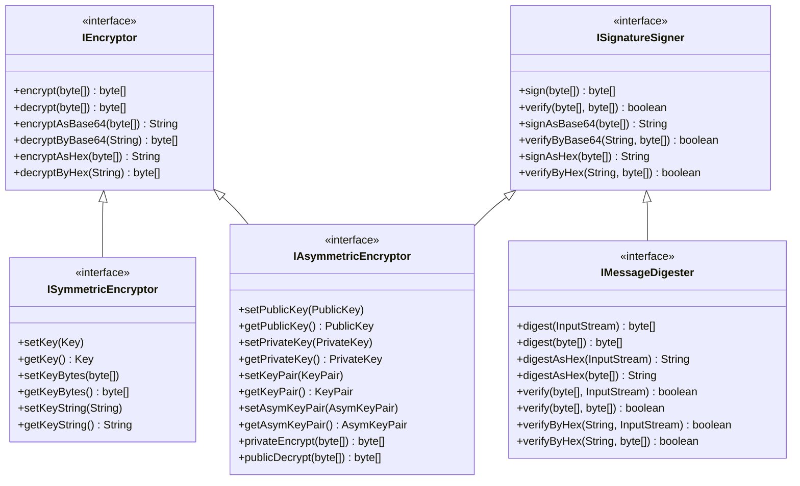
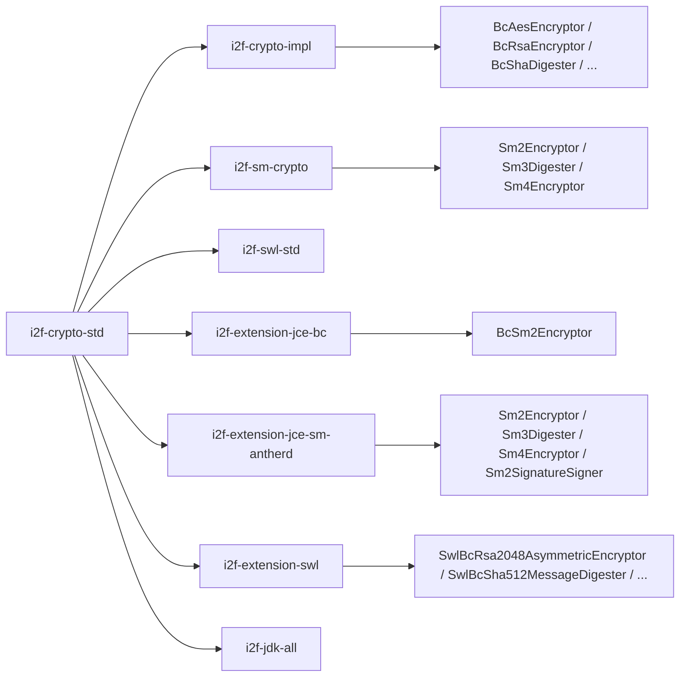

# i2f-crypto-std

> 加密/解密/摘要/签名**标准契约层**（`std` 契约与实现分离），延续 `i2f-codec-std`/`i2f-cache-std`/`i2f-compress-std` 的「接口稳定、实现可换」范式。全模块 **10 个类型**（5 接口 + 5 密钥模型），以根接口 `IEncryptor` 用 `encrypt/decrypt` 双动词刻画「加解密」最小契约，以 `ISignatureSigner` 用 `sign/verify` 刻画「签名验签」最小契约，以 `IMessageDigester extends ISignatureSigner` 用 `digest` 刻画「消息摘要」最小契约（sign 默认委托给 digest）；对称加密 `ISymmetricEncryptor extends IEncryptor` 补充 `setKey/getKey/setKeyBytes/getKeyBytes/setKeyString/getKeyString` 密钥管理契约；非对称加密 `IAsymmetricEncryptor extends IEncryptor, ISignatureSigner` 补充公私钥管理（`setPublicKey/setPrivateKey/setKeyPair/setAsymKeyPair`）并定义 `privateEncrypt`（私钥签名）与 `publicDecrypt`（公钥验签/解密），sign 默认委托给 `privateEncrypt`。所有接口提供 Base64/Hex 编解码默认方法做密文格式化。5 个 `Bytes*Key` 密钥模型（`BytesKey`/`BytesSecretKey`/`BytesPublicKey`/`BytesPrivateKey`）以 `algorithm+format+data` 三段式实现 `Key`/`SecretKey`/`PublicKey`/`PrivateKey` 接口，做「字节数组 ↔ java.security.Key」的轻量适配桥桥梁；`AsymKeyPair` 以 Base64Obfuscator 混淆提供密钥对序列化（`saveAsymKey`/`loadAsymKey`）。下游 `i2f-crypto-impl`（JDK JCE 实现）、`i2f-sm-crypto`（国密实现）、`i2f-swl-std`（SWL 标准层）以及 `i2f-extension-jce-bc`/`i2f-extension-jce-sm-antherd`/`i2f-extension-swl` 等扩展模块面向本模块契约编程。

## 模块路径

- `i2f-jdk/i2f-crypto-std`

## 模块依赖

| 坐标 | scope | optional | 说明 |
|---|---|---|---|
| `i2f.turbo:i2f-array` | compile | false | `ArrayUtil.equal` 用于签名验签与摘要验证的字节数组比较 |
| `i2f.turbo:i2f-codec-impl` | compile | false | `HexStringByteCodec`(Hex 编解码)、`Base64StringByteCodec`(Base64 编解码)、`Base64Obfuscator`(密钥对混淆序列化) |
| `org.projectlombok:lombok` | provided | true | `AsymKeyPair` 使用 `@Data @NoArgsConstructor`（**真实使用**，区别于多数 std 模块的冗余声明） |

## 模块设计

### 3+1 正交接口体系

以 `encrypt/decrypt` 与 `sign/verify` 两组核心动词分裂为加解密与签名两条主线，再以 `IMessageDigester` 在签名线上分化摘要分支，`IAsymmetricEncryptor` 通过双继承（`IEncryptor + ISignatureSigner`）汇聚非对称加密特有的「私钥加密≈签名」语义：



### 密钥模型设计

4 个 `Bytes*Key` 实现 `java.security.Key`/`PublicKey`/`PrivateKey`/`SecretKey` 标准接口，以三个可变字段（`algorithm`/`format`/`data`）把任意字节数组适配为 JDK 密钥体系，是「网络传输/持久化（字节流）→ JCA 运行期（Key 接口）」的双向桥梁：

- `BytesKey implements Key` — 对称密钥（通用）
- `BytesSecretKey implements SecretKey` — 对称秘密密钥
- `BytesPublicKey implements PublicKey` — 非对称公钥
- `BytesPrivateKey implements PrivateKey` — 非对称私钥

`AsymKeyPair` 以 `@Data` POJO 承载公/私钥字符串（Base64 编码），经 `Base64Obfuscator` 混淆提供流式序列化 `saveAsymKey(OutputStream)`/`loadAsymKey(InputStream)`，对接 `IAsymmetricEncryptor.setAsymKeyPair/getAsymKeyPair`。

### Base64/Hex 默认方法模式

全部 5 个接口均内嵌 `*AsBase64`/`*ByBase64`/`*AsHex`/`*ByHex` 默认方法，让实现类仅需关注 `byte[]↔byte[]` 核心逻辑，密文格式化由接口层统一完成。

## 模块目的

1. **加密解密标准化**：为对称/非对称加解密提供 `byte[]↔byte[]` 级连的单一契约，实现类只需关注 JCA/BC 等底层 provider 调用
2. **签名验签统一**：`ISignatureSigner` 统一「数字签名」契约，`verify` 默认基于 sign 重算比较，`IMessageDigester` 将 sign 语义退化为 digest
3. **密钥模型轻量化**：`Bytes*Key` 家族让「字节数组↔JDK Key」零成本转换，避免 `KeyFactory`/`KeySpec` 的模板代码
4. **私钥加密弥合 JDK 不对称**：`IAsymmetricEncryptor.privateEncrypt` 填补 JDK 非对称加密 API 中「私钥加密（≈签名）」的语义空缺
5. **可插拔实现**：如 `i2f-codec-std` 范式，本模块零运行期实现逻辑，JDK JCE / BouncyCastle / 国密各实现仅依赖本模块接口即可互换

## 模块功能

- **`IEncryptor`**：`encrypt(byte[])/decrypt(byte[])` + 默认 `encryptAsBase64/decryptByBase64/encryptAsHex/decryptByHex`
- **`ISymmetricEncryptor extends IEncryptor`**：密钥注入（`Key`/`byte[]`/Hex `String` 三种形态）
- **`IAsymmetricEncryptor extends IEncryptor, ISignatureSigner`**：公私钥注入（`PublicKey`/`PrivateKey`/`KeyPair`/`AsymKeyPair`）+ `privateEncrypt`/`publicDecrypt` + `sign` 默认委托 + Base64/Hex 默认方法
- **`ISignatureSigner`**：`sign(byte[])/verify(byte[],byte[])` + 默认 `signAsBase64/verifyByBase64/signAsHex/verifyByHex`
- **`IMessageDigester extends ISignatureSigner`**：`digest(InputStream)/digest(byte[])` + 默认 `digestAsHex` + `verify(InputStream/byte[])` + `verifyByHex`
- **`BytesKey`**：`algorithm/format/data` 三段式实现 `Key` 接口
- **`BytesSecretKey`**：三段式实现 `SecretKey` 接口
- **`BytesPublicKey`**：三段式实现 `PublicKey` 接口
- **`BytesPrivateKey`**：三段式实现 `PrivateKey` 接口
- **`AsymKeyPair`**：`publicKey/privateKey` 字符串 POJO + `saveAsymKey(OutputStream)`/`loadAsymKey(InputStream)` 流式序列化（Base64Obfuscator 混淆）

## 模块主要使用方法

```java
// 1. 对称加密（以 AES 为例）
ISymmetricEncryptor aes = new AesEncryptor(); // 来自 i2f-crypto-impl 或其他实现
aes.setKeyString("0123456789abcdef0123456789abcdef"); // 32 字符 Hex = 16 bytes AES-128

byte[] cipher = aes.encrypt("Hello".getBytes());
String hexCipher = aes.encryptAsHex("Hello".getBytes());

byte[] plain = aes.decrypt(cipher);
byte[] plain2 = aes.decryptByHex(hexCipher);

// 2. 非对称加密（以 RSA 为例）
IAsymmetricEncryptor rsa = new RsaEncryptor();
rsa.setPublicKeyString("MIIBIjANBgkqhkiG9w0BAQEFAAOCAQ8AMIIBCgKCAQEA...");
rsa.setPrivateKeyString("MIIEvQIBADANBgkqhkiG9w0BAQEFAASCBKcwggSj...");

byte[] cipher2 = rsa.encrypt("Hello".getBytes());      // 公钥加密
byte[] plain3 = rsa.decrypt(cipher2);                   // 私钥解密

byte[] signed = rsa.sign("Hello".getBytes());            // 私钥签名（= privateEncrypt）
boolean ok = rsa.verify(signed, "Hello".getBytes());     // 公钥验签

// 3. 消息摘要
IMessageDigester sha256 = new Sha256Digester();
String hash = sha256.digestAsHex("Hello".getBytes());   // HASH 输出
boolean match = sha256.verifyByHex(hash, "Hello".getBytes());

// 4. 密钥对持久化
AsymKeyPair pair = rsa.getAsymKeyPair();
try (FileOutputStream fos = new FileOutputStream("keypair.dat")) {
    AsymKeyPair.saveAsymKey(pair, fos); // Base64Obfuscator 混淆写入
}
```

## 模块特性总结

- **契约与实现完全分离**：零运行期加解密逻辑，全部实现由 `i2f-crypto-impl`/`i2f-sm-crypto`/各扩展模块提供
- **Base64/Hex 统一编解码**：全部接口内建默认方法，实现类无需关心密文格式化
- **完整的密钥模型链条**：`bytes[] ↔ Bytes*Key ↔ Key/PublicKey/PrivateKey/SecretKey` 零代码转换
- **私钥加密语义显式化**：`IAsymmetricEncryptor.privateEncrypt/publicDecrypt` 填补 JDK 不对称空缺
- **密钥对混淆持久化**：`AsymKeyPair.saveAsymKey/loadAsymKey` 经 `Base64Obfuscator` 对密钥字符串做编码混淆再落盘
- **4 Bytes*Key 结构一致**：`algorithm/format/data` 三段式对称公钥私钥全覆盖，equals/hashCode 基于三字段

## 模块瑕疵或错误

1. **`setPublicKeyString`/`getPublicKeyString` 用 Base64，`setKeyString`/`getKeyString` 用 Hex，编码风格不一致**：对称密钥走 Hex、非对称密钥走 Base64，钥匙字符串格式无统一标准，增加使用者记忆负担
2. **`IAsymmetricEncryptor.sign` 默认委托 `privateEncrypt`，语义上仅适用「私钥加密=签名」的 RSA 模式**：对于 DSA/ECDSA 等签名算法，`privateEncrypt` 默认抛 `UnsupportedOperationException`，实现类需额外覆写 `sign` 方法，接口层面存在误导
3. **`IMessageDigester extends ISignatureSigner` 继承关系签名义弱化**：摘要的 `sign` 退化等于 `digest`，`verify` 退化等于重算比较，签名概念在此被弱化，调用方容易混淆「签名」与「哈希」的语义差异
4. **`Bytes*Key` 三字段 `public` 可写**：`algorithm/format/data` 为 `protected` 字段但有 `public setter`，违反密钥不可变性原则
5. **`AsymKeyPair.saveAsymKey` 始终以 UTF-8 写双行文本**：未考虑写操作原子性（部分写入导致文件损坏）、未处理 `BufferedWriter` 未 flush 向 `OutputStream` 传播异常
6. **`ISignatureSigner.verify` 默认基于 sign 重算比较**：对长数据存在性能浪费，实现类如 `IMessageDigester` 已覆写为一次性摘要比较，但通用 `IAsymmetricEncryptor` 无优化

## 下游与关联



- **下层实现**：`i2f-crypto-impl`（JDK JCE 封装）、`i2f-sm-crypto`（国密 SM2/SM3/SM4 实现）、`i2f-swl-std`（SWL 安全传输标准层，以本模块为地基）
- **外部消费者**（经 `import i2f.crypto.std` grep 确认，25+ 文件）：
  - `i2f-extension-jce-bc`：`BcSm2Encryptor` 实现 `IAsymmetricEncryptor`
  - `i2f-extension-jce-sm-antherd`：`Sm3Digester`（IMessageDigester）、`Sm2Encryptor`（IAsymmetricEncryptor）、`Sm4Encryptor`（ISymmetricEncryptor）、`Sm2SignatureSigner`（ISignatureSigner）
  - `i2f-extension-swl`：6 个实现类（AES-256/RSA-2048/SHA-512/SM2/SM3/SM4 的 BouncyCastle 版 + SM 版）+ 4 个测试文件，广泛覆盖全部 5 个接口
- **聚合引入**：`i2f-jdk-all` 将本模块纳入 `i2f-jdk` 全家桶