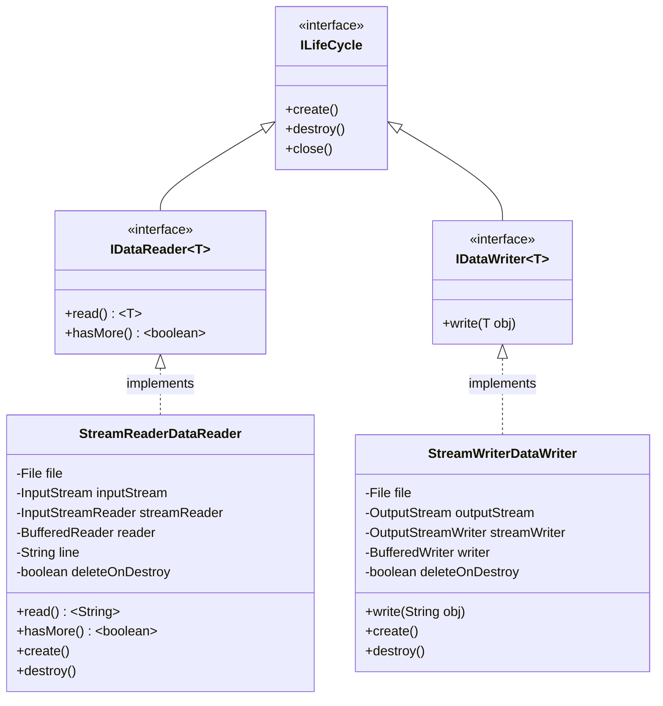
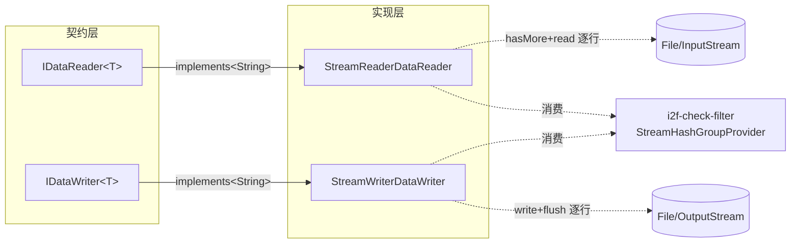

# i2f-data-processor

> 数据读/写抽象处理器 —— 以 **ILifeCycle 生命周期** 约束的数据流读写最小契约，沉淀 `IDataReader<T>` / `IDataWriter<T>` 双接口 + 2 个文本行式 JDK IO 流实现，是 `i2f-check-filter` 大数据去重族的数据入/出依赖。

---

## 模块定位

- **功能**：将「逐条读数据」与「逐条写数据」抽象为受 `ILifeCycle` 生命周期管理的两个原子接口，并提供基于 JDK `Reader`/`Writer` 的 `String` 型默认实现
- **所属层级**：`i2f-jdk` 基础工具层
- **设计原则**：
  - **最小契约**：只定义 `read()/hasMore()` 与 `write(T)` 两个核心动词，无任何批量/遍历/过滤扩展
  - **生命周期绑定**：实现 `ILifeCycle`，让 IO 资源的 `create/destroy` 与应用启动/关闭同步（`close()` 委拖 `destroy()`）
  - **面向接口消费**：下游用 `IDataReader<T>` / `IDataWriter<T>` 参数化编程，与数据源/目的解耦（唯一真实消费方 `i2f-check-filter` 的 `IRepeatFilter` 就是如此）

---

## 依赖关系

| 依赖 | 类型 | 用途 | 是否真实使用 |
|------|------|------|-------------|
| `i2f-lifecycle` | 内部 | 接口 `ILifeCycle` + 异常 `LifeCycleException` | 是（两接口 extends + 两实现 import） |
| `lombok` | 编译 | 代码生成 | **否**（4 源文件均无任何 `import lombok.*`） |

---

## 架构

### 类结构

| 类型 | 文件 | 说明 |
|------|------|------|
| **接口** `IDataReader<T>` | `i2f/data/processor/IDataReader.java` (17 行) | 读端点：`read()` 返回当前条目 + `hasMore()` 判是否有下一项 |
| **接口** `IDataWriter<T>` | `i2f/data/processor/IDataWriter.java` (14 行) | 写端点：`write(T)` 写入一条数据 |
| **实现** `StreamReaderDataReader` | `i2f/data/processor/impl/StreamReaderDataReader.java` (91 行) | `IDataReader<String>` 文本行读实现 |
| **实现** `StreamWriterDataWriter` | `i2f/data/processor/impl/StreamWriterDataWriter.java` (84 行) | `IDataWriter<String>` 文本行写实现 |

### 架构图



### 流程图



---

## 核心接口与实现

### `IDataReader<T>` — 数据读取器

```java
public interface IDataReader<T> extends ILifeCycle {
    T read() throws IOException;
    boolean hasMore() throws IOException;
}
```

- `create()`：初始化资源（`ILifeCycle` 继承，调用点负责触发）
- `hasMore()`：判是否有下一项，**调用时隐式前进**——读取下一行存入内部缓存
- `read()`：返回当前缓存项（调用 `hasMore()` 后才能获得有效值）
- `destroy()`：释放资源

### `IDataWriter<T>` — 数据写入器

```java
public interface IDataWriter<T> extends ILifeCycle {
    void write(T obj) throws IOException;
}
```

- `write(T)`：写入一条数据
- `create()`/`destroy()`：与 Reader 对称

### `StreamReaderDataReader` — 文本行读实现

- **4 种构造方式**：`File` / `InputStream` / `InputStreamReader` / `BufferedReader`
- **惰性初始化**：`create()` 时走四级降级链 `reader→streamReader→inputStream→FileInputStream`，仅构造最低层级
- **逐行读取**：`hasMore()` 内部调用 `BufferedReader.readLine()`，结果缓存于 `line` 字段；`read()` 直接返回 `line`
- **`deleteOnDestroy`**：若构造时传入 `File`，`destroy()` 时按此标志决定是否删除源文件，适用于临时文件清理
- **使用模式**：
  ```java
  IDataReader<String> reader = new StreamReaderDataReader(file);
  reader.create();
  while (reader.hasMore()) {
      String line = reader.read();
      // process line
  }
  reader.destroy(); // 或 try-with-resources：reader.close()
  ```

### `StreamWriterDataWriter` — 文本行写实现

- **4 种构造方式**：`File` / `OutputStream` / `OutputStreamWriter` / `BufferedWriter`
- **惰性初始化**：与 Reader 对称的四级降级链
- **行式写入**：`write(String)` 内部调用 `writer.write(obj) + writer.newLine() + writer.flush()`，每次写入均立即刷盘
- **`deleteOnDestroy`**：构造时传入 `File` 时有效，销毁时可自动删除文件

---

## 下游消费者

### 直接 import 消费者

| 模块 | 使用方式 |
|------|----------|
| `i2f-check-filter` | 5 文件 import `IDataReader`/`IDataWriter`，1 文件（`StreamHashGroupProvider`）额外 import `StreamReaderDataReader`/`StreamWriterDataWriter` |

### 调用链路

`IRepeatFilter<T>.filter(writer, readers)` 以 `IDataWriter<T>` 写出去重结果、`IDataReader<T>` 读入多个数据源，接口定义中即使用了 `i2f-data-processor` 的顶层接口。实现在 `StreamHashGroupProvider` 中直接用两个 impl 完成哈希分组数据的临时文件读写：

```java
// StreamHashGroupProvider.java
public IDataWriter<String> getWriter(String hash) {
    return new StreamWriterDataWriter(new File(basePath, hash + ".data"))
                   .setDeleteOnDestroy(false);
}
public IDataReader<String> getReader(String hash) {
    return new StreamReaderDataReader(new File(basePath, hash + ".data"))
                   .setDeleteOnDestroy(deleteOnDestroy);
}
```

### POM 依赖声明

| 声明方 | 坐标 |
|--------|------|
| `i2f-check-filter` | `i2f-data-processor`（直接依赖） |
| `i2f-jdk-all` | 聚合纳入 |
| 根 `pom.xml` | 版本统一托管 |

---

## 已知缺陷与设计约束

1. **`StreamReaderDataReader.read()` 调用时机脆弱**
   - `hasMore()` 承担「前进 + 判终」双重职责，`read()` 仅返回上次缓存的值
   - 若连续调用两次 `read()` 而未中间调用 `hasMore()`，第二次获得的是同一行内容
   - 与 Java `Iterator.hasNext()/next()` 语义不同，使用者需熟悉此模式

2. **`StreamWriterDataWriter.write()` 每次刷盘**
   - 每次 `write()` 均执行 `flush()`，批量写入大量小行时性能较差
   - 高频场景应考虑包装一层缓冲或改用批处理

3. **类型参数锁定为 `String`**
   - 两实现均 `implements IDataReader<String>` / `IDataWriter<String>`，强绑定文本行模式
   - 二进制数据或其他类型读写需要自建实现

4. **无字符集控制**
   - `InputStreamReader`/`OutputStreamWriter` 使用平台默认字符集，跨平台部署时行为不一致

5. **`deleteOnDestroy` 仅对 `File` 构造器有效**
   - 若通过 `InputStream`/`OutputStream`/`Reader`/`Writer` 构造，`file` 字段为 `null`，`deleteOnDestroy` 静默无效果

6. **`create()`/`destroy()` 抛非受检异常**
   - IO 异常被包装为 `LifeCycleException`（`RuntimeException`），调用者可能漏掉处理

7. **`close()` 委托 `destroy()` 但不清理 `deleteOnDestroy` 标志**（与 `try-with-resources` 配合时行为一致，无额外问题，但方法名 `destroy` 与 `close` 语义重复）