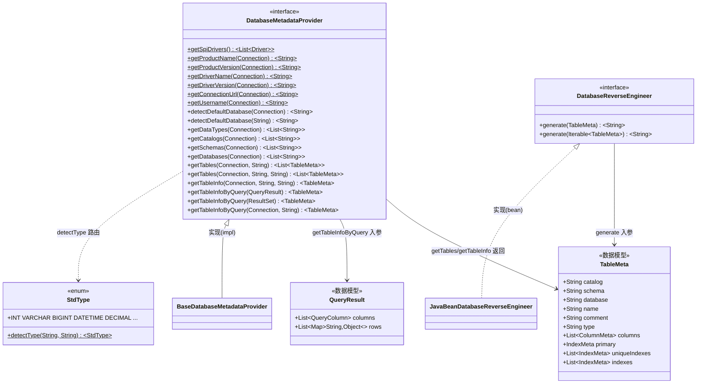
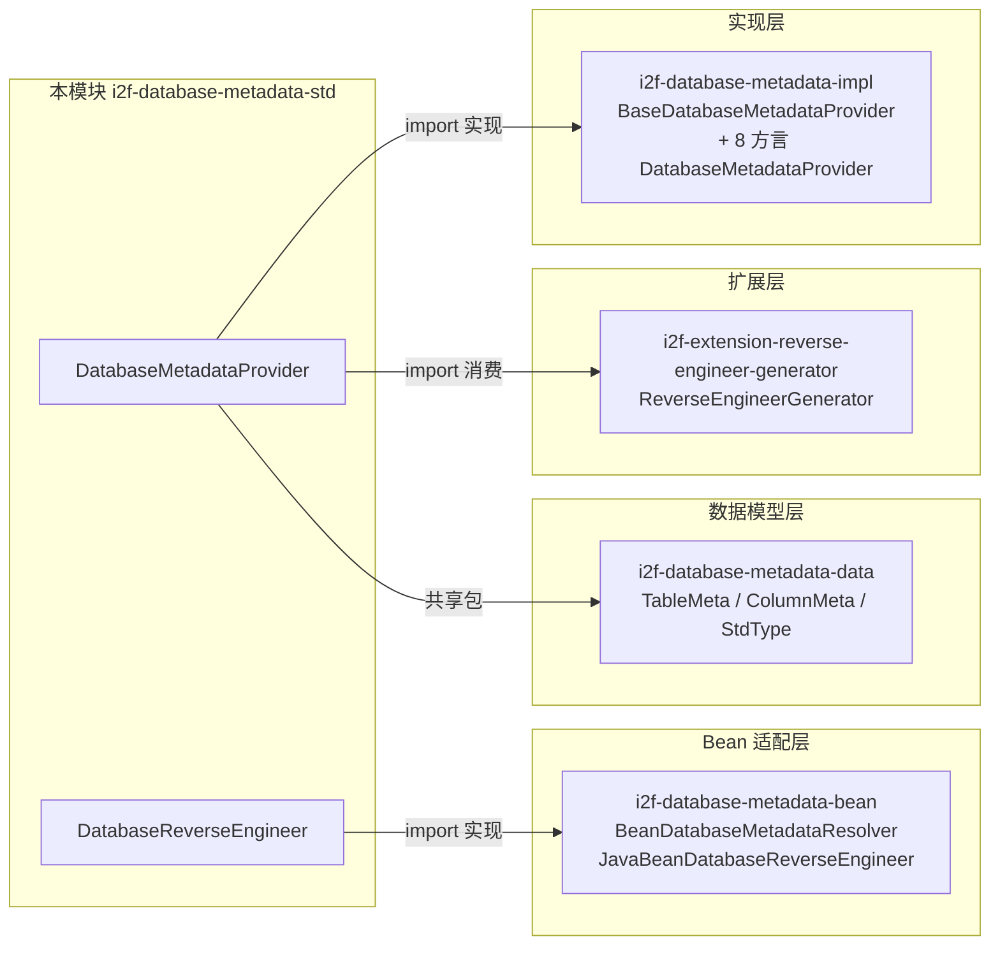

# i2f-database-metadata-std

> 数据库元数据**标准契约层**（`std` 契约与实现分离）—— 定义「从 JDBC `Connection` 读取表/列/索引等元数据」与「反向工程生成 DDL」的两个核心接口，是 `i2f-database-metadata-impl`（多方言实现）、`i2f-database-metadata-bean`（Bean 元数据适配）、`i2f-extension-reverse-engineer-generator`（代码生成器）的公共上游契约。

---

## 模块定位

- **功能**：沉淀 `DatabaseMetadataProvider`（元数据读取器）与 `DatabaseReverseEngineer`（DDL 反向生成器）两个接口，前者提供从 JDBC 连接探测库/模式/表/列/索引等全链路元数据读取的抽象，后者提供从 `TableMeta` 数据模型生成 DDL 语句的抽象
- **所属层级**：`i2f-jdk` 持久化基础层
- **设计原则**：
  - **契约与实现分离**：本模块仅定义接口和默认方法，所有方言特有的查询逻辑都在 `i2f-database-metadata-impl` 中
  - **内建 JDBC 元数据工具**：`DatabaseMetadataProvider` 提供 7 个 `static` 便捷方法直接读取 `DatabaseMetaData` 常见属性（产品名/版本/驱动/URL/用户名），无需实现类介入
  - **`default` 感知模式**：`detectDefaultDatabase` 和 `getTables(conn, database)` 等提供合理的默认行为，子类可按需覆写

- **包范围说明**：本模块与 `i2f-database-metadata-data` 共享同一个包 `i2f.database.metadata.std`，前者贡献 `DatabaseMetadataProvider` + `DatabaseReverseEngineer` 两个接口，后者贡献 `StdType` 枚举 + `IColumnType` 接口（参见 [i2f-database-metadata-data 模块文档](../i2f-database-metadata-data/readme.md)）

---

## 依赖关系

| 依赖 | 类型 | 用途 | 是否真实使用 |
|------|------|------|-------------|
| `i2f-database-metadata-data` | 内部 | 数据模型 `TableMeta` | 是（两文件均 import） |
| `i2f-jdbc-data` | 内部 | 查询结果 `QueryResult` | 是（`getTableInfoByQuery` 消费） |
| `lombok` | 编译 | 代码生成 | **否**（2 源文件均无任何 `import lombok.*`） |

---

## 架构

### 类结构

| 类型 | 文件 | 说明 |
|------|------|------|
| **接口** `DatabaseMetadataProvider` | `i2f/database/metadata/std/DatabaseMetadataProvider.java` (83 行) | JDBC 元数据读取器——7 个 static 工具 + 2 个 default 感知 + 8 个抽象查询方法 |
| **接口** `DatabaseReverseEngineer` | `i2f/database/metadata/std/DatabaseReverseEngineer.java` (28 行) | DDL 反向生成器——单表 + 多表批生成 |

### 架构图



### 下游消费者关系



---

## 核心接口

### `DatabaseMetadataProvider` — 数据库元数据读取器

```java
public interface DatabaseMetadataProvider {
    // === 静态工具方法（7 个） ===
    static List<Driver> getSpiDrivers() {
        ServiceLoader<Driver> loader = ServiceLoader.load(Driver.class);
        // ... 收集所有 SPI 注册的 JDBC Driver
    }
    static String getProductName(Connection conn)       // conn.getMetaData().getDatabaseProductName()
    static String getProductVersion(Connection conn)    // conn.getMetaData().getDatabaseProductVersion()
    static String getDriverName(Connection conn)        // conn.getMetaData().getDriverName()
    static String getDriverVersion(Connection conn)     // conn.getMetaData().getDriverVersion()
    static String getConnectionUrl(Connection conn)     // conn.getMetaData().getURL()
    static String getUsername(Connection conn)          // conn.getMetaData().getUserName()

    // === 默认方法（2 个） ===
    default String detectDefaultDatabase(Connection conn)  // 从 URL 探测默认库名
    default String detectDefaultDatabase(String jdbcUrl)   // 从 URL 字符串探测，默认返回 null

    // === 抽象查询方法（8 个） ===
    List<String> getDataTypes(Connection conn)
    List<String> getCatalogs(Connection conn)
    List<String> getSchemas(Connection conn)
    List<String> getDatabases(Connection conn)
    List<TableMeta> getTables(Connection conn, String database)
    List<TableMeta> getTables(Connection conn, String database, String tablePattern)
    TableMeta getTableInfo(Connection conn, String database, String table)
    TableMeta getTableInfoByQuery(QueryResult result)
    TableMeta getTableInfoByQuery(ResultSet rs)
    TableMeta getTableInfoByQuery(Connection conn, String table)
}
```

**接口方法分类**：

| 类别 | 方法 | 说明 |
|------|------|------|
| **连接信息** | `getProductName/Version`、`getDriverName/Version`、`getConnectionUrl`、`getUsername` | 静态工具，直接委托 `DatabaseMetaData` |
| **SPI 驱动** | `getSpiDrivers` | 遍历 `ServiceLoader<Driver>`，用于动态加载 JDBC 驱动 |
| **库/模式枚举** | `getCatalogs`、`getSchemas`、`getDatabases` | 三类数据库命名空间层级的枚举 |
| **表元数据** | `getDataTypes`、`getTables`、`getTableInfo` | 表级及列级元数据的完整读取 |
| **查询反射** | `getTableInfoByQuery(QueryResult/ResultSet/conn+String)` | 从查询结果反向推导列元数据 |
| **默认库探测** | `detectDefaultDatabase` | URL 字符串解析默认库名，缺省返回 null |

### `DatabaseReverseEngineer` — DDL 反向生成器

```java
public interface DatabaseReverseEngineer {
    String generate(TableMeta meta);                          // 单表生成 DDL

    default String generate(Iterable<TableMeta> list) {       // 多表批量生成，";" 分隔
        StringBuilder builder = new StringBuilder();
        boolean isFirst = true;
        for (TableMeta item : list) {
            if (item == null) continue;
            if (!isFirst) builder.append("\n");
            String sql = generate(item);
            builder.append(sql).append("\n;");
            isFirst = false;
        }
        return builder.toString();
    }
}
```

---

## 典型使用流程

```java
// 1. 获取连接
Connection conn = DriverManager.getConnection(url, user, pass);

// 2. 获取元数据提供器（SPI 或直接实例化）
DatabaseMetadataProvider provider = new MysqlDatabaseMetadataProvider();

// 3. 枚举数据库
List<String> databases = provider.getDatabases(conn);

// 4. 枚举指定库的表（含列/索引/主键等完整信息）
List<TableMeta> tables = provider.getTables(conn, "my_database");

// 5. 反向工程生成 DDL
DatabaseReverseEngineer engineer = new JavaBeanDatabaseReverseEngineer();
String ddl = engineer.generate(tables);
```

---

## 下游消费者

### 模块 import 依赖（`import i2f.database.metadata.std.*`）

| 模块 | 使用类型 | 说明 |
|------|----------|------|
| `i2f-database-metadata-impl` | `DatabaseMetadataProvider` + `StdType` + `IColumnType` | 约 15 个文件，8 种方言实现全部依赖本接口 |
| `i2f-database-metadata-bean` | `DatabaseReverseEngineer` + `StdType` | Bean 元数据解析和 JavaBean DDL 生成 |
| `i2f-database-metadata-data` | `StdType` | `ColumnMeta.fillRawTypes()` 调用 `StdType.detectType` |
| `i2f-extension-reverse-engineer-generator` | `DatabaseMetadataProvider` | 反向工程代码生成器消费 |

### POM 依赖声明

| 声明方 | 坐标 |
|--------|------|
| `i2f-database-metadata-bean` | `i2f-database-metadata-std` |
| `i2f-database-metadata-impl` | `i2f-database-metadata-std` |
| `i2f-jdk-all` | 聚合纳入 |
| 根 `pom.xml` | 版本统一托管 |

---

## 已知缺陷与设计约束

1. **`detectDefaultDatabase(String)` 默认返回 null**
   - 仅在接口中给出了签名，默认实现返回 `null`，各方言子类必须各自覆盖才能生效，容易遗漏

2. **`getDatabases` 语义歧义**
   - 不同数据库对「数据库」概念定义不同——MySQL 的 `SHOW DATABASES`、Oracle 的 `PDB`、SQL Server 的 多 catalog
   - 实现层面需各自处理，统一接口难以保证行为一致

3. **`getTableInfoByQuery(ResultSet)` 与 `getTableInfoByQuery(QueryResult)` 重复**
   - 两者本质相同，前者是裸 JDBC ResultSet，后者是封装后的 QueryResult
   - 实际 impl 层可能通过包装裸 ResultSet→QueryResult→调用 `getTableInfoByQuery(QueryResult)` 来避免代码重复

4. **无批量查询方法**
   - `getTables` 接受 `tablePattern` 但返回 `List<TableMeta>`，每次读取一张表的全量列/索引信息，大批量表时可能产生 N+1 查询问题（取决于 impl 实现策略）

5. **异常统一抛 `SQLException`**
   - 全部抽象方法签名 `throws SQLException`，调用方必须处理受检异常，无法在流式/函数式场景中直接使用

6. **`DatabaseReverseEngineer.generate(Iterable)` 跳过 null 但不记录**
   - 遍历时静默跳过 `null` 元素，调用方无法感知中间缺失