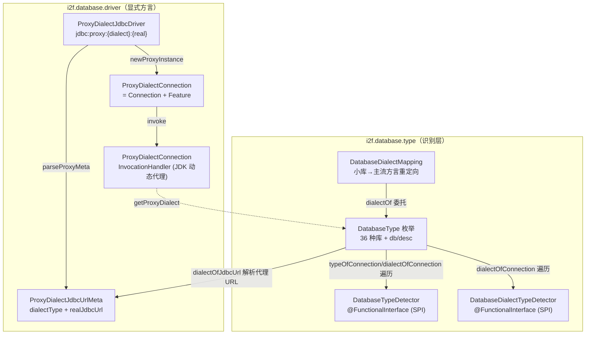
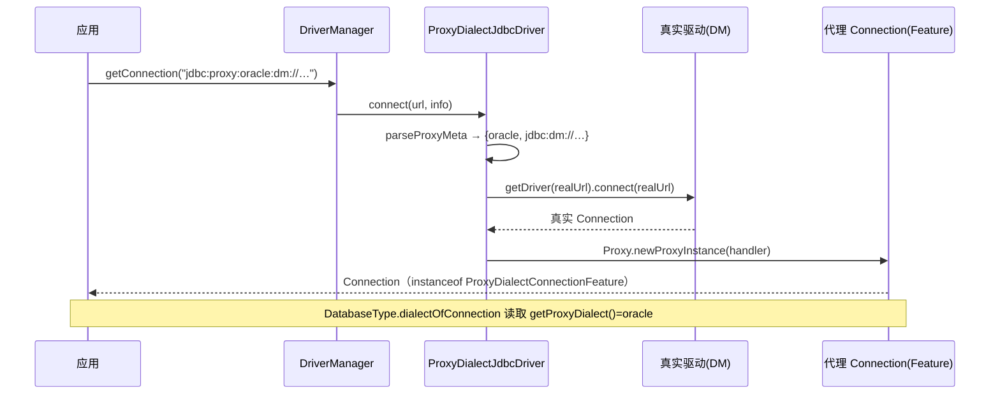

# i2f-database-type

> 数据库类型与方言**识别层**（整个持久化族的类型地基）。以单一枚举 `DatabaseType` 收录 36 种数据库，提供「JDBC URL 关键串嗅探 + 连接元数据探测 + SPI 扩展」三条识别路径，把「用什么方言」这一决策从各持久层（分页 `i2f-bindsql-page`、文本化 `i2f-bindsql-stringify`、方言字面量 `i2f-database-dialect`、MyBatis 插件等）中收敛到唯一入口；并用 `DatabaseDialectMapping` 做「小库→主流方言」的重定向归并。配套一个**自注册的代理 JDBC 驱动** `ProxyDialectJdbcDriver`（URL 形如 `jdbc:proxy:oracle:dm://…`），用于真实驱动不自报方言的库（如达梦 Oracle 兼容模式）显式声明方言。本模块运行期**零第三方依赖**，仅构建于 `java.sql`、JDK 动态代理、`ServiceLoader`、正则之上。

## 模块路径

- `i2f-jdk/i2f-database-type`

## 模块依赖

| GroupId | ArtifactId | Scope | Optional | 说明 |
|---------|-----------|-------|----------|------|
| — | — | — | — | **无 i2f 内部依赖**（不引用任何兄弟模块，是持久化族的类型地基） |
| org.projectlombok | lombok | provided | true | 编译期注解处理；仅用于 `@Data`（`DatabaseDialectMapping`、`ProxyDialectConnectionInvocationHandler`、`ProxyDialectJdbcUrlMeta`）、`@AllArgsConstructor`、`@NoArgsConstructor`；版本 `1.18.44` 由父 POM `dependencyManagement` 托管 |

> 本模块是**零依赖叶子模块**（Lombok 为 `provided`+`optional`，不进入运行期 classpath）。运行期能力全部来自 JDK：`java.sql.Driver`/`Connection`/`DriverManager`、`java.lang.reflect.Proxy`、`java.util.ServiceLoader`、`java.util.regex.Pattern`、`WeakHashMap`/`CopyOnWriteArraySet` 等。`maven-assembly-plugin` 仅用于产物打包。

## 模块设计

模块分为两个包：`i2f.database.type`（识别与归并的**契约与内核**）与 `i2f.database.driver`（**显式声明方言**的代理驱动）。



### 1. `DatabaseType`：枚举即注册表

36 个常量各携带两个字段：`db`（URL 关键串/别名，如 `mysql`/`oracle12c`/`zenith`）与 `desc`（中文描述）。末尾两个特殊值 `OTHER`（无法识别）与 `ERROR`（URL 为空/读取错误）用作判定哨兵。核心识别入口：

| 方法 | 作用 | 关键行为 |
|------|------|----------|
| `typeOfName(String)` | 按枚举 `name()` 或 `db` 忽略大小写匹配 | 命中返回对应类型，否则 `OTHER` |
| `isValid(DatabaseType)` | 有效性判定 | `null`/`ERROR`/`OTHER` → `false` |
| `typeOfJdbcUrl(String)` | URL → 类型（走 SPI） | 委托两参重载，`spi=true` |
| `typeOfJdbcUrl(String,boolean)` | 核心嗅探 | 空 URL→`ERROR`；SPI 探测器优先；代理 URL 拆真实 URL 递归；否则一大串 `contains`/`regexFind` 关键串分发；兜底 `OTHER` |
| `typeOfConnection(Connection)` | 连接 → 类型 | `WeakHashMap` 缓存 + 双重检查；遍历 `DETECTORS`；兜底 `typeOfJdbcUrl(url,false)` |
| `dialectOfJdbcUrl(String)` | URL → 方言 | 先解析 `jdbc:proxy:` 取显式方言；无代理则退化为 `typeOfJdbcUrl` |
| `dialectOfConnection(Connection)` | 连接 → 方言 | 遍历 `DIALECT_DETECTORS`；再试 `ProxyDialectConnectionFeature.getProxyDialect()`；再退化 URL |
| `regexFind(String,CharSequence)` | 工具正则 `find()` | 每次 `Pattern.compile`（无缓存） |

URL 嗅探对易变体使用正则：`:sqlserver\d*:`、`:dm\d*:`、`:kingbase\d*:`、`:hive\d*:`（如 `:dm8:`、`:hive2:`）；其余用 `contains`。

### 2. 方言解析与归并：`DatabaseDialectMapping`

`DatabaseType` 负责「这台库**是**什么」，`DatabaseDialectMapping` 负责「这台库**该按哪种方言**处理」。它持有两张表：

- `redirectDialectMap`（`DatabaseType → DatabaseType`）：把小众库归并到方言兼容的主流库（如 `MARIADB → MYSQL`）。
- `jdbcUrlDialectMap`（`String → DatabaseType`）：针对具体 URL 的强制方言覆盖。

三个 `dialectOf(...)` 重载（`conn`/`url`/`type`）先经 `DatabaseType` 识别原始类型，再过 `redirectDialectMap` 重定向，命中即替换、否则原样返回。`redirect(...)` 为流式登记 API，空 `init()` 为子类扩展模板方法。下游（`PageWrappers`、`CountWrappers`、`BindSqlStringifiers`、`DatabaseObject2SqlStringifiers`）各自持有该映射常量作为方言入口。

### 3. SPI 扩展点：两个探测器接口

`DatabaseTypeDetector` 与 `DatabaseDialectTypeDetector` 均为 `@FunctionalInterface`，`default detect(Connection)` 读取连接元数据 URL 后委托抽象的 `detect(String jdbcUrl)`。二者通过枚举静态块中的 `ServiceLoader` 装载进 `DETECTORS`/`DIALECT_DETECTORS`（公开 `CopyOnWriteArraySet`，亦可运行期 `add` 编程式注册）。本模块**未自带**这两个接口的 `META-INF/services` 描述文件——识别逻辑的增量由下游按需注册。

### 4. `ProxyDialectJdbcDriver`：用 URL 前缀显式声明方言

针对「真实驱动 URL 无法自报方言、或需要覆盖方言」的场景（类注释举例：达梦 Oracle 兼容模式），提供一个包装真实驱动的 `java.sql.Driver`：

```
jdbc:proxy:{方言类型}:{真实驱动 URL 去掉 jdbc: 的部分}
例：jdbc:proxy:oracle:dm://localhost:5230/   → 方言按 oracle，实际连 dm
```

- `static` 块向 `DriverManager` 自注册；并配套 `META-INF/services/java.sql.Driver`（JDBC 4.0 `ServiceLoader` 自动装载），使 `DriverManager.getDriver(...)` 能路由到它。
- `connect()`：`acceptsURL` 否则返回 `null`（符合 DriverManager 轮询规范）；解析出真实 URL 后用 `DriverManager.getDriver(realUrl)` 拿真实驱动建连接，再用 **JDK 动态代理**包装成 `ProxyDialectConnection`。
- `ProxyDialectConnection extends Connection, ProxyDialectConnectionFeature`：被代理对象实现的组合接口。
- `ProxyDialectConnectionInvocationHandler`：拦截 `getProxyRealConnection`/`getProxyDialect`/`getProxyRealUrl`/`getProxyRealDriver` 四个特征方法返回持有信息，其余方法反射透传给真实连接。
- `DatabaseType.dialectOfConnection` 正是通过 `instanceof ProxyDialectConnectionFeature` 读取 `getProxyDialect()`，从而让代理连接自报方言。



## 模块目的

- **收敛方言决策**：把散落在分页、文本化、字面量渲染、MyBatis 插件中的「这台库该按什么方言」统一到一个零依赖、可 SPI 扩展、可缓存的识别层。
- **框架/驱动无关**：只依赖 `java.sql` 标准接口，任何连接池、ORM、JDBC 封装都可复用。
- **覆盖真实世界的方言盲区**：小库方言缺失 → `DatabaseDialectMapping` 重定向归并；真实驱动不自报方言 → `ProxyDialectJdbcDriver` 用 URL 前缀显式声明。

## 模块功能

| 能力 | 载体 | 说明 |
|------|------|------|
| 数据库类型枚举注册表 | `DatabaseType` | 36 常量 + `db`/`desc`，含 `OTHER`/`ERROR` 哨兵 |
| URL 关键串嗅探 | `typeOfJdbcUrl` | `contains` + 正则（sqlserver/dm/kingbase/hive 变体） |
| 连接元数据探测 | `typeOfConnection`/`dialectOfConnection` | `WeakHashMap` 缓存、双重检查、SPI 优先 |
| 方言重定向归并 | `DatabaseDialectMapping` | 小库→主流方言、按 URL 强制覆盖 |
| SPI 扩展 | 两个 `*Detector` 接口 | `ServiceLoader` 装载 + `CopyOnWriteArraySet` 运行期注册 |
| 显式方言声明 | `ProxyDialectJdbcDriver` + 代理连接 | `jdbc:proxy:{dialect}:{real}`，自注册 + 动态代理透传 |

## 模块主要使用方法

```java
// 1) 由 JDBC URL 识别数据库类型
DatabaseType type = DatabaseType.typeOfJdbcUrl("jdbc:mysql://localhost:3306/db");
// → MYSQL

// 2) 由连接识别「实际类型」与「应使用的方言」
DatabaseType real    = DatabaseType.typeOfConnection(conn);
DatabaseType dialect = DatabaseType.dialectOfConnection(conn);

// 3) 小库归并到主流方言（自建映射，供分页/文本化消费）
DatabaseDialectMapping mapping = new DatabaseDialectMapping()
        .redirect(DatabaseType.MARIADB, DatabaseType.MYSQL)
        .redirect(DatabaseType.CLICK_HOUSE, DatabaseType.MYSQL);
DatabaseType use = mapping.dialectOf(conn);   // 识别 + 重定向

// 4) 显式声明方言：达梦以 Oracle 兼容模式运行
//    连接串写：jdbc:proxy:oracle:dm://localhost:5230/
//    真实方言将从代理连接的 getProxyDialect() 读出 = oracle
Connection c = DriverManager.getConnection("jdbc:proxy:oracle:dm://localhost:5230/", "u", "p");
DatabaseType dialectType = DatabaseType.dialectOfConnection(c); // → ORACLE
```

**注意事项**（源码核实，如实记录）：

- **`dialectOfConnection` 写错缓存（缺陷）**：该方法起始读 `DIALECT_MAP`，但结尾 `TYPE_MAP.put(conn, type)`——写进了「实际类型」缓存而非方言缓存。后果是 `DIALECT_MAP` 永不命中（每次重算），且会把**方言结果污染到 `typeOfConnection` 的缓存**，后续按 `typeOfConnection` 取到的可能是被重定向后的方言而非真实类型。
- **`dialectOfJdbcUrl(String,boolean)` 判定反转（缺陷）**：解析到代理 URL 时，`if (!isValid(type)) return type;` 之后才 `throw`——即**方言合法反而抛 `IllegalArgumentException`，非法才返回**。经此路径（`DatabaseDialectMapping.dialectOf(String url)` / `DatabaseType.dialectOfJdbcUrl(String)`）处理规范的 `jdbc:proxy:{有效方言}:…` URL 会抛异常；而经 `dialectOfConnection` 因提前命中 `ProxyDialectConnectionFeature` 分支可绕过。使用前应优先走**连接**路径获取方言。
- **大小写不一致**：URL 嗅探中 `:zenith:`(GAUSS)、`:gbase:`、`:clickhouse:`、`:oscar:`、`:sybase:`、`:oceanbase:` 等分支用的是**原始大小写** `jdbcUrl.contains`，其余多用小写 `url.contains`，故这些库的 URL 若含大写将落到 `OTHER`。
- **`regexFind` 每次重新编译** `Pattern`，无缓存；高频 URL 识别场景建议上层自行缓存类型结果。
- 本模块**未自带** `*Detector` 的 `META-INF/services`，`DETECTORS`/`DIALECT_DETECTORS` 默认为空，纯靠内置 URL 关键串分发；需要定制识别请注册 SPI 或运行期 `add`。

## 模块特性总结

- **持久化族类型地基**：被 `i2f-bindsql-page`、`i2f-bindsql-stringify`、`i2f-database-dialect`、`i2f-database`、`i2f-database-metadata-bean/-impl`、`i2f-jdbc-proxy-xml`、`i2f-extension-mybatis`、`i2f-extension-xproc4j` 及聚合模块 `i2f-jdk-all` 依赖（`grep` 核实）。
- **零三方依赖、纯 JDK**：`java.sql` + 动态代理 + `ServiceLoader` + 正则，可被任意连接池/ORM 复用。
- **三识别路径 + 一层归并 + 一个显式声明**：URL 嗅探、连接探测、SPI 扩展；`DatabaseDialectMapping` 小库归并；`ProxyDialectJdbcDriver` 用 URL 前缀为「方言盲区」库显式声明。
- **自注册 + 自描述**：驱动经 `static` 块与 `META-INF/services/java.sql.Driver` 双通道注册；代理连接实现 `ProxyDialectConnectionFeature` 可被 `DatabaseType` 反查方言，形成闭环。
- **已知两处实现瑕疵**（方言缓存写错 map、代理 URL 方言判定反转），详见上文注意事项，选型/扩展时须规避。
