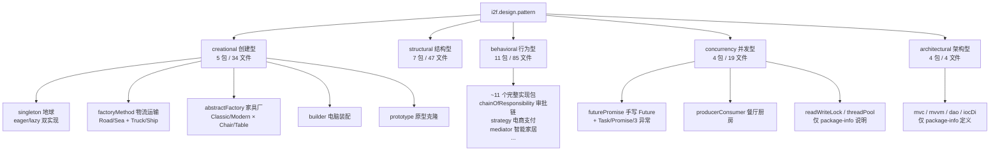
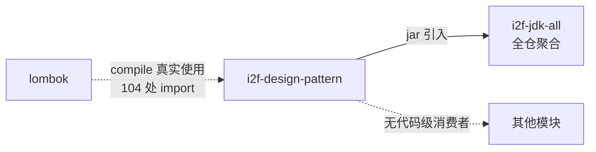

# i2f-design-pattern

> 设计模式**教学演示模块** —— 以 189 个源文件系统化落地 5 大类 **31 种设计模式**（GoF 创建型 5 + 结构型 7 + 行为型 11，扩展并发型 4 + 架构型 4），每种模式以「package-info 定义 + 业务场景实现 + Test 演示入口 + readme 详解」四件套呈现，配 589 行总纲 `design-pattern.md` 梳理定义/适用场景/JDK·Spring·SpringBoot 典型案例与 SOLID 原则。非生产依赖库，是团队学习与设计评审的参考样板。

---

## 模块定位

- **功能**：为每种设计模式提供「最小可运行的完整示例」——用生活化业务场景（地球单例、餐厅厨房生产者-消费者、电商支付策略、智能家居中介者等）演示模式的角色划分、协作机制与优缺点，并附 JDK/Spring 生态的真实应用案例对照
- **所属层级**：`i2f-jdk` 基础层，但**性质特殊**——不提供可复用工具类，仅作教学/参考用途，被 `i2f-jdk-all` 全仓聚合引入
- **设计原则**：
  - **四件套约定**：每个模式包 = `package-info.java`（模式定义与结构图）+ 领域子包（GoF 角色实现）+ `Test.java`（`main` 演示入口）+ `readme.md`（详解文档）
  - **场景化命名**：实现类不叫 `ConcreteStrategyA` 而叫 `AliPay`/`WeChatPay`，让模式落地于具体业务语境
  - **对照式教学**：文档与注释中大量使用「传统 if-else 写法 vs 模式写法」「JDK 怎么用 / Spring 怎么用」的对照表格
  - **零三方运行期依赖**：仅编译期依赖 `lombok`，所有示例基于 JDK 标准库可独立运行

---

## 目录结构

```
i2f.design.pattern
├── design-pattern.md                  # 589 行总纲（目录 + 31 模式 + SOLID 表）
├── creational/   创建型 5 包  34 文件  # singleton / factoryMethod / abstractFactory / builder / prototype
├── structural/   结构型 7 包  47 文件  # adapter / bridge / composite / decorator / facade / flyweight / proxy
├── behavioral/   行为型 11 包 85 文件  # chainOfResponsibility / command / interpreter / iterator /
│                                      # mediator / memento / observer / state / strategy /
│                                      # templateMethod / visitor
├── concurrency/  并发型 4 包  19 文件  # producerConsumer / readWriteLock / futurePromise / threadPool
└── architectural/ 架构型 4 包  4 文件  # mvc / mvvm / dao / iocDi（仅 package-info 定义，无实现）
```



### 各模式包文件统计

| 分类 | 模式包 | 文件数 | 实现情况 |
|------|--------|--------|----------|
| **创建型** | singleton | 5 | eager（饿汉）+ lazy（DCL 懒汉）双实现 |
| | factoryMethod | 8 | Logistics/RoadLogistics/SeaLogistics + Transport/Truck/Ship |
| | abstractFactory | 11 | Classic/Modern 家具族 × Chair/Table 产品族 |
| | builder | 7 | Computer 电脑装配链式构建 |
| | prototype | 3 | 原型克隆 |
| **结构型** | adapter | 8 | 媒体播放器（AudioPlayer 适配 AdvancedMediaPlayer） |
| | bridge | 8 | 桥接实现 |
| | composite | 5 | 组合结构 |
| | decorator | 8 | 装饰器链 |
| | facade | 7 | 外观门面 |
| | flyweight | 6 | 享元共享 |
| | proxy | 5 | 静态代理 |
| **行为型** | chainOfResponsibility | 7 | 审批链（组长→部门经理→总经理） |
| | command | 10 | 遥控器（Light/Fan 接收者 + On/Off/Dimmer 命令） |
| | interpreter | 9 | 四则运算表达式解释器（终结符/非终结符） |
| | iterator | 7 | 书架遍历（Book/BookShelf/BookIterator） |
| | mediator | 9 | 智能家居（空调/窗帘/灯/安防 + SmartBuildingController） |
| | memento | 5 | 游戏存档（GameRole/Memento/SaveManager） |
| | observer | 8 | 气象站（WeatherStation + 电脑/手机/统计显示屏） |
| | state | 9 | 订单状态流转 |
| | strategy | 7 | 电商支付（AliPay/WeChatPay/CreditCardPay） |
| | templateMethod | 5 | 模板方法骨架 |
| | visitor | 9 | 访问者 |
| **并发型** | producerConsumer | 6 | 餐厅厨房（Chef 生产者 + Waiter 消费者 + 固定容量出餐台） |
| | futurePromise | 11 | 手写 Future/FutureTask/Promise + 3 异常（餐厅点餐场景） |
| | readWriteLock | 1 | **仅 package-info**，无实现 |
| | threadPool | 1 | **仅 package-info**，无实现 |
| **架构型** | mvc / mvvm / dao / iocDi | 各 1 | **均仅 package-info**，无实现 |

---

## 四件套组织约定

以 `creational/singleton` 为例，每个模式包的典型结构：

```
creational/singleton/
├── package-info.java        # 模式定义（9 行简版 或 67 行详版：定义+适用场景+典型案例+本包实现+ASCII 结构图）
├── readme.md                # 274+ 行详解（核心逻辑/核心组成/案例设计/典型应用场景/使用建议/参考实现）
├── eager/                   # 领域子包：按 GoF 角色分组
│   ├── Earth.java           #   饿汉式单例
│   └── Test.java            #   main 演示入口
└── lazy/
    ├── Earth.java           #   懒汉式 DCL 单例
    └── Test.java
```

**注释风格特征**（全模块统一，`@author Ice2Faith` `@date 2026/5/21`）：

```java
/**
 * 策略模式 —— 订单上下文（Context：OrderContext）
 *
 * <p><b>角色：</b>上下文（Context）</p>
 *
 * <p><b>模式说明：</b>持有策略接口的引用，通过该引用调用具体的策略算法。...</p>
 *
 * <p><b>与 if-else 的对比：</b></p>
 * <pre>
 *  传统 if-else 写法                          策略模式写法
 *  ...                                        符合开闭原则 vs 违反开闭原则
 * </pre>
 */
```

**Test 演示入口特征**：全部为 `main` 方法手动运行（无 JUnit），段落式 `System.out.println` 输出，含「核心演示 → 分场景演示 → 优势总结」递进结构。

---

## 总纲文档 design-pattern.md

589 行 Markdown，组织为：

| 章节 | 内容 |
|------|------|
| 一、创建型（5） | 单例/工厂方法/抽象工厂/建造者/原型 |
| 二、结构型（7） | 适配器/桥接/组合/装饰器/外观/享元/代理 |
| 三、行为型（11） | 责任链/命令/解释器/迭代器/中介者/备忘录/观察者/状态/策略/模板方法/访问者 |
| 四、并发型（4） | 生产者-消费者/读写锁/Future-Promise/线程池 |
| 五、架构型（4） | MVC/MVVM/DAO/IoC-DI |
| 附 | SOLID + 迪米特法则六大原则表 |

每个模式条目含：**定义 + 分类 + 适用场景 + 本包实现链接 + 典型案例**（JDK / Spring / Spring Boot / Spring Cloud / 其他框架的真实应用点）。

---

## 依赖与消费关系



| 项目 | 内容 |
|------|------|
| **POM 依赖** | 仅 `lombok`（**真实使用**——104 处 `import lombok.*`，`@Data`/`@NoArgsConstructor`/`@AllArgsConstructor`/`@EqualsAndHashCode` 广泛用于 POJO 示例类） |
| **构建插件** | `maven-assembly-plugin`（`jar-with-dependencies`，继承 `i2f-jdk` 父级配置） |
| **下游消费** | 仅 `i2f-jdk-all`（聚合 POM）+ 根 `pom.xml`（`dependencyManagement`）；**无任何其他模块 import 其代码** |
| **运行期依赖** | 零（全部示例基于 JDK 标准库，可独立运行各 `Test.main`） |

---

## 已知特点与瑕疵

1. **`Test` 演示类位于 `src/main/java` 而非 `src/test/java`**：26 个 `Test.java` 会编译进正式 jar 并随源码发布；命名 `Test` 的类与 JUnit 测试惯例混淆，CI 不会自动执行（无 JUnit 依赖，无自动化断言），验证模式示例只能手动运行 `main`
2. **6 个模式包仅有 package-info、无实现**：`architectural` 全部 4 包（mvc/mvvm/dao/iocDi）+ `concurrency` 的 `readWriteLock`/`threadPool`——总纲中列为「实现案例」的部分条目实为纯文说明
3. **7 个模式包缺 readme.md**（README 覆盖率 24/31）：缺 `architectural` 4 包 + `producerConsumer`/`readWriteLock`/`threadPool`，其中 `producerConsumer` 有完整实现却无详解文档
4. **package-info 详略悬殊**：简版仅 9 行（模式定义 + 分类），详版可达 67 行（含适用场景/典型案例/本包实现/ASCII 结构图），风格不统一
5. **Markdown 文档置于源码目录内**（`src/main/java/i2f/design/pattern/**`）：`design-pattern.md` 与 24 个 `readme.md` 混杂在 Java 包路径中，不符合资源目录惯例（`src/main/resources`），会随源码 jar 一起分发
6. **演示输出硬编码 `System.out.println`**：示例效果依赖控制台，无结构化断言与预期输出比对，模式行为正确性无自动校验
7. **与生产代码边界模糊**：模块性质为教学演示，但与其他工具模块一同被 `i2f-jdk-all`（及可能的 fat-jar 打包）纳入，集成方需自行排除以免引入无关类

---

## 与其他模块的关系

| 关系 | 模块 | 说明 |
|------|------|------|
| **被聚合** | `i2f-jdk-all` | 全仓聚合 POM 统一引入 |
| **同层参照** | `i2f-design-pattern` 示例中引用的模式与 `i2f-jdk` 其他模块的真实落地互为印证 | 如：`i2f-proxy`/`i2f-proxy-handlers`（代理模式）、`i2f-container.sync.*`（装饰器/同步包装）、`i2f-compiler`（解释器思想）、`i2f-event`（观察者思想）、`i2f-context-impl`（IoC 容器）、`i2f-check-filter`（责任链思想） |

---

## 相关文档

- [设计模式总纲](../../../../i2f-jdk/i2f-design-pattern/src/main/java/i2f/design/pattern/design-pattern.md)（源码内路径：`i2f-jdk/i2f-design-pattern/src/main/java/i2f/design/pattern/design-pattern.md`）
- 各模式详解：`i2f-jdk/i2f-design-pattern/src/main/java/i2f/design/pattern/{category}/{pattern}/readme.md`
