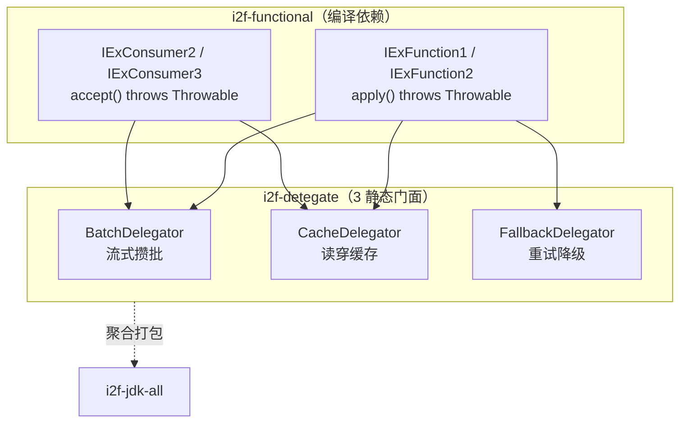
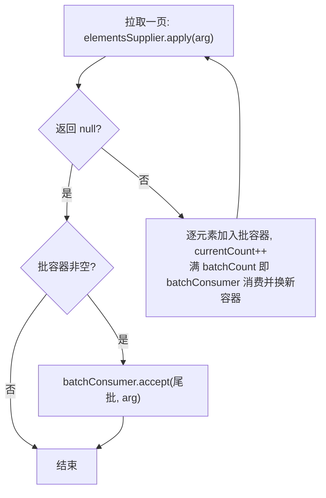
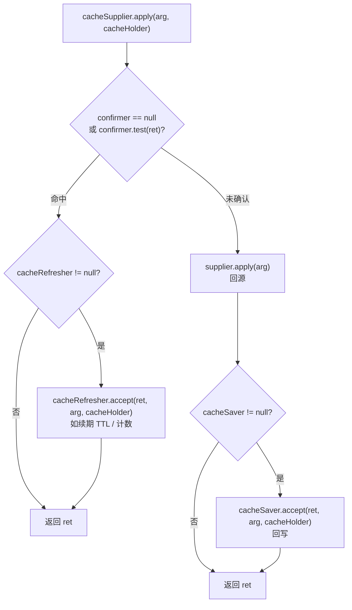
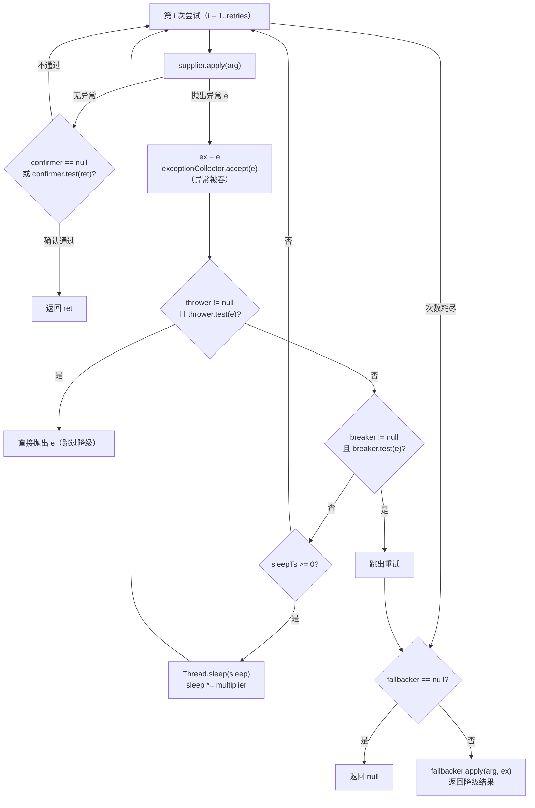
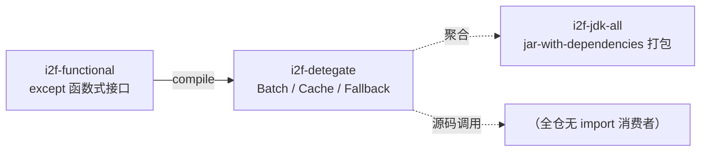

# i2f-detegate

> 通用**委托执行骨架三件套** —— 将「流式攒批」「读穿缓存」「重试降级」三类高频控制流抽象为回调式零状态静态门面：`BatchDelegator`（分页拉取 → 攒满批次 → 批量消费）、`CacheDelegator`（缓存查询 → 命中确认 → 回源回写 → 命中刷新）、`FallbackDelegator`（重试 → 几何退避 → 断路 → 降级回退），全部构建于 `i2f-functional` 的**可抛异常函数式接口**（`IExFunction1/2`、`IExConsumer2/3`）之上，零三方运行期依赖。（artifactId 拼写为 `i2f-detegate`——`delegate` 误拼，包名 `i2f.delegate` 为正确拼写）

---

## 模块定位

- **功能**：以「调用方只提供回调、骨架只负责控制流」的方式，把批处理 / 缓存读穿 / 容错重试三类样板代码沉淀为 3 个静态门面类，可与任意数据源、任意缓存容器组合
- **所属层级**：`i2f-jdk` 基础工具层（函数式编程工具族），与 `i2f-functional` 直接相邻
- **设计原则**：
  - **回调即协议**：取数、存缓存、命中确认、刷新、降级、判定等行为全部由调用方通过回调注入，骨架自身不持有任何状态，线程安全性取决于调用方回调
  - **异常透传**：全部方法 `throws Throwable`，配合 `i2f-functional` 的 `IEx*`（except 版）函数式接口，回调内可自由抛出受检异常，无需内部 try-catch 包装
  - **arg 上下文穿透**：所有回调共享同一个 `T arg` 业务参数（请求对象 / 页码持有器 / 业务键……），消除闭包外捕获与类型转换样板
  - **容器无关**：`CacheDelegator` 的 `cacheHolder`（`U`）与 `BatchDelegator` 的 `containerSupplier`（`C`）均为开放泛型，可搭配 `Map`、`ICache`、Redis 客户端等任意载体

---

## 依赖关系

| 依赖 | 类型 | 用途 | 是否真实使用 |
|------|------|------|-------------|
| `i2f-functional` | 内部 | 可抛异常函数式接口：`IExFunction1<R,V1>`/`IExFunction2<R,V1,V2>`（`R apply(...) throws Throwable`）、`IExConsumer2<V1,V2>`/`IExConsumer3<V1,V2,V3>`（`void accept(...) throws Throwable`） | 是（3 个源文件全部 import） |
| `lombok` | — | — | **POM 未声明**（与多数模块的"声明未用"不同，本模块完全没有 lombok 依赖） |

**构建打包**：本模块 `pom.xml` 显式激活 `maven-assembly-plugin`（无自定义配置，完全继承根 POM `pluginManagement`：`jar-with-dependencies` 描述符、`appendAssemblyId=false`、绑定 `package` 阶段），打包时额外产出内嵌 `i2f-functional` 及其传递依赖的 fat-jar。

---

## 架构

### 类结构

| 类型 | 文件 | 说明 |
|------|------|------|
| **门面** `BatchDelegator` | `i2f/delegate/batch/BatchDelegator.java`（71 行） | 流式攒批：分页拉取 + 按 `batchCount` 攒批消费 + 尾批补刷 |
| **门面** `CacheDelegator` | `i2f/delegate/cache/CacheDelegator.java`（81 行） | 读穿缓存：查询 → 命中确认 → 回源 → 回写 → 命中刷新（4 个重载） |
| **门面** `FallbackDelegator` | `i2f/delegate/fallback/FallbackDelegator.java`（168 行） | 重试降级：重试 + 几何退避 + 断路 + 降级回退 + 异常收集（6 便捷重载 + 10 参核心） |

### 架构图



### 控制流一览

| 类 | 输入回调 | 控制流骨架 |
|----|---------|-----------|
| `BatchDelegator` | `elementsSupplier`（拉页）、`containerSupplier`（建批容器）、`batchConsumer`（消费批） | `while(true){ 拉页; null→停; 逐元素入批; 满批→消费 }` → 尾批补刷 |
| `CacheDelegator` | `cacheSupplier`（读缓存）、`supplier`（回源）、`cacheSaver`（回写）、`cacheConfirmer`（命中确认）、`cacheRefresher`（命中刷新） | 读缓存 → 确认命中 → （刷新）返回；未确认 → 回源 → 回写 → 返回 |
| `FallbackDelegator` | `supplier`（业务）、`confirmer`（结果确认）、`breaker`（断路降级）、`thrower`（直接抛出）、`fallbacker`（降级）、`exceptionCollector`（收集） | `for(1..retries){ 尝试; 成功且确认→返回; 异常→收集/直抛/断路/退避 }` → 降级回退 |

---

## 核心类详解

### 1. `BatchDelegator` — 流式攒批委托

```java
// 便捷版：批容器默认 LinkedList
public static <T, E, R extends Iterable<E>> void batch(
        T arg, IExFunction1<R, T> elementsSupplier, int batchCount,
        IExConsumer2<List<E>, T> batchConsumer) throws Throwable;

// 完整版：自定义批容器
public static <T, E, R extends Iterable<E>, C extends Collection<E>> void batch(
        T arg, IExFunction1<R, T> elementsSupplier, int batchCount,
        Supplier<C> containerSupplier, IExConsumer2<C, T> batchConsumer) throws Throwable;
```

**执行流程**：



- **分页协议**：`elementsSupplier` 被反复调用，每次返回「下一批源数据（`Iterable`）」，**返回 `null` 表示没有更多数据**（唯一终止条件）
- **攒批语义**：元素跨页累积，累计满 `batchCount` 个才触发一次 `batchConsumer`，适用于批量写库 / 批量发送等场景
- **尾批补刷**：循环结束后若当前容器非空，最后消费一次残余元素

**示例** —— 分页拉取 + 批量入库：

```java
int[] pageHolder = {0};
AtomicInteger saved = new AtomicInteger();
BatchDelegator.batch(
    pageHolder,
    ph -> {                              // 反复拉页，null 结束
        int page = ph[0]++;
        return page >= 5 ? null : loadPage(page);
    },
    100,                                 // 每攒满 100 条消费一次
    batch -> saved.addAndGet(saveBatch(batch))
);
```

### 2. `CacheDelegator` — 读穿缓存委托

```java
// 由简到繁 4 个重载，最终收敛到核心方法
public static <T, U, R> R cache(T arg, U cacheHolder,
        IExFunction2<R, T, U> cacheSupplier,     // 读缓存
        IExFunction1<R, T> supplier,             // 回源
        IExConsumer3<R, T, U> cacheSaver,        // 回写缓存（可空）
        Predicate<R> cacheConfirmer,             // 命中确认（可空 ⚠ 见缺陷 #2）
        IExConsumer3<R, T, U> cacheRefresher     // 命中刷新（仅核心方法可传）
) throws Throwable;
```

**执行流程**：



- **五个回调职责单一**：`cacheSupplier` 只负责"从缓存取值"、`supplier` 只负责"真实数据源"、`cacheSaver` 只负责"把回源结果写回"、`cacheConfirmer` 负责"判定缓存值是否可信"、`cacheRefresher` 只在命中时触发（典型用途：续期过期时间、更新访问计数）
- **`U cacheHolder`**：任意缓存容器（`Map`、`ICache` 实现、Redis 封装皆可），通过参数透传给所有回调
- **⚠ 关键使用约束**：**务必显式传 `cacheConfirmer`**（如 `Objects::nonNull`），否则缓存未命中返回的 `null` 会被当作命中值直接返回，真实数据源 `supplier` 不会被调用（分析见「已知缺陷」#2）

**示例** —— `ConcurrentHashMap` + DAO 读穿：

```java
Map<String, User> localCache = new ConcurrentHashMap<>();

User user = CacheDelegator.cache(
    userId, localCache,
    (id, cache) -> cache.get(id),                 // 读缓存
    id -> userDao.selectById(id),                 // 回源
    (u, id, cache) -> cache.put(id, u),           // 回写
    Objects::nonNull,                             // ⚠ 命中确认（必传）
    (u, id, cache) -> touchTtl(id)                // 命中刷新 TTL
);
```

### 3. `FallbackDelegator` — 重试降级委托

```java
// 由简到繁 6 个便捷重载，最终收敛到 10 参核心方法
public static <T, R> R fallback(T arg,
        IExFunction1<R, T> supplier,                 // 正常业务
        IExFunction2<R, T, Throwable> fallbacker,    // 降级处理（可空）
        int retries,                                 // 最大尝试次数（<=0 → 1）
        Predicate<R> confirmer,                      // 结果确认（可空 = 不校验）
        int sleepTs,                                 // 初始退避毫秒（<0 不退避）
        double multiplier,                           // 退避系数（<=0 → 1）
        Predicate<Throwable> breaker,                // 断路：提前进入降级
        Predicate<Throwable> thrower,                // 直抛：立即抛出异常
        Consumer<Throwable> exceptionCollector       // 异常收集（可空）
) throws Throwable;
```

**执行流程**：



- **成功判据**：无异常 **且** `confirmer` 通过；`confirmer == null` 时任意返回值都视为成功立即返回
- **异常三路由**：`thrower` 命中 → 立即 `throw`（不进入降级）；`breaker` 命中 → 跳出重试直接降级；其余异常 → 退避后重试
- **退避模型**：初始 `sleepTs`，每次失败后 `sleep *= multiplier`（几何增长）。JavaDoc 示例：`sleepTs=100, multiplier=1.1` 期望等待 `0,100,110,121,133`（与实际行为有差异，见缺陷 #4/#5）
- **降级回退**：重试耗尽（或断路）后调用 `fallbacker.apply(arg, ex)`，`ex` 为**最后一次**异常；若全程无异常仅确认失败，则 `ex == null`
- `exceptionCollector` 自身抛出的异常会被静默忽略（收集不干扰主流程）

**示例** —— 远程调用重试 + 降级兜底：

```java
String result = FallbackDelegator.fallback(
    requestId,
    id -> remoteService.call(id),                 // 正常业务
    (id, ex) -> "default-fallback-value",         // 降级：返回兜底值
    3,                                            // 最多尝试 3 次
    r -> r != null && !r.isEmpty(),               // 结果确认
    100, 1.5,                                     // 100ms 起步，×1.5 递增
    e -> e instanceof IllegalArgumentException,   // 参数错误：立即降级
    e -> e instanceof NullPointerException,       // NPE：直接抛出
    e -> log.warn("retry failed", e)              // 收集每次异常
);
```

---

## 依赖与消费关系



| 关系方 | 方式 | 说明 |
|--------|------|------|
| `i2f-functional` | 编译依赖 | 提供 `IExFunction1/2`、`IExConsumer2/3` 可抛异常函数式接口 |
| `i2f-jdk-all` | POM 聚合 | 全量聚合 + fat-jar 打包纳入 |
| 根 `pom.xml` | dependencyManagement | 版本统一托管（`${i2f.version}`） |
| 其他模块 | — | **全仓 0 个源码级 `import i2f.delegate.*`**——3 个委托器目前无生产消费方 |

---

## 与相邻模块对比

| 维度 | `i2f-detegate` | `i2f-cache` |
|------|---------------|-------------|
| 定位 | 控制流骨架（攒批 / 读穿 / 重试） | 缓存本地实现（`MapCache` / `ExpireCacheWrapper`） |
| 状态 | 零状态静态门面，无实例 | 持有 `Map` / `ExpireData` 等可变状态 |
| 与缓存的组合方式 | **容器无关**：缓存只是一个泛型 `U`，读写全走回调；无 TTL / 过期淘汰内建，靠 `cacheConfirmer` + `cacheRefresher` 交给调用方实现 | 提供具体 `ICache` 实现（含 TTL 过期语义） |
| 异常风格 | 全链路 `throws Throwable`（除 `Predicate`/`Consumer` 槽位） | 接口方法不抛受检异常 |

---

## 已知缺陷与设计约束

1. **artifactId 拼写错误 `i2f-detegate`**
   - `delegate` 被误拼为 `detegate`，而包名 `i2f.delegate` 是正确拼写，形成"坐标拼写错误、代码命名正确"的割裂
   - 坐标已发布，重命名会破坏兼容性，属历史遗留

2. **`CacheDelegator` 缺省 `cacheConfirmer` 时读穿失效（高危）**
   - 不传 `cacheConfirmer` 的重载中 `cacheConfirmer == null`，任何（包括 `null`）缓存返回值都会被当作命中直接返回
   - 对 `Map.get` / Redis GET 等"未命中返回 null"的语义，后果是：**首次调用返回 null 且 `supplier` 不会被调用，缓存也不会被回写**——在无其他写入路径时此后每次调用都返回 null，读穿与回写逻辑完全不可达
   - 必须显式传 `Objects::nonNull` 之类的确认器才能正确工作；建议将未命中信号显式化或提供默认确认语义

3. **`CacheDelegator` 缓存读取异常不降级**
   - `cacheSupplier` 抛出的异常（如 Redis 超时）直接向上传播，不会自动回退到 `supplier` 回源
   - 与"缓存故障不应影响主流程"的期望相悖，需要调用方自行在 `cacheSupplier` 内 try-catch

4. **`FallbackDelegator` 确认失败的重试不退避（热自旋）**
   - `Thread.sleep` 只存在于 `catch` 异常分支；`confirmer` 不通过的重试不睡眠，连续快速重试 `retries` 次
   - 与 JavaDoc "每次尝试，支持调用延迟"的描述不符，高速失败场景可能打满 CPU

5. **`FallbackDelegator` 末次失败后仍空等一次退避**
   - 循环内每次异常后无条件睡眠（包括最后一次），延迟降级路径执行
   - JavaDoc 示例声称等待为 `0,100,110,121,133`（首次尝试前 0），实际执行为异常后 `100,110,121,133,146` 共 5 次睡眠，其中末次 146ms 发生在降级之前，纯属浪费

6. **`FallbackDelegator` 吞掉 `InterruptedException`**
   - 退避睡眠 `try { Thread.sleep(...) } catch (Exception ee) {}` 空捕获：中断信号丢失且不恢复中断标志
   - 无法通过 `Thread.interrupt()` 取消重试循环；且 `sleep *= multiplier` 写在 `sleep()` 之后，一旦 `sleep()` 抛异常（如溢出取整后为负）增长也被跳过

7. **`FallbackDelegator` 静默空降级与末次异常语义**
   - `fallbacker == null` 时直接返回 `null` 作为降级结果，无日志无信号，调用方易在远处 NPE
   - `ex` 只保留**最后一次**异常（前序异常需靠 `exceptionCollector` 留存）；全程无异常（仅确认失败）时 `ex == null`，降级回调需容忍 `null` 入参
   - `(int) sleep` 强转存在截断/溢出风险（`sleepTs` 大或迭代多时可溢出为负，`Thread.sleep` 抛 `IllegalArgumentException` 后被空 catch 吞掉，退避静默失效）

8. **`BatchDelegator` 终止协议脆弱**
   - 终止**完全依赖** `elementsSupplier` 返回 `null`；若供应器习惯返回空 `Iterable`（常见分页实现）而非 `null`，`while(true)` 将死循环热转
   - 建议改为"空页 + 无更多标志"双保险或在文档中强约束分页协议

9. **`BatchDelegator` 参数无校验**
   - `batchCount <= 0` 时 `currentCount == batchCount` 永不成立，行为退化为"全部元素积攒为单批、末尾一次性消费"，内存无界且语义与直觉不符（无任何文档说明）
   - `batchConsumer` 抛出的异常会中断整个攒批流程，无按批容错（如跳过失败批）

10. **全模块无源码级消费者**
    - 全仓 `import i2f.delegate.*` 为 0，3 个委托器仅被 `i2f-jdk-all` 聚合分发，处于"备而未用"状态
    - 工具定位上相当于 Spring `RetryTemplate` / `@Cacheable` / 批处理模板的轻量纯 JDK 替代，落地前建议结合实际场景补充用例

---

## 总结

`i2f-detegate` 用 3 个静态门面类把散落各处的「攒批 / 读穿 / 重试降级」控制流沉淀为可复用骨架，核心价值在于：

- **回调式设计**：调用方只提供行为（拉取、存取、判定、降级），骨架只负责控制流，零状态、容器无关
- **异常友好**：构建于 `i2f-functional` 的 except 函数式接口之上，全链路允许受检异常透传
- **轻量**：零三方运行期依赖，完整实现约 320 行

使用时重点注意：`CacheDelegator` **必须传 `cacheConfirmer`** 才能正确读穿；`FallbackDelegator` 的退避只作用于异常路径且末次空等；`BatchDelegator` 的终止完全依赖 `null` 页。
