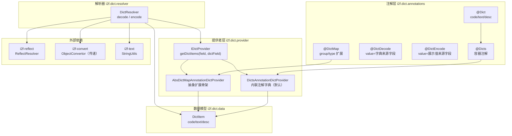
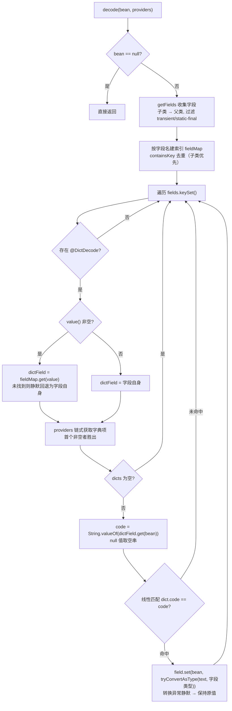
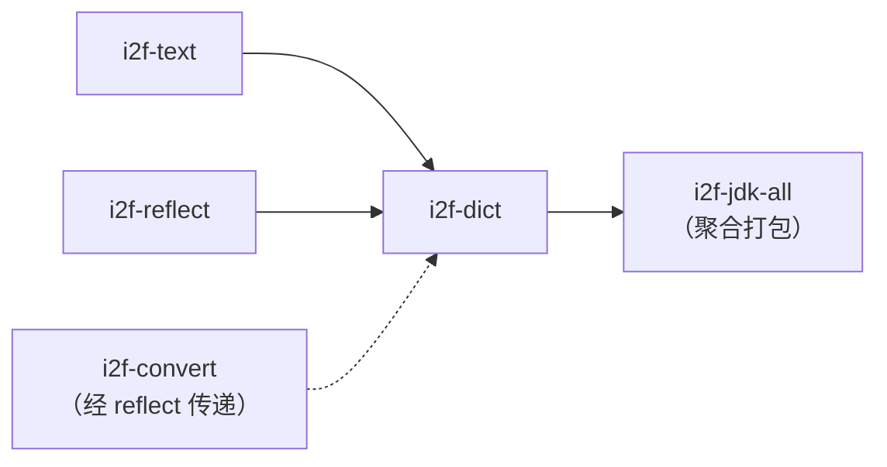

# i2f-dict 字典编解码

> 注解驱动的字典值双向转换器——以 `@DictDecode`/`@DictEncode` 声明「码值字段 ⇄ 文本字段」的映射关系，`DictResolver.decode/encode` 静态门面沿反射字段遍历 + 可插拔 `IDictProvider` 提供者链，完成字典码值与展示文本之间的自动互译。

---

## 模块定位

| 维度 | 说明 |
|---|---|
| **功能** | Bean 字段级「字典码值（code）⇄ 字典文本（text）」双向转换：`decode` 码值→文本、`encode` 文本→码值 |
| **层级** | i2f-jdk 基础工具层（`annotation-driven` 注解驱动） |
| **设计** | 注解声明映射 + `IDictProvider` 可插拔字典源 + 零状态静态门面 |
| **规模** | 13 源文件、约 440 行（5 注解 + 1 数据模型 + 3 提供者 + 1 解析器 + 3 演示类） |
| **入口** | `DictResolver.decode(bean)` / `DictResolver.encode(bean)` |

典型场景：数据库存储字典码值（如 `sex=1`），接口/前端需要展示文本（如 `"男"`）；导出报表时又需要把文本还原为码值。本模块通过字段上的注解自动完成两个方向的翻译，无需手写 if-else 映射代码。

---

## 依赖关系

| 依赖 | 用途 | 真实性 |
|---|---|---|
| `lombok` | `@Data` / `@NoArgsConstructor`（`DictItem`、`TestBean`、`TestBeanSub`） | **真实使用** |
| `i2f-text` | `StringUtils.isEmpty`（`@DictDecode`/`@DictEncode` 的 `value()` 判空） | **真实使用** |
| `i2f-reflect` | `ReflectResolver.getFields` / `getAnnotation`（字段收集与注解读取） | **真实使用** |
| `i2f-convert` | `ObjectConvertor.tryConvertAsType`（字典文本 → 目标字段类型转换） | **隐式传递依赖**（经 `i2f-reflect → i2f-convert` 传递引入，POM 未直接声明） |

> ⚠️ `DictResolver` 第 3 行直接 `import i2f.convert.obj.ObjectConvertor`，但本模块 POM 只声明了 `lombok` + `i2f-text` + `i2f-reflect` 三个依赖，编译期依赖 `i2f-reflect` 的传递依赖兜底（见「已知缺陷」#1）。

---

## 架构

### 类结构

| 包 | 类/接口 | 类型 | 职责 |
|---|---|---|---|
| `i2f.dict.annotations` | `Dict` | 注解 | 单个字典项（`code`/`text`/`desc`），`@Repeatable(Dicts.class)` 支持重复标注 |
| | `Dicts` | 注解 | `Dict[] value()` 容器注解（重复 `@Dict` 的合成容器） |
| | `DictDecode` | 注解 | 声明**解码字段**及其字典来源字段名（`value()`） |
| | `DictEncode` | 注解 | 声明**编码字段**及其展示值来源字段名（`value()`） |
| | `DictMap` | 注解 | 外部字典映射扩展声明（`group`/`type` 由实现方解释） |
| `i2f.dict.data` | `DictItem` | 类 | 字典项数据模型（`code`/`text`/`desc`） |
| `i2f.dict.provider` | `IDictProvider` | 接口 | 字典项提供者契约：`getDictItems(field, dictField)` |
| `i2f.dict.provider.impl` | `DictsAnnotationDictProvider` | 类 | 从 `@Dicts` 内联注解中提取字典项（默认提供者） |
| | `AbsDictMapAnnotationDictProvider` | 抽象类 | 从 `@DictMap` 提取映射信息，委托子类 `findDictList` 对接外部字典源 |
| `i2f.dict.resolver` | `DictResolver` | 类 | 静态门面：`decode`/`encode` 双向转换主流程 |
| `i2f.dict.test` | `TestBean` / `TestBeanSub` / `TestDict` | 类 | 演示 Bean（含继承场景）与 `main` 演示入口 |

### 架构图



---

## 核心机制

### 1. 注解体系（单向映射声明）

`@DictDecode` 与 `@DictEncode` 是**方向相反**的一对注解，均只有 `String value() default ""` 一个属性：

| 注解 | 标注位置 | `value()` 语义 |
|---|---|---|
| `@DictDecode("sex")` | **展示字段**（如 `sexDesc`） | 字典**码值**来源字段名（默认空 = 字段自身） |
| `@DictEncode("sexDesc")` | **码值字段**（如 `sex`） | 字典**文本**来源字段名（默认空 = 字段自身） |

以 `TestBean` 为例（源码节选）：

```java
public class TestBean {
    @DictEncode("sexDesc")          // 编码：从 sexDesc 文本还原到本字段码值
    private Integer sex;

    @DictDecode("sex")              // 解码：从 sex 码值翻译到本字段文本
    @Dict(code = "1", text = "男")   // 内联字典项，可重复标注
    @Dict(code = "2", text = "女")
    @Dict(code = "", text = "未知")  // 空 code 兜底项（null 值匹配空串）
    private String sexDesc;

    @DictDecode                     // 无 value = 就地双向转换（自身既是码值又是文本）
    @DictEncode
    @Dict(code = "1", text = "一级")
    @Dict(code = "2", text = "二级")
    @Dict(code = "3", text = "三级")
    @Dict(code = "", text = "未知")
    private String grade;
}
```

三种使用形态：

1. **跨字段解码**（`@DictDecode("sex")` 标在 `sexDesc`）：`sex=1` → `sexDesc="男"`
2. **跨字段编码**（`@DictEncode("sexDesc")` 标在 `sex`）：`sexDesc="男"` → `sex=1`
3. **就地双向**（`@DictDecode` + `@DictEncode` 同时标注且无 value）：`grade="1"` →（decode）→ `"一级"` →（encode）→ `"1"`

### 2. 提供者链（IDictProvider）

```java
public interface IDictProvider {
    List<DictItem> getDictItems(Field field, Field dictField);
}
```

- **参数语义**：`field` 为被标注的目标字段（如 `sexDesc`），`dictField` 为字典来源字段（如 `sex`）；
- **查找顺序**：两个内置实现均**先查 `dictField` 上的注解、再回退查 `field` 上的注解**——即字典定义写在"来源字段"上优先；
- **链式短路**：`DictResolver` 依序调用传入的 providers，**首个返回非空列表者胜出**；
- **默认提供者**：`DictResolver.AnnotationDictProvider = new DictsAnnotationDictProvider()`，仅支持注解内联字典；使用 `@DictMap` 外部字典必须显式传入自定义 provider。

`@Dict` 的重复标注由 JDK 重复注解机制合成为 `@Dicts` 容器，而 `ReflectResolver.getAnnotation` 内部调用 `getDeclaredAnnotationsByType`/`getAnnotationsByType`（自动展开容器），因此 `DictsAnnotationDictProvider` 只需读取 `@Dicts` 即可拿到全部字典项。

### 3. DictResolver.decode 主流程



关键行为：

- **字段来源**：`ReflectResolver.getFields(clazz)` 过滤 `transient`、`static final` 字段及 JDK 基础类型声明类字段，顺序为子类声明字段 → 父类；
- **空值兜底**：`dictField` 值为 `null` 时 `code` 取空串 `""`，与字典中 `@Dict(code = "", text = "未知")` 项匹配，实现 null → "未知" 的语义；
- **写回类型**：字典文本经 `ObjectConvertor.tryConvertAsType(text, field.getType())` 转换为目标字段类型后写入（如文本 "男" 写入 `String` 字段、文本 "1" 写入 `Integer` 字段）。

### 4. DictResolver.encode 主流程

`encode` 与 `decode` 完全镜像：遍历带 `@DictEncode` 的字段，取 `dictField`（文本来源）当前值，**匹配 `DictItem.text`**，将 `DictItem.code` 转换为目标类型写入。差异点：

| 差异项 | decode | encode |
|---|---|---|
| 触发注解 | `@DictDecode` | `@DictEncode` |
| 匹配键 | `DictItem.code` ← `dictField` 值 | `DictItem.text` ← `dictField` 值 |
| 写入值 | `text` 转目标类型 | `code` 转目标类型；**空 code 写 null** |
| 字段索引去重 | `containsKey` 检查（子类优先） | 直接 `put`（无检查，父类同名字段后覆盖） |

---

## 使用示例

```java
TestBean bean = new TestBean();
bean.setSex(1);
bean.setGrade("1");

// 解码：码值 → 文本
DictResolver.decode(bean);
// sex = 1, sexDesc = "男"（code "1" 匹配 → text "男"）
// grade = "一级"（就地转换："1" → "一级"）

System.out.println(bean);

// 编码：文本 → 码值
bean.setSex(null);
DictResolver.encode(bean);
// sex = 1（sexDesc "男" 匹配 text → code "1" → Integer 1）
// grade = "1"（就地反向："一级" → "1"）
System.out.println(bean);
```

接入自定义字典源（如数据库字典表）时继承抽象骨架：

```java
public class DbDictProvider extends AbsDictMapAnnotationDictProvider {
    @Override
    public List<DictItem> findDictList(DictMap ann) {
        // 按 ann.group() / ann.type() 查询数据库字典表并转换为 DictItem 列表
        return dictQueryService.query(ann.group(), ann.type());
    }
}

DictResolver.decode(bean, new DbDictProvider());
// 字段标注 @DictMap(group = "sys", type = "sex") 即可使用
```

---

## 依赖与消费关系



| 关系 | 模块 | 说明 |
|---|---|---|
| 上游依赖 | `i2f-text` / `i2f-reflect` | 真实使用（StringUtils / ReflectResolver） |
| 隐式上游 | `i2f-convert` | 经 `i2f-reflect` 传递引入，`ObjectConvertor` 直接使用 |
| 下游消费者 | **无** | 全仓无任何模块 `import i2f.dict.*`（仅模块自身内部引用）；仅被 `i2f-jdk-all` 聚合（`pom.xml` L221）与根 POM `dependencyManagement`（L376）收录 |

---

## 与相邻模块对比

| 模块 | 层次 | 与本模块关系 |
|---|---|---|
| `i2f-convert` | 类型转换底座 | 本模块的**底层引擎**：字典文本 → 字段类型的最终转换由 `ObjectConvertor.tryConvertAsType` 完成 |
| `i2f-reflect` | 反射底座 | 提供字段收集（含继承遍历、过滤规则）与注解读取（含重复注解展开） |
| `i2f-check` | 校验框架 | 同为注解驱动（消费 `i2f-annotations-core` 的 `@Check` 校验字段合法性），但方向不同：check 做**断言**，dict 做**翻译** |

---

## 已知缺陷与设计约束

1. **隐式传递依赖**：`DictResolver` 直接 import `i2f.convert.obj.ObjectConvertor`，但 POM 未声明 `i2f-convert`，编译期靠 `i2f-reflect` 的传递依赖兜底——一旦上游调整依赖树，本模块静默编译失败。
2. **encode/decode 字段去重策略不一致**：`decode` 的 `fieldMap` 有 `containsKey` 检查（保留首个 = 子类字段），`encode` 直接 `put`（后 put 的父类字段覆盖子类）——父子类存在同名字段时，两向命中的 Field 对象相反。
3. **`AbsDictMapAnnotationDictProvider` 空值无防御**：`findDictList` 返回 `null` 时原样透传，下游 `dicts.isEmpty()` 直接 NPE；且局部变量 `ret` 仅在 `dann == null` 分支使用，属冗余代码。同理 `IDictProvider` 自定义实现返回 `null` 也会触发 NPE。
4. **转换异常静默吞没**：`ObjectConvertor.tryConvertAsType` 的调用被 `catch (Exception e) {}` 空块包裹——字典文本无法转换为目标类型时无任何日志/异常，字段保持原值，问题难以排查。
5. **匹配失败静默保留原值**：`dicts` 非空但 code/text 均未命中时无兜底、无日志；null → "未知" 等语义完全依赖使用者在字典中手工配置**空 code / 空 text 兜底项**。
6. **空值语义靠约定**：decode 中 null 值字段按空串 `""` 匹配 code；encode 中空 code 直接写入 `null`（`if (!"".equals(dict.getCode()))` 分支）；空 text 经 `tryConvertAsType("", 数值类型)` 转换失败后静默——三个空值行为无统一约定文档。
7. **`@DictMap` 扩展骨架全仓未启用**：`AbsDictMapAnnotationDictProvider` 是抽象类且全仓无子类实现，`@DictMap` 注解与 `group`/`type` 属性为预留扩展点，当前无实际消费者。
8. **`IDictProvider` 双 Field 参数无 JavaDoc**：`getDictItems(Field field, Field dictField)` 两个参数（目标字段/来源字段）的语义仅在实现代码中体现，自定义实现者易混淆。
9. **异常声明与实现不符**：`decode`/`encode` 声明 `throws Exception`，但内部绝大多数异常被吞没（`field.setAccessible(true)` 后反射 get/set 几乎不抛），签名具有误导性。
10. **继承演示未纳入测试**：`TestBeanSub extends TestBean` 用于演示继承字段遍历，但 `TestDict` 仅演示 `TestBean`，继承路径无实际调用入口。
11. **`desc` 字段全程不参与逻辑**：`Dict.desc` / `DictItem.desc` 仅作数据携带（如对接数据库字典表时存放备注），编解码流程完全忽略。

---

## 总结

`i2f-dict` 以「**注解声明映射关系 + Provider 提供字典数据 + Resolver 执行翻译**」三层结构，实现了字段级字典码值双向转换的最小可用闭环：

- **简洁**：`DictResolver.decode(bean)` / `encode(bean)` 一行完成全字段翻译；
- **灵活**：`@Dict` 内联字典覆盖轻量场景，`IDictProvider` + `@DictMap` 预留外部字典源（数据库、Redis、枚举等）的扩展通道；
- **局限**：默认只启用注解内联字典，外部字典、异常提示、空值兜底均依赖使用者的约定与手工配置；`i2f-convert` 隐式传递依赖与 encode/decode 去重不一致是需要注意的实现瑕疵。

适合在「字典项少、稳定、内联」的 DTO/VO 场景中直接使用；字典量大或需要动态管理时，应实现自定义 Provider 并注意上述已知缺陷。
