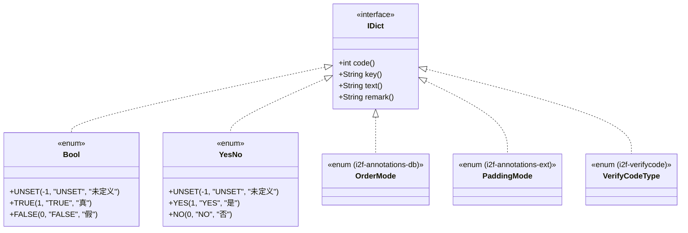
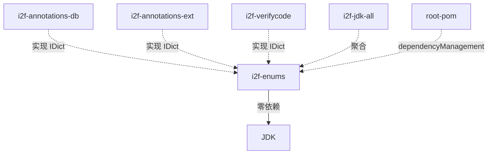

# i2f-enums 字典枚举接口与基础实现

> 字典枚举契约 `IDict` 与两个开箱即用的基础枚举 `Bool`/`YesNo`——以 `int code()`、`String text()`、`default String key()`、`default String remark()` 四方法定义"字典条目"最小公共协议，`Bool`（UNSET/TRUE/FALSE）与 `YesNo`（UNSET/NO/YES）为 boolean 语义提供标准化三值枚举，被 `i2f-annotations-db`/`i2f-annotations-ext`/`i2f-verifycode` 等模块的枚举常量实现。

---

## 模块定位

| 维度 | 说明 |
|---|---|
| **功能** | 字典条目公共接口 `IDict` + 两个三值 boolean 枚举 `Bool`/`YesNo` |
| **层级** | i2f-jdk 基础工具层（`api` 契约 + `base` 实现） |
| **设计** | 纯接口 + 枚举，零依赖，开箱即用 |
| **规模** | 3 源文件、约 120 行（1 接口 + 2 枚举） |
| **入口** | `i2f.enums.api.IDict`、`i2f.enums.base.Bool`、`i2f.enums.base.YesNo` |

典型场景：枚举常量实现 `IDict` 接口以统一获取字典码值（`code()`）与展示文本（`text()`），被注解元数据解析（`i2f-annotations-db`/`i2f-annotations-ext`）或验证码类型（`i2f-verifycode`）模块直接实现。

## 依赖关系

| 依赖 | 类型 | 用途 | 真实使用？ |
|---|---|---|---|
| *无* | — | **零依赖**（无 lombok、无 i2f 内部依赖） | — |

### 传递依赖链

```
i2f-enums
  └── (零依赖，纯 JDK 编译期即可)
```

## 架构

### 类结构

| 类 | 行数 | 可见性 | 说明 |
|---|---|---|---|
| `IDict` (接口) | 20 | `public` | 字典条目公共协议：`code()`/`text()`/`key()`/`remark()` |
| `Bool` (枚举) | 49 | `public` | 三值 boolean：`UNSET(-1)` / `TRUE(1)` / `FALSE(0)` |
| `YesNo` (枚举) | 49 | `public` | 三值是/否：`UNSET(-1)` / `YES(1)` / `NO(0)` |

### 架构图



### 控制流一览

| 方向 | 触发方式 | 核心流程 |
|---|---|---|
| 实现接口 | `implements IDict` | 枚举常量提供 `code()`/`text()` 等四方法，被元数据解析反射读取 |
| 消费接口 | 反射读取 | 外部模块（如 `i2f-annotations-db`）扫描枚举常量上的 `IDict` 方法获取字典元数据 |

## 核心类详解

### `IDict` — 字典条目公共协议

```java
// 文件：i2f.enums.api.IDict.java（20 行）
public interface IDict {
    int code();                      // 字典码值（数据库/传输用）
    
    default String key() {           // 可选键名（默认 null）
        return null;
    }
    
    String text();                   // 字典展示文本
    
    default String remark() {        // 可选备注（默认 null）
        return null;
    }
}
```

- **`code()`**（抽象）：字典条目的整型码值，用于数据库存储、网络传输、枚举匹配。
- **`text()`**（抽象）：字典条目的展示文本，用于界面显示、日志输出。
- **`key()`**（默认返回 `null`）：可选的字符串键名，为按名称查找提供另一维度。
- **`remark()`**（默认返回 `null`）：可选的备注说明，为枚举条目附加描述信息。

**设计意图**：将"枚举常量具有字典属性"这一通用需求抽象为接口，使任何枚举（包括跨模块的）可以通过向上转型为 `IDict` 统一获取 code/text/key/remark，不依赖具体枚举类。

**使用示例**：

```java
// 外部模块实现 IDict 接口的典型用法（i2f-annotations-db.OrderMode）
public enum OrderMode implements IDict {
    ASC(1, "asc", "升序"),
    DESC(2, "desc", "降序"),
    UNSET(-1, "unset", "未设置");
    
    // ... code/text/remark 实现
    
    @Override
    public int code() { return this.code; }
    
    @Override
    public String text() { return this.text; }
}

// 统一获取字典信息
IDict mode = OrderMode.ASC;
int code = mode.code();     // 1
String text = mode.text();  // "升序"
```

### `Bool` — 三值布尔枚举

```java
// 文件：i2f.enums.base.Bool.java（49 行）
public enum Bool implements IDict {
    UNSET(-1, "UNSET", "未定义", null),
    TRUE(1, "TRUE", "真", null),
    FALSE(0, "FALSE", "假", null);
    // ... code/key/text/remark 实现
}
```

与 JDK `Boolean` 相比，`Bool` 是一个**三值枚举**（`UNSET`/`TRUE`/`FALSE`），适用于：
- 数据库字段允许 null 的三态场景
- 配置项未设置时的缺省区分
- 避免 `Boolean` 的 null 判断三叉分支

**常量说明**：

| 常量 | code | text | 语义 |
|---|---|---|---|
| `UNSET` | -1 | "未定义" | 未设置/未定义 |
| `TRUE` | 1 | "真" | 是/真 |
| `FALSE` | 0 | "假" | 否/假 |

### `YesNo` — 三值是/否枚举

```java
// 文件：i2f.enums.base.YesNo.java（49 行）
public enum YesNo implements IDict {
    UNSET(-1, "UNSET", "未定义", null),
    YES(1, "YES", "是", null),
    NO(0, "NO", "否", null);
    // ... code/key/text/remark 实现
}
```

与 `Bool` 并列的三值枚举变体，语义面向"是/否/未定义"的自然语言场景。

**常量说明**：

| 常量 | code | text | 语义 |
|---|---|---|---|
| `UNSET` | -1 | "未定义" | 未设置/未定义 |
| `YES` | 1 | "是" | 是/确认 |
| `NO` | 0 | "否" | 否/拒绝 |

## 依赖与消费关系



| 模块 | 关系 | 文件 | 引用方式 |
|---|---|---|---|
| `i2f-annotations-db` | POM 依赖 + 实现 | `OrderMode.java` | `implements IDict` |
| `i2f-annotations-ext` | POM 依赖 + 实现 | `PaddingMode.java` | `implements IDict` |
| `i2f-verifycode` | POM 依赖 + 实现 | `VerifyCodeType.java` | `implements IDict` |
| `i2f-jdk-all` | 聚合依赖 | pom.xml L225 | 聚合纳入 |
| 根 POM | dependencyManagement | pom.xml L381 | 版本托管 |

## 与相邻模块对比

| 模块 | 定位 | 对比 |
|---|---|---|
| `i2f-enums` | **字典枚举契约** + 2 个基础实现 | `IDict` 是纯字典**接口**，各模块枚举自行实现 |
| `i2f-dict` | **注解驱动的字典编解码** | 基于 `@DictDecode`/`@DictEncode` 注解在 Bean 上声明码值⇄文本转换，**消费**枚举常量或内联字典做映射源 |
| `i2f-annotations-db`/`i2f-annotations-ext` | 数据库/扩展注解库 | 其枚举常量直接 `implements IDict`，`i2f-dict` 的解析器可反射读取这些枚举的 code/text |

## 已知缺陷与设计约束

1. **接口方法 `key()` 默认返回 null，语义模糊**：调用者无法区分"未重写"与"显式设置为 null"，需外部约定；同样的问题也存在于 `remark()`。

2. **`Bool` 与 `YesNo` 的 code 值不一致语义重叠**：两个枚举的 `TRUE(1)`/`YES(1)` 与 `FALSE(0)`/`NO(0)` 的 code 值完全相同，但 text 不同（"真"/"是"、"假"/"否"）。在 `i2f-dict` 注解映射时若混用，code 无法区分出自哪个枚举。

3. **无 `getByCode(int)`/`getByText(String)` 查找方法**：模块未提供按 code 或 text 反向查找枚举常量的工具方法，调用者需要自行遍历 `values()`（如 `OrderMode.values()`）实现。

4. **`IDict` 未继承 `Serializable`**：虽然枚举自身可序列化，但面向 `IDict` 接口编程时无法声明 `implements Serializable`，在 RPC 或缓存场景需额外注意。

5. **无 `fromName(String)` 工厂方法**：未提供按枚举 name 或 key 字符串查找的工厂，调用者需手动 `Enum.valueOf(...)`。

6. **`key()` 默认返回 null 与 `@Dict` 的 key 字段语义冲突**：`i2f-dict` 模块的 `@Dict(key="codeText")` 属性名为 `key`，与 `IDict.key()` 在命名上重叠但语义不同（`@Dict.key` 是注解属性名，`IDict.key()` 是枚举键名），易混淆。

7. **`Unset(-1)` 的语义边界不清晰**：`UNSET` 的 code=-1 是内部约定，外部消费者若将 -1 作为合法值存储（如数据库字段设为 -1），将与 UNSET 语义冲突——模块无校验或配置机制防止此误用。

8. **code 与 text 的国际化缺失**：`text()` 直接返回硬编码中文字符串（"真"/"假"/"是"/"否"/"未定义"），无 `i18n` 或无参国际化回退机制，国际场景需调用者自行包装。

9. **模块极度精简但产出 fat-jar**：`maven-assembly-plugin` 将无任何依赖的 3 个源文件打包为 `jar-with-dependencies`，实际与普通 jar 无异（零运行期依赖），assembly 配置仅因父 POM 统一模板。

10. **枚举常量数量固定，无扩展性**：`Bool` 和 `YesNo` 的三常量是硬编码的。若业务需要更细致的语义（如 `Bool` 增加 `UNKNOWN`），只能修改模块源码或另建枚举。

11. **`text()` 与 `code()` 的映射为单向**：模块仅提供 code→text 的枚举声明（每个常量既有 code 也有 text），但无 `Map<Integer, String>` 缓存。如 `i2f-dict` 的 `DictResolver` 要按 code 反向查 text，只能线性遍历 `values()` 对比 code。

## 总结

`i2f-enums` 是 i2f 体系中**最精简的模块之一**——3 个源文件、零依赖、约 120 行，定义了字典枚举的公共契约 `IDict` 并提供两个开箱即用的三值 boolean 枚举。其核心价值在于「接口标准化」：让各模块的枚举常量统一向上转型为 `IDict`，使得上层工具（如 `i2f-dict` 的注解编解码、注解元数据解析器）可以面向接口而非具体枚举类编程。模块符合 i2f 一贯的"约定大于配置"风格，但也因极度精简而缺少反向查找、国际化、序列化支持等实用设施，需要调用者在业务层补充。