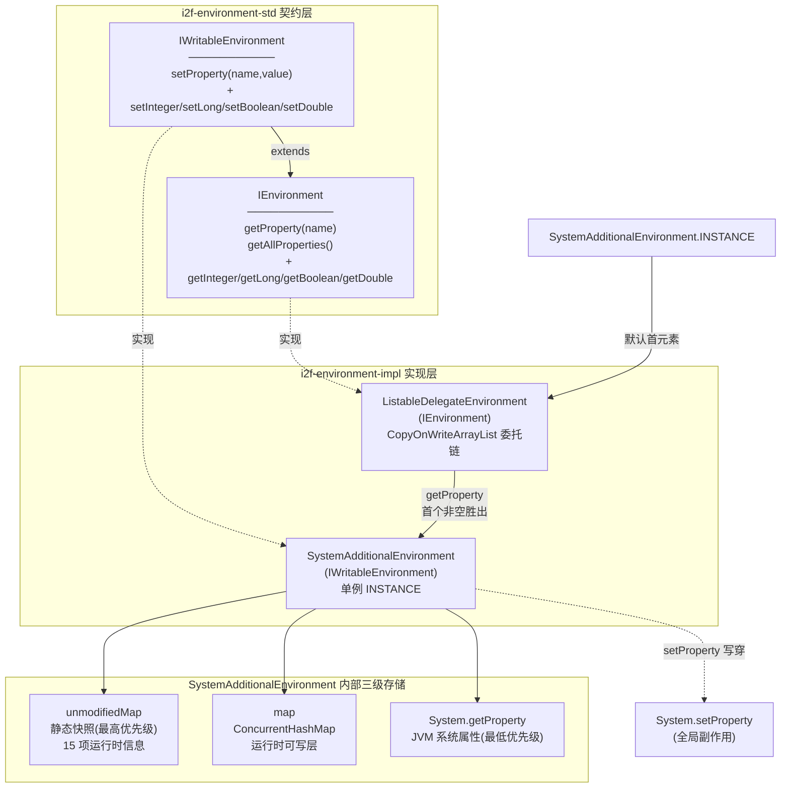
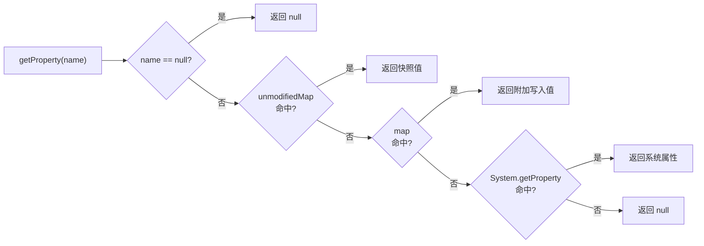

# i2f-environment-impl 环境配置实现层

> 环境配置契约的默认实现层——`SystemAdditionalEnvironment` 以**单例 + 静态快照 + 可写层 + System 属性**三级查找聚合 JVM 运行时/编译/操作系统信息并提供附加属性写入能力，`ListableDelegateEnvironment` 以 `CopyOnWriteArrayList` 委托链对多个 `IEnvironment` 做优先级聚合（首个非空胜出），被 `i2f-jdbc-procedure` 默认装配为执行器环境。

---

## 模块定位

| 维度 | 说明 |
|---|---|
| **功能** | `IEnvironment`/`IWritableEnvironment` 的默认实现：JVM 运行时信息采集 + 系统属性桥接 + 多环境委托聚合 |
| **层级** | i2f-jdk 基础工具层（`impl` 实现层，对应 `i2f-environment-std` 契约） |
| **设计** | 单例 + 静态快照 + 三级查找；委托链 + 首个非空胜出 + 反向覆盖合并 |
| **规模** | 2 源文件、约 163 行（1 单例实现 + 1 委托实现） |
| **入口** | `SystemAdditionalEnvironment.INSTANCE`、`new ListableDelegateEnvironment()` |

典型场景：执行引擎需要读取 JVM 运行时信息（PID、classpath、启动参数、操作系统版本等）或注入自定义附加属性（如环境相关的全局开关）时，通过 `IEnvironment` 统一门面访问。

---

## 依赖关系

| 依赖 | 类型 | 使用情况 | 说明 |
|---|---|---|---|
| `lombok` | 编译期注解处理 | **声明未用** | 模块内无任何 lombok 注解/import（冗余依赖） |
| `i2f-environment-std` | 编译+运行期 | **真实使用** | 实现 `IEnvironment`/`IWritableEnvironment` 契约 |
| `i2f-jvm` | 编译+运行期 | **真实使用** | `JvmUtil.getPid()` 采集进程 PID |
| `maven-assembly-plugin` | 构建插件 | fat-jar 打包 | 与同层模块一致的打包方式 |

---

## 架构

### 类结构

| 类 | 行数 | 实现接口 | 职责 |
|---|---|---|---|
| `SystemAdditionalEnvironment` | 119 | `IWritableEnvironment` | 单例；静态块采集 15 项 JVM/编译/OS 运行时信息入 `unmodifiedMap`，运行时写入落 `map` 并穿透 `System.setProperty`；`getProperty` 三级查找 |
| `ListableDelegateEnvironment` | 44 | `IEnvironment` | 持有 `CopyOnWriteArrayList<IEnvironment>` 委托链（默认装入 `SystemAdditionalEnvironment.INSTANCE`）；读取首个非空胜出、全量属性反向覆盖合并 |

### 架构图



### 控制流一览

| 场景 | 组件 | 流程 |
|---|---|---|
| 读取运行时信息 | `SystemAdditionalEnvironment.getProperty` | `unmodifiedMap` → `map` → `System.getProperty` 三级查找，命中即返回 |
| 写入附加属性 | `SystemAdditionalEnvironment.setProperty` | `name==null` 直接返回；`value!=null` 时 `map.put` + `System.setProperty`（双写、全局副作用） |
| 全量属性导出 | `SystemAdditionalEnvironment.getAllProperties` | `System.getProperties()` 全量复制 → `putAll(map)` → `putAll(unmodifiedMap)`（快照优先级最高） |
| 委托链读取 | `ListableDelegateEnvironment.getProperty` | 正向遍历 `list`，`env.getProperty(name)` 首个非 null 即返回 |
| 委托链全量导出 | `ListableDelegateEnvironment.getAllProperties` | 反向遍历 `list` 逐个 `putAll`（索引 0 最后写入 → 优先级最高，与单键查找语义一致） |

---

## 核心类详解

### SystemAdditionalEnvironment — JVM 信息单例环境

```java
public class SystemAdditionalEnvironment implements IWritableEnvironment {
    public static final SystemAdditionalEnvironment INSTANCE = new SystemAdditionalEnvironment();
    // 15 个 public static final 属性名常量 + public static final Map<String,String> unmodifiedMap
    protected ConcurrentHashMap<String, String> map = new ConcurrentHashMap<>();
}
```

#### 采集的 15 项运行时信息（静态块一次性快照）

| 属性名常量 | 值来源 | 说明 |
|---|---|---|
| `runtime.boot.class.path` | `RuntimeMXBean.getBootClassPath()` | **try-catch 空吞**（JDK 9+ 移除该方法，抛异常则缺失） |
| `runtime.class.path` | `RuntimeMXBean.getClassPath()` | 应用 classpath |
| `runtime.input.arguments` | `RuntimeMXBean.getInputArguments()` | 启动参数，`StringJoiner("\n")` 换行拼接 |
| `runtime.library.path` | `RuntimeMXBean.getLibraryPath()` | 本地库路径 |
| `runtime.pid` | `JvmUtil.getPid()` | 进程 PID（i2f-jvm 提供，内部 AtomicReference 缓存） |
| `runtime.start.time` | `RuntimeMXBean.getStartTime()` | JVM 启动时间戳 |
| `runtime.vm.name` | `RuntimeMXBean.getVmName()` | VM 名称 |
| `runtime.vm.vendor` | `RuntimeMXBean.getVmVendor()` | VM 厂商 |
| `runtime.vm.version` | `RuntimeMXBean.getVmVersion()` | VM 版本 |
| `compilation.total.compilation.time` | `CompilationMXBean.getTotalCompilationTime()` | **快照值永不更新**（动态指标被冻结） |
| `compilation.name` | `CompilationMXBean.getName()` | 即时编译器名称 |
| `operating.system.arch` | `OperatingSystemMXBean.getArch()` | 系统架构 |
| `operating.system.available.processors` | `OperatingSystemMXBean.getAvailableProcessors()` | CPU 核心数 |
| `operating.system.version` | `OperatingSystemMXBean.getVersion()` | 系统版本 |
| `operating.system.name` | `OperatingSystemMXBean.getName()` | 系统名称 |

#### getProperty 三级查找



**优先序**：`unmodifiedMap`（运行时快照）> `map`（setProperty 写入）> `System` 属性。这意味着 `setProperty("runtime.pid", ...)` 这类覆盖运行时快照的尝试**不会生效**（快照层优先级固定最高）。

#### setProperty 双写行为

```java
@Override
public void setProperty(String name, String value) {
    if (name == null) {
        return;                    // 静默忽略
    }
    if (value != null) {
        map.put(name, value);      // 本地可写层
        System.setProperty(name, value);  // 写穿全局 JVM 系统属性（副作用）
    }
    // value == null 时：静默忽略（无删除语义）
}
```

**设计含义**：`setProperty` 将附加属性同时暴露给整个 JVM 进程（任意代码 `System.getProperty` 可见），这是有意的"附加系统环境"语义——但对宿主进程存在全局污染风险。

### ListableDelegateEnvironment — 委托链环境

```java
public class ListableDelegateEnvironment implements IEnvironment {
    protected CopyOnWriteArrayList<IEnvironment> list = new CopyOnWriteArrayList<>();

    {
        list.add(SystemAdditionalEnvironment.INSTANCE);  // 默认首个元素
    }

    @Override
    public String getProperty(String name) {
        for (IEnvironment env : list) {
            String prop = env.getProperty(name);
            if (prop != null) {
                return prop;   // 首个非空胜出
            }
        }
        return null;
    }

    @Override
    public Map<String, String> getAllProperties() {
        Map<String, String> ret = new LinkedHashMap<>();
        ArrayList<IEnvironment> arr = new ArrayList<>(list);  // 快照防并发
        for (int i = arr.size() - 1; i >= 0; i--) {
            ret.putAll(arr.get(i).getAllProperties());  // 反向 putAll：索引 0 最后覆盖
        }
        return ret;
    }
}
```

**语义一致性**：`getProperty` 正向遍历（索引 0 优先）与 `getAllProperties` 反向 putAll（索引 0 最后覆盖）优先级语义一致——索引 0 的元素（默认 `SystemAdditionalEnvironment.INSTANCE`）始终优先级最高。

**扩展性约束**：`list` 为 `protected` 字段且类中**未提供任何公开的 add/remove 方法**——包外使用者既不能追加自定义环境层，也不能移除默认层，委托链能力事实上无法被外部使用（除非继承该类并在子类中直接操作 `list`）。

#### 使用示例

```java
// 默认装配：委托链仅含 SystemAdditionalEnvironment.INSTANCE
IEnvironment env = new ListableDelegateEnvironment();

// 读取运行时信息
String pid = env.getProperty(SystemAdditionalEnvironment.RUNTIME_PID);
String classPath = env.getProperty(SystemAdditionalEnvironment.RUNTIME_CLASS_PATH);
int processors = env.getInteger(SystemAdditionalEnvironment.OPERATING_SYSTEM_AVAILABLE_PROCESSORS);

// 全量导出（快照 + 可写层 + System 属性 + 委托链合并）
Map<String, String> all = env.getAllProperties();

// 通过单例写入附加属性（同时写穿 System.setProperty）
SystemAdditionalEnvironment.INSTANCE.setProperty("app.mode", "prod");
```

---

## 依赖与消费关系

### 消费关系图

```mermaid
flowchart LR
    subgraph impl["i2f-environment-impl"]
        SYS["SystemAdditionalEnvironment"]
        LDE["ListableDelegateEnvironment"]
    end

    STD["i2f-environment-std"] -->|契约| impl
    JVM["i2f-jvm\nJvmUtil"] -->|getPid| SYS

    LDE -->|environment 字段\n默认装配| EXE["i2f-jdbc-procedure\nBasicJdbcProcedureExecutor"]
    LDE -.->|代码生成文本\n(字符串常量)| IDEA["i2f-tools/\ni2f-jdbc-procedure-idea-plugin"]
    LDE -->|聚合| ALL["i2f-jdk-all"]
```

### 消费者清单

| 消费方 | 层级 | 引用方式 | 说明 |
|---|---|---|---|
| `i2f-jdbc-procedure.BasicJdbcProcedureExecutor` | i2f-jdk | `import` + 字段默认值 | `protected volatile IEnvironment environment = new ListableDelegateEnvironment();`（L115），并支持构造器注入替换 |
| `i2f/jdbc-procedure-idea-plugin` | i2f-tools | 字符串常量（代码生成文本） | L163 生成 `"import i2f.environment.impl.ListableDelegateEnvironment;\n"` 文本，非编译期依赖 |
| `i2f-jdk-all` | 聚合 | 依赖声明 | 全仓聚合门面 |

---

## 与相邻模块对比

| 模块 | 定位 | 对比 |
|---|---|---|
| `i2f-environment-std` | 契约层（2 接口） | 本模块是其实现层；std 只定义方法签名，impl 提供 JVM 信息采集与委托聚合 |
| `i2f-context-std` / `i2f-context-impl` | 命名上下文（对象存取） | 同为 std/impl 分层；context 存任意对象、environment 存 String 键值 |
| `i2f-properties` | Properties 文件读写 | 侧重配置文件解析；environment 侧重运行时环境聚合与系统属性桥接 |
| `System.getProperty` 直接调用 | JDK 原生 | environment 在其上叠加静态快照、可写层与委托链能力 |

---

## 已知缺陷与设计约束

1. **[冗余依赖] lombok 声明未用**：POM 声明 lombok 但模块内无任何使用（import/注解均为 0 处）。

2. **[不可变性伪装] `unmodifiedMap` 非真正不可变**：`public static final Map<String, String>` 仅引用 final，底层 `HashMap` 内容可被任意代码直接修改（如 `unmodifiedMap.put(...)`），"unmodified"命名与实际可变性矛盾；若需真正只读应包装 `Collections.unmodifiableMap`。

3. **[扩展性缺陷] 委托链无法外部操作**：`ListableDelegateEnvironment.list` 为 `protected` 且无公开 add/remove 方法——包外使用者无法追加自定义 `IEnvironment` 层，`ListableDelegateEnvironment` 实际上退化为"只能含 `SystemAdditionalEnvironment.INSTANCE` 的包装器"。

4. **[全局副作用] setProperty 写穿 System 属性**：`setProperty` 调用 `System.setProperty`，将应用级附加属性泄漏到整个 JVM 进程，可能与其他库的系统属性约定冲突；且该行为**不可关闭**。

5. **[静默语义] value == null 静默忽略**：`setProperty(name, null)` 无任何效果（也无法删除已有属性），契约中无 `removeProperty` 方法，写入后无法撤销。

6. **[优先级固化] 运行时快照不可被覆盖**：`getProperty` 查找顺序固定 `unmodifiedMap` → `map` → `System`，用户 `setProperty("runtime.pid", ...)` 之类的覆盖尝试永不生效。

7. **[快照冻结] 动态指标不更新**：`compilation.total.compilation.time` 等本应动态变化的 MXBean 指标在类加载时采集一次后永久冻结，读取值具有误导性。

8. **[NPE 风险] MXBean 可空未防护**：`CompilationMXBean`（无 JIT 的 JVM）与 `OperatingSystemMXBean` 在部分运行环境下可能为 null，静态块中直接调用其方法会导致 `ExceptionInInitializerError` 使类加载失败；仅 `getBootClassPath()` 一处有 try-catch 保护。

9. **[异常吞噬] 静态块空 catch**：`getBootClassPath()` 的 `catch (Exception e) {}` 静默吞掉 JDK 9+ 的 `UnsupportedOperationException`，属性缺失无任何提示。

10. **[单例污染] 多实例共享可变状态**：`SystemAdditionalEnvironment` 为单例，任意 `ListableDelegateEnvironment` 实例默认共享同一 `INSTANCE`——一处 `setProperty` 影响所有持有者（设计使然，但无隔离机制）。

11. **[性能] getAllProperties 无缓存全量复制**：每次调用都全量遍历 `System.getProperties()` 并多次 `putAll`，在高频调用场景存在不必要的开销。

---

## 总结

`i2f-environment-impl` 是 `i2f-environment-std` 契约的默认实现层，仅 2 个类约 163 行：

- **`SystemAdditionalEnvironment`**：单例实现 `IWritableEnvironment`，静态块一次性采集 15 项 JVM 运行时/编译/操作系统信息构成最高优先级快照，`setProperty` 双写本地 `map` 与全局 `System.setProperty`，`getProperty` 三级查找。
- **`ListableDelegateEnvironment`**：`CopyOnWriteArrayList` 委托链（默认含 `SystemAdditionalEnvironment.INSTANCE`），单键读取首个非空胜出、全量导出反向覆盖合并，两者优先级语义一致。

模块真实依赖 `i2f-environment-std`（契约）与 `i2f-jvm`（PID 采集），lombok 为冗余声明。主要缺陷集中在：`unmodifiedMap` 不可变性伪装、委托链无公开扩展方法（能力退化）、setProperty 全局副作用、快照冻结动态指标、MXBean 空值 NPE 风险与静默异常吞噬。真实消费者为 `i2f-jdbc-procedure` 的 `BasicJdbcProcedureExecutor`（默认装配 `environment` 字段）。
