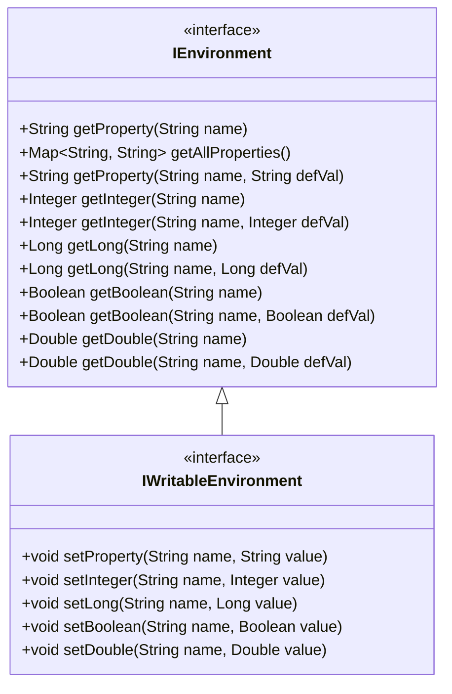
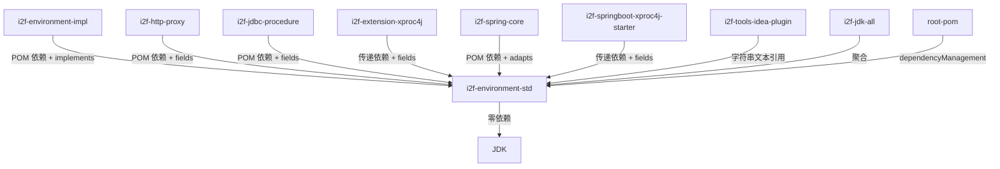

# i2f-environment-std 环境配置标准契约

> 框架无关的键值对环境配置访问/写入标准接口——`IEnvironment` 定义按名读取属性与类型安全 getter（Integer/Long/Boolean/Double），`IWritableEnvironment extends IEnvironment` 补充按名写入属性与类型安全 setter，构成「读写分离 × 类型适配」的二维正交契约；被 `i2f-environment-impl`、`i2f-http-proxy`、`i2f-jdbc-procedure`、`i2f-spring-core` 及 `i2f-extension-xproc4j` 等 11 个文件跨 jdk/extension/spring/springboot/tools 多层消费。

---

## 模块定位

| 维度 | 说明 |
|---|---|
| **功能** | 键值对环境配置的标准契约接口：属性读取 + 类型安全 getter/setter |
| **层级** | i2f-jdk 基础工具层（`std` 契约与实现分离） |
| **设计** | 读写分离双接口 + `default` 类型适配方法，零依赖组件 |
| **规模** | 2 源文件、约 102 行（1 只读接口 `IEnvironment` + 1 可写接口 `IWritableEnvironment`） |
| **入口** | `IEnvironment.getProperty(name)` / `IWritableEnvironment.setProperty(name, value)` |

典型场景：应用在运行时从系统属性、环境变量、配置文件、数据库或 Spring Environment 等异构来源读取配置，经同一接口屏蔽获取来源差异。

## 依赖关系

| 依赖 | 类型 | 用途 | 真实使用？ |
|---|---|---|---|
| lombok | POM 声明 | — | **未使用**（源文件中无 lombok 注解） |

### 传递依赖链

```
i2f-environment-std
  └── (运行期零依赖，纯 JDK 编译期即可)
```

## 架构

### 类结构

| 类 | 行数 | 可见性 | 说明 |
|---|---|---|---|
| `IEnvironment` (接口) | 75 | `public` | 只读环境契约：1 抽象 + 1 Map 抽象 + 4 组类型安全 getter（含默认值重载） |
| `IWritableEnvironment` (接口) | 26 | `public` | 可写环境契约：1 抽象 setter + 4 个类型安全 setter default 方法 |

### 接口继承关系



### 控制流一览

| 方向 | 触发方式 | 核心流程 |
|---|---|---|
| 读取属性 | `getProperty(name)` | 抽象方法，由实现类决定来源（系统属性 / 环境变量 / 数据库 / Spring Environment） |
| 类型安全读取 | `getInteger(name, defVal)` | `default` 方法：`getProperty(name)` → `Integer.parseInt(prop)` → 异常兜底返回 `defVal`（空 catch 静默） |
| 写入属性 | `setProperty(name, value)` | 抽象方法，由实现类决定写入目标 |
| 类型安全写入 | `setInteger(name, value)` | `default` 方法：`String.valueOf(value)` → `setProperty(name, str)`，null 安全 |

## 核心类详解

### `IEnvironment` — 只读环境契约

```java
// 文件：i2f.environment.std.IEnvironment.java（75 行）
public interface IEnvironment {
    String getProperty(String name);                              // 按名取属性值（抽象）
    Map<String, String> getAllProperties();                       // 取全部属性（抽象）

    default String getProperty(String name, String defVal) {      // 带默认值的属性读取
        String prop = getProperty(name);
        return prop == null ? defVal : prop;
    }

    // 类型安全 getter：Integer / Long / Boolean / Double
    default Integer getInteger(String name, Integer defVal) {
        String prop = getProperty(name);
        try { return Integer.parseInt(prop); } catch (Exception e) { }
        return defVal;
    }
    // ... getLong / getBoolean / getDouble 相同模式
}
```

- **`getProperty(name)`**（抽象）：按属性名取值，由实现类决定来源（系统属性、环境变量、配置文件、数据库等）。
- **`getAllProperties()`**（抽象）：返回当前环境全部属性的只读快照，供调试或批量处理使用。
- **`getProperty(name, defVal)`**（default）：带默认值兜底的属性读取。
- **`getInteger/getLong/getBoolean/getDouble`**（default）：类型安全读取器，`parse*` 异常时返回默认值。**注意**：所有 parse 异常被空 catch 块静默吞噬，调用者无法区分"属性不存在"与"格式错误"。

**设计意图**：以最小抽象（仅 2 个抽象方法 + 若干 default 便捷方法）刻画"从键值对来源按名取配置"这一最通用的环境需求，使消费方面向接口而非具体实现编程。

### `IWritableEnvironment` — 可写环境契约

```java
// 文件：i2f.environment.std.IWritableEnvironment.java（26 行）
public interface IWritableEnvironment extends IEnvironment {
    void setProperty(String name, String value);                   // 按名设置属性（抽象）

    default void setInteger(String name, Integer value) {          // 类型安全设置
        setProperty(name, value == null ? null : String.valueOf(value));
    }
    // ... setLong / setBoolean / setDouble 相同模式
}
```

- **`setProperty(name, value)`**（抽象）：将属性写入目标环境，完全由实现类决定持久化行为（内存 Map、数据库、文件等）。
- **`setInteger/setLong/setBoolean/setDouble`**（default）：类型安全写入器，将值通过 `String.valueOf()` 转换为字符串后委拖 `setProperty`，null 值按 `null` 字符串传递。

## 消费关系



| 模块 | 文件 | 引用方式 |
|---|---|---|
| `i2f-environment-impl` | `ListableDelegateEnvironment` | `implements IEnvironment` |
| `i2f-environment-impl` | `SystemAdditionalEnvironment` | `implements IWritableEnvironment` |
| `i2f-http-proxy` | `RestClientProvider` / `RestClientProxyHandler` | 字段类型 `IEnvironment` |
| `i2f-jdbc-procedure` | `JdbcProcedureExecutor` / `BasicJdbcProcedureExecutor` | 构造参数 `IEnvironment` |
| `i2f-extension-xproc4j` | `DefaultJdbcProcedureExecutor` / `FunicJdbcProcedureExecutor` / `LangEvalJavaNode` | 字段/参数 `IEnvironment` |
| `i2f-spring-core` | `SpringEnvironment` | `implements IEnvironment`（适配 Spring Environment） |
| `i2f-springboot-xproc4j-starter` | `SpringContextJdbcProcedureExecutorAutoConfiguration` | Spring Bean 装配注入 |
| `i2f-tools-idea-plugin` | `JdbcProcedureXmlLangInjectInjector` | 代码生成文本中的 import 字符串 |

### 实现分布

| 实现类 | 所在模块 | 说明 |
|---|---|---|
| `SystemAdditionalEnvironment` | `i2f-environment-impl` | 本地内存 Map 实现，可读写 |
| `ListableDelegateEnvironment` | `i2f-environment-impl` | 可插拔委拖链实现 |
| `SpringEnvironment` | `i2f-spring-core` | 适配 Spring `Environment` 抽象 |

## 与相邻模块对比

| 模块 | 定位 | 对比 |
|---|---|---|
| `i2f-environment-std` | **环境配置标准契约** | 纯接口，定义读写属性和类型转换协议，零实现 |
| `i2f-environment-impl` | **环境配置实现层** | 落地 `IEnvironment`/`IWritableEnvironment`，提供本地 Map 实现与委拖链实现 |
| `i2f-reflect` | 反射工具 | 无直接关系，但可通过反射读取系统属性/环境变量实现 `IEnvironment` |
| `i2f-properties` | 属性文件加载 | 可提供 `IEnvironment` 的一种实现来源（properties 文件解析） |

## 已知缺陷与设计约束

1. **类型安全 getter 异常静默吞噬**：`getInteger`/`getLong`/`getBoolean`/`getDouble` 的 `try-catch` 块完全为空，parse 异常被静默吞噬。调用者无法区分"属性不存在返回默认值"与"属性值格式错误返回默认值"——格式错误的配置被静默忽略，可能导致隐蔽的运行时行为异常。

2. **类型安全 setter 无类型校验**：`setInteger` 等 setter 直接 `String.valueOf(value)`，不做范围或格式校验。若实现类（如 `SystemAdditionalEnvironment`）直接将值存入内存 Map，可被后续 `getInteger` 回读，但格式错误仍需等到读取时才能发现（且被 #1 静默吞噬）。

3. **`getBoolean` 行为与 JDK 默认值不一致**：`Boolean.parseBoolean(prop)` 仅当 `prop` 为 `"true"`（忽略大小写）时返回 `true`，其余全部返回 `false`——包括 `"TRUE"`、`"1"`、`"yes"` 等常见真值表示。这与 Spring Boot `Relaxed Binding` 等宽松行为不一致，容易导致配置语义偏差。

4. **`getDouble` 无区域感知**：`Double.parseDouble` 使用 `Locale.ENGLISH` 的 `.` 小数分隔符。若环境配置来自非英文区域（如欧洲 `,` 为小数分隔符），parse 必然失败且被 #1 静默吞噬。

5. **`getAllProperties` 契约模糊**：接口未约定返回的 `Map` 是否需要不可修改、是否包含新增/已删除属性、是否线程安全快照。实现类的行为各异，消费方不能安全地迭代修改 `Map`。

6. **`setProperty(null, value)` / `setProperty(name, null)` 未约定**：接口未定义 `name` 为 `null` 或 `value` 为 `null` 时的行为。`setInteger` 等 setter 在 `value == null` 时传入字符串 `"null"`，但直接 `setProperty` 的 null 值留给实现类自行处理——各实现行为未知。

7. **缺少 boolean 的反向解析（`parseBoolean` 宽松版）**：与 `Boolean.parseBoolean` 的严格行为不同，实际应用中常需要将 `"1"/"yes"/"on"/"true"` 统一转为 `true`。模块未提供此解析，需调用者自行扩展。

8. **缺少 int/long 的进制感知**：`Integer.parseInt` 默认十进制。若配置文件使用 `0xFF` 十六进制或 `0b1010` 二进制前缀，parse 将失败且被静默吞噬。

9. **`getAllProperties` 与 `getProperty` 一致性未约定**：接口不要求 `getAllProperties().get(name)` 与 `getProperty(name)` 返回相同值。若实现类对单属性查询做了缓存/转换，批量查询可能返回原始值。

10. **lombok 冗余声明**：POM 中声明了 `lombok` 依赖，但 2 个源文件中无任何 lombok 注解（无 `@Data`、`@Slf4j` 等），属于冗余依赖。

## 总结

`i2f-environment-std` 是 i2f 标准契约族的又一成员——以 2 个接口约 102 行定义了"键值对环境配置的读写访问协议"：`IEnvironment` 的 2 个抽象方法 + 4 组类型安全 default getter 覆盖了属性读取的常规需求，`IWritableEnvironment` 补齐了写入能力。模块遵循 i2f 的"std 契约 + impl 实现"分离模式，被 11 个文件跨 5 个层级（jdk/extension/spring/springboot/tools）广泛消费，体现了接口抽象的复用价值。但其类型安全转换的异常静默吞噬、`Boolean.parseBoolean` 的严格语义、区域无感知等设计约束，在精度敏感或国际化场景中需要调用者额外注意或绕过。