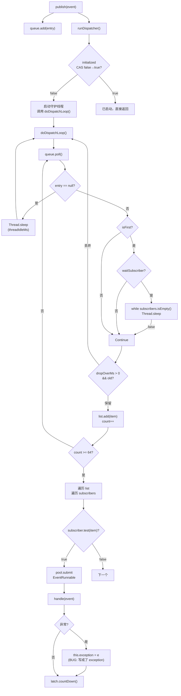
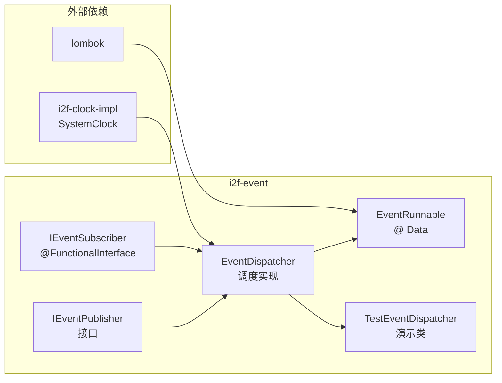

# i2f-event 事件发布订阅调度器

> 轻量级异步事件发布/订阅调度框架——以 `IEventPublisher`/`IEventSubscriber` 双接口定义契约，`EventDispatcher` 以**单守护线程轮询 + 工作窃取线程池**实现异步批处理分发，支持事件超时丢弃、等待订阅者就绪、自定义线程配置等特性；测试演示类展示多线程并发发布场景。

---

## 模块定位

| 维度 | 说明 |
|---|---|
| **功能** | 异步事件发布-订阅调度：单线程轮询队列、攒批 64 条后多线程并行分发 |
| **层级** | i2f-jdk 基础工具层（`event` 事件驱动） |
| **设计** | 接口分离 + 守护线程调度 + 无界队列 + 工作窃取池异步消费 |
| **规模** | 4 源文件、约 292 行（2 接口 + 1 实现 + 1 测试演示） |
| **入口** | `EventDispatcher.publish(event)` / `EventDispatcher.subscribe(subscriber)` |

典型场景：应用中需要解耦的异步通知（如订单创建后发邮件、更新缓存、记录审计日志），无需引入消息中间件即可在进程内完成发布-订阅。

---

## 依赖关系

| 依赖 | 类型 | 使用情况 | 说明 |
|---|---|---|---|
| `lombok` | 编译期注解处理 | **真实使用** | `EventRunnable` 类标注 `@Data` 生成 getter/setter |
| `i2f-clock-impl` | 编译+运行期 | **真实使用** | `SystemClock.currentTimeMillis()` 获取高性能缓存时间戳标记事件入队时间 |
| `maven-assembly-plugin` | 构建插件 | fat-jar 打包 | 产物为可独立执行的 jar-with-dependencies（含 i2f-clock-impl） |

---

## 架构

### 类结构

| 类 | 行数 | 职责 |
|---|---|---|
| `IEventPublisher<T>` | 13 | 发布者接口：`publish(T)` 入队、`subscribe(IEventSubscriber)` 注册订阅者 |
| `IEventSubscriber<T>` | 15 | 函数式订阅者接口：`default boolean test(T)` 过滤（默认 true）、`void handle(T)` 处理 |
| `EventDispatcher<T>` | 206 | 核心调度器：守护线程轮询队列、攒批 64 后遍历 subscribers 提交线程池 |
| `TestEventDispatcher` | 58 | 演示类：10 个发布者线程 ×10 事件 + 2 个动态订阅者 |

### 架构图

```mermaid
flowchart TD
    Publisher["发布者\npublish(event)"] -->|入队| Queue["LinkedBlockingQueue\n无界事件队列\nEntry(event, timestamp)"]
    Queue -->|poll 轮询| Dispatcher["EventDispatcher\n守护调度线程\ndoDispatchLoop()"]
    
    Dispatcher -->|攒满 64 条| Batch["攒批处理\nlist.add(item)"]
    Batch -->|遍历 subscribers| Filter["subscriber.test(item)?"]
    Filter -->|true| Submit["pool.submit\nEventRunnable"]
    Filter -->|false| Skip["跳过"]
    Submit -->|异步执行| Handle["subscriber.handle(event)"]
    
    Dispatcher -->|dropOverMillSeconds > 0| Drop{["timestamp 超时?"]}
    Drop -->|是| Discard["continue 丢弃"]
    Drop -->|否| Batch
    
    subgraph Config["可配置项"]
        T1["threadIdleMillSeconds\n空闲睡眠(默认 300ms)"]
        T2["waitSubscriber\n首事件等待订阅者"]
        T3["dropOverMillSeconds\n事件超时丢弃阈值"]
        T4["dispatcherThreadConsumer\n线程自定义回调"]
        T5["pool\nExecutorService\n默认 work-stealing"]
    end
    
    Dispatcher -.-> Config
```

### 控制流

| 步骤 | 组件 | 说明 |
|---|---|---|
| 1 | `publish(event)` | 包装为 `SimpleEntry(event, now)` 入队 `LinkedBlockingQueue` |
| 2 | `runDispatcher()` | `AtomicBoolean` 确保仅启动**一个**守护调度线程 |
| 3 | `doDispatchLoop()` | `while(true)` 永续轮询：`queue.poll()` 非阻塞取事件 |
| 4 | 超时检测 | 若 `dropOverMillSeconds > 0` 且驻留超时，`continue` 丢弃 |
| 5 | 攒批 64 | 连续 poll 最多攒满 64 事件后退出内层循环 |
| 6 | 订阅者分发 | 遍历 subscribers，`test(item)` 通过则 `pool.submit(EventRunnable)` |
| 7 | 空闲睡眠 | 若队列为空，`Thread.sleep(threadIdleMillSeconds)` |
| 8 | `EventRunnable.run` | 调用 `subscriber.handle(event)`，捕获异常存入 `exception` 字段 |

---

## 核心类详解

### IEventPublisher\<T\> — 发布者接口

```java
public interface IEventPublisher<T> {
    void publish(T event);
    void subscribe(IEventSubscriber<T> subscriber);
}
```

极简双方法契约，`publish` 将事件入队，`subscribe` 注册订阅者。

### IEventSubscriber\<T\> — 订阅者函数式接口

```java
@FunctionalInterface
public interface IEventSubscriber<T> {
    default boolean test(T event) {
        return true;
    }
    void handle(T event);
}
```

`test` 为过滤条件（默认全部放行），`handle` 为实际处理逻辑。单一抽象方法 `handle`，因此可作为 lambda。

### EventDispatcher\<T\> — 核心调度器



#### 核心字段

| 字段 | 类型 | 默认值 | 说明 |
|---|---|---|---|
| `queue` | `LinkedBlockingQueue` | 无界 | 事件队列，元素为 `(event, timestamp)` |
| `subscribers` | `CopyOnWriteArrayList` | 空 | 线程安全订阅者列表 |
| `pool` | `ExecutorService` | `newWorkStealingPool(CPU*2)` | 异步执行线程池 |
| `threadIdleMillSeconds` | `AtomicLong` | 300 | 空闲时调度线程睡眠时间(ms) |
| `waitSubscriber` | `AtomicBoolean` | false | 首事件是否等待至少一个订阅者 |
| `dropOverMillSeconds` | `AtomicLong` | 0 (不丢弃) | 事件超时丢弃阈值(ms) |
| `dispatcherThreadConsumer` | `BiConsumer` | null | 调度线程自定义配置回调 |

#### 调度循环细节

```java
// 核心调度循环（简化）
protected void doDispatchLoop() {
    List<T> list = new ArrayList<>(64);
    int count = 0;
    boolean isFirst = true;
    while (true) {
        // 内层：批量 poll 攒批
        while (true) {
            Map.Entry<T, Long> entry = queue.poll();
            if (entry == null) break;  // 队列空，退出 poll 循环
            
            if (isFirst && waitSubscriber.get()) {
                while (subscribers.isEmpty()) Thread.sleep(threadIdleMs);  // 等待订阅者
                isFirst = false;
            }
            
            // 超时丢弃
            if (dropOverMs > 0 && now - entry.timestamp > dropOverMs) continue;
            
            list.add(item);
            if (++count >= 64) break;
        }
        
        // 分发攒批
        for (T item : list) {
            for (IEventSubscriber<T> sub : subscribers) {
                if (sub.test(item)) pool.submit(new EventRunnable(sub, item));
            }
        }
        list.clear();
        count = 0;
        
        // 队列空则休眠
        Thread.sleep(threadIdleMs);
    }
}
```

#### 示例：多线程发布 + 动态订阅

```java
EventDispatcher<Object> dispatcher = new EventDispatcher<>();
dispatcher.setWaitSubscriber(true);
dispatcher.setDispatcherThreadConsumer((thread, d) -> {
    thread.setDaemon(false);  // 非守护线程，阻止 JVM 退出
    thread.setPriority(10);
});

// 动态注册订阅者
new Thread(() -> {
    for (int i = 0; i < 2; i++) {
        String handlerName = "handler-" + i + "-";
        dispatcher.subscribe(event -> 
            System.out.println(Thread.currentThread().getName() + ": " + handlerName + event));
    }
}).start();

// 多线程发布事件
for (int i = 0; i < 10; i++) {
    new Thread(() -> {
        for (int j = 0; j < 10; j++) {
            dispatcher.publish("event-" + j);
        }
    }).start();
}
```

#### 内部类 EventRunnable

```java
@Data
public static class EventRunnable<T> implements Runnable {
    IEventSubscriber<T> subscriber;
    T event;
    Throwable exception;    // BUG: run() 中赋值 this.exception = exception 而非 e
    CountDownLatch latch;   // 可选同步等待
}
```

---

## 依赖与消费关系

### 模块内依赖图



### POM 引用

| 位置 | 角色 |
|---|---|
| `i2f-jdk/pom.xml` | modules 声明 `i2f-event` |
| `i2f-jdk-all/pom.xml` | 聚合依赖包含 `i2f-event` |
| 根 `pom.xml` | dependencyManagement 版本托管 `${i2f.version}` |

### 消费者

| 模块 | 引用方式 | 说明 |
|---|---|---|
| **全仓源码级** | 无外部 `import i2f.event.*` | 仅模块内 test 自引用 |

**零外部源码级消费者**——`i2f-event` 当前处于"备而待用"状态，暂无其他模块直接使用其 API（可能通过 `i2f-jdk-all` 聚合后间接暴露给终端应用）。

---

## 与相邻模块对比

| 模块 | 定位 | 对比 |
|---|---|---|
| `i2f-event` | 单 JVM 进程内异步事件调度 | 无中间件依赖，发布-订阅解耦 |
| `i2f-lifecycle` | 实例生命周期管理 | 侧重有状态的对象初始化/销毁回调，非事件驱动 |
| `i2f-observer` (如存在) | 观察者模式 | 通常同步调用，EventDispatcher 默认异步 |
| 消息队列中间件 | 跨进程事件分发 | 重量级，需独立部署；i2f-event 轻量零配置 |

---

## 已知缺陷与设计约束

1. **[Bug] L198 变量名错误**：`EventRunnable.run()` 中 `this.exception = exception` 写为了 `this.exception = exception`（应为 `this.exception = e`），导致 catch 到的异常未存储、`exception` 字段恒为 null。此字段本应供调用方通过 CountDownLatch 同步等待后检查异常，现完全失效。

2. **[终止协议] 调度线程无法优雅退出**：`doDispatchLoop()` 使用 `while(true)` 永续循环，没有退出条件。仅在循环外部的 `try-catch(Exception)` 捕获到未预期异常时才会终止。线程终止后 `initialized` 仍为 `true`，后续 `publish` 不会再启动新调度线程，导致事件**永久积压**。

3. **[异常吞噬] 中断信号丢失**：`Thread.sleep()` 处的 `catch(Exception e) {}` 空吞吞掉 `InterruptedException`，线程无法响应中断。

4. **[异常吞噬] doDispatchLoop 外部 catch 粗糙**：所有未捕获异常仅打印 `System.err` 后线程静默退出，无日志框架、无告警、无自动恢复。

5. **[异常吞噬] EventRunnable 异常吞噬**：`subscriber.handle(event)` 抛出的异常被 `catch(Exception e)` 捕获后仅赋值给（有 bug 的）`exception` 字段，调用方若未通过 CountDownLatch 检查则完全感知不到。

6. **[OOM 风险] 无界队列**：`LinkedBlockingQueue` 无容量上限。若发布速率持续超过消费速率，队列将无限增长直至 OOM。

7. **[单点故障] 单调度线程**：`initialized` CAS 保证只启动一个调度线程。该线程一旦异常退出，**无备用线程**、`publish` 仍可入队但永不被消费。

8. **[忙等待] waitSubscriber 热轮询**：`while(subscribers.isEmpty()) { Thread.sleep(...) }` 为轮询模式。虽带睡眠间隔，但中断信号被空 catch 吞噬。

9. **[功能缺失] 无 unsubscribe 方法**：订阅者注册后**无法注销**，`CopyOnWriteArrayList` 也未暴露 remove 方法，无法实现一次性监听或动态取消订阅。

10. **[功能缺失] 无关闭/清理方法**：无可用的 `shutdown()`/`close()` 释放线程池和调度线程资源，依赖 JVM 退出时守护线程自动终止。

11. **[不可控性] pool 线程泄漏**：默认 `Executors.newWorkStealingPool()` 创建的 ForkJoinPool 不会被显式 shutdown。

---

## 总结

`i2f-event` 是一个轻量级**进程内异步事件调度模块**，以 `IEventPublisher`/`IEventSubscriber` 双接口定义发布-订阅契约，`EventDispatcher` 以**单守护线程轮询无界队列 + 攒批 64 + 工作窃取线程池**实现异步批处理分发，支持事件超时丢弃、等待订阅者就绪、自定义线程配置等特性。模块依赖 `i2f-clock-impl` 使用高性能缓存时钟打时间戳，`lombok` 用于 `EventRunnable` 的 getter/setter 生成。

核心缺陷包括 `EventRunnable.exception` 赋值变量名错误（L198）、调度线程无法优雅退出与异常退出后不可恢复的单点故障、中断信号空 catch 吞噬、无界队列 OOM 风险、无 unsubscribe/shutdown 方法等功能缺失。当前全仓无外部源码级消费者，处于"备而待用"的基础设施状态。