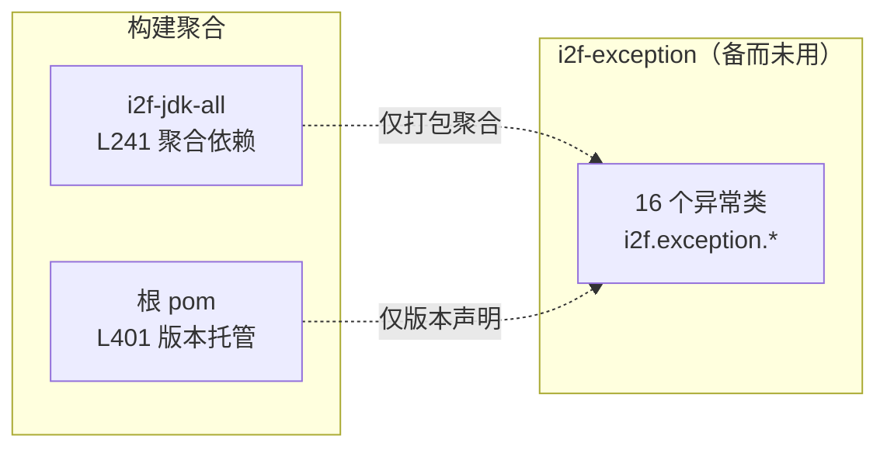

# i2f-exception 标准异常扩充包

> 开箱即用的语义化运行时异常集合——16 个 `RuntimeException` 子类覆盖长度/报文/大小/类型/并发/数据访问/断连/内部/缺失参数/原生调用/未找到/反射/远程/服务/未处理/不支持共 16 类常用错误场景，其中 15 个统一采用「无参 + message + message/cause + cause + 全参（enableSuppression/writableStackTrace）」五构造器模板，`UnHandledException` 额外持 `reason` 字段并提供 `getReason()`，为业务代码提供免自定义即用的异常类型。

---

## 模块定位

| 维度 | 说明 |
|---|---|
| **功能** | 语义化运行时异常类型库：按错误场景命名的 `RuntimeException` 子类集合 |
| **层级** | i2f-jdk 基础工具层（`i2f.exception` 单包，按抛出场景分类） |
| **设计** | 扁平结构（全部直接继承 `RuntimeException`）+ 统一五构造器模板（unchecked、免捕获） |
| **规模** | 16 源文件、约 435 行（15 个标准模板类 × 27 行 + `UnHandledException` 30 行） |
| **入口** | `i2f.exception.*`（直接 `throw new XxxException(...)`） |

典型场景：业务/框架代码在参数校验、类型判断、远程调用、数据访问等场景直接抛出语义化异常，替代 JDK 通用异常（如用 `MissingArgumentException` 替代裸 `IllegalArgumentException`），使调用方无需查阅文档即可从类名判断错误性质。

---

## 依赖关系

### POM 依赖

`pom.xml` **未声明任何依赖**：无 lombok、无 i2f 内部模块、无三方库。源码仅使用 JDK 原生 `RuntimeException`，运行时零负担，可被任何模块安全引入。

### 构建插件

POM `build` 中声明 `maven-assembly-plugin`（无自定义配置），继承根 POM `pluginManagement` 配置：产出 `i2f-exception-1.0-jdk8-jar-with-dependencies.jar` fat-jar（`appendAssemblyId=false`、execution `make-assembly` 绑定 `package` 阶段）。

### 仓库级引用

| 位置 | 说明 |
|---|---|
| `i2f-jdk/pom.xml` L73 | modules 列表注册（i2f-event 之后、i2f-features 之前） |
| `i2f-jdk/i2f-jdk-all/pom.xml` L241 | 全量聚合依赖（i2f-event 与 i2f-features 之间） |
| 根 `pom.xml` L401 | `dependencyManagement` 版本托管 `${i2f.version}` |

---

## 架构

### 类结构

| 类名 | 语义 | 典型抛出场景 |
|---|---|---|
| `BadLengthException` | 长度非法 | 数据长度不符合要求（如报文长度校验失败） |
| `BadPacketException` | 报文非法 | 数据包格式/内容损坏（如协议解析失败） |
| `BadSizeException` | 大小非法 | 集合/缓冲区/文件大小不符合要求 |
| `BadTypeException` | 类型非法 | 类型不匹配/不支持的类型转换 |
| `ConcurrentException` | 并发冲突 | 并发修改、竞争条件检出 |
| `DataAccessException` | 数据访问失败 | 数据库/持久层操作异常 |
| `DisconnectException` | 连接断开 | 网络/会话/通道断连 |
| `InternalException` | 内部错误 | 框架内部不可恢复错误（判定为 Bug 场景） |
| `MissingArgumentException` | 缺少参数 | 必填参数缺失（如反射调用入参不足） |
| `NativeException` | 原生调用失败 | JNI/FFI/本地方法调用异常 |
| `NotFoundException` | 未找到 | 查找目标不存在（资源/实体/路由） |
| `ReflectException` | 反射失败 | 反射调用受检异常的统一包装 |
| `RemoteException` | 远程调用失败 | RPC/HTTP 远程接口调用异常 |
| `ServiceException` | 服务异常 | 业务服务层通用异常（带业务语义的消息） |
| `UnHandledException` | 未处理异常 | 捕获任意异常后包装再抛出（避免 throws 声明扩散） |
| `UnSupportException` | 不支持 | 操作/特性/格式不被支持 |

### 架构图

```mermaid
graph TD
    RE["java.lang.RuntimeException"]
    RE --> BL["BadLengthException"]
    RE --> BP["BadPacketException"]
    RE --> BS["BadSizeException"]
    RE --> BT["BadTypeException"]
    RE --> CC["ConcurrentException"]
    RE --> DA["DataAccessException"]
    RE --> DC["DisconnectException"]
    RE --> IN["InternalException"]
    RE --> MA["MissingArgumentException"]
    RE --> NA["NativeException"]
    RE --> NF["NotFoundException"]
    RE --> RF["ReflectException"]
    RE --> RM["RemoteException"]
    RE --> SE["ServiceException"]
    RE --> UH["UnHandledException<br/>+ reason : Throwable<br/>+ getReason()"]
    RE --> US["UnSupportException"]
```



全部 16 个类均为**扁平一层继承**：无公共基类、无抽象层、无接口，直接落在 `RuntimeException` 之下，彼此无继承与引用关系。

### 构造器模板

15 个标准类逐一提供以下 5 个构造器（全部 `public`），与 JDK `RuntimeException` 构造器一一镜像：

| 构造器 | 语义 |
|---|---|
| `Xxx()` | 无参，无消息无原因 |
| `Xxx(String message)` | 仅错误消息 |
| `Xxx(String message, Throwable cause)` | 消息 + 原因 |
| `Xxx(Throwable cause)` | 仅原因（消息为 `cause.toString()`） |
| `Xxx(String message, Throwable cause, boolean enableSuppression, boolean writableStackTrace)` | 全参：消息 + 原因 + 抑制开关 + 堆栈可写开关 |

标准类样例（`BadLengthException`，其余 14 个同构）：

```java
public class BadLengthException extends RuntimeException {
    public BadLengthException() {
    }

    public BadLengthException(String message) {
        super(message);
    }

    public BadLengthException(String message, Throwable cause) {
        super(message, cause);
    }

    public BadLengthException(Throwable cause) {
        super(cause);
    }

    public BadLengthException(String message, Throwable cause, boolean enableSuppression, boolean writableStackTrace) {
        super(message, cause, enableSuppression, writableStackTrace);
    }
}
```

### UnHandledException 特殊形态

16 个类中唯一偏离模板的类，仅 3 个构造器 + 1 个字段：

```java
public class UnHandledException extends RuntimeException {
    private Throwable reason;

    public UnHandledException(Throwable reason) {
        super(reason);
        this.reason = reason;
    }

    public UnHandledException(String message, Throwable cause) {
        super(message, cause);
        this.reason = cause;
    }

    public UnHandledException(String message, Throwable cause, boolean enableSuppression, boolean writableStackTrace) {
        super(message, cause, enableSuppression, writableStackTrace);
        this.reason = cause;
    }

    public Throwable getReason() {
        return reason;
    }
}
```

设计意图：作为 catch-all 场景的包装异常（将受检异常转为非受检抛出），`reason` 与 `getReason()` 为 `getCause()` 提供语义化别名。

---

## 使用示例

```java
import i2f.exception.MissingArgumentException;
import i2f.exception.UnHandledException;
import i2f.exception.ServiceException;

// 1. 参数校验：语义化替代 IllegalArgumentException
if (StringUtils.isEmpty(username)) {
    throw new MissingArgumentException("username 不能为空");
}

// 2. 反射调用：包装受检异常，避免 throws 扩散
try {
    Method method = clazz.getDeclaredMethod(name);
    return method.invoke(target);
} catch (Exception e) {
    throw new ReflectException("反射调用失败: " + name, e);
}

// 3. 业务服务层
if (order.getStatus() != OrderStatus.PAID) {
    throw new ServiceException("订单未支付，无法发货");
}
```

---

## 消费关系

### 全仓消费者现状



| 检查项 | 结果 |
|---|---|
| 源码 `import i2f.exception.*` | **0 处**（全仓无任何类被 import） |
| 类名直接引用（如 `NotFoundException`） | 0 处有效引用（仅模块自身类声明） |
| POM 引用 | 4 处：自身 + i2f-jdk modules + i2f-jdk-all 聚合 + 根 pom 版本托管 |
| `UnHandledException` 独立复查 | 4 处匹配全部位于模块自身 |

结论：该模块处于**「备而未用」状态**——已注册进构建体系（可被 `i2f-jdk-all` 打包、有版本托管），但全仓无任何源码级消费者。推测定位为供下游业务工程（如 idea-plugin 代码生成产物、外部接入方）直接引用的异常词汇表。

---

## 与相邻模块对比

| 模块/体系 | 差异 |
|---|---|
| `i2f-resp` | 提供 `ApiResp`/`ApiCode` 响应包装与响应码（正常返回链路），本模块提供异常类型（异常抛出链路），两者互补 |
| `i2f-functional` 的 except 接口 | except 接口方法签名声明 `throws Throwable` 直接透传原异常，本模块是"转换为语义化 unchecked 异常"的词汇表 |
| JDK `java.lang` 标准异常 | `UnSupportException` vs `UnsupportedOperationException`、`ConcurrentException` vs `ConcurrentModificationException` 语义重叠，本模块版本均为 unchecked 且命名更短（但存在拼写与重名问题，见缺陷） |
| JDK `java.rmi.RemoteException` | **完全同名**：JDK 版是 checked 异常（必须捕获），本模块版是 unchecked（无需捕获），同名异义极易混淆 |
| Spring `org.springframework.dao.DataAccessException` | 同名异体系：Spring 版是 checked 家族根（含丰富子类层次），本模块版是单一 unchecked 类 |
| `i2f-check` / `i2f-form` | 校验框架通常抛出自身定义的校验结果异常，与本模块无耦合 |

---

## 已知缺陷与设计约束

1. **零消费者（备而未用）**：全仓 0 处 `import i2f.exception.*`，模块实际价值依赖外部下游启用；`i2f-jdk-all` 仅打包聚合。
2. **`RemoteException` 与 `java.rmi.RemoteException` 重名冲突**：同名类位于不同包且**受检性相反**（JDK checked vs 本模块 unchecked），同文件同时使用时必须全限定名，迁移/重构时极易误引入错误的那个。
3. **`UnSupportException` 拼写不规范**：标准英语为 `Unsupported`（对照 JDK `UnsupportedOperationException`），`UnSupport` 为生造词，对外 API 一旦发布难以更名。
4. **`UnHandledException.reason` 字段冗余**：`super(reason)`/`super(message, cause)` 已将同一对象写入 `Throwable.cause`，`getReason()` 与 `getCause()` 恒等（同一引用），字段本身无额外信息；且 `reason` 未参与序列化协议的自定义（依赖 `Throwable` 序列化机制时字段可被绕过重建）。
5. **`UnHandledException` 构造器集不完整**：缺无参、单 message、单 cause、全参之外的 5 构造器对称性（仅有 3 个），与模块内 15 个标准类不一致；也缺少 `message` 单参形态。
6. **无 `serialVersionUID` 声明**：16 个类全部未显式声明序列化版本号，跨版本反序列化兼容性依赖 JVM 自动计算（编译环境微小差异即导致 `InvalidClassException`），IDE/静态分析普遍告警。
7. **`ConcurrentException` 与 JDK 语义重叠**：`java.util.ConcurrentModificationException`（迭代器快速失败）已覆盖常见并发修改场景，本类未声明更细的语义边界（如乐观锁冲突？CAS 失败？），造成选型困惑。
8. **`BadLengthException` / `BadSizeException` / `BadPacketException` 边界模糊**：length（长度）与 size（大小）在日常语义中高度近义，无文档约束何时用哪个；`BadPacket` 与两者也可能交叉（报文长度错该抛哪个）。
9. **全部为 `RuntimeException`，无 checked 变体**：强制要求调用方处理（如远端连接断开必须重试）的场景无法通过类型系统约束；反之所有异常都可静默穿越业务边界。
10. **无错误码/上下文载体**：不同于带 `code` 的业务异常体系，全部 16 类仅承载 message + cause，无结构化错误码、无国际化 message key、无上下文数据槽位（如失败 ID、重试建议）。
11. **无公共基类/标记接口**：16 个类彼此独立，调用方无法用单个 `catch (I2fException e)` 或接口判断"这是 i2f 体系异常"，也无法统一挂接错误码/日志策略；未来若要统一扩展需破坏性改造。
12. **maven-assembly-plugin 冗余**：产出 fat-jar 对"零依赖的异常类库"无实际意义（fat-jar 与普通 jar 内容一致），继承自模板却无自定义配置。

---

## 总结

`i2f-exception` 是一个**扁平化、模板化的语义异常词汇表**：

- **极简结构**：16 个 `RuntimeException` 子类、零依赖、零继承层次、约 435 行，全部为可直接 `throw` 的 unchecked 异常；
- **统一模板**：15 个标准类镜像 JDK `RuntimeException` 的 5 构造器契约，IDE 自动生成可复现；`UnHandledException` 以 `reason` 字段偏离模板（冗余别名，见缺陷 #4）；
- **备而未用**：全仓无源码级消费者，价值场景为下游业务工程直接引用、替代裸用 JDK 通用异常；
- **主要风险**：`RemoteException` 同名冲突（受检性相反）、`UnSupportException` 拼写、无 `serialVersionUID`、无统一基类/错误码，若演进为正式对外异常体系需先修复上述 API 级缺陷。
