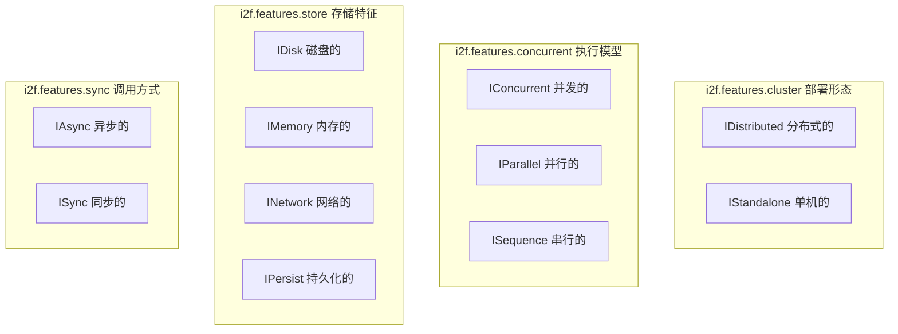
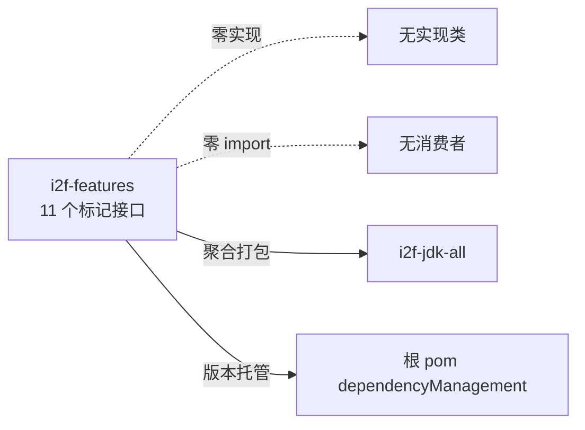

# i2f-features 能力标记接口集

> 11 个空标记接口（marker interface）将系统能力维度抽象为编译期类型标签——`cluster`（分布式/单机）、`concurrent`（并发/并行/串行）、`store`（磁盘/内存/网络/持久化）、`sync`（异步/同步）四组正交维度，供实现类通过 `implements` 声明自身能力特征，类似 `java.io.Serializable`/`Cloneable` 的标签式设计；当前全仓处于「备而未用」状态——零实现类、零 `import` 引用。

---

## 模块定位

| 维度 | 说明 |
|---|---|
| **功能** | 能力标记接口集：以纯空接口标记「分布式/单机、并发/并行/串行、磁盘/内存/网络/持久化、异步/同步」等系统能力维度 |
| **层级** | i2f-jdk 基础工具层（纯契约，无任何实现与工具方法） |
| **设计** | 标记接口模式（空接口 + `@desc` 语义注释）+ 按能力维度四分包 |
| **规模** | 11 源文件、约 110 行（全部为 10 行空接口） |
| **入口** | `i2f.features.cluster.*` / `i2f.features.concurrent.*` / `i2f.features.store.*` / `i2f.features.sync.*` |

典型场景（设计意图）：实现类通过 `implements IAsync`、`implements IPersist` 等标签声明能力特征，上层代码以 `instanceof` 做能力嗅探，或作为架构文档/代码生成的分类依据。

---

## 依赖关系

| 依赖项 | 说明 |
|---|---|
| i2f 内部模块 | **无** |
| 三方库 | **无**（无 lombok、无任何运行期依赖） |
| 父 POM | `i2f-jdk` v1.0-jdk8 |
| build 插件 | `maven-assembly-plugin`（无自定义配置，继承根 POM `jar-with-dependencies`，对零依赖库无实际意义） |

POM 全文仅 26 行：parent + artifactId + assembly 插件，**零 `<dependencies>` 声明**。

---

## 架构

### 子包与接口清单

| 包 | 接口 | `@desc` 语义 | 能力维度 |
|---|---|---|---|
| `i2f.features.cluster` | `IDistributed` | 分布式的 | 部署形态 |
| `i2f.features.cluster` | `IStandalone` | 单机的 | 部署形态 |
| `i2f.features.concurrent` | `IConcurrent` | 并发的 | 执行模型 |
| `i2f.features.concurrent` | `IParallel` | 并行的 | 执行模型 |
| `i2f.features.concurrent` | `ISequence` | 串行的 | 执行模型 |
| `i2f.features.store` | `IDisk` | 磁盘的 | 存储位置 |
| `i2f.features.store` | `IMemory` | 内存的 | 存储位置 |
| `i2f.features.store` | `INetwork` | 网络的 | 存储位置 |
| `i2f.features.store` | `IPersist` | 持久化的 | 存储特性 |
| `i2f.features.sync` | `IAsync` | 异步的 | 调用方式 |
| `i2f.features.sync` | `ISync` | 同步的 | 调用方式 |

全部 11 个接口结构完全一致（逐字节同构，仅类名与 `@desc` 不同）：

```java
package i2f.features.xxx;

/**
 * @author Ice2Faith
 * @date 2024/6/27 8:56
 * @desc 中文语义描述
 */
public interface IXxx {
}
```

### 维度分组关系



### 标记接口模式（Marker Interface Pattern）

与 `java.io.Serializable`、`java.lang.Cloneable`、`java.util.RandomAccess` 同属**标记接口**（也称标签接口、能力接口）模式：

| 特征 | 说明 |
|---|---|
| **零成员** | 无抽象方法、无常量、无 default 方法，纯类型标签 |
| **编译期能力声明** | `implements` 即声明能力，无需实现任何逻辑 |
| **运行期嗅探** | 上层代码通过 `instanceof` 判定对象能力（如 `RandomAccess` 判定 List 是否支持快速随机访问） |
| **正交组合** | 一个实现类可同时 `implements IAsync, IPersist, IMemory` 声明多维能力 |

Java 8 下标记接口的替代方案是**标记注解**（如 `@Distributed`），二者权衡见「与相邻模块对比」章节。

---

## 消费关系

### 全仓零消费者

经三重 grep 验证：

| 检查项 | 结果 |
|---|---|
| `import i2f.features.` | **0 处** |
| `implements ...(IDistributed\|IStandalone\|IConcurrent\|IParallel\|ISequence\|IDisk\|IMemory\|INetwork\|IPersist\|IAsync\|ISync)` | **0 处** |
| 全文 `i2f.features` | 仅 **11 处**，全部为模块自身 `package` 声明 |



### 构建体系注册

| 位置 | 说明 |
|---|---|
| `i2f-jdk/pom.xml` L74 | `<module>i2f-features</module>` 注册进 jdk 聚合 |
| `i2f-jdk-all/pom.xml` L245 | 加入全仓 fat-jar 聚合依赖 |
| 根 `pom.xml` L406 | dependencyManagement 版本托管 |

---

## 与相邻模块对比

| 对比项 | i2f-features | i2f-enums | i2f-cache-std |
|---|---|---|---|
| **形态** | 空标记接口 | 方法接口 + 枚举 | 方法接口 |
| **依赖** | 零依赖 | 零依赖 | 零依赖 |
| **消费者** | **零** | 3 个外部实现 | 多模块真实实现 |
| **用途** | 能力标签（设计意图） | 字典条目契约 | 缓存能力契约 |
| **命名相似物** | `IDistributed`/`IPersist`/`IMemory` | `IDict` | `IDistributedCache`/`IPersistCache` |

**命名易混淆点**：本模块的 `IDistributed`、`IPersist` 与 `i2f-cache-std` 中**带方法**的 `IDistributedCache`、`IPersistCache` 名称高度近似，但前者是空标记、后者是 `ICache<K,V>` 的语义扩展接口，检索时易误认。

**与标记注解的权衡**（本模块选择了标记接口）：

| 维度 | 标记接口（本模块） | 标记注解（替代方案） |
|---|---|---|
| 编译期强制 | `implements` 参与类型系统 | 注解可运行时保留，也可仅 SOURCE |
| 元数据携带 | 不能携带参数 | 可带属性（如 `@Distributed(cluster="xxx")`） |
| 反射开销 | `instanceof` O(1) | 注解查找需缓存 |
| 侵入性 | 修改类型声明 | 不改变类型层次 |

---

## 已知缺陷与设计约束

1. **全仓「备而未用」**：11 个接口零实现、零引用、零文档说明——既无消费方也无使用示例，纯占位状态（自 2024/6/27 创建以来未见推进）
2. **标记接口无法携带元数据**：与标记注解相比，空接口不能表达「分布式」的集群配置、「异步」的执行器引用等参数化信息，能力表达力止步于布尔标签
3. **编译期无任何约束**：`implements IAsync` 不强制实现任何方法——一个完全同步的实现类也可以打上 `IAsync` 标签，语义全靠开发者自觉，误标无任何机制拦截
4. **命名与其他模块方法接口近似**：`IDistributed` vs `IDistributedCache`、`IPersist` vs `IPersistCache`、`IMemory` 与各式内存缓存实现——跨模块检索时极易混淆（IDE 自动导入尤其容易选错）
5. **语义维度不齐**：`store` 包中 `IDisk`/`IMemory`/`INetwork` 是**存储位置**、`IPersist` 是**存储特性**（持久性），不同维度混于同一包；`IConcurrent`/`IParallel`/`ISequence` 中并发是能力、并行/串行是执行策略，也非严格互斥（并行必并发，串行也可能并发调度）
6. **接口命名惯例偏差**：以 `I` 前缀 + 形容词（`IDistributed`、`IParallel`、`ISequence`）命名，Java 惯例中表达能力常用 `-able`/`-ible` 后缀（`Distributable`、`Persistable`），或能力名词（`Concurrency`）；形容词式命名读起来像「是一个分布式的（对象）」，歧义较大
7. **无包级说明**：四个包均无 `package-info.java`，无模块级 javadoc 解释这些接口的消费方式与设计意图，仅靠 `@desc` 三个字
8. **全部接口缺 `@FunctionalInterface` 等元注释与 `@since` 版本标记**：虽为空接口不适用 `@FunctionalInterface`，但无任何版本信息可供演进管理
9. **assembly 插件声明冗余**：零依赖模块打包 fat-jar 与普通 jar 无差异（与 i2f-exception、i2f-detegate 同模式）
10. **无配套 SPI/工具支持**：标记接口的常见配套（如按标签做实例分发、能力扫描注册）一概缺失——即便有实现类打标，也无处消费这些标签

---

## 总结

`i2f-features` 是一个**纯占位的设计意图模块**：11 个空标记接口以四个正交维度（部署形态/执行模型/存储特征/调用方式）为系统能力建模，构造了「以类型标签表达能力」的骨架。其价值取决于未来是否有实现类打标与上层 `instanceof` 嗅探逻辑接入——当前三项验证（import、implements、全文检索）均表明该骨架**尚未被任何代码使用**。对于需要能力标记的新代码，Java 注解（可携带元数据、无侵入、不占用继承位）通常是比标记接口更优的现代选择；若保留现状，则建议至少补充 `package-info.java` 说明设计意图与预期用法。
