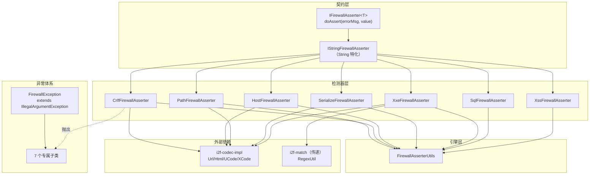
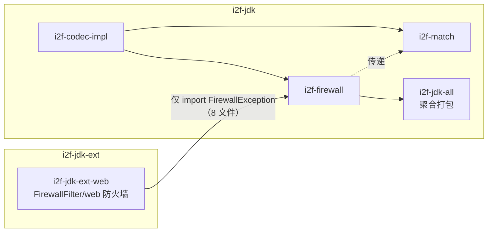

# i2f-firewall 注入攻击防护防火墙

> 断言式安全防护工具集——以 `IFirewallAsserter<T>.doAssert(errorMsg, value)` 统一契约（失败抛异常、通过静默返回），为 CRLF 头注入、主机头、路径穿越、反序列化类名、SQL 注入、XSS、XXE 共 7 类攻击各配独立检测器与专属异常；检测引擎以「编解码变体地毯式匹配」（URL/HTML/0x/%/\x/\u 多重编码 + 组合幂集）与「黑名单 contains/正则」双路线识别攻击载荷；异常基类 `FirewallException` 被 `i2f-jdk-ext-web` 借作 web 防火墙的异常基座。

---

## 模块定位

| 维度 | 说明 |
|---|---|
| **功能** | 7 类常见注入攻击的载荷检测与阻断：`doAssert` 断言式拦截 |
| **层级** | i2f-jdk 基础工具层（`i2f.firewall` 接口 + `impl` 检测器 + `util` 引擎） |
| **设计** | 双接口契约（泛型 / 字符串特化）+ 类型专属异常 + 单例/静态门面双形态 + `Rules`/`Context` 可定制规则 |
| **规模** | 18 源文件、约 2380 行（2 接口 + 1 基异常 + 7 异常子类 + 7 检测器 + 1 工具类） |
| **入口** | `XxxFirewallAsserter.INSTANCE.doAssert("desc", value)` 或静态 `XxxFirewallAsserter.assertEntry("desc", value)` |

典型场景：Web 层参数/头部/文件名/URL 的注入检测、反序列化报文前置类名审核、XML 解析前置 XXE 拦截——所有检测器均为纯内存字符串分析，不依赖任何运行时上下文。

---

## 依赖关系

| 依赖 | 声明 | 实际使用 | 说明 |
|---|---|---|---|
| `lombok` | 是 | **未使用** | 模块内零 lombok 注解，声明冗余 |
| `i2f-reflect` | 是 | **未使用** | 全模块无 `i2f.reflect` 引用，声明冗余 |
| `i2f-text` | 是 | **未使用** | 全模块无 `i2f.text` 引用，声明冗余 |
| `i2f-codec-impl` | 是 | **真实使用** | 5 个检测器引用 `UrlStringStringCodec`/`HtmlStringStringCodec`/`UCodeStringCodec`/`XCodeStringCodec` |
| `i2f-match` | **否**（隐式传递） | **直接使用** | `XxeFirewallAsserter` 直接 import `i2f.match.regex.RegexUtil`/`RegexMatchItem`，靠 `i2f-codec-impl → i2f-match` 传递链兜底 |

> **特殊情况**：本模块是「声明 4 个依赖、其中 3 个未用 + 1 个真实使用 + 1 个隐式传递使用」的组合。`UCodeStringCodec`/`XCodeStringCodec` 等位于 `i2f-codec-impl` 的 `i2f.codec.str.code` 包中（`i2f-codec-std` 声明的是接口契约）。

---

## 架构

### 类结构

| 分层 | 类型 | 说明 |
|---|---|---|
| **契约** | `IFirewallAsserter<T>` | 泛型断言接口：`void doAssert(String errorMsg, T value)` |
| **契约** | `IStringFirewallAsserter` | 字符串特化：`extends IFirewallAsserter<String>`（空接口） |
| **异常** | `FirewallException` | 基异常 `extends IllegalArgumentException`（unchecked，4 构造器） |
| **异常** | `CrlfFirewallException` 等 7 个 | 每检测器一个专属子类（4 构造器模板，27 行） |
| **检测器** | `CrlfFirewallAsserter` | CRLF 头注入：`\r`/`\n`/`(char)0` + 编解码变体引擎 |
| **检测器** | `HostFirewallAsserter` | 主机头：27 坏字符 + `//`/`\\` 变体 |
| **检测器** | `PathFirewallAsserter` | 路径穿越：坏字符/`../`/`~/` + 后缀/文件名黑名单 + `STRICT` 单例 |
| **检测器** | `SerializeFirewallAsserter` | 反序列化：类名正则 + 危险后缀词正则 + JDK 前缀白名单校验 |
| **检测器** | `SqlFirewallAsserter` | SQL 注入：字符 + 字符串 + 100+ 正则三级黑名单 + `strict` 开关 |
| **检测器** | `XssFirewallAsserter` | XSS：40+ 危险字符串 + 40+ 正则模式 |
| **检测器** | `XxeFirewallAsserter` | XXE：`<!doctype`/`<!entity` 正则 + HTML 解码变体 |
| **引擎** | `FirewallAsserterUtils` | 规则四元合并、DFS 幂集组合、4 编码器常量、组合 wrapper 生成 |



### 检测流程

```
doAssert(errorMsg, value)
  ├─ value 为 null/空 → 静默返回（放行）
  ├─ 预处理：trim → 空格规范化（Sql/Xss）→ lowercase
  ├─ 逐类黑名单扫描：
  │    ├─ 坏字符（BAD_CHARS + 0~31/127 控制字符）
  │    ├─ 坏字符串（BAD_STRS contains）
  │    ├─ 坏正则（BAD_MATCHES find，Sql 100+ 模式）
  │    └─ 结构黑名单（Path：后缀/文件名 equals）
  ├─ 每个测试词经 containsInjectForm：
  │    ├─ ByEncode：对危险词生成 10 种编码变体的组合幂集，逐个 contains
  │    └─ ByDecode：对目标文本生成 6 种解码变体的组合幂集，解码后 contains/正则
  └─ 任一命中 → throw XxxFirewallException(errorMsg + ", contains illegal str [命中片段]")
```

---

## 核心类详解

### 契约接口

```java
public interface IFirewallAsserter<T> {
    void doAssert(String errorMsg, T value);   // 失败抛 FirewallException 体系异常
}
public interface IStringFirewallAsserter extends IFirewallAsserter<String> { }
```

断言语义（Assert style）：通过则静默返回，失败则抛异常中断调用链——无返回值、无布尔结果，调用方靠 try-catch 或让异常上抛（如 Servlet Filter 捕获后统一转 400）。

### 异常体系

`FirewallException extends IllegalArgumentException`——继承原因：参数级校验失败语义 + unchecked 免声明。7 个专属子类（`CrlfFirewallException`/`HostFirewallException`/`PathFirewallException`/`SerializeFirewallException`/`SqlFirewallException`/`XssFirewallException`/`XxeFirewallException`）各自镜像 4 构造器模板（无参 / message / message+cause / cause）。

### CrlfFirewallAsserter（233 行）

CRLF 头注入检测：BAD_CHARS = `{'\r', '\n', (char)0}`、BAD_STRS = `{"\r\n"}`。经编解码变体引擎检测 URL 编码（`%0d%0a`）、双重编码（`%250d`）、`0x0d`、`\x0d`、`\u000d`、HTML 实体（`&#13;`）等全部变体形态。

```java
CrlfFirewallAsserter.INSTANCE.doAssert("header", "%250a;");   // 双重编码换行 → 抛出
```

### HostFirewallAsserter（247 行）

主机头注入检测：27 个坏字符（`|!~#%^*(){}[],?/=+`'\"\\$><;` + `(char)0`）+ BAD_STRS `{"//", "\\"}`。适用于 Host 头、服务端请求伪造（SSRF）目标地址的初步清洗。

### PathFirewallAsserter（354 行）

路径穿越与敏感文件检测，能力最全：坏字符（`|\`\\$><;{}` + `(char)0`）+ BAD_STRS `{"../", "~/"}` + **后缀黑名单 60+**（`.jar/.jsp/.php/.sh/.ssh`...）+ **文件名黑名单 50+**（`passwd`/`shadow`/`id_rsa`/`web.config`...）。含 `STRICT` 单例（追加 `'`/`"`/`./`/`//`/配置文件后缀）与 `Rules`/`Context` 定制体系。

```java
PathFirewallAsserter.INSTANCE.doAssert("upload", request.getFilename());
// 声称支持：../../ 绕过、%2e%2e%2f 编码、敏感文件、后缀拦截
```

> **注意**：该类存在静态初始化缺陷（见缺陷 #1），实际不可用。

### SerializeFirewallAsserter（322 行）

反序列化报文的类名审核：9 个 BAD_MATCHES 模式（全类名正则 `x.y.Z`、`*executor`/`*runner`/`*processor`/`*runtime`/`*connector`/`*connection`/`*listener`/`*parser` 后缀词）。命中全类名模式时进入 `assertClassname`：仅当类名以 JDK 前缀（`java./javax./javafx./com.sun./sun.`...）开头时，加载类并校验是否属于白名单类型（String/StringBuilder/Number/Date/Calendar/Temporal/InputStream/.../Annotation）。

### SqlFirewallAsserter（378 行）

SQL 注入检测，规则量最大：`BAD_CHARS = {'\'', ';', (char)0}` + `STRICT_CHARTS = {'"', '`', '\\'}` + 控制字符扫描 + 40+ BAD_STRS + **100+ BAD_MATCHES 正则**（覆盖 MySQL/Oracle/PostgreSQL/MSSQL/DB2/Firebird/SAP/HSQLDB/Informix/MonetDB/Vertica/Cubrik/DM 等方言的 `user()`/`load_file`/`xp_dirtree`/`dbms_*`/`information_schema.` 等特征）。`strict` 模式追加 `STRICT_STRS`（` and `/` or `/`-- `/`select ` 等）与 `STRICT_MATCHES`。

```java
SqlFirewallAsserter.INSTANCE.doAssert("query", "1' or '1'='1");  // 抛出 SqlFirewallException
```

### XssFirewallAsserter（263 行）

XSS 检测：BAD_STRS 40+（`<script`/`javascript:`/`alert(`/`document.cookie`/`.constructor`...）+ BAD_MATCHES 40+ 正则（覆盖空格混淆变体如 `< script`、`alert (`）。含 `(char)0` 控制字符与 0~31/127 扫描。

### XxeFirewallAsserter（68 行）

XXE 检测（最简）：正则 `"<!(doctype|entity)\\s+"` 对原文与 HTML 解码变体双重匹配；另附 `disableDomXxeConfig()`「试图」关闭 JDK DOM 解析器的实体扩展（实为无效方法，见缺陷 #4）。

```java
XxeFirewallAsserter.INSTANCE.doAssert("xml", "<?xml ...<!DOCTYPE foo [<!ENTITY xxe SYSTEM \"file:///etc/passwd\">]>");
```

### FirewallAsserterUtils（280 行）——检测引擎

| 能力 | 方法 | 说明 |
|---|---|---|
| 数组转列表 | `arr2list(xxx[])` ×9 | 8 种基本类型 + 泛型对象数组 |
| **规则四元合并** | `merge(basic, include, exclude, replace)` | `replace > basic` → `+ include` → `- exclude`，`LinkedHashSet` 保序去重 |
| **DFS 幂集** | `getAllCombinations(size)` | 全部非空子集（size=3 → 7 组） |
| 定长组合 | `getCombinations(size, cnt)` | 从 size 中取 cnt 个 |
| 编码器常量 | `ENCODE_0X_02X`/`ENCODE_PER_02X`/`ENCODE_XCODE_02X`/`ENCODE_UCODE_04X` | `0x%02x`/`%%02x`/`\x%02x`/`\u%04x` 整串逐字符编码 |
| 逐字符变形 | `str2form(str, sep, mapper)` | 编码器实现基础 |
| **组合 wrapper** | `combinationsWrappers(wrappers, useCombine)` | 对 N 个单编码器生成 2^N−1 个链式组合函数 |

### 编解码变体引擎（核心检测算法）

**Encode 路线**（Path/Crlf/Host/Serialize 的 `containsInjectFormByEncode`）——对危险词生成 10 种编码形态：

| # | Wrapper | 示例（`" "`） |
|---|---|---|
| 1 | 原文 | `" "` |
| 2-3 | `UrlStringStringCodec.encode` ×2 | `+` → `%2B`（含双重编码，覆盖 `%25xx`） |
| 4 | `0x%02x` | `0x20` |
| 5 | `%%02x` | `%20` |
| 6 | `\x%02x` | `\x20` |
| 7 | `\u%04x` | `\u0020` |
| 8 | HTML 编码 | `&#32;` |
| 9 | UCode 编码 | `\u0020`（UCodeStringCodec 产物） |
| 10 | XCode 编码 | `\x20`（XCodeStringCodec 产物） |

`useCombine=true`（默认）时经 `combinationsWrappers` 生成 **2^10−1 = 1023 个组合 wrapper**（如「HTML 编码后再 URL 编码」），对每个组合产物做 `targetStr.contains(text)` 匹配——覆盖嵌套编码攻击。

**Decode 路线**（`containsInjectFormByDecode`）——对目标文本做 6 种解码变体（原文 + URL×2 + HTML + UCode + XCode，组合后 63 个），解码后 `contains(testStr)` 或正则 `find()`，捕获目标串被部分编码的情况。

> SQL/XSS 另有各自的简化版 `containsInjectForm`（仅 Encode 变体 + 直接 contains，无 Decode 路线）。

---

## 依赖与消费关系



| 消费方 | 层级 | 使用内容 | 方式 |
|---|---|---|---|
| `i2f-jdk-ext-web` | i2f-jdk-ext | **仅 `FirewallException` 基类** | `FirewallFilter` 捕获后转 400；`FirewallUtils`/`FirewallHttpServletRequestWrapper` 复用异常；5 个自有异常子类（CrLfXss/FileName/FileSuffix/HttpMethod/UrlInject）继承基类 |
| `i2f-jdk-all` | i2f-jdk | fat-jar 聚合 | POM 依赖 |
| 模块内自消费 | — | 检测器/异常/工具互引 | 12 处内部 import |

**关键事实**：7 个检测器（`XxxFirewallAsserter`）、2 个契约接口、工具类**零外部源码级消费者**。web 层的 `FirewallUtils.assertCrLfXssInject` 等是对检测器思路的独立重实现（未直接调用 asserter），说明检测器与 web 层实际需求脱节——web 层需要更细粒度的分类异常（文件名/后缀/HttpMethod/UrlInject 各自成异常），而非通用的字符串断言。

---

## 与相邻模块对比

| 模块 | 定位 | 差异 |
|---|---|---|
| `i2f-jdk-ext-web` | Web 防火墙（Servlet Filter） | 运行时拦截（请求/响应包装 + 过滤器）；本模块是纯函数检测库，无运行时上下文 |
| `i2f-check` | 参数合法性校验 | check 面向业务规则（必填/长度/正则），firewall 面向攻击特征（安全语义） |
| `i2f-verifycode`/`i2f-otpauth` | 验证码/动态口令 | 认证类安全；firewall 是输入净化类安全 |
| `i2f-codec-impl` | 编解码实现 | 本模块的编解码变体引擎的下游依赖 |

---

## 已知缺陷与设计约束

1. **【严重】`PathFirewallAsserter.STRICT` 导致整类不可用**：`STRICT = new PathFirewallAsserter().strictRules()` 为静态字段，`strictRules()` 创建的 `Rules` 仅填充 4 个 `include*` 字段，`applyRules` 中对 `excludeBadStrs`/`replaceBadStrs`（均为 null）执行 `Arrays.asList(null)` → JDK 抛 NPE → 类初始化 `ExceptionInInitializerError`。**任何对 PathFirewallAsserter 的首次使用（含 `INSTANCE`、`main`）都会触发类初始化失败**，路径防护实际完全不可用。
2. **Rules 隐性契约陷阱**：Crlf/Host/Serialize/Path 的 `applyRules` 对 `rules.includeBadStrs` 等直接用 `Arrays.asList(...)` 包装——若外部传入的 `Rules` 任一 `String[]` 字段为 null（如 `new Asserter(new Rules())`），构造即 NPE。仅 `char[]` 通道（走 `arr2list`）null 安全，字段必须全填充的约束无文档说明。
3. **组合爆炸性能风险**：`combinationsWrappers` 每次调用重建 1023 个组合 lambda；Path 一次 `doAssert` 要处理 45+ 测试词（10 坏字符 + 32 控制字符 + 127 + 2 坏串 + 后缀/文件名逐项），每个词都触发 Encode（1023）+ Decode（63）双重建与执行 → 单次校验数万至数十万次字符串变换，且**无缓存、无短路退避**。
4. **`XxeFirewallAsserter.disableDomXxeConfig()` 完全无效**：创建局部 `DocumentBuilderFactory` 后仅 `setExpandEntityReferences(false)` 即丢弃——无返回值、无调用方可用引用、无副作用；且未设置 `disallow-doctype-decl`/`FEATURE_SECURE_PROCESSING`/`external-general-entities` 等关键属性。方法名承诺的安全能力全不成立。
5. **`SerializeFirewallAsserter.assertClassname` 双重逻辑漏洞**：`boolean ok = true; if (ok) {...}` 恒真死结构；且外层的 `isHasPkgPrefix(className, DEFAULT_JDK_PKGS)` 意味着**非 JDK 前缀的类名（`org.springframework.*`/`com.fasterxml.*` 等 gadget 重灾区）直接放行**；JDK 前缀类若 `findClass` 失败（clazz == null）也放行。白名单类型面窄（缺 UUID/Locale/BigDecimal 等大批合法 JDK 类）→ 误报与漏报并存。
6. **Sql/Xss 部分编码绕过**：两者的 `containsInjectForm` 只匹配「危险词整体统一编码」的形态；攻击者对危险词单字符混编（如 `sel%65ct`、`<scr&#105;pt`）即绕过。而 Path/Crlf/Host/Serialize 有 Decode 路线可解，Sql/Xss 没有。
7. **误报率设计性缺陷**：纯文本子串匹配而非语法解析——Xss 的 `"function"`、`"=>"`、`.constructor`、`print(`、`open(` 与 Sql 的 `"count "`、`"mid "`、`" sys."`、`".read("` 等词在正常业务文本（JSON、配置、英文句子）高频出现，属"宁可错杀"策略，实际接入需大量白名单调优。
8. **`main` 方法混入生产代码**：Path（L31，且因缺陷 #1 必崩）、Crlf（L145）、Host（L42）、Serialize（L157）四类残留调试 `main`；Crlf 的 main 还调用 `FirewallAsserterUtils.getAllCombinations` 打印调试。
9. **Xss 类注释完全错误**：`XssFirewallAsserter` 的类 JavaDoc 复制自 SqlFirewallAsserter（"SQL注入漏洞 / 用于检测潜在的SQL注入问题 / 避免因为SQL注入导致的getshell"），与自身功能无关。
10. **`XssFirewallAsserter.INSTANCE` 非 final**：`public static XssFirewallAsserter INSTANCE`（其余 4 个单例均为 `final`），全局实例可被任意替换。
11. **代码复制粘贴缺乏抽象**：`str2form`/`containsInjectForm` 在 Sql、Xss 中各复制一份（与 `FirewallAsserterUtils` 版本高度重复）；10-wrapper Encode 引擎在 Crlf/Host/Path/Serialize 中逐类复制（4 份几乎逐字相同）；`IStringFirewallAsserter` 仅为空接口，无模板基类收敛共性。约 60% 代码为重复体。
12. **黑名单数据冗余与重复**：Path 的 `BAD_SUFFIXES` 中 `.cer`/`.crt` 各出现两次、`STRICT_SUFFIXES` 中 `.json`/`.inc` 重复；Host 的 `BAD_STRS {"\\"}` 与 BAD_CHARS 的 `'\\'` 语义重叠（虽有变体检测的差异）。
13. **编码变体列表语义不透明**：URL encode/decode 在 wrapper 列表中**故意各出现两次**（实现 URL 双重编解码穿透，如 `%252e` → `%2e` → `.`），但无任何注释说明——维护者极易当作复制粘贴错误删除，从而引入防护降级。
14. **异常体系缺 `serialVersionUID`**：`FirewallException` 与 7 个子类均未声明，跨版本反序列化兼容依赖自动计算值。
15. **首个命中即抛**：`doAssert` 遇到第一个违规即 throw，不聚合全部问题；错误消息格式 `errorMsg + ", " + " contains illegal str [x]"` 手工拼接（含多余空格），多违规场景只能修一处报一处。

---

## 总结

`i2f-firewall` 是一套**设计意图明确的注入防护检测库**：以 `IFirewallAsserter` 断言契约 + 7 类专属异常构建统一 API 面，以 `FirewallAsserterUtils` 的「编解码变体 + 组合幂集」提供纵深检测能力（同一危险词覆盖原文/URL/URL²/0x/%/\x/\u/HTML/UCode/XCode 共 10 形态及其嵌套组合），对 SQL 方言特征的覆盖尤其详尽（100+ 正则横跨十余种数据库）。

但落地状态存在硬伤：`PathFirewallAsserter` 因静态初始化 NPE **整类报废**；`SerializeFirewallAsserter` 白名单逻辑形同虚设；`XxeFirewallAsserter.disableDomXxeConfig` 为空操作；Sql/Xss 无 Decode 路线存在混编绕过；且所有检测器**零源码级外部消费者**——真实 web 防护（i2f-jdk-ext-web）只借用了它的异常基类，检测逻辑在 web 层另行实现。使用本模块前必须修复缺陷 #1，并针对业务文本做误报调优（`Rules` 排除或 `applyCombine(false)` 提速）。
