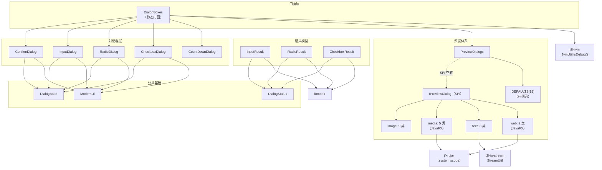
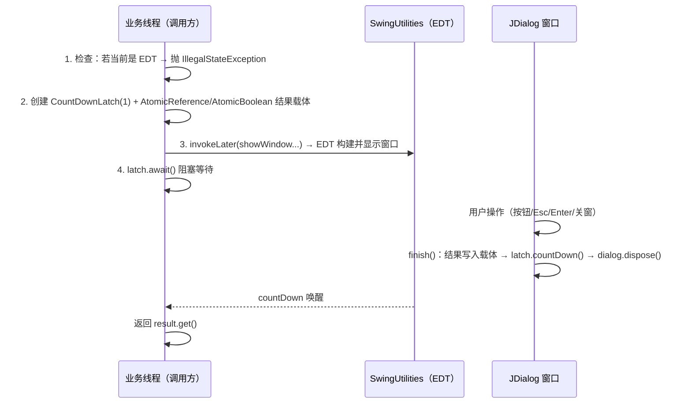

# i2f-form 模态对话框组件库

> 基于 Swing 的**桌面对话框组件库 + 统一预览系统**——以 `DialogBoxes` 静态门面提供消息/确认/输入/单选/多选/倒计时 6 类模态窗口，全部采用「`CountDownLatch` 阻塞调用线程 + `SwingUtilities.invokeLater` 在 EDT 构建 UI」实现同步模态语义；配套程序化绘制的现代扁平皮肤（`ModernUi`：圆角输入框/扁平按钮/自绘单选与复选框图标，零第三方依赖）；预览子系统以 `IPreviewDialog` SPI + `ServiceLoader` 分发图片/GIF/媒体/文本/网页预览（媒体与网页基于 JavaFX `JFXPanel` 桥接）；唯一真实消费者为 `i2f-jdbc-procedure` 的 `evalScriptUiInput`（UI 脚本输入）。
>
> **重要提示**：本模块无 `src/main/resources` 目录，**未提供 `META-INF/services` SPI 注册文件** → `PreviewDialogs.preview()` 统一入口实际永远 fallback 到字符串预览（图片/媒体/网页预览不可达），详见缺陷 #1。

---

## 模块定位

| 维度 | 说明 |
|---|---|
| **功能** | 6 类模态对话框（消息/确认、输入、单选、多选、倒计时、统一预览）+ 现代 Swing 皮肤 |
| **层级** | i2f-jdk 基础工具层（`i2f.form.dialog` 单包族） |
| **设计** | 静态方法门面（`DialogBoxes`）+ `CountDownLatch` 同步模态 + `AtomicReference` 结果载体 + SPI 预览分发 |
| **规模** | 42 源文件、约 3450 行（5 类对话框 + 3 结果模型 + 1 门面 + 3 基础 + 4 预览契约 + 15 预览实现 + 5 预览工具/调度 + 6 手测入口） |
| **入口** | `DialogBoxes.input(...)` / `DialogBoxes.confirm(...)` / `DialogBoxes.preview(obj)` 等静态方法 |
| **依赖** | Swing/JAWT（JDK 内置）+ JavaFX（`jfxrt.jar`，system scope）+ `i2f-jvm` + `i2f-io-stream` + lombok |

典型场景：桌面工具/测试辅助程序的用户交互（输入脚本、确认危险操作、选择配置项）、本地文件/URL 资源快速预览（图片、GIF、音视频、网页、文本）。

---

## 依赖关系

| 依赖 | 声明 | 实际使用 | 说明 |
|---|---|---|---|
| `lombok` | 是 | **真实使用** | 3 个结果类（`InputResult`/`RadioResult`/`CheckboxResult`）的 `@Data`/`@NoArgsConstructor` |
| `i2f-jvm` | 是 | **真实使用** | `DialogBoxes` 静态块调用 `JvmUtil.isDebug()` 判断是否调试模式 |
| `i2f-io-stream` | 是 | **真实使用** | `TextFilePreviewDialog`/`TextUrlPreviewDialog` 用 `StreamUtil.readString(file/url)` |
| `jdk:javafx`（system scope） | 是 | **真实使用** | `MediaDialogs`/`WebDialogs`/`MediaPreviewDialog`/`WebUrlPreviewDialog` 4 类引用 JavaFX；`systemPath` 硬编码 `C:/Java/jre1.8.0_201/lib/ext/jfxrt.jar` |
| `i2f-form-url-encoded` | 独立模块 | — | 同前缀的另一模块（URL 编码表单），与本模块无关 |

> **特殊情况**：4 个声明依赖全部真实使用，无冗余声明——但 `javafx` 采用 `system` scope + **硬编码绝对路径**（`C:/Java/jre1.8.0_201/lib/ext/jfxrt.jar`），换 JDK 目录/操作系统即编译失败；且 system scope 依赖不会传递给下游消费者，JDK 11+ 需按 POM 注释人工替换为 `org.openjfx:javafx-controls`/`javafx-fxml`（见缺陷 #2）。

---

## 架构

### 包结构

```
i2f.form.dialog
├── DialogBoxes                    统一静态门面（对外唯一推荐入口）
├── common                         公共基础设施
│   ├── DialogBase                 720×480 窗口骨架/常量/外观安装
│   ├── DialogStatus               结果枚举（CONFIRM/CANCEL）
│   └── ModernUi                   现代皮肤（配色/字体/圆角控件/自绘图标，418 行）
├── confirm/ConfirmDialog          消息/确认对话框（154 行）
├── input/InputDialog + InputResult        输入对话框（157 行）
├── radio/RadioDialog + RadioResult        单选对话框（293 行，含键盘导航）
├── checkbox/CheckboxDialog + CheckboxResult  多选对话框（268 行，含全选/反选）
├── countdown/CountDownDialog      倒计时提醒窗口（106 行，鼠标逃避设计）
├── preview/
│   ├── IPreviewDialog             预览契约：support(obj) + preview(obj)
│   ├── PreviewDialogs             统一分发（ServiceLoader SPI + 兜底字符串预览）
│   ├── std/                       IFilePreviewDialog / IUriPreviewDialog / IUrlPreviewDialog
│   ├── impl/image/                9 类：ImageDialogs/IconDialogs + 7 个 IPreviewDialog 实现
│   ├── impl/media/                5 类：MediaDialogs（JavaFX 播放器）+ 4 个实现
│   ├── impl/text/                 3 类：String/TextFile/TextUrl
│   ├── impl/web/                  2 类：WebDialogs（JavaFX WebView）+ WebUrlPreviewDialog
│   └── test/TestPreviewDialog     手测入口
└── test/TestDialogs               手测入口
```

### 类结构

| 分层 | 类型 | 说明 |
|---|---|---|
| **门面** | `DialogBoxes` | `message/confirm/input/radio/checkbox/countDownTimer/preview` + `enableHeadless` |
| **基础** | `DialogBase` | 窗口尺寸 720×480、按钮文案常量、`createDialog` 骨架、`installLookAndFeel` |
| **基础** | `ModernUi` | 配色 8 常量、字体自动选择、只读/可编辑输入框、扁平按钮、自绘单选/复选图标、`RoundedBorder`、`FlatButtonUI`、`appIcon` 动态绘制 |
| **基础** | `DialogStatus` | `CONFIRM`/`CANCEL` 枚举 |
| **对话框** | `ConfirmDialog` | `confirm`（双按钮，关窗/Esc=取消）/ `message`（单按钮，关窗/Esc=确认） |
| **对话框** | `InputDialog` | 上方 25% 只读提示 + 下方 75% 可编辑多行输入；返回 `InputResult` |
| **对话框** | `RadioDialog` | 问题行 + 选项列表 + 可选自定义项；UP/DOWN/Home/End 键盘导航；返回 `RadioResult` |
| **对话框** | `CheckboxDialog` | 问题行 + 多选列表 + 全选/反选按钮 + 可选自定义项；返回 `CheckboxResult` |
| **对话框** | `CountDownDialog` | 无边框半透明置顶倒计时窗口，鼠标移入即随机移位（"逃避"设计） |
| **结果模型** | `InputResult`/`RadioResult`/`CheckboxResult` | 状态 + 内容载体，`ofConfirm/ofCancel/ofChoice/ofCustom` 工厂 |
| **预览契约** | `IPreviewDialog` | `support(obj)` + `preview(obj)` |
| **预览契约** | `IFilePreviewDialog`/`IUriPreviewDialog`/`IUrlPreviewDialog` | 3 个子接口提供 `tryConvertAsFile`/`castAsUri`/`castAsUrl` 转换 + 后缀提取 default 方法 |
| **预览实现** | 15 个 `*PreviewDialog` | 7 图片类 + 4 媒体类 + 3 文本类 + 1 Web；均持 `INSTANCE` 单例 |
| **预览调度** | `PreviewDialogs` | `DEFAULTS` 数组（15 个预注册实现，**未被使用**）+ `preview()` 走 `ServiceLoader` |
| **工具** | `ImageDialogs`/`IconDialogs`/`MediaDialogs`/`WebDialogs` | 具体预览窗口实现（图片等比缩放/GIF 图标/JavaFX 媒体播放器/WebView 浏览器） |



### 模态对话框机制（核心设计）

所有模态对话框（Confirm/Input/Radio/Checkbox）采用同一套「**跨线程阻塞等待**」模式，共 4 步：



设计要点：

- **同步模态**：调用方像调普通函数一样拿到结果（返回值），无需回调；`await` 被中断时恢复中断标记并返回取消结果；
- **EDT 保护**：若在 EDT 内调用直接抛 `IllegalStateException("cannot run in Swing EDT...")`——因为 `await()` 会阻塞 EDT 导致死锁，这是**刻意的防死锁护栏**（但也意味着 Swing 应用内必须先切到工作线程调用）；
- **窗口监听**：`windowClosing` 统一映射为取消（Confirm 的 message 模式例外：视为确认）；
- **键盘支持**：`setDefaultButton` 实现 Enter 确认；`WHEN_IN_FOCUSED_WINDOW` 输入映射绑定 Esc；Radio 额外通过 `WHEN_FOCUSED`+`WHEN_IN_FOCUSED_WINDOW` 双通道实现 UP/DOWN/Home/End 导航；
- **统一窗口骨架**：`DialogBase.createDialog` 产出 720×480、可缩放、居中、置顶、白底、带动态绘制应用图标的 `JDialog`（`DO_NOTHING_ON_CLOSE` 交由各窗口自行处理）。

---

## 核心类详解

### DialogBoxes（门面，109 行）

对外唯一推荐入口，聚合全部对话框能力并代理转发：

| 方法族 | 签名 | 说明 |
|---|---|---|
| 消息 | `message(tips)` / `message(tips, title)` | 代理 `ConfirmDialog.message` |
| 确认 | `confirm(tips)` / `confirm(tips, title)` | 代理 `ConfirmDialog.confirm` |
| 输入 | `input(tips[, defaultValue[, title]])` | 代理 `InputDialog.input` → `InputResult` |
| 单选 | `radio(question, options[, allowCustomInput[, title]])` | 代理 `RadioDialog.radio` → `RadioResult` |
| 多选 | `checkbox(question, options[, allowCustomInput[, title]])` | 代理 `CheckboxDialog.checkbox` → `CheckboxResult` |
| 倒计时 | `countDownTimer(countdownSeconds)` | 代理 `CountDownDialog.countDownTimer` → `CountDownLatch` |
| 预览 | `preview(obj)` | 代理 `PreviewDialogs.preview` |
| 环境 | `enableHeadless(enable)` | 设置 `java.awt.headless` 系统属性 |

**静态初始化副作用**：`static { if (JvmUtil.isDebug()) { enableHeadless(false); } }`——类加载时若检测到 JVM 处于调试模式（`-Xrunjdwp`/`-agentlib:jdwp`），强制将 `java.awt.headless` 置为 `false`（保证 IDE 调试时能弹窗）。

### DialogBase（窗口骨架，73 行）

| 成员 | 值/行为 |
|---|---|
| `WINDOW_WIDTH`/`WINDOW_HEIGHT` | `720` × `480` |
| `SCROLL_UNIT` | `16`（滚动条单步像素） |
| `CANCEL_TEXT`/`CONFIRM_TEXT` | `"取消"`/`"确认"` |
| `createDialog(title, defaultTitle)` | 空标题回退默认；`DO_NOTHING_ON_CLOSE` + 720×480 + 可缩放 + 居中 + 白底 + `ModernUi.appIcon()` + **`setAlwaysOnTop(true)`** |
| `installLookAndFeel()` | `volatile` 标志位保证系统外观全局只装一次；失败静默（不影响功能） |
| `isBlank(text)` | null 或 trim 后为空 |

### ModernUi（现代皮肤，418 行）——最大文件

零第三方依赖、纯 JDK 程序化绘制的扁平化皮肤：

| 能力 | 实现 |
|---|---|
| 配色 | `COLOR_PRIMARY`(#2F80ED)/`COLOR_PRIMARY_DARK`/`COLOR_TEXT`/`COLOR_TEXT_SECONDARY`/`COLOR_BORDER`/`COLOR_FIELD_BG`/`COLOR_BTN_GRAY`/`COLOR_BTN_GRAY_DARK` 共 8 常量 |
| 字体 | `pickFontFamily()` 按 `Microsoft YaHei UI` → `PingFang SC` → `Segoe UI` → `Noto Sans CJK SC` 优先级挑系统字体，兜底 `SansSerif` |
| 输入控件 | `readOnlyField`（灰底禁编辑可复制）/`inputField`/`readOnlyTextArea`/`editableTextArea` |
| 按钮 | `flatButton(text, normalBg, hoverBg, fg)` + 私有 `FlatButtonUI extends BasicButtonUI`（`paint` 自绘 12px 圆角矩形，rollover/pressed 换 hover 色，`paintText` 手动居中） |
| 自绘图标 | `ModernRadioIcon`（空心圆 + 选中实心点，悬停主题色）/`ModernCheckIcon`（空心圆角方框 + 选中填充 + 白色勾） |
| 应用图标 | `appIcon()` 动态绘制 32×32：主题色圆角方块 + 白色折线勾 |
| 边框 | `RoundedBorder implements Border`（1.2f 描边圆角矩形，`Insets(4,10,4,10)`） |
| 交互辅助 | `bindClickToSelect`（点输入框选中单选框）/`bindClickToToggle`（点输入框切换复选框）/`optionRow`（选择控件居左 + 输入框填充） |

### ConfirmDialog（154 行）

- `confirm(tips[, title])`：中部只读多行文本（可滚动、可复制）+ 底部右对齐【取消】【确认】；关窗/Esc = `false`；
- `message(tips[, title])`：仅【确认】按钮且**居中**；关窗/Esc = 确认（`true`）；
- 内部 `show(tips, title, messageMode)` 为两模式共用：EDT 检查 → latch → `invokeLater(showWindow)` → await；`finish()` 写入 `AtomicBoolean` 并 `countDown` + `dispose`。

### InputDialog（157 行）+ InputResult（83 行）

- 布局：`GridBagLayout` 上下分割——提示区 `weighty=0.25` + 输入区 `weighty=0.75`（`TIPS_HEIGHT_RATIO=0.25`），均为独立圆角滚动面板；
- 默认值：`input(tips, defaultValue, title)` 中 `defaultValue == null` 回退空串；显示后 `inputArea.requestFocusInWindow()`；
- Enter = 确认（`setDefaultButton` + 输入区 ActionListener），Esc = 取消；
- **InputResult**：`result`（`DialogStatus`）+ `content`（取消时 null）+ `isConfirm()`/`isCancel()`/`isEmpty()` + 便捷转换 `getInteger()`/`getLong()`/`getFloat()`/`getDouble()`（`content.trim()` 后 parse）。

### RadioDialog（293 行）+ RadioResult（100 行）

能力最丰富的对话框：

- 顶部只读问题行（40px 高）；中部 `BoxLayout.Y_AXIS` 选项列表（每行 40px、间隔 6px，行 = 单选框 + 关联只读输入框，点输入框即选中）；尾部可选【自定义】行（可编辑输入框）；
- **键盘导航**：UP/DOWN 上下移动（`moveSelection`）、Home/End 首尾（`selectEdge`）、选中项 `scrollRectToVisible` 自动滚动到可视区；导航按键绑定到「每个单选框（WHEN_FOCUSED）+ 问题行 + rootPane（WHEN_IN_FOCUSED_WINDOW）」三层；
- 自定义单选框选中时自动聚焦其输入框；
- **RadioResult**：`index`（`INDEX_UNSELECTED=-2` 未选择 / `INDEX_CUSTOM=-1` 自定义 / ≥0 常规选项）+ `content` + `result` 状态；`isCancel()`/`isChoice()`（非取消且 index≥0）/`isCustom()`；
- `options == null` 抛 `IllegalArgumentException("options cannot be null")`。

### CheckboxDialog（268 行）+ CheckboxResult（114 行）

- 与 RadioDialog 同构的布局，差异：多选（`JCheckBox` + `bindClickToToggle`）、无键盘导航（注释明示"勾选通过鼠标点击完成"）；
- **全选/反选**：底部左侧两个 64×34 次要按钮（`setAllSelected`/`invertSelection`，作用于常规项，不含自定义项）；
- 收集逻辑 `collectChoices`：勾选项逐条转 `Choice.ofIndex(i, text)`，自定义项转 `Choice.ofCustom(text)`；**空选择时返回 `ofCancel()`**（即点击确认但未勾选任何项 = 取消语义）；
- **CheckboxResult**：`result` + `choices`（`List<Choice>`，默认空列表）+ 内部类 `Choice`（`index` + `content`，`INDEX_CUSTOM=-1`）；`isCancel()`/`isConfirm()`。

### CountDownDialog（106 行）

特殊用途的**倒计时提醒窗口**（如"测试环境即将超时"警示）：

- 无边框（`undecorated`）+ 半透明（`opacity=0.7f`）+ 置顶 + `setFocusableWindowState(false)` + 200×100 居中；48 号加粗白字显示剩余秒数；
- **逃避设计**：`mouseEntered`/`mouseMoved`（200ms 节流）时随机重定位到屏幕任意位置——鼠标碰到即"逃跑"，刻意干扰用户操作以强调紧迫性；
- `Swing Timer` 每秒递减，归零后 `stop + dispose + latch.countDown()`；
- **异步接口**：方法立即返回 `CountDownLatch`，调用方按需 `latch.await()` 同步等待（窗口在 EDT 异步构建，不阻塞调用线程）。

### 预览体系（IPreviewDialog + SPI）

**契约**：`IPreviewDialog.support(obj)`（能否预览）+ `preview(obj)`（执行预览）。三个 std 子接口以 default 方法提供对象→资源转换：

| 接口 | 转换方法 | 语义 |
|---|---|---|
| `IFilePreviewDialog` | `tryConvertAsFile(obj)` | `File` 直接返回；`CharSequence` 尝试 `new File(str).isFile()`；`getFileSuffix(file)` 返回含点小写后缀（`.png`） |
| `IUriPreviewDialog` | `castAsUri(obj)` | `URI` 直接返回；其他 `new URI(String.valueOf(obj))`（异常返回 null）；`getUriFileSuffix(uri)` 从 `uri.getPath()` 提取后缀 |
| `IUrlPreviewDialog` | `castAsUrl(obj)` | `URL` 直接返回；其他 `new URL(String.valueOf(obj))`（异常返回 null）；`getUrlFileSuffix(url)` 从 `url.getPath()` 提取后缀 |

**15 个实现**（均持 `public static final INSTANCE` 单例）：

| 实现 | 触发条件 | 委托到 |
|---|---|---|
| `BufferedImagePreviewDialog` | `obj instanceof BufferedImage` | `ImageDialogs.previewImage` |
| `ImageIconPreviewDialog` | `obj instanceof ImageIcon` | `IconDialogs.previewIcon` |
| `ImageInputStreamPreviewDialog` | `obj instanceof ImageInputStream` | `ImageIO.read` → `previewImage` |
| `MediaPreviewDialog` | `obj instanceof javafx Media` | `MediaDialogs.previewMedia` |
| `GifFilePreviewDialog` | File 后缀 `.gif` | `IconDialogs.previewGif` |
| `ImageFilePreviewDialog` | File 后缀 `.jpg/.png/.jpeg/.webp/.bmp/.tiff` | `ImageIO.read` → `previewImage` |
| `MediaFilePreviewDialog` | File 后缀 `.mp3/.aac/.ogg/.mp4/.avi/.wmv/.mpeg/.flv/.mkv/.rmvb` | `MediaDialogs.previewMedia` |
| `TextFilePreviewDialog` | File 后缀文本类（见下） | `StreamUtil.readString` → `DialogBoxes.message` |
| `ImageIconUrlPreviewDialog` | URL 路径后缀 `.gif` | `new ImageIcon(url)` → `previewIcon` |
| `ImageUrlPreviewDialog` | URL 路径后缀图片类 | `ImageIO.read(url)` → `previewImage` |
| `MediaUrlPreviewDialog` | URL 路径后缀媒体类 | `MediaDialogs.previewMedia` |
| `TextUrlPreviewDialog` | URL 路径后缀文本类 | `StreamUtil.readString(url)` → `DialogBoxes.message` |
| `MediaUriPreviewDialog` | URI 路径后缀媒体类 | `MediaDialogs.previewMedia` |
| `WebUrlPreviewDialog` | **任意合法 URL**（继承 default support 未覆写） | `WebDialogs.previewWeb` |
| `StringPreviewDialog` | null 或 `CharSequence` | `DialogBoxes.message` |

> 文本后缀表（TextFile/TextUrl 共用）：`.txt/.text/.html/.md/.log/.html/htm/.css/.js/.sass/.less/.ts/.json/.xml/.yml/.yaml/.properties/.conf/.sql/.java/.py/.c/.cpp/.h/.hpp`——其中 `.html` 重复、`htm` 缺前导点永不命中（见缺陷 #8）。

**PreviewDialogs 分发逻辑**（59 行）：

```java
public static final IPreviewDialog[] DEFAULTS = { /* 15 个实现 INSTANCE 按优先级排列 */ };

public static void preview(Object obj) {
    ServiceLoader<IPreviewDialog> list = ServiceLoader.load(IPreviewDialog.class);  // SPI 查找
    IPreviewDialog dialog = null;
    for (IPreviewDialog item : list) {
        if (item.support(obj)) { dialog = item; break; }
    }
    if (dialog == null) {                       // 兜底：转字符串预览
        obj = String.valueOf(obj);
        dialog = StringPreviewDialog.INSTANCE;
    }
    dialog.preview(obj);
}
```

**双重失效（缺陷 #1）**：`preview()` 只走 `ServiceLoader`——而本模块**无 `META-INF/services/i2f.form.dialog.preview.IPreviewDialog` 注册文件**（全模块无 resources 目录，且全仓检索无任何 SPI 描述文件）；同时 `DEFAULTS` 数组定义了 15 个预置实现却**无任何代码引用**（死代码）。结果：不引入外部 SPI 注册时，`preview(obj)` 对任何对象都只能走字符串兜底分支——图片/GIF/媒体/网页的「统一入口预览」实际不可达，只能绕过门面直接调用具体实现类。

### JavaFX 桥接（媒体/网页预览）

4 个类依赖 `jfxrt.jar`，均通过 `JFXPanel`（Swing 与 JavaFX 的桥）嵌入 `JDialog`：

- **MediaDialogs.previewMedia（250 行）**：4 种入口重载（`URL`/`URI`/`File`/`javafx Media`）统一收敛；`JFXPanel` + `Platform.runLater` 构建 `MediaPlayer` + `MediaView`（等比、随场景宽高绑定）+ 底部 48px `Slider` 进度条；`setOnReady` 时按视频原始尺寸/屏幕尺寸自适应窗口大小（无视频轨道的纯音频降为 480×96）；键盘：空格播放/暂停、LEFT/RIGHT 按总时长 5% 快进快退（最小 5 秒）、Esc 停止释放；进度条点击 seek、拖动期间不自同步（`currentTimeProperty` 监听中判断 `!isPressed`）；
- **WebDialogs.previewWeb（111 行）**：`WebView` + `WebEngine` 加载 URL（null 时默认 `https://www.baidu.com/`）；键盘：F5 刷新、LEFT/RIGHT 历史前进后退；
- 两者均在 `windowClosing` 中释放资源/`dispose` 对话框。

---

## 消费关系

| 消费者 | 使用内容 | 说明 |
|---|---|---|
| `i2f-jdbc-procedure` | `JdbcProcedureExecutor.evalScriptUiInput(lang, params)` | 接口 default 方法：`DialogBoxes.input("请输入[" + lang + "]脚本", "", "脚本输入框")` → `evalScript(lang, result.getContent(), params)` |
| 全仓其他模块 | — | 25 处 `import i2f.form.` 中除上述外全部为模块内部引用 |

> **消费者瑕疵**：`evalScriptUiInput` 未判断 `result.isCancel()`——用户取消输入后 `getContent()` 返回 null，被直接传入 `evalScript(lang, null, params)` 执行（见缺陷 #14）。

---

## 使用示例

### 基础对话框

```java
// 消息提示（单按钮，Esc/关窗视为确认）
DialogBoxes.message("操作已完成！\n共处理 3 条记录。", "提示");

// 确认（双按钮，Esc/关窗视为取消）
if (DialogBoxes.confirm("确定删除选中记录？", "危险操作")) {
    // 用户点了确认
}

// 输入（Enter 确认 / Esc 取消）
InputResult result = DialogBoxes.input("请输入脚本：", "print('hello')", "脚本输入");
if (result.isConfirm()) {
    String script = result.getContent();
}

// 单选（含自定义项；支持 UP/DOWN/Home/End 导航）
RadioResult radio = DialogBoxes.radio("请选择运行环境：",
        Arrays.asList("开发", "测试", "生产"), true, "环境选择");
if (radio.isChoice()) {
    System.out.println("第 " + radio.getIndex() + " 项：" + radio.getContent());
} else if (radio.isCustom()) {
    System.out.println("自定义：" + radio.getContent());
}

// 多选（含全选/反选按钮与自定义项）
CheckboxResult checkbox = DialogBoxes.checkbox("请选择要部署的模块：",
        Arrays.asList("web", "service", "dao"), true, "模块选择");
for (CheckboxResult.Choice choice : checkbox.getChoices()) {
    System.out.println(choice.getIndex() + " -> " + choice.getContent());
}
```

### 倒计时提醒（异步 + 可选同步等待）

```java
CountDownLatch latch = DialogBoxes.countDownTimer(10);   // 弹窗立即显示，异步倒计时
latch.await();                                            // 需要等待时由调用方同步
```

### 预览（注意缺陷 #1：需直接调用具体实现或自行注册 SPI）

```java
// 推荐：绕过 SPI 空转的统一入口，直接调用具体实现
ImageDialogs.previewImage(new File("D:/test.png"));
IconDialogs.previewGif(new File("D:/demo.gif"));
MediaDialogs.previewMedia(new File("D:/demo.mp4"));       // 需 JavaFX 环境
WebDialogs.previewWeb("https://www.example.com/", null, null);

// 统一入口（当前仅字符串预览可达，除非外部提供 SPI 注册）
DialogBoxes.preview("plain text will be previewed by message dialog");
```

### 环境适配（headless / 自定义预览）

```java
DialogBoxes.enableHeadless(true);   // 无显示环境（CI）先关闭 AWT 展示避免 HeadlessException

// 外部接入自定义预览：META-INF/services/i2f.form.dialog.preview.IPreviewDialog 内写入实现全类名
// 排序优先级由 ServiceLoader 加载顺序决定，或自行实现分发
```

---

## 已知缺陷

| # | 级别 | 缺陷 | 说明 |
|---|---|---|---|
| 1 | **严重** | **SPI 注册缺失 + DEFAULTS 死代码双重失效** | `PreviewDialogs.preview()` 走 `ServiceLoader` 但模块无 `META-INF/services` 注册文件（全模块无 resources 目录）→ 任何对象恒走字符串兜底；同时 `DEFAULTS` 数组（15 个预置实现）无任何引用。图片/媒体/网页预览的「统一入口」实际不可达 |
| 2 | **高** | **JavaFX system scope 硬编码绝对路径** | `systemPath=C:/Java/jre1.8.0_201/lib/ext/jfxrt.jar`——换 JDK 目录/操作系统即编译失败；system scope 不传递给下游（JDK 11+ 消费者运行时若触发媒体/网页预览类加载会 `NoClassDefFoundError`）；POM 注释提供 openjfx 替代但需人工切换 |
| 3 | **中** | **File 预览不校验文件存在性** | `tryConvertAsFile` 对 `File` 实例直接返回（不调 `isFile()`）→ 不存在的文件 `support()=true` → `ImageIO.read` 返回 null → `previewImage(null)` 在 `img.getWidth()` 处 NPE（`TestPreviewDialog` 的 `./test.png` 等即随时触发） |
| 4 | **中** | **RadioDialog 确认按钮的取消语义** | 用户点【确认】但未选择任何项时 `collectSelection` 返回 `RadioResult.ofCancel()`（`result=CANCEL`）—— 按钮语义与结果语义不一致，调用方无法区分「点确认未选」与「点取消」 |
| 5 | **中** | **InputResult 数值转换无防御** | `getInteger/getLong/getFloat/getDouble` 直接 `content.trim()`——取消时 `content=null` 抛 NPE，空串/非数字抛 `NumberFormatException`，均无默认值重载 |
| 6 | **中** | **EDT 强护栏的整合成本** | 全部模态对话框在 EDT 内调用直接抛 `IllegalStateException`——Swing 应用（按钮回调本就在 EDT）必须先切工作线程，且异常信息仅英文技术描述，业务方易误用 |
| 7 | **中** | **窗口强制置顶无开关** | `DialogBase.createDialog` 固定 `setAlwaysOnTop(true)`——对话框会遮挡用户其他应用窗口（尤其 message 类高频提示场景），无参数关闭 |
| 8 | **低** | **文本后缀表错误** | `TextFilePreviewDialog`/`TextUrlPreviewDialog` 的列表 `.html` 重复出现；`"htm"` 缺少前导点（后缀提取返回 `.htm`）→ 永不命中 |
| 9 | **低** | **setLocation 运算优先级错误** | `MediaDialogs` L153：`(int)(screenSize.getWidth() - width) / 2` 为先转 int 再除 2，与预期的 `(int)((...)/2)` 存在截断偏差 |
| 10 | **低** | **MediaDialogs 其他瑕疵** | URL→URI 转换失败时 `uri=null` → `new Media(null)` 抛异常（未走 try-catch 之外的兜底）；`setOnReady`（JavaFX 线程）中直接 `dialog.setSize/setLocation` 操作 Swing 组件（违反 EDT 规则）；快进快退分支 `rate` 变量计算后未使用（死变量） |
| 11 | **低** | **CountDownDialog 注释与行为不符 + 无法手动关闭** | 注释称「窗口关闭时直接退出程序」实为 `DISPOSE_ON_CLOSE`；`undecorated` + `setFocusableWindowState(false)` 导致用户既无关闭按钮也无法键盘关闭——只能等倒计时结束（或鼠标触碰触发移位的"骚扰"交互） |
| 12 | **低** | **IconDialogs 与 ImageDialogs 行为不一致** | `previewIcon` 无 `componentResized` 监听——GIF/图标窗口缩放时内容不重绘自适应（`previewImage` 有） |
| 13 | **低** | **DialogBoxes 静态初始化副作用** | 类加载即检测 `JvmUtil.isDebug()` 并全局改写 `java.awt.headless=false`——隐蔽的全局状态变更，且 `enableHeadless` 与业务其它 AWT 初始化的先后顺序耦合 |
| 14 | **低** | **消费者未判取消** | `i2f-jdbc-procedure` 的 `evalScriptUiInput`：`DialogBoxes.input(...)` 后直接 `result.getContent()`，用户取消返回 null 仍传入 `evalScript(lang, null, params)` 执行 |
| 15 | **低** | **重复模板与测试缺失** | 4 个模态对话框的「EDT 检查 → latch → invokeLater → finish → Esc 绑定」模板逐行近似（约 60% 复制粘贴，可抽公共基类/模板方法）；6 个 `*Test`/`TestDialogs` 为生产包内 main 手测，无真实单元测试；无 `package-info` |

---

## 与同类方案对比

| 维度 | i2f-form | `JOptionPane`（JDK） | JavaFX `Dialogs` |
|---|---|---|---|
| 模态机制 | `CountDownLatch` 阻塞调用线程（函数式返回值） | 静态方法同步返回（EDT 内可用） | `showAndWait()` |
| 皮肤 | 程序化绘制扁平风（圆角/主题色/自绘图标） | 系统外观 | CSS 可定制 |
| 多行输入 | 支持（75% 高度编辑区） | 单行 `showInputDialog` | 需自定义 |
| 单选题列表 | 支持 + 自定义项 + 键盘导航 | 不支持 | 需自定义 |
| 多选 + 全选/反选 | 支持 | 不支持 | 需自定义 |
| 倒计时"逃避"窗口 | 支持 | 不支持 | 不支持 |
| 统一预览分发 | 支持（但 SPI 空转，缺陷 #1） | 不支持 | 不支持 |
| EDT 内调用 | **抛异常禁止** | 允许 | 允许（JavaFX 线程内用 `showAndWait` 受限） |

---

## 总结

`i2f-form` 是一个**以交互形态覆盖见长**的桌面辅助组件库：用纯 JDK 绘制出接近现代设计语言的皮肤，把「消息/确认/输入/单选/多选/倒计时」六类高频交互收敛为一行静态调用，并以统一的预览契约（`IPreviewDialog`）试图覆盖图片、GIF、媒体、文本、网页五类资源。

**设计亮点**：

- `CountDownLatch` + `invokeLater` 的模态方案把异步 Swing 包装成同步函数调用，业务代码零回调；
- `ModernUi` 全部程序化绘制（含应用图标动态绘制），零第三方 UI 依赖、天然契合 jdk8 环境；
- 单选/多选的「输入框联动选择」「自定义项」「键盘导航」「全选/反选」等细节完备；
- 三层预览接口（`IFile/Uri/Url` + default 转换方法）设计规整，实现类小而单一。

**核心问题**：

- 预览子系统的 SPI 注册缺失使「统一入口」名存实亡（缺陷 #1），加上 `DEFAULTS` 死代码，是整个模块最需要修复的断点；
- JavaFX `system` scope 硬编码路径让模块的构建与发布被绑定在特定机器（缺陷 #2）；
- 4 个模态对话框间约 60% 的复制粘贴模板与若干防御性缺失（#3-#7）体现了「先跑通、后收敛」的演进痕迹。

作为桌面工具/测试辅助场景的交互糖库，其能力密度与独立性突出；但要作为通用基础库发布，至少需要修复 SPI 注册、抽出对话框公共骨架、补齐 JavaFX 依赖的可移植声明。
