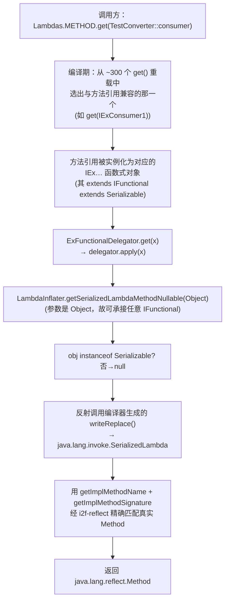

# i2f-functional-lambda

> 「函数式接口 × 方法引用解析」的**粘合层**（functional-lambda）。它把 `i2f-functional` 的 `ExFunctionalDelegator`（用约 300 个 `get()` 重载把任意函数式实例汇聚到单一 `Function<IFunctional,U>` 的类型擦除前门）与 `i2f-lambda` 的 `LambdaInflater`（把可序列化方法引用反解为 `Field`/`Method`/`Class` 的通用解析器）**一次性对接**，产出三个开箱即用的转换器单例：`Lambdas.FIELD`（方法引用 → `java.lang.reflect.Field`）、`Lambdas.METHOD`（方法引用 → `java.lang.reflect.Method`）、`Lambdas.LAMBDA`（方法引用 → 原始 `SerializedLambda`）。调用方只需 `Lambdas.METHOD.get(TestConverter::consumer)` 一行，即可从「类型安全的方法引用」拿到它真正引用的反射对象——无需自己写 `writeReplace` 反解、也无需关心函数式接口的种类与元数。模块自身仅 5 个文件、零逻辑分支，是全仓库 lambda 反解能力对**使用方最友好**的门面。

## 模块路径

- `i2f-jdk/i2f-functional-lambda`

## 模块依赖

| GroupId | ArtifactId | Scope | Optional | 来源 | 用途 |
| --- | --- | --- | --- | --- | --- |
| `i2f.turbo` | `i2f-functional` | compile | 否 | 父 POM `i2f-jdk` 托管 | 提供被继承的 `ExFunctionalDelegator<U>`（`get()` 重载汇聚前门）与 `IFunctional` 根接口 |
| `i2f.turbo` | `i2f-lambda` | compile | 否 | 父 POM `i2f-jdk` 托管 | 提供被委托的 `LambdaInflater`（`getSerializedLambda{Field,Method}Nullable` / `getSerializedLambdaNullable` 解析出口） |

- 无 `<dependencies>` 之外的三方依赖，不引入 lombok；纯胶水模块。
- 传递依赖（经 `i2f-lambda` 间接引入，本模块源码不直接使用）：`i2f-lambda-core`（`Lambda` 内核）、`i2f-lru-map`（解析结果缓存）、`i2f-reflect`（`Method` 精确匹配）。

## 模块设计

### 定位：Delegator（消费端）与 Inflater（解析端）的连接器

`i2f-functional` 解决了「**如何把 300+ 种函数式接口收敛成一个统一入口**」，`i2f-lambda` 解决了「**如何把一个可序列化方法引用反解成反射对象**」，但两者之间缺一根线：`ExFunctionalDelegator` 需要一个 `Function<IFunctional,U>` 作为「汇聚后的处理器」，而 `LambdaInflater` 的解析出口是 `(Object)->Field/Method/SerializedLambda` 的静态方法。本模块就是这根线——用**继承 + 构造器方法引用**把两端焊死。

### 三个转换器：`extends ExFunctionalDelegator<T>` + 构造器传入解析出口

每个转换器只做一件事：选定输出类型 `T`，并在 `super(...)` 里把 `LambdaInflater` 对应的静态方法以**方法引用**形式交给 delegator。

| 类 | 继承 | delegator（构造器入参） | 输出 `T` | 语义 |
| --- | --- | --- | --- | --- |
| `SerializedLambdaConverter` | `ExFunctionalDelegator<SerializedLambda>` | `LambdaInflater::getSerializedLambdaNullable` | `SerializedLambda` | 方法引用 → JVM 原始序列化lambda（最底层，含类名/方法名/描述符） |
| `MethodLambdaConverter` | `ExFunctionalDelegator<Method>` | `LambdaInflater::getSerializedLambdaMethodNullable` | `Method` | 方法引用 → 真正引用的 `java.lang.reflect.Method`（签名精确匹配，任意方法可用） |
| `FieldLambdaConverter` | `ExFunctionalDelegator<Field>` | `LambdaInflater::getSerializedLambdaFieldNullable` | `Field` | 方法引用 → 引用的 `java.lang.reflect.Field`（沿用内核 getter/setter 命名约定） |

### `Lambdas` 门面：三个无状态单例

`Lambdas` 以 `public static final` 暴露三者的 `INSTANCE` 单例，是模块对外的唯一入口：

```java
public class Lambdas {
    public static final FieldLambdaConverter FIELD = FieldLambdaConverter.INSTANCE;
    public static final MethodLambdaConverter METHOD = MethodLambdaConverter.INSTANCE;
    public static final SerializedLambdaConverter LAMBDA = SerializedLambdaConverter.INSTANCE;
}
```

### 数据流：一行 `.get(...)` 背后发生了什么



### 两处关键的类型契合点

1. **为何 `delegator` 能接 `LambdaInflater` 的静态方法**：`ExFunctionalDelegator` 期望 `Function<IFunctional,U>`，而 `LambdaInflater` 的三个出口签名都是 `(Object)->T`。由于 `IFunctional` 是 `Object` 的子类型，方法引用 `LambdaInflater::getSerializedLambdaMethodNullable`（接收 `Object`）天然适配「需接收 `IFunctional`」的函数式目标（参数逆变）。`LambdaInflater` 刻意用 `Object` 入参 + 内部 `instanceof Serializable` 兜底，正是为了能塞进这里，同时对非可序列化入参安全降级。
2. **为何统一继承 `Ex` 版 delegator**：`ExFunctionalDelegator` 的 `get()` 重载覆盖的是 `IEx*`（`throws Throwable`）函数式宇宙——它的抽象方法允许抛受检异常，故**抛异常的（`consumerMulException` 声明 `throws IOException, SQLException`）与不抛异常的（`consumer`）方法引用都能绑定到 `IEx*` 目标**。若用普通 `FunctionalDelegator` 就只能接非抛异常宇宙。选 `Ex` 版是为把输入面放到最宽。

### 包结构

```
i2f.functional.lambda
├── Lambdas                       # 门面：FIELD / METHOD / LAMBDA 三单例
├── converter
│   ├── FieldLambdaConverter      # extends ExFunctionalDelegator<Field>
│   ├── MethodLambdaConverter     # extends ExFunctionalDelegator<Method>
│   └── SerializedLambdaConverter # extends ExFunctionalDelegator<SerializedLambda>
└── test
    └── TestConverter             # main 演示 Lambdas.METHOD.get(...) 七种方法引用
```

## 模块目的

- **降低 lambda 反解的使用门槛**：`i2f-lambda-core`/`i2f-lambda` 的 API 是「面向函数式接口类型 + 静态方法」，调用方需自行判断方法引用属于哪种 `IEx…` 形状并挑对解析出口；本模块用 delegator 的重载分派把这层负担彻底抹平，调用方只管把方法引用丢进 `.get(...)`。
- **复用而非重复**：不自建任何解析逻辑，仅以继承 + 方法引用把 `i2f-functional`（分发）与 `i2f-lambda`（解析）两个既有地基拼装成产品级 API。
- **一份契约三种粒度**：同一套 `get(...)` 入口，按需选择输出粒度——要「字段」用 `FIELD`、要「方法」用 `METHOD`、要「原始元数据」用 `LAMBDA`。

## 模块功能

| 功能 | 入口 | 说明 |
| --- | --- | --- |
| 方法引用 → `Field` | `Lambdas.FIELD.get(mref)` | 依据 getter/setter 命名约定反推字段（继承内核约定，仅规范 getter/setter 可靠） |
| 方法引用 → `Method` | `Lambdas.METHOD.get(mref)` | 用方法名 + JVM 描述符精确匹配，任意方法引用（含静态、构造、抛异常方法）可用 |
| 方法引用 → `SerializedLambda` | `Lambdas.LAMBDA.get(mref)` | 取最底层序列化元数据，供自定义解析 |
| 广谱入参兼容 | `get()` 约 300 个重载 | 覆盖 `IEx` 全家族 + `IConsumer/IFunction/IPredicate/IComparator` 与 `base/array` 各返回域标记，任意函数式实例皆可传入 |

## 模块主要使用方法

以模块内 `TestConverter` 为准（`main` 方法即官方示例）：

```java
// 任意形状的方法引用，直接解析为其真正引用的 Method（含无参、抛受检异常者）
System.out.println(Lambdas.METHOD.get(TestConverter::consumer));            // void consumer(Integer)
System.out.println(Lambdas.METHOD.get(TestConverter::consumerInt));         // void consumerInt(int)
System.out.println(Lambdas.METHOD.get(TestConverter::consumerException));   // throws Exception
System.out.println(Lambdas.METHOD.get(TestConverter::consumerIoException)); // throws IOException
System.out.println(Lambdas.METHOD.get(TestConverter::consumerMulException));// throws IOException, SQLException
System.out.println(Lambdas.METHOD.get(TestConverter::predicate));           // Boolean predicate(Integer)
System.out.println(Lambdas.METHOD.get(TestConverter::supplier));            // byte[] supplier()

// 解析字段（对 getter/setter 型方法引用，如实体 SysUser::getUserName）
// Field f = Lambdas.FIELD.get(SysUser::getUserName);

// 取原始 SerializedLambda（自行读取 getImplClass/getImplMethodName 等）
// SerializedLambda sl = Lambdas.LAMBDA.get(SysUser::getUserName);
```

注意事项：

- **传入的必须是可序列化方法引用/lambda**：目标函数式接口须 `extends IFunctional`（即 `extends Serializable`），否则 `writeReplace` 不存在、`LambdaInflater` 的 `instanceof Serializable` 兜底会返回 `null`（`METHOD`/`LAMBDA` 安全返回 null）。
- **`FIELD` 沿用内核命名约定**：`get`/`set`/`is`/`has`/`enable`/`with`/`build` 前缀剥字段，只对规范的 getter/setter/builder 方法引用有效；任意方法（如示例中的 `consumer`）没有对应字段，解析不出。
- **输出可能为 `null`**：解析失败时不抛异常而是返回 `null`（`LAMBDA`/`METHOD`），调用方需判空。

## 模块特性总结

- **极简胶水**：5 个文件、零 `if`、零自建解析逻辑，全部能力来自 `i2f-functional` + `i2f-lambda` 的组合。
- **一行式 API**：`Lambdas.{FIELD|METHOD|LAMBDA}.get(方法引用)`，无需关心函数式接口种类、元数、是否抛异常。
- **三粒度输出**：`Field`（字段）/ `Method`（方法）/ `SerializedLambda`（原始元数据）按需选用。
- **最宽输入面**：统一继承 `ExFunctionalDelegator`，`IEx` 宇宙使抛受检异常的方法引用同样可被接收。
- **无状态单例**：三个 `INSTANCE` 均为线程安全的无状态转换器；缓存与真正的反射开销都下沉在 `LambdaInflater`/`Lambda`（`LruMap`）。
- **纯 JDK + i2f 地基**：零三方依赖，编译于 JDK8。

## 已知边界与瑕疵

- **`Lambdas.FIELD` 继承了 `i2f-lambda` 字段出口的 null 保护缺口**：其委托的 `LambdaInflater.getSerializedLambdaFieldNullable → parseSerializedLambdaFieldNullable → Lambda.ofField(lambda)` 一路**未对 `lambda==null` 判空**（对照方法出口 `parseSerializedLambdaMethodNullable` 开头有 `if(lambda==null) return null;`）。当传入不可序列化 / 无法反解的引用时，`METHOD`/`LAMBDA` 安全返回 `null`，而 `FIELD` 路径会在 `Lambda.ofField(null)` 处解引用抛 `NullPointerException`，三者行为不一致。类型安全的调用（入参皆 `IFunctional`）通常能规避该路径，但仍是已知的健壮性洼地。
- **`TestConverter` 官方示例仅演示 `METHOD`**：未见对 `FIELD`/`LAMBDA` 的样例调用，侧面反映 `METHOD`（任意方法引用精确匹配）是最常用、最稳的出口。
- **本层不缓存**：转换器只是转调，缓存命中/未命中完全依赖 `LambdaInflater`/`Lambda` 内部的 `LruMap`；对 `FIELD` 而言还受限于内核命名约定的启发式，非规范命名会解析失败。
- **无仓库内运行期消费者**：全仓 grep 仅 `i2f-jdk-all`（聚合 POM）在依赖清单中引入，尚无业务代码 `import i2f.functional.lambda`——它当前是面向使用方 convenience 的**出口门面**，而非被内部强依赖的地基。
