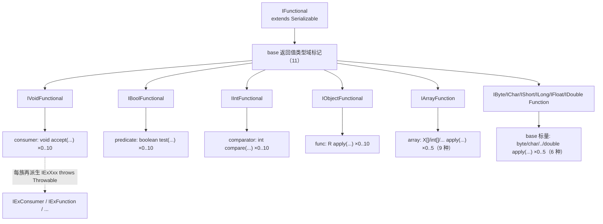
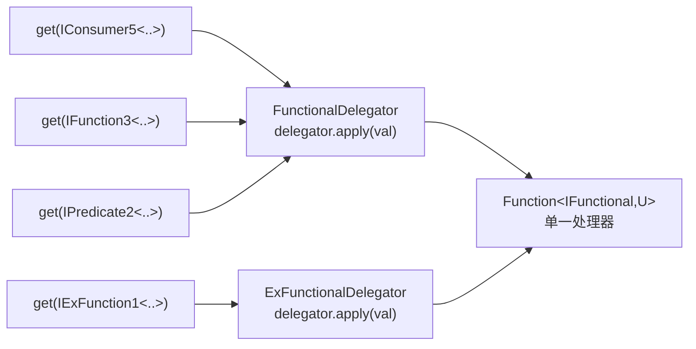

# i2f-functional

> 可序列化**函数式接口宇宙**（functional）—— i2f 函数式编程与「方法引用反射」的**零依赖地基**。以唯一根接口 `IFunctional extends Serializable` 为顶点，按「**返回值类型域 × 参数元数 × 是否抛异常**」三维组合出 **327** 个函数式接口：`func`（返回对象）/`consumer`（返回 void）/`predicate`（返回 boolean）/`comparator`（返回 int）四大泛型族（元数 0–10），加 `base`（返回 6 种标量基本类型）与 `array`（返回 9 种数组）两族基本类型特化（元数 0–5），每族都另配一套 `IExXxx`（`throws Throwable`）变体；另有 `adapt` 把常用形状命名为 `IGetter/ISetter/IBuilder/IExecute`，`Functionals` 桥接 JDK `java.util.function` 并提供柯里化，`{Functional,ExFunctional}Delegator` 用重载把任意一种函数式实例汇聚到单一 `Function<IFunctional,U>` 处理器，`Func.setIf` 做空值安全赋值。**全部接口继承 `Serializable`** 是本模块的灵魂设计——正是它让上层 `i2f-lambda-core`/`i2f-lambda` 能用 `writeReplace`→`SerializedLambda` 反解方法引用。

## 模块路径

- `i2f-jdk/i2f-functional`

## 模块依赖

**无任何依赖**——`pom.xml` 内连 `<dependencies>` 段都没有，不依赖 lombok，也不依赖任何 i2f 兄弟模块或第三方库。它是整个 i2f 依赖图最深的**叶子地基**之一，仅使用 JDK 标准库（`java.util.function.*`、`java.io.Serializable`、`java.util.Comparator`）。

| 类别 | 内容 |
| --- | --- |
| 内部依赖 | 无 |
| 三方依赖 | 无 |
| JDK | `java.io.Serializable`、`java.util.function.*`、`java.util.Comparator` |

> 对比：`i2f-lambda-core` 用 `i2f-lru-map`；而本模块连一个工具类都不引，纯粹是「接口 + 少量静态泛型方法」的声明式库。

## 模块设计

### 顶点：`IFunctional extends Serializable`

所有函数式接口都（直接或间接）继承 `IFunctional`，而 `IFunctional` 唯一做的事就是 `extends Serializable`。**可序列化不是为远程传输，而是为反射**：只有 `extends Serializable` 的 lambda/方法引用，编译器才会为其生成 `writeReplace()`，进而被 `SerializedLambda` 反查出引用的类/方法/字段——这正是 `i2f-lambda-core` 解析列寻址方法引用的前提。因此本模块与 lambda 族是「契约 vs 解析器」的共生关系。

### 三维组合矩阵

接口数量 = **返回值类型域** × **参数元数 arity** × **是否抛异常** 的笛卡尔展开：



- **泛型四族**（`func`/`consumer`/`predicate`/`comparator`）元数 **0–10**（11 个），因它们参数是引用类型，泛型成本低；
- **基本类型特化两族**（`base` 标量返回、`array` 数组返回）元数 **0–5**（6 个），主动收敛以抑制组合爆炸。

### 包结构与规模（实测 327 文件）

| 包 | 数量 | 职责 | SAM 方法 |
| --- | --- | --- | --- |
| `func` | 24 | 返回对象 `R` | `R apply(V1..Vn)`，0–10 |
| `consumer` | 24 | 返回 `void` | `void accept(V1..Vn)`，0–10 |
| `predicate` | 24 | 返回 `boolean` | `boolean test(V1..Vn)`，0–10 |
| `comparator` | 24 | 返回 `int` | `int compare(V1..Vn)`，0–10 |
| `base` | 89 | 11 个返回域标记 + 6 种**标量返回**特化（bytes/chars/shorts/longs/floats/doubles，各 0–5 + `IEx`） | `byte/char/../double apply(...)` |
| `array` | 126 | 9 个数组标记 + 9 种**数组返回**特化（bools/bytes/chars/doubles/floats/ints/longs/objs/shorts，各 0–5 + `IEx`） | `int[]/../T[] apply(...)` |
| `adapt` | 8 | 语义别名：`IGetter`/`ISetter`/`IBuilder`/`IExecute` + `IEx` 版 | 复用 func/consumer 的 1/2 元 |
| `delegator` | 2 | `FunctionalDelegator` / `ExFunctionalDelegator` 重载汇聚调度 | — |
| `exception` | 1 | `UnDeclaredFunctionalException`：把 `Throwable` 包成非受检再抛 | — |
| `utils` | 1 | `Func.setIf(...)`：值非空/非空串才赋值 | — |
| 根 | 2 | `IFunctional`（顶点）、`Functionals`（JDK 桥接 + 柯里化） | — |
| `test` | 2 | `TestFunctional`（兼容性规则）、`TestConvert`（`IEx`→JDK `Function`） | — |

### 继承骨架（以 `func` 为例，各族同构）

```
IFunctional (Serializable)
  └── IObjectFunctional            # base：返回对象这一「值域」
        └── IFunction              # func：族标记
              ├── IFunction0<R>            R apply()
              ├── IFunction1<R,V1>         R apply(V1)        ← adapt.IGetter<R,T> 继承它
              ├── ...  IFunction10<R,V1..V10>
              └── IExFunction extends IFunction            # 抛异常变体的族标记
                    ├── IExFunction0<R>            R apply() throws Throwable
                    └── IExFunctionN<...>          R apply(...) throws Throwable
```

> 关键点：`IExFunction extends IFunction`——抛异常族是普通族的**子类型**，故两者都能被 `Function<IFunctional,U>` 接收，这是两个 Delegator 能共用同一处理器字段的基础。

### `adapt`：把形状命名成语义

| 别名 | 继承 | 展开 | 语义 |
| --- | --- | --- | --- |
| `IGetter<R,T>` | `IFunction1<R,T>` | `R apply(T)` | 从目标取一个值 |
| `ISetter<T,V>` | `IConsumer2<T,V>` | `void accept(T,V)` | 给目标写入一个值 |
| `IBuilder<R,T,V>` | `IFunction2<R,T,V>` | `R apply(T,V)` | 写入并回传 builder/target |
| `IExecute<T>` | `IConsumer1<T>` | `void accept(T)` | 对目标执行一次动作 |

每个都有对应 `IExXxx`（继承 `IExFunction1`/`IExConsumer2`/…）。这组语义类型正是 `i2f-bql` lambda 列寻址 API 的方法引用参数类型（`SysUser::getUserName`→`IGetter`、`SysUser::setUserName`→`ISetter`）。

### `Delegator`：重载构成的「类型擦除前门」



- 两个类都只持有一个 `Function<IFunctional,U> delegator`，`get(x)` 一律 `delegator.apply(x)`；
- 差别在**入参重载集**：`FunctionalDelegator` 覆盖**非抛异常**全宇宙（各普通族的 0–N 元 + base 标记），`ExFunctionalDelegator` 覆盖普通**标记** + **`IEx` 全宇宙**；
- 价值：客户端把「任意一种函数式实例」交给**一个**处理器，编译期靠重载选到精确的 `getXxx`，运行期由处理器再用 `SerializedLambda` 内省具体类型——把 300+ 类型的入口收敛成一个落点（`i2f-functional-lambda` 的转换器即 `extends ExFunctionalDelegator`，处理器指向 `LambdaInflater` 解析函数）。

### `Functionals`：JDK 标准接口的类型标注 + 柯里化

不产新语义，仅两类便利：① **恒等桥接**（`supplier(s)`、`function(f)`、`consumer(c)`、`intFunction(..)`、`toDoubleBiFunction(..)` 等覆盖 JDK 全部标准函数式类型）帮助在重载/泛型推断处显式定型；② **柯里化**（`function(BiFunction,val)`→`Function`、`predicate(BiPredicate,val)`→`Predicate`、`consumer(BiConsumer,val)`→`Consumer`）绑定第二参数做部分应用。

## 模块目的

- 提供一套**可序列化、按返回域与元数系统枚举**的函数式接口标准库，消除 `java.util.function` 只有 0–2 元、无受检异常变体、无标量/数组返回特化的局限。
- 以统一根 `IFunctional` 为「方法引用可被反射解析」提供类型契约，支撑整个 lambda 反解族。
- 用 `adapt` 语义别名让业务代码以 getter/setter/builder/execute 意图命名方法引用。
- 用 `Delegator` 把海量函数式入口收敛为单一处理器，服务通用转换/序列化设施。
- **零依赖**，可被任意上层（bql、mutator、functional-lambda、detegate）无成本引入。

## 模块功能

| 功能 | 载体 | 说明 |
| --- | --- | --- |
| 可序列化函数式契约 | `IFunctional` + 326 子接口 | 覆盖「对象/void/boolean/int/标量/数组」返回 × 元数 × 抛异常 |
| 受检异常友好 | `IExXxx` 全族 | SAM `throws Throwable`，lambda 体可直接抛受检异常 |
| 语义化方法引用 | `adapt.IGetter/ISetter/IBuilder/IExecute` | bql 列寻址参数类型 |
| JDK 接口桥接/柯里化 | `Functionals` | 类型标注 + `BiXxx` 部分应用 |
| 任意函数式→单一处理器 | `{,Ex}FunctionalDelegator` | 重载前门，运行期内省具体类型 |
| 空值安全赋值 | `Func.setIf` | `null` 或空串跳过 setter |
| 受检异常再抛 | `UnDeclaredFunctionalException` | `IEx`→JDK 标准接口适配时包装 `Throwable` |

## 模块主要使用方法

### 1. 声明可抛受检异常的多参函数（`IExFunction`）

```java
import i2f.functional.func.except.impl.IExFunction2;

// JDK BiFunction 不能抛受检异常；IExFunction2 可以
IExFunction2<String, java.io.File, java.io.File> reader =
    (f, charset) -> new String(java.nio.file.Files.readAllBytes(f.toPath()), charset.toString());
String text = reader.apply(someFile, java.nio.charset.StandardCharsets.UTF_8); // 调用方需处理 Throwable
```

### 2. 用 `adapt` 语义类型承接方法引用（bql 式列寻址）

```java
import i2f.functional.adapt.IGetter;
import i2f.functional.adapt.ISetter;

IGetter<String, SysUser> nameGetter = SysUser::getUserName;  // R apply(T)
ISetter<SysUser, String> nameSetter = SysUser::setUserName;  // void accept(T, V)
// 因 IGetter/ISetter 最终 extends Serializable，可被 i2f-lambda-core 反解出字段 userName
```

### 3. `Delegator` 把「任意函数式」交给一个处理器

```java
import i2f.functional.delegator.FunctionalDelegator;
import i2f.functional.IFunctional;
import java.lang.reflect.Method;
import i2f.lambda.inflater.LambdaInflater;

// 一个处理器：IFunctional -> 解析出的 Method
FunctionalDelegator<Method> d =
    new FunctionalDelegator<>(f -> LambdaInflater.getSerializedLambdaMethodNullable((java.io.Serializable) f));

Method m1 = d.get((IGetter<String, SysUser>) SysUser::getUserName);   // 重载按静态类型分派
Method m2 = d.get((IPredicate1<Integer>) i -> i > 0);                 // 同一入口，不同类型
```

### 4. `Func.setIf`：DTO 组装时只覆盖非空值

```java
import i2f.functional.utils.Func;

Func.setIf(user, SysUser::setNickName, dto.getNickName()); // 值为 null 或空串则跳过
```

### 5. `Functionals` 辅助推断 / 柯里化

```java
import i2f.functional.Functionals;
import java.util.function.Function;

// 绑定第二参数：BiFunction -> Function（部分应用）
Function<String, Integer> lenOf = Functionals.function((s, radix) -> s.length() * radix, 2);
```

### 6. `IEx` → JDK 标准接口（`TestConvert` 范式）

```java
import i2f.functional.exception.UnDeclaredFunctionalException;
import i2f.functional.func.except.impl.IExFunction1;
import java.util.function.Function;

public static <T, R> Function<T, R> wrap(IExFunction1<R, T> ex) {
    return t -> {
        try { return ex.apply(t); }
        catch (Throwable e) { throw new UnDeclaredFunctionalException(e.getMessage(), e); } // 转非受检
    };
}
```

## 注意事项 / 设计权衡

1. **元数上界不一致**：泛型四族 0–10、基本类型两族 0–5，是有意抑制组合爆炸的收敛，跨族迁移时勿假设都有到 10 的元数。
2. **`IEx` 变体 `throws Throwable`**（非具体受检异常）：调用侧需捕获宽泛的 `Throwable`；再抛进 JDK 标准接口时务必经 `UnDeclaredFunctionalException` 包装（见用法 6）。
3. **`base` 标记命名不统一**：对象/void/int/boolean 返回用 `IxxxFunctional`，而 6 个标量返回与数组返回用 `IxxxFunction`（`IObjectFunctional` vs `IByteFunction`/`IArrayFunction`）——纯历史命名，无语义差异。
4. **`base` 标量族不含 `ints`/`bools` 子包**：`int` 返回由 `comparator`、`boolean` 返回由 `predicate` 承担，避免与语义族重复。
5. **`Delegator` 的 `get` 重载仅影响编译期选择**：所有重载方法体都是 `delegator.apply(val)`，真正区分类型靠运行期实例（配合 `SerializedLambda` 内省），而非哪个重载被选中。
6. **与 `i2f-lambda-core.func` 的同名 `IGetter/ISetter/IBuilder`** 分属不同包、彼此独立：bql 消费的是本模块 `i2f.functional.adapt.*`；二者仅形状/理念相似，勿混淆 import。

## 模块特性总结

- **零依赖地基**：不引任何内部/三方库，纯 JDK，可被任意上层无摩擦引入。
- **可序列化根契约**：`IFunctional extends Serializable` 统一使能方法引用 `SerializedLambda` 反解，是 lambda 族的前提。
- **三维系统化枚举**：返回域（对象/void/boolean/int/6 标量/9 数组）× 元数（泛型 0–10、特化 0–5）× 抛异常（`IEx`），327 接口规整可预测。
- **受检异常友好**：`IExXxx` 全套 `throws Throwable`，突破 JDK 函数式不能抛受检异常的限制。
- **语义别名**：`adapt` 以 getter/setter/builder/execute 意图命名，直供 bql。
- **重载汇聚调度**：`{,Ex}FunctionalDelegator` 把海量函数式入口收敛为单一 `Function<IFunctional,U>`。
- **实用工具**：`Functionals`（JDK 桥接 + 柯里化）、`Func.setIf`（空值安全赋值）、`UnDeclaredFunctionalException`（受检转非受检）。

## 下游消费

- `i2f-functional-lambda`：三个转换器 `extends ExFunctionalDelegator`，处理器指向 `LambdaInflater` 解析函数（grep 核实）。
- `i2f-bql`：`IFunctional` 及 `adapt.IGetter/ISetter/IBuilder/IExecute` 作 lambda 列寻址方法引用参数类型（`lambda.Bql`、`ConditionWrapper`、`*Builder`、各 `Wrapper`，grep 核实）。
- `i2f-detegate`：POM 依赖本模块。
- `i2f-jdk-all`：聚合引入。
