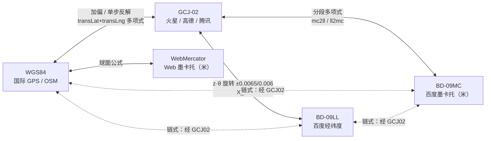

# i2f-geo

> **地理坐标转换与米度概算工具**（3 源文件约 433 行，零依赖、全仓零消费者）：
>
> - `CoordinateConvertor`（297 行）：五大坐标系互转的手工移植实现——**WGS84**（国际 GPS / OSM）/**GCJ-02**（火星坐标系，高德、腾讯）/**BD-09LL**（百度经纬度）/**BD-09MC**（百度墨卡托，米制）/**WebMercator**（Web 墨卡托，米制）。覆盖 **13 个专用转换方法**（6 对完整互转 + 1 个单向链 `BDMCToBD09`）与通用多项式求值 `convert`；核心算法为 GCJ-02 加偏多项式（`transLat`/`transLng` + 克拉索夫斯基椭球参数 `a`/`ee`）、单步近似反解、BD-09 旋转偏移（`X_PI`）、百度墨卡托分段多项式系数表（`mcband`/`mc2ll`/`llband`/`ll2mc`）；
> - `GeoUtil`（111 行）：以 38°N 纬圈为基准的「米 ↔ 度」概算常量与方法（9 常量 + 6 方法，含角度/弧度互转）；
> - `GeoPoint`（25 行）：极简 `lng`/`lat` 公有字段承载 + `parse(lng, lat)`。
>
> 头部注释注明「转换自 CoordinateConvertor.go」，为 Go 版坐标转换库的 Java 移植。模块处于**「备而未用」**状态：全仓零 `import i2f.geo` 消费者，仅模块注册（`i2f-jdk` modules、`i2f-jdk-all` 聚合、根 pom 版本托管）与 wiki 清单级提及。

## 模块定位

| 项 | 内容 |
|---|---|
| 坐标 | `i2f-jdk/i2f-geo` |
| 规模 | 3 源文件约 433 行（`CoordinateConvertor` 297 + `GeoUtil` 111 + `GeoPoint` 25），无 `src/test` 测试目录 |
| 包结构 | 单包 `i2f.geo`，3 个类 |
| 定位 | 中国区地图坐标系互转（GPS 纠偏、百度互转）+ 距离-度数概算 |
| 依赖 | **零依赖声明**——模块 POM 仅 24 行（`parent` + `maven-assembly-plugin`）；父链（`i2f-jdk`、根 `pom.xml`）均无全局 `<dependencies>` 继承节，编译期仅使用 JDK `Math` |
| 消费者 | **全仓零消费者**（详见「注册与消费关系」） |
| 打包 | `maven-assembly-plugin` → 继承根 pom `pluginManagement` 配置（3.1.0、`jar-with-dependencies`、`make-assembly` 绑定 `package`） |

## 依赖关系

模块 `pom.xml` 全文仅声明 `parent` 与 `build/plugins/maven-assembly-plugin`，无任何 `<dependency>`。三点核验：

1. **源码零 import**：3 个源文件无任何 `import` 语句（仅依赖 `java.lang.Math`）；
2. **父链零继承**：`i2f-jdk/pom.xml`（175 行）与根 `pom.xml`（1862 行）均未定义全局 `<dependencies>` 节——根 pom 仅以 `dependencyManagement` 做版本托管（lombok provided、Spring BOM imports、全部 i2f 模块 `${i2f.version}`）；
3. **打包插件**：模块声明 `maven-assembly-plugin` 无 version/configuration，完整配置由根 pom `pluginManagement` 提供（`finalName` 无 assemblyId 后缀、`jar-with-dependencies`、`make-assembly` execution 绑定 `package` 阶段）。因无依赖可打，fat-jar 与普通 jar 差异仅在 manifest 元数据。

## 包结构

```
i2f.geo
├── CoordinateConvertor   五大坐标系互转 + 判定 + 波段工具（297 行）
├── GeoUtil               38°N 基准米度换算常量与方法（111 行）
└── GeoPoint              经纬度承载（25 行）
```

## 类结构

| 类 | 行数 | 职责 | 关键 API |
|---|---|---|---|
| `CoordinateConvertor` | 297 | 坐标系互转、境内判定、波段选带 | 13 个专用转换 + `convert` + `isInChina`/`isInvalidGps`/`getLoop`/`getRange`/`transLat`/`transLng`/`main` |
| `GeoUtil` | 111 | 米 ↔ 度概算 | 9 常量 + `meter2lng`/`meter2lat38`/`lng2meter`/`lat382meter`/`angle2radian`/`radian2angle` |
| `GeoPoint` | 25 | 坐标承载 | 公有字段 `lng`/`lat`、双构造器、`parse(String lng, String lat)` |

## 坐标系转换拓扑

类头注释给出的转换结构（`BD09LL --- GCJ-02 --- WGS84`，自 BD09/GCJ 分别向下派生墨卡托系）：



| 方向对 | 方法 | 方式 |
|---|---|---|
| WGS84 ↔ GCJ-02 | `WGS84ToGCJ02` / `GCJ02ToWGS84` | 直连：偏移多项式加偏 / 单步近似反解 |
| GCJ-02 ↔ BD-09LL | `GCJ02ToBD09` / `BD09ToGCJ02` | 直连：复数旋转 + 0.0065/0.006 平移 |
| WGS84 ↔ BD-09LL | `WGS84ToBD09` / `BD09ToWGS84` | 链式（经 GCJ-02） |
| GCJ-02 ↔ BD-09MC | `GCJ02ToBDMC` / `BDMCToGCJ02` | 直连：分段二次多项式系数表 |
| WGS84 ↔ BD-09MC | `WGS84ToBDMC` / `BDMCToWGS84` | 链式（经 GCJ-02） |
| BD-09MC → BD-09LL | `BDMCToBD09` | 单向链式（反向需 `BD09ToGCJ02` → `GCJ02ToBDMC` 两步） |
| WGS84 ↔ WebMercator | `WGS84ToWebMC` / `WebMCToWGS84` | 直连：球面墨卡托公式 |

> 说明：GCJ-02 为国家保密偏移算法，无公开 EPSG 定义与官方实现，本模块采用业界通行的公开逆向拟合公式，中国区精度为米级；BD-09MC 系数表注释注明「由于 java 存在数据精度问题，所有数据下调 1000 倍」，其中含长整型字面量（`1704480524535203L` 等，自动加宽为 `double`）的行即该归一化处理的痕迹。

## 核心类详解

### CoordinateConvertor

#### 静态常量

| 常量 | 值 | 用途 |
|---|---|---|
| `INVALID_GPS_EXCEPTION` | `new RuntimeException("invalid gps!")` | 共享异常单例（见缺陷 #5） |
| `X_PI` | `π×3000/180 ≈ 52.3599` | BD-09 旋转偏移尺度 |
| `PI` | `3.1415926535897932384626` | 高精度 π（三角函数专用） |
| `a` | `6378245.0` | 克拉索夫斯基椭球长半轴（GCJ-02 加偏公式） |
| `ee` | `0.00669342162296594323` | 椭球偏心率平方 |
| `earthHalfCir` | `20037508.34` | WebMercator 半周长（对应 180°） |
| `mcband` | `{12890594.86, 8362377.87, 5591021, 3481989.83, 1678043.12, 0}` | BDMC→GCJ02 波段阈值 |
| `mc2ll` | 6×10 系数矩阵 | BDMC→GCJ02 分段多项式系数 |
| `llband` | `{75, 60, 45, 30, 15, 0}` | GCJ02→BDMC 波段阈值 |
| `ll2mc` | 6×10 系数矩阵 | GCJ02→BDMC 分段多项式系数 |

#### 判定方法

- `isInChina(lng, lat)`：矩形包围盒（经度 73.66~135.05、纬度 3.86~53.55），仅境内坐标施加 GCJ-02 偏移，境外原样返回；
- `isInvalidGps(lng, lat)`：经度超出 ±180 或纬度超出 ±90 即非法，直接抛出共享异常。

#### GCJ-02 加偏（`WGS84ToGCJ02`）

对 `(lng−105, lat−35)` 求偏移分量，再以椭球参数换算为经纬度增量：

```text
dlat = transLat(lng−105, lat−35);  dlng = transLng(lng−105, lat−35)
radlat = lat/180·π;  magic = 1 − ee·sin²(radlat);  sqrtMagic = √magic
dlat = dlat·180 / ((a·(1−ee))/(magic·sqrtMagic)·π)
dlng = dlng·180 / (a/sqrtMagic·cos(radlat)·π)
GCJ = (lng + dlng,  lat + dlat)
```

其中 `transLat`/`transLng` 为公开的正弦级数多项式（可独立调用复用）。

#### GCJ-02 去偏（`GCJ02ToWGS84`）

先按加偏公式求得加偏点 `(mglng, mglat)`，再以**单步近似反解**回推：

```text
WGS ≈ (lng·2 − mglng,  lat·2 − mglat)
```

偏移函数非线性不可解析求逆，该方法不做迭代收敛，属 Go 版移植的通用近似策略（残差见缺陷 #6）。

#### BD-09 旋转偏移（`GCJ02ToBD09` / `BD09ToGCJ02`）

以极坐标形式绕原点旋转并平移常量偏移：

```text
GCJ→BD: z = √(x²+y²) + 0.00002·sin(y·X_PI)
        θ = atan2(y, x) + 0.000003·cos(x·X_PI)
        BD = (z·cosθ + 0.0065,  z·sinθ + 0.006)
BD→GCJ: x = lng − 0.0065;  y = lat − 0.006
        z = √(x²+y²) − 0.00002·sin(y·X_PI)
        θ = atan2(y, x) − 0.000003·cos(x·X_PI)
        GCJ = (z·cosθ,  z·sinθ)
```

#### WebMercator（`WGS84ToWebMC` / `WebMCToWGS84`）

球面墨卡托正反解：正向 `x = lng·earthHalfCir/180`、`y = ln(tan((90+lat)·π/360))·earthHalfCir/π`；反向 `lng = x/earthHalfCir·180`、`lat = 180/π·(2·atan(exp(y·π/180)) − π/2)`。

#### BD-09MC 分段多项式（`GCJ02ToBDMC` / `BDMCToGCJ02` + `convert`）

按纬度（或墨卡托 y）落入的波段选择对应系数行，套用**统一的 8 项多项式**求值：

```text
选带（BDMC→GCJ）: |y| ≥ mcband[i]        → 系数行 mc2ll[i]
选带（GCJ→BDMC）:  normalize 后 lat ≥ llband[i]（南半球取 −llband[i]）→ ll2mc[i]
求值（convert）:   tlng = f0 + f1·|x|
                   cc   = |y| / f9
                   tlat = Σ(i=0..6) f(i+2)·cc^i
                   最后按输入符号还原负值
```

`convert` 为两表共用的通用求值入口，`getLoop(lng, −180, 180)` 做经度环绕归一、`getRange(lat, −74, 74)` 做纬度夹取。

#### API 总览

| 方法 | 返回 | 说明 |
|---|---|---|
| `GCJ02ToWGS84(lng, lat)` | `GeoPoint` | 高德/腾讯坐标 → GPS |
| `WGS84ToGCJ02(lng, lat)` | `GeoPoint` | GPS → 高德/腾讯 |
| `GCJ02ToBD09(lng, lat)` | `GeoPoint` | GCJ-02 → 百度经纬度 |
| `BD09ToGCJ02(lng, lat)` | `GeoPoint` | 百度经纬度 → GCJ-02 |
| `BD09ToWGS84(lng, lat)` / `WGS84ToBD09(lng, lat)` | `GeoPoint` | 百度 ↔ GPS（链式） |
| `WGS84ToWebMC(lng, lat)` / `WebMCToWGS84(x, y)` | `GeoPoint` | Web 墨卡托互转 |
| `BDMCToGCJ02(x, y)` / `GCJ02ToBDMC(lng, lat)` | `GeoPoint` | 百度墨卡托 ↔ GCJ-02 |
| `BDMCToWGS84(x, y)` / `WGS84ToBDMC(lng, lat)` | `GeoPoint` | 百度墨卡托 ↔ GPS（链式） |
| `BDMCToBD09(x, y)` | `GeoPoint` | 百度墨卡托 → 百度经纬度（单向链） |
| `convert(lng, lat, f)` | `GeoPoint` | 通用多项式求值（内部契约，见缺陷 #8） |
| `isInChina` / `isInvalidGps` / `getLoop` / `getRange` / `transLat` / `transLng` | `boolean` / `double` | 判定与波段工具 |

### GeoUtil

以「38°N 纬圈」为基准的地表距离概算（类注释保留原始推导：地球半径 6371000m、周长 2πR = 40030173m、38°N 纬圈周长 = 周长×cos38° = 31544206m）：

| 常量 | 值 | 含义 |
|---|---|---|
| `COS_38` | `angle2radian(38)` = 0.6632… | 名义「cos38°」，**实为 38° 的弧度值**（见缺陷 #2） |
| `EARTH_RADIUS_METER` | 6371000 | 地球平均半径（米） |
| `EARTH_LENGTH_METER` | 40030173 | 地球周长（米，2πR） |
| `LAT38_EARTH_LENGTH_METER` | 31544206 | 38°N 纬圈周长（米） |
| `LNG_EARTH_LENGTH_METER` | 40030173 | 赤道周长（米） |
| `ONE_METER_EQUAL_LNG` | 0.00001141 | 1 米 ≈ 多少经度（38°N 基准） |
| `ONE_METER_EQUAL_LAT38` | 0.00000899 | 1 米 ≈ 多少纬度（子午线基准） |
| `ONE_LNG_EQ_METER` | 111194.926644558737 | 1 度 ≈ 多少米（πR/180，子午线每度长） |
| `ONE_LAT38_EQ_METER` | 73745.7…（`111194.926644 × COS_38`） | 名义「1 经度 ≈ 多少米（38°N）」，**应约 87622.8**（见缺陷 #2） |

| 方法 | 公式 | 说明 |
|---|---|---|
| `meter2lng(m)` | `m × 0.00001141` | 米 → 经度（38°N） |
| `meter2lat38(m)` | `m × 0.00000899` | 米 → 纬度 |
| `lng2meter(°)` | `° × 111194.926644` | 度 → 米（子午线每度长口径） |
| `lat382meter(°)` | `° × ONE_LAT38_EQ_METER` | 度 → 米（受缺陷 #2 影响偏小约 15.8%） |
| `angle2radian(a)` / `radian2angle(r)` | `a/180·π` / `r/π·180` | 角度/弧度互转 |

### GeoPoint

极简坐标承载类：公有可变字段 `lng`/`lat`、无参 + 全参双构造器、静态 `parse(String lng, String lat)`（参数顺序为 **经度在前**，与主流的 `(lat, lng)` 习惯相反，易误用；非法输入直抛 `NumberFormatException`）。

## 坐标系速查

| 坐标系 | 典型来源 | 说明 |
|---|---|---|
| WGS84 | GPS 原始定位、OSM、国际标准 | 国际大地坐标系 |
| GCJ-02 | 高德、腾讯、Google 中国 | 国家测绘局保密偏移（火星坐标系） |
| BD-09LL | 百度地图 API 经纬度 | GCJ-02 上再次旋转偏移 |
| BD-09MC | 百度瓦片、POI 内部坐标 | 百度墨卡托（米） |
| WebMercator | OSM/Google 切片、WMTS | Web 标准球面墨卡托（米） |

## 注册与消费关系

| 位置 | 内容 |
|---|---|
| `i2f-jdk/pom.xml` L80 | `<module>i2f-geo</module>` |
| `i2f-jdk-all/pom.xml` L267-270 | 全量聚合依赖 |
| 根 `pom.xml` L434-438 | `${i2f.version}` 版本托管 |
| `.wiki/docs/module-i2f-jdk.md` L233 | 清单描述「地理位置」 |
| 源码消费者 | **无**（全仓 `import i2f.geo` 0 处；`CoordinateConvertor`/`GeoUtil` 仅模块自身出现） |

## 使用示例

```java
// 1. GPS 原始定位（WGS84）纠偏为高德/腾讯坐标（GCJ-02）
GeoPoint amap = CoordinateConvertor.WGS84ToGCJ02(119.4051577, 26.0201633);

// 2. 百度经纬度（BD-09LL）互转
GeoPoint bd09 = CoordinateConvertor.WGS84ToBD09(119.4051577, 26.0201633);
GeoPoint back = CoordinateConvertor.BD09ToWGS84(bd09.lng, bd09.lat);

// 3. 百度墨卡托坐标（BD-09MC）还原经纬度（正坐标输入正常；负坐标受缺陷 #4 影响）
GeoPoint gcj = CoordinateConvertor.BDMCToGCJ02(13291300.0, 2988000.0);

// 4. Web 墨卡托（瓦片系）互转
GeoPoint mc = CoordinateConvertor.WGS84ToWebMC(119.4051577, 26.0201633);
GeoPoint wgs = CoordinateConvertor.WebMCToWGS84(mc.lng, mc.lat);

// 5. 米 ↔ 度概算（38°N 基准，注意常量缺陷 #2/#3）
double dLng = GeoUtil.meter2lng(500);     // 500 米 ≈ 0.005705° 经度

// 6. 字符串解析（注意参数顺序：经度在前）
GeoPoint p = GeoPoint.parse("119.4051577", "26.0201633");
```

## 已知缺陷

| # | 级别 | 位置 | 问题 |
|---|---|---|---|
| 1 | 严重 | `GCJ02ToBDMC` | **南半球必抛异常**：北纬选带循环对 `lat < 0` 无命中，回退选带却被 `if (f.length > 0)` 守卫拦截（对照 `BDMCToGCJ02` 同型代码用的是 `== 0`，应为笔误），系数数组为空 → `convert` 抛 `INVALID_GPS_EXCEPTION`。`WGS84ToBDMC`/`GCJ02ToBDMC` 对所有南纬输入全部失败 |
| 2 | 严重 | `GeoUtil.COS_38` | 常量值为 `angle2radian(38)` = 0.6632（38° 的弧度）而非 `cos(38°)` = 0.7880，导致 `ONE_LAT38_EQ_METER` = 73745.7（正确应 ≈ 87622.8），`lat382meter` 输出偏小约 15.8% |
| 3 | 中 | `GeoUtil` 换算对 | `meter2lng`/`lng2meter` 与 `meter2lat38`/`lat382meter` 均**非互逆**：38°N 纬圈基准（1.141e-5°/m）与子午线基准（111194.9 m/°）混用；`lng2meter` 名为「经度」却用子午线每度长（赤道口径），在 38°N 高估约 26.9% |
| 4 | 中 | `BDMCToGCJ02` | 入口 `Math.abs` 销毁符号：南/西半球负 BDMC 坐标输出恒为正；`convert` 内 `if (lng < 0)` 符号恢复分支在该调用路径下为死代码 |
| 5 | 中 | `INVALID_GPS_EXCEPTION` | 共享静态异常单例：栈帧冻结于类初始化时刻，抛出点无定位信息，多个失败路径复用同一实例 |
| 6 | 中 | `GCJ02ToWGS84` | 单步近似反解（`lng·2 − mglng`）：非线性加偏不可解析可逆，中国区典型残差 1~5 米级，未做迭代收敛 |
| 7 | 低 | `BDMCToGCJ02` | 回退选带分支为死代码：`abs` 后 y ≥ 0 恒命中 `mcband` 末位 0，等价官方 `f == null` 的回退逻辑不可达（与缺陷 #1 构成同型代码「一处死、一处错」） |
| 8 | 低 | `convert` | 公有暴露内部多项式契约：仅校验 `f.length == 0`，短于 10 的数组会 `ArrayIndexOutOfBoundsException`；`mc2ll`/`ll2mc` 两套异义系数共用同一入口，易误用 |
| 9 | 低 | `WebMCToWGS84` | 只校验 X 范围（±`earthHalfCir`）不校验 Y：超界 Y 经 `exp`/`atan` 静默吸附至极值附近，无异常提示 |
| 10 | 低 | `isInChina` | 矩形包围盒（73.66~135.05E / 3.86~53.55N）粗粒度近似，蒙古、中南半岛、孟加拉等境外区域落入框内会被误判为境内并施加 GCJ-02 偏移 |
| 11 | 低 | `GCJ02ToBD09`/`BD09ToGCJ02` | 未做境内外判断（BD-09 原则上仅中国区有意义），境外坐标同样被施加 ±0.0065/0.006 偏移 |
| 12 | 低 | `CoordinateConvertor.main` | 生产类残留演示 `main`：硬编码福州坐标，仅 `println("ok")` 无任何断言，充当「测试」 |
| 13 | 低 | 模块级 | 无 `src/test` 单元测试：互转回环精度、南/北半球边界纬度（如缺陷 #1）无回归保障 |
| 14 | 低 | `GeoPoint` | 公有可变字段、无 `equals`/`hashCode`/`toString`；`parse(lng, lat)` 与主流 `(lat, lng)` 顺序相反；非法输入直抛 `NumberFormatException` |
| 15 | 低 | 常量风格 | `a`/`ee` 单字母小写公有常量（命名规范偏离）；`X_PI` 基于截断 π（`3.14159265358979324`）与 `PI`（20 位有效数字）两套精度并存 |
| 16 | 低 | `GeoUtil` 其他 | 隐式公有构造器（工具类未私有化）；`ONE_METER_EQUAL_LAT38` 注释「基于北纬38度」误导——纬度每度米长全球近似恒定，与 38° 无关 |

## 与同类方案对比

| 方案 | 定位 | 坐标覆盖 | 依赖 | 说明 |
|---|---|---|---|---|
| `i2f-geo` | 中国区坐标系互转 + 距离概算 | WGS84/GCJ-02/BD-09LL/BD-09MC/WebMC | 零依赖 | 百度墨卡托分段多项式完整移植；缺陷见上表 |
| 百度官方 JS（BMap） | 浏览器端转换 | 同左 | 无 | 本模块系数表来源；JS 精度问题经系数下调 1000 倍规避 |
| proj4j | 通用投影库 | 数百种 EPSG 投影 | 需投影定义 | 不含 GCJ-02/BD-09（保密算法无 EPSG 定义） |
| GeoTools | GIS 全家桶 | 大而全 | 极重 | 同上，且以几何/格式能力为主，坐标系偏转非其职责 |
| coordtransform 等轻量移植 | 单文件工具 | 通常仅 WGS84/GCJ-02/BD-09 | 零 | 一般不含 BD-09MC/WebMercator |

## 总结

`i2f-geo` 是一个「小而全」的中国区地图坐标工具：以单包 3 类、零依赖的方式提供了从国际 GPS 到百度墨卡托的完整互转链，算法忠于公开逆向拟合版本，适用于地图应用中的定位纠偏、多平台坐标对齐与瓦片坐标换算。

但需注意两点：**其一**，`GCJ02ToBDMC` 的南半球缺陷（#1）与 `GeoUtil.COS_38` 的计算错误（#2）是两个影响正确性的实际问题，南纬场景与米度换算场景建议先修复再使用；**其二**，模块自创建以来处于零消费者状态，属全仓「备而未用」的基础设施之一。
