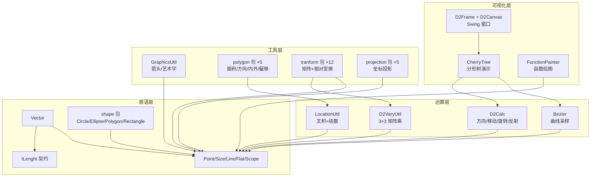

# i2f-graphics-2d

> **二维图形学基础库**（42 源文件约 2622 行，全部在 main，无测试目录）：纯 JDK + AWT 实现的 2D 几何工具箱，不依赖任何图形引擎，为上层（3D 渲染、验证码绘制、边界算法、图像处理、Windows 窗口计算）提供「几何原语 + 运算 + 工具」三层能力：
>
> - **几何原语层**：`Point`/`Size`/`Line`/`Flat`/`Scope`/`Vector` 六类基础模型 + `ILenght` 长度契约（拼写错误，见缺陷 #5）+ `shape` 包 4 形状（Circle/Ellipse/Polygon/Rectangle）；
> - **运算与工具层**：`D2Calc`（方向移动/旋转/反射）、`LocationUtil`（叉积定向 + 绕数法）、`Bezier`（Bernstein 基函数贝塞尔曲线采样）、`D2VaryUtil`（3×3 齐次矩阵乘点）、`GraphicsUtil`（箭头/艺术字/AffineTransform 栈式绘制）、5 个多边形工具（面积/时钟方向/凸凹/内外判定/外扩内缩）、投影体系 `IProjection` + 4 实现、变换体系 `ITransform` + 11 实现（含抽象矩阵基类与相对点/相对线组合变换）；
> - **应用与演示层**：`FunctionPainter`（直角坐标/极坐标/参数方程三模式函数图像绘制）、`CherryTree`（递归分形樱花树演示）、`D2Canvas`/`D2Frame`（Swing 可视化窗口）。
>
> 模块最大消费者是 **`i2f-graphics-3d`（19 文件）**——3D 渲染管线把 2D `Point`/`IProjection` 当作屏幕映射底座（`D3Painter.d2proj`），并复用 `Bezier` 采样与 `ILenght` 接口；次为 `i2f-verifycode`（10 文件）以 `GraphicsUtil` 绘制各类验证码。坐标系处理是模块的隐性主线：同时提供屏幕系（Y 向下）与数学系（Y 向上）两套判定/投影/换算方法，调用者必须成对选用。

## 模块定位

| 项 | 内容 |
|---|---|
| 坐标体系 | 屏幕坐标系（左上原点 Y 向下）与数学坐标系（中心/左下原点 Y 向上），投影类负责换算 |
| 几何原语 | Point/Size/Line/Flat/Scope/Vector + Circle/Ellipse/Polygon/Rectangle |
| 核心能力 | 2D 运算（D2Calc）、位置判定（LocationUtil/多边形工具）、贝塞尔曲线、2D 仿射变换（矩阵/直接双路径）、坐标投影、绘制辅助（箭头/艺术字）、函数绘图 |
| 可视化 | D2Canvas（BufferedImage 承载 Canvas）+ D2Frame（JFrame 宿主）+ CherryTree（演示） |

## 依赖关系

| 依赖 | 作用 | 使用点 |
|---|---|---|
| `lombok` | @Data/@NoArgsConstructor/@SneakyThrows | 14+ 数据类（Point/Size/Line/Flat/Scope/Vector/各 Projection/Transform/CherryTree 等） |
| `i2f-math` | `MathUtil` | `abs`/`rand`/`angle2radian`/`radian`/`regularRadian`/`distance`/`squareSum`/`RANDOM`（Bezier/D2Calc/CherryTree/GraphicsUtil/Line/Vector） |
| `i2f-color` | `Rgba` | 仅 `CherryTree` 颜色渐变插值 |
| `i2f-tuple-impl` | `Tuples`/`Tuple2` | 仅 `PolygonLocationTool.normalize` 返回双值（点 + 点列表） |

四个声明依赖全部真实使用，无冗余声明、无隐式传递依赖。

## 包结构

```
i2f.graphics.d2
├── (根，12 类)         Point Size Line Flat Scope Vector Bezier D2Calc
│                       D2VaryUtil GraphicsUtil LocationUtil CherryTree
├── function            FunctionPainter（函数图像绘制，3 模式）
├── polygon  (5 工具)    PolygonAreaTool PolygonClockDirectionTool PolygonClockTool
│                       PolygonLocationTool PolygonOffsetTool
├── projection          IProjection（接口）+ impl(MathCenterProjection / MathLeftDownProjection
│                       / MathOffsetProjection / ScreenProjection)
├── shape    (4 形状)    Circle Ellipse Polygon Rectangle
├── std                 ILenght（长度契约，拼写错误）
├── tranform            ITransform（接口）+ impl(AbstractMatrixTransform + MiscutTransform
│                       / MoveTransform / Reflect*Transform ×4 / Relative*Transform ×2
│                       / ScaleTransform / SpinTransform)
└── visual              D2Canvas D2Frame
```

## 类结构总览

| 类 | 行数 | 职责 | 关键方法 |
|---|---|---|---|
| `Point` | 57 | 点模型（x/y 双精度） | `move2`、静态 `add/sub/dotMul/crossMul/mul` |
| `Vector` | 88 | 二维向量（extends Point，implements ILenght） | `length`/`unitization`/`add`/`mul`/`cosRadian` |
| `Size` | 51 | 尺寸模型 | `adaptSize(src, dst)` 等比自适应 |
| `Line` | 46 | 直线（begin/end） | `length`/`dx`/`dy`/`direction`/`spin` |
| `Flat` | 25 | 三点平面 | — |
| `Scope` | 47 | 二维范围（点+尺寸） | `left/top/right/bottom` |
| `D2Calc` | 79 | 2D 运算门面 | `lineDirection`、`directionMove`、`offsetMove`、`lineSpin`、`reflectRadian` |
| `D2VaryUtil` | 30 | 3×3 齐次矩阵乘点 | `vary(p, matrix)` |
| `LocationUtil` | 57 | 点与线段/多边形位置（Y 向下） | `isLeft`（叉积定向）、`wind`、`windInPolygon` |
| `Bezier` | 67 | 贝塞尔曲线 | `bernstein`、`bezierPoint`、`resamples`、`samples`（自适应密度） |
| `GraphicsUtil` | 169 | AWT 绘制辅助 | `awtRadian`、`drawArrow`、`drawArtString`、`drawTransform`/`drawCenterString` |
| `CherryTree` | 181 | 递归分形樱花树演示 | `drawTree`、`drawBole`、`drawTreeNext`、`OnStepListener` |
| `FunctionPainter` | 380 | 函数图像绘制（模块最大文件） | `drawFunction`×5 重载、`FunctionType` 枚举 |
| `PolygonAreaTool` | 80 | 多边形面积（鞋带公式） | `getArea` |
| `PolygonClockDirectionTool` | 103 | 顺逆时针/凸凹判定 | `isClockwise`、`isConvex` |
| `PolygonClockTool` | 135 | 时钟序重排序（凸多边形） | `sortClock`、`centerPoint`、`reverseList` |
| `PolygonLocationTool` | 218 | 点在多边形/圆内判定 | `windOnUp/DownAxisY`、`windInPolygon*`、`windInCircle`、`normalize`、`geoDistance` |
| `PolygonOffsetTool` | 56 | 凸多边形外扩内缩 | `offset(points, offset)` |
| `IProjection` | 14 | 投影契约 | `projection(Point)`、`onSizeChange(w, h)` |
| 4 个 Projection 实现 | 35~36 | 屏幕/数学系投影 | 见「投影体系」节 |
| `ITransform` | 12 | 变换契约 | `transform(Point)` |
| `AbstractMatrixTransform` | 33 | 矩阵/直接双路径基类 | `transform`（enableMatrix 分派）、抽象 `matrix`/`trans` |
| 10 个 Transform 实现 | 31~57 | 平移/缩放/旋转/错切/反射×4/相对点/相对线 | 见「变换体系」节 |
| `Circle`/`Ellipse`/`Polygon`/`Rectangle` | 21~29 | 形状模型 | — |
| `ILenght` | 10 | 长度契约（拼写错误） | `length()` |
| `D2Canvas` | 35 | BufferedImage 承载画布 | `paint`/`update`（直接重绘，无擦除） |
| `D2Frame` | 43 | JFrame 宿主窗口 | `refresh`（canvas.repaint） |

## 架构与数据流



## 核心机制详解

### 基础几何原语

- **Point**：`x`/`y` 双精度 `@Data`（public 字段 + getter/setter 双访问路径），静态向量式运算 `add`/`sub`/`mul`/`dotMul`（点乘）/`crossMul`（叉乘），实例方法 `move2(length, direction)` 沿方向移动；
- **Vector**：`extends Point`（向量即自由点），实现 `ILenght`，提供 `unitization()` 单位化、`cosRadian` 余弦夹角（未做 clamp，浮点误差下可能超出 [-1,1] 但本方法直接返回比值不调 acos，暂无害）；
- **Scope**：`point + size` 左上角加尺寸模型，`left/top/right/bottom` 边界换算，是 `Ellipse`（外接矩形表示椭圆）与 `Rectangle` 的基类；
- 各原语 @Data 使字段既可 `p.x` 直访也可 `getX()`，两种风格在模块内混用。

### 运算层

- **D2Calc**：`lineDirection` 用 `atan2(dy, dx)` 得弧度方向；`directionMove` 沿方向的三角分解移动；`lineSpin` 以起点为中心旋转直线（终点绕行）；`reflectRadian(inRadian, flatRadian)` 反射角公式 `-i + 2m`（经 `MathUtil.regularRadian` 归一）；
- **LocationUtil**（Y 向下的屏幕系专用版本）：`isLeft(target, begin, end)` 叉积符号定向（>0 左 / <0 右 / =0 线上）；`wind` 绕数法（向上穿越且叉积>0 计 +1，向下穿越且叉积<0 计 -1）；`windInPolygon` 判定内部。**注意**：更完整的双坐标系版本在 `polygon.PolygonLocationTool`；
- **Bezier**：`bernstein(idx, cnt, rate)` 手算组合数 + 幂次（`cnt-j+1 > 0` 守卫处理越界系数归零）；`bezierPoint` 权重求和；`samples` 以曼哈顿距离 ×1.2 估算采样密度后 `resamples`——采样点率 `i/count` 不含终点 `t=1`（见缺陷 #6）；
- **D2VaryUtil.vary**：3×3 齐次矩阵乘点，采用「**行向量右乘** `p·M`」约定：`result[j] = Σ p[i]·m[i][j]`，再除以 `result[2]` 齐次归一。与列向量教材 `M·p`（平移在第三列）相反，本模块所有矩阵均按「平移在第三行」构造，自洽无误。

### 投影体系（IProjection）

| 实现 | 变换公式 | 坐标系语义 |
|---|---|---|
| `ScreenProjection(w, h)` | `(x, y)` 恒等 | 屏幕坐标，左上原点，Y 向下 |
| `MathCenterProjection(w, h)` | `(x + w/2, h/2 − y)` | 数学坐标，中心原点，Y 向上 |
| `MathLeftDownProjection(w, h)` | `(x, h − y)` | 数学坐标，左下原点，Y 向上 |
| `MathOffsetProjection(offX, offY)` | `(x + offX, offY − y)` | 数学坐标，自定义原点；`onSizeChange` 空实现（尺寸无关） |

`onSizeChange(width, height)` 供画布缩放时重设参数——`i2f-graphics-3d` 的 `D3Painter` 以此把世界坐标最终落到屏幕。

### 变换体系（ITransform）

`AbstractMatrixTransform` 以 `enableMatrix` 开关提供**双路径**：`true` 走 `D2VaryUtil.vary(p, matrix())` 矩阵运算，`false` 直接走 `trans(p)` 标量公式。两条路径结果一致（已逐一验证），矩阵路径便于与外部矩阵工具/组合变换衔接。

| 实现 | 构造参数 | 变换语义 |
|---|---|---|
| `MoveTransform` | `(dx, dy)` | 平移；矩阵第三行 `[dx, dy, 1]` |
| `ScaleTransform` | `(sx, sy)` | 缩放 |
| `SpinTransform` | `(angle)` | 旋转（弧度）；`trans` 为标准逆时针公式 `x·cos−y·sin, x·sin+y·cos` |
| `MiscutTransform` | `(bx, cy)` | 错切；`x' = x + cy·y`，`y' = bx·x + y` |
| `ReflectAxisXTransform` | — | 沿 X 轴反射（Y 取反） |
| `ReflectAxisYTransform` | — | 沿 Y 轴反射（X 取反） |
| `ReflectOriginTransform` | — | 原点反射（双取反） |
| `ReflectAxisTransform` | `(dx, dy)` | 组合轴反射；**不继承矩阵基类**，逐点 new X/Y 子变换串联 |
| `RelativeAnyPointTransform` | `(relPoint)` | 相对任意点：平移到原点 → 依次执行 `addTransform` 链 → 平移回 |
| `RelativeAnyLineTransform` | `(k, b)` | 相对直线 `y=kx+b`：平移过原点 → `spin(−atan(k))` 转到 X 轴 → 变换链 → 旋回 → 平移回 |

相对变换通过 `addTransform` 链式累积子变换（返回 this），是模块内唯一的组合式变换设计。

### 多边形工具集

- **PolygonAreaTool.getArea**：鞋带公式 `0.5·|Σ(xi·y(i+1) − yi·x(i+1))|`，不足 3 点或 null 返回 -1；
- **PolygonClockDirectionTool**：`isClockwise`/`isConvex` 以连续三点叉积统计正负（`upAxisY` 翻转 Y 后统一数学系语义），返回 0/±1 三态；
- **PolygonClockTool.sortClock**：中心点 + `atan2` 角度排序重构凸多边形顶点时钟序，注释声明"仅凸多边形"；`yAxisUp` 参数实现存在缺陷（见缺陷 #1）；
- **PolygonLocationTool**（模块内最大的多边形工具，218 行）：Y 向下（`windOnDownAxisY`）与 Y 向上（`windOnUpAxisY`）**两套平行实现**，`windInPolygonOnDown/UpAxisY(Point[], ...)` + List 重载（先 `normalize` 复制点集再转数组）、`windInCircle`（欧氏距离 ≤ 半径）、`geoDistance`（缩放 1000 倍再算距离的同构实现）。**参数序陷阱**：`isLeftOnUpAxisY(target, end, begin)` 刻意交换 begin/end 实现叉积反号（见缺陷 #4）；
- **PolygonOffsetTool.offset**：凸多边形外扩（正）/内缩（负）。算法：边向量单位化 → 相邻边向量差 ÷ 叉积正弦 `offset/sina` → 顶点沿角平分线方向平移。要求顶点按时钟序排列（逆序则 offset 取反）。无退化防护（见缺陷 #2）。

### 绘制工具 GraphicsUtil

- `awtRadian(bx, by, ex, ey)`：AWT 坐标系 0° 朝下与数学坐标系 0° 朝右的换算——通过交换 x/y 参数委托 `MathUtil.radian`；
- `drawArrow`：主线 + 终点两侧 ±30° 长 15% 的双翼箭头；
- `drawTransform(g, posX, posY, drawer, transConsumer)`：保存旧 `AffineTransform` → `translate(posX, posY)` → 委托消费者追加旋转/缩放/错切 → `setTransform` → 绘制 → **恢复旧变换**（非 Graphics2D save/restore 栈，而是显式 setTransform 回滚）；
- `drawArtString`：逐字符艺术字——每字符随机颜色（RGB 各 0~224）、随机旋转（±π/8）、随机缩放（0.5~1.5）、随机错切（0~0.5）、垂直随机抖动（±半字高）；`center` 模式先以自定义宽度换算器（默认 ×2）合计宽度再回退半宽居中；
- `drawCenterString`/`drawTransformString`：`drawTransform` 的居中/基线便捷封装。

### FunctionPainter（函数绘图）

三种 `FunctionType`：

| 模式 | 入参语义 | 映射器返回 |
|---|---|---|
| `CROSS`（默认） | x 为自变量 | `y1, y2, y3...` 多条直角坐标曲线 |
| `CENTER` | x 为角度 | `radius1, radius2...` 多条极坐标曲线 |
| `ARGUMENTS` | x 为参数 t | `x1, y1, x2, y2...` 参数方程（奇数尾项丢弃） |

流程：`[beginX, endX]` 按 `accX` 步进采样 → 按曲线序号分组 → 统计全局 min/max → 线性变换映射到画布（X 拉伸、Y 翻转）→ 绘制浅灰网格线（含刻度文字）+ 蓝色 X 轴 + 红色 Y 轴 → 每条曲线随机深色绘制。Infinity/NaN 采样值被粗粒度替换（Infinity→width/height、NaN→0）。5 个重载从 `(beginX, endX, accX, mapper)` 逐级补全默认值（1080×720、TYPE_INT_RGB、20×20 网格）。

### 可视化与演示

- **D2Canvas**：`extends Canvas` 持有 `BufferedImage`，`paint` 全量 `drawImage`、`update` 直接转 `paint`（无擦除经典闪烁问题——但因绘制源本身就是双缓冲图像，实际无闪烁；动画残留取决于绘制方是否全量重绘）；
- **D2Frame**：`JFrame` 包装（固定尺寸、不可缩放、位置 (0,0)、EXIT_ON_CLOSE），`refresh()` 触发 canvas 重绘；
- **CherryTree**：递归分形樱花树——每层 `2~3` 个分支（`rand%2+2`）、长度每层衰减至 70%~94%、方向随机 ±60°、枝干用 4 点贝塞尔曲线采样后逐像素/小圆填充，颜色按层级在 startColor（深）→ endColor（亮）间插值，`OnStepListener` 每步回调（演示中 sleep 5ms + 窗口刷新）。默认 `level=12` 的分支规模见缺陷 #10。

## 消费关系

| 消费者模块 | 文件数 | 使用内容 |
|---|---|---|
| `i2f-graphics-3d` | 19 | `Point`/`IProjection`/`MathCenterProjection`——`D3Painter.d2proj` 把 3D 投影结果映射到屏幕；`D3Line`/`D3Vector` 复用 `ILenght`；`SpinBezierCube` 复用 `Bezier` 采样 |
| `i2f-verifycode` | 10 | `GraphicsUtil`（`drawArtString`/`drawCenterString`/`drawArrow`/`drawTransform`/`awtRadian`）+ `Point`——艺术字、点阵、极坐标、算式类验证码 |
| `i2f-algo` | 5 | `Point`/`Circle`/`Polygon`/`PolygonLocationTool`——边界二分算法的点在圆/多边形内判定 |
| `i2f-native-windows` | 4 | `Point`/`Size`/`Rectangle`——`WinApi` 窗口坐标与矩形结构映射 |
| `i2f-image-impl` | 2 | `Point`——`RectangleNormalizeImageFilter` 四点透视归一化取点、`SeedReplaceColorImageFilter` 洪水填充队列 |
| `i2f-native-windows-easyx` | 1 | `Point`/`Size`/`Rectangle`——EasyX 绘图 API 坐标参数 |
| `i2f-graphics`（聚合壳） | 0 | 无源码，仅声明 `i2f-graphics-2d` + `i2f-graphics-3d` 依赖 |

注册：`i2f-jdk/pom.xml` modules L82、`i2f-jdk-all` 聚合 L277、根 `pom.xml` 版本托管 L446。

## 使用示例

```java
// 1. 点/向量基础运算
Point p = new Point(3, 4);
Point q = p.move2(5, Math.PI / 2);           // 沿 90° 方向移动 5
Vector v = new Vector(p, q);                  // p→q 向量
double len = v.length();                      // 模长
Vector unit = v.unitization();                // 单位向量
double cos = Vector.cosRadian(new Vector(1, 0), unit);

// 2. 相对任意点做旋转变换（链式组合）
ITransform trans = new RelativeAnyPointTransform(false, new Point(100, 100))
        .addTransform(new SpinTransform(false, Math.PI / 4))   // 绕 (100,100) 旋转 45°
        .addTransform(new ScaleTransform(false, 1.5, 1.5));    // 再放大 1.5 倍
Point np = trans.transform(new Point(120, 100));

// 3. 点在多边形内判定（Y 向上的数学系/经纬度）
List<Point> polygon = Arrays.asList(
        new Point(0, 0), new Point(10, 0), new Point(10, 10), new Point(0, 10));
boolean inside = PolygonLocationTool.windInPolygonOnUpAxisY(new Point(5, 5), polygon);

// 4. 坐标投影：数学系坐标转屏幕像素
IProjection proj = new MathCenterProjection(1080, 720);
Point screen = proj.projection(new Point(-200, 300));   // x+540, 360-y

// 5. 绘制函数图像（直角坐标模式，三条曲线叠加）
BufferedImage img = FunctionPainter.drawFunction(
        -25, 5, 0.2,                     // x 范围与步进
        1080, 720, null,                 // 宽高、复用图像
        15, 15,                          // X/Y 网格数量
        FunctionPainter.FunctionType.CROSS,
        (x) -> new double[]{Math.sin(x), Math.cos(x), Math.pow(1.12, x)});

// 6. 箭头与居中文字（Graphics2D 环境）
Graphics2D g = img.createGraphics();
GraphicsUtil.drawArrow(g, 100, 100, 400, 300);
GraphicsUtil.drawCenterString(g, "终点", 400, 300, null);   // transConsumer 可空
```

## 已知缺陷

| # | 级别 | 类 / 方法 | 问题 |
|---|---|---|---|
| 1 | 中 | `PolygonClockTool.sortClock` | `yAxisUp` 的 if/else 两分支代码**完全相同**（复制粘贴错误），参数完全无效——注释声称"Y 轴向下，需要逆反容器顺序"但实现未做，Y 向下坐标系（如屏幕系）调用者会得到与声明相反的方向结果 |
| 2 | 中 | `PolygonOffsetTool.offset` | 相邻边共线（`sina=0`）或 180° 折返时 `offset/sina` 产生 Infinity/NaN 坐标；零长边时 `1/vecLen` 除零；无 `size<3` 校验 |
| 3 | 中 | `FunctionPainter.drawFunction` | `for (x = beginX; x <= endX; x += accX)`——`accX=0` 时**无限循环**（仅负值取反，零值无防护）；`accX` 非常大时静默只采一个点 |
| 4 | 中 | `PolygonLocationTool.isLeftOnUpAxisY` | 参数顺序刻意颠倒为 `(target, end, begin)`（借叉积反号实现 Y 轴翻转），与孪生方法 `isLeftOnDownAxisY(target, begin, end)` 参数序**不一致**，极易误用导致左右判定反向 |
| 5 | 低 | `std.ILenght` | 接口名拼写错误（Length→Lenght）且已被 `i2f-graphics-3d` 的 `D3Line`/`D3Vector` 复用**传染扩散**，更名成本随消费面扩大 |
| 6 | 低 | `Bezier.resamples`/`samples` | 采样率 `i/count` 最大 `(count-1)/count < 1`，**不包含终点 t=1**（曲线末端缺失一个采样点）；`samples` 中 `count=(int)len` 当曲线尺度 <1 时返回空列表 |
| 7 | 低 | `PolygonLocationTool.normalize`/`geoDistance` | `normalize` 含 6+ 处 `setX(getX())` 自赋值 no-op 死代码（疑似历史坐标转换残留）；`geoDistance` 的 scale=1000 等比例缩放再除 1000 与直接计算**数学等价**，注释"减少浮点精度问题"无实据 |
| 8 | 低 | `PolygonClockDirectionTool` | 连续三点叉积 `cp == 0`（共线）时归入 else 分支按逆时针计数（`count++`/`flag|=2`），含共线点的多边形方向/凸凹判定受系统性偏差影响 |
| 9 | 低 | `D2VaryUtil.vary` | `resultVector` 声明为 4 元素但仅用 3（"第四维度置 1"注释无对应实现）；`/resultVector[2]` 齐次除法因 w 恒 1 成为无操作 |
| 10 | 低 | `CherryTree` | 递归树每层 2~3 分支 × 12 层 ≈ 2^12~3^12 个枝干，每枝干逐像素 `setRGB` + 多次 `stepListener`（演示中 5ms sleep），默认参数实际渲染将达分钟级 |
| 11 | 低 | `PolygonClockTool` | 自定义 `Pair` 内部类重复造轮子（模块已依赖 i2f-tuple-impl）；`lineDirection` 重复实现 `D2Calc.lineDirection`；`centerPoint` 空列表返回 NaN（0/0）；`reverseList` 原地修改传入列表产生调用方可见副作用 |
| 12 | 低 | `GraphicsUtil.drawArtString` | `int ox` 在居中测量与正式绘制两段重复声明与重复累计逻辑；`drawTransformString` 内 `getStringBounds` 混用外层 `g` 与 `gdi` 参数（同一对象，仅为风格不一致） |
| 13 | 低 | 多个类 | `FunctionPainter`（main + 3 个 test* 方法会写 `./tmp.png`）、`CherryTree`（main 弹窗）、`PolygonAreaTool`（main）、`PolygonClockTool`（main）共 4 个类残留调试入口混入主 jar |
| 14 | 低 | `Size.adaptSize` | `(int)` 强转截断而非四舍五入；目标尺寸含 0 时比值 Infinity/NaN 无防护 |
| 15 | 低 | 原语类族 | `Point`/`Size`/`Line`/`Flat`/`Scope` 等 @Data 同时暴露 getter/setter 与 public 字段双访问路径，模块内两种风格混用；`Point.move2` 等命名质量一般 |
| 16 | 低 | 全模块 | 无任何单元测试（42 文件全在 main）——花键公式/绕数法/矩阵双路径一致性等均有回归价值，仅靠 4 个 main 演示类手工验证 |

## 与同类方案对比

| 维度 | i2f-graphics-2d | java.awt.geom | 第三方库（JTS/GeoTools 等） |
|---|---|---|---|
| 定位 | 通用轻量 2D 几何 + 屏幕映射工具集 | JDK 内置绘制几何基元 | 专业空间计算（拓扑/测地） |
| 坐标系 | 显式区分屏幕系/数学系并提供投影换算 | 仅屏幕系 | 数学系为主 |
| 多边形判定 | 绕数法（双坐标系两套）+ 面积/方向/凸凹/偏移 | 无 | 完整拓扑运算（求交/并/差） |
| 变换 | 矩阵/标量双路径 + 相对点/相对线组合 | AffineTransform（列向量约定） | 齐全 |
| 局限 | 无拓扑运算、无退化防护、无测试 | 无几何分析 | 体积大、学习成本高 |

## 总结

`i2f-graphics-2d` 以「纯 JDK、零图形引擎依赖」的姿态覆盖了 2D 几何从原语到可视化演示的完整链条：约 2600 行中近半是实用工具（多边形 5 件套、变换 11 实现、投影 4 实现、绘制辅助），风格是**直白的手工数学实现 + 双坐标系平行 API**——不追求拓扑完备性，胜在零依赖、可读、可拆用。其真实价值被下游充分证明：3D 引擎的屏幕映射底座、10 个验证码生成器的绘制库、边界算法的判定内核。需要警惕的是坐标系契约——同一语义常有 Up/Down 两个版本方法（参数序还有颠倒特例），选错不会报错只会得到相反结果；4 个中危缺陷（sortClock 参数失效、offset 退化除零、accX=0 死循环、参数序陷阱）均为「输入边界 + 复制粘贴」型问题，接入前建议先为这几个路径补回归测试。
