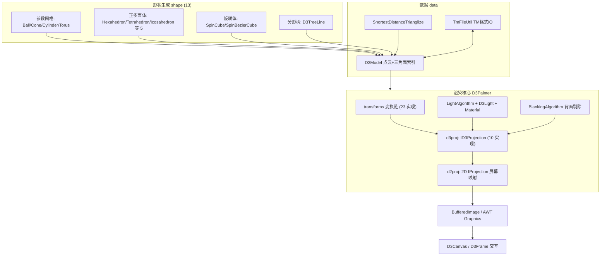

# i2f-graphics-3d 三维图形学基础库

> 模块路径：`i2f-jdk/i2f-graphics-3d`
> 源文件：74 个 Java 文件、约 4798 行（全部位于 `src/main`，无测试目录）

## 摘要

`i2f-graphics-3d` 是 i2f-jdk 体系中的**三维图形学基础库**，建立在零图形引擎依赖的纯 JDK + AWT/Swing 之上：向上游复用 `i2f-graphics-2d` 的二维原语（`Point`/`Line`/`Flat`）、拼写继承的 `ILenght` 长度契约、`Bezier` 采样与 `IProjection` 屏幕映射，构成「**3D 世界坐标 →（ID3Projection）3D→2D 投影 →（2D IProjection）屏幕映射 → BufferedImage**」三级渲染管线。核心 `D3Painter` 严格按「**先变换 → 再隐面/材质/光照 → 最后投影**」的顺序绘制「点云 + 三角面索引」模型 `D3Model`，配套提供：与 2D 模块同族约定的 4×4 齐次变换工具 `D3VaryUtil`（「行向量右乘」，平移在第四行）、10 种投影（三视图/正交/斜投影/一·二·三点透视/任意视角）、23 种变换（点变换 + 坐标系变换双体系）、Phong 光照系统（9 种预置灯 × 29 种预置材质 + 背面剔除）、13 种形状生成器（参数化网格/正多面体/旋转体/分形树）、最短距离散点三角化与 Swing 交互窗体 `D3Frame`。

需要特别注意两点：其一，本模块**全仓零 Java 消费者**——除聚合壳 `i2f-graphics` 的 POM 声明外，没有任何模块 `import i2f.graphics.d3.*`，属于纯叶子模块；其二，本模块缺陷密度较高，尤其是**三个旋转类 `SpinX/Y/ZTransform` 的标量路径因变量覆盖写出错误结果**（且 `enableMatrix=false` 标量路径恰是默认路径），详见「已知缺陷」。

## 模块定位

| 维度 | 说明 |
| --- | --- |
| 定位 | 三维图形学基础库（三维原语/矩阵变换/投影/光照/形状/三角化/软件渲染） |
| 规模 | 74 源文件约 4798 行，9 个包；全部在 main、无单元测试 |
| 技术栈 | 纯 JDK 8 + AWT/Swing（`BufferedImage`/`Graphics`/`Canvas`/`JFrame`）；零图形引擎依赖 |
| 上游依赖 | i2f-graphics-2d（核心复用）、i2f-math、i2f-color、lombok |
| 下游消费者 | **全仓零 Java 消费者**（纯叶子模块）；仅被聚合壳 i2f-graphics 与 i2f-jdk-all 以 POM 方式聚合 |
| 注册点 | i2f-jdk `modules` L83、根 pom 版本托管 L451、i2f-jdk-all L281、i2f-graphics L22 |
| 分界线 | i2f-graphics 为纯聚合壳（无源码，声明 2d + 3d 依赖） |

## 依赖关系

| 依赖 | 使用点 |
| --- | --- |
| org.projectlombok:lombok | `@Data`/`@NoArgsConstructor`（15+ 数据类：D3Point/D3Line/D3Flat/D3Vector/全部投影与变换实现/部分形状类） |
| i2f.turbo:i2f-color | `Rgba`（D3Painter 点/线/填充三色与 `clean` 背景；`D3Color.of/rgba` 与 [0,1] 浮点色互转；`D3TreeLine.drawTree` 按层级染色） |
| i2f.turbo:i2f-math | `MathUtil`（`distance` 三维距离/`squareSum`/`angle2radian`/`regularRadian`/`PI`/`rand`/`randPercent`/`angleTriangle` 余弦定理求角） |
| i2f.turbo:i2f-graphics-2d | `Point`（投影返回值/屏幕基元）、`Line`/`Flat`（投影降维结果）、`ILenght`（D3Line/D3Vector 实现，继承 2D 拼写错误）、`IProjection` + `MathCenterProjection`（`d2proj` 屏幕映射默认实现）、`Bezier.resamples`（SpinBezierCube 采样） |

4 个声明依赖全部真实使用，无冗余声明。

## 包结构（9 包 / 74 类）

| 包 | 文件数 | 内容 |
| --- | --- | --- |
| `i2f.graphics.d3` | 10 | 三维原语 `D3Point`/`D3Size`/`D3Scope`/`D3Line`/`D3Flat`/`D3Vector`/`D3SphericalPoint` + 运算 `D3Calc`/`D3VaryUtil` + 渲染核心 `D3Painter` |
| `i2f.graphics.d3.data` | 3 | `D3Model`（点云 + 三角面索引）/`D3ModelFlat`/`TmFileUtil`（TM 文本格式读写） |
| `i2f.graphics.d3.light` | 4 | `D3Color`（[0,1] 浮点色）/`D3Light`（9 种预置灯）/`Material`（29 种预置材质）/`LightAlgorithm`（Phong 光照，单灯 + 多灯两版） |
| `i2f.graphics.d3.projection` | 12 | `ID3Projection`/`IViewPointProjection` 接口 + impl 10 种投影（含 `AbstractMatrixProjection` 基类） |
| `i2f.graphics.d3.shape` | 13 | `Ball`/`Cone`/`Cylinder`/`Torus`/`SpinCube`/`SpinBezierCube`/`D3TreeLine` + 正多面体 `Hexahedron`/`Tetrahedron`/`Octahedron`/`Dodecahedron`/`Icosahedron` |
| `i2f.graphics.d3.transform` | 30 | `ID3Transform` + `AbstractMatrixTransform` + impl 23（含 `org` 子包坐标系变换 5） |
| `i2f.graphics.d3.triangle` | 2 | `ITrianglize`/`ShortestDistanceTrianglize`（296 行，最短距离散点三角化） |
| `i2f.graphics.d3.visible` | 1 | `BlankingAlgorithm`（背面剔除） |
| `i2f.graphics.d3.visual` | 2 | `D3Canvas`（AWT Canvas）/`D3Frame`（Swing 交互窗体） |

## 类结构总览

### 根包：三维原语与运算

| 类 | 行数 | 职责 | 关键点 |
| --- | --- | --- | --- |
| `D3Point` | 43 | 三维点 (x,y,z) | `projection(ID3Projection)` 降维；`point2spherical` 转球坐标（`aAngle=acos(z/r)`、`bAngle=atan(y/x)`） |
| `D3Size` | 25 | 三维尺寸 dx/dy/dz | 纯数据 |
| `D3Scope` | 22 | 三维范围（point + size） | 纯数据 |
| `D3Line` | 48 | 三维线段 | `implements ILenght`（复用 2D 接口）；`length()` 三维距离；`projection` 降维为 `d2.Line`；`dx/dy/dz` |
| `D3Flat` | 46 | 三维三角平面（p1/p2/p3） | `projection` 降维为 `d2.Flat`；`normalLine()` = (p1→p2)×(p2→p3) |
| `D3Vector` | 150 | 三维向量 | **继承 `D3Point`** 并 `implements ILenght`；实例 + 静态双份运算：`unitization`/`add`/`mul`（点乘/数乘）/`mulCross`（叉乘）/`cosRadian`/`normalLine` |
| `D3SphericalPoint` | 36 | 球坐标（radius / aAngle 极角 / bAngle 方位角） | `spherical2point`：`y=r·sin a·sin b`、`z=r·cos a`、`x=r·sin a·cos b` |
| `D3Calc` | 37 | 移动运算 | `directionMove`（球坐标分解）+ `offsetMove` |
| `D3VaryUtil` | 89 | 矩阵与透视工具 | `vary`（4×4 行向量右乘）、`projWorldOrgToViewOrg`、`projViewOrgToScreenOrg`、`viewOrgToDeepScreenD3Org`（伪深度） |
| `D3Painter` | 378 | **渲染核心** | 三级管线 + 变换链 + 颜色状态 + 光照/剔除开关 |

### 数据包

| 类 | 行数 | 职责 |
| --- | --- | --- |
| `D3Model` | 28 | 「点云 `points` + 三角面索引 `flats`」模型 |
| `D3ModelFlat` | 24 | 三角面（三个顶点下标 p1/p2/p3） |
| `TmFileUtil` | 81 | TM 文本格式读写：头行「点数 面数 附加参数」+ 点行 + 面行 |

### 光照包

| 类 | 行数 | 职责 |
| --- | --- | --- |
| `D3Color` | 41 | [0,1] 浮点 RGB；`of(Rgba)`/`rgba()` 互转 |
| `D3Light` | 125 | 光源（diff/spec/c0/c1/c2/point/enable）；静态预置：`gold/silver/redGemstone/greenGemstone/blueGemstone/purpleGemstone/moon/sun/white` |
| `Material` | 339 | 材质（diff/spec/ambi/heigN 高光指数）；静态预置 29 种：金属（金/银/铬/铜/黄铜/青铜）、宝石（红/绿/蓝/紫/翠/玉/松石/黑曜石/珍珠）、塑料 5 色、橡胶 6 色、snow/stone 及 OpenGL 材质表金/银 |
| `LightAlgorithm` | 127 | Phong 光照：`light(单灯)` + `light(多灯列表)`；漫反射 + 半角镜面 + 距离衰减 + 环境光 + 颜色归一 |

### 投影包（10 实现）

| 实现 | 类型 | 投影结果 | 双路径一致性 |
| --- | --- | --- | --- |
| `OrthogonalProjection` | 正投影 | (x, y) 去 z | 一致 |
| `MainViewProjection` | 三视图·主视图 | (z, y)（矩阵路径 `beforeMatrixReturn` 交换 XZ） | 一致 |
| `SideViewProjection` | 三视图·侧视图 | 标量 (z, −x) / 矩阵 (−x, y) | **不一致** |
| `TopViewProjection` | 三视图·俯视图 | 标量 (−x, −y) / 矩阵 (z, −x) | **不一致** |
| `ObliqueProjection` | 斜投影 | x − z·cos b / tan a；y − z·sin b / tan a | 一致 |
| `OnePointProjection` | 一点透视 | 视点 (0°, 90°)，经世界→观察→屏幕两步 | 一致 |
| `TwoPointProjection` | 二点透视 | 视点 (45°, 90°) | 一致 |
| `ThreePointProjection` | 三点透视 | 视点 (45°, 45°) | 一致 |
| `WorldOrgToScreenOrgProjection` | 任意视角 | 全参数 (r, d, aAngle, bAngle) | 一致 |

基类 `AbstractMatrixProjection`：`enableMatrix` 开关双路径（矩阵 `vary` vs 标量 `proj`），`beforeMatrixReturn` 钩子（三视图 `swapXZ`）。

### 变换包（23 实现）

点变换：

| 实现 | 行数 | 语义 | 矩阵特征 |
| --- | --- | --- | --- |
| `MoveTransform` | 43 | 平移 (mx,my,mz) | 第四行 `[mx,my,mz,1]` |
| `ScaleTransform` | 44 | 缩放 (sx,sy,sz) | 对角矩阵 |
| `SpinTransform` | 38 | 三轴复合旋转 | 依次 SpinX → SpinY → SpinZ |
| `SpinXTransform` | 44 | 绕 X 轴旋转 sx | 含 `cos/sin` 反对称块；**标量路径有变量覆盖缺陷** |
| `SpinYTransform` | 43 | 绕 Y 轴旋转 sy | 同上 |
| `SpinZTransform` | 44 | 绕 Z 轴旋转 sz | 同上 |
| `MiscutAxisTransform` | 45 | 六参错切复合 | 依次 X → Y → Z |
| `MiscutAxisXTransform` | 41 | 沿 X 错切（x += xdy·y + xgz·z） | — |
| `MiscutAxisYTransform` | 41 | 沿 Y 错切（y += ybx·x + yhz·z） | — |
| `MiscutAxisZTransform` | 41 | 沿 Z 错切（z += zcx·x + zfy·y） | — |
| `ReflectAxisTransform` | 45 | 轴反射组合（布尔 rx/ry/rz） | 委托 X/Y/Z 单轴实现 |
| `ReflectAxisXTransform` | 35 | 对 X 轴反射 (x, −y, −z) | 对角 (1,−1,−1) |
| `ReflectAxisYTransform` | 36 | 对 Y 轴反射 (−x, y, −z) | 对角 (−1,1,−1) |
| `ReflectAxisZTransform` | 35 | 对 Z 轴反射 (−x, −y, z) | 对角 (−1,−1,1) |
| `ReflectFlatTransform` | 45 | 平面反射组合（布尔 xoy/yoz/xoz） | 委托三平面实现 |
| `ReflectFlatXoYTransform` | 35 | 对 XOY 平面反射 | z 取反 |
| `ReflectFlatYoZTransform` | 35 | 对 YOZ 平面反射 | x 取反 |
| `ReflectFlatXoZTransform` | 35 | 对 XOZ 平面反射 | y 取反 |
| `RelativeAnyPointTransform` | 47 | 相对任意参考点变换 | 平移至原点 → `addTransform` 链式 → 平移回 |
| `RelativeAnyLineTransform` | 68 | 相对任意参考线变换 | 平移到原点 → 绕 Y/乘 X 旋转对齐 → 链式 → 旋回 → 回移 |

坐标系变换（`transform.impl.org` 子包，与点变换互为逆操作）：

| 实现 | 语义 |
| --- | --- |
| `OrgMoveTransform` | 坐标系平移（等价点平移取反，第四行 `[−mx,−my,−mz,1]`） |
| `OrgSpinTransform` + `OrgSpinX/Y/ZTransform` | 坐标系旋转（等价点旋转取反），**标量路径实现正确（使用原值 `p.y/p.z`）**，可作 `SpinX/Y/Z` 错误实现的对照 |

基类 `AbstractMatrixTransform`：`enableMatrix` 双路径（矩阵 `matrix()` + 标量 `trans()`），所有实现默认 `enableMatrix=false`（标量路径）。

### 形状包（13 生成器）

| 类别 | 类 | 参数 | 生成方式 |
| --- | --- | --- | --- |
| 参数网格 | `Ball` | 半径 | 两模式：经纬网格 `makeModel(aAngleCount, bAngleCount)`；二十面体递归细分 `makeModel(level)`（中点单位化投射回球面） |
| | `Cone` | radius/height | 侧面环（随高度线性缩小）+ 下底面圆盘 |
| | `Cylinder` | radius/height | 侧面环 + 上/下底面圆盘 |
| | `Torus` | r1/r2 | 环面参数方程（大小环双重角度） |
| 正多面体 | `Hexahedron`/`Tetrahedron`/`Octahedron`/`Dodecahedron`/`Icosahedron` | 缩放 a | 手写顶点表 + 三角面索引表（十二/二十面体带黄金比 b=0.61828a） |
| 旋转体 | `SpinCube` | 2D 点列 | 2D 曲线绕 X 轴（`y→(y·cosθ, y·sinθ)`）或绕 Y 轴（`x→(x·cosθ, x·sinθ)`）旋成 |
| | `SpinBezierCube` | 2D 控制点 | `Bezier.resamples` 采样后交 SpinCube（**SpinY 方法误调 SpinX**） |
| 分形 | `D3TreeLine` | 起始线段 + 层数 | 递归分叉：每枝 2~5 子枝、长度 50%~100% 父枝、方向 ±60° 随机偏移、随层级随机裁剪；`modelize()` 可转为 D3Model |

### 三角化与可视化

| 类 | 行数 | 职责 |
| --- | --- | --- |
| `ShortestDistanceTrianglize` | 296 | 最短距离散点三角化：索引按 axis（默认 Y）排序 → 每点为轴心取最近邻层两点组面 → 角度过滤（>90° 剔除）+ 唯一性去重 + 双向两轮 |
| `BlankingAlgorithm` | 24 | 背面剔除：面法向（v1×v2）与视向（p1→视点）归一化点乘 cos，>0 可见 |
| `D3Canvas` | 33 | AWT Canvas，覆写 `paint`/`update` 直画 `painter.hdc` |
| `D3Frame` | 310 | Swing 交互窗体：Alt+X/Y/Z+滚轮旋转、Ctrl+X/Y/Z+滚轮平移、Shift+X/Y/Z+滚轮单轴缩放、滚轮整体缩放、Ctrl+Space 重置；`OnDraw` 回调 + `refresh()` |

## 架构图



## 核心机制详解

### 1. 三级渲染管线（D3Painter）

绘制顺序遵循源码头注释：「**先变换 transform → 再隐面/背面剔除/材质/贴图/纹理/光照 → 最后投影**」。

```java
// D3Painter 核心方法链
D3Point trans(D3Point p);                  // 1. 依次应用 transforms 列表（disableTransform 可短路）
Point   proj(D3Point p);                   // 2/3. d3proj.projection(p) → d2proj.projection(2D点)
D3Painter drawPoint / drawLine / drawPolyline / drawPolygon / drawFillPolygon;  // 屏幕基元
D3Painter drawModelPoints / drawModelLines / drawModelFlats;                    // 模型绘制
```

- 构造：`D3Painter(BufferedImage, ID3Projection[, IProjection])` 或 `D3Painter(int width, int height, ID3Projection)`（自建 `TYPE_4BYTE_ABGR` 图像；`d2proj` 缺省用 `MathCenterProjection` 数学中心坐标系）。
- **注意颜色状态**：`pointColor`/`lineColor`/`fillColor` 字段无默认值，必须在 `clean()`/`drawPoint()`/`drawLine()`/`drawFlat()` 之前 set，否则 NPE（详见缺陷 #6）。
- `drawModelLines`：每面转 3 点 → `trans` → 可选背面剔除 → 画三角形边框。
- `drawModelFlats`：同上，光照开启时用 `LightAlgorithm.light(...)` 计算颜色并**写回 `fillColor`**（会覆盖用户设定值）→ `drawFlat` 填充。
- 默认配置：视点 `D3SphericalPoint(500, 60°, 45°)`、银色灯位于 (0,0,500)、材质 `yellowRubber`、环境光纯黑、`enableLighting=true`、`enableBlanking=false`。
- `drawAxis(double length)`：逐点绘制三色坐标轴（超视距不翻转但效果差）；`drawAxisLine`：2D 库画线版本（`disableTransform=true` + 硬编码 50 偏移）。

### 2. 4×4 齐次矩阵约定（D3VaryUtil）

与 2D 模块 3×3 约定同族：**行向量右乘** `p' = p · M`，代码为 `result[j] = Σᵢ p[i]·M[i][j]`，**平移量位于矩阵第四行** `[mx, my, mz, 1]`（与列向量教材恰好转置）。

```java
public static D3Point vary(D3Point p, double[][] matrix) {
    if (matrix.length < 4) return p;                    // 静默容错：矩阵不合格时原样返回
    double[] pointVector = {p.x, p.y, p.z, 1.0};
    double[] resultVector = {0, 0, 0, 0};
    for (int i = 0; i < 4; i++)
        for (int j = 0; j < 4; j++) {
            if (matrix[i].length < 4) return p;
            resultVector[j] += pointVector[i] * matrix[i][j];
        }
    for (int i = 0; i < 4; i++) resultVector[i] /= resultVector[3];   // 齐次归一（透视除法）
    return new D3Point(resultVector[0], resultVector[1], resultVector[2]);
}
```

配套三个透视工具（均带 `useMatrix` 双路径）：

| 方法 | 语义 | 矩阵/标量要点 |
| --- | --- | --- |
| `projWorldOrgToViewOrg(useMatrix, p, r, aAngle, bAngle)` | 世界坐标 → 观察坐标 | 视径 r、水平角 aAngle、垂直角 bAngle；矩阵第四行 `[0,0,r,1]` 携带视距 |
| `projViewOrgToScreenOrg(useMatrix, p, d)` | 观察坐标 → 屏幕（数学）坐标 | 透视除法 `x'=d·x/z`；矩阵 `M[2][3]=1/d` 配合 w 归一 |
| `viewOrgToDeepScreenD3Org(p, d, Near, Far)` | 带深度屏幕坐标（伪深度 z） | **非静态方法（漏 static）**；近远裁剪面映射 |

### 3. 投影体系（ID3Projection，10 实现）

接口极小：`Point projection(D3Point point)`——即「3D → 2D 数学坐标」；`IViewPointProjection` 附加 `viewPoint()` 返回球坐标视点。

- **双路径基类** `AbstractMatrixProjection`：`enableMatrix=true` 走 `vary(p, matrix())` 后经 `beforeMatrixReturn` 钩子（三视图在此 `swapXZ` 把 yoz 结果换到 xoy 显示）；`false` 走直接标量 `proj(p)`。设计意图是两路径结果等价（便于教学对照矩阵与公式），但 **SideView/TopView 两实现不等价**（缺陷 #2）。
- **透视家族**（一点/二点/三点/任意视角）：由固定视点角度组合两步变换。一点 (0°,90°)、二点 (45°,90°)、三点 (45°,45°)；`WorldOrgToScreenOrgProjection` 暴露全参数 (r, d, aAngle, bAngle) 为通用实现——其 `matrix()` 即「世界→观察→屏幕」两个矩阵的乘积合成。

### 4. 变换体系（ID3Transform，23 实现）

- **双路径基类** `AbstractMatrixTransform`：`enableMatrix` 开关（矩阵 `matrix()` / 标量 `trans()`），默认 `false`（标量）。
- **旋转三兄弟的严重缺陷**：`SpinX/Y/ZTransform.trans()` 均用「已被第一行覆盖的局部变量」计算第二分量，例如 SpinX：

```java
// 错误实现（实际代码）：
y = y * Math.cos(sx) - z * Math.sin(sx);   // y 已被更新
z = y * Math.sin(sx) + z * Math.cos(sx);   // 用的是新 y 而非原 y！
// 对照 org 子包 OrgSpinXTransform 的正确写法：
y = p.y * Math.cos(sx) + p.z * Math.sin(sx);
z = p.z * Math.cos(sx) - p.y * Math.sin(sx);  // 直接引用 p.y/p.z 原值
```

后果：`sx=90°` 时点 (0,1,0) 标量路径被旋到原点 (0,0,0)（正确应为 (0,0,1)）。矩阵路径与标量「意图」公式其实一致，纯粹是变量覆盖笔误；由于默认走标量路径，`D3Frame` 的交互旋转同样受影响。

- **复合变换**：`SpinTransform` 依次 X→Y→Z；`MiscutAxisTransform` 依次 X→Y→Z；`ReflectAxisTransform`/`ReflectFlatTransform` 按布尔位选择性委托单轴/单面实现。
- **相对变换**：`RelativeAnyPointTransform`（平移→链式→回移，`addTransform` 返回 this 支持链式）；`RelativeAnyLineTransform` 通过球坐标把参考线对齐后再链式变换（列了 3 步去程 + 3 步回程）。
- **坐标系变换（org 子包）**：`OrgMoveTransform`/`OrgSpinTransform` 系列与点变换互为逆操作（如 OrgSpin = Spin(−θ)），标量实现正确可用作对照。

### 5. 光照系统与背面剔除

Phong 光照两版实现（单灯 / 多灯列表）：

```java
// 单灯版核心步骤（LightAlgorithm.light 第一版）
1. 漫反射：light.diff * material.diff * max(N·L, 0)
2. 镜面反射：light.spec * material.spec * max(N·H, 0)^material.heigN   // H 为光向量与视向量半角
3. 距离衰减：1 / (c0 + c1·d + c2·d²)，封顶 1
4. 环境光：+ ambi * material.ambi
5. 颜色归一：把 (r,g,b) 当向量做 unitization（模长拉到 1）
```

- 多灯版逐灯累加（`light.enable=false` 时以 `material.diff` 平替该灯贡献）；**单灯版不检查 `enable` 字段**（缺陷 #9）。
- 颜色归一使最终色偏亮/失真（丢失强度），属实现特点兼缺陷（缺陷 #9）。
- `BlankingAlgorithm.visible(viewPoint, flat)`：返回 `cos(面法向, 视线)`，`D3Painter` 以 `> 0` 判定可见；注释写「叉积」但实现是归一化点乘（缺陷 #12）。
- 光照位置传入的是 `viewPoint.point()`（相机球坐标转直角坐标）。

### 6. 模型系统与 TM 格式

- `D3Model` = `List<D3Point> points`（点云，描述顶点）+ `List<D3ModelFlat> flats`（三角面，仅存三个顶点索引），是形状生成器、三角化器、渲染器之间的通用交换结构。
- `TmFileUtil` 文本格式：

```text
第一行：点数 面数 附加参数（附加参数读取后未使用）
后续点行：x y z（double）
后续面行：p1 p2 p3（索引）
```

- `load(File/InputStream)` / `save(File/OutputStream)`；写出用 `%f`（固定 6 位小数，精度截断）。

### 7. 形状生成器（13 个）

- **参数网格类**：`Ball`（经纬网格两重循环；或二十面体递归细分——每面分裂 4 子面、中点投射回球面）、`Cone`/`Cylinder`（侧面环 + 底面/顶面圆盘）、`Torus`（双重角）。
- **正多面体**：顶点表 + 三角面索引表手写常量，十二/二十面体顶点使用黄金比例 b = 0.61828a。
- **旋转体**：`SpinCube` 把 2D 曲线点列绕 X 或 Y 轴按 `angleCount` 等分角旋成；`SpinBezierCube` 先用 `Bezier.resamples(points, sampleCount)` 采样再旋成。
- **分形树** `D3TreeLine`：`makeTree(begin, level)` 递归生成 `TreeBole` 列表，`drawTree` 按层级插值颜色（真实缺陷见 #8），`modelize()` 转 D3Model（三角面退化为线）。

### 8. 散点三角化（ShortestDistanceTrianglize，296 行）

```text
输入 D3Model（点云，可选已有三角面）
1. 索引排序：按 axisValue（默认 Y 轴）降序排列点索引
2. 一轮（正/逆双向可选）：对每个点 i，收集「轴向距离差 ≥ levelMinHeight」的其余点，
   计算距离后升序排序，取相邻最近的两两组合 (j1, j2) 与 i 组建三角面
3. 过滤：三点不重复 + 组合唯一（排序索引拼接 key 去重）+ 最大角 ≤ maxTriangleAngleLimit（默认 90°）
4. 每点最多生成 pointConstructFlatCount（默认 1）个新面
```

`includeSourceTriangles=true` 时并入原始面——但实现存在**重复添加**缺陷（见 #3）。适合「按高度分层的点云」（如地形采样）快速组网。

### 9. 可视化（D3Canvas / D3Frame）

- `D3Canvas` 继承 AWT `Canvas`：`paint` 直画 `painter.hdc`，`update` 覆写为直接调 `paint`（防闪烁双缓冲惯用法）。
- `D3Frame` 继承 `JFrame`：构造时初始化 6 个变换（Spin/Move/Scale/MiscutAxis/ReflectAxis/ReflectFlat，全部 `enableMatrix=false` 标量路径）装入 `painter.transforms`，注册键盘与滚轮监听：

| 操作 | 效果 |
| --- | --- |
| Alt + X/Y/Z + 滚轮 | 绕 X/Y/Z 轴旋转（±5°/次，弧度归一化） |
| Ctrl + X/Y/Z + 滚轮 | X/Y/Z 方向平移（±5/次） |
| Shift + X/Y/Z + 滚轮 | 单轴缩放（×1.01 / ×0.99） |
| 单独滚轮 | 三轴等比缩放 |
| Ctrl + Space（松开时） | 重置全部变换 |

- 业务方实现 `OnDraw` 回调（在 `refresh()` 内被调用）绘制场景；`setVisible(true)` 需自行调用（构造函数未包含）。

## 使用示例

### 1. 最小渲染管线（手写三角面）

```java
BufferedImage img = new BufferedImage(800, 600, BufferedImage.TYPE_4BYTE_ABGR);
D3Painter painter = new D3Painter(img, new ThreePointProjection(false, 500, 800));
painter.setPointColor(Rgba.rgb(255, 0, 0));    // 必须先设置颜色，否则 clean/draw 会 NPE
painter.setLineColor(Rgba.rgb(0, 255, 0));
painter.setFillColor(Rgba.rgb(30, 30, 60));
painter.clean();

D3Flat flat = new D3Flat(
        new D3Point(0, 0, 100),
        new D3Point(200, 0, 100),
        new D3Point(0, 200, 100));
painter.drawFlatLine(flat);   // 画三角形边框（lineColor）
painter.drawFlat(flat);       // 填充三角面（fillColor）
ImageIO.write(img, "png", new File("out.png"));
```

### 2. 绘制内置形状（光照 + 背面剔除）

```java
D3Model model = new Icosahedron().makeModel(100);          // 二十面体
D3Painter painter = new D3Painter(800, 600, new ThreePointProjection(false, 500, 800));
painter.setLineColor(Rgba.rgb(96, 96, 96));
painter.setFillColor(Rgba.rgb(255, 224, 189));
painter.enableBlanking = true;                             // 背面剔除
painter.enableLighting = true;                             // 光照（drawModelFlats 内自动算色）
painter.material = Material.gold();
painter.lights = new ArrayList<>(Arrays.asList(D3Light.sun(new D3Point(300, 300, 500))));
painter.drawModelFlats(model);
```

### 3. 变换链与相对点旋转

```java
D3Painter painter = new D3Painter(800, 600, new WorldOrgToScreenOrgProjection(
        false, new D3SphericalPoint(500, MathUtil.angle2radian(60), MathUtil.angle2radian(45)), 500));
painter.transforms.add(new SpinTransform(false, 0, 0, MathUtil.angle2radian(30)));
painter.transforms.add(new ScaleTransform(false, 2, 2, 2));
painter.transforms.add(new MoveTransform(false, 0, 100, 0));

// 相对任意点旋转 45°（点绕参考点做变换后回移）
RelativeAnyPointTransform rot = new RelativeAnyPointTransform(false, new D3Point(100, 0, 0));
rot.addTransform(new SpinXTransform(false, MathUtil.angle2radian(45)));
D3Point np = rot.transform(new D3Point(200, 0, 0));
```

### 4. 投影切换与手动换算

```java
// 三视图（注意 SideView/TopView 在 enableMatrix=true 时结果不同，见缺陷 #2）
ID3Projection top   = new TopViewProjection(false);
ID3Projection three = new ThreePointProjection(false, 500, 500);

Point p2 = new D3Point(100, 100, 100).projection(three);   // 3D → 2D 数学坐标
// 再经 2D 屏幕映射（等价于 D3Painter.proj 第二步）
Point screen = new MathCenterProjection(800, 600).projection(p2);
```

### 5. TM 模型读写与三角化

```java
D3Model cloud = TmFileUtil.load(new File("cloud.tm"));     // 点云（可含原始面）

ShortestDistanceTrianglize trianglize = new ShortestDistanceTrianglize();
trianglize.levelMinHeight = 20;                            // 邻层最小轴向间距
trianglize.maxTriangleAngleLimit = 90;                     // 钝角剔除阈值
trianglize.enableDoubleDirectTrianglize = true;            // 双向两轮
D3Model model = trianglize.trianglize(cloud);

TmFileUtil.save(new File("model.tm"), model);
```

### 6. 交互窗体（D3Frame）

```java
D3Frame frame = new D3Frame(800, 600, (painter, canvas, f) -> {
    painter.clean(Rgba.rgb(0, 0, 0));
    painter.setLineColor(Rgba.rgb(0, 255, 0));
    painter.setFillColor(Rgba.rgb(200, 180, 120));
    painter.drawModelFlats(new Hexahedron().makeModel(100));
}, new ThreePointProjection(false, 500, 800));
frame.setVisible(true);   // 构造函数不含 setVisible，需自行调用
frame.refresh();          // 触发 OnDraw + 重绘
// 交互：Alt+X/Y/Z+滚轮旋转；Ctrl+X/Y/Z+滚轮平移；滚轮缩放；Ctrl+Space 重置
```

## 消费关系

经全仓 PowerShell 检索确认（`import i2f\.graphics\.d3` 排除模块自身）：

- **零 Java 消费者**：没有任何模块的 Java 源码引用本模块类。i2f-graphics-3d 是当前已完成文档模块中少见的**纯叶子模块**。
- 关联方仅为聚合配置：
  - `i2f-jdk/pom.xml` L83：`<module>i2f-graphics-3d</module>`；
  - 根 `pom.xml` L451：版本托管（`${i2f.version}`）；
  - `i2f-jdk-all/pom.xml` L281：全仓聚合；
  - `i2f-graphics/pom.xml` L22：聚合壳声明 2d + 3d 依赖（无源码）。
- 反向依赖方向明确：本模块的 `D3Line`/`D3Vector` 实现了 2D 的 `ILenght`（继承其拼写错误），`D3Point.projection` 返回 2D `Point`，`SpinBezierCube` 复用 2D `Bezier`。

## 已知缺陷

| # | 级别 | 位置 | 问题 | 影响 |
| --- | --- | --- | --- | --- |
| 1 | **中** | `SpinXTransform`/`SpinYTransform`/`SpinZTransform.trans()` | 标量路径第二分量用「已被覆盖的局部变量」计算（如 `z = y·sin + z·cos` 中 y 已更新），应为原始 `p.y/p.z`；矩阵路径与 `org.OrgSpinX/Y/Z`（正确写法）可对照证明是笔误 | `enableMatrix=false`（默认）时旋转结果错误：90° 旋转可把 (0,1,0) 映射为原点；`D3Frame` 默认交互路径直接受影响 |
| 2 | **中** | `SideViewProjection`/`TopViewProjection` | `enableMatrix` 双路径结果不一致：SideView 标量 (z,−x) vs 矩阵 (−x,y)；TopView 标量 (−x,−y) vs 矩阵 (z,−x)（MainView/Oblique/Orthogonal 经推导验证一致） | 切换矩阵开关得到不同投影；三视图语义混乱 |
| 3 | **中** | `ShortestDistanceTrianglize.trianglize` | `includeSourceTriangles=true` 时先 `trangles.addAll(mod.flats)`，再对每个原始面调 `filterAndSaveTriangle` 二次追加（首轮 contains 为空必然通过） | 原始三角面在结果中出现两次：重复渲染、光照叠算 |
| 4 | **中** | `SpinBezierCube.makeModelSpinY` | 内部调用 `new SpinCube(samplePoints).makeModelSpinX(angleCount)`——复制粘贴错误 | 「绕 Y 轴旋转体」实际生成绕 X 轴结果，两方法等价 |
| 5 | **中** | `Cuboid.makeModel` | `for (int i = 0; i <= dx; i += (dx / xcnt))` 用 int 变量接收 double 步长（复合赋值截断） | 步长 < 1 时（如 dx=10, xcnt=20）i 恒不变死循环；同时坐标被 int 量化（第二/三组循环边界 `<=`/`<` 混用） |
| 6 | **中** | `D3Painter` | `pointColor`/`lineColor`/`fillColor` 无默认值，三个构造函数都未初始化 | 未先 `setXxxColor` 就调 `clean()`/`drawPoint()`/`drawLine()` 抛 NPE |
| 7 | 低 | `D3Point.point2spherical` | 方位角用 `Math.atan(y/x)` 而非 `atan2`；`radius=0` 时 `acos(NaN)` | x=0 除零、x<0 象限错误（第三象限映射到第一象限）；与 `spherical2point` 不完全互逆 |
| 8 | 低 | `D3TreeLine.drawTree` | alpha 通道用 `beginColor.r`（应为 `beginColor.a`）；`wid` 计算后从未使用 | 透明度随红色通道变化；线宽参数完全无效 |
| 9 | 低 | `LightAlgorithm` | 单灯版不检查 `light.enable`（多灯版检查）；两版末尾把颜色当向量 `unitization` 归一 | 禁用的灯仍参与单灯计算；颜色模长被拉平导致亮度/饱和度失真（丢失强度信息） |
| 10 | 低 | `D3VaryUtil.viewOrgToDeepScreenD3Org` | 同族方法全为 static，此方法漏写 `static`；注释「第四维度置为1」与实际齐次归一实现不符 | Util 类需实例化才能调用；注释误导 |
| 11 | 低 | `D3Vector` | 继承 `D3Point`（向量 is-a 点）且叠加 `@Data`；`unitization`/`cosRadian` 无零长度保护 | 父类 equals/hashCode 对称性破坏；零向量产生 NaN |
| 12 | 低 | `BlankingAlgorithm` | 注释称「计算面法向量与视向量之间的叉积」，实现为归一化点乘 cos（`nl.cosRadian(sv)`） | 注释与实现不符，误导维护者 |
| 13 | 低 | `D3Painter` | `lights = Arrays.asList(...)` 固定长度列表；`drawModelFlats` 光照直接覆写 `fillColor`（污染用户状态）；`getD2()` 每次新建 `Graphics` 不 `dispose` | 运行期无法增删灯；颜色状态被隐蔽覆盖；AWT 句柄泄漏 |
| 14 | 低 | `TmFileUtil` | 头行 `argsNum` 读取后未使用；`save` 用 `%f` 固定 6 位小数 | 元数据静默丢弃；坐标精度截断 |
| 15 | 低 | `Cone`/`Cylinder` | 底面圆盘 `for (i < radiusCount)` 中 i=0 时中心点重复 `angleCount` 次；侧面环 j 含端点重复首尾点 | 点云冗余（重复顶点），三角化/渲染浪费 |
| 16 | 低 | `Ball`/模块整体 | `makeModel(level)` 以 `tranglesVec.get(0)` + `remove(0)`（ArrayList O(n) 搬移）消费队列，整体 O(n²)，循环变量 i 未用；模块无任何单元测试且零消费者 | 细分性能差；代码质量无回归保障（另有 D3Frame 注释「Shit」拼写、D3Calc 注释参数名不全等文档瑕疵） |

## 对比

| 维度 | i2f-graphics-3d | JOGL/LWJGL | JavaFX 3D |
| --- | --- | --- | --- |
| 渲染方式 | **纯软件光栅**（`BufferedImage.setRGB`/AWT `drawLine`/`fillPolygon`） | OpenGL 硬件加速 | 硬件加速场景图 |
| 依赖 | 零引擎依赖（仅 JDK + 2D 模块） | native 库 | JavaFX 运行时 |
| 特性覆盖 | 点/线/面/向量、矩阵、10 投影、23 变换、Phong 光照、背面剔除、形状库、三角化 | 完整 GPU 管线 | 完整 3D 场景图/材质/动画 |
| 适用场景 | 教学演示、算法验证、离线小图渲染（如验证码/图表风格化） | 高性能 3D 应用 | 桌面 3D 应用 |
| 缺陷密度 | 较高（16 条，含 6 条中级） | — | — |

## 总结

`i2f-graphics-3d` 是作者自研的三维图形学「全栈」教学/工具库：从三维原语、齐次矩阵、投影与变换双体系，到光照、形状生成、三角化与 Swing 交互渲染一应俱全，整体结构与 2D 模块一脉相承（同样的双路径设计、同样的「行向量右乘」约定、同样的双坐标系痕迹），是研究软件渲染管线 CV（chip verify）与学习图形学公式实现的好素材。

但需要注意：模块目前**无任何业务消费者**，且存在 6 条中级缺陷——其中 `Spin` 三兄弟的标量路径错误（#1）与双路径不一致（#2）直接影响默认路径的正确性，使用前建议先在 `enableMatrix` 两条路径上交叉验证结果，或优先参考 `org` 子包的正确实现纠正 `trans()` 写法。
