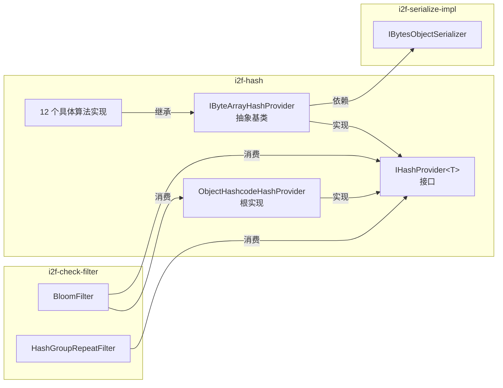

# i2f-hash

> **非加密哈希算法工具箱**——15 源文件约 402 行，纯 JDK + `i2f-serialize-impl`，全 main 无测试。提供泛型 `IHashProvider<T>` 契约 + 12 种经典非加密哈希算法（AP/BKDR/Boost/BP/DEK/DJB/ELF/FNV/JS/PJW/RS/SDBM），通过 `IBytesObjectSerializer` 序列化桥接实现任意对象→字节→哈希值。被 `i2f-check-filter` 模块的 BloomFilter 与 HashGroupRepeatFilter 消费。

---

## 模块定位

- **功能**：提供统一非加密哈希接口与多样化经典算法实现，供布隆过滤器/重复过滤器等数据结构消费
- **所属层级**：`i2f-jdk` 工具层，位于集合/过滤子系统的上游

## 依赖关系

| 依赖 | 类型 | 用途 | 是否真实使用 |
|------|------|------|-------------|
| `lombok` | 编译期 | — | **未使用**（零注解引用） |
| `i2f-serialize-impl` | 编译+运行 | 提供 `IBytesObjectSerializer` 接口，被 `IByteArrayHashProvider` 用于将对象序列化为字节数组 | **是**（全部 12 个具体实现均通过构造器注入） |



## 包结构

```
i2f.hash                  # 根包：核心接口 + 基础实现（2 文件）
├── IHashProvider.java          (10 行) 核心泛型接口
└── ObjectHashcodeHashProvider.java (16 行) 委托 Object.hashCode()

i2f.hash.impl             # 实现包：字节数组哈希家族（13 文件）
    ├── IByteArrayHashProvider.java (29 行) 抽象基类：序列化 + hashBytes()
    ├── ApHashProvider.java         (27 行) Arash Partow 哈希
    ├── BkdrHashProvider.java       (27 行) Brian Kernighan & Dennis Ritchie 哈希
    ├── BoostHashProvider.java      (43 行) C++ Boost 库哈希（最复杂）
    ├── BpHashProvider.java         (25 行) Berkeley PD 哈希
    ├── DekHashProvider.java        (25 行) Donald E. Knuth 哈希
    ├── DjbHashProvider.java        (26 行) Daniel J. Bernstein 哈希
    ├── ElfHashProvider.java        (31 行) Unix ELF 符号表哈希
    ├── FnvHashProvider.java        (28 行) Fowler–Noll–Vo 哈希
    ├── JsHashProvider.java         (26 行) Justin Sobel 哈希
    ├── PjwHashProvider.java        (35 行) Peter J. Weinberger 哈希
    ├── RsHashProvider.java         (29 行) Robert Sedgewick 哈希
    └── SdbmHashProvider.java       (25 行) SDBM 哈希
```

## 架构设计

### 双层泛型架构

```
IHashProvider<T>                    ← 核心接口
  ├── long hash(T obj)             ← 唯一抽象方法
  │
  ├── ObjectHashcodeHashProvider<T> ← 直接实现：委托 obj.hashCode()
  │
  └── IByteArrayHashProvider<T>     ← 抽象基类：序列化桥接
        └── abstract long hashBytes(byte[] data)
              │
              ├── ApHashProvider     ← 字节级直接计算
              ├── BkdrHashProvider   ← 多项式累加
              ├── BoostHashProvider  ← 置换表+多步混合
              ├── BpHashProvider     ← 移位异或
              ├── DekHashProvider    ← 循环移位异或
              ├── DjbHashProvider    ← 33 倍累加
              ├── ElfHashProvider    ← 4 位移位+高 4 位折叠
              ├── FnvHashProvider    ← 乘法异或
              ├── JsHashProvider     ← 异或+移位+加法
              ├── PjwHashProvider    ← 8 位移位+高 4 位溢出回馈
              ├── RsHashProvider     ← 双变量多项式
              └── SdbmHashProvider   ← 65599 倍累加
```

### 核心工作流

```
对象 T
  │
  ├──► ObjectHashcodeHashProvider
  │     └── obj.hashCode() → long
  │
  └──► IByteArrayHashProvider
        ├── serializer.serialize(obj) → byte[]
        └── hashBytes(byte[]) → long    ← 12 种不同算法
```

### 算法速查表

| 算法 | 初始值 | 核心操作 | 典型种子/常量 | 原始来源 |
|------|--------|----------|---------------|----------|
| **AP** | `0xAAAAAAAA` | 奇偶双分支异或 | `<<7 ^ byte * >>>3` / `<<11 + byte ^ >>5` | Arash Partow |
| **BKDR** | `0` | `hash * seed + byte` | seed = 131 | Brian Kernighan & Dennis Ritchie, 《The C Programming Language》 |
| **Boost** | `0x7111317` | 置换表索引 + 多步异或移位 + `fac` 累进变换 | perms = {11,13,17,19,23,27,29,31}, fac = 0x1719 | C++ Boost 库 |
| **BP** | `0` | `hash << 7 ^ byte` | — | Berkeley PD |
| **DEK** | `data.length` | `((hash << 5) ^ (hash >>> 27)) ^ byte` | — | Donald E. Knuth, 《TAOCP》 |
| **DJB** | `5381` | `((hash << 5) + hash) + byte` (= `hash * 33 + byte`) | 5381, 33 | Daniel J. Bernstein, djb2 |
| **ELF** | `0` | `(hash << 4) + byte`，高 4 位溢出折叠到低 24 位 | 0xF0000000L | Unix ELF 符号表 |
| **FNV** | `0` | `hash * fnv_prime ^ byte` | fnv_prime=0x811C9DC5 (实为 offset_basis) | Fowler–Noll–Vo |
| **JS** | `1315423911` | `hash ^ ((hash << 5) + byte + (hash >>> 2))` | 1315423911 | Justin Sobel |
| **PJW** | `0` | `(hash << 8) + byte`，高 4 位溢出回馈到中位 | oneEighth=4, threeQuarters=24, highBits=0xF0000000L | Peter J. Weinberger, Unix ELF 哈希 |
| **RS** | `0` | `hash = hash * a + byte; a = a * b` | a=63689, b=378551 | Robert Sedgewick |
| **SDBM** | `0` | `byte + hash<<6 + hash<<16 - hash` (= `hash * 65599 + byte`) | 65599 | SDBM (simple database manager) |

## 已知缺陷

### 算法实现偏差

| 严重度 | 算法 | 问题 | 影响 |
|--------|------|------|------|
| 【低】 | **FNV** | `fnv_prime` 变量名存储的是 FNV-1 32-bit offset basis `0x811C9DC5`（而非 FNV 质数 `0x01000193`）；`hash` 初始值为 `0`（应初始化为 offset basis）；乘数以 offset basis 代质数 | 结果值与标准 FNV-1 算法不兼容（但仍是合法哈希函数） |
| 【低】 | **DEK** | 无 `& 0xFFFFFFFFL` 掩码，`hash << 5` 可能溢出到 long 高 32 位 | 与标准 32 位 DEK 哈希值偏差（但对 64 位使用场景影响小） |
| 【低】 | **PJW** | `hash &= ~x` 中 `x` 为 `0xF0000000L`，取反后清除 bits 28-31 但 bits 32-63 不受影响（`~` 扩展至全 64 位） | 与 Unix ELF 32-bit 实现行为偏差（不影响哈希质量） |

### 实现瑕疵

| 严重度 | 位置 | 问题 | 影响 |
|--------|------|------|------|
| 【低】 | **lombok** | POM 声明 `lombok` 依赖，但 15 个源文件无任何 `@Data/@Getter/@Setter` 等注解使用 | 冗余的编译期依赖 |
| 【低】 | **`IByteArrayHashProvider` L24** | `serializer.serialize(obj)` 返回 `null` 时 `hashBytes(null)` 未保护 | 特定序列化器返回 null 时抛出 NPE |
| 【低】 | **Boost L25** | `idx = 0 - idx` 处理 byte 负数（`-Byte.MIN_VALUE = 128` 不溢出），但 `idx = data[i] & 0xFF` 更简洁 | 风格问题，功能正确 |
| 【低】 | **全模块** | 无单元测试 | 算法实现正确性依赖人工审查 |
| 【低】 | **全模块** | 算法均为 `long` 返回（64 位），而多数经典算法原为 32 位 | 高 32 位可能含有额外熵（非缺陷，设计选择） |

## 消费方

| 消费者模块 | 文件 | 使用的类 | 用途 |
|-----------|------|----------|------|
| `i2f-check-filter` | `BloomFilter.java` | `IHashProvider`, `ObjectHashcodeHashProvider` | 布隆过滤器多哈希散列 |
| `i2f-check-filter` | `HashGroupRepeatFilter.java` | `IHashProvider` | 哈希分组重复检测 |

### 注册链路

| 层级 | 用途 | 位置 |
|------|------|------|
| 根 `pom.xml` | 版本托管 `<artifactId>i2f-hash</artifactId>` | L456 |
| `i2f-jdk/pom.xml` | 模块声明 `<module>i2f-hash</module>` | L84 |
| `i2f-jdk-all/pom.xml` | 全仓聚合依赖声明 | L285 |
| `i2f-check-filter/pom.xml` | 实际消费者依赖声明 | L22 |

## 使用示例

```java
// 1. 最简单的哈希——委托 Object.hashCode()
IHashProvider<Object> basic = new ObjectHashcodeHashProvider<>();
long hash1 = basic.hash("hello"); // 等价于 "hello".hashCode()

// 2. 使用 JDK 序列化 + DJB 哈希
IBytesObjectSerializer serializer = new JdkBytesSerializer();
IHashProvider<String> djb = new DjbHashProvider<>(serializer);
long hash2 = djb.hash("hello");

// 3. 切换不同算法对比
IHashProvider<String> bkdr = new BkdrHashProvider<>(serializer);
IHashProvider<String> rs   = new RsHashProvider<>(serializer);

String data = "test-data";
System.out.println("DJB: " + djb.hash(data));
System.out.println("BKDR: " + bkdr.hash(data));
System.out.println("RS: " + rs.hash(data));

// 4. 用于布隆过滤器
BloomFilter<String> bloom = new BloomFilter<>(1000, 0.01);
bloom.add("item1");
boolean exists = bloom.contains("item1"); // true
```

## 与相邻模块的对比

| 模块 | 角色 | 源文件 | 关键词 |
|------|------|--------|--------|
| `i2f-hash` | 非加密哈希算法工具箱 | 15 | 泛型接口 + 12 种经典算法 |
| `i2f-check-filter` | 校验/过滤工具 | — | 布隆过滤器，消费者 |
| `i2f-codec-impl` | 编解码实现 | — | Base64/Hex 等编码，非哈希 |
| `i2f-crypto-impl` | 加密/消息摘要实现 | — | MD5/SHA/AES/RSA 等加密哈希 |

## 总结

`i2f-hash` 是一个轻量级非加密哈希算法工具箱，以泛型接口 `IHashProvider<T>` 为骨架，通过 `ObjectHashcodeHashProvider`（直接）和 `IByteArrayHashProvider`（序列化桥接）两条路径将任意 Java 对象映射为 `long` 哈希值。12 种经典算法涵盖字符串/字节哈希的主要流派（多项式累加、循环移位、置换表混合、溢出折叠等），总代码量仅约 400 行。被 `i2f-check-filter` 的布隆过滤器消费。主要缺陷集中在 FNV/DEK/PJW 三种算法的 long 位宽适配与实现偏差，以及 lombok 冗余依赖。