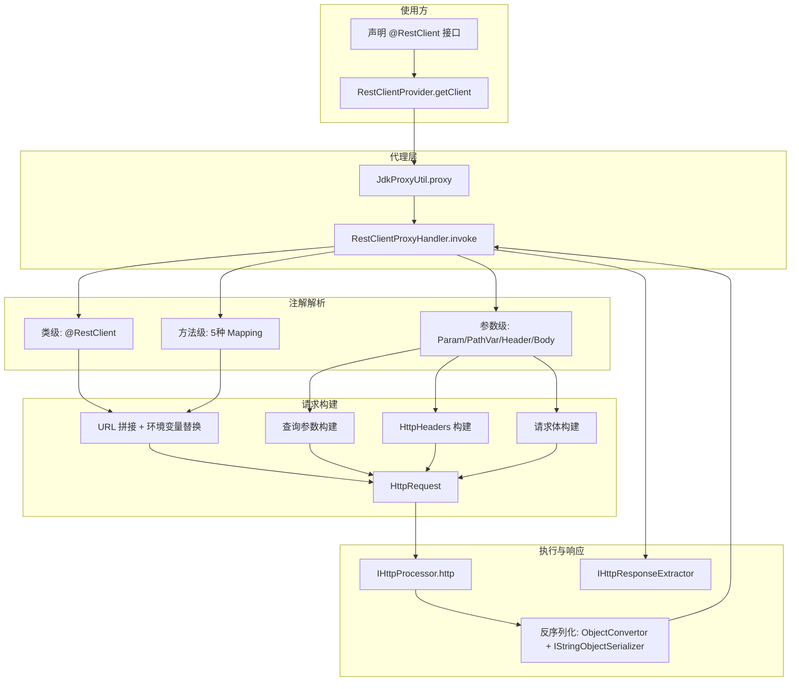

# i2f-http-proxy

> **声明式 REST 客户端框架**——15 源文件约 717 行，纯 JDK 动态代理 + 注解驱动，零运行时三方依赖。通过 `@RestClient` 接口 + `RestClientProvider` 工厂生成 JDK 动态代理，在 `RestClientProxyHandler.invoke()` 中根据 `@RestGetMapping/@RestPostMapping/@RestPutMapping/@RestDeleteMapping/@RestMapping` 等方法注解与 `@RestParam/@RestPathVariable/@RestHeader/@RestBody` 等参数注解构建 `HttpRequest`，委托 `IHttpProcessor` 执行并自动反序列化响应。被 `i2f-jdk-all` 全仓聚合引入，目前全仓零 Java 代码级消费者（纯声明式等待使用方）。

---

## 模块定位

- **功能**：提供声明式 REST 客户端能力——通过注解标注 Java 接口，运行期由 JDK 动态代理拦截方法调用，自动构造 HTTP 请求并解析响应
- **所属层级**：`i2f-jdk` HTTP/网络工具层，位于 `i2f-proxy`（代理基础）与 `i2f-network`（HTTP 请求模型）上游，面向需要 HTTP API 调用的任意场景

## 依赖关系

| 依赖 | 类型 | 用途 | 是否真实使用 |
|------|------|------|-------------|
| `lombok` | 编译期 | — | **未使用**（零注解引用） |
| `i2f-network` | 编译+运行 | 提供 `IHttpProcessor`/`HttpRequest`/`HttpResponse`/`HttpHeaders`/`MultipartFile`/`IHttpResponseExtractor`/`HttpMethodConstants` 等 HTTP 核心模型 | 是 |
| `i2f-proxy` | 编译+运行 | 提供 `JdkProxyUtil.proxy()`（生成代理）和 `IProxyInvocationHandler`（代理处理器接口） | 是 |
| `i2f-annotations-core` | 编译+运行 | 提供 `@Name` 注解（参数命名覆盖，被 `RestClientProxyHandler` 读取） | 是 |
| `i2f-environment-std` | 编译+运行 | 提供 `IEnvironment` 接口（运行期环境变量/配置属性读取，支持 `${var}` 占位符替换） | 是 |

**结论**：5 个声明依赖中 4 个真实使用，`lombok` 冗余声明。

## 包结构

```
i2f.network.http.proxy.rest/
├── HttpProcessorSupplier.java          (16行)  @FunctionalInterface HTTP 处理器提供者
├── IHttpRequestCustomizer.java         (16行)  @FunctionalInterface 请求自定义回调
├── RestClientProvider.java             (27行)  代理工厂入口
├── annotations/
│   ├── RestBody.java                   (21行)  @RequestBody 等价注解
│   ├── RestClient.java                 (32行)  客户端声明注解（url/path/http/httpSupplier）
│   ├── RestDeleteMapping.java          (22行)  @DeleteMapping
│   ├── RestGetMapping.java             (22行)  @GetMapping
│   ├── RestHeader.java                 (33行)  @RequestHeader — 支持 name/value/param/attr
│   ├── RestHeaders.java                (22行)  @RestHeader 容器
│   ├── RestMapping.java                (24行)  通用映射（多 method）
│   ├── RestParam.java                  (22行)  @RequestParam
│   ├── RestPathVariable.java           (22行)  @PathVariable
│   ├── RestPostMapping.java            (22行)  @PostMapping
│   └── RestPutMapping.java             (22行)  @PutMapping
└── core/
    └── RestClientProxyHandler.java     (394行) JDK 代理核心处理器
```

## 类结构总览

| 分组 | 类/接口 | 说明 |
|------|---------|------|
| **核心入口** | `RestClientProvider` | 对外工厂：`getClient(Class<T>, IStringObjectSerializer, IEnvironment)` 创建代理实例 |
| **核心处理器** | `RestClientProxyHandler` | 实现 `IProxyInvocationHandler`，393 行核心逻辑：注解解析→请求构建→执行→响应反序列化 |
| **函数式接口** | `HttpProcessorSupplier` | 返回 `IHttpProcessor` 实例的懒加载工厂 |
| **函数式接口** | `IHttpRequestCustomizer` | 请求发送前回调，可修改 `HttpRequest` |
| **类级注解** | `@RestClient` | 声明 REST 客户端接口，配置 `url/path/http/httpSupplier` |
| **方法级注解** | `@RestMapping`/`@RestGetMapping`/`@RestPostMapping`/`@RestPutMapping`/`@RestDeleteMapping` | HTTP 方法与路径映射 |
| **参数级注解** | `@RestParam` | 查询参数 |
| **参数级注解** | `@RestPathVariable` | 路径变量 `{name}` |
| **参数级注解** | `@RestHeader`/`@RestHeaders` | 请求头（单头/批量 Map/Bean → 头） |
| **参数级注解** | `@RestBody` | 请求体 |

## 分层架构图



## 核心机制详解

### 1. 代理创建流程

`RestClientProvider` 提供三级工厂方法：

```java
// 完整版：指定序列化器 + 环境变量
public <T> T getClient(Class<T> interfaces, IStringObjectSerializer processor, IEnvironment environment)

// 简版：仅序列化器
public <T> T getClient(Class<T> interfaces, IStringObjectSerializer processor)

// 自定义版：直接传入已构建的 RestClientProxyHandler
public <T> T getClient(Class<T> interfaces, RestClientProxyHandler handler)
```

最终统一调用 `JdkProxyUtil.proxy(interfaces, handler)` 生成 JDK 动态代理实例。

### 2. 注解解析与请求构建（`invoke` 方法核心流程）

`RestClientProxyHandler.invoke()` 内部执行顺序：

```
1) 读取 @RestClient 类级注解 → 基础 url/path/HTTP 处理器
2) 读取方法级 Mapping 注解 → HTTP method + 子路径
   （优先级：@RestDeleteMapping > @RestPutMapping > @RestPostMapping > @RestGetMapping > @RestMapping）
3) 替换 url/path 中的 ${env} 占位符（replaceWithEnv）
4) URL 拼接：joinUrlPath(baseUrl, subPath)
5) 解析方法级 @RestHeaders → 构建命名头
6) 遍历方法参数（按声明顺序）：
   a. MultipartFile/File → 添加到请求文件列表
   b. IHttpRequestCustomizer → 保存为请求前回调
   c. IHttpResponseExtractor → 保存为响应处理器
   d. @RestHeader → 添加请求头（name 空=批量 Map/Bean，非空=单头）
   e. @RestBody → 设置请求体（单值/命名 Map）
   f. @RestPathVariable → 替换 URL 中的 {name}
   g. @RestParam → 添加查询参数
   h. 无注解 → 归为查询参数（支持多参数累积到 Map）
7) 调用 customizer（如提供）
8) 执行 http(request, extractor/默认提取器)
9) 默认提取器按返回类型分派：HttpResponse / byte[] / InputStream / String / 反序列化
```

### 3. 环境变量替换

`replaceWithEnv()` 支持三种模式：

```java
// 基本替换：${KEY} → environment.getProperty("KEY")
// 带默认值：${KEY:default} → environment.getProperty("KEY") ?? "default"
// 空值转空：${!KEY} → environment.getProperty("KEY") ?? ""
String replaced = handler.replaceWithEnv("http://${host:localhost}:${port:8080}/api");
// → "http://localhost:8080/api" (当 host/port 未配置时)
```

### 4. HTTP 处理器供应商链

```java
@RestClient(
    url = "http://${api.host}",
    httpSupplier = MyHttpProcessorSupplier.class,   // ① 优先取 Supplier
    http = HttpUrlConnectProcessor.class             // ② Supplier 未提供时回退
)
```

`HttpProcessorSupplier` 的 `get()` 抛出 `IOException`，允许在 Supplier 中完成连接池/SSL 等初始化。

### 5. 响应处理与自动反序列化

```java
// 内置默认提取器逻辑（当未提供自定义 IHttpResponseExtractor 时）：
retType = HttpResponse.class → 返回原始 response
retType = byte[].class      → response.getContentAsBytes()
retType = InputStream.class → StreamUtil.localStream(response.getInputStream())
retType = String.class      → response.getContentAsString("UTF-8")
其他类型 → 先 ObjectConvertor.tryConvertAsType(content, retType)
           转换失败 → processor.deserialize(content, retType)
```

两层转换策略：
- **第一层**：`ObjectConvertor.tryConvertAsType()` 处理简单类型转换（如 String → Integer）
- **第二层**：`IStringObjectSerializer.deserialize()` 处理 JSON/XML 等结构化反序列化

### 6. URL 路径拼接

```java
joinUrlPath("http://host/api", "v1/users")    → "http://host/api/v1/users"
joinUrlPath("http://host/api/", "/v1/users")  → "http://host/api/v1/users"
joinUrlPath("http://host/api", "/v1/users")   → "http://host/api/v1/users"
```

处理前导/后置斜杠，避免双斜杠。

### 7. @RestHeader 多模式

`@RestHeader` 支持三种使用模式：

```java
// 模式一：单头（通过 name+value 指定）
@RestHeader(name = "Authorization", value = "Bearer ${token}")

// 模式二：从参数取值（通过 param 引用方法参数）
@RestHeader(name = "X-Trace-Id", param = "traceId")

// 模式三：从参数属性取值（通过 param+attr 引用参数对象的属性）
@RestHeader(name = "X-User", param = "user", attr = "id")

// 模式四：批量（name 为空时，参数值应为 Map/Bean，被反射展开为多个头）
void send(@RestHeader Map<String, String> headers);
```

## 使用示例

### 示例 1：基本 GET 请求

```java
@RestClient(url = "https://api.example.com")
public interface UserApi {
    @RestGetMapping("/users/{id}")
    User getUser(@RestPathVariable("id") Long id);
}

// 使用
UserApi api = provider.getClient(UserApi.class, jsonSerializer);
User user = api.getUser(123L);
// → GET https://api.example.com/users/123
// → JSON 响应自动反序列化为 User 对象
```

### 示例 2：POST 请求体

```java
@RestClient(url = "https://api.example.com")
public interface UserApi {
    @RestPostMapping("/users")
    User createUser(@RestBody User user);
}

// → POST https://api.example.com/users
// → Body: user 经序列化器转换
```

### 示例 3：查询参数 + 路径变量 + 请求头

```java
@RestClient(url = "https://api.example.com")
public interface SearchApi {
    @RestGetMapping("/search")
    List<Result> search(
        @RestParam("q") String query,
        @RestParam("page") int page,
        @RestHeader(name = "Authorization") String token
    );
}

// → GET https://api.example.com/search?q=hello&page=1
// → Header: Authorization: Bearer xxx
```

### 示例 4：环境变量配置 URL

```java
@RestClient(url = "${api.base.url:http://localhost:8080}/v1")
public interface OrderApi {
    @RestPostMapping("/orders")
    Order createOrder(@RestBody Order order);
}

// 运行时 environment.getProperty("api.base.url") = "https://prod.example.com"
// → POST https://prod.example.com/v1/orders
```

### 示例 5：自定义 HTTP 处理器

```java
public class PooledHttpSupplier implements HttpProcessorSupplier {
    @Override
    public IHttpProcessor get() throws IOException {
        return new PooledHttpClient(); // 自定义连接池客户端
    }
}

@RestClient(url = "${api.url}", httpSupplier = PooledHttpSupplier.class)
public interface PaymentApi {
    @RestPostMapping("/pay")
    PaymentResponse pay(@RestBody PaymentRequest request);
}
```

### 示例 6：文件上传

```java
@RestClient(url = "https://upload.example.com")
public interface FileApi {
    @RestPostMapping("/upload")
    String upload(@RestParam("file") MultipartFile file);
}

FileApi api = provider.getClient(FileApi.class, jsonSerializer);
String result = api.upload(new MultipartFile("photo.jpg", data));
```

## 消费关系

### Java 代码级消费者

**全仓零外部 Java 消费者**。当前仅本模块内部自引用（`RestClientProvider` → `RestClientProxyHandler`，`RestClient` → `HttpProcessorSupplier`，`RestClientProxyHandler` → 全部注解）。

### POM 依赖声明注册

| 注册位置 | 文件 | 行号 |
|---------|------|------|
| 模块声明 | `i2f-jdk/pom.xml` | L85 |
| 版本托管 | 根 `pom.xml` | L459-463 |
| 全仓聚合 | `i2f-jdk-all/pom.xml` | L287-290 |

## 已知缺陷与潜在风险

| 编号 | 级别 | 类别 | 描述 |
|------|------|------|------|
| 1 | 低 | 冗余依赖 | `lombok` 在 POM 中声明但全模块 15 个源文件均无任何 lombok 注解引用 |
| 2 | 低 | 测试缺失 | 全模块仅 main 源码，无任何测试用例（单元/集成皆无） |
| 3 | 低 | 代码冗余 | `RestClientProxyHandler` L245-249 中 `headerName` 捕获 `annHeader.name()` 后，L246 重复读取 `annHeader.name()` 而非复用 `headerName` |
| 4 | 低 | 防御不足 | `RestMapping.method()` 不做 HTTP method 有效性校验，空值/非法值在 L163-165 默认回退 GET |
| 5 | 低 | 反序列化降级 | 响应处理 L357-359 先用 `ObjectConvertor.tryConvertAsType` 转换，失败再走 `processor.deserialize`。`tryConvertAsType` 可能返回非预期类型对象（如 null 或原始 String）而不抛异常，`TypeOf.instanceOf` 检查后才降级，存在隐式分支路径 |
| 6 | 低 | URL 拼接 | `joinUrlPath` 不支持双斜杠的保留（如 `http://host//path` 会被简化为 `http://host/path`） |
| 7 | 低 | 参数索引安全 | `@RestHeader(param = "0")` 按索引引用参数时无越界检查（L192-196），超出 `args.length` 则静默跳过 |

## 对比分析

| 维度 | i2f-http-proxy | Spring RestTemplate | Feign | Retrofit |
|------|---------------|-------------------|-------|----------|
| **代理机制** | JDK 动态代理 | 无代理，直接 API | JDK 动态代理 | JDK 动态代理 |
| **注解体系** | 自研 11 个注解 | 无（需手动构建） | Spring MVC 注解 | 自研注解 |
| **序列化** | 可插拔 `IStringObjectSerializer` | 可插拔 `HttpMessageConverter` | 可插拔 `Encoder/Decoder` | 可插拔 `Converter` |
| **环境变量** | 内置 `${env}` 替换 | 需手动处理 | 需外部配置 | 无 |
| **请求定制** | `IHttpRequestCustomizer` 回调 | `ClientHttpRequestInterceptor` | `RequestInterceptor` | `Interceptor` (OkHttp) |
| **响应提取** | `IHttpResponseExtractor` | `ResponseExtractor` | 自动 | 自动 |
| **文件上传** | 原生 `MultipartFile`/`File` 参数 | `MultiValueMap` | `@RequestPart` | `@Part`/`MultipartBody` |
| **运行时依赖** | 零三方（纯 i2f 自有） | Spring Web | Feign Core + 可选 | OkHttp + Retrofit |
| **代码量** | ~717 行 | ~50000+ 行 | ~20000+ 行 | ~10000+ 行 |

## 总结

`i2f-http-proxy` 是一个轻量级的声明式 HTTP 客户端框架，通过 11 个自研注解 + JDK 动态代理实现了类似 Spring RestTemplate/Feign 的声明式远程调用能力。核心设计亮点包括：

1. **零运行时三方依赖**：仅依赖 i2f 自有模块（`i2f-network`/`i2f-proxy`/`i2f-annotations-core`/`i2f-environment-std`）
2. **完备的注解体系**：类级 `@RestClient` + 5 种方法级 Mapping + 4 种参数级注解，覆盖 REST API 全部要素（路径/方法/参数/请求头/请求体/文件上传）
3. **内置环境变量替换**：`${key:default}` 语法贯穿 URL/路径/请求头值，与 `IEnvironment` 集成实现配置外部化
4. **可插拔的扩展点**：`IHttpProcessor`（HTTP 执行引擎）、`IStringObjectSerializer`（序列化）、`HttpProcessorSupplier`（处理器工厂）、`IHttpRequestCustomizer`（请求定制）、`IHttpResponseExtractor`（响应提取）全部可替换
5. **优雅的响应处理链**：基于返回类型自动分派——原始 `HttpResponse` → 字节流 → `InputStream` → 字符串 → 类型转换 → JSON/XML 反序列化