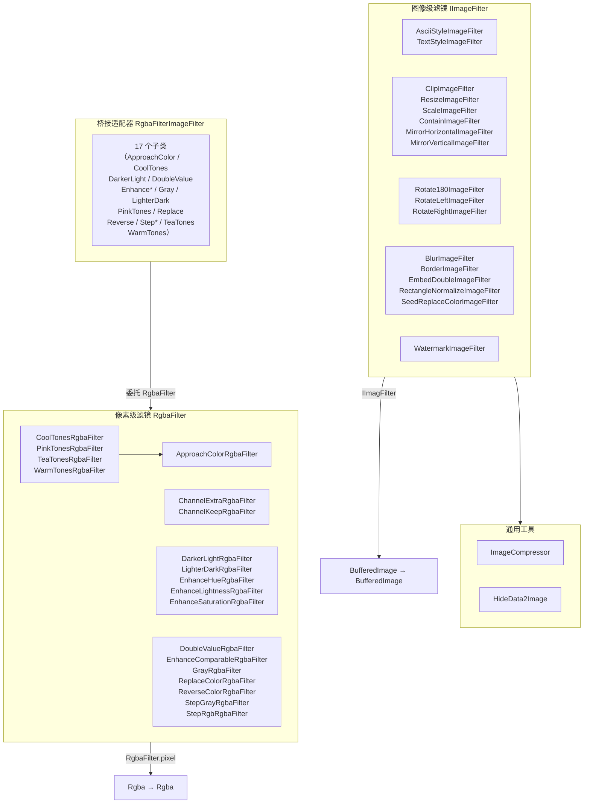

# i2f-image-impl

> **图像滤镜与处理实现层**——56 源文件约 1893 行，纯 JDK + `i2f-image-std`/`i2f-math`/`i2f-graphics-2d`/`lombok`。提供 `ImageCompressor` 智能压缩 + `HideData2Image` LSB 隐写 + 28 种图像级滤镜 + 20 种像素级 RGBA 滤镜，构成双层滤镜体系（`IImageFilter` 图像级 ↔ `RgbaFilter` 像素级），通过 `i2f-image-std` 的 6 个桥接适配器自由组合。被 `i2f-springboot-ops-starter` 的 `OpenAiOpsController` 消费。

---

## 模块定位

- **功能**：`i2f-image-std` 三层过滤器接口的**具体实现**集合 + 图片压缩工具 + 隐写工具，覆盖基础图像处理（缩放/裁剪/旋转/镜像）、色彩调整（灰度/反色/二值化/色调/饱和度/亮度/对比度）、特效（模糊/边缘/字符化/水印/渐变色）、高级处理（矩形校正/种子填充/两张嵌合/通道分离与保持）
- **所属层级**：`i2f-jdk` 图像处理实现层，位于 `i2f-image-std` 的下游（实现标准接口）
- **设计原则**：
  - **镀锌板结构**：RGBA 像素级滤镜（`RgbaFilter`）通过 `RgbaFilterImageFilter` 桥接适配提升为图像级滤镜（`IImageFilter`），`image` 包中约半数滤镜是仅一行构造函数的桥接子类
  - **可组合性**：`MergeRgbaFilter` 支持链式组合多滤镜，`RgbaFilterImageFilter` 将像素级滤镜提升到图像级

## 依赖关系

| 依赖 | 类型 | 用途 | 是否真实使用 |
|------|------|------|-------------|
| `lombok` | 编译期 | `@Data`/`@NoArgsConstructor` 注解 | **是**（`WatermarkImageFilter`/`ChannelExtraRgbaFilter`/`ChannelKeepRgbaFilter`） |
| `i2f-image-std` | 编译+运行 | 提供 `IImageFilter`/`RgbaFilter`/`PixelFilter` 接口、`RgbaFilterImageFilter`/`PixelFilterRgbaFilter` 桥接适配器、`ImageUtil`/`FontUtil` 工具 | **是**（全部 56 文件使用） |
| `i2f-math` | 编译+运行 | 提供 `MathUtil`（`sumi`/`distance`/`between`/`min`/`max`/`abs`） | **是**（`BlurImageFilter`/`RectangleNormalizeImageFilter`/`EnhanceComparableRgbaFilter`） |
| `i2f-graphics-2d` | 编译+运行 | 提供 `i2f.graphics.d2.Point` 二维点 | **是**（`RectangleNormalizeImageFilter`/`SeedReplaceColorImageFilter`） |

## 包结构

| 包 | 文件数 | 职责 |
|-----|--------|------|
| `i2f.image.common` | 1 | `ImageCompressor` JPEG 智能压缩 |
| `i2f.image.filter.impl` | 1 | `HideData2Image` LSB 隐写 |
| `i2f.image.filter.impl.image` | 28 | 图像级滤镜（`IImageFilter` 实现与桥接子类） |
| `i2f.image.filter.impl.rgba` | 20 | 像素级 RGBA 滤镜（`RgbaFilter` 实现） |
| `i2f.image.filter.impl.test` | 1 | `TestImage` 使用示例（在 main 源码集） |

## 类结构总览

### 通用工具（2 类）

| 类 | 行数 | 功能 |
|-----|------|------|
| `ImageCompressor` | 241 | JPEG 智能压缩：等比例缩放 + 去 Alpha + 二分法寻最佳质量 + Base64 DataURL |
| `HideData2Image` | 160 | LSB 隐写：RGB 三通道冗余写入（bit 3），读端三取二多数投票 |

### IImageFilter 图像级滤镜（24 类实现 + 4 桥接子类）

#### 直接实现 IImageFilter（16 类）

| 类 | 行数 | 功能 |
|-----|------|------|
| `AsciiStyleImageFilter` | 76 | ASCII 字符化，灰度映射 32 级字符表 |
| `BlurImageFilter` | 85 | 径向距离加权模糊 |
| `BorderImageFilter` | 77 | 边缘提取（右下邻点差分，支持容差） |
| `ClipImageFilter` | 42 | 矩形裁剪 |
| `EmbedDoubleImageFilter` | 55 | 两张图片黑白棋盘嵌合 |
| `MirrorHorizontalImageFilter` | 33 | 水平镜像 |
| `MirrorVerticalImageFilter` | 33 | 垂直镜像 |
| `RectangleNormalizeImageFilter` | 98 | 矩形校正：四点透视→矩形，双线性插值 |
| `ResizeImageFilter` | 100 | 尺寸缩放（三方向平均插值） |
| `Rotate180ImageFilter` | 33 | 180° 旋转 |
| `RotateLeftImageFilter` | 33 | 左旋 90° |
| `RotateRightImageFilter` | 33 | 右旋 90° |
| `ScaleImageFilter` | 32 | 按比例缩放，委托 `ResizeImageFilter` |
| `SeedReplaceColorImageFilter` | 102 | 种子颜色替换（BFS 泛洪填充，八方向） |
| `TextStyleImageFilter` | 68 | 文字字符化（循环使用给定字符串） |
| `WatermarkImageFilter` | 115 | 水印（网格/右下角模式，支持旋转+透明度） |

#### 继承 RgbaFilterImageFilter 桥接子类（17 类）

| 类 | 行数 | 委托的 RgbaFilter |
|-----|------|-------------------|
| `ApproachColorImageFilter` | 19 | `ApproachColorRgbaFilter` |
| `CoolTonesImageFilter` | 16 | `CoolTonesRgbaFilter` |
| `DarkerLightImageFilter` | 17 | `DarkerLightRgbaFilter` |
| `DoubleValueImageFilter` | 17 | `DoubleValueRgbaFilter` |
| `EnhanceComparableImageFilter` | 17 | `EnhanceComparableRgbaFilter` |
| `EnhanceHueImageFilter` | 17 | `EnhanceHueRgbaFilter` |
| `EnhanceLightnessImageFilter` | 17 | `EnhanceLightnessRgbaFilter` |
| `EnhanceSaturationImageFilter` | 17 | `EnhanceSaturationRgbaFilter` |
| `GrayImageFilter` | 17 | `GrayRgbaFilter` |
| `LighterDarkImageFilter` | 17 | `LighterDarkRgbaFilter` |
| `PinkTonesImageFilter` | 16 | `PinkTonesRgbaFilter` |
| `ReplaceColorImageFilter` | 17 | `ReplaceColorRgbaFilter` |
| `ReverseColorImageFilter` | 17 | `ReverseColorRgbaFilter` |
| `StepGrayImageFilter` | 16 | `StepGrayRgbaFilter` |
| `StepRgbImageFilter` | 16 | `StepRgbRgbaFilter` |
| `TeaTonesImageFilter` | 16 | `TeaTonesRgbaFilter` |
| `WarmTonesImageFilter` | 16 | `WarmTonesRgbaFilter` |

#### 继承 ResizeImageFilter（2 类）

| 类 | 行数 | 功能 |
|-----|------|------|
| `ContainImageFilter` | 40 | 等比例缩放到指定容器（类似 CSS `object-fit: contain`） |
| `ScaleImageFilter` | 32 | 按比例缩放 |

### RgbaFilter 像素级 RGBA 滤镜（20 类）

| 类 | 行数 | 功能 | 核心公式 |
|-----|------|------|----------|
| `ApproachColorRgbaFilter` | 33 | 颜色趋近 | `out = in × (1-rate) + target × rate` |
| `ChannelExtraRgbaFilter` | 42 | 通道提取 | 按 mask 独立保留/置零通道 |
| `ChannelKeepRgbaFilter` | 72 | 通道保持 | 指定通道值在 [min,max] 范围内保留，否则透明 |
| `CoolTonesRgbaFilter` | 17 | 冷色调 | 委托 `ApproachColorRgbaFilter`，target=`(0,128,255)` |
| `DarkerLightRgbaFilter` | 28 | 降暗亮部 | HSL 亮度 `l = l × (1 - rate × l)` |
| `DoubleValueRgbaFilter` | 25 | 二值化 | 灰度 > 127 → 255, 否则 0 |
| `EnhanceComparableRgbaFilter` | 38 | 增强对比度 | 高于127放大，低于127缩小 |
| `EnhanceHueRgbaFilter` | 28 | 增强色相 | HSL 色相 `h = h × rate` |
| `EnhanceLightnessRgbaFilter` | 28 | 增强亮度 | HSL 亮度 `l = l × rate` |
| `EnhanceSaturationRgbaFilter` | 28 | 增强饱和度 | HSL 饱和度 `s = s × rate` |
| `GrayRgbaFilter` | 18 | 灰度 | `gray = (r+g+b)/3` |
| `LighterDarkRgbaFilter` | 28 | 提亮暗部 | HSL 亮度 `l = l × (1 + rate × (1-l))` |
| `PinkTonesRgbaFilter` | 17 | 桃红色调 | 委托 `ApproachColorRgbaFilter`，target=`(255,0,128)` |
| `ReplaceColorRgbaFilter` | 46 | 颜色替换 | 精确/容差匹配后替换 |
| `ReverseColorRgbaFilter` | 18 | 反色 | `out = 255 - in` |
| `StepGrayRgbaFilter` | 33 | 阶化灰度 | 灰度等分 steps 级，四舍五入归阶 |
| `StepRgbRgbaFilter` | 39 | 阶化 RGB | R/G/B 各自独立等分 steps 级 |
| `TeaTonesRgbaFilter` | 17 | 茶色调 | 委托 `ApproachColorRgbaFilter`，target=`(0,255,128)` |
| `WarmTonesRgbaFilter` | 17 | 暖色调 | 委托 `ApproachColorRgbaFilter`，target=`(255,128,0)` |

## 架构图



## 核心机制详解

### 1. 双层滤镜体系

```
IImageFilter.filter(BufferedImage) → BufferedImage
    ↑                              (图像级：遍历像素，创建新图)
    │
RgbaFilterImageFilter              (桥接适配器：将 RgbaFilter 提升为 IImageFilter)
    │
RgbaFilter.pixel(Rgba) → Rgba      (像素级：单像素 RGBA 变换)
```

图像级滤镜直接操控 `BufferedImage`，可改变尺寸/坐标/像素布局；像素级滤镜仅变换单个像素颜色，通过 `RgbaFilterImageFilter` 提升为图像级后自动遍历全图。

### 2. JPEG 智能压缩（ImageCompressor）

三阶段流程：
1. **等比例缩放**：若最长边超过 `maxDimension`，`AffineTransformOp.TYPE_BILINEAR` 缩放
2. **去 Alpha**：若含透明通道，以白色背景重绘为 `TYPE_INT_RGB`
3. **二分法寻质量**：在 `[0.0, 1.0]` 区间二分搜索（最多 10 轮），寻找满足 `≤ maxKbSize` 的最高 JPEG 压缩质量

附带 `imageFileToBase64DataUrl` 将图片文件转为 DataURL。

### 3. LSB 隐写（HideData2Image）

- **存储位置**：RGB 每分量第 3 bit（掩码 `0x08`），RGB 三通道冗余写入同一数据 bit
- **读取策略**：三取二多数投票（`r+g+b ≥ 2 → 1`）
- **前导长度**：前 4 字节（32 像素）存储数据长度（大端序 int32）
- **总容量**：`(宽 × 高 / 8) - 4` 字节
- **限制**：仅适用于无损格式（PNG/BMP），有损格式（JPEG）不可恢复

### 4. 矩形校正（RectangleNormalizeImageFilter）

给定顺时针四点 → 双线性插值映射到新矩形：
```
目标点 (j,i) → 求 top/down 插值 → 求最终插值
   rateX = j / wid, rateY = i / hei
   topPt = lerp(leftTop, rightTop, rateX)
   downPt = lerp(leftDown, rightDown, rateX)
   target = lerp(topPt, downPt, rateY)
```
输出尺寸在景中的 R/G/B/A 通道各自双线性插值（2×2 相邻像素）。

### 5. 种子颜色替换（SeedReplaceColorImageFilter）

BFS 泛洪填充，从种子点 `(sx,sy)` 出发，八方向扩散，精确匹配或容差匹配，`byte[][] map` 标记已访问防止重复。

### 6. HSL 域色彩调整

色调/亮度/饱和度/暗部/亮部的调整均在 HSL 色彩空间进行：

| 滤镜 | HSL 变换 | 效果 |
|------|----------|------|
| `EnhanceLightnessRgbaFilter` | `l × rate` | rate>1 提亮，rate<1 变暗 |
| `DarkerLightRgbaFilter` | `l × (1 - rate × l)` | 压制高亮区 |
| `LighterDarkRgbaFilter` | `l × (1 + rate × (1-l))` | 提拉伸展区 |
| `EnhanceHueRgbaFilter` | `h × rate` | 色相偏移（rate=0 归零） |
| `EnhanceSaturationRgbaFilter` | `s × rate` | rate>1 增饱和，rate<1 减饱和 |

### 7. 水印（WatermarkImageFilter）

- **网格模式**（`gridMode=true`）：旋转后平铺，间隔控制密度，奇偶位偏移
- **右下角模式**（`gridMode=false`）：右下角单次显示
- `AlphaComposite.SRC_ATOP` 合成

## 消费关系

### Java 消费者

| 消费方 | 引用的类 |
|--------|----------|
| `i2f-springboot-ops-starter` | `ImageCompressor`（1 处 import） |

### POM 注册

| 位置 | 用途 |
|------|------|
| `i2f-jdk/pom.xml` L87 | modules 注册 |
| 根 `pom.xml` L471 | dependencyManagement 版本托管 |
| `i2f-jdk-all/pom.xml` L297 | 全仓聚合引入 |
| `i2f-springboot-ops-starter/pom.xml` L86 | Spring Boot 启动器依赖 |

## 已知缺陷

| 等级 | 位置 | 描述 |
|------|------|------|
| 【中】 | `ScaleImageFilter.filter()` L27 | `hei = (int)(img.getHeight() * rateWid)` — 复制粘贴错误，应使用 `rateHei`。当宽高比不等时高度错误 |
| 【中】 | `EnhanceHueRgbaFilter.pixel()` L23 | `hsl.h * rate`，rate=0 时色相归零（应为保持原值），公式意图不清晰 |
| 【低】 | `BorderImageFilter.filter()` L66-68 | `x==1 || y==1` 冗余重写（像素已在 L65 赋值），代码无实际影响但属残留 |
| 【低】 | `HideData2Image.write2ImageString()` L41-43 | 空 catch 块静默吞 `UnsupportedEncodingException` |
| 【低】 | `ImageCompressor.imageFileToBase64DataUrl()` L194-197 | 一次读入全文件到内存，大文件 OOM 风险 |
| 【低】 | `TestImage` 在 main 源码集 | 测试代码混入 main，非标准 test 源码集 |
| 【低】 | `WatermarkImageFilter` 可变状态 | `@Data` + 非 final 字段，多线程并发修改不安全 |
| 【低】 | `BlurImageFilter` 非标准模糊 | 加权公式 `(rr-dis)/rsum/cnts[dis]` 非标准高斯核，视觉质量不可控 |

## 对比表

| 维度 | i2f-image-impl | i2f-image-std |
|------|---------------|---------------|
| **角色** | 滤镜实现层 | 滤镜标准接口层 |
| **文件数** | 56 源文件约 1893 行 | 11 源文件约 424 行 |
| **接口/实现** | 0 接口，50+ 实现类 | 3 接口 + 6 适配器 |
| **依赖复杂度** | 4 依赖（含 `i2f-math`/`i2f-graphics-2d`） | 1 依赖（`i2f-color`） |
| **消费者** | `i2f-springboot-ops-starter` | `i2f-image-impl` |

## 总结

`i2f-image-impl` 是 i2f-turbo 图像处理子系统的**实现主力**，约 1893 行代码覆盖了从基础几何变换（缩放/裁剪/旋转/镜像）到色彩科学（HSL 域调整/灰度/反色/二值化/阶化）、从创意特效（模糊/边缘/字符化/水印）到高级处理（矩形校正/种子填充/LSB 隐写/JPEG 智能压缩）的完整图像滤镜生态。通过镀锌板桥接模式，20 个 RGBA 像素级滤镜可透明提升为图像级滤镜，配合 `MergeRgbaFilter` 链式组合，实现「乐高式」滤镜装配。主要瑕疵集中于复制粘贴错误（`ScaleImageFilter` 宽高比混淆）和边界条件处理。