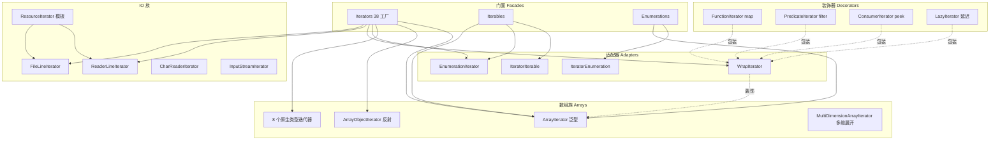

# i2f-iterator

> **迭代器三向适配与增强工具集**——29 源文件约 1362 行，纯 JDK + `i2f-reference` 依赖，全 main 无测试。以 `Iterators`（38 个静态工厂重载）/`Iterables`/`Enumerations` 三个门面实现 **Iterator ↔ Iterable ↔ Enumeration 三向互转**（含 Stream/8 种原生数组/任意对象数组/Reader 行流），配以 5 个装饰器（map/filter/peek/透传/懒加载）、`ResourceIterator` 资源生命周期模板（自动关闭 Reader/文件流），以及 17 个数组迭代器（含多维数组展开 + 下标轨迹）。被 `i2f-text`（Appender 排版）、`i2f-match`（StringMatcher）、`i2f-extension-antlr4`（Funic 脚本引擎）消费。

---

## 模块定位

- **功能**：把任意容器、数组、IO 流、老式 `Enumeration` 统一包装为 `Iterator`，并支持链式装饰（映射/过滤/消费）与增强 for 循环直用；同时提供资源自动释放的 IO 行迭代器
- **所属层级**：`i2f-jdk` 基础工具层，位于集合遍历能力的地基位置
- **设计原则**：
  - **门面静态工厂**：`Iterators.of(...)` 一个方法名覆盖 38 种输入形态，调用方零学习成本
  - **适配器 + 装饰器分离**：适配类（`EnumerationIterator`/`IteratorIterable` 等）负责类型转换，装饰类（`FunctionIterator`/`PredicateIterator` 等）负责行为增强，可自由组合
  - **资源模板方法**：`ResourceIterator` 用「初始化 / 读元素 / 释放」三个函数式钩子描述任何可关闭资源的迭代，`FileLineIterator`/`ReaderLineIterator` 是其两行 lambda 的具体化

## 依赖关系

| 依赖 | 类型 | 用途 | 是否真实使用 |
|------|------|------|-------------|
| `i2f-reference` | 编译+运行 | `Reference<E>` 三态协议（VALUE/NOP/FINISH），用于 `ResourceIterator` 的元素读取协议与 `PredicateIterator` 的缓存 | ✅ 真实使用（4 文件 import） |

> 无 lombok、无三方运行期依赖。构建期启用 `maven-assembly-plugin` 生成 fat-jar。

## 包结构

```
i2f.iterator
├── enumeration/                 Enumeration 门面（1 类）
│   └── impl/                    IteratorEnumeration / WrapEnumeration（2 类）
├── iterable/                    Iterable 门面（1 类）
│   └── impl/                    IteratorIterable（1 类）
└── iterator/                    Iterators 门面（1 类，38 工厂方法）
    └── impl/                    15 个迭代器实现
        └── array/               8 个原生类型数组迭代器
```

## 类结构总览

| 分组 | 类 | 行数 | 说明 |
|------|-----|------|------|
| **门面** | `Iterators` | 169 | 38 个静态工厂重载 → `Iterator` |
| | `Iterables` | 30 | Enumeration/Iterator/E[] → `Iterable`（for-each 直用） |
| | `Enumerations` | 29 | Iterable/Iterator/E[] → `Enumeration`（老 API 适配） |
| **适配器** | `IteratorIterable` | 21 | Iterator → Iterable |
| | `IteratorEnumeration` | 27 | Iterator → Enumeration |
| | `EnumerationIterator` | 28 | Enumeration → Iterator |
| | `WrapIterator` | 37 | 透传装饰（含 remove/forEachRemaining 委托） |
| **装饰器** | `FunctionIterator` | 32 | map 映射（E → R） |
| | `PredicateIterator` | 49 | filter 过滤 |
| | `ConsumerIterator` | 33 | peek 消费回调 |
| | `LazyIterator` | 46 | Supplier 延迟初始化（双重检查锁） |
| **数组** | `ArrayIterator` | 44 | 泛型对象数组（支持区间） |
| | `ArrayObjectIterator` | 45 | 任意 `Object` 数组（反射 `Array.get`） |
| | 8 个原生类型迭代器 | 8×44 | Boolean/Byte/Char/Double/Float/Int/Long/Short |
| | `MultiDimensionArrayIterator` | 96 | 多维数组递归展开 + `ArrayRouter` 下标轨迹 |
| **IO** | `ResourceIterator` | 112 | 资源生命周期模板（holder/resource 泛型分离） |
| | `ReaderLineIterator` | 38 | Reader → 行 String |
| | `FileLineIterator` | 30 | File → 行 String |
| | `CharReaderIterator` | 48 | Reader/InputStream → Character |
| | `InputStreamIterator` | 43 | InputStream → Byte |
| **其他** | `StringIterator` | 28 | String → Character |
| | `WrapEnumeration` | 26 | Enumeration 透传装饰 |

## 架构图



## 核心机制详解

### 1. 三向转换矩阵

任意两种遍历协议之间可互转，覆盖「老代码 Enumeration」「增强 for 循环 Iterable」「统一处理 Iterator」三种诉求：

| 源 \ 目标 | Iterator | Iterable | Enumeration |
|-----------|----------|----------|-------------|
| **Iterable** | `Iterators.of(iterable)` | — | `Enumerations.of(iterable)` |
| **Iterator** | — | `Iterables.of(iterator)` | `Enumerations.of(iterator)` |
| **Enumeration** | `Iterators.of(enumeration)` | `Iterables.of(enumeration)` | — |
| **Collection** | `Iterators.of(collection)` | `Iterables.of(collection)` | 经 Iterators 中转 |
| **Stream** | `Iterators.of(stream)` | — | 经 Iterators 中转 |
| **E[] / 原生数组** | `Iterators.of(arr[, start, end])` | `Iterables.of(arr)` | `Enumerations.of(arr)` |

### 2. 装饰器族（5 个）

统一以「包装既有迭代器」方式工作，可任意链式叠加：

```java
// map + filter + peek 链式组合
Iterator<Integer> it = Iterators.of(new int[]{1, 2, 3, 4, 5, 6});
Iterator<String> mapped = new FunctionIterator<>(it, e -> "#" + e);            // E → R 映射
Iterator<String> filtered = new PredicateIterator<>(mapped, s -> s.length() > 2); // 过滤
Iterator<String> peeked = new ConsumerIterator<>(filtered, System.out::println);  // 消费回调
```

- **`LazyIterator`**：Supplier 延迟创建底层迭代器，`AtomicBoolean` + `synchronized` 双重检查保证只初始化一次，适合「创建昂贵但未必遍历」的场景
- **`WrapIterator`**：标准透传样板，同时把 `remove()`/`forEachRemaining()` 一并委托

### 3. ResourceIterator：资源生命周期模板

以三元泛型 `ResourceIterator<HOLDER, RESOURCE, E>` 建模「持有一个可关闭资源、逐元素读取、结束即释放」的通用迭代模式：

```java
public class ResourceIterator<HOLDER, RESOURCE, E> implements Iterator<E> {
    private ExFunction<HOLDER, RESOURCE> resourceInitializer;        // 首次 hasNext 时初始化
    private ExFunction<RESOURCE, Reference<E>> elementReader;        // 读一个元素（三态协议）
    private ExBiConsumer<HOLDER, RESOURCE> resourceReleaser;         // 释放（close）
    private AtomicBoolean isRelease = new AtomicBoolean(false);      // 幂等释放

    public boolean hasNext() {
        if (res == null) { res = resourceInitializer.apply(holder); }
        if (ref.isValue()) { return true; }
        ref.toFinish();
        while (true) {                        // NOP 状态时继续读下一个（内部跳过的元素）
            Reference<E> elem = elementReader.apply(res);
            if (!elem.isNop()) { break; }     // FINISH（EOF）或 VALUE 都退出循环
        }
        ref.of(elem);
        ...
    }
}
```

元素读取采用 `Reference` 三态协议（详见下节）：读到数据 → `Reference.of(value)`；读到 EOF → `Reference.finish()`；需静默跳过的行 → `Reference.nop()`。资源释放由 `onceRelease()`（`AtomicBoolean` 幂等）在迭代终止/异常/`finalize` 时执行。

两个内置子类只写两行 lambda：

```java
public class FileLineIterator extends ResourceIterator<File, BufferedReader, String> {
    public FileLineIterator(File file, String charset) {
        super(file,
              e -> new BufferedReader(new InputStreamReader(new FileInputStream(e), charset)),  // 初始化
              e -> { String line = e.readLine(); return line == null ? Reference.finish() : Reference.of(line); }, // 读行
              (holder, resource) -> resource.close());   // 释放
    }
}
```

### 4. Reference 三态协议（来自 i2f-reference）

```
Reference.of(value)  → VALUE   有效值（value 可为 null，与「无值」语义区分）
Reference.nop()      → NOP     本元素应被静默跳过（内部循环继续读）
Reference.finish()   → FINISH  迭代终止（EOF）
```

`ResourceIterator` 循环里 `NOP` 继续、非 `NOP`（`VALUE`/`FINISH`）退出并交由 `ref.isValue()` 判定；`PredicateIterator` 用同一原语实现「缓存一个元素」的 `hasNext` 语义。

### 5. 数组迭代体系（17 个类）

| 类别 | 类 | 特点 |
|------|-----|------|
| 泛型数组 | `ArrayIterator<E>` | `E[]` 直接下标访问，支持 `[startIndex, endIndex)` |
| 任意对象数组 | `ArrayObjectIterator<E>` | 接收 `Object`（编译期类型未知），反射 `Array.get` |
| 原生类型（8） | `IntArrayIterator` 等 | 避免装箱数组拷贝，输出装箱类型 `Iterator<Integer>` 等 |
| 多维数组 | `MultiDimensionArrayIterator<T>` | 递归展开任意嵌套数组，`ArrayRouter` 记录每个元素的多维下标轨迹 |

多维展开时每个元素携带完整下标路径：

```java
Object arr = new Integer[][][]{ {{1},{2,3}}, {{4,5}} };
MultiDimensionArrayIterator<Integer> it = new MultiDimensionArrayIterator<>(arr);
while (it.hasNext()) {
    MultiDimensionArrayIterator.ArrayRouter r = it.nextWithRouter();
    // r.elem = 1, r.trace = [0, 0, 0]
    // r.elem = 2, r.trace = [0, 1, 0] ...
}
```

### 6. IO 迭代器族

| 类 | 输入 | 输出 | 关闭语义 |
|----|------|------|---------|
| `ReaderLineIterator` | `Reader`/`BufferedReader`/`InputStream+charset`/`File+charset` | 行 `String` | 经 `ResourceIterator` 自动 close |
| `FileLineIterator` | `File + charset` | 行 `String` | 同上 |
| `CharReaderIterator` | `Reader` / `InputStream+Charset` | `Character` | 实现 `Closeable`，EOF 时自动 close |
| `InputStreamIterator` | `InputStream` | `Byte`（`bt & 0x0ff` 转无符号） | 同上 |

`Iterators.ofReaderLine(...)` 是这四个类的统一工厂入口。

## 使用示例

### 1. 最小用法：数组/集合转迭代器

```java
// 对象数组
Iterator<String> it1 = Iterators.of(new String[]{"a", "b", "c"});
// 原生数组（区间）
Iterator<Integer> it2 = Iterators.of(new int[]{1, 2, 3, 4, 5}, 1, 3); // 1, 2
// 集合与流
Iterator<String> it3 = Iterators.of(Arrays.asList("x", "y"));
Iterator<String> it4 = Iterators.of(Stream.of("p", "q"));
```

### 2. 增强 for 循环直用

```java
// 老式 Enumeration（如 Hashtable/Vector 遗留 API）
Enumeration<String> enu = hashtable.keys();
for (String key : Iterables.of(enu)) {
    System.out.println(key);
}
```

### 3. 兼容旧 API：转回 Enumeration

```java
// 现代集合 → 老框架需要的 Enumeration
Enumeration<Integer> enu = Enumerations.of(Arrays.asList(1, 2, 3));
while (enu.hasMoreElements()) {
    handle(enu.nextElement());
}
```

### 4. 链式装饰处理管道

```java
Iterator<Order> orders = Iterators.of(orderList);
Iterator<String> names = new FunctionIterator<>(orders, Order::getName);       // 提取名称
Iterator<String> valid = new PredicateIterator<>(names, n -> !n.isEmpty());     // 过滤空
new ConsumerIterator<>(valid, log::info).forEachRemaining(x -> {});             // 记日志
```

### 5. 文件行流式读取

```java
// 大文件逐行迭代，迭代结束自动关闭流
try (InputStream is = new FileInputStream("data.txt")) {
    Iterator<String> lines = Iterators.ofReaderLine(is, "UTF-8");
    while (lines.hasNext()) {
        process(lines.next());
    }
}
```

### 6. 任意层级数组展开

```java
// 混合维度（固定 + 可变）数组一键拍平
Object[] mixed = new Object[]{ new Integer[][]{{1,2},{3}}, new Integer[]{7,8,9} };
Iterator<Object> flat = new MultiDimensionArrayIterator<>(mixed);
// 遍历结果：1, 2, 3, 7, 8, 9
```

### 7. 懒加载昂贵资源

```java
// 未遍历则永远不创建连接
Iterator<Row> it = new LazyIterator<>(() -> {
    Connection conn = ds.getConnection();
    return conn.query("select * from t").iterator();
});
```

## 消费关系

**全仓 Java 代码级消费者（3 个模块）：**

| 消费方 | 使用点 | 用法 |
|--------|--------|------|
| `i2f-text` | `Appender`（10+ 处） | `Iterators.of(col/enums/arr)`、`Iterators.ofArrayObject(arr)` 把集合/枚举/数组/任意数组统一接入排版定界逻辑 |
| `i2f-match` | `StringMatcher`（2 处） | `Iterators.of(pattens)` 模式数组转迭代器参与前缀匹配 |
| `i2f-extension-antlr4` | `DefaultFunicResolver`（6 处） | `Iterators.of((Iterable) target)`、`Iterators.ofArrayObject(target)` 等把脚本运行期的任意「类数组」对象统一为迭代器 |

> 注意：`i2f-extension-antlr4` 的 POM **未直接声明** `i2f-iterator`，其依赖经 `i2f-match`（声明 `i2f-iterator`）传递获得；`i2f-container` 的 POM 声明了 `i2f-iterator` 但源码零引用（声明未用）。

**POM 注册链路：**

| 位置 | 角色 |
|------|------|
| `i2f-jdk/pom.xml` L93 | modules 注册 |
| 根 `pom.xml` L499-503 | dependencyManagement 版本托管（`${i2f.version}`） |
| `i2f-jdk-all/pom.xml` L319-322 | 全仓聚合引入 |
| `i2f-text/pom.xml` L17、`i2f-match/pom.xml` L32、`i2f-container/pom.xml` L22 | 下游依赖声明 |

## 已知缺陷

| # | 级别 | 位置 | 问题 | 影响 |
|---|------|------|------|------|
| 1 | **高** | `ResourceIterator.hasNext()` | `finally { onceRelease(); }` **无条件释放**资源——正常路径末尾已有 `if (!ret) onceRelease()`，finally 里的调用应属异常兜底，却写成每次 `hasNext()` 返回前都关闭底层资源 | `FileLineIterator`/`ReaderLineIterator` **只能读出第一行**：第二次 `hasNext()` 在已关闭的 `BufferedReader` 上 `readLine()`，抛 `IllegalStateException("iterator exception : Stream closed")` |
| 2 | **高** | `PredicateIterator.hasNext()` | 循环体 `if (filter.test(elem)) { ref.set(elem); }` **没有 `break`**——遍历消耗整个底层迭代器，每次匹配覆盖 `ref`，最终只剩最后一个匹配元素 | filter 语义完全失效：`[1,2,3,4,5]` 过滤偶数只能得到 `[4]`；`filter=null` 时同样只返回最后一个元素 |
| 3 | 中 | `CharReaderIterator` / `InputStreamIterator` `.hasNext()` | `if (reader != null) { ch = reader.read(); }` 每次调用都重读并覆盖缓存——标准 `Iterator` 协议允许多次调用 `hasNext()` 而不消耗元素 | 连续两次 `hasNext()` 会静默跳过一个字符/字节（`"AB"` 两次 hasNext 后 `next()` 返回 `'B'`） |
| 4 | 中 | `IteratorIterable.iterator()` | 每次返回**同一个**内部迭代器实例而非新建 | 违反 `Iterable` 契约：对同一 `IteratorIterable` 两次 `for-each` 共享耗尽状态（第二次为空），与 JDK 集合行为不一致 |
| 5 | 低 | 数组迭代器族（10 个）`next()` | 无越界检查、无 `hasNext` 前置校验；`arr=null` 构造时 `arr.length` 即 NPE | 越界时抛 `ArrayIndexOutOfBoundsException` 而非 JDK 约定的 `NoSuchElementException`；`startIndex < 0` 无校验 |
| 6 | 低 | `MultiDimensionArrayIterator.nextWithRouter()` | 直接调 `listIter.next()`，未触发首次 `hasNext()` 的惰性展开 | 未先调 `hasNext()` 就调用则 NPE（`listIter` 仍为 null） |
| 7 | 低 | `MultiDimensionArrayIterator.flatArrayAsList` | 每层递归新建 `LinkedList` 并 `addAll` 复制 trace；且方法为 `public static` 可被外部以任意入参调用 | 展开 n 元素、深度 d 时 O(n·d) 拷贝开销；外部误用（非数组入参）行为未定义 |
| 8 | 低 | `ResourceIterator.finalize()` | 覆写 `finalize` 作为释放兜底 | JDK 9+ 已废弃、JDK 18+ 标记 forRemoval，未来版本行为不可依赖 |
| 9 | 低 | `CharReaderIterator` / `InputStreamIterator` `.next()` | 不检查是否已 `hasNext()` 预读，直接返回字段快照（`'\0'`/`0` 初始值） | 未按契约先调 `hasNext()` 的调用方读到脏值而非报错 |
| 10 | 低 | 全模块 | 29 个文件全为 main 源码，无任何测试 | 上述 1/2/3 号缺陷均可在简单测试中暴露，当前无测试网兜底 |

> 缺陷 #1、#2 相互印证了「`ResourceIterator`/`PredicateIterator` 疑似缺少基本单元测试」的事实——两者都是「一次正确、持续错误」的典型模式。

## 与 JDK 能力对比

| 能力 | JDK 原生 | 本模块 |
|------|---------|--------|
| 数组 → Iterator | `Arrays.asList(arr).iterator()`（仅对象数组） | `Iterators.of(arr)` 覆盖对象数组 + 8 种原生数组 + 任意 `Object` 数组 |
| Enumeration ↔ Iterator | `Collections.enumeration(col)`（单向） | 双向互转 + 数组/Iterator 直转 |
| Iterator → Iterable | `() -> iterator` lambda | `Iterables.of(...)` 门面统一入口 |
| Stream 转迭代 | `stream.iterator()`（同一件事） | `Iterators.of(stream)` 语法统一 |
| map/filter 装饰 | `Stream` API（一次性消费） | `FunctionIterator`/`PredicateIterator` 可重复包装 `Iterator` |
| 文件行迭代 | `Files.lines()`（Stream，需手动 close） | `FileLineIterator` 迭代器形态（设计意图自动关闭，见缺陷 #1） |
| 多维数组展开 | 无 | `MultiDimensionArrayIterator` + 下标轨迹 |
| 懒初始化迭代 | 无 | `LazyIterator`（Supplier + 双重检查） |

## 总结

`i2f-iterator` 是 i2f 体系中**容器遍历的地基模块**：三向转换矩阵（Iterator/Iterable/Enumeration）+ 38 个工厂重载覆盖「数组、集合、流、枚举、IO 行流」全部输入形态；`ResourceIterator` 以函数式三钩子把「可关闭资源 → 迭代器」的模式压缩到两行 lambda；`MultiDimensionArrayIterator` 提供 JDK 没有的任意维数组展开能力。被 `i2f-text` 的全文排版、`i2f-match` 的模式匹配、Funic 脚本引擎等直接消费。

但模块当前存在两处**高危实现缺陷**：`ResourceIterator.hasNext()` 的 `finally` 无条件释放导致行迭代器只能读一行即抛异常；`PredicateIterator.hasNext()` 循环缺 `break` 导致过滤语义整体失效。二者与「全模块零测试」的现状形成因果链——使用前建议优先修复或规避（`ResourceIterator` 系可临时改用 JDK `Files.lines`/`BufferedReader.lines()`；`PredicateIterator` 可改用 `Stream.filter`）。
