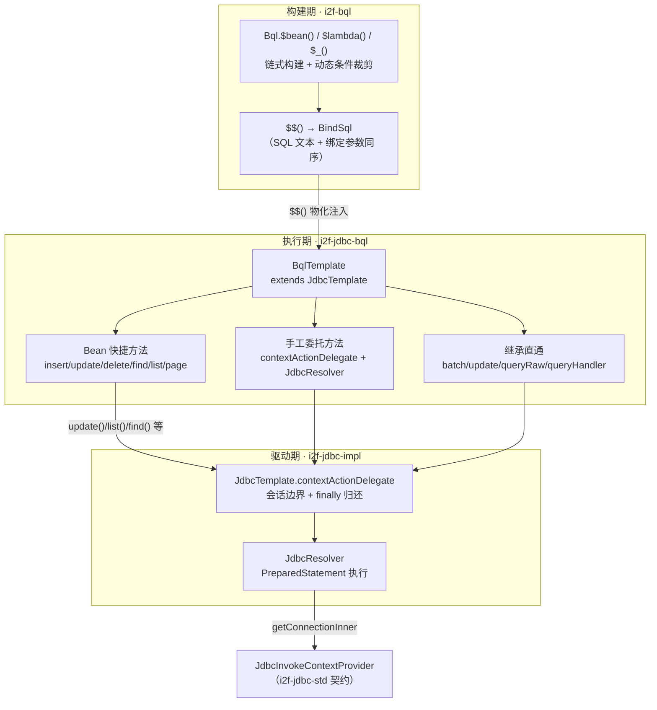

# i2f-jdbc-bql

> **BQL 的运行期落地层 / JDBC 执行门面**（单类 `BqlTemplate`、248 行、1 包、零测试）：以 `BqlTemplate extends JdbcTemplate` 把 `i2f-bql` 流式构建器的产物（`$$()` → `BindSql`）直接送入 `i2f-jdbc-impl` 执行。45 个方法 + 1 个构造器全部是转发——**Bean CRUD 快捷方法**（insert/update/delete/find/list/page 直接吃实体对象，经 `Bql.$bean()` 反射生成 SQL）、**手工委托方法**（`contextActionDelegate(bql.$$(), (conn,sql) -> JdbcResolver.xxx)`，与父类同构）、**继承直通通道**（`$$()` 物化后交给 `JdbcTemplate` 的 `BindSql` 重载：batch/update/queryRaw/queryHandler），零自有状态、零独立执行逻辑。被 4 个模块（4 文件）消费且**全部 POM 显式声明**：`i2f-translate-en2zh`（SQLite 词典 `get`）、`i2f-translate-zh2pinyin`（`find` + `toCamel` 列映射）、`i2f-springboot-jdbc-bql-starter`（条件自动装配 Bean）与 `test-springboot`（`@DataSource` 动态源演示）。**中危风险**：`deleteByPk(beanClass)` 传空 varargs/空集合时，经 `$in` 空集合裁剪 + `$trim` 空前缀守卫（`if (!sql.isEmpty())`）双重叠加，最终生成**无 WHERE 的整表 DELETE**；同链条下 `listByPk` 空参出现全表查询、`findByPk(clazz, null)` 静默返回表首行（详见第七章）。

## 一、模块定位与架构

本模块回答一个衔接问题：**「`i2f-bql` 构建出来的 `BindSql`，怎么最省事地执行？」** 答案是一个薄模板类——继承 `JdbcTemplate` 复用其全部 `BindSql` 通道与会话委托，再补上「直接传入 `Bql` 对象」与「直接传入实体对象」两级便捷入口：



三条消费主线的方法形态：

| 形态 | 代表方法 | 委托路径 |
|------|----------|----------|
| Bean 快捷构造 | `insert(T)` / `update(T,T)` / `delete(T)` / `find(T)` / `list(T)` / `page(T,ApiOffsetSize)` | `Bql.$bean().$beanXxx(...)` 生成语句 → 本类的 `update()` / `contextActionDelegate` |
| 手工委托 | `get` / `find` / `list` / `page` / `queryRaw` / `queryHandler`（`Bql` 参数版） | `contextActionDelegate(bql.$$(), (conn,sql) -> JdbcResolver.xxx(conn, sql, ...))` |
| 继承直通 | `batch`（8 重载）/ `update(Bql)` / `queryRaw(Bql,...)` / `queryHandler(Bql,...)` | `bql.$$()` 后调用继承自 `JdbcTemplate` 的 `BindSql` 重载 |

- 包 `i2f.jdbc.bql` 仅一个类；类注释 `@date 2024/4/24 16:37` 与父类 `JdbcTemplate` 同日同时分——两者是同一时段设计的配套件。
- 构造器只有一个：`BqlTemplate(JdbcInvokeContextProvider<?>)`，把「连接从哪来」完全交给 `i2f-jdbc-std` 契约（直连用 `DirectJdbcInvokeContextProvider`、Spring 用 `SpringDatasourceJdbcInvokeContextProvider`）。

## 二、依赖关系

### 2.1 POM 声明（2 项，均真实使用）

| ArtifactId | 用途（源码级验证） |
|------------|--------------------|
| `i2f-jdbc-impl` | 父类 `JdbcTemplate`（继承全部 BindSql 通道与 `contextActionDelegate`）、`JdbcResolver`（12 处静态调用：get/find×2/list×2/page/update）、`QueryResult`（queryRaw 返回类型） |
| `i2f-bql` | `i2f.bql.core.bean.Bql` 的 `$bean()` 工厂与 11 种 `$beanXxx` 语句构建方法（insert/insertBatchValues/insertBatchUnionAll/update/updateByPk/delete/deleteByPk/query/queryByPk） |

无 lombok（纯转发类无字段无注解）、无其它三方依赖；构建插件与兄弟模块一致采用 `maven-assembly-plugin`。

### 2.2 隐式传递依赖（4 项，未在 POM 声明但直接被引用）

| 传递获得 | 被引用的符号 | 传递链 |
|----------|--------------|--------|
| `i2f-jdbc-std` | `JdbcInvokeContextProvider`（构造器参数）、`SQLFunction`（queryHandler 参数） | i2f-jdbc-impl（显式声明） |
| `i2f-jdbc-data` | `QueryResult`（queryRaw 返回） | i2f-jdbc-impl → i2f-jdbc-std（有意传递通道）→ i2f-jdbc-data |
| `i2f-page` | `ApiOffsetSize` / `Page`（分页方法） | i2f-jdbc-impl（显式声明） |
| `i2f-bindsql` | `BindSql`（`$$()` 产物类型，作为 `update/batch/queryRaw/queryHandler` 委托方法的参数） | i2f-jdbc-impl 与 i2f-bql 双路传递 |

> 与 `i2f-jdbc-bql`/`i2f-jdbc-proxy` 等兄弟模块同样的模式：依赖 `i2f-jdbc-impl` 即隐式获得整条 JDBC 家族链（impl → std → data，impl → page/bindsql），POM 无需逐一声明。若上游调整 impl 的依赖结构，本模块编译将直接受影响。

## 三、源码结构

| 文件 | 行数 | 说明 |
|------|------|------|
| `i2f/jdbc/bql/BqlTemplate.java` | 248 | 唯一类：`public class BqlTemplate extends JdbcTemplate`；45 个方法 + 1 个构造器 |

无 `src/test`、无 `src/main/resources`（不注册任何 SPI，纯编译期消费上游产物）。

## 四、核心机制

### 4.1 委托模式：`$$()` 物化 + `contextActionDelegate`

所有「Bql 参数版」查询方法都是同一条三段式（以 `find` 为例，L128-133）：

```java
public <T> T find(Bql<?> bql, Class<T> clazz, Function<String, String> columnNameMapper) throws SQLException {
    return contextActionDelegate(bql.$$(), (conn, sql) -> {
        T ret = JdbcResolver.find(conn, sql, clazz, columnNameMapper);
        return ret;
    });
}
```

- `bql.$$()` 在**进入会话之前**完成物化（`LinkedList<BindSql>` 拼成一个 `BindSql`），随后交给父类的 `contextActionDelegate`：`beginContext` → `getConnectionInner` → 执行 → `catch`（RuntimeException/SQLException 直抛，其余包装 `IllegalStateException`）→ `finally` `endContextInner` 归还连接。
- 该模式与父类 `JdbcTemplate` 自身的方法实现完全同构——本模块相当于把「参数类型从 `BindSql` 换成 `Bql`」再照抄一遍，保证行为一致。

### 4.2 Bean 快捷方法：实体对象直进直出

写操作全部走父类 `update(BindSql)` 通道，查询走 4.1 委托（以 `insert`/`delete`/`findByPk` 为例，L65-118）：

```java
public <T> int insert(T bean) throws SQLException {
    return update(Bql.$bean().$beanInsert(bean));           // → 本类 update(Bql) → 父类 update(BindSql)
}
public <T> int delete(T condition) throws SQLException {
    return update(Bql.$bean().$beanDelete(condition));
}
public <T> T findByPk(Class<T> beanClass, Serializable pkValue) throws SQLException {
    return find(Bql.$bean().$beanQueryByPk(beanClass, pkValue), beanClass);
}
```

实体字段 → 列名/表名的映射规则、`@Primary` 主键定位、`@DbIgnore` 排除、空值条件自动跳过等语义**全部由 `i2f-bql` 承担**（见 `i2f-bql` 文档），本模块零介入。

### 4.3 泛型自省：`(Class<T>) condition.getClass()`

三个「Bean 入参返回同类型」的方法用运行时类型作为行转换目标（L120-122、L143-149）：

```java
public <T> T find(T condition) throws SQLException {
    return find(Bql.$bean().$beanQuery(condition), (Class<T>) condition.getClass());
}
public <T> List<T> list(T condition) throws SQLException { ... }
public <T> Page<T> page(T condition, ApiOffsetSize page) throws SQLException { ... }
```

免去了调用方重复传 `Class` 样板；代价是 unchecked cast（见第七章低危④）与 null 入参 NPE（低危③）。

### 4.4 继承直通：`$$()` 后交给父类重载

三个「参数为 `BindSql` 的父类方法」被镜像出 `Bql` 版本，实现只剩一行转换（L227-246）：

```java
public int update(Bql<?> bql) throws SQLException {
    return update(bql.$$());
}
public QueryResult queryRaw(Bql<?> bql, int maxCount, Function<String, String> columnNameMapper) throws SQLException {
    return queryRaw(bql.$$(), maxCount, columnNameMapper);
}
public <R> R queryHandler(Bql<?> bql, SQLFunction<ResultSet, R> resultSetHandler) throws SQLException {
    return queryHandler(bql.$$(), resultSetHandler);
}
```

`batch(Bql, ...)` 8 个重载同样 `batch(bql.$$(), ...)` 直通父类，但语义有坑见 4.5。

### 4.5 `batch` 的表达式语义（易误解点）

父类 `batch(BindSql, Iterator, filter, batchSize)` 最终落到 `JdbcResolver.batch`，它对 `BindSql` 的每个 arg 做如下处理（JdbcResolver L719-731）：

```java
List<Function<T, ?>> getters = new ArrayList<>();
for (Object item : bql.getArgs()) {
    if (item instanceof Function) {
        getters.add((Function) item);
    } else {
        String expression = String.valueOf(item);           // 非 Function：按“表达式字符串”处理
        getters.add((elem) -> Visitor.visit(expression, elem).get());  // 逐元素求值（i2f-reflect 的 Visitor）
    }
}
batch0(conn, bql.getSql(), getters, iterator, filter, batchSize);
```

即 **batch 期望 args 是「表达式字符串」或「Function」，而不是具体值**。用 `Bql.$_().$("insert into t(a,b) values(?,?)", "a", "b")` 这样以表达式为参数构造才符合预期；若把值已物化的 Bql（例如 `$beanQuery(bean)` 的产物）传进来，字面值会被 `String.valueOf` 后当属性表达式解释，语义未定义。

### 4.6 方法全览（45 个）

| 分组 | 方法（重载合并计数） | 计数 |
|------|----------------------|------|
| 批处理 | `batch(Bql, Iterable/Iterator [, filter][, batchSize])` | 8 |
| 写操作（Bean） | `insert` / `insertBatchValues` / `insertBatchUnionAll` / `update(T,T)` / `updateByPk` / `delete` / `deleteByPk(Class,V...)` / `deleteByPk(Class,Collection)` | 8 |
| 单行查询 | `get(Bql,Class)` / `findByPk` / `find(T)` / `find(Bql,Class)` / `find(Bql,Class,mapper)` | 5 |
| 列表/分页（Bean） | `listByPk×2` / `list(T)` / `page(T,ApiOffsetSize)` / `list(Bql,Class[,maxCount][,mapper])` / `page(Bql,Class,ApiOffsetSize[,mapper])` | 9 |
| Map 查询 | `find(Bql[,mapper])` / `findByPkMap` / `listByPkMap×2` / `list(Bql[,maxCount][,mapper])` | 8 |
| Map 分页 | `page(Bql,ApiOffsetSize[,mapper])` | 2 |
| 写/原始 | `update(Bql)` / `queryRaw(Bql[,maxCount][,mapper])` / `queryHandler(Bql,SQLFunction)` | 5 |

> 同名方法的重载语义分派：`find(bean)` 返回实体、`find(bql)` 返回 `Map`；`list(bean)` 返回实体列表、`list(bql)` 返回 `List<Map>`；`page(bean,page)` 返回 `Page<T>`、`page(bql,page)` 返回 `Page<Map>`——由参数类型（`Bql` vs 实体类）自动分派，不会歧义（`Bql<?>` 与类型变量 `T` 比较时前者更具体）。

## 五、使用示例

### 5.1 直连使用（消费者实拍的装配模式）

```java
// 直连：把 Connection 包成 provider（i2f-jdbc-std 契约实现）
Connection conn = JdbcResolver.getConnection("org.sqlite.JDBC", "jdbc:sqlite:" + dbFile.getAbsolutePath());
BqlTemplate template = new BqlTemplate(new DirectJdbcInvokeContextProvider(conn));

// 实体 CRUD：字段即条件，@Primary 定位主键
int n = template.insert(new SysUser());
int m = template.updateByPk(user);          // 以 @Primary 字段为 where
int d = template.delete(new SysUser());     // 以非空字段为 where
SysUser one = template.findByPk(SysUser.class, 1);
List<SysUser> some = template.listByPk(SysUser.class, 1, 2, 3);
```

### 5.2 查询家族与分页（`test-springboot/BqlService` 真实代码）

```java
// 实体条件查询：非空字段自动成 where、动态裁剪悬挂连接词
List<SysUserDo> users = bqlTemplate.list(new SysUserDo());

SysUserDo admin = bqlTemplate.find(Builders.newObj(SysUserDo::new)
        .set(SysUserDo::setUsername, "admin")
        .get());

Page<SysUserDo> page = bqlTemplate.page(new SysUserDo(), ApiPage.of(0, 2));
```

### 5.3 `queryRaw`：列元数据 + 原始行

```java
QueryResult qr = bqlTemplate.queryRaw(Bql.$bean()
        .$beanQuery(Builders.newObj(SysUserDo::new)
                .set(SysUserDo::setUsername, "admin")
                .get()));
// qr.getColumns() -> 22 字段列元数据快照；qr.getRows() -> List<Map<String,Object>>
```

### 5.4 动态 SQL + `$$()` 混用继承重载（`PinyinProvider` 真实代码）

消费者既可传 `Bql` 对象，也可先 `$$()` 物化后用父类 `BindSql` 重载（此法在仓内更常见）：

```java
Zh2PinyinVo ret = template.find(Bql.$_()
                .$("select id,word,old_word,stroke_num,pin_yin,radicals \n" +
                        "from translate_zh2pinyin \n")
                .$("where word =?\n", str)
                .$("or old_word =?", str)
                .$(" limit ?", 1)
                .$$(),
        Zh2PinyinVo.class, e -> StringUtils.toCamel(e.toLowerCase()));
```

### 5.5 Spring Boot 自动装配（`i2f-springboot-jdbc-bql-starter`）

```java
@ConditionalOnExpression("${i2f.jdbc.bql.enable:true}")
public class JdbcBqlAutoConfiguration {
    @Bean
    @ConditionalOnMissingBean(BqlTemplate.class)
    public BqlTemplate bqlTemplate(SpringDatasourceJdbcInvokeContextProvider contextProvider) {
        return new BqlTemplate(contextProvider);   // Spring 事务感知的连接获取
    }
}
```

引入 starter 后直接注入使用（连接获取/归还由 `DataSourceUtils` 托管，支持 `@Transactional`）；`i2f.jdbc.bql.enable=false` 可关闭。

### 5.6 `batch`（表达式参数，仓内无调用点需自行验证）

```java
// 每个 arg 是“表达式”：对每个元素经 Visitor.visit("username", elem) 取值
template.batch(
        Bql.$_().$("insert into sys_user(username, age) values (?, ?)", "username", "age"),
        users);
```

## 六、消费关系

### 6.1 消费者（4 模块 / 4 文件，POM 全部显式声明）

| 模块 | 文件 | 用法 | POM 声明 |
|------|------|------|----------|
| `i2f-translate-en2zh` | `impl/SimpleWordTranslator` | `volatile BqlTemplate` + 长持有 `Connection`；`template.get($$()-BindSql, String.class)` 查 SQLite 词典；`destroy()` 置 null | L33 |
| `i2f-translate-zh2pinyin` | `impl/PinyinProvider` | 静态单例 `PROVIDER`（static 块 create）；`template.find($$(), Zh2PinyinVo.class, toCamel)` | L33 |
| `i2f-springboot-jdbc-bql-starter` | `autoconfiguration/JdbcBqlAutoConfiguration` | `@Bean @ConditionalOnMissingBean` 装配 `BqlTemplate`；`SpringDatasourceJdbcInvokeContextProvider` 提供 Spring 事务感知 | L41 |
| `test-springboot` | `service/BqlService` | 演示 `queryRaw`/`list(bean)`/`find(bean)`/`page(bean,page)` + `@DataSource` AOP 动态数据源切换 | L38 |

### 6.2 仓库内 API 使用热度（grep 核实）

| API | 调用点 | 来自 |
|-----|--------|------|
| `queryRaw(Bql)` | 2 | BqlService（含 `$bean` 与 `$lambda` 两种构建） |
| `list(T condition)` | 1 | BqlService |
| `find(T condition)` | 1 | BqlService |
| `page(T, ApiOffsetSize)` | 1 | BqlService |
| `get(BindSql, Class)`（继承） | 1 | SimpleWordTranslator |
| `find(BindSql, Class, mapper)`（继承） | 1 | PinyinProvider |

> `batch` 8 重载、`deleteByPk`、`listByPk`、`delete`、`insert`、`queryHandler` 等 30+ 方法**仓内无调用点**——多为 API 完整性的对称补齐；实测被消费的是「Bean 条件查询 + queryRaw」这一子集。另注意：两个非 Spring 消费者都选择 `$$()` 后用**继承的 `BindSql` 重载**，模块自建的 `get(Bql,Class)` 反而无人使用（见注记⑦）。

### 6.3 模块注册位置

| 位置 | 行号 | 说明 |
|------|------|------|
| `i2f-jdk/pom.xml` | L95 | `<module>i2f-jdbc-bql</module>`（字母序位于 i2f-javacode-graph 与 i2f-jdbc-data 之间） |
| `i2f-jdk/i2f-jdk-all/pom.xml` | L327-330 | 全仓聚合引入 |
| 根 `pom.xml` | L509-513 | `dependencyManagement` 版本托管 |

## 七、缺陷与风险

### 中危① 空主键值 → 无 WHERE 的整表 DELETE（裁剪链叠加，静默数据破坏）

**触发**：`deleteByPk(beanClass)` 零 varargs、或 `deleteByPk(beanClass, Collections.emptyList())`；同链条还影响 `listByPk`/`listByPkMap`（全表查询）、`findByPk`/`findByPkMap`（`pkValue=null` → 静默返回表首行）。

**源码链条**（逐级均已核实）：

```java
// 1) bean/Bql.$beanDeleteByPk：空数组/空集合被原样放进 whereMap
whereMap.put(name, pkValue);          // pkValue = V[0]（空数组）
return $mapDelete(classTableName(beanClass), whereMap);

// 2) core/Bql.DEFAULT_FILTER：空集合/空数组判为“空”
if (val instanceof Collection) { return !((Collection) val).isEmpty(); }
if (clazz.isArray()) { return Array.getLength(val) > 0; }

// 3) map/Bql.$mapWhere：数组分支 len==0 → $in(col, 空表) → 被 DEFAULT_FILTER 整段裁掉
//    外层的 $where 过滤器只检查“map 非空”→ 放行，但内层渲染结果是空串
// 4) core/Bql.$trim：appendPrefix(“where”)有守卫，空前缀不追加
if (appendPrefix != null) {
    sql = sql.trim();
    if (!sql.isEmpty()) { sql = appendPrefix + " " + sql; }   // ← 空内容不补 where
}
```

→ 最终产物：`delete from <table>`（无 WHERE）——**整表删除且无任何报错**。`listByPk(beanClass)` 空参同理产出 `select ... from <table>`（整表返回）。

**规避**：调用前由业务方校验主键集合非空（`if (pkList == null || pkList.isEmpty()) return 0;`）；`findByPk` 的 null 主键同样需前置拦截。

### 低危② 空条件写入的边界行为

- `update(update, null)`：`$beanUpdate` 的 cond 为 null → whereMap 为空 → `$where` 外层过滤器直接跳过 → 生成**无 WHERE 的整表 UPDATE**（可视为「无条件更新」出口，但静默全表更新的破坏性等同中危①手法）。
- `delete(null)`：`$beanDelete(null)` 提前返回空 Bql → `$$()` 得空 SQL → `JdbcResolver.update(conn, "")` → 由 JDBC 驱动报错（失败不静默，但错误信息取决于驱动）。

### 低危③ `find(T)` / `list(T)` / `page(T,page)` 传 null → NPE

三处 `(Class<T>) condition.getClass()` 先于任何校验执行；而底层 `$beanQuery(null)` 本可安全跳过。API 表面一致性差：`delete(null)` 抛驱动异常、`find(null)` 抛 NPE。

### 低危④ unchecked cast `(Class<T>) condition.getClass()`（3 处）

无 `@SuppressWarnings`；且以**运行时类**作为行转换目标——若 condition 是子类/框架增强类（如代理对象）实例，返回集合的元素类型会变成该子类，与调用方静态类型认知可能不符。

### 低危⑤ `batch(Bql, ...)` 表达式语义陷阱

args 非 Function 时按 `String.valueOf(arg)` + `Visitor.visit(expression, elem)` 逐元素求值（4.5 节）。传入值已物化的 Bql 会把字面值当表达式解释；仓内无调用点、未验证，使用时须以表达式参数构造并先写测试。

### 注记⑥ 缺少 `Connection` 便捷构造

父类提供 `JdbcTemplate(Connection)`，本类只暴露 provider 版构造；两个直连消费者都需 `new BqlTemplate(new DirectJdbcInvokeContextProvider(conn))` 包一层。补一个 `BqlTemplate(Connection)` 委托构造即可对齐。

### 注记⑦ `get(Bql,Class)` 等模块自建方法未被消费

消费者更习惯 `bql.$$()` + 继承的 `BindSql` 重载；本模块镜像出的 9 个「Bql 参数查询方法」（6.2 节表格中未列出的部分）在仓内均无调用点，属 API 冗余面（对库外用户仍有价值）。

### 注记⑧ 零测试、零方法级文档

无 `src/test`；类级注释只有 `@author/@date`（`@desc` 为空），45 个方法无注释——叠加中危①的静默行为，使用者几乎无法从 API 表面察觉空主键语义。

### 正面设计

- **薄转发零状态**：45 个方法全部是 `$$()` 物化 + 委托/继承，行为与父类严格一致，无隐藏副作用（缺陷均继承自上游 BQL 动态裁剪语义的「外溢」）。
- **双重身份**：对 `JdbcTemplate` 是扩展（面向 BQL 的便捷层），对业务是门面（Bean CRUD 免写 SQL）。
- **泛型自省减少样板**：`find(bean)` 系列免传 `Class`，与 `BqlService` 式业务代码契合。
- **与 Spring 无缝**：构造器面向 `i2f-jdbc-std` 契约，starter 换 provider 即获得事务感知，无需改动本模块。
- **消费模式规范**：非 Spring 消费者统一采用「长持有连接 + volatile 模板 + 惰性重建 + destroy 置空」的生命周期范式。

## 八、总结

| 维度 | 结论 |
|------|------|
| 定位 | `i2f-bql` 构建期 → `i2f-jdbc-impl` 执行期之间的唯一坐落地；BQL 从「纯文本构建」变为「可执行」的最后一块拼图 |
| 规模与质量 | 1 类 248 行、45 方法、零测试；纯转发无自有逻辑，质量取决于上游语义 |
| 依赖 | 2 项 POM 声明全部真实使用；4 项隐式传递（jdbc-std/data、page、bindsql）依赖 impl 的传递结构 |
| 消费 | 4 模块 4 文件全部显式声明；实际热度集中在 Bean 条件查询 + queryRaw；简单替换为「注入 JdbcTemplate + 手写 `$$()`」在多数场景下等价 |
| 风险 | 中危①（空主键 → 无 WHERE 整表写删）是本模块 API 面最需要防御的静默破坏路径；其余为空条件/空参数边界与未验证的 batch 表达式语义 |

**使用建议**：优先通过 Spring Boot Starter 装配；直连场景禁止向 `deleteByPk`/`listByPk`/`findByPk` 传空集合或 null 主键（先判空再调用）；`update(update, condition)` 的 condition 显式构造；`batch` 若需使用，先按 4.5 语义写单测验证。
