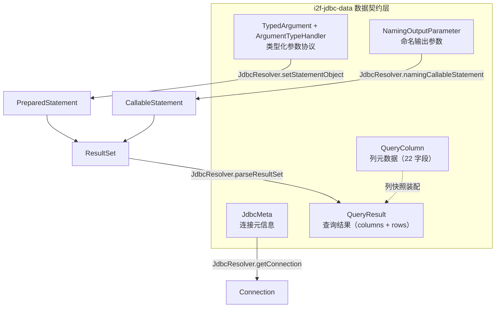

# i2f-jdbc-data — JDBC 数据契约与类型化参数模型

> **JDBC 生态的数据契约地基**（6 源文件、约 290 行、2 包、零测试）：为 i2f 的 JDBC 家族提供四组共享数据模型——连接元信息 `JdbcMeta`、查询结果模型 `QueryResult`/`QueryColumn`、类型化参数协议 `TypedArgument`/`ArgumentTypeHandler`、存储过程命名输出参数 `NamingOutputParameter`。模块内**不含任何执行逻辑**（纯数据载体 + 1 个函数式接口），全部行为在 `i2f-jdbc-impl` 的 `JdbcResolver` 中落地；被 11 个代码级模块消费，是 `i2f-jdbc-std → i2f-jdbc-impl → i2f-jdbc-bql/proxy/procedure` 依赖链的公共类型层。

## 一、模块定位

本模块是 i2f JDBC 体系的「**共享词汇表**」：所有 JDBC 相关模块（元数据、模板、BQL、存储过程、代理、XML 映射）都通过这 6 个类交换数据，避免各模块自造类型。数据在三条分支上流转：



- **入参分支**：`TypedArgument`/`NamingOutputParameter` 描述「值如何绑定到 SQL 参数」→ 由 `JdbcResolver.setStatementObject`/`namingCallableStatement` 落地到 `PreparedStatement`/`CallableStatement`；
- **出参分支**：`ResultSet` 经 `JdbcResolver.parseResultSet` 装配为 `QueryResult`（列快照 `QueryColumn` + 行数据 `List<Map<列名, 值>>`）；
- **连接分支**：`JdbcMeta` 四要素 → `JdbcResolver.getConnection(meta)` 获取 `Connection`。

## 二、包与类结构总览

| 包 | 类 | 行数 | 职责 |
|----|----|------|------|
| `i2f.jdbc.data` | `ArgumentTypeHandler` | 12 | 参数绑定函数式接口 `void handle(PreparedStatement stat, int index, Object value)`，标 `@FunctionalInterface` |
| `i2f.jdbc.data` | `NamingOutputParameter` | 64 | 存储过程命名输出参数：`name` + `sqlType`(int)/`type`(SQLType) + `input` + `value`；4 构造器 + 4 工厂 |
| `i2f.jdbc.data` | `QueryColumn` | 41 | 查询列元数据快照（22 字段，对应 `ResultSetMetaData`） |
| `i2f.jdbc.data` | `QueryResult` | 58 | 查询结果：`columns` + `rows` + 6 个便捷访问方法 |
| `i2f.jdbc.data` | `TypedArgument` | 69 | 类型化参数：`value` + `javaType`/`jdbcType`/`handler` 三通道；5 构造器 + 5 工厂 |
| `i2f.jdbc.meta` | `JdbcMeta` | 46 | 连接元信息：`driver`/`url`/`username`/`password`/`properties`；4 构造器 |

共性：除 `ArgumentTypeHandler` 外全部为 lombok `@Data` 数据类（`@NoArgsConstructor`；`QueryResult` 另有 `@AllArgsConstructor`），字段均 `protected`，零行为方法（仅 `QueryResult` 提供便捷读取）。

## 三、核心数据模型详解

### 3.1 JdbcMeta — 连接元信息

把「驱动类名 + URL + 账号密码 + 额外属性」打包为一个可传递的连接描述对象，供 `JdbcResolver.getConnection(meta)`、`DirectConnectionDatasource`、`JdbcMetaConnectionSupplier` 等在数据源/连接池场景中承载连接配置：

| 字段 | 类型 | 说明 |
|------|------|------|
| `driver` | String | JDBC 驱动类名（如 `com.mysql.cj.jdbc.Driver`） |
| `url` | String | JDBC URL |
| `username` / `password` | String | 账号密码 |
| `properties` | Properties | 额外连接属性（可空） |

提供 4 个构造器（driver+url 起，逐级叠加 username/password/properties），是「连接四要素」的常用快捷形态；被 `i2f-jdbc-impl` 的 `JdbcMetaConnectionSupplier`（`ConnectionSupplier` 实现，`get()` 直接调 `JdbcResolver.getConnection(this.meta)`）消费。

### 3.2 QueryColumn / QueryResult — 查询结果模型

**QueryColumn** 是 `java.sql.ResultSetMetaData` 的完整快照（22 字段），分组如下：

| 分组 | 字段 |
|------|------|
| 定位 | `index`、`name`、`originName`、`label` |
| 归属 | `catalog`、`schema`、`table` |
| 类型 | `clazz`(`Class<?>`)、`clazzName`、`type`(int)、`jdbcType`(`JDBCType`)、`typeName` |
| 尺寸 | `displaySize`、`precision`、`scale` |
| 能力 | `nullable`、`autoIncrement`、`readonly`、`writable`、`definitelyWritable`、`caseSensitive`、`currency`、`searchable`、`signed` |

**QueryResult** 由「列 + 行」两段组成，行数据用 `Map<列名, 值>` 承载（保持列序靠 `QueryColumn.index` / 独立 `columns` 列表），并提供便捷访问：

```java
public class QueryResult {
    protected List<QueryColumn> columns;
    protected List<Map<String, Object>> rows;

    public int rowCount();                             // rows.size()
    public int colCount();                             // columns.size()
    public String getColumnName(int colIndex);         // columns.get(colIndex).getName()
    public Object get(int rowIndex, int colIndex);     // 按列下标
    public Object get(int rowIndex, String columnName);        // 按列名精确匹配
    public Object getIgnoreCase(int rowIndex, String columnName); // 按列名忽略大小写
}
```

消费侧典型：`JdbcTemplate` 的查询返回 `QueryResult`；`JdbcResultObjectExtractor#extract(ResultSet, int columnIndex, QueryColumn column)` 以 `QueryColumn` 作为「列 → Java 属性」映射依据；`DatabaseMetadataProvider#getTableInfoByQuery(QueryResult)` 直接用结果集反推表结构。

### 3.3 TypedArgument / ArgumentTypeHandler — 类型化参数协议

`TypedArgument` 把「一个 SQL 参数」建模为 `value` + 三种可选类型提示的组合，绑定时的优先级如下（消费协议见 `i2f-jdbc-impl/JdbcResolver.setStatementObject`，L1203 起）：

| 优先级 | 字段 | 绑定行为 |
|--------|------|----------|
| 1（最高） | `handler` | 完全接管：`handler.handle(stat, index, value)` 后直接返回 |
| 2 | `javaType` | 先用 `ObjectConvertor.tryConvertAsType(obj, javaType)` 转换，再按目标类型分流绑定 |
| 3 | `jdbcType`（`SQLType`） | 作为类型提示传给 `setObject`/类型分流链（`STATEMENT_PARAMETER_HANDLERS`） |
| — | `value` | 实际参数值（可为 null） |

```java
// i2f-jdbc-impl/JdbcResolver.java L1203（摘录）
public static void setStatementObject(PreparedStatement stat, int index, Object obj) throws SQLException {
    Class<?> clazz = (obj == null ? null : obj.getClass());
    SQLType jdbcType = null;
    if (obj instanceof TypedArgument) {
        TypedArgument typedArgument = (TypedArgument) obj;
        obj = typedArgument.getValue();

        ArgumentTypeHandler handler = typedArgument.getHandler();
        if (handler != null) {
            handler.handle(stat, index, obj);   // 通道 1：完全接管
            return;
        }
        Class<?> javaType = typedArgument.getJavaType();
        if (javaType != null) {
            clazz = javaType;
            obj = ObjectConvertor.tryConvertAsType(obj, javaType);   // 通道 2：类型转换
        }
        jdbcType = typedArgument.getJdbcType();   // 通道 3：JDBC 类型提示
    }
    // ... STATEMENT_PARAMETER_HANDLERS 链 → jdbcType 直设 → 原始类型分流
}
```

`ArgumentTypeHandler` 是配套的函数式接口（唯一实现落点在 `i2f-jdbc-proxy-xml` 的 `MybatisMapperInflater`）：MyBatis 风格 XML 中 `<param handler="xxx">` 通过注册表 `registryArgumentTypeHandlers`（`ConcurrentHashMap`）+ `LruMap(300)` 缓存解析为 handler 实例，再包装成 `TypedArgument(value, handler)`；同理支持 `javaType`（`ReflectResolver.loadClass` 加载）与 `jdbcType`（按 `JDBCType` 枚举名匹配）两种标注形式。

### 3.4 NamingOutputParameter — 命名输出参数

存储过程调用场景：参数列表中混入一个「命名参数」，执行后按名字取回输出值。消费协议见 `i2f-jdbc-impl/JdbcResolver.namingCallableStatement`（L1155 起）：

```java
// i2f-jdbc-impl/JdbcResolver.java L1155（摘录）
for (Object arg : args) {
    if (arg instanceof NamingOutputParameter) {
        NamingOutputParameter parameter = (NamingOutputParameter) arg;
        if (parameter.isInput()) {
            setStatementObject(stat, i, parameter.getValue());      // 输入值先绑定
        }
        if (parameter.getType() != null) {
            stat.registerOutParameter(i, parameter.getType());      // SQLType 优先
        } else {
            stat.registerOutParameter(i, parameter.getSqlType());   // 退化到 int sqlType
        }
        context.put(i, parameter);   // 记录「位置 → 参数」，执行后回读用
    } else {
        setStatementObject(stat, i, arg);
    }
    i++;
}
```

`callNaming`（L1126）执行存储过程后，遍历 `context` 用 `stat.getObject(位置)` 逐项回读，以参数的 `name` 为键放入结果 `Map`；多结果集（`getMoreResults`）则按递减下标依次放入同一 Map——即「命名 + 位置」混合的结果模型。

## 四、使用示例

### 4.1 类型化参数（三通道）

```java
// 通道 1：完全自定义绑定
TypedArgument arg1 = TypedArgument.of("2024-01-01", (stat, index, value) ->
        stat.setObject(index, java.sql.Date.valueOf((String) value)));

// 通道 2：先按 javaType 转换（如 String → BigDecimal）
TypedArgument arg2 = TypedArgument.of(BigDecimal.class, "123.45");

// 通道 3：仅给 JDBC 类型提示
TypedArgument arg3 = TypedArgument.of(JDBCType.VARCHAR, 123);

// 直接构造
TypedArgument arg4 = new TypedArgument(JDBCType.DATE, "2024-01-01");
```

### 4.2 存储过程命名输出参数

```java
// 三参构造：input=true + value → 既是输入参数，也是输出参数
List<Object> args = Arrays.asList(
        NamingOutputParameter.of("nickname", JDBCType.VARCHAR, "-"),
        NamingOutputParameter.of("age", JDBCType.NUMERIC, 0));

// i2f-jdbc-impl 侧执行（callNaming 内部会 registerOutParameter 并回读）
Map<String, Object> ret = JdbcResolver.callNaming(conn, "{call test_proc(?, ?)}", args);
Object nickname = ret.get("nickname");   // 按名字取输出值
```

### 4.3 查询结果读取

```java
QueryResult result = JdbcResolver.query(conn, "select id, name from user", null);

int rows = result.rowCount();
int cols = result.colCount();
String colName = result.getColumnName(0);
Object v1 = result.get(0, 0);                    // 行列下标
Object v2 = result.get(0, "name");               // 列名精确匹配
Object v3 = result.getIgnoreCase(0, "NAME");     // 忽略大小写

for (QueryColumn col : result.getColumns()) {
    System.out.println(col.getName() + " -> " + col.getJdbcType());
}
```

### 4.4 连接元信息

```java
JdbcMeta meta = new JdbcMeta("com.mysql.cj.jdbc.Driver",
        "jdbc:mysql://127.0.0.1:3306/test", "root", "123456");
Connection conn = JdbcResolver.getConnection(meta);
```

## 五、消费关系与依赖

### 5.1 POM 显式声明（5 处）

| 位置 | 行 | 说明 |
|------|----|------|
| `i2f-jdbc-std/pom.xml` | L22 | **传递通道**：其 3 个源码文件（`JdbcInvokeContextProvider`/`SQLFunction`/`SQLBiFunction`）零消费 data 包，但下游 `i2f-jdbc-impl` 只声明了 `i2f-jdbc-std` 即经其传递获得本模块 |
| `i2f-database-metadata-std/pom.xml` | L27 | **真实使用**：`DatabaseMetadataProvider#getTableInfoByQuery(QueryResult)` 接口签名 |
| `i2f-jdk-all/pom.xml` | L333 | 全仓聚合 |
| 根 `pom.xml` | L516 | `dependencyManagement` 统一版本 |
| `i2f-jdbc-data/pom.xml` | L12 | 自身 |

### 5.2 代码级消费者（11 模块）

| 模块 | 使用类 | 用途 |
|------|--------|------|
| `i2f-jdbc-impl` | 全部 6 类 | 核心消费点：`JdbcResolver`（`import i2f.jdbc.data.*` + `setStatementObject`/`namingCallableStatement`/`parseResultSet`）、`JdbcTemplate`、`JdbcResultObjectExtractor`、`SqliteResultObjectExtractor`、`DirectConnectionDatasource`、`JdbcMetaConnectionSupplier`、`TestJdbc` |
| `i2f-database-metadata-std` | QueryResult | 元数据提供者接口签名 |
| `i2f-database-metadata-impl` | QueryResult、QueryColumn | 9 方言实现 + 基类/代理类（10 文件） |
| `i2f-jdbc-proxy-xml` | TypedArgument、ArgumentTypeHandler | `MybatisMapperInflater` XML 参数标注 → 包装为类型化参数（handler 注册表 + 缓存） |
| `i2f-jdbc-proxy` | QueryResult | `BaseMapper`、`ProxyRenderSqlHandler` 代理接口返回 |
| `i2f-jdbc-bql` | QueryResult | `BqlTemplate` 模板查询返回 |
| `i2f-jdbc-procedure` | QueryResult、QueryColumn、TypedArgument | `JdbcProcedureExecutor`、`BasicJdbcProcedureExecutor`、`SqlEtlNode`（ETL 节点内构造类型化参数）、`TestProcedureExecutor` |
| `i2f-extension-xproc4j` | QueryColumn、JdbcMeta | `LangEvalJavaNode`、`TestDefaultProcedureExecutor` |
| `i2f-extension-ai-rag-sqlite` | QueryResult | `SqliteBucketRagMemoryStore`、`SqliteRagEmbeddingStore`（RAG 记忆检索） |
| `i2f-springboot-ops-starter` | QueryResult、QueryColumn | `DatasourceOpsController` 数据源运维接口 |
| `i2f-springboot/test-springboot` | QueryResult | `BqlService`（演示工程） |

另：`i2f-tools/i2f-jdbc-procedure-idea-plugin` 在 `JdbcProcedureXmlLangInjectInjector` 中以**字符串模板**形式注入 `import i2f.jdbc.data.*` 代码片段（非编译期依赖）。

### 5.3 依赖传递链

```
i2f-jdbc-std ─────────────► i2f-jdbc-data   （显式声明，传递通道）
    └─ i2f-jdbc-impl ──────► i2f-jdbc-data   （经 std 传递）
         ├─ i2f-jdbc-proxy ─────► i2f-jdbc-proxy-xml
         ├─ i2f-jdbc-bql
         ├─ i2f-jdbc-procedure ─► i2f-extension-xproc4j
         ├─ i2f-database-metadata-impl ─► i2f-springboot-ops-starter
         └─ i2f-extension-ai-rag-sqlite

i2f-database-metadata-std ─► i2f-jdbc-data   （显式声明，接口真实使用）
```

几乎所有下游消费者都**未显式声明** `i2f-jdbc-data`，而经上述链路传递获得——它是典型的「底层契约库」：版本由根 POM 统一锁定（L516），随 `i2f-jdbc-std`/`i2f-database-metadata-std` 升级。

## 六、已知缺陷与设计注记

纯数据模型模块的缺陷面天然较小，**未发现高危缺陷**；以下为低危项与设计注记：

| 级别 | 位置 | 说明 |
|------|------|------|
| 低危 | `NamingOutputParameter` | `input=true` **仅由三参构造器隐式设置**；若用两参构造器 + lombok `setValue(...)` 补输入值，`isInput()` 仍为 false → `JdbcResolver` 静默跳过输入绑定，存储过程入参丢失（建议统一用三参工厂 `of(name, type, value)`） |
| 低危 | `QueryResult` | `@Data` 生成的 `toString()` 全量输出 `rows` 数据——大结果集直接打日志会爆量、拖慢日志 |
| 低危 | `QueryResult` | `rowCount()`/`colCount()`/`get*` 对 null 容器（`@AllArgsConstructor` 可传 null）与越界下标无防御，直接 `NullPointerException`/`IndexOutOfBoundsException` |
| 低危 | `QueryResult` | `get(rowIndex, columnName)` 对「列不存在」与「列值本身为 null」均返回 null，调用方无法区分 |
| 低危 | `TypedArgument` | 当第一实参静态类型为 `Class` 且第二实参为 `ArgumentTypeHandler` 时，`(Class, Object)` 与 `(Object, ArgumentTypeHandler)` 两组重载均适用且互不更具体 → 编译歧义（触发面极窄，避开该实参组合即可） |
| 注记 | `ArgumentTypeHandler` | `handle(...)` 未声明 `throws SQLException`，实现方无法透传受检的 SQL 异常（`JdbcResolver` 直接调用，需自行包 `RuntimeException`）；且 handler 一旦非空即**完全接管**，`javaType`/`jdbcType` 通道被忽略 |

此外本模块**零单元测试**（6 文件全在 `src/main`）——由于是纯数据类（lombok 生成），风险主要体现在消费协议的协作语义上（如 `input` 标记、三通道优先级），建议在消费方（`i2f-jdbc-impl`）补充协议级测试覆盖。

## 七、总结

| 维度 | 结论 |
|------|------|
| 定位 | i2f JDBC 生态的共享数据契约层（6 类 290 行，无执行逻辑） |
| 核心价值 | 四组模型支撑三条数据流：连接（JdbcMeta）、入参（TypedArgument/NamingOutputParameter）、出参（QueryResult/QueryColumn） |
| 依赖 | 仅 lombok（5 个 `@Data` 数据类真实使用），零三方运行期依赖 |
| 消费面 | 11 个代码级模块 + 1 个 IDE 插件字符串模板 + `i2f-jdk-all` 聚合；核心消费点集中在 `i2f-jdbc-impl/JdbcResolver` |
| 设计亮点 | `TypedArgument` 的「handler → javaType → jdbcType」三级绑定协议、`NamingOutputParameter` 的「命名 + 位置」存储过程结果模型 |
| 主要风险 | `input` 标记的隐式耦合、`QueryResult` 无防御访问、零测试 |
