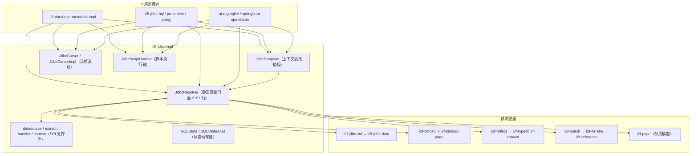

# i2f-jdbc-impl — JDBC 执行引擎与模板门面

> **i2f JDBC 体系的核心执行层**（19 源文件、约 4375 行、14 包、零测试）：以 2191 行的超级门面 `JdbcResolver` 为中心——连接管理/事务模板、SQL 自动分类、query/list/page/find/get 查询家族、batch 批处理、call/callNaming 存储过程、cursor 流式游标、30+ 类型的参数绑定级联、ResultSet→QueryResult/Bean 解析管线、三组 SPI 扩展注册表；辅以 `JdbcTemplate`（上下文委托模板）/`JdbcCursorImpl`（预取缓冲流式游标）/`JdbcScriptRunner`（反编译重建的 SQL 脚本执行器）/`SQLState`（803 行常量枚举）与 datasource/extract/handler 支撑件。被 11 个外部模块（31 文件）消费，是 `i2f-database-metadata-impl`、`i2f-jdbc-bql`/`procedure`/`proxy`、`ai-rag-sqlite`、`springboot-ops-starter` 等的统一数据库访问底座。**中危瑕疵**：jdbcType 分支双重 `return` 致参数静默不绑定、`loadDriver` 任一失败即抛的 AND 逻辑、空批处理 NPE、时间类型参数被 `setDate` 截断等（详见缺陷章节）。

## 一、模块定位与架构

本模块是整个 i2f 家族访问关系型数据库的**唯一执行引擎**：数据契约来自 `i2f-jdbc-data`（`QueryResult`/`QueryColumn`/`TypedArgument`/`NamingOutputParameter`/`JdbcMeta`），SQL 绑定模型来自 `i2f-bindsql`（`BindSql`/`BindSqlWrappers`），分页模型来自 `i2f-bindsql-page`/`i2f-page`，而「真正连库、绑参、执行、解析」全部落在本模块。



三条消费主线：

| 入口 | 适用场景 | 特点 |
|------|---------|------|
| `JdbcResolver` 静态方法 | 直接持有 `Connection` 的裸 JDBC 场景 | 全功能：查询/更新/批处理/存储过程/游标/脚本 |
| `JdbcTemplate` | 需要统一「取连接 → 执行 → 归还」会话边界的场景 | 委托 `JdbcInvokeContextProvider`，业务侧不再感知连接来源 |
| `JdbcCursor` | 大数据量流式读取（不一次性载入内存） | 预取一行缓冲 + 自动释放 + 可迭代 |

## 二、依赖关系

### 2.1 POM 声明依赖（8 项）

| 依赖 | 范围 | 真实性 | 用途 |
|------|------|--------|------|
| `lombok` | compile | ✅ 真实使用 | `@Data`/`@NoArgsConstructor`（`JdbcTemplate`、`JdbcScriptRunner`、`ParseResultSetRowContext`、datasource 实现等） |
| `i2f-jdbc-std` | compile | ✅ 真实使用 | `SQLFunction`/`SQLBiFunction` 函数式契约、`JdbcInvokeContextProvider` 上下文提供器 |
| `i2f-bindsql` | compile | ✅ 真实使用 | `BindSql`/`BindSql.Type`/`BindSqlWrappers`（分页封装） |
| `i2f-reflect` | compile | ✅ 真实使用 | `ReflectResolver`（`getFields`/`getInstance`/`map2bean` 行→Bean 转换）、`Visitor`（批处理表达式取值） |
| `i2f-page` | compile | ✅ 真实使用 | `Page`/`ApiOffsetSize` 分页模型 |
| `i2f-bindsql-page` | compile | ✅ 真实使用 | `PageBindSql`（countSql+pageSql 双 SQL 载体） |
| `i2f-match` | compile | ✅ 真实使用 | `RegexUtil`（batch 的 `${expr}` 正则替换） |
| `mysql-connector-java` | provided + optional | ⚠️ 仅演示 | 源码中无编译期引用，仅 `TestJdbc` 用字符串 `Class.forName("com.mysql.cj.jdbc.Driver")` |

### 2.2 隐式传递依赖（POM 未声明、源码真实引用）

| 传递依赖 | 传递路径 | 使用点 |
|----------|---------|--------|
| `i2f-jdbc-data` | `i2f-jdbc-std` → `i2f-jdbc-data` | `QueryResult`/`QueryColumn`/`TypedArgument`/`NamingOutputParameter`/`JdbcMeta`（高频，核心数据契约） |
| `i2f-typeof` | `i2f-reflect` → `i2f-typeof` | `TypeOf.typeOf`/`typeOfAny`（Bean 行转换、null 参数类型猜测） |
| `i2f-convert` | `i2f-reflect` → `i2f-convert` | `ObjectConvertor.tryConvertAsType`（参数绑定类型转换） |
| `i2f-database-type` | `i2f-bindsql-page` → `i2f-database-type` | `DatabaseType.typeOfConnection`（游标 fetchSize 策略、SQLite extractor 判定） |
| `i2f-reference` | `i2f-match` → `i2f-iterator` → `i2f-reference` | `Reference` 三态协议（`JdbcResultObjectExtractor.extract` 返回值） |

## 三、包结构与类清单

| 包 | 文件（行数） | 职责 |
|----|-------------|------|
| `i2f.jdbc` | `JdbcResolver`（2191） | 核心静态度量门面 |
| `i2f.jdbc.template` | `JdbcTemplate`（429） | 上下文委托模板（构造即绑定连接提供器） |
| `i2f.jdbc.cursor` | `JdbcCursor`（75） | 游标接口（`Closeable` + `Iterable`，`nextCount` 默认方法） |
| `i2f.jdbc.cursor.impl` | `JdbcCursorImpl`（138） | 预取缓冲游标实现（`ReentrantLock` 串行化 + 自动 `dispose`） |
| `i2f.jdbc.script` | `JdbcScriptRunner`（355） | SQL 脚本执行器（**反编译重建源码**） |
| `i2f.jdbc.consts` | `SQLState`（803）、`SQLStateAlias`（21） | SQLState 常量枚举（5 位码+中文描述）+ 别名枚举 |
| `i2f.jdbc.datasource` | `ConnectionSupplier`（14） | 连接供给函数式接口 |
| `i2f.jdbc.datasource.impl` | `DatasourceConnectionSupplier`（28）、`DirectConnectionDatasource`（84）、`JdbcMetaConnectionSupplier`（29） | DataSource/`JdbcMeta` 两种连接来源适配 |
| `i2f.jdbc.context.impl` | `DirectJdbcInvokeContextProvider`（33） | 直连上下文（begin/end 空实现） |
| `i2f.jdbc.extract` | `JdbcResultObjectExtractor`（18）、`DatabaseTypeResultObjectExtractor`（25） | 结果对象抽取 SPI（Reference 三态返回） |
| `i2f.jdbc.extract.impl` | `SqliteResultObjectExtractor`（33） | SQLite BLOB→`getBytes` 特化 |
| `i2f.jdbc.handler` | `StatementParameterSetHandler`（13）、`ResultSetObjectConvertHandler`（11） | 参数绑定 / 结果转换 SPI 契约 |
| `i2f.jdbc.handler.impl` | `Clob2StringResultSetObjectConvertHandler`（24） | Clob→String 转换器 |
| `i2f.jdbc.test` | `TestJdbc`（51） | 演示 main（本地 MySQL 存储过程调用示例） |

## 四、核心机制详解

### 4.1 JdbcResolver：API 布局（12 组）

| 分组 | 代表方法 | 说明 |
|------|---------|------|
| 连接管理 | `getConnection(driver,url[,user,pwd/Props])`、`getConnection(JdbcMeta)`、`loadDriver` | 双重加载驱动；`08001` 时经 SPI 兜底 `Driver.connect` |
| 事务模板 | `begin`/`auto`/`commit`/`rollback`、`transaction(conn, op, arg)`、`transaction(conn, List<BindSql>)` | 自动恢复原 `autoCommit`；SQL 列表按类型分派执行 |
| SQL 分类 | `detectType(sql)` | 前缀判定 `QUERY`/`UPDATE`/`CALL`/`UNSET` |
| 查询 | `query`（返回 `QueryResult` 或自定义 handler）、`list`、`page`、`find`（期望单行）、`get`（期望单列单行） | `find` 用 `maxCount=2` 探针检测多行并抛 `SQLDataException` |
| 更新 | `update(conn, sql, args)` | `executeUpdate` 返回影响行数 |
| 批处理 | `batch`（Iterable/Iterator × BindSql/String/表达式 × filter × batchSize）、`batch0`、`batchByListableValues` | `${expr}` 经 `Visitor.visit` 取值；`?` 占位替换 |
| 存储过程 | `call`（位置出参 `Map<Integer,SQLType>`）、`callNaming`（`NamingOutputParameter` 命名出参）、`callStatement`/`namingCallableStatement`、`callSql` | 返回 `Map`：`-1` 为执行 boolean，其余为出参/多结果集（key 递减） |
| 游标 | `cursor`（`Map` 或 Bean 两种行类型 × 多种重载）、`cursor0`、`buildCursorStatement` | MySQL/PG fetchSize 特判 `Integer.MIN_VALUE`；默认 fetchSize 2000 |
| 参数绑定 | `setStatementObject`、`setStatementObjectWithJdbcType`、`setStatementNullWithType`、`fillStatementArgs` | 30+ instanceof 级联 + JDBCType 全枚举分支 + null 类型猜测 |
| 结果解析 | `parseResultSet`（3 层泛型管线）、`parseResultSetAsBeanList`、`parseResultSetColumns`（4 重载）、`convertResultSetRowAsMap`、`createDefaultRowConvertor`、`createResultSetRowBeanConvertor` | 列元数据 22 字段快照；行转换三级列名匹配 |
| 结果对象 | `getResultObject`（按 sqlType 分派 getter）、`postProcessResultObject`（转换 handler 链 + Clob 兜底） | `TIME/TIMESTAMP_WITH_TIMEZONE` 走 `getTime`/`getTimestamp` |
| SPI 注册表 | `STATEMENT_PARAMETER_HANDLERS`、`RESULT_SET_OBJECT_CONVERT_HANDLERS`、`RESULT_OBJECT_EXTRACTORS` | `CopyOnWriteArrayList` + `ServiceLoader` 静态块加载；内置追加 `SqliteResultObjectExtractor.INSTANCE` |

### 4.2 三组 SPI 扩展点

模块本身**无 `META-INF/services` 资源**（无 resources 目录），SPI 由外部 jar 按需注册：

```java
static {
    ServiceLoader<StatementParameterSetHandler> parameterSetHandlers = ServiceLoader.load(StatementParameterSetHandler.class);
    // ... 逐一 add 到三个 CopyOnWriteArrayList（遍历时无锁并发安全）
    RESULT_OBJECT_EXTRACTORS.add(SqliteResultObjectExtractor.INSTANCE); // 唯一内置项
}
```

| SPI | 契约 | 拦截点 |
|-----|------|--------|
| `StatementParameterSetHandler.set(stat, index, obj, jdbcType, javaType)` | 返回 `true` 表示已处理 | `setStatementObject` 最先遍历（在 jdbcType 分支与 instanceof 级联之前） |
| `ResultSetObjectConvertHandler.support/convert` | 首个 `support` 命中的生效 | `postProcessResultObject`（读取值后统一加工，如 Clob→String） |
| `JdbcResultObjectExtractor.support/extract` | 返回 `Reference`（VALUE/NOP/FINISH） | `convertResultSetRowAsMap` 按列抽取（如 SQLite BLOB 因驱动差异用 `getBytes`） |

### 4.3 参数绑定级联（`setStatementObject`）

绑定顺序（自源码逐层摘录）：

1. `TypedArgument` 解包：`handler` → 直接处理；`javaType` → 先 `ObjectConvertor.tryConvertAsType` 强转；`jdbcType` → 进入 JDBCType 分支；
2. SPI handler 链（`STATEMENT_PARAMETER_HANDLERS`）；
3. `jdbcType != null` → `setStatementObjectWithJdbcType`（覆盖 TINYINT/SMALLINT/INTEGER/BIGINT/FLOAT/REAL/DECIMAL/DOUBLE/NUMERIC/VARCHAR/CHAR/NVARCHAR/NCHAR/DATE/TIME/TIMESTAMP[±TZ]/NULL/BLOB/CLOB/NCLOB/LONGVARCHAR/LONGNVARCHAR/BINARY/VARBINARY/LONGVARBINARY）；
4. `obj == null` → `setStatementNullWithType`（按 Java 类型猜 SQL 类型：整型→`Types.INTEGER`、长整→`BIGINT`、字符串族→`VARCHAR`、数值→`NUMERIC`、日期→`DATE`、布尔→`BOOLEAN`、兜底 `VARCHAR`）；
5. instanceof 级联（30+ 分支）：基本类型包装类 → `java.sql.Date`/`Timestamp`/`Time` → `java.util.Date`/`LocalDateTime`/`LocalDate`（**均经 `setDate`**）→ `BigDecimal`/`BigInteger`/`Character`/`String`/`CharSequence`/`Boolean` → `Calendar`/`LocalTime`（`setTime`）/`Instant`/`Clock` → `byte[]`/`AtomicInteger`/`AtomicLong`/`Number`/`Appendable`/`AtomicBoolean` → `AtomicReference`/`ThreadLocal`（**递归解包**）→ `char[]`/`Reader`（`setCharacterStream`）→ `InputStream`（`ByteArrayInputStream` 走 `setBlob(bis, available)`，否则 `setBlob(is)`）→ `NClob`/`Clob`/`Blob`；
6. 兜底 `stat.setObject(index, obj)`。

### 4.4 结果解析管线（`parseResultSet`）

```java
public static <T, R> R parseResultSet(ResultSet rs, int maxCount, Class<T> elemType,
                                      Function<String, String> columnNameMapper,
                                      Function<ParseResultSetRowContext<T>, R> returnTypeInitializer,
                                      BiConsumer<R, T> rowCollector,
                                      BiFunction<ParseResultSetRowContext<T>, Map<String, Object>, T> rowConvertor)
```

三段式泛型管线：`returnTypeInitializer`（产出容器，如 `QueryResult` 或 `LinkedList`）→ 每行 `convertResultSetRowAsMap` 转 `Map<列名,值>`（extract 优先、否则 `getResultObject`）→ `rowConvertor` 把 Map 变 Bean/Map → `rowCollector` 收集；`finally` 中**无条件 `rs.close()`**（消费完即关，这正是 `BaseDatabaseMetadataProvider` 直接 `JdbcResolver.parseResultSet(metaData.getTables(...))` 模式的依赖）。

行→Bean 的 `createDefaultRowConvertor` 采用三级列名匹配：

```java
for (QueryColumn item : columns) {
    String name = item.getName();
    equalMap.putIfAbsent(name, item);                              // ① 精确匹配
    equalIgnoreMap.putIfAbsent(name.toLowerCase(), item);          // ② 忽略大小写
    fuzzyMap.putIfAbsent(name.toLowerCase().replace("_", ""), item); // ③ 去下划线模糊
}
```

### 4.5 JdbcTemplate：会话委托模板

```java
protected <T, R> R contextActionDelegate(T bql, SQLBiFunction<Connection, T, R> action) throws SQLException {
    Object context = contextProvider.beginContext();
    Connection conn = contextProvider.getConnectionInner(context);
    try {
        R ret = action.apply(conn, bql);
        return ret;
    } catch (Throwable e) {
        // RuntimeException / SQLException 直抛，其余包装为 IllegalStateException
    } finally {
        contextProvider.endContextInner(context, conn);  // 统一归还/关闭
    }
}
```

所有公开方法（batch 家族 20 个重载、update/get/find/list/page、call/callNaming、queryRaw/queryHandler）都经此模板转调 `JdbcResolver`；两个构造器：`JdbcTemplate(Connection)`（包一层 `DirectJdbcInvokeContextProvider`）或直接传 `JdbcInvokeContextProvider`（如事务上下文、连接池上下文——`i2f-jdbc-bql` 的 `BqlTemplate` 即其子类）。

### 4.6 JdbcCursorImpl：预取缓冲游标

- 字段：`stat`/`rs` + `rowHolder`（预取行）+ `contextHolder`（列上下文惰性初始化）+ `ReentrantLock`；
- `hasRow()`：锁内 `fetchNextRow()`（若 `rs.next()` 成功则转换并放入 `rowHolder`）；**无下一行时自动 `dispose()`**（关闭 rs/stat 并置空）；
- `nextRow()`：消费 `rowHolder`；已耗尽/已关闭时抛 `SQLException("ResultSet has been consumed!")`；
- `iterator()`（接口默认方法）：`hasNext/nextRow` 转 `Iterator`，SQL 异常包装为 `IllegalStateException`；
- `dispose()` 幂等（判空+判 `isClosed`），`finalize()` 兜底（JDK9+ 已废弃）。

### 4.7 JdbcScriptRunner：脚本执行器

> ⚠️ 文件头部标记 `Source code recreated from a .class file by IntelliJ IDEA (powered by FernFlower decompiler)`——**当前源码为反编译重建产物**。

| 配置项 | 默认 | 说明 |
|--------|------|------|
| `stopOnError` | false | 出错是否中断（false 则记录继续） |
| `throwWarning` | false | SQLWarning 是否升级为异常抛出 |
| `autoCommit` | false | 执行前强制关闭自动提交（`setAutoCommit()`） |
| `sendFullScript` | false | true 则整脚本一次 `execute`；false 按行累积到分隔符再执行 |
| `removeCrChar` | false | 执行前 `\r\n` → `\n` |
| `escapeProcessing` | true | `setEscapeProcessing` 透传 |
| `delimiter` | `;` | 支持注释行 `-- @DELIMITER $$` 动态切换 |
| `fullLineDelimiter` | false | 分隔符必须独占一行 |
| `logPrinter`/`logErrorPrinter` | stdout/stderr | 输出可重定向 |

执行流：`runScript(File/URL/InputStream/Reader/String)` → `executeLineByLine`（`lineIsComment` 跳过注释并识别 `@DELIMITER`；`commandReadyToExecute` 命中分隔符则截断执行）→ `executeStatement`（`Statement.execute` + `getMoreResults` 循环打印 update count 与结果集）→ 成功 `commit` / 失败 `rollback` 后抛 `IllegalStateException`。

### 4.8 SQLState / SQLStateAlias

`SQLState` 是 803 行的**纯常量枚举**：两段式命名（2 位分类码如 `C_22` + 5 位完整码如 `C_22012`），携带中文描述，提供 `sqlState()`/`description()` 访问器（对标 IBM DB2 系 SQLState 全表 + `ZZZZZ` 占位码）。`SQLStateAlias` 目前仅 1 个成员 `DIVIDE_ZERO(SQLState.C_22012)`，用于给常用状态码起业务别名。

### 4.9 连接来源与上下文支撑件

| 类 | 作用 |
|----|------|
| `ConnectionSupplier` | `@FunctionalInterface`：`Connection get()` |
| `DatasourceConnectionSupplier` | 包装 `javax.sql.DataSource` |
| `JdbcMetaConnectionSupplier` | 由 `JdbcMeta`（driver/url/user/pwd/properties）转 `JdbcResolver.getConnection` |
| `DirectConnectionDatasource` | 把任意 `ConnectionSupplier`/`JdbcMeta` 适配成 `DataSource`（`unwrap` 直接抛不支持） |
| `DirectJdbcInvokeContextProvider` | 直连上下文：`beginContext` 返回固定连接，`endContext` 空操作（不关闭） |

## 五、使用示例

### 5.1 连接与事务

```java
// 直接连接（驱动双重加载，兼容容器 ClassLoader 场景）
Connection conn = JdbcResolver.getConnection("com.mysql.cj.jdbc.Driver",
        "jdbc:mysql://localhost:3306/db?useUnicode=true&characterEncoding=utf8",
        "root", "123456");

// 由 JdbcMeta 建立
Connection conn2 = JdbcResolver.getConnection(new JdbcMeta(driver, url, username, password));

// 事务模板：自动 begin/commit/rollback，并恢复原 autoCommit
Integer effected = JdbcResolver.transaction(conn, (c, sql) -> {
    int n = JdbcResolver.update(c, "update sys_user set age = ? where id = ?", Arrays.asList(18, 1));
    return n;
}, null);

// 多条 SQL 事务：自动按 detectType 分派 query/update/callNaming
List<Object> results = JdbcResolver.transaction(conn, Arrays.asList(
        BindSql.of("update ..."),
        BindSql.update("insert ...").addArg(1, "x"),
        BindSql.of("select ...")
));
```

### 5.2 查询家族

```java
// QueryResult（列元数据 + 行 Map）
QueryResult qr = JdbcResolver.query(conn, "select * from sys_user where age > ?", Arrays.asList(18));

// 行 Map 列表 / 分页（自动生成 count 与分页 SQL）
List<Map<String, Object>> rows = JdbcResolver.list(conn, BindSql.of("select ..."));
Page<Map<String, Object>> page = JdbcResolver.page(conn, "select ...", args, new ApiOffsetSize(0, 10));

// 映射 Bean（三级列名匹配：精确 / 忽略大小写 / 去下划线）
List<SysUser> users = JdbcResolver.list(conn, "select * from sys_user", null, SysUser.class);

// 期望单行/单列：多于一行时抛 SQLDataException
SysUser user = JdbcResolver.find(conn, BindSql.of("select ... where id=?"), SysUser.class);
Long count = JdbcResolver.get(conn, "select count(1) from sys_user", null, Long.class);
```

### 5.3 批处理（三种绑定来源）

```java
// ① BindSql 参数为表达式/Functions：${name} 表达式经 Visitor 求值
JdbcResolver.batch(conn, BindSql.of("insert into t(a,b) values(${a}, ${b})"), userList, 500);

// ② String sql + ${} 表达式：正则保护字符串/注释，替换为 ? 后绑定
JdbcResolver.batch(conn, "update t set a=${a} where id=${id}", iterable);

// ③ 显式表达式列表 + 过滤器
JdbcResolver.batch(conn, "insert into t(a) values(?)",
        Arrays.asList("a"), iterable, e -> e.enabled, 1000);
```

### 5.4 存储过程（位置出参 / 命名出参）

```java
Map<Integer, Object> ret = JdbcResolver.call(conn, "{ call sp_test(?,?,?) }",
        Arrays.asList(1, null, null),
        new LinkedHashMap<Integer, SQLType>() {{ put(1, JDBCType.INTEGER); put(2, JDBCType.VARCHAR); }});
// ret.get(-1)=执行 boolean；ret.get(1)/ret.get(2)=出参

Map<String, Object> named = JdbcResolver.callNaming(conn, "{ call sp_test(?,?,?,?) }", Arrays.asList(
        NamingOutputParameter.of("nickname", JDBCType.VARCHAR, "-"),
        NamingOutputParameter.of("age", JDBCType.NUMERIC, 0),
        1, "root"));
```

### 5.5 流式游标

```java
try (JdbcCursor<Map<String, Object>> cursor = JdbcResolver.cursor(conn, "select * from big_table")) {
    for (Map<String, Object> row : cursor) {  // Iterable 直用；耗尽时自动关闭底层资源
        // 逐行处理大结果集，不一次性载入内存
    }
}
```

### 5.6 脚本执行

```java
JdbcScriptRunner runner = new JdbcScriptRunner(conn);
runner.setStopOnError(true);
runner.setLogPrinter(log::info);
runner.runScript(new File("schema.sql"));
runner.runScript("-- @DELIMITER $$\nCREATE PROCEDURE ... END$$\n");
```

### 5.7 自定义扩展（SPI）

```java
// 方式一：运行期直接注册（CopyOnWriteArrayList 线程安全）
JdbcResolver.STATEMENT_PARAMETER_HANDLERS.add((stat, index, obj, jdbcType, javaType) -> {
    if (obj instanceof MyType) { stat.setString(index, ((MyType) obj).encode()); return true; }
    return false;
});

// 方式二：实现接口 + META-INF/services 文件（本模块不提供资源，供外部 jar 声明）
```

## 六、消费关系

### 6.1 外部消费者总览（11 模块 / 31 文件）

| 模块 | 声明方式 | 文件数 | 典型使用 |
|------|---------|--------|---------|
| `i2f-database-metadata-impl` | POM L43 显式 | 9 | `JdbcResolver.parseResultSet(metaData.getTables(...))`——JDBC 元数据 ResultSet 直转 QueryResult |
| `i2f-jdbc-procedure` | POM L23 显式 | 5 | `BasicJdbcProcedureExecutor` 调度；`SqlCursorNode`/`SqlEtlNode` 用 `cursor()`；`SqlRunnerNode` 用 `JdbcScriptRunner` |
| `i2f-springboot-ops-starter` | POM L61 显式 | 5 | `DatabaseQueryTools` 用 `page()` 做 AI 只读查询；`DatasourceOpsController` 用 `JdbcScriptRunner` |
| `i2f-extension-ai-rag-sqlite` | POM L45 显式 | 3 | `SqliteVecUtils` 加载 sqlite-vec 扩展 + `query`；RAG 存储读写 |
| `i2f-jdbc-bql` | POM L17 显式 | 1 | `BqlTemplate extends JdbcTemplate`——BQL 语法糖全家桶 |
| `i2f-jdbc-proxy` | POM L36 显式 | 1 | `ProxyRenderSqlHandler` 渲染后执行 |
| `i2f-extension-xproc4j` | 经 `i2f-jdbc-procedure` 传递 | 2 | `LangEvalJavaNode` 在脚本节点内执行 SQL |
| `i2f-translate-en2zh` | 经 `i2f-jdbc-bql` 传递 | 2 | SQLite 词典库查询 |
| `i2f-translate-zh2pinyin` | 经 `i2f-jdbc-bql` 传递 | 1 | 同上 |
| `i2f-extension-reverse-engineer-generator` | 经 `i2f-database-metadata-impl` 传递（test） | 1 | 反向工程入口建连 |
| `i2f-jdbc-procedure-idea-plugin` | **Gradle 项目**（非 Maven）：`implementation(":i2f-extension-xproc4j:1.0-jdk8")` + flatDir 本地 jar | 1 | IDEA 插件注入 XML 的 SQL 校验 |

### 6.2 API 使用热度（全仓外部调用统计）

| 方法 | 次数 | 说明 |
|------|------|------|
| `parseResultSet` | 65 | **最热 API**——`*DatabaseMetadataProvider` 的元数据解析底座 |
| `query` | 28 | 通用查询 |
| `update` | 11 | 写入 |
| `list` | 9 | 行列表 |
| `page` | 8 | 分页 |
| `getConnection` | 5 | 建连（含 sqlite-vec 场景） |
| `find`/`get` | 4+4 | 单行/单值 |
| `cursor`/`buildCursorStatement`/`batchByListableValues`/`batch` 等 | 各 1-2 | 游标/批处理/其它 |

### 6.3 注册链路

| 位置 | 行号 |
|------|------|
| `i2f-jdk/pom.xml`（modules） | L97 |
| `i2f-jdk/i2f-jdk-all/pom.xml`（聚合 fat-jar） | L337 |
| 根 `pom.xml`（dependencyManagement） | L521 |

## 七、已知缺陷与设计注记

### 7.1 中危（4 条）

**① `setStatementObject` 的 jdbcType 分支双重 `return`——参数静默不绑定**

```java
if (jdbcType != null) {
    boolean handled = setStatementObjectWithJdbcType(stat, index, obj, jdbcType);
    if (handled) {
        return;
    }
    return;   // ← 第二个 return 无条件执行：未处理时不落入后续 instanceof 级联
}
```

`setStatementObjectWithJdbcType` 仅覆盖常见 JDBCType 且**转换失败也返回 false**（如把 `"abc"` 当 Integer 转换失败）；叠加该分支后，参数**不设置任何值**（不是 null，是保持未绑定），无异常无日志。第二个 `return;` 紧跟在 `if (handled) { return; }` 之后完全冗余，疑为笔误（意图应是「未处理则继续往下走」）。触发场景：`TypedArgument` 指定了 `ARRAY`/`OTHER`/`JAVA_OBJECT` 等未覆盖类型，或 `javaType` 转换失败。

**② `loadDriver` 两次加载「任一失败即抛」的 AND 逻辑**

```java
Exception ex = null;
try { Class.forName(driver); } catch (Exception e) { ex = e; }
try { Thread.currentThread().getContextClassLoader().loadClass(driver); } catch (Exception e) { ex = e; }
if (ex != null) { throw new SQLException(ex.getMessage(), ex); }
```

两个加载器（调用者 CL 与线程上下文 CL）中**只要有一次失败就抛异常**，即使另一次成功；而该双保险的意图恰是兼容「某一 CL 不可见」的场景（`getConnection` 的 `08001` 注释可佐证设计意图是任一成功即可）。反向场景：`Class.forName` 成功但上下文 CL 加载失败时同样误抛（类实际已加载）。

**③ `batch0` / `batchByListableValues`：空输入（或 filter 全过滤）时 `stat.executeBatch()` NPE**

`batchSize < 0` 分支中 `stat` 仅在循环体内惰性创建，循环外却无条件 `stat.executeBatch()`：

```java
if (batchSize < 0) {
    while (iterator.hasNext()) { /* ... if (stat == null) stat = conn.prepareStatement(sql); ... */ }
    stat.executeBatch();   // 空迭代器 / filter 全部过滤 → stat 仍为 null → NPE
}
```

`batchSize >= 0` 分支有 `if (count > 0)` 保护而幸免；同一模块两种分支行为不一致，易在实践中踩中「数据恰好为空时炸、有数据时正常」。

**④ 时间类型参数被 `setDate` 截断——时分秒静默丢失**

`java.util.Date`（非 SQL 子类实例）、`LocalDateTime`、`Instant`、`Clock`、`Calendar` 参数均走：

```java
if (obj instanceof LocalDateTime) {
    stat.setDate(index, (java.sql.Date) ObjectConvertor.tryConvertAsType(obj, java.sql.Date.class));
    return;
}
```

`setDate` 只写日期部分——向 `DATETIME`/`TIMESTAMP` 列写入 `LocalDateTime` 参数会落库为当日 `00:00:00`；`Instant`/`Calendar`/纯 `java.util.Date` 同理（含时区的时刻信息同样丢失）。`LocalTime` 走 `setTime` 是唯一正确保留时间的位置。上游 `i2f-log` 的 `JdbcDatasourceLogWriter` 亦踩过同类问题（被记录为已知瑕疵）。

### 7.2 低危与注记（8 条）

| # | 位置 | 问题 |
|---|------|------|
| ⑤ | `detectType` | `sql.trim().toLowerCase()` 无 `Locale` 参数（土耳其语环境 `INSERT`→`ınsett` 导致误判 `UNSET`）；且 SQL 前有 `/* 注释 */`/`WITH` 等前缀时返回 `UNSET`（随后按 QUERY 走） |
| ⑥ | `update`/`query`/`call` | `try-with-resources` 内再手动 `stat.close()`、外层 `finally` 又判断关闭——多重冗余关闭（幂等无害，但反映历史演进痕迹） |
| ⑦ | `JdbcCursorImpl` | `finalize()` 兜底 `dispose()`（JDK9+ 废弃 API，且 `dispose` 抛出的 `SQLException` 会吞入 finalizer）；`fetchNextRow` 中行转换抛异常时本次不 `dispose`（资源依赖调用方 close） |
| ⑧ | `JdbcScriptRunner`（反编译产物） | 分隔符解析用 `line.lastIndexOf(delimiter)`/`contains(delimiter)`——**字符串字面量内的分号会误截断**；`printResults` 行内列值用 `"\n"` 连接（表头用 `\t`，输出错位，疑反编译损耗）；`runScript(Reader)` 与内部方法重复 close；`autoCommit` 被改为 false 后**不恢复**原值 |
| ⑨ | `batch0` | `List<T> once` 仅收集/清空、从未读取——死代码残留 |
| ⑩ | 零散项 | `getConnection` 中 `Driver dv = DriverManager.getDriver(url)` 变量未使用（探测余留）；`SQLState.C_TP57032("TP57032", ...)` 值长 7 位（其余为 2/5 位）；`SQLState` 有两个未使用的构造器重载；`SQLStateAlias` 仅 1 个成员 |
| ⑪ | `buildCursorStatement` | MySQL/PG 分支把用户传入的 `fetchSize` 覆盖为 `Integer.MIN_VALUE`（MySQL 流式标志需配合 URL 参数 `useCursorFetch=true`；PG 的游标模式要求 `fetchSize > 0`，负值实际禁用其游标特性） |
| ⑫ | `parseResultSet` | 循环内双重 `maxCount` 判断（第二个判断已保证退出，第一个为死代码；且 `rs.next()` 已前进时 break 会多消费一行——因随后即 `rs.close()` 无实际影响） |

### 7.3 正面设计要点

- **参数绑定面极广**：30+ 类型级联 + 原子类型/`AtomicReference`/`ThreadLocal` 递归解包 + `char[]`/`Reader`/`InputStream`/`Clob` 家族，覆盖绝大多数业务参数形态；
- **三 SPI 全部 `CopyOnWriteArrayList`**：运行期热注册、遍历无锁，扩展性良好；
- **`find`/`get` 探针语义**：用 `maxCount=2` 而不是全量加载检测「多于一行」；
- **`parseResultSet` 消费即关**：`finally rs.close()` 使「元数据直读」模式零样板代码；
- **游标自动释放**：`fetchNextRow` 探测到无下一行即 `dispose`，`for-each` 正常结束无需手工 close；
- **`batch` 表达式绑定**：`${expr}` 正则替换时保护字符串字面量/单双行注释（`('[^']*')|(--...)|(/\*...\*/)`），并支持 `Function`/表达式双形态取值。

## 八、总结

`i2f-jdbc-impl` 是 i2f 数据库生态的**心脏**：4375 行代码里沉淀了连接管理、事务、查询/更新/批处理/存储过程/游标/脚本六大家族 API，加上参数绑定与结果解析两条巨型管线，以及三组 SPI 扩展点。它承担了全仓 11 个外部模块（31 文件）的数据库访问，其中最重的单一消费者是 `i2f-database-metadata-impl`（65 处 `parseResultSet` 调用）。

风险集中在**静默失败**一类问题（④ 时间截断、① 参数漏绑、② 驱动误抛、③ 空批 NPE）——它们大多不抛异常、只出错数据，叠加全模块**零单元测试**的现实，建议使用中重点回归：`TypedArgument` 带 jdbcType 的场景、`LocalDateTime`/`Instant` 写入 DATETIME 列、空集合批处理、容器化 ClassLoader 环境的驱动加载。规避方式：时间参数显式包 `Timestamp` 或改用 `TypedArgument` + `JDBCType.TIMESTAMP`；批处理前对空集合短路；jdbcType 尽量使用覆盖枚举。
