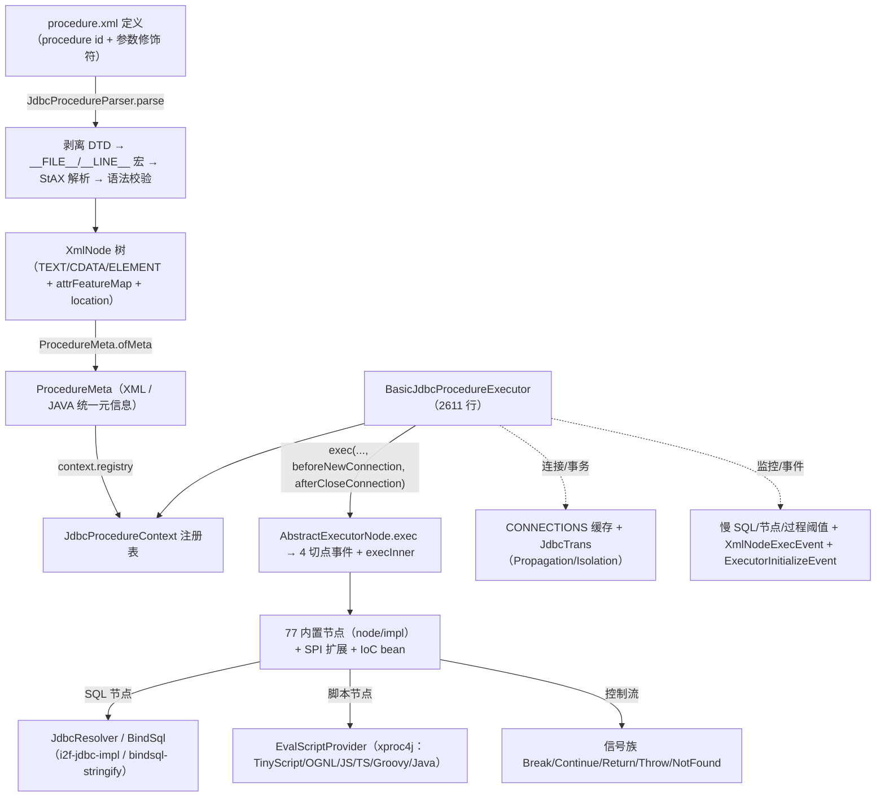

# i2f-jdbc-procedure

> **XML 存储过程 / 工作流引擎（XProc4J = Xml Procedure for Java）——「去数据库存储过程」的核心业务引擎**：全模块 **156 个源文件、14257 行、39 个包**（`src/main/java`）＋**内置 12 份官方技术文档（`src/main/resources/assets/std/`，19873 行：procedure.md 4029 / node-definition.md 4047 / procedure.xml 2105 / convert-guide.md 1697 / quick-start.md 1292 / procedure.dtd 1257 / TinyScript.md 1137 / Funic.md 1770 / product-compare.md 1085 / framework.md 974 / design.md 447 / readme.md 33）**＋演示文档 `docs/`（demo_main.xml 245 行 + demo-preview.md 35 行 + 12 张截图）＋测试 3 类 201 行（`src/test/java`，另 test-basic.xml / test-procedure.xml 各 78 行）；核心为**四层管线**——解析层 `JdbcProcedureParser`（228 行：多入口 `parse` → 剥离 `<!DOCTYPE procedure SYSTEM "procedure.dtd">` 声明 → `__FILE__`/`__LINE__` 宏替换 → 复用 `i2f-xml` 的 StAX `parseXmlSax` → 构建 `XmlNode` 树（69 行：TEXT/CDATA/ELEMENT + `attrFeatureMap` 修饰符表 + 行号 `location`）+ 语法校验 `BasicGrammarReporter`）→ 元信息层 `ProcedureMeta`（100 行：XML/JAVA 双类型统一注册）→ 执行层 `JdbcProcedureExecutor`（425 行接口，~120 方法）+ `BasicJdbcProcedureExecutor`（**2611 行**：节点注册中心/连接缓存/事务/三级慢监控/调试桥/日志）→ 节点层 `ExecutorNode` 接口 + `AbstractExecutorNode`（365 行模板方法：4 切点发事件 + `execInner`）+ **node/impl 77 个内置节点**（SQL 全家桶 / lang 控制流 / 子过程 / 事件 / 调试 / AI）；XML 以 `<procedure id>` 为根（`.int/.long/.string/.double/.boolean/.date/.out` 参数修饰符），参考 MyBatis XML 顺序执行；三套常量体系（TagConsts 146 行 / AttrConsts 116 行 / FeatureConsts + `CONST_FEATURES` 常量优化数组）+ `ParamsConsts`（112 行，16 个系统键）；SQL 节点委托 `i2f-jdbc-impl` 的 `JdbcResolver`/`BindSql`，`<sql-dialect databases="mysql,oracle">` 多方言择一；异常即控制流（Break/Continue/Return/Throw/NotFound 信号族）；节点（SPI）、脚本引擎（`EvalScriptProvider`）、锁（`ILockProvider`）、自定义修饰符（`FeatureFunction`）、初始化（`JdbcProcedureInitializer`）、Java 过程（`@JdbcProcedure` + `JdbcProcedureJavaCaller`）六大扩展面全开放。
>
> **消费现状（全仓重度核心模块）**：POM 侧 **3 个扩展模块直接依赖**——`i2f-extension-xproc4j`（:22，脚本引擎全家桶发行版，19 文件消费：`LangEval*` 6 节点 implements `EvalScriptProvider`、`DefaultJdbcProcedureExecutor`、`DefaultGrammarReporter`、`ScriptPreloadEventListener` 等）、`i2f-extension-jdbc-procedure-datax`（:23，1 个节点）、`i2f-extension-jdbc-procedure-flink`（:27，8 个节点）——后两者均 `extends AbstractExecutorNode` 并经 `META-INF/services/i2f.jdbc.procedure.node.ExecutorNode` SPI 注册；下游应用面——`i2f-springboot-xproc4j-starter`（`JdbcProcedureHelper` + Spring 自动装配 + `NamingContextDataSourceProvider` + 60s XML 热刷新）、`i2f-tools/i2f-jdbc-procedure-idea-plugin`（XML 补全/引用跳转/行断点/语言注入 IDE 插件）；登记于 `i2f-jdk/pom.xml:98` / `i2f-jdk-all/pom.xml:341` / 根 `pom.xml:526`；wiki 旁证 30+ 处（wiki.md 27 处、docs/idea-plugin.md、funic-framework.md、menus.md、i2f-xml/i2f-script/i2f-reflect 等多模块 readme 反向引用）；发布四 jar 含 `i2f-jdbc-procedure-1.0-jdk8.jar` / `-jdk17.jar`。
>
> ⚠ **主要风险**：**`applyNamingContextComponents` 的 `return` 中断注册循环**（BasicJdbcProcedureExecutor :484-486，`if (ann == null) return;` 应为 `continue`——配合 :463 `hasApplyNamingContext.getAndSet(true)` 幂等闸门，IoC bean 列表中首个无 `@JdbcProcedureComponent` 注解的 bean 之后的全部组件**永久漏注册**，Spring 场景顺序不可控故为隐性重灾）；**`CONST_FEATURES` 数组笔误**（FeatureConsts :103 `IS_NULL, IS_NOT_EMPTY, IS_EMPTY, IS_NOT_EMPTY`——`IS_NOT_EMPTY` 重复、`IS_NOT_NULL`（:73 已定义）缺失，`is-not-null` 修饰符永不入常量优化白名单）；**`SqlTransactionalNode` 无事务分支 NPE**（:179，SUPPORTS/NOT_SUPPORTED/NEVER 下仍需 `conn.setTransactionIsolation`）；**`SqlEtlNode` 伪事务**（事务调用全注释停用 :566/574/689 等）；**`LangLockNode` 锁内随机 sleep 3~7 秒**（:72）；**`JdbcTrans` 隔离级别名尾分号笔误**（:45 `"REPEATABLE_READ;"`）；**`LangAsyncAllNode` 判断错标签**（:48 以 LANG_ASYNC 判 LANG_ASYNC_ALL）；**`SqlCursorNode` finally 双 `visitDelete`**（:261/:263）；**`closeConnection` 异常默认 commit**（`rollbackOnException` 默认 false）等 24 条，详见「模块瑕疵或错误」。

## 模块路径

- `i2f-jdk/i2f-jdbc-procedure`

## 模块依赖

| 依赖 | 坐标 | scope/optional | 用途 |
| --- | --- | --- | --- |
| `lombok` | `org.projectlombok:lombok` | provided + optional（根 POM 管理，v1.18.44） | `@Data` 等注解：XmlNode / ProcedureMeta 等数据类 |
| `i2f-jdbc-impl` | `i2f.turbo:i2f-jdbc-impl` | compile（无 scope 声明，下同） | `JdbcResolver`/`JdbcMeta`/`DirectConnectionDatasource`——SQL 节点真正的执行引擎（全模块 `import i2f.jdbc` 约 800 处） |
| `i2f-bindsql-stringify` | `i2f.turbo:i2f-bindsql-stringify` | compile | `BindSql` 渲染：SQL 节点 `#{}`/`${}` 动态参数与方言包装（22 处 import） |
| `i2f-xml` | `i2f.turbo:i2f-xml` | compile | `XmlUtil.parseXmlSax` StAX 解析 + `__line`/`__file` 行号定位（parser 底座，2 处 import） |
| `i2f-typeof` | `i2f.turbo:i2f-typeof` | compile | `TypeOf` 类型判定（5 处 import） |
| `i2f-convert` | `i2f.turbo:i2f-convert` | compile | `ObjectConvertor.tryConvertAsType`——`convertAs`/结果类型强转（3 处 import） |
| `i2f-reflect` | `i2f.turbo:i2f-reflect` | compile | `ReflectResolver` 注解/方法反射：`lang-invoke` 调用、`@JdbcProcedure*` 注解解析（6 处 import） |
| `i2f-jdbc-proxy-xml` | `i2f.turbo:i2f-jdbc-proxy-xml` | compile | MyBatis 风格 mapper 动态 SQL 复用（`sql-dialect` 等） |
| `i2f-environment-impl` | `i2f.turbo:i2f-environment-impl` | compile | `IEnvironment` 环境访问（`env/envAs`，JdbcProcedureExecutor :7 + 实现 :14） |
| `i2f-context-impl` | `i2f.turbo:i2f-context-impl` | compile | `INamingContext`/`ContextHolder`——IoC bean 访问与静态上下文（8 处 import） |
| `i2f-compiler` | `i2f.turbo:i2f-compiler` | compile | **模块内零源码引用**（编译级声明，传递供给 xproc4j 的内存编译节点） |
| `i2f-script` | `i2f.turbo:i2f-script` | compile | **模块内零源码引用**（编译级声明，传递供给 xproc4j 的 JSR-223 脚本节点） |
| `i2f-uid-impl` | `i2f.turbo:i2f-uid-impl` | compile | `SnowflakeLongUid`（BasicJdbcProcedureExecutor :62——traceId 生成） |
| `i2f-lock` | `i2f.turbo:i2f-lock` | compile | `ILock`/`ILockProvider`/`JdkCacheLockProvider`——`lang-lock`/`lang-synchronized` 节点 |
| `i2f-ai-std` | `i2f.turbo:i2f-ai-std` | compile | `ChatAi`/`RoleChatAi`——`LangAiNode` 节点（AI 调用） |
| `i2f-form` | `i2f.turbo:i2f-form` | compile | `DialogBoxes.input`/`InputResult`——`evalScriptUiInput` 脚本弹窗输入（JdbcProcedureExecutor :8-9） |
| `i2f-mixins` | `i2f.turbo:i2f-mixins` | compile | **模块内零源码引用**（编译级声明，传递供给脚本环境混入方法） |

- 构建插件：`maven-assembly-plugin`（pom.xml:107-110）；聚合登记：`i2f-jdk` 模块清单（:98）、`i2f-jdk-all` 聚合（:341）、根 POM 版本管理（:526）；无任何三方运行期依赖（除传递获得的 JDBC 驱动由使用方自备）。
- 资源：`src/main/resources/assets/std/` 12 份技术文档（19873 行，含 procedure.dtd / procedure.xml 供 IDE 校验与示例）；`docs/` 演示（demo_main.xml 245 行 + demo-preview.md 35 行 + res/ 12 张截图 8 png + 4 gif）。
- 测试：`src/test/java` 3 类 201 行（TestProcedureExecutor 142 性能演示 + TestProcedureParser 19 + TestSimpleJavaCaller 40 `@JdbcProcedure("SP_SIMPLE")`）＋ 2 个 XML 样例（test-basic.xml / test-procedure.xml 各 78 行，位于测试包内）。

## 模块设计

1. **解析层（`parser` 包）**：`JdbcProcedureParser`（228 行）多入口 `parse(File/URL/InputStream/...)` → `removeProcedureDtd`（剥离 `<!DOCTYPE procedure SYSTEM "procedure.dtd">` 声明，避免运行期 DTD 解析）→ `replaceMacro`（`__FILE__`/`__LINE__` 宏替换）→ 委托 `i2f-xml` `XmlUtil.parseXmlSax`（StAX 流式）→ `parseNode` 构建 `XmlNode` 树；`XmlNode`（69 行）三类型（TEXT/CDATA/ELEMENT）+ 属性表 `tagAttrMap` + 修饰符表 `attrFeatureMap`（`result.out` → result + [out]）+ 来源 `location`（文件:行号）；解析期经 `IGrammarReporter`（`BasicGrammarReporter` 实现：空值/表达式/括号配对检查）以 warnPoster 上报语法问题。
2. **元信息层（`context` 包）**：`ProcedureMeta`（100 行）以 `name/type/target/arguments` 统一描述 XML 过程（target=XmlNode）与 Java 过程（target=JdbcProcedureJavaCaller）；`ofMeta(node)` / `ofMeta(caller)` 双工厂；`JdbcProcedureContext` 提供 `registry/getMetaMap/getMeta` 注册表；`ContextHolder` 承担静态层（线程级 `DEBUG_MODE`、`registryInvokeMethodByInstanceMethod` 按实例方法注册 `JdbcProcedureFunction`）。
3. **执行层接口（`executor` 包，`JdbcProcedureExecutor` 425 行 ~120 方法）**：
   - 执行族：`exec(XmlNode/ProcedureMeta/name/JdbcProcedureJavaCaller, params, beforeNewConnection, afterCloseConnection)` / `execAsProcedure`（子过程语义）/ `call`（exec 同义）/ `invoke`（泛型返回）；三个默认开关常量（:42-44：`DEFAULT_BEFORE_NEW_CONNECTION=false`、`DEFAULT_AFTER_CLOSE_CONNECTION=true`、`DEFAULT_CHECKED_TRANSACTION=true`）。
   - 值访问族：`attrValue/resultValue/render/eval/evalScript/test` + `visitSet/visitDelete/visitAs`（点分路径访问）+ `createParams/newParams/prepareParams/cloneParams`。
   - SQL 族：`sqlQueryList/Row/Object/Columns/Page`、`sqlUpdate`、`sqlScript`（`<sql-dialect>` 方言择一）、`sqlWrapPage/sqlWrapCount`、`sqlTransBegin/Commit/Rollback/None`。
   - 扩展注册族：`registryExecutorNode/registryEvalScriptProvider/registryLockProvider/registryFeatureFunction`；环境族：`env/envAs/getBean`（INamingContext）；事件族：`sendEvent/publishEvent`；debug/日志族：`isDebug/debug/openDebugger/logger`。
4. **`BasicJdbcProcedureExecutor`（2611 行）核心机制**：
   - **节点注册中心**：`nodesMap`（tagKey → `CopyOnWriteArrayList<ExecutorNode>`）+ `getSupportNode` 按 `support()` 选首个匹配；三条注册通道——构造注册 77 内置节点（node/impl）、`ServiceLoader` SPI（外部 jar）、`applyNamingContextComponents()`（IoC bean，⚠ :485 return 瑕疵）。
   - **修饰符与常量优化**：attrFeatureMap 由 parser 预解析；`getOptimizeConstAttrValue` 开关 + `CONST_FEATURES` 白名单（⚠ :103 笔误）跳过常量属性的运行时解析。
   - **连接与事务**：`CONNECTIONS` 缓存（`getConnectionEntry` + `isValid(300)` 连通性校验，⚠ 硬编码）+ `datasources` 显式映射（ParamsConsts）；`closeConnection` 统一归还/回滚（⚠ 默认不回滚）；`JdbcTrans` 解析 isolation 名称 → `Connection.TRANSACTION_*` 常量（7 种 Propagation 传播）。
   - **SQL 执行**：全部委托 `i2f-jdbc-impl` 的 `JdbcResolver`；`sqlScript` 用 `SqlDialect` 按 databaseType 择 `<sql-dialect>` 分支后交给 `BindSql` 渲染。
   - **监控/事件**：慢 SQL / 慢节点 / 慢过程三级阈值（默认 5s/15s/30s）→ `SlowSqlEvent`；节点执行 4 切点 `XmlNodeExecEvent`；初始化 `ExecutorInitializeEvent`。
   - **调试与日志**：`debug(boolean)`、`openDebugger(tag, context, conditionExpression)`（调试桥 `JdbcProcedureDebugBridgeReporter` 经 `JvmUtil.isDebug()` 门控）、`JdbcProcedureUtil.purifyStackTrace` 剥引擎栈帧；`JdbcProcedureLogger` 接口 + `DefaultJdbcProcedureLogger`（System.out/err 兜底）。
5. **节点层（`node` 包 89 文件）**：`ExecutorNode` 接口（`tag/support/exec`）+ `AbstractExecutorNode`（365 行：`exec` 包裹 `execInner`，BEFORE/AFTER/THROWING/FINALLY 四切点发事件 + traceStack + `PointContext`（loopIsFirst/loopIndex/loopValue）+ debug 追踪注释）；`node/impl` 77 个内置节点分族——SQL 族（`sql-query-object/row/columns`、`sql-update`、`sql-call`、`sql-cursor`、`sql-etl`、`sql-dialect`、`sql-trans-begin/commit/rollback/none`、`sql-transactional`）、lang 族（`lang-if/choose/when`、`lang-fori/foreach/while/do-while`、`lang-set/return/throw/break/continue`、`lang-invoke/println/printf/render`、`lang-async/async-all/thread-pool/latch/sleep/lock/synchronized`、`lang-listener/new-params/file-read-text/ai` 等）、子过程（`script-segment` 运行时注册子过程）、事件（`event-publish`）、日志（`log-debug`）、调试（`debugger`）；`node/base` 6 辅助（`JdbcTrans`/`Propagation`/`SqlDialect`/`IdNode`/`NodeTime`/`MatchException`）；`node/event` 4 个节点事件监听器。
6. **常量体系（`consts` 包）**：`TagConsts`（146 行 ~100 标签名）、`AttrConsts`（116 行 ~80 属性名）、`FeatureConsts`（类型/语义修饰符：`int/long/string/double/boolean/date/out/render/eval-*/visit` + `CONST_FEATURES`）、`ParamsConsts`（112 行 16 个系统键：`datasources/metas/global/trace/lru/...`）、`LangConsts`（19 行脚本语言名）、`XProc4jConsts`（9 行）。
7. **信号族（`signal` 包）**：`SignalException` 基类 → `ControlSignalException`（Break/Continue/Return 控制流）与 `ThrowSignalException`（业务抛出 + `NotFoundSignalException` 子类）；控制流节点靠捕获信号实现跳转，与 `Reference` 三态（VALUE/NOP/FINISH）配合短路。
8. **扩展面**：
   - `EvalScriptProvider`（`support/eval`）：脚本引擎节点扩展——xproc4j 以 6 个 `LangEval*` 节点实现（TinyScript/OGNL/JS/TS/Groovy/Java）。
   - `FeatureFunction` + `registryFeatureFunction`：自定义修饰符函数（如 `visit`/`render` 之外的自定义动作）。
   - `JdbcProcedureJavaCaller` + `@JdbcProcedure/@JdbcProcedureComponent/@JdbcProcedureFunction`：Java 过程与 XML 过程统一注册（class4j provider 三件套静态扫描 `@JdbcProcedure`）。
   - `JdbcProcedureInitializer`、`ILockProvider`、`XProc4jEventHandler`（`DefaultXProc4jEventHandler`/`ContextXProc4jEventHandler`）各为独立切面。
9. **结构图**：



## 模块目的

- **去数据库存储过程**：把数据库 process/function 迁移为应用层 XML 定义（官方定位：XProc4J 即 Xml Procedure for Java），摆脱数据库存储过程依赖。
- **声明式业务编排**：以 XML + JDBC + 脚本引擎 + 模板引擎为技术支持，参考 MyBatis 标签风格做顺序化语句调用，支持流程控制（if/choose/fori/foreach/while）、并发（async/thread-pool/latch）、事务。
- **跨数据源 ETL / 批处理**：`datasources` 多数据源映射 + `sql-etl`/`sql-cursor` 节点支撑多步骤批处理任务。
- **动态 SQL 拼接执行**：`sql-dialect` 多方言择一 + `BindSql` 参数化，落地「一套定义多库跑」。
- **两种落地形态**：独立使用（直接 `BasicJdbcProcedureExecutor`）或 Spring 集成（xproc4j-starter 扫描 `classpath*:procedure/**/*.xml` + 热刷新）。

## 模块功能

- **XML 过程定义与解析**：`<procedure id>` 根标签 + `.int/.long/.string/.double/.boolean/.date/.out` 参数类型修饰符（函数用 `return.string`）；`JdbcProcedureParser` 解析 + `BasicGrammarReporter` 语法校验；DTD 声明（procedure.dtd）供 IDE 提示。
- **执行引擎**：`exec/execAsProcedure/call/invoke` 多入口（XmlNode / 注册名 / ProcedureMeta / JavaCaller）；连接开关（beforeNewConnection/afterCloseConnection）；`wait/`trace 追踪。
- **SQL 节点族**：`sql-query-object`（单值/对象）、`sql-query-row`、`sql-query-columns`、`sql-update`、`sql-call`（存储过程/函数调用）、`sql-cursor`（游标迭代）、`sql-etl`、`sql-dialect`（方言分支）、`sql-trans-begin/commit/rollback/none`、`sql-transactional`（声明式事务包裹）。
- **lang 节点族**：变量（set/new-params）、流程（if/choose/when/fori/foreach/while/do-while）、跳转（break/continue/return/throw）、执行（invoke/println/printf/render）、并发（async/async-all/thread-pool/latch）、同步（lock/synchronized）、辅助（sleep/listener/file-read-text/ai）。
- **子过程与事件**：`script-segment`（运行时注册子过程到 context+metas）、`event-publish`（发 `XProc4jEvent`）、`log-debug`（节点级日志）、`debugger`（断点调试）。
- **扩展面**：节点 SPI（`META-INF/services`）、`EvalScriptProvider`（脚本引擎）、`ILockProvider`（锁）、`FeatureFunction`（修饰符）、`JdbcProcedureInitializer`、`@JdbcProcedure` Java 过程。
- **可观测**：三级慢阈值监控（SlowSqlEvent）、节点级 4 切点事件、`JdbcProcedureLogger`、调试桥（JVM debug 门控）。

## 模块主要使用方法

Java 端（测试演示 TestProcedureExecutor 简化，覆盖核心 API）：

```java
// ① 解析 XML 定义 → XmlNode 树（含 __line 行号与语法校验）
XmlNode node = JdbcProcedureParser.parse(new File("procedure/BASIC.xml"));

// ② 创建执行器（构造注册 77 内置节点；SPI/IoC 通道自动扩展）
BasicJdbcProcedureExecutor executor = new BasicJdbcProcedureExecutor();
executor.getDebug().set(true);                   // 调试输出开关
executor.getOptimizeConstAttrValue().set(true);  // 修饰符常量优化（默认开）

// ③ 创建执行上下文：createParams 预置系统键（ParamsConsts 16 个 KEEP_NAMES）
Map<String, Object> params = executor.createParams();
Map<String, DataSource> datasourceMap = (Map<String, DataSource>) params.get(ParamsConsts.DATASOURCES);
datasourceMap.put("local", new DirectConnectionDatasource(
        new JdbcMeta("oracle.jdbc.driver.OracleDriver",
                     "jdbc:oracle:thin:@localhost:1521/orcl", "admin", "123456")));
datasourceMap.put(ParamsConsts.DEFAULT_DATASOURCE, datasourceMap.get("local"));
params.put("IN_NAME", "张三");                   // 业务入参

// ④ 注册过程元信息（XML 过程与 Java 过程统一注册）
ProcedureMeta nodeMeta = ProcedureMeta.ofMeta(node);            // XML 过程 id="BASIC"
executor.getContext().registry(nodeMeta.getName(), nodeMeta);
ProcedureMeta javaMeta = ProcedureMeta.ofMeta(new TestSimpleJavaCaller()); // @JdbcProcedure("SP_SIMPLE")
executor.getContext().registry("SIMPLE", javaMeta);

// ⑤ 执行：第 3/4 参 = 执行前是否重建连接 / 执行后是否关闭连接（默认 false / true）
Map<String, Object> result = executor.exec(nodeMeta.getName(), params);
// 等价写法：executor.exec(node, params, false, true); / executor.call("SIMPLE", params);
Object code = result.get("RTN_CODE");            // 取 .out 输出参数
```

XML 端（融合 test-basic.xml 与官方 HelloWorld）：

```xml
<!DOCTYPE procedure SYSTEM "procedure.dtd">

<procedure id="BASIC"
           IN_NAME.string=""
           RTN_CODE.int.out=""
           RTN_MSG.string.out="">
    <!-- 赋值：value.int 类型修饰符；result 为写入上下文的键 -->
    <lang-set result="RTN_CODE" value.int="0"/>

    <!-- 条件：test 表达式（TinyScript/OGNL 等表达式引擎） -->
    <lang-if test="IN_NAME==null or IN_NAME==''">
        <lang-set result="RTN_MSG" value.string="姓名不能为空"/>
        <lang-return/>
    </lang-if>

    <!-- 循环：fori / foreach；index/first/item 为节点提供的 PointContext -->
    <lang-fori begin.int="0" end.int="10" incr.int="1" item="i">
        <lang-println tag.string="fori" i="i" index="index"/>
    </lang-fori>

    <!-- 多方言 SQL：按数据源数据库类型择一分支持；参数用 #{} 绑定 -->
    <sql-query-object result="cnt" result-type="Long">
        <sql-dialect databases="mysql,gbase,mariadb">
            select count(1) as cnt from sys_user where del_flag = #{FLAG}
        </sql-dialect>
        <sql-dialect databases="oracle,dm">
            SELECT COUNT(1) as "cnt" FROM SYS_USER WHERE DEL_FLAG = #{FLAG}
        </sql-dialect>
    </sql-query-object>
</procedure>
```

SpringBoot starter（官方 quick-start 口径）：

```yaml
xproc4j:
  enable: true
  xml-locations: "classpath*:procedure/**/*.xml"   # 扫描位置
  watching-directories: "classpath*:procedure/"     # 热加载监听
  refresh-xml-interval-seconds: 60                  # 刷新间隔（-1 不刷新）
  slow-sql-min-mills-seconds: 5000                  # 三级慢阈值
  slow-node-mills-seconds: 15000
  slow-procedure-mills-seconds: 30000
```

注意事项：

- **DTD 声明会在解析期被剥离**（`removeProcedureDtd`）——`<!DOCTYPE procedure SYSTEM "procedure.dtd">` 仅供 IDE 补全提示用（procedure.dtd 位于 assets/std/），运行期不产生 DTD 解析。
- **修饰符语义**：`attr.int` / `result.out` 等点号后缀由 `attrFeatureMap` 承载，多修饰符可组合（`IN_NAME.string`、`RTN_CODE.int.out`）；类型转换最终经 `i2f-convert`/`i2f-typeof`。
- **exec 第 3/4 参数**：`beforeNewConnection`（默认 false，执行前重建连接）与 `afterCloseConnection`（默认 true，执行后关闭连接）——长事务/嵌套过程场景需显式传参控制。
- **数据源解析优先级**：显式 `params[datasources]` 映射（key 对应 XML 中 datasource 属性）→ 缺省 `DEFAULT_DATASOURCE` → Spring 场景 `NamingContextDataSourceProvider` 从容器按 bean 名获取。
- **调试**：`debug(true)` 或 JVM 调试模式下 `openDebugger(tag, context, condition)` 触发断点桥（`JvmUtil.isDebug()` 门控 + idea-plugin 断点联动）。

## 模块特性总结

1. **XML 中心 + MyBatis 风格**：procedure 根标签、顺序执行、标签/属性/修饰符三层语法（TagConsts ~100 / AttrConsts ~80 / FeatureConsts 修饰符）。
2. **四层管线解耦**：Parser（228 行）→ XmlNode → ProcedureMeta → Executor（2611 行）→ ExecutorNode（77 内置 + SPI），每层均可独立替换/扩展。
3. **六大扩展面**：节点 SPI、脚本引擎（EvalScriptProvider）、锁（ILockProvider）、修饰符（FeatureFunction）、初始化（JdbcProcedureInitializer）、Java 过程（@JdbcProcedure）。
4. **异常即控制流**：Break/Continue/Return/Throw/NotFound 信号族 + `Reference` 三态，控制流节点不侵入引擎。
5. **多方言 SQL**：`<sql-dialect databases="...">` 按 databaseType 择一 + `BindSql` 参数化，配合 `sql-call` 可调数据库存储过程/函数。
6. **模板方法节点基类**：`AbstractExecutorNode` 统一 4 切点事件、traceStack、PointContext（循环元信息）、debug 追踪注释。
7. **内置监控与调试**：慢 SQL/节点/过程三级阈值、调试桥 + IDEA 插件联动、栈帧净化（purifyStackTrace）。
8. **Java/XML 双过程源**：`@JdbcProcedure` 注解 Java 类与 XML 过程统一注册、统一 exec（ProcedureMeta.Type.XML/JAVA）。
9. **文档即资产**：assets/std 内置 12 份技术文档（19873 行：从快速入门、节点定义、procedure 语法到 TinyScript/Funic 教程），随 jar 发布。
10. **SpringBoot 集成完备**：xproc4j-starter 支持 XML 扫描 + 目录热刷新 + 自动装配 + 条件开关。

## 模块瑕疵或错误

1. **`applyNamingContextComponents` 的 return 中断 bean 注册循环**（BasicJdbcProcedureExecutor.java:484-486）：`for (Object bean : beansList)`（:468）内 `if (ann == null) { return; }` 应为 `continue`——bean 列表中首个未标注 `@JdbcProcedureComponent` 的 bean 之后的 ExecutorNode/EvalScriptProvider/ILockProvider/FeatureFunctionProvider/JdbcProcedureInitializer 全部漏注册，且 :518 的 `ExecutorInitializeEvent` 与 initializer.initialize 一并跳过；叠加 :463 `hasApplyNamingContext.getAndSet(true)` 幂等闸门后**该次注册永久残缺**（Spring 场景 bean 顺序不可控，为隐性重灾）。
2. **`CONST_FEATURES` 数组笔误**（FeatureConsts.java:103）：`IS_NULL, IS_NOT_EMPTY, IS_EMPTY, IS_NOT_EMPTY`——`IS_NOT_EMPTY`（:75 定义）重复两次、`IS_NOT_NULL`（:73 已定义）缺失，`is-not-null` 修饰符永不进入常量优化白名单（优化路径漏判，行为与开启优化开关后语义偏差）。
3. **`SqlTransactionalNode` 无事务分支 NPE**（SqlTransactionalNode.java:179）：SUPPORTS/NOT_SUPPORTED/NEVER 传播级别下无需事务（连接为 null 或未开启事务），仍执行 `conn.setTransactionIsolation(isolation)`；:253 的旧隔离级别还原逻辑同理——确定不开启事务的组合直接 NPE。
4. **`SqlEtlNode` 伪事务**：事务 begin/commit/rollback 调用全被注释停用（:566/574/689/694/723/729/735）——ETL 节点宣称的事务保护名存实亡；另有空 catch 与硬编码退避。
5. **`JdbcTrans` 隔离级别名尾分号笔误**（JdbcTrans.java:45）：`"REPEATABLE_READ;".equalsIgnoreCase(isolation)` 尾部多一个分号——用户传 `isolation="REPEATABLE_READ"`（无分号）时永不匹配、静默降级默认级别（:46 的 `TRANSACTION_REPEATABLE_READ` 写法正确，对照可证）。
6. **`LangLockNode` 锁内随机 sleep 3~7 秒**（LangLockNode.java:72）：`Thread.sleep(TimeUnit.SECONDS.toMillis(RANDOM.nextInt(5) + 3));`——持锁状态下随机睡眠 3~7 秒（疑为调试残留），并发场景直接串行化灾难。
7. **`LangAsyncAllNode` 判断错标签**（LangAsyncAllNode.java:48）：`if (TagConsts.LANG_ASYNC.equals(node.getTagName()))` 应为 `TagConsts.LANG_ASYNC_ALL`（:21 TAG_NAME 已定义）——节点内分支判定基于错误标签名。
8. **`SqlCursorNode` finally 双 `visitDelete`**（SqlCursorNode.java:261/:263）：finally 块中连续两次 `executor.visitDelete(context, item);`（重复清理，疑为笔误）。
9. **`BasicGrammarReporter` 子过程匹配 break**（BasicGrammarReporter.java:246）：子过程 id 校验匹配到首个即 break——多文件同 id 场景只校验第一个。
10. **`SqlDialect` 子节点取值对象混乱**（SqlDialect.java:32）：遍历子节点循环内仍用外层 `node` 取 script（应为当前循环项）。
11. **`LangWhileNode` 默认修饰符错误**（LangWhileNode.java:75）：循环末尾传 `AttrConsts.TEST` 作 defaultFeature（应为 EVAL 语义），条件属性按错误默认修饰符解释。
12. **`LangListenerNode` 参数不还原**：非 share 模式下监听绑定的参数未在使用后还原（副作用外溢到外层上下文）。
13. **`LangFileReadTextNode` 空 catch**（:49-51/:56-58）：文件读取异常静默吞没，仅依赖后续空值分支。
14. **`LangSleepNode` 中断吞没**：InterruptedException 仅 printStackTrace、未恢复中断标记。
15. **`LangAsyncNode` fire-and-forget**：异步执行异常仅 printStackTrace，无结果/异常传播通道。
16. **`closeConnection` 异常默认不回滚**（接口 :363 + 实现）：`rollbackOnException` 由调用方传入且默认路径传 false——异常场景连接直接归还（隐式 commit），与「异常必回滚」直觉相反。
17. **连接校验超时硬编码**：`getConnectionEntry` 中 `isValid(300)`（300ms）写死，慢网络/高延迟库场景误判连接失效。
18. **`openDebugger` 不阻塞**（接口 :326）：命名语义为「打开调试器/断点」，实现仅打印上报（`JdbcProcedureDebugBridgeReporter.report` 仅做参数校验），无断点等待行为。
19. **`DirectoryWatching` 目录监控缺陷**：DELETE 事件不清理 nodeMap（已删过程残留可执行）+ 残留 main 方法 + 三处 printStackTrace。
20. **`AbsXProc4jEventHandler` 空转线程**：无停止机制，`sleep(10)` 循环空转 + 异常 printStackTrace（`DefaultXProc4jEventHandler` 继承此实现）。
21. **`XmlNodeExecInvokeLogListener` 调试残留**（:131）：`System.out.println("exception pointcut!")` 污染标准输出。
22. **`DefaultJdbcProcedureLogger` 全 System 输出**（82 行）：System.out/err 直写，无级别开关、无日志框架接管路径（栈帧仅经 purifyStackTrace 净化）。
23. **`JdbcProcedureDebugBridgeReporter` 名实不符**（66 行）：`report()` 仅参数校验+上报，无阻塞/断点能力（与 18 同根）。
24. **`evalScriptUiInput` 弹 AWT 弹窗**（接口 :344-347）：`DialogBoxes.input` 直接弹图形输入框——服务端/Headless 环境抛 HeadlessException 或线程阻塞。

## 消费现状与验证

- **POM 直接依赖（3 模块）**：`i2f-extension-xproc4j`（pom.xml:22——脚本引擎发行版：`LangEvalJavascriptNode`/`LangEvalJavaNode`/`LangEvalGroovyNode` 等 6 节点 implements `EvalScriptProvider`、`DefaultJdbcProcedureExecutor`、`DefaultGrammarReporter`、`MetaDependencyResolver`、`ScriptPreloadEventListener`，共 19 文件）、`i2f-extension-jdbc-procedure-datax`（:23，1 节点）、`i2f-extension-jdbc-procedure-flink`（:27，8 节点）——均无 scope 声明（编译级）。
- **源码消费（方法级）**：flink/datax/xproc4j 节点类全部 `extends AbstractExecutorNode` 并覆写 `execInner`；datax/flink 以 `META-INF/services/i2f.jdbc.procedure.node.ExecutorNode` SPI 文件注册；`i2f-springboot-xproc4j-starter`（`JdbcProcedureHelper`、`SpringContextJdbcProcedureExecutorAutoConfiguration`、`SpringExtensionJdbcProcedureAutoConfiguration`）；`i2f-tools/i2f-jdbc-procedure-idea-plugin`（`JdbcProcedureXmlCompletionContributor` 补全、`JdbcProcedureRefidLineMarkerProvider` 引用跳转、`JdbcProcedureLineBreakpointType` 行断点、`JdbcProcedureXmlLangInjectInjector` 语言注入、`XProc4jTestAction` 测试运行）。
- **登记与聚合**：`i2f-jdk/pom.xml:98`（模块清单）、`i2f-jdk-all/pom.xml:341`（聚合 fat-jar）、根 `pom.xml:526`（版本管理）；`i2f-xml` readme 将本模块列为 StAX 管线真实消费者（:3/:155），`i2f-script` readme 将其列为传递通道（模块内零引用），`i2f-reflect`/`i2f-page`/`i2f-jvm`/`i2f-os` 等 readme 反向引用其消费。
- **wiki 侧引用（30+ 处）**：`.wiki/wiki.md`（27 处）、`.wiki/docs/idea-plugin.md`、`.wiki/docs/funic-framework.md`、`.wiki/modules/menus.md`（19 处行号命中）；xproc4j-starter 与 datax/flink 扩展的 wiki 页面均以其为引擎底座。
- **发布产物**：`bash/backup-jdk8|backup-jdk17|deploy-jdk8|deploy-jdk17` 四目录均含 `i2f-jdbc-procedure-1.0-jdk8.jar` / `i2f-jdbc-procedure-1.0-jdk17.jar`。
- **验证方法**：PowerShell 全仓逐文件枚举（POM / 源码 / 方法级三层扫描，排除 target）+ wiki 引用扫描；行数以 `[IO.File]::ReadAllLines(UTF8)` 为权威口径（main 156 文件 14257 行、test 3 文件 201 行、assets/std 12 文件 19873 行，非二进制合计 34767 行）；内置节点计数 = node/impl 77 文件 + SPI 注册通道实证。
