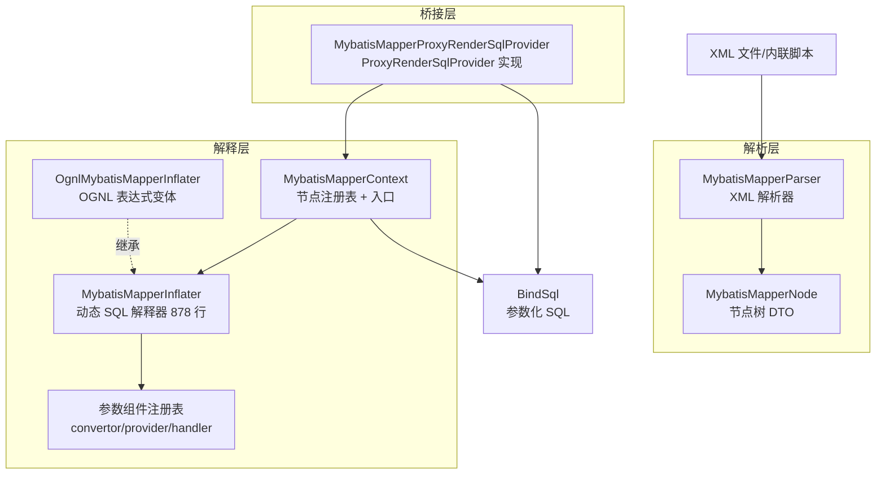

# i2f-jdbc-proxy-xml — MyBatis 风格的 XML 动态 SQL 引擎

> **XML 驱动的动态 SQL 解析引擎 / MyBatis XML 动态标签的独立重实现**（30 个 Java 文件 2159 行 + 3 个资源文件、9 包、零单元测试——`test` 包为演示类）：不依赖 MyBatis 本体，独立解析 MyBatis 风格的 Mapper XML（`<select>/<update>/<insert>/<delete>/<sql>/<resultMap>`），把 15 种动态脚本标签（`if/choose/foreach/trim/set/where/include/bind/dialect/...`）解释为参数化 `BindSql`。三层结构：`MybatisMapperParser`（解析 XML → `MybatisMapperNode` 节点树）→ `MybatisMapperInflater`（878 行核心解释器：标签求值 + `${}`/`#{}` 占位符替换 + 参数处理器链）→ `MybatisMapperContext`（节点注册表 + `inflate` 入口）；`MybatisMapperProxyRenderSqlProvider` 负责桥接 `i2f-jdbc-proxy` 的 Mapper 代理管线。
>
> **⚠ 核心风险提示**：① `MybatisMapperProxyRenderSqlProvider` 接入代理渲染管线时两条路径均会 NPE（与 `i2f-jdbc-proxy` 抽象类管线组合问题，`getScript`/`renderSql` 双 null 返回所致），该 provider 当前**功能不可用**——使用者应改经 `MybatisMapperContext.inflate` 直连调用（如 `i2f-jdbc-procedure` 的用法）；② `<include>`/`<foreach>` 未命中时直接 `return new BindSql("")`，会静默丢弃同层已拼接的 SQL 片段。

---

## 一、模块定位与架构

本模块是 i2f-jdbc 体系中的 **XML 动态 SQL 前端**：把「MyBatis Mapper XML 文件/内联脚本」翻译为 `i2f-bindsql` 的 `BindSql`（参数化 SQL + 参数列表），供上游执行器直接执行。核心消费主线有三条：

| 消费主线 | 消费方 | 使用方式 |
|----------|--------|----------|
| 过程脚本引擎 | `i2f-jdbc-procedure` | `parseScriptNode` + `inflateSqlNode` 把 procedure 内联 SQL 脚本解释为 `BindSql` |
| 脚本语言扩展 | `i2f-extension-xproc4j` | 匿名子类继承 `OgnlMybatisMapperInflater`，重写 `runScript` 支持多语言脚本 |
| Spring 装配 | `i2f-springboot-jdbc-bql-starter` | 自动装配 `MybatisMapperContext`/`MybatisMapperInflater`/`MybatisMapperProxyRenderSqlProvider` |



- `MybatisMapperContext`：持有 `ConcurrentHashMap<String, MybatisMapperNode>` 节点注册表（key 为 `namespace.id` 全限定 unqId），提供 `inflate(unqId, params)` 查询渲染，以及 `inflateTemp(script, params)` 临时代码片段渲染（四重载：默认/select/update/直接节点）。
- `MybatisMapperInflater`：模块核心（878 行），单例 `INSTANCE` + 可继承设计；`databaseType(String)` 流式设置数据库方言。子类通过重写 `testExpression`/`evalExpression`/`runScript` 三个方法接入自定义表达式引擎（默认实现为 `MemoryCompiler` 内存编译 Java 表达式，OGNL 变体见 `OgnlMybatisMapperInflater`）。
- `MybatisMapperProxyRenderSqlProvider`：把「Mapper 接口方法 id（`类全限定名.方法名`）」映射到 `nodeMap` 中的 XML 节点，桥接 `i2f-jdbc-proxy` 的动态代理管线（见第七章缺陷①）。

## 二、依赖关系

### 2.1 POM 声明（8 项）

| 依赖 | 版本/作用域 | 真实使用 | 用途 |
|------|------------|----------|------|
| `org.projectlombok:lombok` | 继承管理 | ✅ | `@Data`/`@NoArgsConstructor`（6 文件） |
| `i2f.turbo:i2f-jdbc-proxy` | 继承管理 | ✅ | `AbstractProxyRenderSqlProvider` 基类 |
| `i2f.turbo:i2f-xml` | 继承管理 | ✅ | `XmlUtil` DOM 解析（Parser/Context） |
| `i2f.turbo:i2f-compiler` | 继承管理 | ✅ | `MemoryCompiler.evaluateExpression`（表达式编译） |
| `i2f.turbo:i2f-database-type` | 继承管理 | ✅ | `DatabaseType` 方言识别与判断 |
| `i2f.turbo:i2f-extension-ognl` | 继承管理 | ✅ | `OgnlUtil.evaluateExpression`（OGNL 变体） |
| `ognl:ognl` | 3.4.11 / provided + optional | ⚠ 间接 | 源码无直接 import；运行时经 `i2f-extension-ognl` 使用，此声明用于可选实现完整性 |
| `mysql:mysql-connector-java` | 8.0.26 / provided + optional | ❌ 声明未用 | 模块源码零引用（沿用了兄弟模块的声明习惯） |

### 2.2 隐式传递依赖（源码直接 import 但 POM 未声明，5 项）

| 依赖 | 传递链 | 使用点 |
|------|--------|--------|
| `i2f-bindsql`（`BindSql`） | impl / bql 双路 | 全模块核心返回类型 |
| `i2f-match`（`RegexUtil`/`RegexFindPartMeta`） | impl / proxy 双路 | Parser 转义修复、Inflater 占位符解析 |
| `i2f-lru-map`（`LruMap`） | bql / extension-ognl 双路 | Inflater 组件缓存与表达式缓存 |
| `i2f-reflect`（`ReflectResolver`/`Visitor`） | impl / bql 双路 | 组件反射实例化、`bind` 写回、表达式求值 |
| `i2f-jdbc-data`（`ArgumentTypeHandler`/`TypedArgument`） | std→impl→proxy 链 | 参数类型化绑定（handler/javaType/jdbcType） |

## 三、源码结构（9 包 / 30 文件）

| 包 | 文件 | 行数 | 职责 |
|----|------|------|------|
| `mybatis` | MybatisMapperContext | 112 | 节点注册表、inflate 入口、临时脚本渲染 |
| `mybatis.data` | MybatisMapperNode | 94 | 节点 DTO（元素/文本/CDATA/注释）与 XML 序列化变体 |
| `mybatis.inflater` | MybatisMapperInflater | 878 | 动态 SQL 解释器（标签求值 + 占位符 + 组件注册表） |
| `mybatis.inflater.impl` | OgnlMybatisMapperInflater | 54 | OGNL 表达式变体（重写 3 方法） |
| `mybatis.parameter` | ParameterConvertor / ParameterProvider / SpiParameterInitializer | 21/23/10 | 参数转换器、参数提供器、SPI 扩展点三个契约 |
| `mybatis.parameter.impl` | 15 个转换器 + 3 个提供器 | 20~67 逐类 | 内置组件实现（见 4.4 表） |
| `mybatis.parser` | MybatisMapperParser | 251 | XML→节点树解析、`<script>` 片段解析、转义修复 |
| `mybatis.provider` | MybatisMapperProxyRenderSqlProvider | 48 | 代理渲染桥接（getScript/renderSql 双 null） |
| `mybatis.test` | TestMybatisMapperContext / TestReqVo / TestVo | 65/17/19 | 演示 `main` 方法与测试 VO（非单元测试） |

资源文件（`src/main/resources`）：`assets/std/mybatis-xml.dtd`（自定义 DTD 133 行）、`sample/TestMapper.xml` 与 `sample/TestMapper.ognl.xml`（各 95 行，同构双版本演示）。

## 四、核心机制

### 4.1 XML 解析（MybatisMapperParser）

- **顶层元素识别**：`resultMap / sql / select / update / insert / delete` 六种（`XML_ELEMENT_TAG_NAME`），只解析 mapper 根节点下的这些元素。
- **unqId 生成规则**：`id` 不含 `.` 时前缀 `namespace + "."`；`id` 本身含 `.` 时（如 `com.test.sqlTestFull`）以全限定 id 为准并可省略 namespace。`nodeMap.put(unqId, node)`。
- **`parseScriptNode(script)` 双路径兜底**：先用 `resolveEscapeXml` 做宽松转义（把裸 `<`、`&` 中非脚本标签的部分转义）再包 `<script>` 解析；失败后**原样**包 `<script>` 二次解析，两次都失败才抛出（suppressed 保留两个异常）。
- **`resolveEscapeXml` 白名单策略**：只有 `SCRIPT_ELEMENT_TAG_NAME_SET`（`if/dialect/choose/when/otherwise/dialect-choose/dialect-when/dialect-otherwise/foreach/trim/set/where/include/bind/script` 15 种）内的标签保留原样，其余（如 `<select>`）转义为文本——面向"脚本片段"场景设计。
- **四类节点解析**：`parseSqlNode` 递归转换 DOM——元素节点（tagName + attributes + children）、文本节点、CDATA、注释；其余类型归为空文本。

### 4.2 节点模型（MybatisMapperNode）

- `xmlType` 区分元素（true）与文本/CDATA/注释（false，用 `nodeType` 再区分）。
- 三个内容获取变体：`getXmlContent()`（完整 XML）、`getInnerContent()`（不含外层标签）、`getTextContent()`（less=true 去掉注释/CDATA 包裹、仅拼接文本）。递归参数 `recursiveFull` 控制子节点是否带标签。

### 4.3 上下文与入口（MybatisMapperContext）

- **装载**：构造器 `MybatisMapperContext(List<URL>)` 立即 `refresh()`；`loadDocuments(List<Document>)`/`refresh()` 均以 `nodeMap.putAll(...)` **累积**合并（同名覆盖）。
- **`inflate(unqId, params)`**：委托 `inflater.inflateSql(unqId, params, nodeMap)`；未命中节点返回**空 `BindSql("")`**（不抛错）。
- **`inflateTemp(...)` 四重载**：`inflateTemp(script)` 把裸 SQL 包 `<select id="query">`，`inflateTempUpdate(script)` 包 `<update>`；实现为**临时注册**——`nodeMap.put(临时 unqId, node)` → `inflate` → `finally remove`。临时 namespace 为 `tmp.{UUID}.{线程ID}` 保证隔离。
- **`createNode(script)`**：`script.contains("<mapper")` 时视为完整 mapper XML 直接解析，否则包一层带默认 DTD 的 `<mapper>` 外壳；解析失败打印堆栈并返回 null。

### 4.4 动态 SQL 解释器（MybatisMapperInflater）

**顶层解析流程**（`inflateSqlNode`，L134-524）：非 XML 节点 → 注释返回空、文本走 `replaceParameters`；元素节点则遍历 children 逐个分支处理，拼接 `builder` 并合并 `args`：

| 标签 | 行为要点 |
|------|----------|
| `if` | `testExpression(test)` 为真才递归；表达式为 Java 风格（见 4.5） |
| `choose/when/otherwise` | 顺序找第一个成立 `when`，`break`；`otherwise` 直接并入（**不 break**） |
| `dialect` / `dialect-choose/when/otherwise` | 自研方言标签：`supportDatabases(DATABASE_TYPE, databases)` 匹配（枚举 `db()` 名与枚举名均可，逗号/分号分隔） |
| `foreach` | 5 种集合形态：`Iterable`/`Map`（值为 `SimpleMapEntry`）/`Iterator`/`Enumeration`/数组；`open/separator/close` 于首元素前拼接、元素间分隔、末元素后收尾；`index` 分别给 0 起序号 |
| `trim` | `prefix/suffix/prefixOverrides/suffixOverrides`（`\|` 分隔多值）；先 trim 内容，空串时**不加** prefix/suffix |
| `set` | 内容非空时加 `" set "`，并裁掉内容首/尾逗号 |
| `where` | 内容非空时加 `" where "`，并裁掉内容前缀 `and/or`（含 `\t\r\n` 变体） |
| `include` | `refid` 不含 `.` 时拼当前节点 namespace；从 `nodeMap` 取被引用节点递归渲染 |
| `bind` | `value` 表达式求值后经 `Visitor.visit(name, params).set(rs)` 写回参数 |
| `script` | 取 `getTextContent()` 交给 `runScript(script, _lang 属性)`；`result` 属性指定写回变量 |
| 其他 | 未知标签按普通元素递归（文本化处理） |

**方言/类型注入**：`inflateSql(Connection/databaseType, ...)` 重载自动向 `params` 写入 `databaseType`/`dialectType` 两个保留键（常量 `DATABASE_TYPE`/`DIALECT_TYPE`）。

**占位符体系**（`replaceParameters`，L672-716）：经 `RegexUtil.regexFindAndReplace` 一次扫描处理四类占位符，**并保护 `--` 单行注释与 `/* */` 多行注释区域不被替换**：

| 形式 | 语义 |
|------|------|
| `${expr}` | 字符串直接替换（拼 SQL，注意注入面） |
| `#{}` | 参数化占位符（`?` + args） |
| `$!{expr}` / `#!{expr}` | 值为 null 时替换为 `""` 空串 |
| 表达式返回值 | 若为 `BindSql` 则**内联其 sql 与 args**（转换器直接产出 SQL 片段的能力） |

**五元扩展**（`getPlaceholderParameterObject`，L729-836）：`#{name,handler=...,javaType=...,jdbcType=...,convertor=...,provider=...}`，取值优先级链：

```
provider（参数来源）→ convertor（转换链，逗号/分号分隔多级）→ handler > javaType > jdbcType（参数类型化）
```

- `provider`：从外部载体取值（环境变量/系统属性/ThreadLocal）。
- `convertor`：对值链式转换；可返回 `BindSql` 直通（如 `v-vals` 展开 `?,?,?`）。
- `handler/javaType/jdbcType`：包装为 `TypedArgument` 或 `ArgumentTypeHandler` 后 `BindSql.of("?", ret)`。

**内置组件注册表**（static 块 L586-611；`registryArgumentTypeHandlers`/`registryParameterConvertors`/`registryParameterProviders` 三个 `ConcurrentHashMap` + LruMap 缓存）：

| 类型 | NAME | 行为 | 注册 |
|------|------|------|------|
| Convertor | `escape` / `unescape` | `'` ↔ `''` 转义/反转义 | ✅ |
| Convertor | `sql-text` | 转义后包单引号（`'abc'`） | ✅ |
| Convertor | `trim` / `lower` / `upper` | 字符串 trim/大小写 | ✅ |
| Convertor | `e2n` / `n2e` / `n2z` | 空串→null / null→"" / null→0 | ✅ |
| Convertor | `sql-identifiers` | 校验 SQL 标识符（`schema."table".\`col\``） | ✅ |
| Convertor | `sql-vals` | 校验值序列（`123,456` 或 `'a','b'`） | ✅ |
| Convertor | `v-ends` / `v-starts` / `v-like` | 值前后加 `%`（`#{}` 下返回 BindSql） | ❌ **未注册** |
| Convertor | `v-vals` | 集合展开为 `?,?,?` 绑定序列 | ❌ **未注册** |
| Provider | `sys-env` / `sys-prop` | `System.getenv/getProperty` | ✅ |
| Provider | `thread-local` | 从 `InheritableThreadLocal HOLDER` 按表达式取值 | ✅ |

- **组件查找**：`getCachedObject(className, registry, cache)` 先查注册表 → 再查缓存 → 最后 `ReflectResolver.loadClass(className)` 反射实例化（失败静默返回 null，**按名引用拼错/未注册的组件会被静默跳过**）。
- **SPI 扩展点**：static 块末尾 `ServiceLoader.load(SpiParameterInitializer.class)` 遍历初始化（注释说明"SPI 后执行可同名覆盖默认组件"）；**当前仓库内无任何实现与 `META-INF/services` 注册**——为外部 jar 预留的静态注册点。
- `registryArgumentTypeHandlers` 无任何静态注册（handler 仅支持按类名反射加载）。

### 4.5 表达式求值（test/eval/script）

- **默认实现（MemoryCompiler 路线）**：`testExpression`（L46-71）先把 `and/or/gte/lte/gt/lt/eq/ne` 等 XML 惯用词替换为 Java 运算符、实体转义词转符号，然后 `"return " + expression + ";"` 交给 `MemoryCompiler.evaluateExpression` **内存编译执行**（附带 `eval(expression, root)` 辅助方法经 `Visitor` 取值）；编译结果有 LruMap 缓存（`i2f-compiler` 内 2048 容量）。异常打印堆栈后返回 `false`。
- `evalExpression`：直接 `Visitor.visit(expression, params).get()`（`$root` 引用根参数对象）。
- `runScript(script, lang, params, node)`：默认仅支持空 lang（走 `evalExpression`），其它 lang 抛 `IllegalArgumentException`。
- **OGNL 变体**（OgnlMybatisMapperInflater）：重写上述三方法走 `OgnlUtil.evaluateExpression`；`runScript` 额外接受 `"ognl"`。`i2f-extension-ognl` 未引入时使用默认实现，引入后可换用（starter 按 `@ConditionalOnClass` 自动选择）。

### 4.6 代理桥接（MybatisMapperProxyRenderSqlProvider）

- `context` 字段默认 `new MybatisMapperContext()`（空注册表），可用带参构造注入已装载的上下文。
- `predicateCacheable`：**命中 `nodeMap` 的方法不缓存**（每次调用需按 params 重新 inflate）；未命中的方法才允许缓存（缓存的是抽象类查得的 script）。
- `inflateScript` → `context.inflate(methodId, params)`：methodId 由代理层生成为 `类全限定名.方法名`（与 XML namespace 对齐即可命中）。
- `getScript`/`renderSql` 均固定返回 null，且未覆盖 `AbstractProxyRenderSqlProvider.render` 的 `script.getType()` 收尾逻辑——形成必然 NPE（详见第七章缺陷①）。

## 五、使用示例

### 5.1 基础骨架：内联脚本 → BindSql（i2f-jdbc-procedure 实拍）

`BasicJdbcProcedureExecutor`（i2f-jdbc-procedure，2611 行）中的实际用法——把 procedure 脚本片段解析并解释：

```java
// BasicJdbcProcedureExecutor L2380-2388
public BindSql resolveSqlScript(String script, Map<String, Object> params) throws Exception {
    MybatisMapperNode mapperNode = MybatisMapperParser.parseScriptNode(script);
    BindSql bql = getMybatisMapperInflater().inflateSqlNode(mapperNode, params, new HashMap<>());
    return bql;
}

public MybatisMapperInflater getMybatisMapperInflater() {
    return MybatisMapperInflater.INSTANCE; // 子类可覆盖替换解释器
}
```

表达式判定与取值同样直连单例（L1736/L1787）：

```java
return MybatisMapperInflater.INSTANCE.testExpression(test, params); // if/where 条件判定
return MybatisMapperInflater.INSTANCE.evalExpression(script, params); // 表达式求值
```

### 5.2 上下文装载：XML 文件 → 节点注册表（TestMybatisMapperContext 实拍）

```java
Map<String, Object> params = new LinkedHashMap<>();
TestReqVo req = new TestReqVo();
req.setTableName("sys_user");
req.setIdColumn("id");
params.put("req", req);
params.put("offset", 0);
params.put("size", 100);

MybatisMapperContext context = new MybatisMapperContext();
context.setInflater(MybatisMapperInflater.INSTANCE);            // 可换成 OgnlMybatisMapperInflater

Document document = XmlUtil.parseXml(new File(".../TestMapper.xml"));
context.loadDocuments(Arrays.asList(document));                  // 装载进 nodeMap

BindSql bindSql = context.inflate("i2f.jdbc.proxy.xml.mybatis.test.mapper.TestMapper.queryRewriteList", params);
System.out.println(bindSql);                                     // 输出参数化 SQL 与 args
```

临时脚本（不落文件、每次动态解析）：

```java
BindSql bql = context.inflateTempSelect("select * from ${req.tableName} where id = #{post.id}", params);
```

### 5.3 动态标签全演示（sample/TestMapper.xml 节选）

```xml
<select id="queryRewriteList" resultMap="mapRewriteVo">
    <include refid="sqlTest"></include>
    <include refid="com.test.sqlTestFull"></include>   <!-- 全限定 refid 免拼 namespace -->
    <trim prefix="select" suffix="from" prefixOverrides="select|," suffixOverrides="from|,">
        SELECT rownum-1 AS ROWIDX, a.* FROM
    </trim>
    (
    select
    <if test='eval("req.codeColumn",$root)!=null'>
        ${req.codeColumn} as CODE,       <!-- $ 直拼：用于列名/表名 -->
    </if>
    ${req.idColumn} as ID
    from ${req.tableName}
    <where>
        <choose>
            <when test='eval("$root.req",$root)!=null'> and 1=1 </when>
            <otherwise> and 1=2 </otherwise>
        </choose>
    </where>
    ) a
    <where>
        <if test='eval("$root.post",$root)!=null'>
            and a.ID in
            <foreach collection="post.vals" item="item" open="(" separator="," close=")">
                #{item}                            <!-- # 参数化 -->
            </foreach>
        </if>
    </where>
    <where>
        And ROWIDX &gt;= #{offset} and ROWIDX &lt; #{size}
    </where>
</select>
```

要点：`$root` 引用根参数 Map；`eval("req.codeColumn",$root)` 经 MemoryCompiler 编译的 Java 表达式取值；`&gt;`/`&lt;` 实体被替换回 `>`/`<`；`<where>` 自动裁掉首个 `and`。

### 5.4 子类扩展：自定义多语言解释器（xproc4j 实拍）

`DefaultJdbcProcedureExecutor.createNewMybatisMapperInflater()`（i2f-extension-xproc4j）——匿名子类把表达式与脚本路由回宿主执行器：

```java
public MybatisMapperInflater createNewMybatisMapperInflater() {
    JdbcProcedureExecutor executor = this;
    return new OgnlMybatisMapperInflater() {
        @Override
        public boolean testExpression(String expression, Object params) {
            return executor.test(expression, params);          // 复用 xproc 的条件引擎
        }
        @Override
        public Object evalExpression(String expression, Object params) {
            return executor.eval(expression, params);
        }
        @Override
        public Object runScript(String script, String lang, Map<String, Object> params, MybatisMapperNode node) {
            if ("eval".equalsIgnoreCase(lang))   { return executor.eval(script, params); }
            if ("ognl".equalsIgnoreCase(lang))   { return OgnlUtil.evaluateExpression(script, params); }
            if ("visit".equalsIgnoreCase(lang))  { return executor.visit(script, params); }
            // ... render/test 及 EvalScriptProvider 多语言路由
            throw new ThrowSignalException("eval script provider not found for lang=" + lang);
        }
    };
}
```

这是本模块**推荐的扩展姿势**：只重写三个表达式相关方法，其余标签解析逻辑全部复用。

### 5.5 Spring Boot starter 装配

依赖 `i2f-springboot-jdbc-bql-starter` 后，`JdbcProxyAutoConfiguration`（`@ConditionalOnExpression("${i2f.jdbc.proxy.enable:true}")`）自动装配：

```yaml
i2f:
  jdbc:
    proxy:
      enable: true
      mapper-packages:            # 扫描注册 Mapper 接口的包（默认 **.mapper.** / **.dao.**）
        - com.example.mapper
      script-locations:           # MybatisMapperContext 装载的 XML 位置
        - classpath*:/**/mapper/**/*.xml   # 缺省值
```

Bean 选择链：`MybatisMapperInflater`（有 OGNL 则用 `OgnlMybatisMapperInflater`）→ `MybatisMapperContext`（装载 script-locations）→ `@ConditionalOnMissingBean(ProxyRenderSqlProvider.class)` 的 `MybatisMapperProxyRenderSqlProvider`。**注意**：三个 provider bean 均带 `@ConditionalOnMissingBean(ProxyRenderSqlProvider.class)`，实际生效者取决于 `@Bean` 方法注册顺序（当前源码顺序下 Mybatis 版优先，而它受缺陷①影响；Velocity/Simple 版详见各自模块文档）。

### 5.6 参数扩展用法（占位符五元）

```xml
<!-- provider：从环境变量/系统属性/ThreadLocal 取参数 -->
<if test='true'> limit ${limit,sys-env} </if>
select ${schema,sys-prop}.t_user

<!-- convertor：链式转换 + 模糊查询辅助（v-* 当前未注册，实际不生效，见缺陷③） -->
where name like #{keyword,convertor=v-like}
where id in #{ids,convertor=v-vals}          <!-- 集合展开 ?,?,? -->

<!-- 校验类：防止 ${} 直拼注入（尽力而为） -->
order by ${orderBy,convertor=sql-identifiers}   <!-- 非标识符直接抛异常 -->

<!-- 类型化：handler/javaType/jdbcType 三选一 -->
where create_time >= #{beginTime,jdbcType=TIMESTAMP}
where amount = #{amt,handler=com.example.BigDecimalHandler}
```

## 六、消费关系

### 6.1 下游消费者（4 模块 4 文件）

| 消费者 | 文件 | POM 声明 | 用法 |
|--------|------|----------|------|
| `i2f-jdbc-procedure` | `BasicJdbcProcedureExecutor`（2611 行） | ✅ 显式 | `parseScriptNode` + `inflateSqlNode`；`INSTANCE.testExpression/evalExpression`；`DATABASE_TYPE/DIALECT_TYPE` 常量；可覆盖 `getMybatisMapperInflater()` |
| `i2f-extension-xproc4j` | `DefaultJdbcProcedureExecutor`（254 行） | ❌ 经 i2f-jdbc-procedure 传递 | 匿名子类继承 `OgnlMybatisMapperInflater` 重写 `runScript` 多语言路由 |
| `i2f-springboot-jdbc-bql-starter` | `JdbcProxyAutoConfiguration`（239 行） | ✅ 显式 | Spring 装配 3 bean；`@ConditionalOnClass` 判断 OGNL 可用性 |
| `i2f-tools/i2f-jdbc-procedure-idea-plugin` | `JdbcProcedureXmlLangInjectInjector`（1396 行） | ❌ 独立 IDE 插件 | IDE 语言注入模板中的 import 字符串（非运行期依赖） |

### 6.2 API 热度（仓内调用点）

| API | 调用点 |
|-----|--------|
| `MybatisMapperInflater`（INSTANCE.testExpression/evalExpression/inflateSqlNode） | jdbc-procedure 5 处、xproc4j（子类） |
| `MybatisMapperParser.parseScriptNode` | jdbc-procedure 1 处、idea-plugin 模板字符串 |
| `MybatisMapperContext`（构造器/inflate） | starter bean、demo 测试类 |
| `MybatisMapperProxyRenderSqlProvider` | starter bean（注册即受缺陷①影响） |
| `OgnlMybatisMapperInflater` | xproc4j 子类、starter `@ConditionalOnClass` |
| 15 个 convertor / 3 个 provider | 仅 XML 占位符按名动态引用（无源码调用点） |

### 6.3 模块注册（3 处）

- `i2f-jdk/pom.xml` L100：`<module>i2f-jdbc-proxy-xml</module>`（紧跟 `i2f-jdbc-proxy` 之后）
- `i2f-jdk-all/pom.xml` L347-350：聚合依赖
- 根 `pom.xml` L534-538：`dependencyManagement` 版本管理（`${i2f.version}`）

## 七、缺陷与风险

### 7.1 【中危①】代理桥接 provider 接入 render 管线必然 NPE（功能不可用）

`MybatisMapperProxyRenderSqlProvider` 对 `getScript`/`renderSql` 均返回 null，配合父类 `AbstractProxyRenderSqlProvider.render`（i2f-jdbc-proxy 模块 L24-62）的收尾逻辑，**两条路径都触发 NPE**：

```java
// AbstractProxyRenderSqlProvider.render（i2f-jdbc-proxy）关键段
BindSql ret = null;
if (script == null) {
    ret = inflateScript(methodId, params, method, args);
}
if (ret == null) {
    ret = renderSql(script.getSql(), params, method, args);   // script 为 null 时此处即 NPE
}
if (ret.getType() == null || ret.getType() == BindSql.Type.UNSET) {
    ret.setType(script.getType());                            // script 恒 null → NPE
}
```

| 路径 | 前提 | 执行链 | NPE 位置 |
|------|------|--------|----------|
| A | 方法名命中 `nodeMap`（XML 存在） | `predicateCacheable=false` → script=null → `getScript`=null → `inflateScript` 返回正常 SQL（type 默认 `UNSET`，见 BindSql 字段初值） | L59 `script.getType()` 空引用 |
| B | 方法带 `@SqlScript` 注解 | script=非 null（注解值）→ 跳过 `inflateScript` → `renderSql` 恒 null → ret=null | L58 `ret.getType()` 空引用 |

- 例外：`BaseMapper` 直接声明的方法由 `preHandleRender` 提前返回，不受影响。
- 后果：该 provider 一旦成为生效 bean（Spring starter 默认注册顺序下即如此），任意 Mapper 自定义方法调用全部 NPE——**功能不可用**而非静默错误。使用本模块的推荐方式是绕开该 provider，直连 `MybatisMapperContext.inflate`（`i2f-jdbc-procedure` 的做法）。
- 验证指引：对 `test-springboot` 的 `TestMapper.listAll()`（@SqlScript）/`listByMapper()`（XML）任一调用即可复现；`BqlService.run`（ApplicationRunner）中已有直接调用点。

### 7.2 【中危②】include/foreach 未命中时丢弃同层已拼接 SQL

`inflateSqlNode` 的三个 `return new BindSql("")` 位于**兄弟节点遍历循环内**，本意应是"跳过该标签"（`continue`），实际直接终止整个当前节点的渲染并丢弃 `builder` 中已拼接的全部内容：

```java
// foreach：collection 表达式求值为 null（L251-254）
Object col = evalExpression(collection, params);
if (col == null) {
    return new BindSql("");     // ← 丢弃同层已拼接内容，应为 continue
}
// include：空 refid（L484-486）与 refid 未命中 nodeMap（L491-493）
if (refid.isEmpty()) {
    return new BindSql("");     // ← 同上
}
MybatisMapperNode includeNode = nodeMap.get(refid);
if (includeNode == null) {
    return new BindSql("");     // ← 同上
}
```

- 污染范围：`return` 只退出最近一次 `inflateSqlNode` 递归——若标签位于 `<where>`/`<set>`/`<trim>` 等容器内，丢失的是容器内该标签**之前**的所有兄弟内容；若标签直接位于 `<select>` 根下，则**整条 SQL 归空/残缺**。
- 静默性：不抛异常、不打日志，生成的残缺 SQL 若恰好可执行（如 `select * from t` 丢掉了 WHERE），风险更高。
- 典型场景：`<include refid="...">` 引用未随 XML 一起装载的公共片段（多文件分片加载时极易发生）。

### 7.3 【低危③】四个 `v-*` 转换器未注册——按名引用静默失效

`ValEndsParameterConvertor`/`ValLikeParameterConvertor`/`ValStartsParameterConvertor`/`ValValsParameterConvertor`（NAME 分别为 `v-ends`/`v-like`/`v-starts`/`v-vals`）实现完整但**未出现在 static 注册块的 14 个 `put` 中**；按名引用时 `getCachedObject` 注册表与缓存均未命中，`ReflectResolver.loadClass("v-like")` 又非合法类名——最终返回 null，`getPlaceholderParameterObject` 中 `if (handler != null)` 判断**静默跳过转换**。用户写 `#{keyword,convertor=v-like}` 期望 `%keyword%`，实际得到原值精确匹配（查询结果错误、无任何警告）。

同时这也是**通用容错缺陷**：任何拼错名称的 convertor/provider 均静默跳过（建议改为：按名未找到时抛 `IllegalArgumentException`）。

### 7.4 【低危④】dialect 回填的复制粘贴笔误

```java
// inflateSqlNode L141-146
Object dialect = params.get(DIALECT_TYPE);
if (type == null) {                       // ← 应为 dialect == null；且局部变量 dialect 读取后未使用
    if (databaseType != null) {
        params.put(DIALECT_TYPE, databaseType);   // ← 回填的是类型字段，非方言字段
    }
}
```

影响：显式传 `DATABASE_TYPE` 但未传 `DIALECT_TYPE` 时（如 `inflateSql(DatabaseType, ...)` 重载），`DIALECT_TYPE` 不会被回填，脚本中 `dialectType` 引用为 null。内置标签判断只用 `DATABASE_TYPE`，故实际后果轻。

### 7.5 【低危⑤】全局单例 `INSTANCE` 的可变字段

`MybatisMapperInflater.INSTANCE` 为静态共享单例，流式 setter `databaseType(String)` 直接修改实例字段——任何调用方一旦设置将污染全局（含其它线程）。当前消息内消费者：jdbc-procedure 用 INSTANCE 但不设置该字段；xproc4j 用 `new` 子类实例——暂无实际受害案例，但 API 设计建议改为构造参数或 ThreadLocal。

### 7.6 【低危⑥】`sql-text`/`escape` 转义不含反斜杠（安全注记）

`SqlTextParameterConvertor`/`EscapeTextParameterConvertor` 仅做 `'` → `''`。在 MySQL 默认模式（反斜杠转义开启）下，输入 `\' or 1=1 -- ` 转义后为 `\'' or 1=1 -- `，`\'` 被 MySQL 解释为字面单引号后字符串提前闭合——**可绕过转义形成注入**。这两个转换器定位是 `${}` 场景的"尽力而为"加固，**不能作为可靠防注入手段**；生产应以 `#{}` 参数化为主，直拼场景改用 `sql-identifiers`（白名单校验）。

### 7.7 【注记⑦】`testExpression` 的语义边界

- `<if test='...'>` 的表达式经文本替换（`and`→`&&` 等）后**内存编译为 Java 代码执行**（默认实现），XML 脚本因此拥有完整 Java 代码执行能力——**XML 脚本文件必须视为可信代码**管理，不可接受用户上传。
- 替换基于正则 `\s+and\s+` 等，会命中字符串字面量（如 `name.contains(" and ")` 被改写为 `&&`）——复杂表达式建议改用 `eval(...)` 包装或 OGNL 变体。
- 编译有 LruMap 缓存（i2f-compiler 内 2048 容量），常规使用性能可接受；表达式种类过多可能反复触发编译。

### 7.8 【注记⑧】状态与会话细节

- `MybatisMapperContext.refresh()`/`loadDocuments` 只做 `putAll` 不清空——重复刷新会**累积**已删除脚本的陈旧节点。
- `createNode` 用 `script.contains("<mapper")` 判断"完整 XML"，SQL 文本中若出现字符串 `"<mapper"` 会被误判；解析失败返回 null 后，`inflateTemp(MybatisMapperNode)` 首行 `node.getUnqId()` 将对 null 抛 NPE。
- `inflateTemp` 的临时节点 put/remove 非原子（`nodeMap` 为 ConcurrentHashMap，单线程重入安全；同 unqId 并发场景由 UUID 隔离）。

### 7.9 【注记⑨】日志与错误处理惯例

模块内无日志框架依赖，异常统一 `e.printStackTrace()`（Parser L44/L47/L62、Context L107、OGNL 变体、testExpression 等）；`getCachedObject` 对 `Throwable` 完全静默吞掉——组件实例化失败无任何可观测信号。跨服务使用建议自行包装日志。

### 7.10 【注记⑩】零散细节

- `foreach` 分支中 `index != null` 恒真（index 已 `orElse("")`），4 处冗余判断无副作用。
- `<choose>` 的 `otherwise` 不 `break`：`when` 命中后 `break` 整层；但 `otherwise` 与后续 `when` 并列时会先并入——DOM 顺序正常（otherwise 在最后）时无影响。
- `parseXmlUrlMappers` 逐 URL 独立 try/catch：单个 XML 失败不影响其它文件（但仅打印堆栈）。

### 7.11 正面设计

1. **MyBatis 原生标签全覆盖 + 自研方言标签**：`dialect/dialect-choose/dialect-when/dialect-otherwise` 实现"同一 XML 按数据库方言选段"，MyBatis 原生不支持。
2. **占位符五元扩展**（handler/javaType/jdbcType/convertor/provider）+ 明确优先级链 + `BindSql` 直通——`${}`/`#{}` 之上叠加了可组合的参数处理管线。
3. **注释保护**：`replaceParameters` 对 `--` 与 `/* */` 区域不做占位符替换。
4. **双表达式实现可换**：默认 MemoryCompiler（零依赖）与 OGNL 变体自由选择；子类只重写 3 方法即可接入任意脚本引擎（xproc4j 已示范）。
5. **宽松转义双路径兜底**：`parseScriptNode` 先修复后解析、失败回退原样解析，显著降低手写脚本片段的语法门槛。

## 八、总结

| 维度 | 内容 |
|------|------|
| 定位 | XML 动态 SQL 引擎（MyBatis XML 的独立重实现），产出 `BindSql` |
| 规模 | 30 文件 2159 行 + 3 资源、9 包、零测试（test 包为演示） |
| 核心类 | `MybatisMapperInflater`（878 行）、`MybatisMapperParser`（251 行）、`MybatisMapperContext`（112 行） |
| 标签体系 | 6 顶层元素 + 15 脚本标签（含 4 个自研 dialect 标签） |
| 占位符 | `${}`/`#{}`/`$!{}`/`#!{}` + 五元扩展 + 18 内置组件（4 个未注册）+ SPI 扩展点 |
| 消费者 | jdbc-procedure（核心消费者）、xproc4j、starter、idea-plugin（模板） |
| 主要风险 | provider 管线 NPE（功能不可用）、include/foreach 丢 SQL、v-* 静默失效 |

**使用建议**：

1. **直连 `MybatisMapperContext.inflate` / `MybatisMapperInflater.inflateSqlNode`**，绕开 `MybatisMapperProxyRenderSqlProvider`（当前版本不可用）。
2. `<include>` 的 refid 拼写与装载完整性需自测兜底（未命中静默丢 SQL）；建议在 CI 中对每条 XML 做一次样例参数 inflate 校验。
3. 直拼场景（`${}`）优先 `sql-identifiers` 白名单校验；不要依赖 `sql-text`/`escape` 防注入。
4. `v-*` 四个转换器需自行向注册表注册（`registryParameterConvertors.put(ValLikeParameterConvertor.NAME, ...)`）后才能使用。
5. 自定义表达式引擎时，继承 `MybatisMapperInflater` 并重写 `testExpression`/`evalExpression`/`runScript` 三方法即可（参照 xproc4j）。

