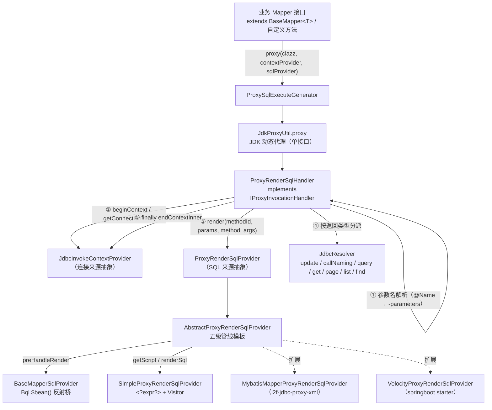

# i2f-jdbc-proxy — Mapper 接口的 JDBC 动态代理层

> **「接口即 SQL」的动态代理执行层 / MyBatis Mapper 模式的独立实现**（12 源文件、762 行、7 包、零单元测试——`test` 包为演示类）：以 JDK 动态代理把「Mapper 接口方法调用」翻译为 SQL 执行。三件套彻底解耦：`ProxySqlExecuteGenerator`（工厂，`JdkProxyUtil` 单接口代理）→ `ProxyRenderSqlHandler`（`IProxyInvocationHandler`：参数名解析、`JdbcInvokeContextProvider` 会话管理、`databaseType/dialectType/connection` 自动注入、按返回类型分派 `JdbcResolver`、泛型 `relTypes` 缓存）→ `ProxyRenderSqlProvider`（SQL 来源抽象）。SQL 来源经 `AbstractProxyRenderSqlProvider` 五级管线生成：**BaseMapper 内建桥**（31 个接口方法经 `Bql.$bean()` 反射生成，由 `BaseMapperSqlProvider` 按方法名+参数个数分派）→ 缓存 → `@SqlScript` → `getScript` → `inflateScript` → `renderSql`。内置 `SimpleProxyRenderSqlProvider`（`<?expr?>` 占位符 + `Visitor` 求值）；生态扩展两例：XML（`i2f-jdbc-proxy-xml` 的 `MybatisMapperProxyRenderSqlProvider`）与 Velocity（starter 的 `VelocityProxyRenderSqlProvider`）。被 3 模块消费（5 文件，全部 POM 显式声明）：`i2f-jdbc-proxy-xml`、`i2f-springboot-jdbc-bql-starter`（自动装配 + mapper 扫描）、`test-springboot`（`TestMapper` 端到端演示）。**注意两个静态推演的缺陷**：抽象类 render 的 NPE 链（XML provider 自定义方法路径必然触发）与 Simple provider 贪婪正则（单行多占位符被合并吞掉）。

## 一、模块定位与架构

本模块回答一个核心问题：**「如何让一个纯接口（Mapper）的每个方法调用，自动变成一条 SQL 并执行」**。

与 `i2f-jdbc-bql`（显式调用 `bqlTemplate.list(bean)`）不同，本模块走**动态代理**路线——调用方只面向接口编程，SQL 的生成与执行对调用方完全透明，是 MyBatis Mapper 模式在 i2f 体系内的独立实现（不依赖 MyBatis，仅借用了 XML mapper 的脚本格式）。

核心类结构与数据流：



三条消费主线：

| 主线 | 入口 | SQL 来源 | 代表消费者 |
|------|------|---------|-----------|
| **BaseMapper 内建桥** | 接口 `extends BaseMapper<T>` | `BaseMapperSqlProvider` → `Bql.$bean()` 反射实体 | `TestMapper`（test-springboot）、`ExtendMapper`（演示） |
| **注解 SQL** | 方法上 `@SqlScript("...")` | 注解值 + provider 的 `renderSql` | `TestSimpleMapper`（演示）、`TestMapper.listAll` |
| **外部脚本体系** | 方法无注解 | XML mapper / Velocity 模板 | `MybatisMapperProxyRenderSqlProvider`、`VelocityProxyRenderSqlProvider` |

## 二、依赖关系

### 2.1 POM 声明依赖（8 项）

| 依赖 | scope | 源码级验证 |
|------|-------|-----------|
| `mysql-connector-java` 8.0.26 | provided + optional | 仅 `TestProxy` 演示字符串（`Class.forName("com.mysql.cj.jdbc.Driver")` + URL），编译期零引用；与全仓惯例一致 |
| `lombok` | compile | **声明未用**——12 个源文件零 lombok 注解/导入 |
| `i2f-proxy` | compile | 真实使用：`JdkProxyUtil`（`ProxySqlExecuteGenerator` L6/L15） |
| `i2f-jdbc-impl` | compile | 真实使用：`JdbcResolver`、`QueryResult`（`ProxyRenderSqlHandler`） |
| `i2f-annotations-core` | compile | 真实使用：`@Name`（参数名标注，`ProxyRenderSqlHandler` L72） |
| `i2f-annotations-db` | compile | **声明未用**——无任何 `i2f.annotations.db` 导入 |
| `i2f-match` | compile | 真实使用：`RegexUtil.replace`（`SimpleProxyRenderSqlProvider` L28） |
| `i2f-bql` | compile | 真实使用：`Bql.$bean()` 系列（`BaseMapperSqlProvider`） |

### 2.2 隐式传递依赖（未声明但源码直接引用）

| 坐标 | 使用点 | 传递链 |
|------|--------|--------|
| `i2f-jdbc-std` | `JdbcInvokeContextProvider`（handler 会话抽象） | ← i2f-jdbc-impl |
| `i2f-bindsql` | `BindSql`（全模块核心载体） | ← i2f-jdbc-impl / i2f-bql |
| `i2f-page` | `ApiOffsetSize`/`ApiPage`/`Page`（分页探测与返回） | ← i2f-jdbc-impl |
| `i2f-database-type` | `DatabaseType.typeOfConnection/dialectOfConnection` | ← i2f-jdbc-impl → i2f-bindsql-page |
| `i2f-reflect` | `ReflectResolver`、`RichConverter`、`Visitor` | ← i2f-jdbc-impl / i2f-bql |
| `i2f-typeof` | `TypeOf.isBaseType/typeOf`（返回类型判定） | ← i2f-reflect |
| `i2f-convert` | `ObjectConvertor`（数值/布尔/字符/日期判定与转换） | ← i2f-reflect |
| `i2f-lru-map` | `LruMap`（两个静态/成员缓存） | ← i2f-match / i2f-bql / i2f-reflect（多链） |
| `i2f-proxy-std` + `i2f-invokable` | `IProxyInvocationHandler`、`IInvokable`、`JdkMethod` | ← i2f-proxy |
| `i2f-reference` | `Reference.of(relTypes)`（缓存值包装） | ← i2f-match → i2f-iterator |

## 三、包结构

| 包 | 文件 | 职责 |
|----|------|------|
| `i2f.jdbc.proxy` | `ProxySqlExecuteGenerator` | 代理工厂：两个静态 `proxy` 方法 |
| `i2f.jdbc.proxy.annotations` | `SqlScript`、`IgnorePage` | 方法级注解：内联 SQL 与「禁用分页」开关 |
| `i2f.jdbc.proxy.basemapper` | `BaseMapper`、`BaseMapperSqlProvider` | 31 方法通用 Mapper 接口 + 方法调用 → `Bql` 反射桥 |
| `i2f.jdbc.proxy.handler` | `ProxyRenderSqlHandler` | 核心 InvocationHandler：参数收集、会话、类型分派 |
| `i2f.jdbc.proxy.provider` | `ProxyRenderSqlProvider`、`AbstractProxyRenderSqlProvider` | SQL 来源接口 + 五级管线抽象基类（缓存/扩展点） |
| `i2f.jdbc.proxy.provider.impl` | `SimpleProxyRenderSqlProvider` | 内置简单实现：`<?expr?>` 占位符 + `Visitor` |
| `i2f.jdbc.proxy.test` | `TestProxy`、`TestSimpleMapper`、`ExtendMapper` | 演示类（含 main 方法直连 MySQL，非单元测试） |

## 四、核心机制

### 4.1 入口：ProxySqlExecuteGenerator（22 行）

```java
public static <T> T proxy(Class<T> clazz, ProxyRenderSqlHandler sqlHandler) {
    return JdkProxyUtil.proxy(clazz, sqlHandler);   // 以 clazz 为唯一接口创建 JDK 代理
}
public static <T> T proxy(Class<T> clazz, JdbcInvokeContextProvider<?> contextProvider,
                          ProxyRenderSqlProvider sqlProvider) {
    return proxy(clazz, new ProxyRenderSqlHandler(clazz, contextProvider, sqlProvider));
}
```

`JdkProxyUtil.proxy(Class<T>, IProxyInvocationHandler)` 内部经 `JdkDynamicProxyInvocationHandlerAdapter` 把 `java.lang.reflect.InvocationHandler.invoke(proxy, method, args)` 适配为 `IProxyInvocationHandler.invoke(ivkObj, IInvokable, args)`（`invokable` 为 `JdkMethod` 包装）。**`clazz` 必须是接口**（未做前置校验，传类会由 `Proxy.newProxyInstance` 抛 `IllegalArgumentException`）。

### 4.2 核心：ProxyRenderSqlHandler 执行管线（215 行）

每次接口方法调用经过 8 个步骤：

**① toString / hashCode 特判**（L60-65）：直接返回，避免进入 SQL 渲染。注意 **`equals` 未特判**——`equals` 调用会进入 SQL 渲染流程（见缺陷③）。

**② methodId 生成**（L66-67）：

```java
String methodId = clazz.getName().replaceAll("\\$", ".") + "." + method.getName();
```

形如 `com.i2f.test.mapper.TestMapper.listByMapper`——**不含参数签名**（重载方法共享同一 methodId，见缺陷④）。

**③ 参数名解析与收集**（L68-89）：

```java
String name = ReflectResolver.getAnnotationValue(parameter, Name.class, "value");
if (name != null && !name.isEmpty()) {
    names[i] = name;              // 优先 @Name("xxx")
} else {
    names[i] = parameter.getName(); // 依赖编译参数 -parameters（根 pom L1651 已配置）
}
```

随后把参数放入 `LinkedHashMap<String, Object> params`，同时**探测 `ApiOffsetSize` 类型参数**（含子类 `ApiPage`）存为局部变量 `page`，供后续分页分支使用。

**④ 会话开启**（L91-93）：`contextProvider.beginContext()` → `contextProvider.getConnectionInner(context)`——与 `i2f-jdbc-std` 契约一致的四段式（try/finally 归还）。

**⑤ 上下文参数自动注入**（L95-105）：若 params 中不存在（可被调用方同名参数覆盖——**设计留口**）：

- `databaseType` = `DatabaseType.typeOfConnection(conn)`（实际库类型）
- `dialectType` = `DatabaseType.dialectOfConnection(conn)`（方言类型）
- `connection` = 当前 `Connection`

**⑥ SQL 渲染**（L107）：`sqlProvider.render(methodId, params, method, args)` → `BindSql`。

**⑦ 类型兜底**（L112-115）：`BindSql.Type` 为 `null/UNSET` 时 `JdbcResolver.detectType(sql)` 按 SQL 首关键字推断。

**⑧ 泛型 relTypes 解析**（L117-128）：返回类型含泛型（非裸 Class）时，`RichConverter.fetchRelType(proxyClass, method.getDeclaringClass())` 解析「Proxy 接口相对声明类的泛型实参绑定」（如 `TestMapper extends BaseMapper<SysUserDo>` 中 `T=SysUserDo`），用于后续 `RichConverter.convert2Type` 的深度转换；结果按 `proxyClass#declaringClass` 键缓存进静态 `LruMap`（2048 容量）。

**返回值分派矩阵**（L131-210，`type` 为 `sql.getType()`）：

| type / 返回类型 | 执行方法 | 转换方式 |
|----------------|---------|---------|
| `UPDATE` | `JdbcResolver.update(conn, sql)` | `ObjectConvertor.tryConvertAsType(int, returnClass)` |
| `CALL` | `JdbcResolver.callNaming(conn, sql)`（1-based 命名出参） | `RichConverter.convert2Type(map, returnType, relTypes, false)` |
| `QUERY` + `QueryResult` | `JdbcResolver.query(conn, sql)` | 直接返回 |
| `QUERY` + 基本类型 | `JdbcResolver.get(conn, sql, returnClass)` | 单列单行取值 |
| `QUERY` + numeric/boolean/char/date | 同上 | 同上 |
| `QUERY` + `page != null` + `Page.class` | `JdbcResolver.page(conn, sql, page)` | `convert2Type(Page<Map>, ...)` |
| `QUERY` + `page != null` + `Collection` | 同上 | 取 `val.getList()` 再 convert |
| `QUERY` + `page != null` + 基本/数值类型 | 同上 | 返回 **`val.getTotal()`**（总数语义） |
| `QUERY` + `page != null` + 其他单对象 | 同上 | 取 `list.get(0)`，**空则返回 null** |
| `QUERY` + `Collection` | `JdbcResolver.list(conn, sql)` | convert2Type |
| `QUERY` + 数组 | 同上 | convert2Type |
| `QUERY` + 其他 | `JdbcResolver.find(conn, sql)`（多行探针，多行抛异常） | convert2Type |

**分页开关**（L158-166）：`page != null` 时默认启用分页；方法上有 `@IgnorePage` 时 `enablePage = !ignore`（注解默认 `true`=禁用分页）——可用于「传了分页对象但只想拿普通列表」的场景。

### 4.3 SQL 来源：AbstractProxyRenderSqlProvider 五级管线

`ProxyRenderSqlProvider` 只有一个方法 `render(methodId, params, method, args)`。抽象基类实现完整的模板管线（L23-62）：

```
preHandleRender ──非 null──▶ 直接返回（BaseMapper 内建桥命中）
      │ null
      ▼
缓存查询（enableCache && predicateCacheable）──命中──▶ script
      │ miss
      ▼
@SqlScript 注解取值 ──有──▶ script = BindSql.of(ann.type(), ann.value())
      │ 无
      ▼
getScript(...)（抽象）──▶ script 可 null
      │
      ├─ script == null ─▶ inflateScript(...)（默认 null，可覆写）─▶ ret
      │                         │
      │                         ▼ ret == null
      └────────────▶ ret = renderSql(script.getSql(), params, method, args)（抽象）
                                       │
                                       ▼
                ret.getType() 为 null/UNSET 时 ret.setType(script.getType())
                （★ script 为 null 时此两处均 NPE，见缺陷①）
```

五个扩展点：

| 扩展点 | 默认行为 | 覆写示例 |
|--------|---------|---------|
| `preHandleRender` | 声明类为 `BaseMapper` → `BaseMapperSqlProvider.parse(method, args)`；否则 null | 无需覆写（内建） |
| `predicateCacheable` | 恒 `true` | `MybatisMapperProxyRenderSqlProvider`：XML 有节点时不缓存 |
| `getScript` | 抽象 | `Simple`：无 `@SqlScript` 时抛 `IllegalArgumentException`；`Velocity`：查模板，查不到抛异常 |
| `inflateScript` | null | `MybatisMapperProxyRenderSqlProvider`：`context.inflate(methodId, params)` |
| `renderSql` | 抽象 | `Simple`：`<?expr?>` 替换；`Velocity`：`VelocitySqlGenerator.renderSql(script, params)` |

缓存：`scriptCache`（`LruMap<String, BindSql>`，2048 容量）+ `AtomicBoolean enableCache`（默认 true）。缓存键为 methodId（**无参数签名**，见缺陷④）。

### 4.4 BaseMapper 内建桥（31 接口方法 + 字符串分派）

`BaseMapper<T>` 定义 31 个方法——20 个「表/实体/Map」形态 + 11 个 `BindSql` 直通：

| 分组 | 方法（重载） |
|------|-------------|
| 写操作 | `insert(table, map)` / `insert(bean)`、`update(table, updateMap, whereMap)` / `update(bean, cond)`、`delete(table, map)` / `delete(bean)` |
| 查询 | `listMap` / `list` / `findMap` / `find` / `count`（各含 `(table, cols, whereMap)` 与 `(bean)` 两形态）、`pageMap` / `page`（各含 `(table, cols, whereMap, page)` 与 `(bean, page)`） |
| BindSql 直通 | `call`、`callNaming`、`executeUpdate`、`executeGet`、`executeListMap`、`executeList`、`executeFindMap`、`executeFind`、`executePageMap`、`executePage`、`executeRaw`（注意：`executePage*` **无分页参数**，为纯透传） |

`BaseMapperSqlProvider.parse` 按「方法名 + 参数个数」双重分派（L17-171）：

```java
if (!method.getDeclaringClass().equals(BaseMapper.class)) { return null; }
if ("insert".equals(name)) {
    if (parameterCount == 2) { return Bql.$bean().$mapInsert((String) args[0], (Map) args[1]).$$(); }
    else if (parameterCount == 1) { return Bql.$bean().$beanInsert(args[0]).$$(); }
} else if ...
```

- 表/Map 形态 → `Bql.$bean().$mapInsert/$mapUpdate/$mapDelete/$mapQuery(...)` 生成参数化 SQL；
- 实体形态 → `$beanInsert/$beanUpdate/$beanDelete/$beanQuery(bean)` 反射实体字段；
- `count` 特化：`$mapQuery(table, Collections.singleton("count(1) as cnt"), whereMap)` / `$beanQuery(bean, ...)`；
- BindSql 直通系列 → 直接返回 `(BindSql) args[0]`（type 通常 UNSET → handler 侧 detectType）；
- **分页方法生成的是「基础查询 SQL」**——`page(bean, ApiOffsetSize)` 的 4/2 参分支不消费 `ApiOffsetSize` 参数，分页由 handler 探测参数类型后调用 `JdbcResolver.page` 完成（分页逻辑单一来源，避免双重拼接）。

### 4.5 SimpleProxyRenderSqlProvider 与 `<?expr?>` 语法

```java
script = RegexUtil.replace(script, "\\<\\?\\s*.+\\s*\\?\\>", (s, i) -> {
    s = s.substring(2, s.length() - 2);      // 去掉 <? ?>
    Visitor visitor = Visitor.visit(s, params);
    Object val = visitor.get();
    list.add(val);
    return "?";                               // 替换为参数占位符
});
return new BindSql(script, list);
```

语法：`@SqlScript("select * from sys_user where id = <?id?>")`——`<?expr?>` 中为 `Visitor` 表达式（可直接引用方法参数名）。**陷阱**：正则中 `.+` 贪婪，`matcher.find()` 每次做最长匹配——**同一行有多个 `<?...?>` 时会被合并成一个匹配**（见缺陷②）；每行一个占位符则安全。

### 4.6 注解体系

| 注解 | 目标 | 属性 | 语义 |
|------|------|------|------|
| `@SqlScript` | METHOD | `value()` SQL 文本、`type()` 默认 `UNSET` | 内联 SQL；`UNSET` 时由 handler `detectType` 推断 |
| `@IgnorePage` | METHOD | `value()` 默认 `true` | 为 true 时「传了分页参数也不分页」；`@IgnorePage(false)` 可显式恢复 |

### 4.7 SpringBoot 生态（由 starter 承载）

`i2f-springboot-jdbc-bql-starter` 的 `JdbcProxyAutoConfiguration`（`@ConditionalOnExpression("${i2f.jdbc.proxy.enable:true}")`）：

- 按类存在性 + `@ConditionalOnMissingBean(ProxyRenderSqlProvider.class)` 依序注册三个 SQL 来源 Bean：**Mybatis XML > Velocity > Simple**（前序存在时后者不注册）；
- 实现 `BeanDefinitionRegistryPostProcessor`：扫描 `JdbcProxyProperties.mapperPackages`（默认 `**.mapper.**` / `**.dao.**`）下所有**接口**，逐个注册 `SpringJdbcProxyMapperFactoryBean`（懒加载），其 `getObject()` 从容器取 `JdbcInvokeContextProvider` + `ProxyRenderSqlProvider` 后调用 `ProxySqlExecuteGenerator.proxy(...)`——**mapper 接口零手写实现、零 XML 注册**，注入即用。

## 五、使用示例

### 5.1 最小示例（Simple provider 直连）

```java
Connection conn = DriverManager.getConnection(url, user, password);

TestSimpleMapper mapper = ProxySqlExecuteGenerator.proxy(
        TestSimpleMapper.class,
        new DirectJdbcInvokeContextProvider(conn),   // i2f-jdbc-impl 的直连上下文
        new SimpleProxyRenderSqlProvider()
);

// 接口定义：
// @SqlScript("select count(*) from sys_user")            int count();
// @SqlScript("select * from sys_user where id = <?id?>") Map<String,Object> findById(int id);
int cnt = mapper.count();
Map<String, Object> row = mapper.findById(1);
List<Map<String, Object>> list = mapper.listByGtId(0);
// 传入 ApiPage（ApiOffsetSize 子类）= 自动分页，返回 Page
Page<Map<String, Object>> page = mapper.page(new ApiPage(0, 3));

conn.close();
```

### 5.2 BaseMapper 扩展（实体反射桥）

```java
public interface UserMapper extends BaseMapper<SysUserDo> {
    @SqlScript("select * from sys_user")   // 自定义方法可继续叠加注解 SQL
    List<SysUserDo> listAll();
}

UserMapper mapper = ProxySqlExecuteGenerator.proxy(
        UserMapper.class, new DirectJdbcInvokeContextProvider(conn),
        new SimpleProxyRenderSqlProvider());

mapper.insert(new SysUserDo(...));                       // → insert into sys_user(...) values(#,#)
mapper.update(updateBean, condBean);                     // → update sys_user set ... where ...
mapper.list(new SysUserDo());                            // → select ... from sys_user where ...
long cnt = mapper.count(new SysUserDo());                // → select count(1) as cnt from ...
Page<SysUserDo> page = mapper.page(new SysUserDo(), ApiPage.of(0, 10));
```

### 5.3 自定义 Provider（继承五级管线）

```java
public class MyProvider extends AbstractProxyRenderSqlProvider {
    @Override
    public BindSql getScript(String methodId, Map<String, Object> params, Method method, Object[] args) {
        return loadFromSomewhere(methodId);   // 自定义脚本来源；null 则可继续走 inflateScript
    }
    @Override
    public BindSql renderSql(String script, Map<String, Object> params, Method method, Object args) {
        return renderWithMyEngine(script, params);
    }
}
```

### 5.4 SpringBoot 集成

```yaml
i2f:
  jdbc:
    proxy:
      enable: true            # 总开关（默认 true）
      # mapper-packages:      # 默认 **.mapper.** 与 **.dao.**
      #   - com.example.mapper
      # script-locations:     # 默认 classpath*:/**/mapper/**/*.xml（+ *.xml.vm 走 Velocity）
```

Boot 启动后自动扫描 mapper 接口注册 Bean，直接 `@Resource private UserMapper userMapper;` 注入使用（`test-springboot` 的 `BqlService` 即此模式）。

## 六、消费关系

### 6.1 消费者（3 模块 / 5 文件，全部 POM 显式声明）

| 模块 | 文件 | 消费内容 |
|------|------|---------|
| `i2f-jdbc-proxy-xml`（POM L22） | `MybatisMapperProxyRenderSqlProvider` | `extends AbstractProxyRenderSqlProvider`——覆写 `predicateCacheable`（XML 有节点不缓存）与 `inflateScript`（`context.inflate`）；`getScript/renderSql` 恒返回 null |
| `i2f-springboot-jdbc-bql-starter`（POM L46） | `JdbcProxyAutoConfiguration`、`SpringJdbcProxyMapperFactoryBean`、`VelocityProxyRenderSqlProvider` | 自动装配三个 Provider Bean；工厂 Bean 调 `ProxySqlExecuteGenerator.proxy`；Velocity Provider 继承抽象基类 |
| `test-springboot`（POM L42） | `TestMapper`（+ `BqlService`、`TestMapper.xml.vm`） | `extends BaseMapper<SysUserDo>` 端到端演示（`@SqlScript` 方法 + XML 模板方法） |

注：`i2f-extension-reverse-engineer-generator` 的 `mapper.java.vm` 模板中的 `extends BaseMapper` 为 **MyBatis-Plus** 的 `com.baomidou.mybatisplus.core.mapper.BaseMapper`，与本模块无关。

### 6.2 API 热度（仓内引用）

| API | 引用情况 |
|-----|---------|
| `ProxySqlExecuteGenerator.proxy` | 2 处真实调用（`TestProxy`、`SpringJdbcProxyMapperFactoryBean`） |
| `AbstractProxyRenderSqlProvider` | 3 个子类（模块内 `Simple`、xml 模块 `Mybatis`、starter `Velocity`） |
| `BaseMapper` | 2 个接口继承（`ExtendMapper` 演示、`TestMapper` 生产演示） |
| `SimpleProxyRenderSqlProvider` | 2 个构造点（`TestProxy`、starter 条件 Bean） |
| `@IgnorePage` | 仅 handler 内部读取，仓内暂无使用点 |

### 6.3 注册位置

- `i2f-jdk/pom.xml` L99 `<module>i2f-jdbc-proxy</module>`（L98 procedure 与 L100 proxy-xml 之间）
- `i2f-jdk-all/pom.xml` L345 聚合依赖
- 根 `pom.xml` L531 `dependencyManagement` 版本管控
- 消费侧声明：proxy-xml L22、starter L46、test-springboot L42

## 七、缺陷与风险

### 7.1 中危

**① `AbstractProxyRenderSqlProvider.render` NPE 链（L51-61）——XML provider 自定义方法路径必然触发**

```java
BindSql ret = null;
if (script == null) {
    ret = inflateScript(methodId, params, method, args);
}
if (ret == null) {
    ret = renderSql(script.getSql(), params, method, args);   // ★ script == null 时 NPE
}
if (ret.getType() == null || ret.getType() == BindSql.Type.UNSET) {
    ret.setType(script.getType());                            // ★ script == null 时 NPE
}
```

三种触发情形（`BindSql.type` 字段默认 `Type.UNSET`）：

| 情形 | NPE 点 | 说明 |
|------|--------|------|
| script == null 且 `inflateScript` 返回 null（基类默认） | L56 `script.getSql()` | 自定义 provider 未覆写 inflateScript 且 getScript 返回 null 时 |
| script == null 且 inflateScript 返回非 null（type=UNSET） | L59 `script.getType()` | **`MybatisMapperProxyRenderSqlProvider` 的无 `@SqlScript` 方法必然命中**：其 `getScript` 恒 null，`context.inflate` 命中/未命中均返回 `BindSql`（type=UNSET，proxy-xml 模块内零 `setType` 调用） |
| script != null 但 `renderSql` 返回 null | L58 `ret.getType()` | **同 provider 的 `@SqlScript` 方法必然命中**：其 `renderSql` 恒返回 null（如 `TestMapper.listAll`） |

即：**XML provider 对任何自定义（非 `BaseMapper` 声明）方法，静态推演下无论有无注解都必然 NPE**；`BaseMapper` 方法因 `preHandleRender` 提前返回而幸免。仓内 `test-springboot` 的 `BqlService.run` 调用 `testMapper.listAll()/listByMapper()` 即落此陷。修复方向：`if (ret == null)` 前先判 `script != null`，`setType` 前判 script 非空（或 XML provider 侧不返回 null / 覆写 render）。

**② `SimpleProxyRenderSqlProvider` 贪婪正则合并单行多占位符（L28）**

```java
script = RegexUtil.replace(script, "\\<\\?\\s*.+\\s*\\?\\>", (s, i) -> { ... });
```

`RegexUtil.replace` 基于 `matcher.find()` 迭代（`RegexUtil` L335-367），正则 `.+` 贪婪 + 无 DOTALL：**同一行**出现多个 `<?...?>` 时，一次匹配从第一个 `<?` 吞到最后一个 `?>`——例如

```
select * from t where a = <?a?> and b = <?b?>
```

整段被当作一个占位符，`s.substring(2, len-2)` 得到 `a?> and b = <?b`，交给 `Visitor.visit` 求值（失败或产生错误 SQL）。**每行至多一个占位符**才安全；跨行多占位符因 `.` 不匹配换行而正常。修复方向：改用懒惰量词 `.+?`（或 `[^?]+`）。

### 7.2 低危与注记

| # | 问题 | 说明 |
|---|------|------|
| ③ | **equals 未拦截** | handler 特判了 `toString`/`hashCode`（L60-65）却漏掉 `equals`——比较代理对象会进入 SQL 渲染流程（生成/执行 SQL 或抛异常） |
| ④ | **methodId 不含参数签名** | `methodId = 类名.方法名`（L67）——同名重载方法共享：a) `scriptCache` 键冲突（`predicateCacheable` 默认 true 时，先调用者缓存的 script 会被另一重载方法误用）；b) XML/Velocity 模板键无法区分重载 |
| ⑤ | **参数名依赖编译参数** | `parameter.getName()` 在 JDK8 需 `-parameters`（根 pom L1651 已配置，Maven 构建可用；IDE 未同步该参数或发布未带该参数时退化为 `arg0/arg1`，`<?arg0?>` 之类表达式失配）——`@Name` 是显式兜底 |
| ⑥ | **依赖声明冗余** | `lombok`、`i2f-annotations-db` 声明未用；`mysql-connector-java` 仅演示字符串，provided+optional 合理 |
| ⑦ | **空实体 NPE 链** | `BaseMapper` 实体形态方法传 `null`（如 `count(null)`、`find(null)`）→ `BaseMapperSqlProvider` → `Bql.$beanQuery(null)` 内部 `condition.getClass()` NPE（跨 i2f-bql 的同类已知问题） |
| ⑧ | 无接口校验 | `proxy(clazz, ...)` 传类（非接口）→ `Proxy.newProxyInstance` 抛 `IllegalArgumentException`，无友好提示 |
| ⑨ | 静态缓存竞态注记 | `CACHE_REL_TYPES`（static）与 `scriptCache`（成员）基于 `LruMap`（方法级加锁，但「get 未命中→put」非原子）——极端并发下可能重复解析（幂等，无正确性影响） |
| ⑩ | 演示代码凭据 | `TestProxy` 硬编码 `root/123456`（仅演示注记，勿复制到生产） |

### 7.3 正面设计

- **三层解耦**（工厂 / 处理器 / SQL 来源）+ 五级管线模板方法，扩展点收敛清晰（XML/Velocity 两套生态仅需覆写 1-3 个方法）；
- **`BaseMapper` 由 `Bql` 反射桥驱动**——无需为通用 CRUD 写任何 SQL/XML；
- **分页单点实现**：`ApiOffsetSize` 参数被 handler 探测，分页逻辑统一走 `JdbcResolver.page`（含 count 探针），`@IgnorePage` 提供例外通道；
- **泛型感知转换**：`fetchRelType` + `RichConverter.convert2Type` 支撑 `List<T>`/`Page<T>` 的 Map→Bean 深度映射；
- 返回类型矩阵兼顾 `QueryResult`（原始行列）、单值、集合、数组、单对象、总数六类语义。

## 八、总结

`i2f-jdbc-proxy` 是 i2f JDBC 体系中「最靠近 ORM 体验」的一层：调用方面向接口，代理层完成「方法 → SQL → 执行 → 对象」的全链路。其价值在于**三套 SQL 来源体系的统一抽象**——BaseMapper 反射桥（零 SQL 手写）、注解内联 SQL、XML/Velocity 外部脚本——以及 starter 侧「扫描接口即注册 Bean」的零样板集成。

同时需要正视两个静态推演下的高概率缺陷：**抽象基类 render 的 NPE 链**（XML provider 自定义方法必然不可用，修复一行判空即可）与 **Simple provider 贪婪正则**（单行多占位符需规避）。使用建议：优先 `BaseMapper` 内置桥；注解 SQL 保持每行单个占位符；XML/Velocity 通道使用前先验证对应 provider 路径（或先行修复 NPE 链）。
