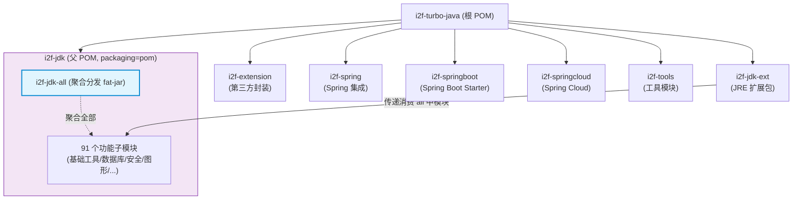

# i2f-jdk-all

> **i2f-jdk 全子模块的 Maven 聚合分发包 / 将 i2f-jdk 域下所有功能模块打包为单体 fat-jar 的一站式构建入口**（仅 1 个 pom.xml 共 633 行、无 Java 源码、零测试零资源，聚合约 91 个内部 `i2f-jdk` 子模块依赖，使用 `maven-assembly-plugin:3.1.0` 以 `jar-with-dependencies` 目标打包）。

## 模块路径

- `i2f-jdk/i2f-jdk-all/pom.xml`
- 相对于仓库根目录：`i2f-jdk/i2f-jdk-all`

## 模块依赖

### 内部模块（全部 compile 依赖，无 optional）

本模块聚合了 `i2f-jdk` 父 POM 下除自身和 `test-features` 之外的所有子模块，按功能域分类如下（共约 91 个）：

| 功能域 | 包含模块 |
|-------|---------|
| **基础工具** | `i2f-array` `i2f-bytes` `i2f-check` `i2f-check-filter` `i2f-code` `i2f-codec-impl` `i2f-codec-std` `i2f-color` `i2f-comparator` `i2f-console-color` `i2f-convert` `i2f-datetime` `i2f-enums` `i2f-exception` `i2f-form` `i2f-form-url-encoded` `i2f-hash` `i2f-i18n` `i2f-math` `i2f-number-idcard` `i2f-page` `i2f-pool` `i2f-properties` `i2f-reference` `i2f-reflect` `i2f-resources` `i2f-resp` `i2f-rowset` `i2f-search` `i2f-std-const` `i2f-text` `i2f-typeof` `i2f-verifycode` `i2f-xml` |
| **集合与缓存** | `i2f-container` `i2f-container-builder` `i2f-dict` `i2f-iterator` `i2f-lru-cache` `i2f-lru-map` `i2f-cache` `i2f-cache-std` `i2f-limit` |
| **函数式编程** | `i2f-functional` `i2f-functional-lambda` `i2f-lambda` `i2f-lambda-core` `i2f-mutator` `i2f-invokable` |
| **代理与反射增强** | `i2f-proxy` `i2f-proxy-handlers` `i2f-proxy-std` `i2f-detegate` `i2f-javacode-graph` |
| **并发与线程** | `i2f-atomic` `i2f-lock` `i2f-thread` `i2f-event` |
| **日志** | `i2f-log` `i2f-log-std` |
| **IO 与文件系统** | `i2f-io-file` `i2f-io-filesystem` `i2f-io-stream` |
| **网络与通信** | `i2f-network` `i2f-http-proxy` |
| **数据库/JDBC** | `i2f-bindsql` `i2f-bindsql-page` `i2f-bindsql-stringify` `i2f-bql` `i2f-database` `i2f-database-dialect` `i2f-database-metadata-bean` `i2f-database-metadata-data` `i2f-database-metadata-impl` `i2f-database-metadata-std` `i2f-database-type` `i2f-jdbc-bql` `i2f-jdbc-data` `i2f-jdbc-impl` `i2f-jdbc-procedure` `i2f-jdbc-proxy` `i2f-jdbc-proxy-xml` `i2f-jdbc-std` `i2f-rowset` `i2f-data-processor` |
| **安全与加密** | `i2f-authentication` `i2f-crypto-impl` `i2f-crypto-std` `i2f-firewall` `i2f-otpauth` `i2f-sm-crypto` `i2f-sm-crypto-swl` `i2f-swl` `i2f-swl-std` |
| **序列化与压缩** | `i2f-serialize-impl` `i2f-serialize-std` `i2f-compress-impl` `i2f-compress-std` `i2f-packet` |
| **图形图像** | `i2f-graphics` `i2f-graphics-2d` `i2f-graphics-3d` `i2f-image-impl` `i2f-image-std` |
| **OS/JVM/原生** | `i2f-jvm` `i2f-native-core` `i2f-native-windows` `i2f-native-windows-easyx` `i2f-os` `i2f-launcher` |
| **设计模式/工作流/生命周期** | `i2f-design-pattern` `i2f-workflow` `i2f-lifecycle` `i2f-features` |
| **注解体系** | `i2f-annotations` `i2f-annotations-api` `i2f-annotations-core` `i2f-annotations-db` `i2f-annotations-ext` |
| **AI 与 Agent** | `i2f-ai-std` `i2f-ai-rest-openai` `i2f-agent` `i2f-compiler` |
| **匹配** | `i2f-match` `i2f-match-std` |
| **SPI** | `i2f-spi` `i2f-spi-annotations` |
| **上下文/环境/时钟** | `i2f-context-impl` `i2f-context-std` `i2f-environment-impl` `i2f-environment-std` `i2f-clock-impl` `i2f-clock-std` |
| **统计/流式** | `i2f-streaming` `i2f-trace` `i2f-trace-mdc` |
| **翻译** | `i2f-translate` `i2f-translate-en2zh` `i2f-translate-zh2pinyin` |
| **元组/UUID** | `i2f-tuple-impl` `i2f-tuple-std` `i2f-uid-impl` `i2f-uid-std` |
| **浏览器/机器人** | `i2f-browser-std` `i2f-robot` `i2f-script` |
| **其他** | `i2f-algo` `i2f-geo` `i2f-mixins` `i2f-template-render` `i2f-unsafe` |

### 构建插件

| 插件坐标 | 版本 | 用途 |
|---------|------|------|
| `org.apache.maven.plugins:maven-assembly-plugin` | 3.1.0 | 将模块及其全部传递依赖打包为单体 fat-jar |

构建配置继承自根 POM（`pom.xml:1811-1857`）的 `pluginManagement`，使用 `jar-with-dependencies` 预定义描述符，输出文件命名为 `${project.artifactId}-${project.version}.jar`（`appendAssemblyId=false` 不附加描述符后缀），绑定到 `package` 阶段的 `single` 目标。JAR 包 Manifest 包含以下元信息条目：

- `Class-Path: . ./resources/`
- `Maven-Group` / `Maven-Artifact` / `Maven-Version`
- `Build-Time`（Maven 构建时间戳）
- `Root-Maven-Group` / `Root-Maven-Artifact` / `Root-Maven-Version`
- `Root-Project-Author` / `Root-Project-Nature`
- `Root-Link-Email` / `Root-Link-Github` / `Root-Link-Gitee`
- `Java-Source-Version` / `Java-Target-Version`（均为 1.8）

## 模块设计

### 架构定位

`i2f-jdk-all` 是整个 `i2f-turbo-java` 项目中规模最大的聚合分发模块，承担双重角色：

1. **全量聚合入口** — 将 `i2f-jdk` 父 POM 下约 91 个功能子模块聚合为一个统一的 Maven 构建单元，消费方只需声明一个依赖即可获得整个 i2f-jdk 基础工具集。这是项目「避免模块划分过细导致用户依赖项膨胀」问题的设计解答。
2. **Fat-jar 统一分发** — 通过 `maven-assembly-plugin` 的 `jar-with-dependencies` 描述符，将所有子模块的类文件、资源配置及其传递依赖解压合并为一个独立的、可脱离 Maven 管理的发布 JAR（约涵盖 300+ 个内部模块的全部源码）。

### 项目全局位置



### 依赖范围覆盖

`i2f-jdk-all` 的依赖声明覆盖了 `i2f-jdk` 父 POM 中除自身（L355-358 注释掉的循环引用）和 `test-features` 之外的所有子模块。各模块版本均由父 POM 的 `dependencyManagement` 统一管理，聚合模块自身不声明任何版本号。

### 设计要点

1. **最大规模聚合** — 约 91 个内部依赖，是整个仓库中依赖数量最多的模块，代表了 i2f-jdk 的完整功能边界。
2. **零源码纯净 POM** — 仅通过 `<dependencies>` 列表声明依赖关系，不包含任何 Java 代码或资源文件。
3. **Fat-jar 一键分发** — 与 `i2f-jdk-ext-all` 共享根 POM 的 `assembly-plugin` 配置，`jar-with-dependencies` 自动解析全部传递依赖树（深度可达 4-5 层），最终产出包含所有子模块 class 文件的独立 JAR。
4. **统一版本门面** — 所有依赖版本统一由 `i2f-jdk` 父 POM 继承自根 POM 的 `dependencyManagement` 管理，消费方零版本感知。
5. **无 Main-Class** — Manifest 中 `Main-Class` 被注释，fat-jar 设计为库依赖而非可执行应用。
6. **POM 按字母序组织** — 约 150 行的 `<dependencies>` 块按 artifactId 字母序排列，方便查找和维护；注释掉的自身依赖保留在对应字母位置（`i2f-j` 区间）作为参考。

## 模块目的

- **一站式引入** — 消费方只需声明一个 `i2f-jdk-all` 依赖即可一次性获得整个 i2f-jdk 生态的全部能力（基础工具、集合、函数式编程、代理、并发、日志、IO、网络、数据库、安全、加密、图形图像、OS 交互、注解、AI 契约、序列化、压缩、SPI、翻译 等），无需逐一罗列数十个子模块坐标。
- **Fat-jar 离线分发** — 为不便于使用 Maven 的部署场景（如直接 `-cp` 启动、Lib 目录手动管理、嵌入式系统等）提供包含所有依赖的独立 JAR 包。
- **功能完整性保障** — 作为 `i2f-jdk` 层的完整功能门面，确保消费方不会因遗漏某个子模块依赖而产生 `ClassNotFoundException`。

## 模块功能

- **Maven 聚合构建** — `mvn package -pl i2f-jdk/i2f-jdk-all -am` 一条命令即可触发 i2f-jdk 全部约 91 个子模块的编译、测试和打包。
- **Fat-jar 产出** — 执行 `mvn package` 后生成 `i2f-jdk-all-1.0-jdk8.jar`，其大小可达数十 MB，内含：
  - 所有 i2f-jdk 子模块的类文件
  - 所有子模块的资源配置（`META-INF/services/` SPI 描述符、属性文件、国际化资源等）
  - 全部传递依赖（仅依赖 JDK 标准库，无第三方运行时依赖——项目设计原则：i2f-jdk 层仅依赖 JDK）
- **Manifest 元信息注入** — 产出 JAR 的 `META-INF/MANIFEST.MF` 中包含项目标识、根项目信息、编译版本等元数据。

## 模块主要使用方法

### 1. 作为 Maven 依赖引入

在其他模块的 `pom.xml` 中声明依赖即可获得整个 i2f-jdk 工具集：

```xml
<dependency>
    <groupId>i2f.turbo</groupId>
    <artifactId>i2f-jdk-all</artifactId>
    <version>1.0-jdk8</version>
</dependency>
```

相当于一次性引入全部约 91 个 `i2f-jdk` 子模块，效果等价于：

```xml
<dependency>
    <groupId>i2f.turbo</groupId>
    <artifactId>i2f-trace-mdc</artifactId>
    <version>1.0-jdk8</version>
</dependency>
<!-- 加上其他 90 个... -->
```

### 2. 构建 fat-jar

```bash
mvn package -pl i2f-jdk/i2f-jdk-all -am
```

产出物位于 `i2f-jdk/i2f-jdk-all/target/i2f-jdk-all-1.0-jdk8.jar`。

### 3. 部署使用

```bash
java -cp i2f-jdk-all-1.0-jdk8.jar;./resources/ com.example.Application
```

### 4. 消费方引用

`i2f-jdk-all` 本身被以下位置引用（仅限 POM 聚合/版本管理，非直接依赖）：

- **根 POM** `dependencyManagement`（版本管理声明）
- **`i2f-jdk` 父 POM** 的 `<modules>` 列表

## 模块特性总结

- **全量聚合门面** — 约 91 个子模块的统一依赖入口，覆盖整个 i2f-jdk 功能域。
- **零源码纯 POM** — 不含任何 Java 代码，职责单一纯净。
- **Fat-jar 一键产出** — `mvn package` 直接生成包含全部功能的独立 JAR。
- **无第三方依赖** — i2f-jdk 层设计原则为仅依赖 JDK 标准库，fat-jar 不含任何三方 JAR。
- **按字母序维护** — POM 中约 150 行 dependencies 块按 artifactId 严格排序，便于查找和审查。
- **版本统一管理** — 所有子模块版本由父 POM 继承管理，零版本声明冗余。

## 模块瑕疵或错误

- **注释掉的自身循环依赖** — POM L355-358 存在被注释的 `<dependency>` 引用自身（`i2f-jdk-all` 依赖 `i2f-jdk-all`），系历史遗留占位，注释状态已生效，无实际影响。
- **POM 体积随模块数量线性增长** — 每新增一个 i2f-jdk 子模块都需在 `i2f-jdk-all/pom.xml` 中添加对应 `<dependency>`，维护成本随模块数增长。当前约 91 个依赖已使 POM 达 633 行（其中约 550 行为依赖声明），后续建议考虑改用 `*` 通配符或 BOM 模式管理。