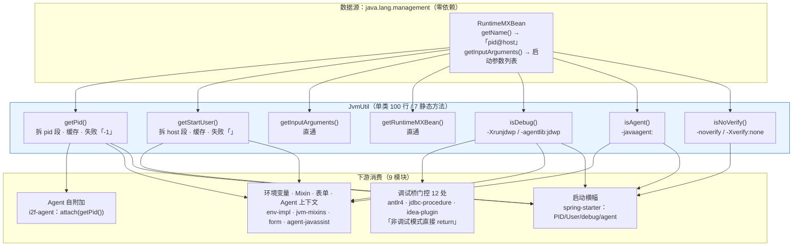

# i2f-jvm — JVM 进程信息与启动参数探测工具

> **JVM 运行环境探测工具 / 零依赖最小工具模块**（单包 `i2f.jvm`、单类 `JvmUtil` 100 行、7 个静态方法、**零依赖零资源零测试**）：基于 `java.lang.management.RuntimeMXBean` 提供四类进程级信息——① 进程标识：`getPid()`（从 `RuntimeMXBean.getName()` 的 `pid@host` 格式中拆分 PID）；② 启动参数：`getInputArguments()` 直通、`getRuntimeMXBean()` 直通；③ **启动参数特征检测**：`isDebug()`（识别 `-Xrunjdwp` / `-agentlib:jdwp` 调试参数）、`isAgent()`（识别 `-javaagent:`）、`isNoVerify()`（识别 `-noverify` / `-Xverify:none`）；④ `getStartUser()`（从 `pid@host` 拆分主机部分）。
>
> 采用 `AtomicReference.updateAndGet` 实现**无锁惰性缓存**（PID/主机/三项布尔判定各缓存一次），零三方依赖使其可用于最受限场景——包括 **Java Agent 的 premain 阶段**（agent 类加载早期不允许依赖复杂类库）。下游消费 9 个模块：调试桥门控（antlr4 / jdbc-procedure / idea-plugin 共 12 处 `isDebug()`）、Agent 自附加（`i2f-agent`）、环境变量注入、启动横幅（spring-starter）、Mixin 快捷接口、表单调试适配（`i2f-form`）。
>
> **⚠ 注意**：`getStartUser()` 实际返回的是 **主机名**（`pid@host` 的 host 部分）而非启动用户名——方法命名与实现不符，下游按"用户名"语义使用时（如 spring-starter 启动横幅 `User:` 栏）展示的是主机名（详见第七章缺陷①）。

---

## 一、模块定位与架构

`i2f-jvm` 是 `i2f-jdk` 中**最底层、最小**的工具模块之一：不引用任何 i2f 内部模块与三方库，仅封装 JDK 自带的 `ManagementFactory` / `RuntimeMXBean`，把"当前 JVM 进程是谁、怎么启动的"这一组高频判断收敛为 7 个可缓存、零分配负担的静态方法。



**三条消费主线**：

1. **调试门控（最高频）**——脚本引擎（funvi/funic/tiny 三种语言）与存储过程引擎（jdbc-procedure）的 `XxxDebugBridgeReporter.proxy()` 在方法首行执行 `if (!JvmUtil.isDebug()) return;`，以极低开销（一次缓存读取）决定是否向 IDE 插件桥接调试断点信息；idea-plugin（Gradle 构建）内是三份同名 reporter 的对偶实现。
2. **进程身份**——`i2f-agent` 的 `AgentUtil.agentCurrent()` 用 `getPid()` 拿到自身 PID 后 `VirtualMachine.attach(pid)` 实现**自我附加**；`i2f-environment-impl` 把 PID 注入环境变量映射；`agent-javassist` 在静态块中把 PID 解析为 `long` 常量。
3. **运行时画像**——`spring-starter` 的 `BaseBootApplication.getBootstrapBanner()` 打印 PID、主机、调试/agent/关闭校验标志；`i2f-mixins` 的 `JvmMixins` 接口把 4 个方法包装为脚本可调用的 `jvm_pid()` / `jvm_user()` / `jvm_debug()` / `jvm_agent()`。

## 二、依赖关系

### 2.1 POM 依赖声明

`i2f-jvm` 的 POM（25 行）**没有任何 `<dependencies>` 节点**——是仓库中依赖最纯粹的模块之一，全部能力来自 JDK 自带类库（`java.lang.management` 包，rt.jar 内置）：

| 项 | 内容 | 说明 |
|------|------|------|
| 依赖 | **无（零依赖）** | 仅使用 `java.lang.management.ManagementFactory` / `RuntimeMXBean` / `AtomicReference` |
| 构建插件 | `maven-assembly-plugin` | 仓库统一的打包插件（父 POM 管理版本） |
| 父 POM | `i2f-jdk`（`1.0-jdk8`） | 统一版本与编译配置 |

**零依赖的意义**：本模块可被任何场景安全引用，尤其是 **Java Agent 的启动早期**（如 `agent-javassist` 在 `premain` 链路中就需要 PID——此时引入任何带静态初始化的三方库都有风险）与 **IDE 插件等受限类加载器环境**。

### 2.2 传递通道

本模块位于依赖图最底层（叶子节点），不向任何模块传递依赖；下游模块全部通过直接引用 `i2f-jvm` 或经由其他模块间接获得。

## 三、包结构

| 包 | 类 | 行数 | 职责 |
|------|------|------|------|
| `i2f.jvm` | `JvmUtil` | 100 | 全部能力：进程标识、启动参数直通与特征检测 |
| 合计 | 1 类 | 100 | 单包单类，零资源文件、零测试目录 |

## 四、核心机制

### 4.1 进程名解析：`pid@host` 约定

`RuntimeMXBean.getName()` 在 HotSpot 上返回 `「pid@hostname」` 格式的字符串，`getPid()` / `getStartUser()` 分别拆分两段：

```java
// getPid() L24-36
public static String getPid() {
    return PID.updateAndGet(v -> {
        if (v != null) {
            return v;                       // 命中缓存直接返回
        }
        String name = getRuntimeMXBean().getName();
        String[] arr = name.split("@", 2);  // limit=2，host 段含 @ 也不影响
        if (arr.length == 2) {
            return arr[0];                  // pid 段
        }
        return "-1";                        // ⚠ 解析失败降级为字符串 "-1"（见缺陷②）
    });
}

// getStartUser() L38-50 —— 注意：拆出的是 host 段（主机名），不是用户名！
String[] arr = name.split("@", 2);
if (arr.length == 2) {
    return arr[1];                          // host 段 → 实为主机名（见缺陷①）
}
return "";
```

两段解析各用一个 `AtomicReference<String>` 缓存；`split("@", 2)` 的 limit 参数保证 `@` 之后的内容（即使含 `@`）整体归入第二段。

### 4.2 无锁惰性缓存：`AtomicReference.updateAndGet`

5 个缓存字段（`PID` / `START_USER` / `IS_DEBUG` / `IS_AGENT` / `IS_NO_VERIFY`）统一采用同一模式：

```java
private static final AtomicReference<Boolean> IS_DEBUG = new AtomicReference<>();

public static boolean isDebug() {
    return IS_DEBUG.updateAndGet(v -> {
        if (v != null) {
            return v;                       // 已计算过：读取缓存
        }
        List<String> args = getInputArguments();
        for (String arg : args) {
            if (arg.startsWith("-Xrunjdwp") || arg.startsWith("-agentlib:jdwp")) {
                return true;
            }
        }
        return false;                       // 计算结果被 CAS 写回缓存
    });
}
```

**设计推导**：JVM 的进程名与启动参数在进程生命周期内不可变，因此"计算一次 + 永久缓存"是语义正确的；`updateAndGet` 在并发场景下 CAS 失败会重跑 lambda（重复遍历参数列表），但无副作用，仅是微小的重复计算。相较于 `synchronized` / DCL，此模式代码最短且无锁竞争。

### 4.3 启动参数特征检测

三个布尔方法遍历 `getInputArguments()`（JVM 实际接收的启动参数列表），按前缀/全等匹配特征项：

| 方法 | 匹配的特征参数 | 判定方式 | 语义 |
|------|------|------|------|
| `isDebug()` | `-Xrunjdwp…`（旧式 JDWP）、`-agentlib:jdwp…`（标准 JDWP） | `startsWith` 前缀 | JVM 以**调试模式**启动（IDE 的 Debug 运行即注入此类参数） |
| `isAgent()` | `-javaagent:…` | `startsWith` 前缀 | 挂载了 Java Agent（含 APM/字节码增强等） |
| `isNoVerify()` | `-noverify`、`-Xverify:none` | `equals` 全等 | 关闭了字节码校验（历史参数，见缺陷④） |

**注意区分**：`isDebug()` 检测的是**启动时注入的调试参数**；若调试器在运行期通过 Attach API 动态附加（如 IDEA 的 "Attach to Process"），JVM 启动参数中不会出现 jdwp 项，方法返回 `false`——这是"基于启动参数快照"的架构限制，而非缺陷（对 IDE 场景而言，"以 Debug 模式启动"正是需要拦截的主路径）。

### 4.4 直通方法

| 方法 | 等价调用 | 说明 |
|------|------|------|
| `getRuntimeMXBean()` | `ManagementFactory.getRuntimeMXBean()` | 暴露完整 MXBean（`getStartTime()` / `getUptime()` / `getBootClassPath()` 等），供下游免去自行 import |
| `getInputArguments()` | `getRuntimeMXBean().getInputArguments()` | 返回**不可变**参数列表；每次调用重新获取（MXBean 为全局单例，开销可忽略） |

## 五、使用示例

### 5.1 基础：进程标识与运行画像

```java
import i2f.jvm.JvmUtil;

String pid  = JvmUtil.getPid();         // 如 "32104"
String host = JvmUtil.getStartUser();   // ⚠ 实际是主机名（如 "DESKTOP-XXX"），非用户名

if (JvmUtil.isDebug()) {
    System.out.println("调试模式启动，" + pid + "@" + host);
}
if (JvmUtil.isAgent()) {
    System.out.println("已挂载 Java Agent");
}
if (JvmUtil.isNoVerify()) {
    System.out.println("字节码校验已关闭");
}

// 直通 MXBean：启动时间 / 运行时长（spring-starter 横幅的用法）
RuntimeMXBean bean = JvmUtil.getRuntimeMXBean();
long uptime = bean.getUptime();
```

### 5.2 调试桥门控（最高频用法）

三种脚本语言（funvi / funic / tiny）与存储过程引擎共用的调试桥模式——**非调试模式直接返回**，零性能损失：

```java
// JdbcProcedureDebugBridgeReporter L19-35（jdbc-procedure / antlr4 / idea-plugin 三处同构）
public static void proxy(String fileName, int lineNumber, Supplier<Map<String, Object>> variableMapSupplier) {
    if (!JvmUtil.isDebug()) {
        return;                                        // 缓存命中的一次读取即返回
    }
    proxy(fileName, lineNumber, variableMapSupplier.get());
}

// AbstractExecutorNode L124-135：仅在调试模式下向 IDE 桥接节点断点
if (JvmUtil.isDebug()) {
    JdbcProcedureDebugBridgeReporter.proxy(node.getLocationFile(),
            node.getLocationLineNumber(), () -> { /* 收集变量快照 */ });
}
```

### 5.3 Agent 自我附加（`i2f-agent` 实拍）

```java
// AgentUtil L291-294：把"当前进程 PID"作为 attach 目标实现自附加
public static VirtualMachine agentCurrent(String agentJarPath, String arg) throws Exception {
    String pid = JvmUtil.getPid();
    return agentByPid(pid, agentJarPath, arg);   // VirtualMachine.attach(pid)
}

// AgentContextHolder L71-81：静态块把 PID 解析为 long 常量（失败吞异常 → 0）
static {
    long pid = 0;
    try {
        String str = JvmUtil.getPid();
        try { pid = Long.parseLong(str); } catch (Exception e) { }
    } catch (Exception e) { }
    PID = pid;
}
```

**配合 `isAgent()` 的防循环**：agent 代码可用 `JvmUtil.isAgent()` 判断自己是否已被挂载，避免 `agentCurrent` 重复附加。

### 5.4 SpringBoot 启动横幅（`spring-starter` 实拍）

```java
// BaseBootApplication.getBootstrapBanner L95-114（节选）
builder.append("\tprocess:\t").append("PID:").append(JvmUtil.getPid())
       .append(" | ").append("User:").append(JvmUtil.getStartUser()).append("\n");
//                                       ^^^^ 此处展示的实为主机名（缺陷①）
RuntimeMXBean runtimeMXBean = JvmUtil.getRuntimeMXBean();
// ... startTime / uptime ...
if (JvmUtil.isDebug())   { builder.append("\tdebug  :\t").append(true).append("\n"); }
if (JvmUtil.isAgent())   { builder.append("\tagent  :\t").append(true).append("\n"); }
if (JvmUtil.isNoVerify()){ builder.append("\tverify :\t").append(false).append("\n"); }
```

### 5.5 Mixin 快捷接口（`i2f-mixins` 实拍）

脚本/流程引擎可通过实现 `JvmMixins` 接口获得 4 个零参方法：

```java
// JvmMixins L10-26
public interface JvmMixins {
    default String jvm_pid()     { return JvmUtil.getPid(); }
    default String jvm_user()    { return JvmUtil.getStartUser(); }   // ⚠ 返回主机名
    default boolean jvm_debug()  { return JvmUtil.isDebug(); }
    default boolean jvm_agent()  { return JvmUtil.isAgent(); }
}
```

## 六、消费关系

### 6.1 消费模块清单（9 模块）

| 模块 | 显式声明 | 消费点 | 用途 |
|------|------|------|------|
| `i2f-extension-antlr4` | ✅ POM L57 | 6 处 `isDebug()` | funvi/funic/tiny 三语言 debugger reporter + 3 个 visitor 的断点桥门控 |
| `i2f-jdk/i2f-agent` | ✅ POM L30 | `AgentUtil.agentCurrent` | `getPid()` → `VirtualMachine.attach()` 自我附加 |
| `i2f-jdk/i2f-environment-impl` | ✅ POM L27 | `SystemAdditionalEnvironment` L54 | PID 注入 `RUNTIME_PID` 环境变量键 |
| `i2f-jdk/i2f-form` | ✅ POM L23 | `DialogBoxes` 静态块 L23 | 调试模式下 `enableHeadless(false)` 允许弹窗 |
| `i2f-jdk/i2f-mixins` | ✅ POM L58 | `JvmMixins` 接口 | 4 方法 Mixin 封装（pid/host/debug/agent） |
| `i2f-springboot-spring-starter` | ✅ POM L50 | `BaseBootApplication` L95-114 | 启动横幅：PID / User / debug / agent / verify |
| `i2f-jdk/i2f-jdbc-procedure` | ❌ 隐式（经 form/mixins/env-impl 传递） | reporter 2 处 + `AbstractExecutorNode` L124 | 调试桥门控（存储过程断点） |
| `i2f-extension-agent-javassist` | ❌ 隐式（经 i2f-agent 传递） | `AgentContextHolder` 静态块 L74 | PID 解析为 `long` 常量 |
| `i2f-tools/i2f-jdbc-procedure-idea-plugin` | ❌ 隐式（**Gradle 构建**，经 xproc4j 传递） | 3 个 debugger reporter | IDE 侧调试桥（Maven 反应堆外） |

### 6.2 API 调用热度（全仓静态统计）

| API | 调用处数 | 主要场景 |
|------|------|------|
| `isDebug()` | **14** | 调试桥门控（12）+ 启动横幅 + 表单适配 |
| `getPid()` | **6** | agent 自附加、环境变量、mixin、启动横幅、agent 上下文 |
| `getRuntimeMXBean()` | 1 | spring-starter 横幅（startTime/uptime） |
| `getStartUser()` / `isAgent()` | 各 2 | mixins 封装 + 启动横幅 |
| `isNoVerify()` | 1 | spring-starter 横幅 `verify:` 栏 |

> 统计口径：9 个消费模块中的 import + 直接调用点（idea-plugin 3 个 reporter 各 2 处调用）。

### 6.3 构建注册位置

- `i2f-jdk/pom.xml` L103：`<module>i2f-jvm</module>`（位于 `i2f-jdbc-proxy-xml`、`i2f-jdk-all` 之后）
- `i2f-jdk-all/pom.xml` L361：聚合依赖（jdk-all 全量包成员）
- 根 `pom.xml` L551：`dependencyManagement` 版本管理（`${i2f.version}`）

## 七、缺陷与风险

### 7.1 【中低危①】`getStartUser()` 命名与实现不符：返回主机名而非启动用户名

方法名声明"启动用户"，实际拆分的是 `pid@host` 的 **host 段（主机名）**。`RuntimeMXBean.getName()` 的 `@` 之后是主机名（如 `DESKTOP-XXX` / 容器 hostname），与操作系统登录用户无关；获取真正用户名应使用 `System.getProperty("user.name")`。

**真实影响面**（两处下游按"用户名"语义展示）：

| 消费点 | 表现 |
|------|------|
| `BaseBootApplication` 启动横幅 L95 | `User:` 栏输出主机名；而**同一横幅 L257 已有正确的 `user.name` 输出**（`user   :` 栏）——同屏出现"两个用户"，前者错误 |
| `JvmMixins.jvm_user()` | 脚本引擎中 `jvm_user()` 返回主机名，语义误导 |

**修复建议**：`getStartUser()` 改为 `System.getProperty("user.name")`（或改名为 `getStartHost()` 以诚实表达现语义，由调用方决定迁移方式）。当前行为对"想要主机名"的调用方恰好可用，对"想要用户名"的调用方静默给出错误值——属于**静默语义错误**，比抛异常更危险。

### 7.2 【中危②】`getPid()` 降级值 `"-1"` 与 attach 场景风险

当 `RuntimeMXBean.getName()` 不含 `@`（非 HotSpot 惯例格式的 JVM 实现、极少数受限环境）时，`getPid()` 返回**字符串 `"-1"`** 而非抛出异常或返回 null，且该值被 `AtomicReference` **永久缓存**。下游两类风险：

```java
// 风险 1：attach 失败（AgentUtil.agentCurrent）
String pid = JvmUtil.getPid();               // 可能为 "-1"
VirtualMachine.attach(pid);                  // attach("-1") → 抛 AttachNotSupportedException/IOException

// 风险 2：parse 后得到 -1 传播（AgentContextHolder）
long pid = Long.parseLong(JvmUtil.getPid()); // "-1" 能被成功解析为 -1，下游按合法 PID 使用
```

**根因**：`RuntimeMXBean.getName()` 的 `pid@host` 格式是 **HotSpot 实现惯例**，JVM 规范并未保证；JDK 9+ 的标准途径是 `ProcessHandle.current().pid()`。本模块以 JDK 8 为基线（当时无 `ProcessHandle`），选择 MXBean 是合理的历史决策，但应把"降级值"设计为异常而非伪 PID——`"-1"` 既可被 `Long.parseLong` 静默吞下（风险 2），又会让排查者以为是真实 PID。

### 7.3 【低危③】失败值永久缓存，无重试机制

`getPid()` 的 `"-1"` 与 `getStartUser()` 的 `""` 一旦写入 `AtomicReference` 即被永久返回。对进程名而言"计算失败"通常意味着环境本身不支持该格式（稳定失败，缓存无害）；但若失败源于瞬时的反射/安全异常，则错误值将持续存在。**注记级**：与 4.2 节的缓存设计权衡一致，可接受，但文档上应明确"缓存的是首次计算结果（含失败降级值）"这一语义。

### 7.4 【低危④】`isNoVerify()` 在现代 JDK 上已失去实际意义

`-noverify` 与 `-Xverify:none` 两个参数自 **JDK 13 起被标记废弃（deprecated）**，后续版本中不再实际生效。因此：

- 现代 JDK 上即使传了这两个参数，`isNoVerify()` 返回 `true` 反映的也只是"参数存在于启动列表"，**不代表字节码校验真的关闭了**——检测的是参数存在性，而非校验状态；
- 该方法是历史兼容保留（对应 JDK 8 时代"关闭校验加速启动"的实践），新代码不应依赖其判断安全状态。

### 7.5 【注记⑤】`isDebug()` 的架构限制：只感知启动参数，不感知运行期 attach

`isDebug()` 基于 `getInputArguments()` 快照判定。调试器若以 Attach API 动态附加（IDEA "Attach to Process"、JDI 动态连接），启动参数中无 jdwp 项 → 返回 `false`，调试桥不会激活。对"IDE Debug 启动"这一主路径覆盖完整（`-agentlib:jdwp` 或旧式 `-Xrunjdwp`），动态附加属于已知边界。**若产品需求要求"任何形式的调试都激活桥接"，需改为检测 JDI 连接状态而非启动参数**——当前架构不支持。

### 7.6 【注记⑥】并发下的重复计算

`AtomicReference.updateAndGet` 在 CAS 失败时重跑 lambda：并发首次调用 `isDebug()` 时，多个线程可能各自完整遍历一次参数列表（无副作用、结果一致）。相比 DCL 模式省去了 volatile 双检样板，代价是极小概率的重复遍历——对 7 个方法的调用量级完全可忽略，属于**自觉的设计权衡**。

### 7.7 【注记⑦】`getInputArguments()` 未缓存

每次调用重新经 `ManagementFactory.getRuntimeMXBean().getInputArguments()` 获取。MXBean 为全局单例、返回列表不可变，开销微秒级；三个 `is*()` 方法已各自缓存结果，直通方法保持"原始语义"合理。

### 7.8 正面设计

| 设计点 | 说明 |
|------|------|
| **零依赖** | 仅 JDK rt 类库，可用于 Agent premain、受限类加载器等任何场景 |
| **单类聚合** | 100 行覆盖"进程是谁 + 怎么启动"完整画像，无分包/无继承/无 SPI 的多余抽象 |
| **无锁缓存** | `AtomicReference.updateAndGet` 模式在 5 个字段上一致应用，代码最短且无竞争 |
| **语义自洽的判定集** | `isDebug/isAgent/isNoVerify` 恰好覆盖"启动参数画像"三问，被四类下游按需组合 |
| **微开销门控** | 调试桥 `if (!isDebug()) return;` 的调用模式依赖"缓存命中 = 一次 volatile 读"，本模块的缓存设计正是为此服务质量 |

## 八、总结

`i2f-jvm` 是"小模块、大扇入"的典型：**1 个类 100 行零依赖**，却支撑着 9 个下游模块、26+ 个调用点——其中 14 处 `isDebug()` 构成了整个仓库**调试/生产双态切换的基层开关**（脚本引擎、存储过程引擎、IDE 插件的断点桥全部以它作为第一道门）。

**使用建议**：

1. `getPid()` 用于展示与日志是最佳场景；**用于 Attach API 等关键路径时，应校验返回值非 `"-1"`**；
2. `getStartUser()` 当前返回主机名——需要用户名请直接用 `System.getProperty("user.name")`；
3. `isDebug()` 判断"IDE Debug 启动"可靠；判断"是否正被调试"不完整（动态 attach 不在覆盖内）；
4. `isNoVerify()` 仅作历史参数识别，现代 JDK 上无安全语义。

**文档关联**：本模块是 `i2f-agent`（自附加）、`i2f-mixins`（JvmMixins）、`i2f-springboot-spring-starter`（启动横幅）、`i2f-jdbc-procedure` 与 `i2f-extension-antlr4`（调试桥）文档中反复出现的配套依赖，建议结合阅读。
