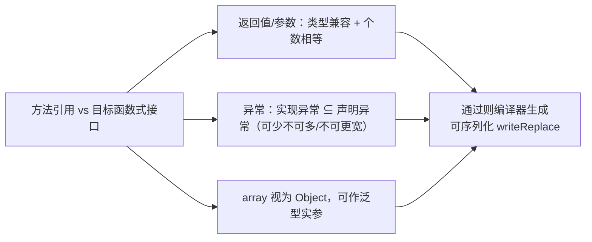

# i2f-lambda

> 方法引用解析**通用层**（lambda）。在最小内核 `i2f-lambda-core` 的「getter/setter 命名约定」反解之上，补上它所刻意不做的那一半能力——**把任意方法引用精确还原成它真正引用的那个 `java.lang.reflect.Method`**：不再依赖 `getXxx/setXxx` 前缀剥字段的启发式，而是用 `SerializedLambda` 携带的 `getImplMethodName()` + `getImplMethodSignature()`（JVM 方法描述符），经 `i2f-reflect` 的 `ReflectResolver.getMethods` 遍历类层次、用 `ReflectSignature.sign(method)` 逐一对齐描述符，命中唯一真实方法。同时以 `Object` 为入参做 `instanceof Serializable` 兜底、对方法解析结果落 `LruMap` 缓存。它是 `i2f-functional-lambda` 把「lambda 转换函数」抽象为通用 `ExFunctionalDelegator` 的直接底座。

## 模块路径

- `i2f-jdk/i2f-lambda`

## 模块依赖

| GroupId | ArtifactId | Scope | Optional | 来源 | 用途 |
| --- | --- | --- | --- | --- | --- |
| i2f.turbo | `i2f-lambda-core` | compile | 否 | 内部 | 提供 `Lambda`：`getSerializedLambdaNullable`/`ofClass`/`ofField` 等内核反解 |
| i2f.turbo | `i2f-lru-map` | compile | 否 | 内部 | `LruMap` 缓存方法解析结果（`fastSerializedLambdaMethodNullable`） |
| i2f.turbo | `i2f-reflect` | compile | 否 | 内部 | `ReflectResolver.getMethods` 遍历类层次、`ReflectSignature.sign` 生成/对齐 JVM 方法描述符 |
| org.projectlombok | `lombok` | provided | 是 | 三方 | 编译期注解处理器；本模块源码实际未使用其注解，仅沿用工程惯例声明 |

- 版本、`lombok` 的 `provided`+`optional` 均由父 POM `i2f-jdk`（`1.0-jdk8`）的 `dependencyManagement` 统一托管，本 `pom.xml` 内不写版本号。
- **零三方运行期依赖**，纯 JDK 反射 + `java.lang.invoke.SerializedLambda`。

## 模块设计

### 与内核 `i2f-lambda-core` 的分工

内核 `Lambda` 在文档里明确「只针对 getter/setter 类型方法、保持功能最小化」，它靠**命名约定**工作：从 `getImplMethodName()`（如 `getUserName`）剥前缀得到字段名 `userName`，再定位 `Field`/`Method`。这套启发式对**非 getter/setter 的方法引用**（如 `TestLambda::supplier`、`SomeBean::doWork`）会失配——因为根本没有可剥的前缀。

`i2f-lambda` 的 `LambdaInflater` 用**签名精确匹配**补上这一缺口：不看方法名形状，直接把 lambda 记录的「方法名 + 描述符」拿去和类里真实声明的方法逐一比对，因此能还原**任意**方法引用。

```mermaid
flowchart TD
    A["方法引用 / lambda<br/>(必须 extends Serializable)"] --> B["LambdaInflater.getSerializedLambdaNullable(obj)<br/>instanceof Serializable 兜底"]
    B -->|null 非序列化| Z["返回 null"]
    B -->|SerializedLambda| C{目标？}
    C -->|引用的类| D["getSerializedLambdaClassNullable<br/>→ Lambda.ofClass"]
    C -->|引用字段<br/>(getter/setter 约定)| E["getSerializedLambdaFieldNullable<br/>→ Lambda.ofField（剥前缀找字段）"]
    C -->|引用方法<br/>(任意方法)| F["parseSerializedLambdaMethodNullable<br/>名 + 描述符 精确匹配"]
    F --> G["ReflectResolver.getMethods(clazz, filter, true)"]
    G --> H["filter: name==implMethodName<br/>&& ReflectSignature.sign(m)==implMethodSignature"]
    H --> I["命中唯一真实 Method"]
```

### 三条解析出口与两种匹配范式

`LambdaInflater` 全部为 `static`、无实例状态（除一张静态缓存表），按出口分三组：

1. **类出口**：`getSerializedLambdaClassNullable(Object)` → `Lambda.ofClass(lambda)`，还原方法引用所属的声明类。
2. **字段出口**（沿用内核的**命名约定**范式）：
   - `fastSerializedLambdaFieldNullable(Object)`：先判 `lambda==null` 再 `Lambda.ofField`；
   - `getSerializedLambdaFieldNullable(Object)`：取 lambda 后交 `parseSerializedLambdaFieldNullable`；
   - `parseSerializedLambdaFieldNullable(SerializedLambda)`：直接 `Lambda.ofField(lambda)`。
3. **方法出口**（本模块新增的**签名精确匹配**范式，可解任意方法）：
   - `parseSerializedLambdaMethodNullable(SerializedLambda)`：**null 安全**，取 `getImplMethodName()`+`getImplMethodSignature()`，`Lambda.ofClass` 定位类后用 `ReflectResolver.getMethods(clazz, filter, true)`（`matchedOne=true` 命中即停）比对 `ReflectSignature.sign` 等于描述符者；
   - `getSerializedLambdaMethodNullable(Object)`：取 lambda 后委托上一条；
   - `fastSerializedLambdaMethodNullable(Object)`：同上，但按 `getImplClass()#getImplMethodName()` 为键查 `LruMap(8192)`，用 `Optional<Method>` 兼顾「解析结果为 null」的负缓存。

### 签名匹配的关键：`ReflectSignature.sign` 对齐描述符

`SerializedLambda.getImplMethodSignature()` 返回的是 JVM 内部描述符（如 `(Ljava/lang/Integer;)V`）。`ReflectSignature.sign(Method)` 把反射方法归一化为同格式：参数与返回值经 `toSign` 编码——基本类型走内置简写表（`I`/`J`/`Z`…），数组直接用 `getName()`（`[Ljava...`），引用类型转 `L<slash路径>;`。二者字符串相等即认定同一方法，从而**绕开 getter/setter 命名**、覆盖任意方法重载中的精确那一个。

### 包结构

```
i2f-lambda
└── src/main/java/i2f/lambda
    ├── inflater/LambdaInflater.java   # 通用解析门面（唯一对外类）
    └── test/TestLambda.java           # 方法引用「兼容性规则」试验田（main 方法，非单测）
```

## 模块目的

- 让「方法引用 → 反射对象」从**只能解 getter/setter**升级为**能解任意方法引用**，补齐内核刻意留白的通用解析能力。
- 以 `Object` 为统一入口做 `Serializable` 兜底，调用方无需先自行判「是不是可序列化函数」。
- 对昂贵的「遍历类层次找方法」结果做 `LruMap` 缓存，让重复解析近乎常数时间。
- 为上层 `i2f-functional-lambda` 的通用「lambda→目标对象」转换器（`ExFunctionalDelegator`）提供可直接方法引用的解析函数。

## 模块功能

| 功能 | 入口 | 说明 |
| --- | --- | --- |
| 反序列化 lambda 元信息 | `getSerializedLambdaNullable(Object)` | `instanceof Serializable` 兜底后转 `Lambda`；不可解析返回 `null` |
| 解析引用类 | `getSerializedLambdaClassNullable(Object)` | 返回方法引用所属 `Class` |
| 解析引用字段 | `fast/getSerializedLambdaFieldNullable`、`parseSerializedLambdaFieldNullable` | 沿用内核命名约定剥前缀定位 `Field`（仅 getter/setter 形状有效） |
| **解析任意引用方法** | `fast/getSerializedLambdaMethodNullable`、`parseSerializedLambdaMethodNullable` | **名 + JVM 描述符精确匹配**，不受命名约定限制 |
| 方法结果缓存 | `fastSerializedLambdaMethodNullable` | `LruMap<String,Optional<Method>>(8192)`，负结果亦缓存 |
| 兼容性规则演示 | `TestLambda`（`main`） | 穷举方法引用在返回值/参数/异常/数组上的可赋值规则 |

## 模块主要使用方法

### 1. 精确还原任意方法引用（本模块核心价值）

```java
import i2f.lambda.inflater.LambdaInflater;
import java.lang.reflect.Method;
import java.util.function.Function; // 假设存在可序列化的函数式接口

// 任意方法引用（不必是 getter/setter），只要其函数式接口 extends Serializable
SerializerFunction<String, Integer> ref = String::length;

// 拿到它真正引用的那个 java.lang.reflect.Method（名 length + 描述符 ()I 精确匹配）
Method m = LambdaInflater.getSerializedLambdaMethodNullable(ref);
// m.getName() => "length"，可直接 m.invoke(target)

// 高频重复解析走缓存版
Method cached = LambdaInflater.fastSerializedLambdaMethodNullable(ref);
```

> 若换成内核 `Lambda.ofField(ref)`，因 `length` 不含 `get/set/is/...` 前缀会被当作字段名 `length` 去找字段而落空——这正是 `i2f-lambda` 存在的理由。

### 2. 沿内核命名约定解析字段（getter/setter 场景）

```java
// SysUser::getUserName 这类规范 getter 引用，仍可直接解到字段 userName
Field f = LambdaInflater.getSerializedLambdaFieldNullable(sysUser -> sysUser.getUserName());
// 实际要求 fn 为「方法引用」而非 lambda 表达式体，详见下方注意事项
```

### 3. 被 `i2f-functional-lambda` 作为转换函数复用

`i2f-functional-lambda` 把「一个函数式接口实例 → 目标反射对象」抽象为 `ExFunctionalDelegator<T>`，本模块的方法恰好充当其解析器：

```java
// SerializedLambdaConverter —— lambda → SerializedLambda
super(LambdaInflater::getSerializedLambdaNullable);
// FieldLambdaConverter —— lambda → Field
super(LambdaInflater::getSerializedLambdaFieldNullable);
// MethodLambdaConverter —— lambda → Method
super(LambdaInflater::getSerializedLambdaMethodNullable);
```

### 4. 方法引用兼容性规则（`TestLambda` 结论）

`TestLambda` 以大量 `@FunctionalInterface ... extends Serializable` 与静态方法，实测编译器对「方法引用能否赋给某函数式接口」的检查，结论：

| 维度 | 规则 |
| --- | --- |
| 返回值 / 参数类型 | 需**兼容**（含基本类型↔包装类自动适配），且**个数相等** |
| 异常类型 | 只需兼容：实现方法抛出的异常须是接口声明异常的**子类型**；个数**可以更少**（可不抛） |
| 无异常接口 | **不能**接收会抛受检异常的实现 |
| 数组类型 | `byte[]` 等本质是 `Object`，可参与泛型实参匹配 |



## 注意事项 / 已知实现瑕疵

1. **`getSerializedLambdaFieldNullable` / `parseSerializedLambdaFieldNullable` 对 `null` 不安全**：当入参非 `Serializable`（或不可解析）时，`getSerializedLambdaNullable` 返回 `null`，字段版把它直接交给 `Lambda.ofField(null)` → 内部 `ofClass→ofClassName→lambda.getImplClass()` 抛 **NPE**。与之相对，**方法版** `parseSerializedLambdaMethodNullable` 有 `if (lambda == null) return null;` 保护，**`fast` 字段版**也先判空。故对可能传入非序列化对象的场景，应改用 `fastSerializedLambdaFieldNullable` 或 `getSerializedLambdaMethodNullable`，勿用无保护的 `getSerializedLambdaFieldNullable`。
2. **字段出口仍受内核命名约定限制**：`getXxxFieldNullable` 系列本质是 `Lambda.ofField`，只对 `get/set/is/has/enable/with/build` 前缀的规范方法引用有效；解任意方法请用**方法出口**。
3. **lambda 表达式体不可靠**：`obj -> obj.foo()` 这类（非方法引用）的 `getImplClass` 指向**定义它的 enclosing 类**而非目标类型，解析结果不代表「被调用方法」——本模块与内核同样只面向**方法引用**（`Type::method`）。
4. **`ReflectResolver.getMethods` 的接口遍历瑕疵（继承自 reflect）**：`LambdaInflater` 以 `matchedOne=true` 命中即返回，通常已在类自身/父类命中，规避了 reflect 内部「接口分支误用 `superclass` 变量」的已知问题；但若目标方法仅存在于接口默认方法，遍历结果可能不全。
5. **`lombok` 声明但未使用**：本模块两个源文件不含任何 lombok 注解，依赖仅为惯例引入。

## 模块特性总结

- **通用解析层**：补齐内核「只解 getter/setter」的留白，以「方法名 + JVM 描述符」精确还原**任意方法引用**的 `Method`。
- **`Object` 统一入口 + `Serializable` 兜底**：调用方无需预判可序列化性，不可解析返回 `null`。
- **`LruMap(8192)` 缓存 + `Optional` 负缓存**：高频解析近常数开销。
- **三出口分层**：类 / 字段（沿用内核命名约定）/ 方法（新范式），职责清晰。
- **可序列化 lambda 兼容规则沉淀**：`TestLambda` 系统化了返回值/参数/异常/数组四项编译器检查规则。
- **下游直接可引用**：`i2f-functional-lambda` 三个 `ExFunctionalDelegator` 转换器以其方法为解析器。
- **零三方运行期依赖**：纯 JDK 反射 + `java.lang.invoke.SerializedLambda`；`provided`+`optional` 的 lombok 未实际使用。

## 下游消费

- `i2f-functional-lambda`：`FieldLambdaConverter`/`MethodLambdaConverter`/`SerializedLambdaConverter` 分别以 `LambdaInflater::getSerializedLambdaFieldNullable`、`::getSerializedLambdaMethodNullable`、`::getSerializedLambdaNullable` 作为 `ExFunctionalDelegator` 的解析函数（grep 核实）。
- `i2f-jdk-all`：聚合 POM 直接引入 `i2f-lambda`（连同 `i2f-lambda-core`）。

## 与近邻模块的关系

| 模块 | 定位 | 与方法引用的关系 |
| --- | --- | --- |
| `i2f-lambda-core` | 最小内核 | 命名约定剥前缀 → `Field`/`Method`/`Class`，只管 getter/setter |
| **`i2f-lambda`（本模块）** | 通用解析层 | 签名精确匹配 → **任意**方法引用的 `Method`；`Object` 入口 + 缓存 |
| `i2f-functional-lambda` | 函数式转换层 | 把本模块解析函数封装为可组合的 `ExFunctionalDelegator` 转换器 |
| `i2f-bql` | 查询语言 | 列寻址用内核 `Lambda.ofField`（getter 约定），未用本模块 |
| `i2f-mutator` | 流式改值 | 依赖内核 `i2f-lambda-core`，未用本模块 |
