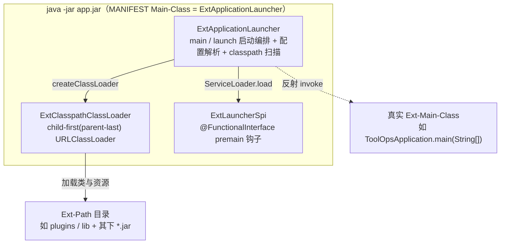
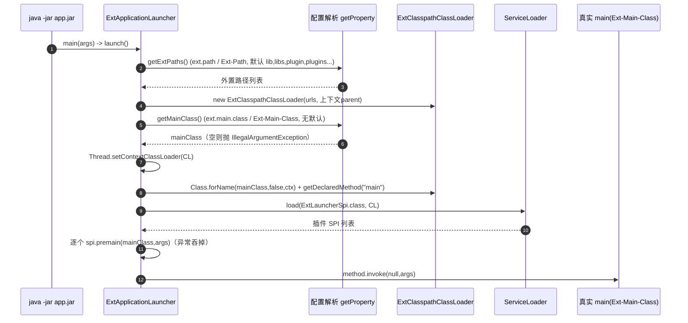

# i2f-launcher

> 轻量级**应用启动器 / 外置 classpath 加载器**。借鉴 Spring Boot Loader 的思路并大幅简化：Maven 打包时把 jar 的 `Main-Class` 指向本模块的 `ExtApplicationLauncher`，运行期由它读取 `Ext-Main-Class`（真正的业务入口）与 `Ext-Path`（额外 classpath 目录），用一个 child-first 的自定义 `URLClassLoader` 加载外置目录/ jar，再反射调用真实 `main`。用于「jar 打包后 Class-Path 已固化、运行期无法追加 classpath」的痛点，支持插件化应用与 JDBC Driver 这类动态 SPI 组件的加载。全模块单包 `i2f.launcher`、3 个类、零 i2f 内部依赖、零三方运行期依赖。

## 模块路径

- `i2f-jdk/i2f-launcher`

## 模块依赖

| 依赖 | Maven 坐标 | scope | optional | 说明 |
| --- | --- | --- | --- | --- |
| lombok | `org.projectlombok:lombok` | provided（父托管） | 是 | **声明但源码零引用**（无 `import lombok`、无任何注解），属冗余依赖，已 grep 核实 |

- 无 i2f 内部依赖；无任何三方运行期依赖，纯 JDK（`java.net.URLClassLoader` / `ServiceLoader` / 反射 / `java.util.jar` / `ManagementFactory`）。
- 构建期插件：`maven-assembly-plugin`（沿用仓库统一聚合打包约定，模块自身无 assembly 描述文件）。
- **下游真实消费方**：`i2f-tools/i2f-tools-ops`（`pom.xml` 中 `main.class=i2f.launcher.ExtApplicationLauncher`、`Ext-Main-Class=i2f.tools.ToolOpsApplication`、`Ext-Path=plugins`），以 `maven-jar-plugin` 生成带启动器 manifest 的可执行 jar，配合 `lib/` 外置 jar 与 `plugins` 插件目录。

## 模块设计

三个类职责正交，构成「启动编排 + 类加载 + 启动前钩子」三段式：



- **`ExtApplicationLauncher`（启动器主体）**：既是 JVM 入口（`main`），又承载全部装配逻辑。
  - **多来源配置解析** `getProperty(systemKey, manifestKey, default)`，优先级：程序参数 `key=` → `System.getProperty(key)` → JVM 输入参数（`RuntimeMXBean` 中的 `key=` / `-Dkey=` / `--key=`）→ MANIFEST 属性 `getManifestProperty` → 默认值。两组键：`ext.main.class`/`Ext-Main-Class`（**无默认**，取空即抛 `IllegalArgumentException`）、`ext.path`/`Ext-Path`（默认 `lib,libs,plugin,plugins,ext-lib,ext-libs`）。
  - **classpath 扫描** `getExtPaths`（按 `,|;|:` 切分并归一 `\`→`/`、转绝对路径）→ `getPathUrls` → `resolvePathUrls` 递归：根目录本身入 classpath 并递归子项（`isRoot=false`）；遇到 `.jar` 文件加入其 URL 及其父目录 URL；对 `.jar` 再 `resolveJarEmbedUrls` 尝试解析「jar 内嵌 jar」（`jar:<base>!<entry>`）。结果汇入 `LinkedHashSet<URL>` 保序去重。
  - **MANIFEST 读取三兜底** `getManifestProperty`：上下文 loader → 本类 loader → `getManifestByClass`（经 `ProtectionDomain`/`CodeSource` 定位 jar/目录再 `getManifest`）。
  - **启动** `launch()`：`createClassLoader` → `getMainClass` → `Thread.setContextClassLoader(loader)` → `Class.forName(mainClass,false,ctx)` + `getDeclaredMethod("main",String[].class)` → 用新 loader `ServiceLoader.load(ExtLauncherSpi.class, loader)` 逐个 `premain` → `method.invoke(null,args)`。
- **`ExtClasspathClassLoader`（child-first 类加载器）**：`extends URLClassLoader`，覆写 `loadClass`——先 `findLoadedClass`；`java./jdk./sun./com.sun./javax./jakarta.` 前缀直接走 `super`（父优先，交回 JDK）；其余**先 `findClass`（仅查本 loader 的 URL）**，失败再 `super.loadClass`。覆写 `getResource`（findResource 优先→super）、`getResources`（本 loader 结果在前、父结果在后，按字符串去重保序）。由此实现「插件目录里的类/资源可覆盖 app jar 同名者」。
- **`ExtLauncherSpi`（启动前扩展钩子）**：`@FunctionalInterface`，签名 `void premain(Class<?> mainClass, String[] args)`，在真实 `main` 执行前对每个 SPI 实现回调一次（异常被吞、不阻断启动）。注意：它**不是** `java.lang.instrument` 的 `-javaagent` premain（无 `Instrumentation` 入参），只是复用了该命名，作为插件的「业务启动前初始化」扩展点。

启动时序：



## 模块目的

- Java 程序通常打成单个 jar，其 `META-INF/MANIFEST.MF` 的 `Class-Path` 在**打包期即固化**，运行期无法直接追加；若改用 `java -cp` 又须把原有 classpath 全部重写一遍（一般靠 shell 脚本拼接，繁琐）。
- JDK 认定「一个目录是一个 classpath、一个 jar 是一个 classpath」，故当一个目录已在 classpath 上时，其内 `.jar` 只被当普通资源而不会作为 classpath——写 classpath 时要把目录和目录内每个 jar 逐一列出，极易出错。
- 启动器**先于业务入口运行**，注入一个 child-first 的上下文 classloader，使随后加载的类/资源/SPI 能自动命中外置目录及其中的 jar；业务 `main` 及其之后的一切**无需任何改动**即可享受动态 classpath 扩展，适配插件化、JDBC Driver 等需运行期动态发现的场景。

## 模块功能

- 以 `Ext-Main-Class` 反射定位并调用真实业务 `main(String[])`，本模块 `main` 仅作跳板。
- `ext.path`/`Ext-Path` 支持多来源配置（程序参数、系统属性、JVM `-D`/`--` 参数、MANIFEST），带一组常见默认目录名。
- 递归扫描外置目录与 jar 构建 classpath，尝试展开 jar 内嵌 jar；根目录与其内每个 jar 都被登记为 classpath 入口。
- child-first 类/资源加载，允许插件覆写 app jar 内的同名类与资源。
- `ExtLauncherSpi` 提供「业务 main 执行前」的一次性扩展回调点（`premain`）。
- 启动过程的日志以统一 `[launcher]` 前缀打印解析到的 main 类、外置路径与每条 ext-resource。

## 模块主要使用方法

**1）Maven 打包：把启动器设为 `Main-Class`，真实入口写进 `Ext-Main-Class`**

```xml
<plugin>
  <groupId>org.apache.maven.plugins</groupId>
  <artifactId>maven-jar-plugin</artifactId>
  <configuration>
    <archive>
      <manifest>
        <addClasspath>true</addClasspath>
        <classpathPrefix>lib/</classpathPrefix>
        <!-- 启动器（跳板）类 -->
        <mainClass>i2f.launcher.ExtApplicationLauncher</mainClass>
      </manifest>
      <manifestEntries>
        <!-- 真正的业务入口类 -->
        <Ext-Main-Class>com.i2f.WebApplication</Ext-Main-Class>
        <!-- 额外 classpath 目录，逗号分隔；目录及其下的 jar 都会入 classpath -->
        <Ext-Path>plugins</Ext-Path>
      </manifestEntries>
    </archive>
  </configuration>
</plugin>
```

**2）运行期以 JVM 参数覆盖配置**

```bash
java -Dext.main.class=com.i2f.WebApplication -Dext.path=plugins,lib -jar app.jar
```

**3）作为程序参数传入（注意会原样透传给业务 main，见下文瑕疵）**

```bash
java -jar app.jar ext.path=plugins   # 该参数同时会出现在业务 main(String[]) 里
```

**4）插件在 `Ext-Path` 目录下注册启动前钩子**

```
# plugins/my-plugin.jar!/META-INF/services/i2f.launcher.ExtLauncherSpi
com.i2f.plugin.MyLauncherSpi
```

```java
public class MyLauncherSpi implements ExtLauncherSpi {
    @Override
    public void premain(Class<?> mainClass, String[] args) {
        // 真实 main 执行前运行（例如预热、注册、打印），异常不会中断启动
    }
}
```

**5）编程式启动**

```java
new ExtApplicationLauncher(args).launch();
```

## 模块特性总结

- **零三方运行期依赖、纯 JDK**：仅用 `URLClassLoader`/`ServiceLoader`/反射/`java.util.jar`/`ManagementFactory`（pom 声明的 lombok 未被使用）。
- **跳板式启动**：`Main-Class=ExtApplicationLauncher`，`Ext-Main-Class` 才是真身，业务代码零侵入即可加载外置 classpath。
- **双 classloader 协作**：app loader 装载启动器本身，`ExtClasspathClassLoader`（parent-last）装载插件，使插件类/资源可覆写 app jar 同名者，JDK 包名前缀则回退父优先。
- **配置多来源 + MANIFEST 三兜底**：程序参数/系统属性/JVM 参数/MANIFEST 逐级解析，MANIFEST 又经上下文 loader→本类 loader→CodeSource 三路径定位。
- **扩展点前瞻**：`ExtLauncherSpi` 以 `ServiceLoader` 发现，作为插件「启动前初始化」钩子（当前仓库尚无任何实现）。

## 已知实现瑕疵与注意事项

> 以下均经源码逐行核实。

1. **lombok 声明未用**：`pom.xml` 依赖 `lombok`，但三个源文件无任何 `import lombok`、无 Lombok 注解（grep 核实），属冗余依赖，可移除。
2. **`getExtPaths` 以 `:` 切分会破坏 Windows 盘符绝对路径**：`split(",|;|:")` 把 `ext.path=C:\libs` 切成 `C` 与 `\libs` 两段，盘符路径失效。默认值全为相对目录名因而规避；一旦用户填带盘符的绝对路径即踩坑，建议仅按 `,`/`;` 切分或对切分结果再判存在性。
3. **`getManifestByResource(ClassLoader loader)` 忽略入参**：方法体固定用 `Thread.currentThread().getContextClassLoader()` 取 `META-INF/MANIFEST.MF`，形参 `loader` 形同虚设；`getManifestProperty` 先后以「上下文 loader」「本类 loader」两次调用实际走同一逻辑，第二兜底无效。
4. **程序参数形式的 `ext.*` 配置会原样透传给业务 `main`**：`args` 全程不剥离 `ext.main.class=`/`ext.path=`，以「程序参数」方式给的启动器配置会连同进入真实 `main(String[])`，可能被 Spring 等框架误当作应用参数解析；用 `-D`/`--` 的 JVM 参数方式则不受影响（其本就不在 main args 中）。
5. **jar 内嵌 jar 的 `jar:<base>!<entry>` URL 对普通 `URLClassLoader` 未必生效**：`resolveJarEmbedUrls` 产出 `jar:file:/.../app.jar!/inner.jar` 形式 URL 加入 classpath，但标准 `URLClassPath` 并不像 Spring Boot Loader 那样支持可嵌套 jar 协议，内嵌 jar 里的类很可能加载不到；可靠的仍是「外置展开目录 / 平铺 jar」。
6. **`--key=` 分支缺空值保护**：`getSystemProperty` 对 `--{key}=` 直接 `return item.substring(...)`，未像其余分支判 `!isEmpty`，给定 `--ext.path=` 空值时会以空串命中并跳过后续 MANIFEST/默认兜底。
7. **多处静默吞异常**：`resolvePathUrls`、`resolveJarEmbedUrls`、`getManifest`、`getProperty` 等大量 `catch(...){}` 空块，扫描/读 MANIFEST 失败无任何提示，定位「为何某插件没被加载」较困难。
8. **`ExtLauncherSpi` 命名易与 `-javaagent` 混淆**：其 `premain` 非 `java.lang.instrument` 的 premain（无 `Instrumentation` 参数、不做字节码增强），仅为业务 main 前的一次性回调；当前全仓无任何实现，属预留扩展点。
