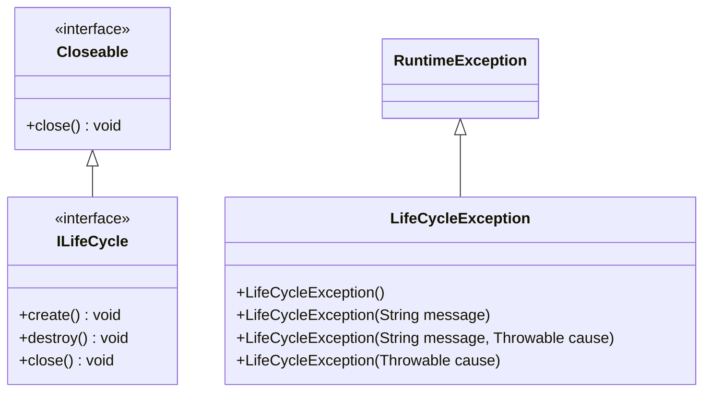

# i2f-lifecycle

> **统一生命周期契约模块**：全模块只有 1 个接口 `ILifeCycle` 与 1 个非受检异常 `LifeCycleException`，用 `create()`/`destroy()`/`close()` 三动词为「需要显式创建与销毁的资源型对象」定义最小生命周期契约——`create`/`destroy` 均为 `default` 空实现（可选钩子、按需覆写），`close()` 把 JDK `Closeable` 桥接为 `destroy()`，使生命周期对象天然兼容 try-with-resources；`create`/`destroy` 签名不声明受检异常，失败由 `LifeCycleException` 约定承载。被 `i2f-data-processor`（读写器契约）、`i2f-check-filter`（哈希分组去重管线）与 `i2f-translate` 体系（翻译器 + SQLite 连接生命周期）三族消费，零 i2f 内部依赖、运行期零三方依赖。

## 模块路径

- `i2f-jdk/i2f-lifecycle`

## 模块依赖

| GroupId | ArtifactId | Scope | Optional | 来源 | 用途 |
| --- | --- | --- | --- | --- | --- |
| org.projectlombok | lombok | provided | 是（根 POM `dependencyManagement` 统一托管） | 三方 | pom 声明，但接口与异常类**均未使用**任何 lombok 注解，属冗余声明 |

- **零 i2f 内部依赖**：不依赖任何其它 i2f 模块，仅用 JDK 自带类型（`java.io.Closeable`/`IOException`/`RuntimeException`）。
- **运行期零三方依赖**；父 POM 为 `i2f.turbo:i2f-jdk:1.0-jdk8`。
- `build` 声明 `maven-assembly-plugin`（继承根 POM `pluginManagement` 中 `jar-with-dependencies` 配置，`package` 阶段执行 `single` 目标）——对零依赖契约模块将产出与普通 jar 等价的 fat-jar，属项目打包惯例。

## 模块设计

全模块只有一条继承链与一个配套异常，「契约极小、钩子可选、桥接 JDK」是全部设计：



### 1. `ILifeCycle`：三动词生命周期契约

```java
public interface ILifeCycle extends Closeable {
    default void create() { }
    default void destroy() { }
    @Override
    default void close() throws IOException {
        this.destroy();
    }
}
```

- **`create()`**：显式初始化钩子（开流、建连接、加锁……），**默认空实现**——不需要初始化的实现类型可以完全不覆写。
- **`destroy()`**：显式销毁/释放钩子（关流、断连接、删临时文件……），同样默认空实现。
- **`close()`**：`@Override` JDK `java.io.Closeable#close()`，默认桥接为 `this.destroy()`。

### 2. `close()` → `destroy()`：与 JDK Closeable 对齐

这是本模块最有价值的一处设计：让 `ILifeCycle` 继承 `Closeable` 并让 `close()` 委托 `destroy()`，任何生命周期对象都能直接用于 **try-with-resources**，退出代码块即完成销毁，无需调用方手写 `finally { destroy(); }`。translate 系的测试类即以此消费：


### 3. `LifeCycleException`：非受检失败信号

`create()`/`destroy()` 的签名**不带 `throws` 子句**（default 方法实现方也不能追加受检异常），因此生命周期阶段失败被约定为抛出非受检的 `LifeCycleException`。它按 JDK `RuntimeException` 模板提供 4 个常用构造器：`()`、`(String)`、`(String, Throwable)`、`(Throwable)`。

### 4. 包结构

| 包 | 类型 | 职责 |
| --- | --- | --- |
| `i2f.lifecycle` | `ILifeCycle` | 生命周期契约接口（create/destroy/close 三动词 + Closeable 桥接） |
| `i2f.lifecycle.exception` | `LifeCycleException` | 创建/销毁阶段失败的非受检异常 |

## 模块目的

- 为「有显式创建/销毁阶段的对象」提供**最小统一契约**，让容器、流程编排、测试代码可以用同一种方式驱动对象生命周期（如 `HashGroupRepeatFilter` 的去重管线、translate 测试的 try-with-resources）。
- 把 JDK `Closeable` 语义与自定义 `destroy` 对齐，使生命周期对象**零改动兼容 try-with-resources**。
- 用 `default` 方法把生命周期钩子定义为**可选能力**：实现方只需覆写自己关心的钩子，不关心则完全不出现生命周期代码。

## 模块功能

| 类型 | 成员 | 说明 |
| --- | --- | --- |
| `ILifeCycle`（extends `Closeable`） | `create()` | `default` 空实现：显式初始化钩子，按需覆写 |
| | `destroy()` | `default` 空实现：显式销毁/释放钩子，按需覆写 |
| | `close()` | `default`，`@Override`：桥接为 `this.destroy()`；签名保留 `throws IOException` 以兼容 `Closeable` |
| `LifeCycleException` | 4 个构造器 | `()` / `(String)` / `(String, Throwable)` / `(Throwable)`，继承 `RuntimeException` 非受检 |

## 模块主要使用方法

**1）实现：按需覆写钩子，失败包装为非受检异常**

```java
public class MyResource implements ILifeCycle {
    private Connection conn;

    @Override
    public void create() {                     // 可选覆写：不覆写即空操作
        try {
            conn = DriverManager.getConnection(url);
        } catch (SQLException e) {
            throw new LifeCycleException(e.getMessage(), e);
        }
    }

    @Override
    public void destroy() {
        try {
            if (conn != null && !conn.isClosed()) {
                conn.close();
            }
        } catch (SQLException e) {
            throw new LifeCycleException(e.getMessage(), e);
        }
    }
}
```

**2）消费：显式三动词**

```java
MyResource res = new MyResource();
res.create();
try {
    // ... 业务使用
} finally {
    res.destroy();
}
```

**3）消费：try-with-resources（close() 自动桥接到 destroy()）**

```java
// 注意：构造不负责初始化，进入资源块后仍须自行调用 create()
try (MyResource res = new MyResource()) {
    res.create();
    // ... 业务使用
} // 退出时 close() -> destroy()
```

**注意事项：**

- `create()`/`destroy()` 默认空实现——**调用方不能假设它们一定有实际动作**；是否需要、以及重复调用是否幂等，完全由实现方约定。
- `create()` 不会被容器/JVM 自动触发（本模块只管契约，不负责调度），须调用方显式调用；`destroy()` 同样须由调用方或 try-with-resources 负责触发。
- 失败信号约定为 `LifeCycleException`，但该约定并未被全部下游遵守（translate 系实现改用 `IllegalStateException`，见「模块瑕疵或错误」），调用方如需统一兜底，捕获范围要放宽。
- `close()` 的方法签名声明 `throws IOException`（`Closeable` 契约），default 实现不会真正抛出它；真正会抛的 `LifeCycleException` 是非受检异常，不在签名中。

## 下游消费方一览

| 消费方 | 依赖关系 | 使用方式 |
| --- | --- | --- |
| `i2f-data-processor` | 直接（POM 声明） | `IDataReader`/`IDataWriter` 继承 `ILifeCycle`；`StreamReaderDataReader`/`StreamWriterDataWriter` 的 `create()` 惰性构建流链（`FileInputStream`→`InputStreamReader`→`BufferedReader`）、`destroy()` 关流并支持 `deleteOnDestroy` 删除文件；IO 异常统一以 `LifeCycleException` 包装 |
| `i2f-check-filter` | 传递（经 `i2f-data-processor`） | `IHashGroupProvider` 继承 `ILifeCycle`；`HashGroupRepeatFilter.filter()` 对 provider、每个 reader 与 writer 手工执行 `create()`/`destroy()`，编排「哈希分组 → 组内比较」两阶段管线 |
| `i2f-translate` | 直接（POM 声明） | `ITranslator` 继承 `ILifeCycle`；`FullWidth2HalfWidthTranslator` 等实现只写 `translate()`，生命周期钩子直接继承空实现 |
| `i2f-translate-en2zh` | 直接（POM 声明） | `SimpleWordTranslator.create()/destroy()`（`synchronized`）管理 SQLite `Connection` + `BqlTemplate`；`test.TestTranslate` 以 `try (ITranslator t = new SimpleWordTranslator())` 消费 close 桥接 |
| `i2f-translate-zh2pinyin` | 直接（POM 声明） | `PinyinProvider.PROVIDER` 静态单例在静态块中 `create()`；测试类对多个实现用 try-with-resources；`Zh2PinyinTranslator`/`Zh2SimTranslator` 等只写 `translate()` 继承空钩子 |
| `i2f-jdk-all` | 聚合打包 | 纳入全仓 fat-jar；另注册于 `i2f-jdk` 聚合模块与根 POM 依赖托管 |

## 模块特性总结

- **极简三动词契约**：`create`/`destroy`/`close`，一个接口读完。
- **钩子可选、零成本接入**：`default` 空实现使实现方只写关心的部分（translate 系大量实现直接吃默认实现）。
- **天然兼容 try-with-resources**：`Closeable.close()` 桥接 `destroy()`，销毁动作与 JDK 资源语法对齐。
- **非受检失败信号**：`create`/`destroy` 无 `throws` 子句，`LifeCycleException` 承载失败，不污染实现签名。
- **契约与调度分离**：只定义「怎么调」，不定义「谁来调、何时调」——管线编排（check-filter）与测试代码各自驱动。
- **零依赖**：零 i2f 内部依赖、运行期零三方依赖。

## 可拓展方向

- 增加状态查询（`isCreated()`/`isDestroyed()`）与幂等约定，弥补「空实现钩子无状态」的盲区。
- 提供 `AbsLifeCycle` 模板基类，内置幂等保护（重复 create/destroy 安全）、状态机与异常包装，降低实现方负担。
- 将该契约与 i2f 已有容器/编排能力（如 `i2f-event` 事件、启动器生命周期）对接，形成统一的生命周期事件广播。

## 模块瑕疵或错误

以下为通读本模块 2 个文件（共约 50 行）源码并核对全部下游用法后如实记录的内容：

1. **lombok 声明未使用**：pom 引入 lombok（provided/optional），但接口与异常类无任何 lombok 用法，属冗余依赖声明（同 `i2f-match-std` 等情况）。
2. **空实现钩子无任何校验**：`create()`/`destroy()` 是 `default` 空实现，实现方忘记覆写、方法名写错（如 `init()`/`dispose()`）都不会有任何编译期或运行期提示；调用方也无法从契约上判断某实现是否真有生命周期动作。
3. **无状态、无幂等约定**：接口没有 `isCreated()`/`isDestroyed()` 等状态查询，也未约定重复调用与调用顺序的行为；幂等性完全由实现方各自保证（`SimpleWordTranslator.create()` 重复调用会先关旧连接再重建，`destroy()` 则判断 `isClosed()`，仅实现内部自洽）。
4. **失败信号约定未被全部消费方遵守**：`i2f-data-processor` 的实现遵循约定抛 `LifeCycleException`；但 `i2f-translate` 系的 `PinyinProvider`/`SimpleWordTranslator` 将 create/destroy 失败包装为 `IllegalStateException`——同一生态两套包装异常并存，调用方无法用统一 catch 捕获生命周期失败。
5. **`close()` 的 `throws IOException` 形同虚设**：default 实现只调用 `destroy()`，而 `destroy()` 不含受检异常（失败以非受检 `LifeCycleException` 抛出），除非实现方覆写 `close()`，该受检声明永远不会真正抛出；而 try-with-resources 的调用方仍被编译器要求处理 `IOException`（translate 系测试因此统一 `catch (Exception e)`），形成「声明的异常不会抛、会抛的异常不在签名里」的错位。
6. **桥接语义单向、等价性未界定**：仅 `close()` → `destroy()` 单向桥接；`destroy()` 不会反向触发 `close()`，且实现方一旦覆写 `close()`，两者行为可能不再等价，契约未说明此时调用方应该使用哪一个。
7. **命名风格注记**：`ILifeCycle` 将 cycle 首字母大写（Java/Spring 惯例为 `Lifecycle`，如 Spring 的 `Lifecycle` 接口）；artifactId 与包名（`i2f.lifecycle`）均为小写正确。属对外 API 命名注记，改动需评估下游。
8. **`LifeCycleException` 缺 `serialVersionUID`，构造器少一档**：对比 `i2f-exception` 模块统一的 5 构造器模板，缺少 `(message, cause, enableSuppression, writableStackTrace)` 全参档；未声明 `serialVersionUID`。
