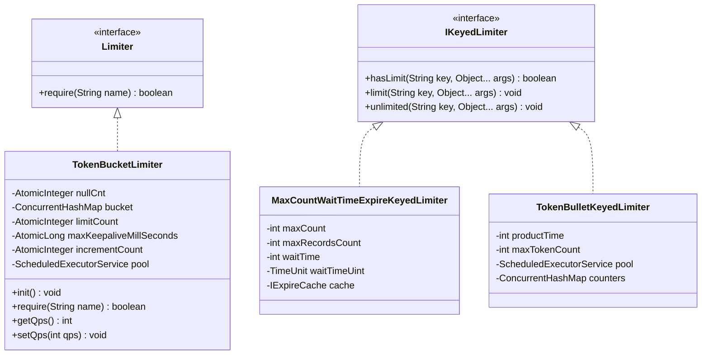
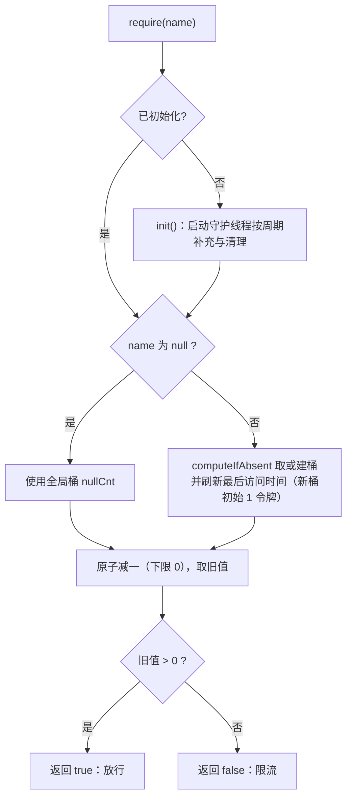

# i2f-limit

> **按 key 限流器模块**：全模块 5 个源文件约 350 行、零测试，提供**两条相互独立**的限流契约线与三个实现——新线（2024/8）是单动词接口 `Limiter`（`boolean require(String name)`，按名「请求令牌、即问即答」）与实现 `TokenBucketLimiter`（按 key 内存令牌桶：单守护线程定时补充令牌、封顶桶容量、闲置超 30 分钟自动清理、`null` 走全局桶，另有 `getQps`/`setQps` 便捷换算）；旧线（2022/5）是三动词接口 `IKeyedLimiter`（`hasLimit`/`limit`/`unlimited`）与两个实现：`MaxCountWaitTimeExpireKeyedLimiter`（「最大失败次数 + 等待期」的登录锁定式限流，由本地过期缓存驱动、过期即自解锁）与 `TokenBulletKeyedLimiter`（按 key 令牌桶，构造即启动定时补充）。依赖 `i2f-clock-impl`（`SystemClock` 缓存时间戳）与 `i2f-cache`（本地过期缓存），lombok 真实使用；全仓暂无源码级消费者，仅被聚合模块引入。

## 模块路径

- `i2f-jdk/i2f-limit`

## 模块依赖

| GroupId | ArtifactId | Scope | Optional | 来源 | 用途 |
| --- | --- | --- | --- | --- | --- |
| i2f.turbo | i2f-clock-impl | compile | 否 | 内部 | `TokenBucketLimiter` 统一以 `SystemClock.currentTimeMillis()` 取时间戳（1ms 定时刷新的缓存时钟，平均滞后约 3ms、峰值 400ms，详见 i2f-clock-impl），用于令牌补充与闲置键清理判定 |
| i2f.turbo | i2f-cache | compile | 否 | 内部 | `MaxCountWaitTimeExpireKeyedLimiter` 在字段默认值处组合 `ObjectExpireCacheWrapper<>(new MapCache<>())` 得到「本地 + 可过期」默认缓存（经 `i2f-cache` 传递依赖到 `i2f-cache-std` 接口层） |
| org.projectlombok | lombok | provided | 是（根 POM `dependencyManagement` 统一托管） | 三方 | `@Data`/`@NoArgsConstructor`：`TokenBucketLimiter` 与 `MaxCountWaitTimeExpireKeyedLimiter` 的 getter/setter 与无参构造，**真实使用** |

- 父 POM 为 `i2f.turbo:i2f-jdk:1.0-jdk8`；`i2f-clock-impl`/`i2f-cache` 版本由根 POM 统一托管。
- `build` 声明 `maven-assembly-plugin`（继承根 POM `pluginManagement` 中 `jar-with-dependencies` 配置，`package` 阶段执行 `single` 目标）——项目打包惯例，可产出携带依赖的 fat-jar。
- 零三方**运行期**依赖（lombok 仅编译期）；不依赖 `i2f-lifecycle` 等其它 i2f 模块。

## 模块设计

模块内实际并存**两代、互不相关的限流抽象**：2022 年的三动词 `IKeyedLimiter` 家族与 2024 年的单动词 `Limiter`；两者无继承/适配关系，各自独立使用：



### 1. 新线：`Limiter` + `TokenBucketLimiter`（按名令牌桶）

```java
public interface Limiter {
    boolean require(String name);   // 请求一次通行：true=放行，false=限流
}
```

`TokenBucketLimiter`（`@Data @NoArgsConstructor`，另有 `(limitCount)` 与 `(limitCount, timePeriod, timeUnit)` 两个构造器）的核心结构与默认值：

| 字段 | 默认值 | 说明 |
| --- | --- | --- |
| `nullCnt` | 1 | `name == null` 时使用的**全局桶**当前令牌数 |
| `bucket` | 空 | `ConcurrentHashMap<key, (可用令牌数, 最后访问时间戳)>` 按名分桶 |
| `limitCount` | 300 | 每桶令牌上限（补充封顶值） |
| `incrementCount` | 1 | 每个补充周期每桶增加的令牌数 |
| `timePeriod` / `timeUnit` | 1 / `SECONDS` | 补充周期（调度取 `max(1, timePeriod)`，单位空则回退秒） |
| `maxKeepaliveMillSeconds` | 30 分钟 | 闲置键的存活清理阈值 |
| `pool` | 单线程调度池 | 显式 `daemon` 线程 `limit-thread`（`ScheduledThreadPoolExecutor(1)`，任务提交后才真正起线程） |

`require(name)` 一次调用完成「惰性初始化 → 取桶 → 原子扣减 → 判定」：



- **补充与清理任务**：`init()` 经 `initialed.getAndSet(true)` 幂等保护，以初始延迟 0、周期 `max(1, timePeriod)` 提交 `scheduleAtFixedRate`；每个周期对 `bucket` 中每个桶与全局桶 `nullCnt` 增加 `incrementCount` 个令牌（封顶 `limitCount`），并将「当前时间 − 最后访问时间 > `maxKeepaliveMillSeconds`」的闲置键移除（`nullCnt` 永不清理）。
- **线程安全**：桶用 `ConcurrentHashMap` + `AtomicInteger`/`AtomicLong` 组合，`require()` 的「扣减 + 判定」为单次原子操作（无检查-消费竞态）。
- **新桶初始 1 令牌**：新键首次 `require()` 即放行一次，后续突发能力随补充逐周期累积至 `limitCount`。
- **QPS 换算**：`getQps()` 返回「每周期增量 ÷ 周期秒数」的当前速率，`setQps(qps)` 反算增量——二者的适用边界见「模块瑕疵或错误」第 1、2 条。
- **时间源**：所有时间戳均取 `i2f.clock.SystemClock`（缓存时钟，避免高频 native 系统调用开销），对补充/清理判定足够。

### 2. 旧线：`IKeyedLimiter` 三动词 + 两个实现

```java
public interface IKeyedLimiter {
    boolean hasLimit(String key, Object... args);   // 是否已被限流
    void limit(String key, Object... args);         // 进行/记录一次限流
    void unlimited(String key, Object... args);     // 解除限流
}
```

可变参 `args`（限流的其他参数）为扩展预留，两个实现均未使用。

**`MaxCountWaitTimeExpireKeyedLimiter`：最大次数 + 等待期（滑动锁定）**

- 面向「多次失败后锁定一段时间」场景（源码注释示例：多次登录失败后限制登录）。
- 计数存放于本地过期缓存 `ObjectExpireCacheWrapper<>(new MapCache<>())`（字段默认值；`@Data` 生成的 `setCache` 可整体替换为分布式缓存实现），缓存值为十进制字符串。
- `hasLimit(key)`：计数 `>= maxCount` → 已限流；`limit(key)`：计数 +1（封顶 `max(maxCount, maxRecordsCount)`，阈值之上的余量借 `maxRecordsCount` 保留供统计），并**以 `waitTime` 重新写入缓存**——每次失败都会重置等待期；`unlimited(key)`：移除键即解除。
- 全部公开方法 `synchronized`（`getKeyCount`/`setKeyCount` 亦含），叠加过期缓存内部的 `ReentrantLock`。

**`TokenBulletKeyedLimiter`：按 key 令牌桶（构造即启动）**

- 3 个构造器均在建对象时调用 `init()` 启动补充任务：`(productTime, unit)`、`(productTime, unit, maxTokenCount)`、`(productTime, unit, maxTokenCount, pool)`；每 `productTime` 给每个已存在的键 +1 个令牌（封顶 `maxTokenCount`，默认 `Integer.MAX_VALUE`）。
- `hasLimit(key)`：**键从未出现过 → false（默认放行）**；否则「当前令牌数 `<= 0`」为已限流。
- `limit(key)`：键不存在时先建为 0 令牌再判断——仅「令牌数 `> 0`」才真正扣减；因此新键首次 `limit()` 不扣令牌，但会令该键此后立即处于「0 令牌」状态，直到补充任务产出。
- `unlimited(key)`：移除键。
- 默认 `pool` 用 `Executors.newSingleThreadScheduledExecutor()`（**非守护线程**），也可由外部注入。

### 3. 包结构

| 包 | 类型 | 职责 |
| --- | --- | --- |
| `i2f.limit` | `Limiter` | 单动词限流契约（require） |
| `i2f.limit.impl` | `TokenBucketLimiter` | 按名令牌桶实现（定时补充 + 闲置清理 + 全局桶） |
| `i2f.limit.limiter` | `IKeyedLimiter` | 三动词限流契约（hasLimit/limit/unlimited） |
| | `MaxCountWaitTimeExpireKeyedLimiter` | 最大次数 + 等待期锁定实现（过期缓存驱动） |
| | `TokenBulletKeyedLimiter` | 按 key 令牌桶实现（定时补充） |

## 模块目的

- 把「频率控制」与「失败锁定」沉淀为**零三方运行期依赖**的可复用实现：入口按用户/IP/接口维度限流（`require`），登录等敏感操作按失败次数锁定（`hasLimit`/`limit`/`unlimited`）。
- 提供两种互补的判定语义：**原子取令牌**（`require` 单调用即检查+消费）与**三段式显式控制**（检查 / 记录 / 解除分开，便于穿插业务逻辑与统计）。
- 限流数据默认全部驻留本地内存，不引入 Redis 等外部依赖，适合单机/工具化场景（可经 `setCache` 等扩展为分布式，见「可拓展方向」）。

## 模块功能

| 类型 | 成员 | 说明 |
| --- | --- | --- |
| `Limiter` | `require(String name)` | 请求一次通行；`true` 放行、`false` 限流；`null` 名使用全局桶 |
| `TokenBucketLimiter` | `require` / `init` | 惰性或手动初始化；按名原子取令牌 |
| | `getQps` / `setQps` / `calcIncrementCountByQps` | QPS 与周期增量的便捷换算（边界见瑕疵第 1、2 条） |
| | setter（`@Data`） | 桶上限、补充周期、增量、闲置阈值等全部可运行期调整 |
| `IKeyedLimiter` | `hasLimit`/`limit`/`unlimited` | 检查 / 记录 / 解除三动词 |
| `MaxCountWaitTimeExpireKeyedLimiter` | 实现三动词 | 失败计数（封顶 `max(maxCount,maxRecordsCount)`）+ 等待期滑动续期；`getKeyCount`/`setKeyCount` 暴露计数读写 |
| | `getCache`/`setCache` | 过期缓存可替换（默认本地 `MapCache` + 过期包装） |
| `TokenBulletKeyedLimiter` | 实现三动词 + `init` | 构造即启动周期补充；外部可注入 `ScheduledExecutorService` |

## 模块主要使用方法

**1）`TokenBucketLimiter`：按名限流（原子判定）**

```java
// 桶容量 100，每 1 秒补充 50 个令牌 -> 稳态约 50 QPS、允许突发到 100
TokenBucketLimiter limiter = new TokenBucketLimiter(100, 1, TimeUnit.SECONDS);
limiter.setQps(50);          // 便捷换算：仅「秒 + 周期 1」时严格等价，见瑕疵第 1 条

if (limiter.require("api:/order")) {
    // 放行
} else {
    // 限流：返回 false 时由调用方决定拒绝/排队/降级
}

limiter.require(null);       // null 走全局桶：不分维度、全局限流
```

**2）`MaxCountWaitTimeExpireKeyedLimiter`：登录失败锁定**

```java
MaxCountWaitTimeExpireKeyedLimiter limiter = new MaxCountWaitTimeExpireKeyedLimiter();
limiter.setMaxCount(5);                      // 失败 5 次触发锁定
limiter.setMaxRecordsCount(10);              // 计数最多记录到 10（供统计/审计）
limiter.setWaitTime(15);                     // 锁定等待 15 分钟
limiter.setWaitTimeUint(TimeUnit.MINUTES);   // 必设：否则 limit() 内部 NPE，见瑕疵第 5 条

String key = "login:" + phone;
if (limiter.hasLimit(key)) {
    throw new IllegalStateException("失败次数过多，请稍后再试");
}
try {
    doLogin(phone, password);
} catch (Exception e) {
    limiter.limit(key);      // 失败记一次；每次调用都会把等待期重置为 15 分钟（滑动窗口）
    throw e;
}
limiter.unlimited(key);      // 登录成功：清零并解除
```

**3）`TokenBulletKeyedLimiter`：按 key 令牌桶**

```java
// 每 500ms 产生 1 个令牌，最多攒 10 个；也可注入外部线程池
TokenBulletKeyedLimiter limiter = new TokenBulletKeyedLimiter(500, TimeUnit.MILLISECONDS, 10);

String key = "ip:10.0.0.1";
if (!limiter.hasLimit(key)) {   // 键从未出现默认放行
    limiter.limit(key);         // 有令牌才真正扣减；新键首调不扣，但会立即进入 0 令牌状态
    // 放行
}

limiter.unlimited(key);         // 键不再使用时应显式移除，否则 counters 常驻
```

**注意事项：**

- `TokenBucketLimiter.require()` 为**单次原子**的检查+消费；`IKeyedLimiter` 的 `hasLimit()`+`limit()` 是两次独立调用，中间存在竞态窗口，严格场景需调用方自加同步（见瑕疵第 8 条）。
- 三个实现都没有「停止/销毁」方法：`TokenBucketLimiter` 的线程为守护线程、闲置键可被清理；`TokenBulletKeyedLimiter` 的默认线程池为**非守护**线程且无法停止，会影响 JVM 退出时机（见瑕疵第 4 条）。
- `MaxCountWaitTimeExpireKeyedLimiter` 的锁定窗口是**滑动**的：锁定期间若仍调用 `limit()`，等待期会不断续期（见瑕疵第 7 条）。
- 所有实现的状态都在本地内存中，多实例部署时各实例独立计数。
- `TokenBucketLimiter` 需理解「新桶初始 1 令牌」与「补充封顶 `limitCount`」：它同时限制突发量与稳态速率。

## 下游消费方一览

**全仓暂无源码级消费者**（检索 `i2f.limit` 包引用与四个类名，均只命中模块自身），当前仅有三处 POM 注册：

| 注册处 | 说明 |
| --- | --- |
| `i2f-jdk/pom.xml` | 作为 `i2f-jdk` 聚合模块的子模块（L108） |
| `i2f-jdk-all/pom.xml` | 纳入全仓 fat-jar 依赖清单（L381），随聚合包整体分发 |
| 根 `pom.xml` | `dependencyManagement` 统一托管版本（L576） |

另：`i2f-cache-std`/`i2f-cache` 的索引条目提及「`i2f-swl`/`i2f-limit`/各 `*-starter` 广泛消费」其缓存接口——本模块确经 `i2f-cache` 传递依赖到接口层，缓存的消费点在模块内部（`MaxCountWaitTimeExpireKeyedLimiter` 组合 `MapCache` + `ObjectExpireCacheWrapper`）。

## 模块特性总结

- **两条契约线**：单动词 `require(name)`（原子、即问即答）与三动词 `hasLimit`/`limit`/`unlimited`（显式分段控制），面向不同编排习惯。
- **按 key 分桶限流**：`null` 键提供天然「全局桶」；key 维度（用户/手机号/IP/接口）由调用方自由约定。
- **定时补充 + 封顶**：两个令牌桶实现均以「每周期 +N、封顶容量」的朴素令牌桶实现平滑限流并允许突发。
- **闲置清理（仅 `TokenBucketLimiter`）**：超 `maxKeepaliveMillSeconds`（默认 30 分钟）未访问的键自动移除，防止按用户维度分桶时内存无限增长。
- **过期缓存驱动锁定（`MaxCount...`）**：借 `i2f-cache` 的 TTL 语义实现「自解锁」——无守护线程、无定时器，等待期一到计数自动失效、自动放行。
- **声明依赖全部真实使用**：`i2f-clock-impl`/`i2f-cache`/`lombok` 均有实际使用点（无冗余声明）。
- **零三方运行期依赖、零测试、零源码级消费者**（备而未用/待集成状态）。

## 可拓展方向

- 统一两条契约线：为 `TokenBucketLimiter` 补 `IKeyedLimiter` 适配（三动词委托 `require`/`unlimited`），或抽 `AbsLimiter` 门面统一语义。
- 增加「停止/销毁」能力（停止补充任务、`shutdown` 线程池），与 `i2f-lifecycle` 的 `create`/`destroy` 契约对接；修正 `TokenBulletKeyedLimiter` 默认线程池为非守护或提供 `AutoCloseable`。
- 分布式限流：`MaxCount...` 的 `setCache` 直接替换为 Redis/分布式缓存实现即可获得集群维度计数；`TokenBucketLimiter` 的 `bucket` 亦可对照改造。
- 修正 QPS 换算并补充滑动窗口、漏桶等更多算法；为限流触发补充回调/事件（可结合 `i2f-event`）。
- 补充单元测试：令牌补充节奏、并发扣减、滑动续期、清理阈值等语义目前零验证。

## 模块瑕疵或错误

以下为通读本模块 5 个文件（共约 350 行）源码并核对 i2f-cache/i2f-clock-impl 依赖行为后如实记录的内容：

1. **`setQps`/`calcIncrementCountByQps` 换算公式错误**：实现为 `unit.convert(qps, TimeUnit.SECONDS)`，等价于「qps 秒换算成当前单位」，未乘 `timePeriod`，隐含假设 `timePeriod = 1` 且单位必须是**秒**——正确公式应为 `qps × unit.toSeconds(timePeriod)`。对分钟单位会向下取整为 0 再被 `max(1, ...)` 抬回 1（目标 10 QPS 实际只补充 1 令牌/分钟）；对毫秒单位会把增量放大为 `qps × 1000`。且与 `getQps()`（速率 = 增量 ÷ 周期秒数，方向正确）**不互逆**。
2. **`getQps()` 亚秒周期除零**：`incrementCount / unit.toSeconds(timePeriod)` 中，若周期小于 1 秒（如 `new TokenBucketLimiter(10, 100, TimeUnit.MILLISECONDS)`），`MILLISECONDS.toSeconds(100) = 0` → 整数除零抛 `ArithmeticException`；即便不除零，整数除法也会截断（如 1 令牌/2 秒 → 0 QPS）。
3. **`TokenBulletKeyedLimiter` 补充任务 `synchronized(this)` 锁错对象**：定时 `Runnable` 的 `run()` 中 `synchronized (this)` 锁的是**匿名 Runnable 实例**，与 `limit()`/`unlimited()`（锁限流器实例）不构成互斥；并发安全实际由 `AtomicInteger`+`ConcurrentHashMap` 兜底，且补充时「先 `get()` 判上限再 `incrementAndGet()`」为非原子复合，并发下可能轻微越过 `maxTokenCount`。
4. **`TokenBulletKeyedLimiter` 线程池多处陷阱**：默认 `Executors.newSingleThreadScheduledExecutor()` 线程为**非守护线程**，且类中无任何 `shutdown`/取消手段（`init()` 不保存 `ScheduledFuture`），实例创建后即阻挡 JVM 退出；`init()` 公开且无幂等保护，重复调用（构造之外手工再调）会叠加多个补充任务加速令牌产生；`counters` 无闲置清理（对比 `TokenBucketLimiter` 的 30 分钟清理），只增不减。
5. **`MaxCountWaitTimeExpireKeyedLimiter` 配置陷阱**：`waitTimeUint` 无默认值、类只有 `@NoArgsConstructor`（无全参构造），未通过 setter 设置时 `limit()` 会在过期缓存内部 `timeUnit.toMillis(...)` 处 NPE；`waitTime` 默认 0 时写入即过期（计数几乎立即失效）；字段名拼写 `waitTimeUint`（Unit 误拼），`@Data` 生成的 `setWaitTimeUint` 继承该拼写。
6. **`TokenBulletKeyedLimiter.hasLimit` 并发下可能 NPE**：`containsKey(key)` 与 `get(key)` 为两步非原子操作，键在两步之间被并发 `unlimited(key)` 移除时，`counters.get(key)` 返回 `null` 再 `.get()` 即 NPE。
7. **锁定窗口为滑动续期**：`limit()` 每次都把等待期重置——锁定后再触发 `limit()` 会无限延长锁定；若业务在「已限流」分支仍调用 `limit()`（如无条件记录失败），实际锁定时间可能远超配置的 `waitTime`。
8. **三段式无原子性**：`hasLimit()` 与 `limit()` 是两次独立同步调用，二者之间无检查-消费原子性，并发下「检查通过 → 记录」之间额度可能已被其他线程耗尽；与 `TokenBucketLimiter.require()` 的单调用原子语义强弱不同，接口上无任何提示。
9. **静默与默认放行取向**：`MaxCountWaitTimeExpireKeyedLimiter.getKeyCount` 对解析异常空 catch 静默返回 `null`（计数被静默当作 0）；`TokenBulletKeyedLimiter.hasLimit` 对未登记键返回 `false`（默认放行）——与「默认限流」的安全取向相反，首次/未知键判定依赖调用方理解。
10. **`TokenBucketLimiter.setPool` 是事实陷阱**：`@Data` 生成的 `setPool` 只能替换字段引用，无法迁移已提交的补充任务——若在 `init()` 之后换池，任务仍在旧池，而 `init()` 的 `initialed` 幂等锁又使新池永远不会被调度（仅首次 `init()` 前设置才有效）。
11. **零测试**：模块无测试目录，而限流语义（补充节奏、并发扣减、滑动续期、清理阈值、亚秒周期、锁错对象等）复杂度显著高于常规工具类，上述缺陷均无测试兜底。
